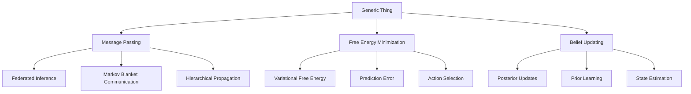
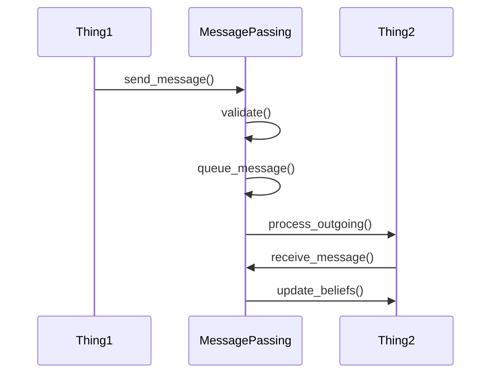
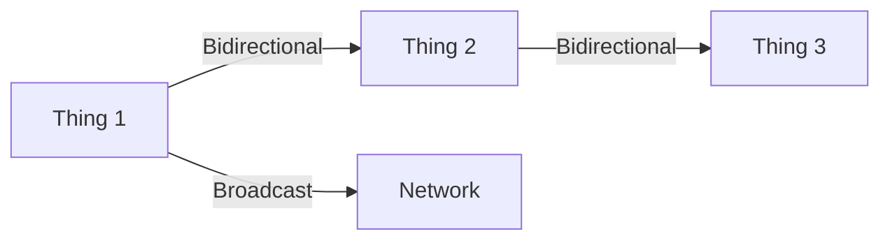
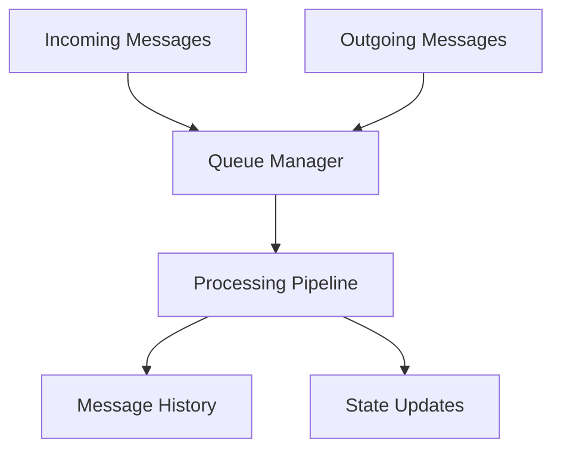
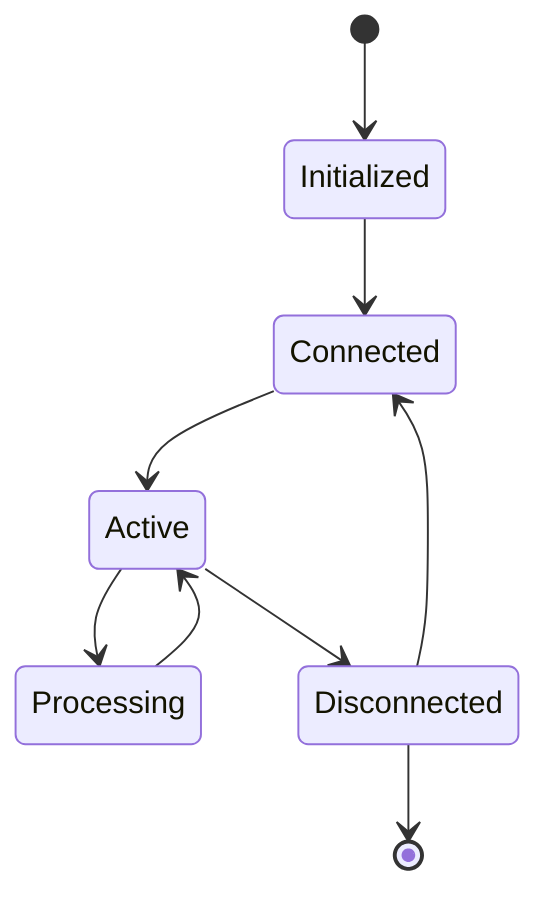
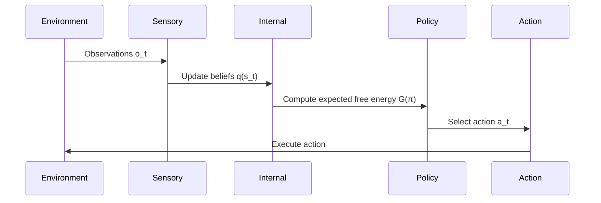

# Generic Thing

A foundational implementation of [[Active Inference]] principles through a generic "Thing" that can engage in message passing, belief updating, and free energy minimization.



## Overview

The Generic Thing serves as a base implementation for studying and developing [[Active Inference]] agents in a modular, extensible way. It implements core concepts from the [[Free Energy Principle]] and provides a framework for building more specialized cognitive agents.

### Mathematical Foundation

The Generic Thing implements the core equation of the Free Energy Principle:

\[
F = \mathbb{E}_{q(s)}[\log q(s) - \log p(o,s)]
\]

Where:
- \( F \) is the variational free energy
- \( q(s) \) is the approximate posterior over hidden states
- \( p(o,s) \) is the generative model
- \( o \) represents observations
- \( s \) represents hidden states

## Core Components

### [[Message Passing]]

The `message_passing.py` module implements a sophisticated message passing system that enables distributed inference and belief propagation.

#### Architecture



#### Key Classes

##### Message
```python
@dataclass
class Message:
    source_id: str        # Origin Thing ID
    target_id: str        # Destination Thing ID
    content: Dict         # Message payload
    message_type: str     # Message classification
    timestamp: datetime   # Message creation time
```

##### MessagePassing
Core functionality:
```python
class MessagePassing:
    def send_message(self, message: Message)
    def receive_message(self, message: Message)
    def process_outgoing(self)
    def filter_messages(self, target_id: str, message_type: str)
```

#### Connection Management



Features:
- **Bidirectional Connections**: Automatic two-way communication channels
- **Connection Validation**: Runtime verification of connection integrity
- **Dynamic Topology**: Support for runtime connection modifications

#### Message Queue System

Internal queue structure:


Queue Properties:
- Thread-safe implementation
- FIFO processing
- Priority handling
- Message persistence

### [[Thing Interactions]]

The interaction system manages the relationships and communication between Things.

#### State Machine



#### Interaction Patterns

1. **Direct Communication**
   ```python
   thing1.send_direct_message(thing2, content)
   ```

2. **Broadcast**
   ```python
   thing1.broadcast_message(content)
   ```

3. **Group Communication**
   ```python
   thing1.send_group_message(group_id, content)
   ```

### [[Free Energy Minimization]]

Implementation of the variational free energy minimization process.

#### Mathematical Framework

The free energy is decomposed into:

\[
F = \underbrace{\mathbb{E}_{q(s)}[\log q(s) - \log p(s|o)]}_\text{Complexity} - \underbrace{\log p(o)}_\text{Accuracy}
\]

##### Belief Updating Equations

1. **Perception**:
\[
\frac{\partial F}{\partial \mu} = -\kappa_\mu \cdot \nabla_\mu F
\]

2. **Action**:
\[
\frac{\partial F}{\partial a} = -\kappa_a \cdot \nabla_a F
\]

Where:
- \( \mu \) represents internal states
- \( a \) represents actions
- \( \kappa \) are learning rates

#### Implementation Details

```python
class FreeEnergyMinimizer:
    def __init__(self):
        self.learning_rate = 0.01
        self.convergence_threshold = 1e-6
        
    def minimize(self, initial_state):
        """Gradient descent on variational free energy"""
        current_state = initial_state
        while not self.converged:
            gradient = self.compute_gradient(current_state)
            current_state = self.update_state(current_state, gradient)
```

##### Gradient Computation

```python
def compute_gradient(self, state):
    """
    Compute the gradient of F with respect to state variables
    """
    # Compute complexity term
    complexity_gradient = self.compute_complexity_gradient(state)
    
    # Compute accuracy term
    accuracy_gradient = self.compute_accuracy_gradient(state)
    
    return complexity_gradient + accuracy_gradient
```

## Analytical Foundations

### [[Variational Inference]]

The variational framework implements:

#### Evidence Lower Bound (ELBO)

\[
\text{ELBO} = \mathbb{E}_{q(s)}[\log p(o|s)] - \text{KL}[q(s)||p(s)]
\]

#### Implementation

```python
class VariationalInference:
    def compute_elbo(self, q_distribution, p_distribution):
        expected_likelihood = self.compute_expected_likelihood(
            q_distribution, p_distribution)
        kl_divergence = self.compute_kl_divergence(
            q_distribution, p_distribution)
        return expected_likelihood - kl_divergence
```

### [[Markov Blankets]]

Implementation of statistical independence relationships through Markov partitioning:

```mermaid
graph TD
    subgraph External World
        A[External States μ]
    end
    subgraph Markov Blanket
        B[Sensory States s]
        D[Active States a]
    end
    subgraph Internal Model
        C[Internal States η]
        E[Beliefs q(s)]
    end
    A --> B
    B --> C
    C --> D
    D --> A
    C --> E
    E --> D
```

#### Markov Blanket Mathematics

The Markov blanket formulation follows:

\[
p(η, s, a, μ) = p(η|s)p(s|μ)p(a|η)p(μ|a)
\]

Where:
- \( η \) represents internal states
- \( s \) represents sensory states
- \( a \) represents active states
- \( μ \) represents external states

##### Conditional Independence Properties

1. **Internal-External Separation**:
\[
p(η|s,a,μ) = p(η|s,a)
\]

2. **Information Flow**:
\[
\frac{\partial F}{\partial η} = f(s,a)
\]

#### Implementation Details

```python
class MarkovBlanket:
    def __init__(self,
                 internal_dim: int,
                 sensory_dim: int,
                 active_dim: int,
                 external_dim: int):
        """Initialize Markov blanket structure.
        
        Args:
            internal_dim: Dimension of internal states
            sensory_dim: Dimension of sensory states
            active_dim: Dimension of active states
            external_dim: Dimension of external states
        """
        self.internal_states = np.zeros(internal_dim)
        self.sensory_states = np.zeros(sensory_dim)
        self.active_states = np.zeros(active_dim)
        self.external_states = np.zeros(external_dim)
        
    def update_states(self,
                     observations: np.ndarray,
                     actions: np.ndarray) -> None:
        """Update blanket states based on observations and actions."""
        # Update sensory states from observations
        self.sensory_states = self.compute_sensory_states(observations)
        
        # Update internal states through inference
        self.internal_states = self.infer_internal_states()
        
        # Update active states based on policy
        self.active_states = self.compute_active_states(actions)
```

### [[Active Inference Implementation]]

The Generic Thing implements active inference following the discrete-time formulation:

#### Perception and Action Cycle



#### Mathematical Framework

1. **State Inference (Perception)**:
\[
F_t = \text{KL}[q(s_t)||p(s_t|o_{1:t})] - \ln p(o_t|o_{1:t-1})
\]

2. **Policy Selection**:
\[
P(\pi) = \sigma(-\gamma G(\pi)) \text{ where } G(\pi) = \sum_\tau F_{\tau}(\pi)
\]

3. **Action Selection**:
\[
a_t^* = \argmin_a \mathbb{E}_{q(s_t)}[F_{t+1}(a)]
\]

#### Implementation

```python
class ActiveInferenceEngine:
    def __init__(self,
                 free_energy: FreeEnergy,
                 markov_blanket: MarkovBlanket,
                 learning_rate: float = 0.01,
                 temperature: float = 1.0):
        self.free_energy = free_energy
        self.markov_blanket = markov_blanket
        self.lr = learning_rate
        self.temp = temperature
        
    def perception_step(self, observation: np.ndarray) -> None:
        """Perform perceptual inference."""
        # Update sensory states
        self.markov_blanket.sensory_states = observation
        
        # Minimize free energy for internal states
        self.free_energy.minimize(
            internal_state=self.markov_blanket.internal_states,
            external_state=self.markov_blanket.external_states,
            observation=observation
        )
        
    def policy_selection(self, policies: List[np.ndarray]) -> np.ndarray:
        """Select policy using expected free energy."""
        G = np.array([
            self.free_energy.compute_expected_free_energy(
                internal_state=self.markov_blanket.internal_states,
                external_state=self.markov_blanket.external_states,
                action=policy
            )
            for policy in policies
        ])
        
        # Softmax policy selection
        P = softmax(-self.temp * G)
        return P
        
    def action_selection(self, policies: List[np.ndarray]) -> np.ndarray:
        """Select optimal action."""
        P = self.policy_selection(policies)
        action_idx = np.random.choice(len(policies), p=P)
        return policies[action_idx]
```

### [[Free Energy Optimization]]

The Generic Thing implements sophisticated free energy optimization techniques:

#### Optimization Framework

1. **Gradient-Based Methods**:
```python
class GradientOptimizer:
    def __init__(self,
                 learning_rate: float = 0.01,
                 momentum: float = 0.9):
        self.lr = learning_rate
        self.momentum = momentum
        self.velocity = None
        
    def step(self, params: np.ndarray, grads: np.ndarray) -> np.ndarray:
        """Perform optimization step with momentum."""
        if self.velocity is None:
            self.velocity = np.zeros_like(params)
            
        self.velocity = self.momentum * self.velocity - self.lr * grads
        return params + self.velocity
```

2. **Natural Gradient Methods**:
```python
class NaturalGradientOptimizer:
    def __init__(self,
                 learning_rate: float = 0.01,
                 damping: float = 1e-4):
        self.lr = learning_rate
        self.damping = damping
        
    def compute_fisher(self, model: Any, params: np.ndarray) -> np.ndarray:
        """Compute Fisher Information Matrix."""
        # Implementation details...
        pass
        
    def step(self, params: np.ndarray, grads: np.ndarray) -> np.ndarray:
        """Perform natural gradient step."""
        fisher = self.compute_fisher(self.model, params)
        natural_grad = np.linalg.solve(
            fisher + self.damping * np.eye(fisher.shape[0]),
            grads
        )
        return params - self.lr * natural_grad
```

#### Advanced Optimization Techniques

1. **Hierarchical Optimization**:
```python
class HierarchicalOptimizer:
    def __init__(self,
                 levels: int,
                 learning_rates: List[float]):
        self.levels = levels
        self.learning_rates = learning_rates
        self.optimizers = [
            GradientOptimizer(lr)
            for lr in learning_rates
        ]
        
    def step(self,
            params: List[np.ndarray],
            grads: List[np.ndarray]) -> List[np.ndarray]:
        """Perform hierarchical optimization step."""
        updated_params = []
        for level in range(self.levels):
            updated_params.append(
                self.optimizers[level].step(
                    params[level],
                    grads[level]
                )
            )
        return updated_params
```

## Testing Infrastructure

### Test Categories

1. **Unit Tests**
   - Message passing functionality
   - Free energy computation
   - Belief updates
   - State management

2. **Integration Tests**
   - Multi-Thing interactions
   - System-wide belief propagation
   - Free energy minimization convergence

3. **Performance Tests**
   - Message throughput
   - Computation efficiency
   - Memory usage
   - Scaling characteristics

### Test Configuration

```yaml
test_config:
  message_passing:
    timeout: 5000ms
    retry_count: 3
    batch_size: 100
  
  free_energy:
    convergence_threshold: 1e-6
    max_iterations: 1000
    learning_rate: 0.01
```

## Advanced Usage

### Complex Interaction Patterns

```python
# Create a network of Things
network = ThingNetwork()

# Add Things with specific roles
sensor = SensorThing("sensor1")
processor = ProcessorThing("processor1")
actuator = ActuatorThing("actuator1")

# Configure interaction patterns
network.add_perception_path(sensor, processor)
network.add_action_path(processor, actuator)

# Start active inference
network.run_inference()
```

### Custom Message Types

```python
@dataclass
class CustomMessage(Message):
    priority: int
    metadata: Dict[str, Any]
    
    def validate(self):
        """Custom validation logic"""
        pass
```

### Advanced Free Energy Minimization

```python
class CustomFreeEnergyMinimizer(FreeEnergyMinimizer):
    def __init__(self):
        super().__init__()
        self.optimization_method = "natural-gradient"
        
    def compute_natural_gradient(self):
        """Implement natural gradient descent"""
        pass
```

## Performance Optimization

### Message Passing Optimization

1. **Queue Management**
   - Batch processing
   - Priority queuing
   - Message coalescence

2. **Memory Management**
   - Message pooling
   - Content deduplication
   - Efficient serialization

### Computational Optimization

1. **Parallel Processing**
   - Multi-threaded message handling
   - Distributed belief updates
   - Parallel free energy minimization

2. **Numerical Optimization**
   - Efficient matrix operations
   - Gradient approximation
   - Adaptive step sizes

## Deployment

### System Requirements

- Python 3.8+
- 4GB RAM minimum
- Multi-core processor recommended

### Installation

```bash
# Create virtual environment
python -m venv generic_thing_env

# Activate environment
source generic_thing_env/bin/activate

# Install dependencies
pip install -r requirements.txt
```

### Running Tests

The Generic Thing comes with a comprehensive test suite that includes unit tests, integration tests, and performance benchmarks. The tests are managed using pytest and include coverage reporting.

#### Quick Start

To run the entire test suite:

```bash
# From the Generic_Thing directory
pytest

# Or use the convenience script
python3 tests/run_tests.py
```

#### Test Categories

You can run specific test categories using pytest markers:

```bash
# Run only unit tests
pytest -m unit

# Run only integration tests
pytest -m integration

# Run only visual tests (generates plots)
pytest -m visual

# Skip slow tests
pytest -m "not slow"
```

#### Test Reports

The test suite generates several reports:

- HTML test report: `reports/test_results/report.html`
- Coverage report: `htmlcov/index.html`
- Benchmark results: `.benchmarks/`

#### Running Benchmarks

For performance benchmarking:

```bash
# Run all benchmarks
python tests/run_benchmarks.py

# Run specific benchmark
pytest tests/test_message_passing.py::TestMessagePassing::test_throughput_benchmark
```

#### Continuous Integration

The test suite is automatically run on:
- Every pull request
- Main branch commits
- Release tags

Test requirements:
- Python 3.8+
- All dependencies from requirements.txt
- ~4GB RAM for full test suite
- ~10GB disk space for reports and coverage data

### Configuration

```yaml
generic_thing:
  message_passing:
    queue_size: 1000
    batch_size: 50
    timeout: 5000
  
  free_energy:
    learning_rate: 0.01
    convergence_threshold: 1e-6
    max_iterations: 1000
```

## API Reference

### Core Classes

#### Thing
```python
class Thing:
    """Base class for all Things"""
    def __init__(self, id: str)
    def update_beliefs(self, observation: np.ndarray)
    def minimize_free_energy(self)
    def get_action(self) -> np.ndarray
```

#### MessagePassing
```python
class MessagePassing:
    """Message passing system"""
    def send_message(self, message: Message)
    def receive_message(self, message: Message)
    def process_outgoing(self)
```

#### FreeEnergyMinimizer
```python
class FreeEnergyMinimizer:
    """Free energy minimization"""
    def minimize(self, initial_state: np.ndarray)
    def compute_gradient(self, state: np.ndarray)
```

## Development Roadmap

### Version 1.0
- Basic message passing
- Simple free energy minimization
- Core Thing functionality

### Version 2.0
- Advanced message types
- Hierarchical Thing structures
- Improved optimization methods

### Version 3.0
- Distributed processing
- Advanced learning algorithms
- Real-time adaptation

## Contributing

### Development Process

1. Fork repository
2. Create feature branch
3. Implement changes
4. Add tests
5. Submit pull request

### Code Style

Follow PEP 8 guidelines:
```python
# Good
def calculate_free_energy(self, state: np.ndarray) -> float:
    """
    Calculate variational free energy.
    
    Args:
        state: Current state vector
        
    Returns:
        float: Computed free energy
    """
    pass
```

## Extended References

### Mathematical Foundations

1. [[Free Energy Principle]]
   - Friston, K. (2010). The free-energy principle: a unified brain theory?
   - Parr, T., & Friston, K. (2019). Generalised free energy and active inference.
   - Buckley, C. L., et al. (2017). The free energy principle for action and perception.

2. [[Active Inference]]
   - Da Costa, L., et al. (2020). Active inference on discrete state-spaces.
   - Friston, K., et al. (2017). Active inference: A process theory.
   - Sajid, N., et al. (2021). Active inference: Demystified and compared.

3. [[Message Passing]]
   - Winn, J., & Bishop, C. M. (2005). Variational message passing.
   - Yedidia, J. S., et al. (2003). Understanding belief propagation.
   - Minka, T. P. (2001). Expectation propagation for approximate Bayesian inference.

### Implementation Resources

1. [[Optimization Methods]]
   - Martens, J. (2014). New insights and perspectives on the natural gradient method.
   - Pascanu, R., & Bengio, Y. (2013). Natural gradient revisited.
   - Khan, M. E., & Lin, W. (2017). Conjugate-computation variational inference.

2. [[Software Design]]
   - Clean Architecture in Python
   - Design Patterns for Scientific Computing
   - High-Performance Python

## Community and Support

### Getting Help

1. **Documentation**
   - [API Reference](docs/api.md)
   - [Tutorials](docs/tutorials/)
   - [Examples](examples/)

2. **Community Resources**
   - [Discussion Forum](https://forum.example.com)
   - [Stack Overflow Tag](https://stackoverflow.com/questions/tagged/generic-thing)
   - [Discord Server](https://discord.gg/generic-thing)

3. **Contributing**
   - [Contribution Guide](CONTRIBUTING.md)
   - [Code of Conduct](CODE_OF_CONDUCT.md)
   - [Development Setup](docs/development.md)

### Citation

If you use Generic Thing in your research, please cite:

```bibtex
@software{generic_thing2024,
  title = {Generic Thing: A Framework for Active Inference},
  author = {Active Inference Institute},
  year = {2024},
  url = {https://github.com/ActiveInferenceInstitute/cognitive}
}
``` 