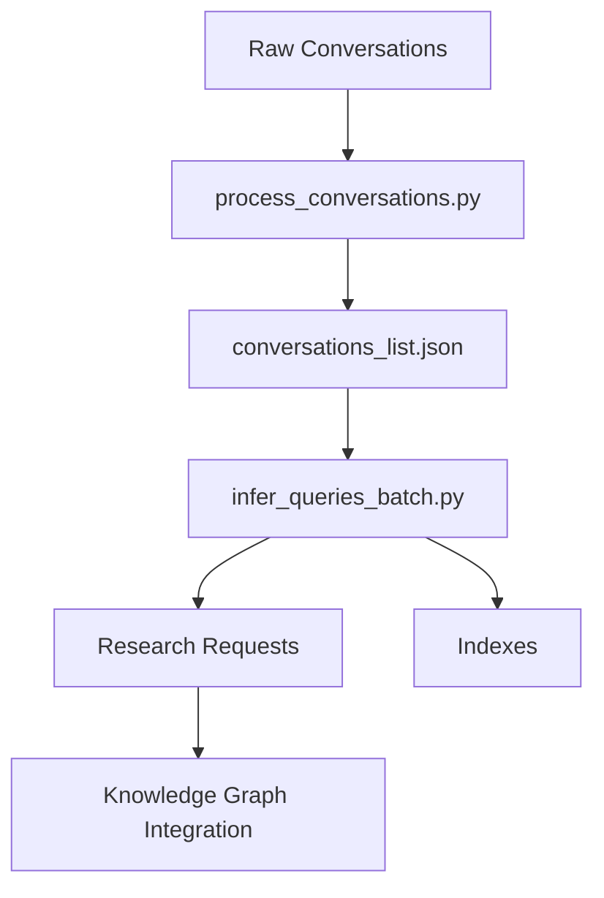

# MKG_Multi_Agent

## Purpose

MKG_Multi_Agent is a specialized component of a larger knowledge graph system that:
1. Extracts structured research requests and hypotheses from AI conversation logs
2. Transforms unstructured dialogue into graph-compatible knowledge units
3. Maintains source traceability and temporal context
4. Facilitates knowledge discovery through Obsidian-compatible outputs

The system serves as a bridge between conversational AI outputs and structured knowledge representation, enabling:
- Automated knowledge extraction
- Hypothesis tracking
- Research request management
- Multi-agent interaction analysis

## System Architecture

### Components Overview



### Core Components

1. **process_conversations.py**
   - Purpose: Conversation preprocessing and structuring
   - Input: Raw conversation files (JSON)
   - Output: Structured conversation list
   - Key operations:
     - Conversation parsing
     - Exchange counting
     - JSON structure validation

2. **infer_queries_batch.py**
   - Purpose: Research request extraction and formatting
   - Input: Structured conversations
   - Output: Markdown files and indexes
   - Key algorithms:
     ```python
     # High-level process flow
     conversations -> chunk_conversation() 
                  -> process_chunks() 
                  -> extract_requests() 
                  -> validate() 
                  -> format_output()
     ```

3. **MKG_utils.py**
   - Purpose: Shared utilities and helpers
   - Scope: Cross-component functions
   - Usage: Support for main processing scripts

## Algorithmic Details

### 1. Conversation Processing

```python
# Pseudo-algorithm for conversation chunking
def chunk_conversation(text, max_size=4000):
    chunks = []
    messages = split_on_speaker_boundaries(text)
    current_chunk = ""
    
    for message in messages:
        if len(current_chunk + message) > max_size:
            chunks.append(current_chunk)
            current_chunk = message
        else:
            current_chunk += message
    
    return chunks
```

### 2. Request Extraction

The system employs a multi-stage extraction process:

1. **Chunking Stage**
   - Split conversations into manageable segments
   - Preserve context and speaker information
   - Maintain temporal ordering

2. **Inference Stage**
   - LLM prompt engineering for structured extraction
   - Fixed extraction count (currently 5 per chunk)
   - Validation against predefined schemas

3. **Processing Stage**
   - Bracket link normalization
   - Metadata enrichment
   - Source tracking
   - Timestamp management

### 3. Output Generation

The system generates three types of interconnected outputs:

1. **Individual Research Request Files (`outputs/research_requests/*.md`)**
   ```yaml
   ---
   source_conversation: "conversation_id"
   source_chunk: "chunk_id"
   type: "research_request"
   created: "YYYY-MM-DD"
   timestamp: "YYYY-MM-DD HH:MM:SS"
   hypothesis: "Detailed hypothesis statement"
   rationale: "Reasoning behind the hypothesis"
   impact: "Expected impact of the research"
   tags: ["tag1", "tag2"]
   agents: ["agent1", "agent2"]
   ---

   # Research Request
   Created: YYYY-MM-DD

   ## Hypothesis
   [Hypothesis text]

   ## Rationale
   [Rationale text]

   ## Expected Impact
   [Impact text]

   ## Related Agents
   - [[agent1]]
   - [[agent2]]

   ## Tags
   - [[tag1]]
   - [[tag2]]

   ## Source
   [[conversation_id]]
   ```

2. **Request Index JSON (`_request_index.json`)**
   ```json
   {
     "request_id_TIMESTAMP": {
       "title": "Research Request Type",
       "tags": ["tag1", "tag2"],
       "agents": ["agent1", "agent2"],
       "source": "conversation_id",
       "timestamp": "YYYY-MM-DD HH:MM:SS",
       "hypothesis": "Hypothesis statement",
       "rationale": "Rationale text",
       "impact": "Impact description"
     },
     // Additional requests...
   }
   ```

3. **Research Requests Index (`_research_requests_index.md`)**
   ```markdown
   # Research Requests Index

   ## Statistics Summary

   ### Agent Statistics
   | Agent | Contributions | % of Total |
   |-------|--------------|------------|
   | [[agent1]] | 5/10 | 50% |
   | [[agent2]] | 3/10 | 30% |

   ### Tag Statistics
   | Tag | Usage | % of Total |
   |-----|-------|------------|
   | [[tag1]] | 6/10 | 60% |
   | [[tag2]] | 4/10 | 40% |

   ## By Date
   ### YYYY-MM-DD
   - [[request_id_1]] - Research Request: hypothesis summary...
   - [[request_id_2]] - Research Request: hypothesis summary...

   ## By Agent
   ### [[agent1]]
   - [[request_id_1]] - hypothesis summary... (YYYY-MM-DD HH:MM:SS)
   - [[request_id_2]] - hypothesis summary... (YYYY-MM-DD HH:MM:SS)

   ## By Tag
   ### [[tag1]]
   - [[request_id_1]] - hypothesis summary... (YYYY-MM-DD HH:MM:SS)
   - [[request_id_2]] - hypothesis summary... (YYYY-MM-DD HH:MM:SS)
   ```

Key features of the output files:
- All files use Obsidian-compatible formatting with double-bracket links
- The JSON index serves as a queryable database of all requests
- The markdown index provides multiple views (temporal, agent-based, tag-based)
- Statistics sections show contribution and usage percentages
- All outputs maintain consistent cross-referencing through request IDs

## Usage

### Prerequisites

```bash
# Required Python packages
pip install ollama tqdm pyyaml
```

### Project Structure

```
MKG_Multi_Agent/
├── test1/
│   ├── inputs/
│   │   └── conversations/
│   └── outputs/
│       ├── conversations/
│       └── research_requests/
├── infer_queries_batch.py
├── process_conversations.py
└── MKG_utils.py
```

### Execution Flow

1. **Conversation Processing**
   ```bash
   python process_conversations.py --project_path ./test1 --exchanges 50
   ```

2. **Request Extraction**
   ```bash
   python infer_queries_batch.py --project_path ./test1 --model_name llama3.2
   ```

## Configuration

### LLM Settings

```python
# Default configuration
DEFAULT_MODEL_NAME = "llama3.2"
MAX_CHUNK_SIZE = 4000
REQUESTS_PER_CHUNK = 5
```

### Validation Rules

1. **Request Format**
   - Required fields: agents, tags, intent, hypothesis, rationale, impact
   - Bracket format: [[agent]], [[tag]], [[intent]]
   - Content validation for each field

2. **Link Processing**
   - Double bracket normalization
   - Nested bracket resolution
   - Empty link removal

## Future Enhancements

1. **Dynamic Request Extraction**
   - Content-based chunk sizing
   - Variable request count per chunk
   - Improved context preservation

2. **Advanced Processing**
   - Parallel chunk processing
   - Incremental updates
   - Cross-reference validation

3. **Knowledge Graph Integration**
   - Automated graph updates
   - Relationship inference
   - Temporal analysis

4. **Validation Improvements**
   - Content quality metrics
   - Semantic validation
   - Cross-request consistency

## Contributing

When contributing to this project:
1. Follow the existing code structure
2. Document algorithmic changes
3. Update test cases
4. Maintain backward compatibility

## License

This project is part of a larger knowledge graph system. See the main repository for licensing information.