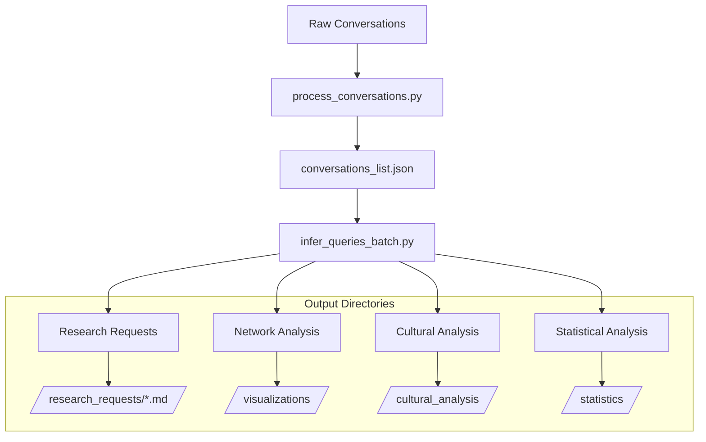

# MKG_Multi_Agent

## Overview

MKG_Multi_Agent is a sophisticated knowledge extraction and analysis system that transforms AI agent conversations into structured, analyzable knowledge units. At its core, the system uses advanced NLP techniques to extract research requests, analyze agent interactions, and generate comprehensive visualizations of knowledge patterns.

## Key Features

### 1. Knowledge Extraction

- Automated extraction of research requests from conversation logs

- Intelligent chunking of large conversations

- Advanced entity recognition and linking

- Fuzzy matching for agent name validation

### 2. Analysis & Visualization

- Network analysis of agent interactions

- Statistical visualizations of research patterns

- Cultural and linguistic analysis

- Topic modeling and sentiment analysis

### 3. Knowledge Organization

- Obsidian-compatible markdown generation

- Automated cross-linking

- Multi-dimensional indexing

- Temporal tracking

## System Architecture



## Core Components

### infer_queries_batch.py (Primary Component)

#### Input Processing

- **Conversation Chunking**

  ```python

  def chunk_conversation(conversation_text: str, max_chunk_size: int = 4000)

  ```

  - Intelligent splitting of conversations

  - Context preservation

  - Speaker boundary respect

- **Agent Name Validation**

  ```python

  def validate_and_correct_agent_name(agent_name: str, 

                                    conversation_agents: set = None,

                                    min_similarity: int = None)

  ```

  - Fuzzy matching for misspellings

  - Context-aware correction

  - Configurable similarity threshold

#### Analysis Features

1. **Network Analysis**

   - Agent interaction graphs

   - Centrality metrics

   - Bridging coefficients

   - Interactive visualizations

1. **Cultural Analysis**

   - Topic modeling

   - Sentiment analysis

   - Language complexity metrics

   - Cultural markers tracking

1. **Statistical Analysis**

   - Agent participation rates

   - Tag usage patterns

   - Temporal trends

   - Request patterns

#### Output Generation

1. **Research Requests** (`/research_requests/*.md`)

   ```yaml

   ---

   source_conversation: "conversation_id"

   type: "research_request"

   hypothesis: "Detailed statement"

   rationale: "Supporting reasoning"

   impact: "Expected outcomes"

   agents: ["agent1", "agent2"]

   tags: ["tag1", "tag2"]

   timestamp: "YYYY-MM-DD HH:MM:SS"

   ---

   ```

1. **Visualizations** (`/visualizations/`)

   - Network graphs (`network_visualization.html`)

   - Agent participation (`agent_participation.png`)

   - Tag usage (`tag_usage.png`)

   - Request timeline (`request_timeline.png`)

1. **Cultural Analysis** (`/cultural_analysis/`)

   - Topic distributions (`topic_distribution.html`)

   - Sentiment analysis (`agent_sentiments.html`)

   - Language complexity (`language_complexity.html`)

   - Cultural markers (`cultural_markers.html`)

1. **Statistics** (`/statistics/`)

   - Detailed metrics (`statistics.json`)

   - Network analysis (`network_statistics.md`)

   - Agent profiles (`cultural_analysis.md`)

## Configuration

### Command Line Arguments

```bash

python infer_queries_batch.py \

    --project_path ./test1 \

    --model_name llama3.2 \

    --force_links \

    --similarity_threshold 80

```

### Key Parameters

```python

# Global Configuration

DEFAULT_PROJECT_PATH = "./test1"

DEFAULT_MODEL_NAME = "llama3.2"

force_links = True  # Enable automatic link creation

similarity_threshold = 80  # Agent name matching threshold

# Cultural Markers

cultural_markers = {

    'technical': ['algorithm', 'system', 'model'],

    'collaborative': ['team', 'together', 'share'],

    'innovative': ['novel', 'unique', 'creative'],

    'analytical': ['analyze', 'evaluate', 'measure'],

    'practical': ['implement', 'build', 'deploy']

}

```

## Dependencies

### Core Requirements

```bash

pip install ollama tqdm pyyaml plotly networkx matplotlib

```

### Analysis Requirements

```bash

pip install spacy gensim textblob

python -m spacy download en_core_web_sm

```

## Project Structure

```text

MKG_Multi_Agent/

├── infer_queries_batch.py    # Main processing engine

├── process_conversations.py   # Conversation preprocessor

├── MKG_utils.py             # Utility functions

└── test1/

    ├── inputs/

    │   └── conversations/    # Raw conversation files

    └── outputs/

        ├── conversations/    # Processed conversations

        ├── research_requests/# Extracted knowledge

        ├── visualizations/   # Network and statistical viz

        ├── cultural_analysis/# Cultural analytics

        └── statistics/       # Detailed metrics

```

## Usage Examples

### Basic Extraction

```bash

python infer_queries_batch.py --project_path ./test1

```

### Advanced Analysis

```bash

python infer_queries_batch.py \

    --project_path ./test1 \

    --model_name llama3.2 \

    --force_links \

    --similarity_threshold 90

```

## Future Enhancements

1. **Analysis Expansion**

   - Advanced sentiment analysis

   - Cross-conversation topic tracking

   - Agent personality profiling

   - Temporal pattern detection

1. **Visualization Improvements**

   - Interactive topic networks

   - Real-time analysis updates

   - Custom visualization themes

   - Export to various formats

1. **Integration Features**

   - API endpoints for live analysis

   - Real-time agent monitoring

   - Custom marker definitions

   - Plugin system for analyses

## Contributing

1. Fork the repository

1. Create a feature branch

1. Add tests for new features

1. Submit a pull request

## License

This project is part of a larger knowledge graph system. See the main repository for licensing information.

