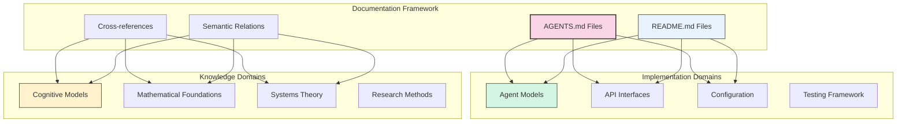
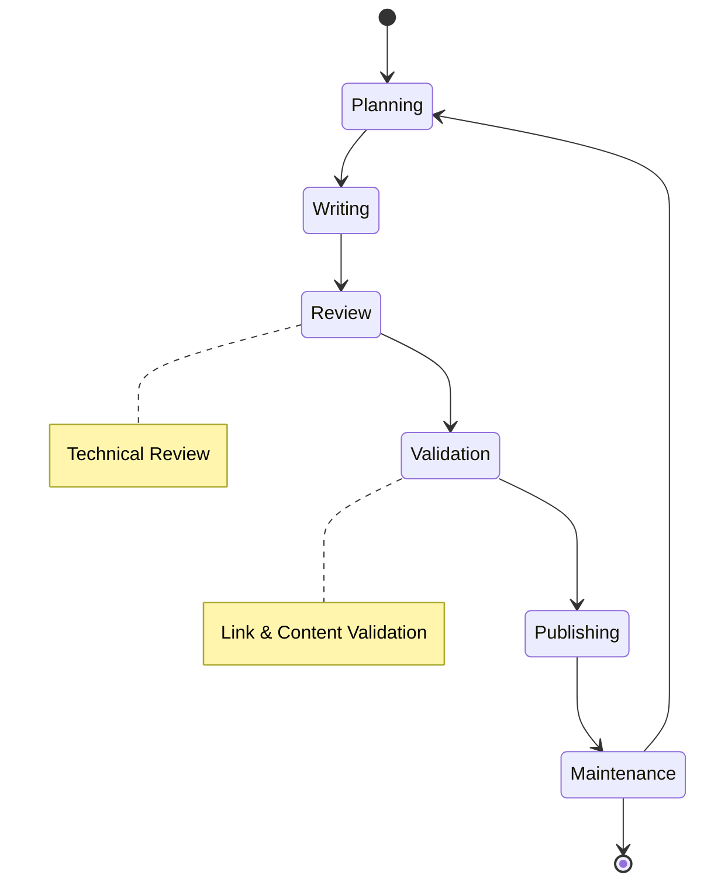

# Documentation Hub

Comprehensive documentation framework for the cognitive modeling system, providing structured knowledge organization, technical references, implementation guidance, and research documentation. This documentation supports the development, maintenance, and dissemination of cognitive modeling technologies through systematic documentation practices.

> [!info] Documentation Framework
> This documentation integrates with the [[AGENTS|Documentation Framework Agents]] and [[agents/agent_docs_readme|Autonomous Agent Documentation Clearinghouse]] for comprehensive technical knowledge management.

## 📚 Documentation Architecture

### Directory Structure

```mermaid
graph TD
    A[Documentation Root] --> B[agents/]
    A --> C[api/]
    A --> D[config/]
    A --> E[development/]
    A --> F[examples/]
    A --> G[guides/]
    A --> H[implementation/]
    A --> I[repo_docs/]
    A --> J[research/]
    A --> K[templates/]
    A --> L[tools/]

    B --> B1[AGENTS.md]
    B --> B2[agent_docs_readme.md]

    C --> C1[AGENTS.md]
    C --> C2[README.md]
    C --> C3[api_documentation.md]

    D --> D1[AGENTS.md]
    D --> D2[README.md]

    E --> E1[AGENTS.md]
    E --> E2[README.md]

    F --> F1[AGENTS.md]
    F --> F2[README.md]

    G --> G1[AGENTS.md]
    G --> G2[README.md]

    H --> H1[AGENTS.md]
    H --> H2[README.md]

    I --> I1[README.md]
    I --> I2[ai_documentation_style.md]

    J --> J1[AGENTS.md]
    J --> J2[README.md]

    K --> K1[AGENTS.md]
    K --> K2[README.md]

    L --> L1[AGENTS.md]
    L --> L2[README.md]

    style A fill:#f9d5e5,stroke:#333,stroke-width:2px
    style B fill:#d5f5e3,stroke:#333,stroke-width:1px
    style C fill:#e8f4fd,stroke:#333,stroke-width:1px
    style D fill:#fff2cc,stroke:#333,stroke-width:1px
    style E fill:#d5f5e3,stroke:#333,stroke-width:1px
```

### Core Documentation Domains

#### Agent Documentation
- [[agents/AGENTS|Agent Documentation Clearinghouse]] - Comprehensive autonomous agent documentation
- [[agents/agent_docs_readme|Autonomous Agent Documentation]] - Detailed agent implementation guides

#### API Documentation
- [[api/AGENTS|API Agent Documentation]] - Technical API references and interfaces
- [[api/README|API Documentation Overview]] - API structure and navigation
- [[api/api_documentation|API Reference]] - Complete API documentation

#### Configuration Documentation
- [[config/AGENTS|Configuration Documentation]] - Configuration management and standards
- [[config/README|Configuration Overview]] - Configuration guides and examples

#### Development Documentation
- [[development/AGENTS|Development Documentation]] - Development processes and standards
- [[development/README|Development Overview]] - Development workflow and tools

#### Examples Documentation
- [[examples/AGENTS|Examples Documentation]] - Usage examples and tutorials
- [[examples/README|Examples Overview]] - Example navigation and structure

#### Implementation Documentation
- [[implementation/AGENTS|Implementation Documentation]] - Implementation patterns and guides
- [[implementation/README|Implementation Overview]] - Implementation resources and references

## 🚀 Getting Started

### Essential Setup

- [[repo_docs/getting_started|Getting Started Guide]] - Initial setup and configuration
- [[development/README|Development Environment]] - Development environment setup
- [[config/README|Configuration Management]] - System configuration and management
- [[repo_docs/folder_structure|Repository Structure]] - Understanding the codebase organization

### Core Concepts

- [[../knowledge_base/active_inference_implementation|Active Inference]] - Core active inference principles
- [[../knowledge_base/free_energy_principle|Free Energy Principle]] - Theoretical foundations
- [[../knowledge_base/information_processing_integration|Information Processing]] - Data processing frameworks
- [[../knowledge_base/swarm_intelligence_implementation|Swarm Intelligence]] - Collective intelligence patterns

### Documentation Navigation

- [[repo_docs/obsidian_usage|Obsidian Usage Guide]] - Knowledge graph navigation
- [[repo_docs/obsidian_linking|Obsidian Linking Standards]] - Link formatting and management
- [[repo_docs/content_management|Content Management]] - Documentation maintenance practices
- [[repo_docs/documentation_standards|Documentation Standards]] - Quality and consistency guidelines

## 🏗️ Development Resources

### Implementation Guidance

- [[implementation/AGENTS|Implementation Documentation]] - Implementation patterns and techniques
- [[implementation/README|Implementation Overview]] - Implementation resources and guides
- [[development/AGENTS|Development Documentation]] - Development processes and standards
- [[repo_docs/model_implementation|Model Implementation]] - Core model development guides

### System Architecture

### Development Tools

- [[tools/AGENTS|Tools Documentation]] - Development and utility tools
- [[tools/README|Tools Overview]] - Tool navigation and usage
- [[repo_docs/unit_testing|Testing Framework]] - Testing standards and practices
- [[repo_docs/validation|Validation Framework]] - Code and documentation validation

### Example Resources

- [[examples/AGENTS|Examples Documentation]] - Comprehensive example documentation
- [[examples/README|Examples Overview]] - Example navigation and structure
- [[examples/usage_examples|Usage Examples]] - Practical usage demonstrations
- [[examples/index|Examples Index]] - Complete example catalog

## 🤝 Contributing

### Documentation Standards

- [[repo_docs/ai_documentation_style|AI Documentation Style]] - Documentation writing standards
- [[repo_docs/content_management|Content Management]] - Documentation maintenance practices
- [[repo_docs/documentation_standards|Documentation Standards]] - Quality and consistency guidelines
- [[development/README|Development Workflow]] - Development and contribution processes

### Documentation Workflow

### Documentation Templates

- [[templates/AGENTS|Templates Documentation]] - Complete template documentation
- [[templates/README|Templates Overview]] - Template navigation and usage
- [[templates/template_guide|Template Guide]] - Template usage instructions
- [[templates/research_document|Research Templates]] - Research documentation templates

## 📚 Additional Resources

### Knowledge Base

- [[../knowledge_base/index|Knowledge Base Index]] - Complete knowledge organization
- [[../knowledge_base/active_inference_implementation|Active Inference Implementation]] - Core implementation guides
- [[../knowledge_base/swarm_intelligence_implementation|Swarm Intelligence]] - Collective intelligence patterns
- [[../knowledge_base/learning_roadmap|Learning Roadmap]] - Educational progression paths

### Research Documentation

- [[research/AGENTS|Research Documentation]] - Research framework and methods
- [[research/README|Research Overview]] - Research resources and navigation
- [[research/ant_colony_active_inference|Ant Colony Active Inference]] - Specific research implementations

### Repository Documentation

- [[repo_docs/README|Repository Documentation]] - Comprehensive repo documentation
- [[DOCUMENTATION_ROADMAP|Documentation Roadmap]] - Documentation planning and architecture
- [[repo_docs/folder_structure|Repository Structure]] - Codebase organization guide

## 🆘 Support & Community

### Documentation Support

- [[repo_docs/getting_started|Getting Started Guide]] - Setup and common issues
- [[repo_docs/validation|Validation Framework]] - Quality assurance and validation
- [[repo_docs/linking_validation|Link Validation]] - Link checking and maintenance

### Development Support

- [[development/README|Development Resources]] - Development environment and tools
- [[tools/README|Tool Documentation]] - Utility tools and automation
- [[repo_docs/unit_testing|Testing Framework]] - Testing standards and practices

### Community Resources

- [[repo_docs/research|Research Documentation]] - Research collaboration framework
- [[repo_docs/simulation|Simulation Documentation]] - Simulation setup and usage
- [[repo_docs/package_documentation|Package Documentation]] - Packaging and deployment guides

---

> [!tip] Documentation Navigation
> This documentation is optimized for Obsidian usage. Use graph view to explore concept relationships, search functionality for specific topics, and the [[AGENTS|Documentation Framework Agents]] for technical implementation details.

---

> [!info] Documentation Framework
> This documentation integrates with the broader [[../knowledge_base/index|Cognitive Modeling Knowledge Base]] and [[agents/agent_docs_readme|Agent Documentation Clearinghouse]] for comprehensive knowledge management.

---

> [!note] Repository Information
> **Repository**: [ActiveInferenceInstitute/cognitive](https://github.com/ActiveInferenceInstitute/cognitive)  
> **Documentation License**: [CC BY-NC-SA 4.0](https://creativecommons.org/licenses/by-nc-sa/4.0/)  
> **Code License**: MIT License (see `LICENSE`)  
> **Documentation Framework**: Powered by [[AGENTS|Documentation Framework Agents]]

