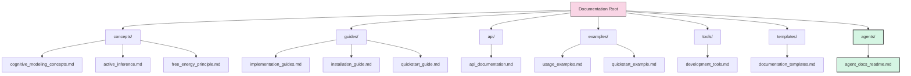
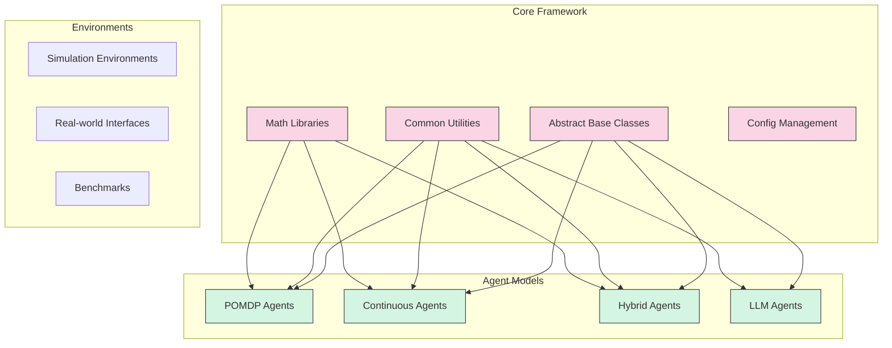
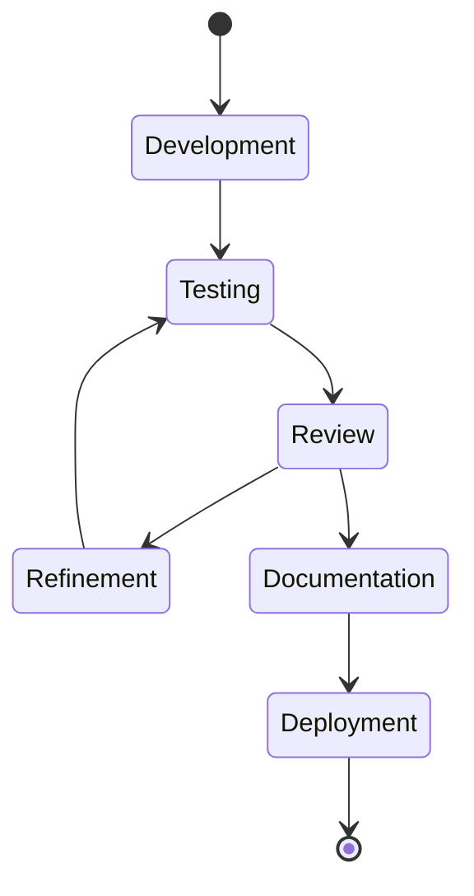

# Cognitive Modeling Documentation

Welcome to the Cognitive Modeling documentation. This documentation is designed to be viewed in Obsidian for optimal navigation and knowledge linking.

> [!info] Documentation Network
> This documentation works in conjunction with the [[agents/agent_docs_readme|Autonomous Agent Documentation Clearinghouse]] which contains comprehensive agent-specific documentation.

## Directory Structure

### Core Documentation
- [[concepts/cognitive_modeling_concepts|Concepts]] - Core concepts and theoretical foundations
- [[guides/implementation_guides|Guides]] - Implementation guides and tutorials
- [[api/api_documentation|API]] - API reference documentation
- [[examples/usage_examples|Examples]] - Usage examples and tutorials
- [[tools/development_tools|Tools]] - Development tools and utilities
- [[templates/documentation_templates|Templates]] - Documentation templates
- [[agents/agent_docs_readme|Agent Documentation]] - Autonomous agent documentation clearinghouse

## Getting Started

### Essential Setup
- [[guides/installation_guide|Installation Guide]]
- [[guides/configuration_guide|Configuration Guide]]
- [[guides/quickstart_guide|Quick Start Guide]]
- [[guides/environment_setup|Environment Setup]]
- [[guides/dependency_management|Dependency Management]]

### Core Concepts
- [[concepts/plain_text_benefits|Plain Text Benefits]]
- [[concepts/machine_readability|Machine Readability]]
- [[concepts/research_education|Research and Education]]
- [[concepts/active_inference|Active Inference]]
- [[concepts/free_energy_principle|Free Energy Principle]]
- [[concepts/predictive_processing|Predictive Processing]]
- [[concepts/variational_inference|Variational Inference]]
- [[concepts/message_passing|Message Passing]]

### Documentation Usage
- [[guides/obsidian_linking|Obsidian Linking Guide]]
- [[guides/package_documentation|Package Documentation]]
- [[guides/pomdp_structure|POMDP Structure]]
- [[guides/mermaid_diagrams|Mermaid Diagram Guide]]
- [[guides/documentation_navigation|Documentation Navigation]]

## Development

### Implementation
- [[guides/model_implementation|Model Implementation]]
- [[guides/system_integration|System Integration]]
- [[guides/testing_guide|Testing Guide]]
- [[guides/performance_optimization|Performance Optimization]]
- [[guides/agent_development|Agent Development]]
- [[guides/environment_creation|Environment Creation]]

### Architecture Overview

### Tools
- [[tools/setup_tools|Setup Tools]]
- [[tools/development_tools|Development Tools]]
- [[tools/documentation_tools|Documentation Tools]]
- [[tools/experiment_tools|Experiment Tools]]
- [[tools/analysis_tools|Analysis Tools]]
- [[tools/visualization_tools|Visualization Tools]]
- [[tools/benchmark_tools|Benchmark Tools]]
- [[tools/simulation_tools|Simulation Tools]]

### Examples
- [[examples/quickstart_example|Quick Start Example]]
- [[examples/basic_agent|Basic Agent]]
- [[examples/active_inference_basic|Active Inference]]
- [[examples/multi_agent_system|Multi-Agent System]]
- [[examples/hierarchical_agent|Hierarchical Agent]]
- [[examples/belief_updating|Belief Updating Example]]
- [[examples/policy_selection|Policy Selection Example]]

## Contributing

### Guidelines
- [[guides/contribution_guide|Contribution Guide]]
- [[guides/documentation_guide|Documentation Guide]]
- [[guides/style_guide|Style Guide]]
- [[guides/code_standards|Code Standards]]
- [[guides/testing_guidelines|Testing Guidelines]]
- [[guides/review_process|Review Process]]

### Development Workflow

### Templates
- [[templates/concept_template|Concept Template]]
- [[templates/guide_template|Guide Template]]
- [[templates/example_template|Example Template]]
- [[templates/api_template|API Documentation Template]]
- [[templates/implementation_template|Implementation Template]]
- [[templates/agent_template|Agent Template]]
- [[templates/research_template|Research Template]]

## Additional Resources

### References
- [[concepts/active_inference|Active Inference]]
- [[concepts/free_energy_principle|Free Energy Principle]]
- [[concepts/predictive_processing|Predictive Processing]]
- [[DOCUMENTATION_ROADMAP|Documentation Roadmap]]
- [[concepts/bibliography|Bibliography]]
- [[concepts/glossary|Glossary of Terms]]

### Research Topics
- [[research/current_projects|Current Research Projects]]
- [[research/publications|Publications]]
- [[research/experimental_results|Experimental Results]]
- [[research/benchmarks|Benchmark Results]]
- [[research/future_directions|Future Research Directions]]

### Related Projects
- [[related/similar_frameworks|Similar Frameworks]]
- [[related/complementary_tools|Complementary Tools]]
- [[related/partner_projects|Partner Projects]]
- [[related/community_extensions|Community Extensions]]

## Support

### Help
- [[guides/troubleshooting|Troubleshooting]]
- [[guides/faq|FAQ]]
- [[guides/support|Support]]
- [[guides/common_errors|Common Errors]]
- [[guides/performance_issues|Performance Issues]]

### Community
- [[guides/community_guide|Community Guide]]
- [[guides/discussion|Discussion]]
- [[guides/feedback|Feedback]]
- [[guides/feature_requests|Feature Requests]]
- [[guides/bug_reporting|Bug Reporting]]
- [[guides/community_extensions|Community Extensions]]

---

> [!tip] Navigation Tip
> Use Obsidian's graph view and search functionality to explore connections between concepts. The [[agents/agent_docs_readme|Agent Documentation Clearinghouse]] provides comprehensive details on agent implementations. 