# Autonomous Agent Documentation Clearinghouse

> [!info] About This Document
> This is a comprehensive clearinghouse for all autonomous agent related projects, tasks, and documentation, optimized for Obsidian's linked knowledge management system.
>
> **Last Updated:** [[2024-07|July 2024]]
> **Maintainers:** [[team_cognitive|Cognitive Team]]

## 🧠 Agent Knowledge Base

### Core Concepts

- [[active_inference|Active Inference]] - The central framework for agent cognition

- [[belief_updating|Belief Updating]] - How agents update their internal models

- [[policy_selection|Policy Selection]] - Mechanisms for action selection

- [[free_energy|Free Energy Principle]] - Minimization of surprise

- [[predictive_processing|Predictive Processing]] - Prediction-driven cognition

- [[hierarchical_models|Hierarchical Models]] - Nested model architectures

- [[generative_models|Generative Models]] - Internal predictive structures

- [[perception_action_loops|Perception-Action Loops]] - Sensorimotor integration

- [[decision_theory|Decision Theory]] - Formal decision frameworks

- [[variational_inference|Variational Inference]] - Approximate Bayesian inference

### Agent Architectures

- [[cognitive_agents|Cognitive Agents]] - Agents with cognitive capabilities

- [[multi_agent|Multi-Agent Systems]] - Interacting agent networks

- [[agent_society|Agent Societies]] - Emergent social structures

- [[KG_Multi_Agent|Knowledge Graph Multi-Agent]] - Agents operating with knowledge graphs

- [[hierarchical_agents|Hierarchical Agents]] - Layered agent architectures

- [[embodied_agents|Embodied Agents]] - Agents with physical constraints

- [[hybrid_architectures|Hybrid Architectures]] - Combined symbolic-subsymbolic systems

- [[federated_agents|Federated Agents]] - Distributed learning frameworks

- [[transformer_agents|Transformer-Based Agents]] - Large language model integration

## 📊 Agent System Overview

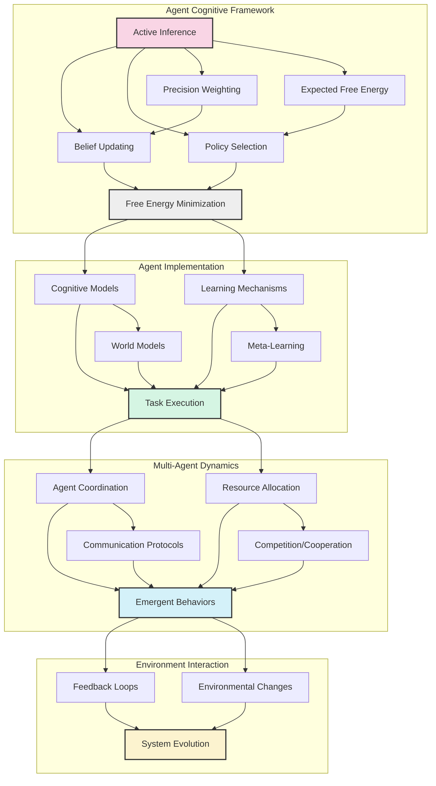

### Theoretical Foundations

```mermaid

mindmap

  root((Agent Theory))

    (Free Energy)

      [Variational Inference]

      [Information Geometry]

      [Bayesian Inference]

    (Predictive Processing)

      [Hierarchical Prediction]

      [Error Minimization]

      [Precision Weighting]

    (Decision Making)

      [Expected Utility]

      [Risk Assessment]

      [Policy Selection]

    (Learning Theory)

      [Supervised Learning]

      [Reinforcement Learning]

      [Unsupervised Learning]

      [Meta-Learning]

    (Social Dynamics)

      [Game Theory]

      [Multi-Agent Coordination]

      [Emergent Behavior]

    (Embodiment)

      [Sensorimotor Loops]

      [Physical Constraints]

      [Ecological Niches]

```

## 🧩 Project Components

### Implementation Domains

- [[Generic_Thing|Generic Agent Framework]] - Base implementation

- [[Simple_POMDP|Simple POMDP Agents]] - Basic POMDP implementation

- [[Generic_POMDP|Generic POMDP Framework]] - Expanded POMDP capabilities

- [[Continuous_Generic|Continuous State Agents]] - Agents in continuous domains

- [[Ant_Colony|Ant Colony Optimization]] - Swarm intelligence models

- [[Baseball_Game|Baseball Game Simulation]] - Complex game scenario

- [[Path_Network|Path Network Optimization]] - Spatial navigation and planning

- [[BioFirm|Biological Firm Models]] - Biological economics models

- [[Emergent_Communication|Emergent Communication]] - Agent language emergence

- [[Hierarchical_Planning|Hierarchical Planning]] - Multi-level planning systems

- [[Social_Learning|Social Learning Models]] - Imitation and cultural transmission

- [[Resource_Competition|Resource Competition]] - Competition dynamics models

### Implementation Structure

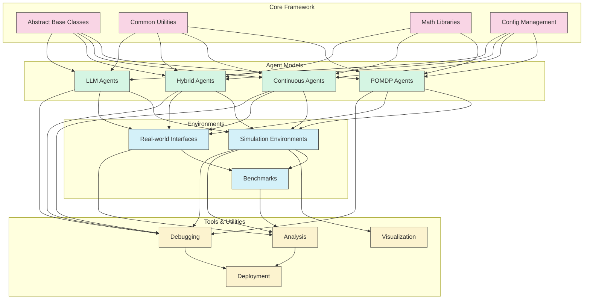

### Agent Capabilities Matrix

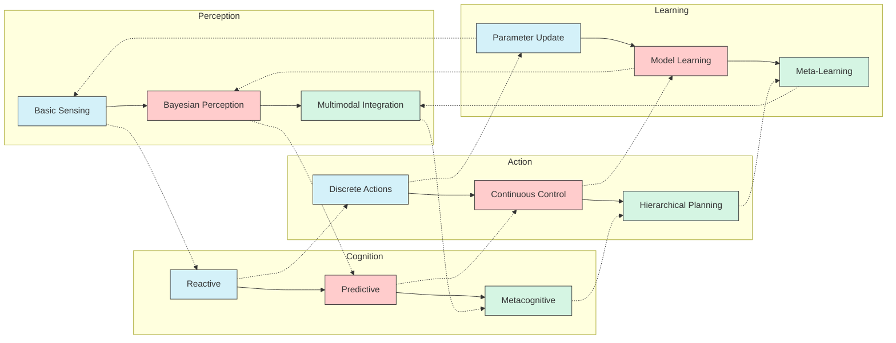

## 📝 Project Tasks

### Current Task Board

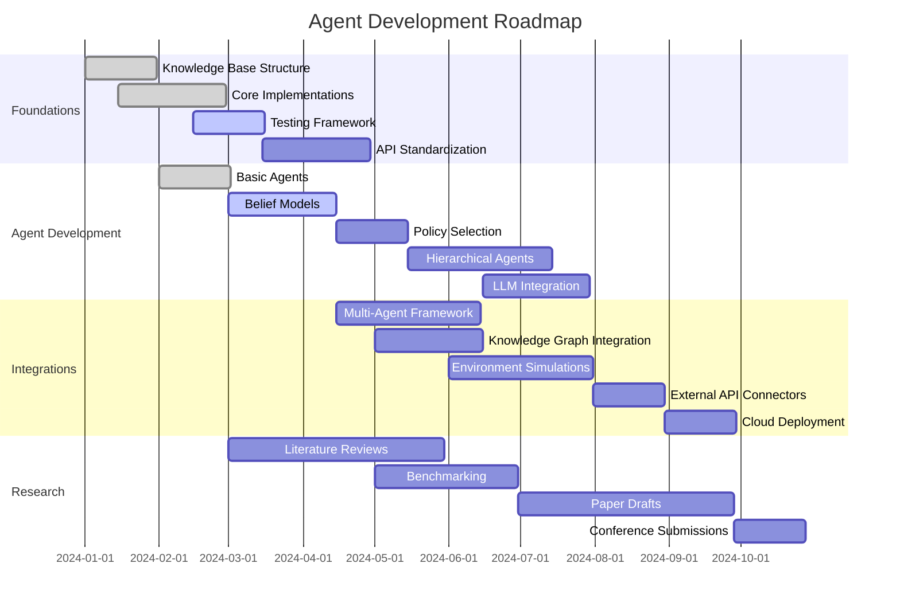

### Task Dependencies

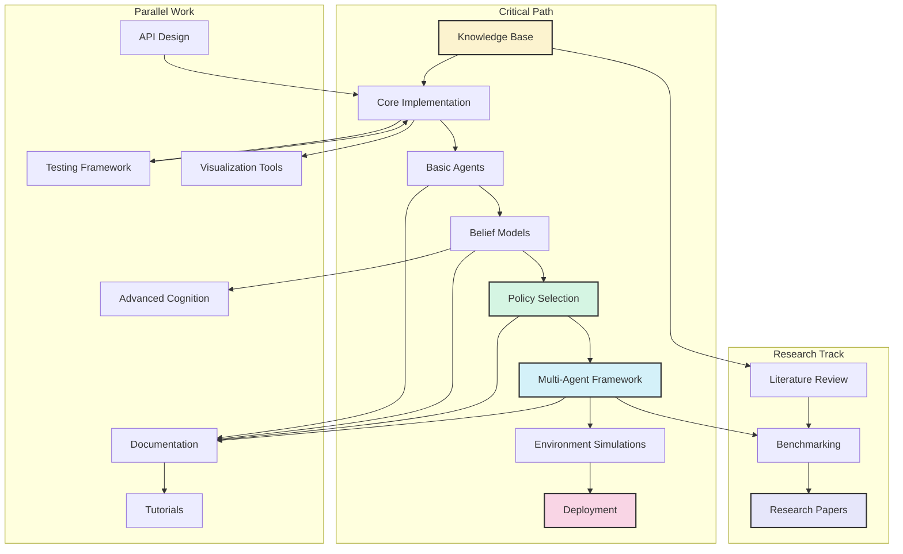

### Task Templates

> [!example] Agent Development Task
> - **Task:** [Task Description]
> - **Related Components:** [[component1]], [[component2]]
> - **Implementation Path:** `tools/src/models/[implementation]`
> - **Required Tests:** `tests/unit/test_[component].py`
> - **Documentation:** `docs/implementation/[component].md`
> - **Dependencies:** [[prerequisite_task|Prerequisite Task]]
> - **Expected Duration:** [Time Estimate]
> - **Success Criteria:** [Measurable Outcomes]
> - **Assigned To:** [[team_member|Team Member]]
> [!example] Research Task
> - **Research Question:** [Question]
> - **Background Reading:** [[papers/relevant_paper|Relevant Paper]]
> - **Methodology:** [Approach]
> - **Expected Outcomes:** [Insights/Artifacts]
> - **Related Work:** [[related_research|Related Research]]

## 🔍 Agent Analysis Tools

### Available Tools

- [[network_analysis|Network Analysis Tools]] - Analyzing agent networks

- [[metrics|Performance Metrics]] - Measuring agent performance

- [[simulations|Simulation Frameworks]] - Testing environments

- [[belief_visualization|Belief Visualization]] - Visualizing agent belief states

- [[decision_trees|Decision Tree Analysis]] - Analyzing agent decision processes

- [[error_analysis|Error Analysis]] - Investigating agent failures

- [[comparative_benchmarks|Comparative Benchmarks]] - Cross-system comparisons

- [[ablation_studies|Ablation Studies]] - Component impact analysis

- [[explainability_tools|Explainability Tools]] - Understanding agent decisions

### Analysis Framework Architecture

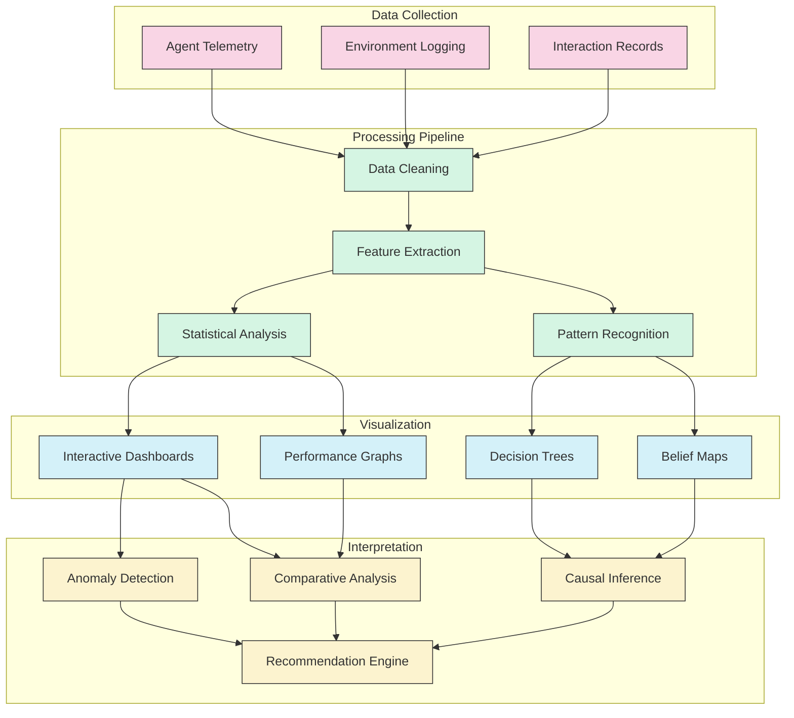

### Agent Performance Visualization

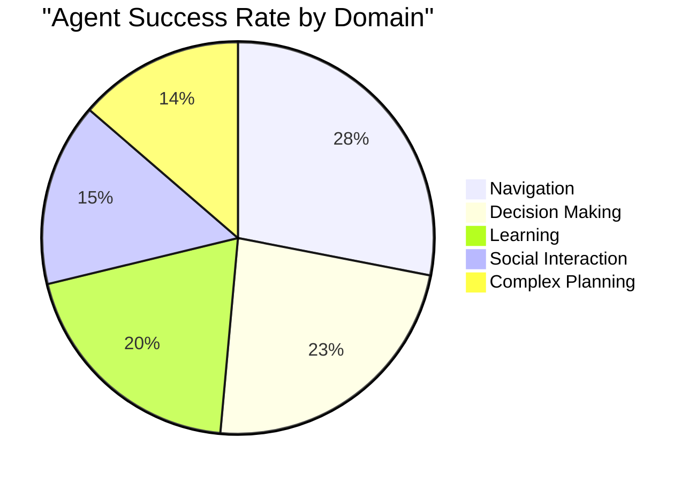

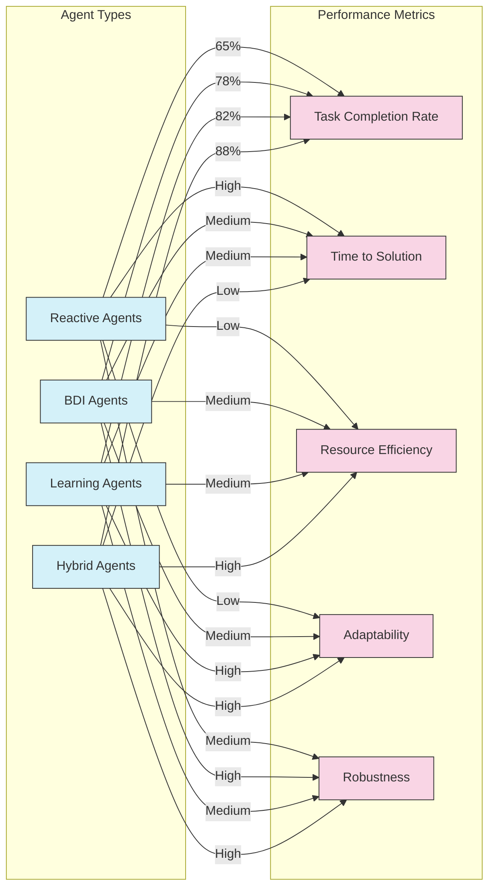

```mermaid

gantt

    title Agent Learning Curve

    dateFormat X

    axisFormat %d

    section Simple POMDP

    Initial Performance      :done, 0, 5

    After 100 Episodes       :done, 5, 15

    After 500 Episodes       :done, 15, 35

    After 1000 Episodes      :done, 35, 45

    section Generic POMDP

    Initial Performance      :done, 0, 3

    After 100 Episodes       :done, 3, 10

    After 500 Episodes       :done, 10, 25

    After 1000 Episodes      :done, 25, 40

    section Hierarchical Agent

    Initial Performance      :done, 0, 10

    After 100 Episodes       :done, 10, 30

    After 500 Episodes       :done, 30, 55

    After 1000 Episodes      :done, 55, 70

    section Meta-Learning Agent

    Initial Performance      :done, 0, 15

    After 100 Episodes       :done, 15, 45

    After 500 Episodes       :done, 45, 75

    After 1000 Episodes      :done, 75, 90

```

## 📚 Agent Documentation

### Implementation Documentation

- [[active_inference_implementation|Active Inference Implementation Guide]]

- [[belief_models|Belief Model Documentation]]

- [[policy_selection_algorithms|Policy Selection Algorithms]]

- [[math_utils|Mathematical Utilities]]

- [[generative_models_implementation|Generative Models Implementation]]

- [[hierarchical_inference|Hierarchical Inference Methods]]

- [[precision_scaling|Precision Scaling Techniques]]

- [[memory_models|Memory Models]]

- [[attention_mechanisms|Attention Mechanisms]]

- [[environment_interfaces|Environment Interface Standards]]

### Documentation Organization

```mermaid

graph TD

    A[Documentation Root] --> B[Concepts]

    A --> C[Implementation]

    A --> D[Tutorials]

    A --> E[API Reference]

    A --> F[Research]

    B --> B1[Theoretical Foundation]

    B --> B2[Architecture Patterns]

    B --> B3[Design Principles]

    C --> C1[Core Components]

    C --> C2[Modules]

    C --> C3[Extensions]

    C --> C4[Integration Guides]

    D --> D1[Quickstart]

    D --> D2[Basic Examples]

    D --> D3[Advanced Usage]

    D --> D4[Case Studies]

    E --> E1[Core API]

    E --> E2[Module APIs]

    E --> E3[Utility Functions]

    E --> E4[Configuration Options]

    F --> F1[Research Background]

    F --> F2[Experiments]

    F --> F3[Results]

    F --> F4[Future Directions]

    style A fill:#f9d5e5,stroke:#333,stroke-width:1px

    style B fill:#d5f5e3,stroke:#333,stroke-width:1px

    style C fill:#d5f5e3,stroke:#333,stroke-width:1px

    style D fill:#d5f5e3,stroke:#333,stroke-width:1px

    style E fill:#d5f5e3,stroke:#333,stroke-width:1px

    style F fill:#d5f5e3,stroke:#333,stroke-width:1px

```

### API Reference

- [[agent_api|Agent API Documentation]]

- [[environment_api|Environment API]]

- [[visualization_api|Visualization Tools API]]

- [[simulation_api|Simulation Engine API]]

- [[analysis_api|Analysis Tools API]]

- [[utilities_api|Utility Functions API]]

- [[configuration_api|Configuration API]]

- [[extension_api|Extension Development API]]

- [[interoperability_api|Interoperability API]]

### Examples and Tutorials

- [[quickstart|Agent Framework Quickstart]]

- [[tutorial_simple_agent|Creating a Simple Agent]]

- [[tutorial_multi_agent|Multi-Agent System Tutorial]]

- [[case_study_navigation|Navigation Case Study]]

- [[active_inference_walkthrough|Active Inference Walkthrough]]

- [[hierarchical_agent_tutorial|Building Hierarchical Agents]]

- [[advanced_belief_updating|Advanced Belief Updating]]

- [[environment_creation|Creating Custom Environments]]

- [[agent_evaluation|Agent Evaluation Methodologies]]

- [[deployment_guide|Deployment Best Practices]]

### Agent Cookbook

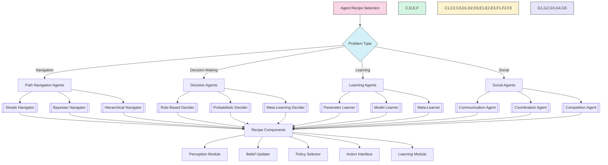

## 🔄 Development Workflow

### Agent Development Lifecycle

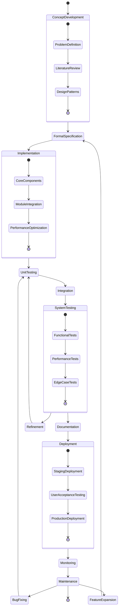

### Data Flow Architecture

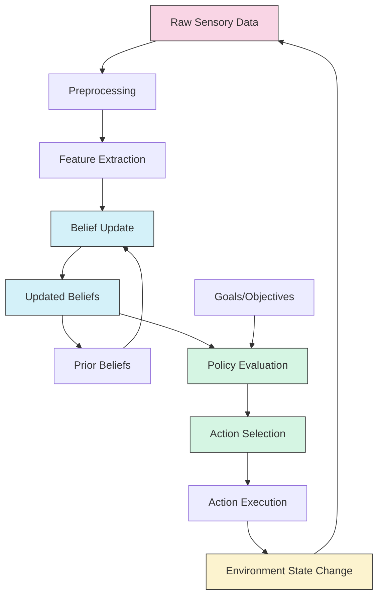

### Contribution Process

1. **Knowledge Expansion**: Add to [[knowledge_base|Knowledge Base]]

1. **Implementation**: Develop in `tools/src/`

1. **Testing**: Add tests in `tests/`

1. **Documentation**: Document in `docs/`

1. **Review**: Submit for peer review

1. **Integration**: Merge into main codebase

1. **Release**: Include in version releases

1. **Feedback**: Gather user feedback

1. **Iteration**: Refine based on feedback

### Repository Structure

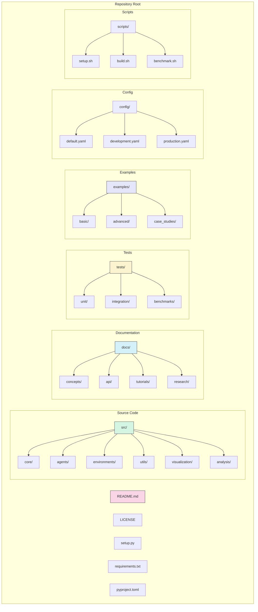

## 🔗 Related Resources

### Internal Resources

- [[DOCUMENTATION_ROADMAP|Documentation Roadmap]]

- [[project_structure|Project Structure]]

- [[config|Configuration Guide]]

- [[development_standards|Development Standards]]

- [[testing_strategy|Testing Strategy]]

- [[coding_conventions|Coding Conventions]]

- [[deployment_pipeline|Deployment Pipeline]]

- [[versioning_strategy|Versioning Strategy]]

- [[release_notes|Release Notes]]

### Research Connections

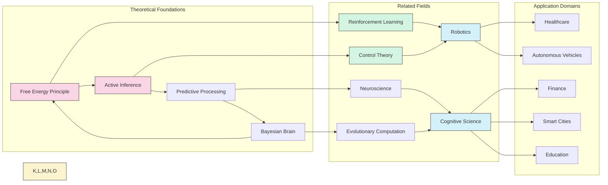

### External Resources

- [[papers|Research Papers]]

- [[related_projects|Related Projects]]

- [[learning_materials|Learning Materials]]

- [[conferences|Relevant Conferences]]

- [[research_groups|Research Groups]]

- [[industry_applications|Industry Applications]]

- [[datasets|Benchmark Datasets]]

- [[books|Essential Books]]

- [[online_courses|Online Courses]]

### Community and Support

- [[github_repo|GitHub Repository]]

- [[issue_tracker|Issue Tracker]]

- [[discord|Discord Community]]

- [[slack|Slack Workspace]]

- [[contributor_guidelines|Contributor Guidelines]]

- [[faq|Frequently Asked Questions]]

- [[troubleshooting|Troubleshooting Guide]]

- [[support_channels|Support Channels]]

---

> [!tip] Using This Document
> Navigate this clearinghouse by clicking on the [[linked]] items or using Obsidian's graph view to visualize connections between concepts, implementations, and documentation.
>
> For quick reference, use the sidebar navigation or Ctrl+F to search for specific topics.
>
> All diagrams can be edited and expanded by clicking on them and selecting "Edit" in Obsidian.

