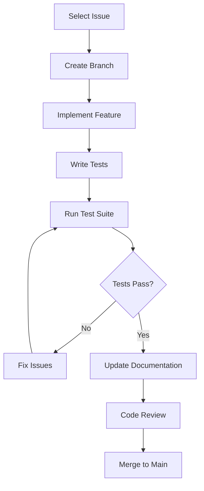
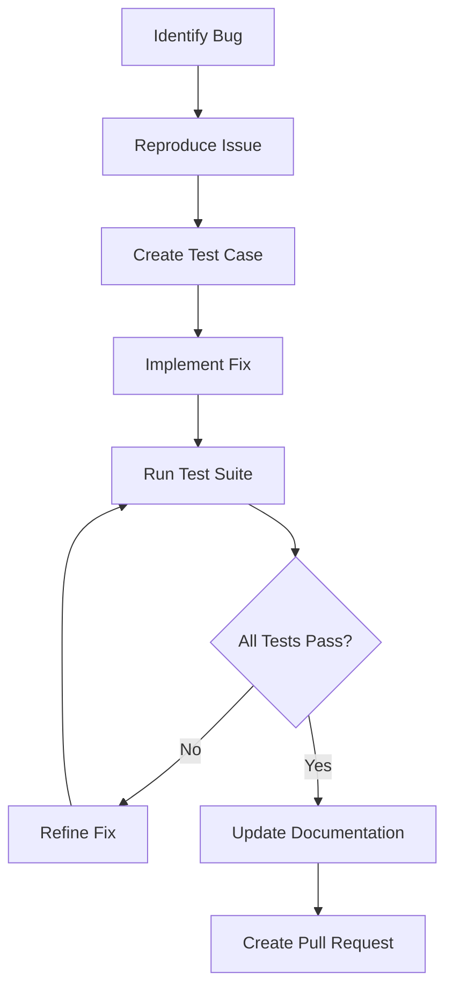
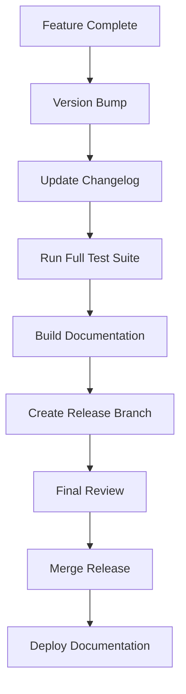

# Development Resources

Comprehensive development resources, guidelines, and workflows for contributing to the Active Inference cognitive modeling framework. This directory provides essential information for developers, contributors, and maintainers.

## 🛠️ Development Overview

### Development Categories

#### [[../repo_docs/contribution_guide|Contribution Guidelines]]
Complete guide for contributing to the project, including coding standards, testing requirements, and submission processes.

#### [[../repo_docs/development_standards|Development Standards]]
Technical standards and best practices for code quality, documentation, and project organization.

#### [[../repo_docs/git_workflow|Git Workflow]]
Version control practices, branching strategies, and collaboration workflows for the project.

## 🚀 Getting Started with Development

### New Contributor Setup
1. **Repository Access**: Fork and clone the repository
2. **Environment Setup**: Install development dependencies and tools
3. **Development Environment**: Configure IDE and development tools
4. **Testing Setup**: Install and configure testing frameworks

### Development Workflow
1. **Issue Selection**: Choose or create appropriate issue for work
2. **Branch Creation**: Create feature branch following naming conventions
3. **Implementation**: Develop solution following coding standards
4. **Testing**: Comprehensive testing and validation
5. **Documentation**: Update relevant documentation
6. **Review Process**: Submit for code review and address feedback

## 📋 Development Standards

### Code Quality Standards
- **Style Guidelines**: Consistent code formatting and naming conventions
- **Documentation**: Comprehensive docstrings and inline comments
- **Type Hints**: Type annotations for better code clarity
- **Error Handling**: Robust error handling and logging practices

### Testing Requirements
- **Unit Tests**: Individual component testing with high coverage
- **Integration Tests**: Multi-component interaction testing
- **Performance Tests**: Benchmarking and performance validation
- **Documentation Tests**: Example and documentation validation

### Documentation Standards
- **Code Documentation**: Clear, comprehensive code documentation
- **API Documentation**: Complete API reference documentation
- **User Guides**: Intuitive user guidance and tutorials
- **Technical Documentation**: Detailed technical specifications

## 🔧 Development Tools and Environments

### Required Tools
- **Python 3.8+**: Core development language
- **Git**: Version control system
- **Testing Frameworks**: pytest, coverage, and related tools
- **Documentation Tools**: Sphinx, MkDocs, or similar
- **Code Quality Tools**: Black, flake8, mypy, and linting tools

### Development Environment Setup
```bash
# Clone repository
git clone https://github.com/ActiveInferenceInstitute/cognitive.git
cd cognitive

# Create virtual environment
python -m venv dev_env
source dev_env/bin/activate  # On Windows: dev_env\Scripts\activate

# Install development dependencies
pip install -r requirements-dev.txt

# Install pre-commit hooks
pre-commit install

# Run initial tests
pytest tests/ -x
```

### IDE Configuration
- **VS Code**: Recommended with Python, Pylance, and relevant extensions
- **PyCharm**: Professional Python IDE with full feature support
- **Jupyter**: For interactive development and prototyping
- **Git Integration**: Essential for version control workflow

## 📊 Development Workflows

### Feature Development Workflow


### Bug Fix Workflow


### Release Workflow


## 🧪 Testing and Quality Assurance

### Testing Framework
- **pytest**: Primary testing framework with fixtures and parametrization
- **unittest.mock**: Mocking and patching for isolated testing
- **hypothesis**: Property-based testing for robust validation
- **coverage**: Code coverage measurement and reporting

### Quality Assurance
- **Code Reviews**: Mandatory peer review for all changes
- **Continuous Integration**: Automated testing on all commits
- **Code Quality Checks**: Automated linting and formatting
- **Performance Monitoring**: Benchmarking and performance tracking

### Testing Best Practices
- **Test Isolation**: Independent, isolated test cases
- **Comprehensive Coverage**: High code coverage requirements
- **Edge Case Testing**: Boundary condition and error case testing
- **Regression Testing**: Prevention of functionality regression

## 📚 Documentation Development

### Documentation Types
- **API Documentation**: Automatically generated from code docstrings
- **User Guides**: Step-by-step guides for users and developers
- **Technical Documentation**: Detailed technical specifications
- **Tutorial Content**: Educational content and examples

### Documentation Tools
- **Sphinx**: Professional documentation generation
- **MyST**: Markdown support for Sphinx documentation
- **Read the Docs**: Online documentation hosting
- **Docstring Standards**: NumPy or Google style docstrings

### Documentation Workflow
1. **Content Creation**: Write clear, comprehensive documentation
2. **Build Validation**: Ensure documentation builds correctly
3. **Cross-Reference Checking**: Validate all internal links
4. **Review Process**: Documentation peer review and validation

## 🤝 Contribution Process

### Issue Management
- **Issue Creation**: Clear, detailed issue descriptions
- **Label Usage**: Appropriate labeling for categorization
- **Priority Assignment**: Clear priority and impact assessment
- **Milestone Assignment**: Release planning and tracking

### Pull Request Process
- **Branch Naming**: Descriptive, convention-following branch names
- **Commit Messages**: Clear, descriptive commit messages
- **Pull Request Description**: Comprehensive PR descriptions
- **Review Process**: Thorough code and documentation review

### Code Review Guidelines
- **Review Criteria**: Functionality, style, documentation, testing
- **Constructive Feedback**: Helpful, actionable review comments
- **Approval Process**: Clear approval criteria and process
- **Follow-up Actions**: Addressing review feedback effectively

## 🔄 Continuous Integration and Deployment

### CI/CD Pipeline
- **Automated Testing**: Full test suite execution on commits
- **Code Quality Checks**: Linting and formatting validation
- **Documentation Building**: Automated documentation generation
- **Deployment Automation**: Automated deployment processes

### Release Management
- **Version Control**: Semantic versioning practices
- **Changelog Maintenance**: Comprehensive change documentation
- **Release Notes**: User-facing release communications
- **Rollback Procedures**: Safe rollback and recovery processes

## 🎯 Development Best Practices

### Code Development
- **Modular Design**: Clean, modular code architecture
- **SOLID Principles**: Object-oriented design best practices
- **DRY Principle**: Don't Repeat Yourself - code reuse
- **KISS Principle**: Keep It Simple, Stupid - simplicity focus

### Collaboration
- **Clear Communication**: Transparent development communication
- **Knowledge Sharing**: Active knowledge dissemination
- **Mentorship**: Supporting new contributor development
- **Community Building**: Fostering collaborative development culture

### Maintenance
- **Technical Debt Management**: Regular code quality improvement
- **Dependency Updates**: Regular dependency maintenance
- **Security Updates**: Timely security patch application
- **Performance Optimization**: Ongoing performance improvement

## 📈 Metrics and Monitoring

### Development Metrics
- **Code Coverage**: Test coverage percentage tracking
- **Code Quality**: Complexity, maintainability, and quality metrics
- **Commit Frequency**: Development activity and productivity tracking
- **Issue Resolution**: Issue tracking and resolution metrics

### Quality Metrics
- **Bug Rates**: Bug discovery and resolution tracking
- **Performance Benchmarks**: Performance regression monitoring
- **User Satisfaction**: Developer and user satisfaction metrics
- **Community Health**: Community engagement and health indicators

## 🔗 Related Documentation

### Project Resources
- [[../README|Main Documentation]]
- [[../repo_docs/README|Repository Documentation]]
- [[../../README|Project README]]

### Development Tools
- [[../../tools/README|Development Tools]]
- [[../../tests/README|Testing Framework]]
- [[../api/README|API Documentation]]

### Community Resources
- [[../repo_docs/contribution_guide|Contribution Guide]]
- [[../guides/community_guide|Community Guidelines]]
- [[../../LICENSE|Project License]]

## 🔗 Cross-References

### Development Resources
- [[../repo_docs/contribution_guide|Contribution Guidelines]]
- [[../repo_docs/development_standards|Development Standards]]
- [[../repo_docs/git_workflow|Git Workflow]]

### Quality Assurance
- [[../../tests/README|Testing Framework]]
- [[../repo_docs/code_standards|Code Standards]]
- [[../repo_docs/testing_guidelines|Testing Guidelines]]

---

> **Professional Development**: Comprehensive development resources ensuring high-quality, maintainable, and collaborative software development practices.

---

> **Quality Focus**: Rigorous quality assurance processes ensuring reliable, well-tested, and thoroughly documented code contributions.

---

> **Community Collaboration**: Supportive development environment fostering knowledge sharing, mentorship, and collaborative innovation.

