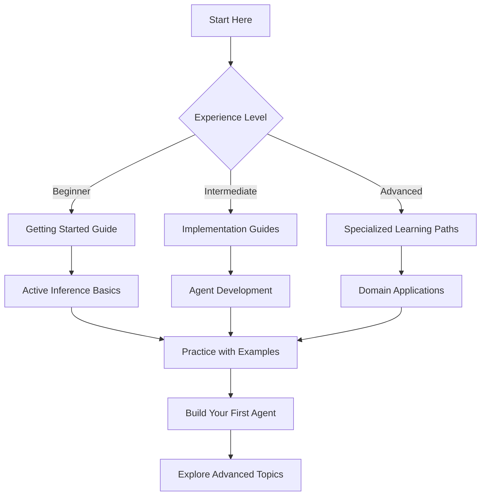

# Implementation Guides Index

This directory contains comprehensive guides for implementing, understanding, and applying cognitive modeling concepts. The guides are organized by learning progression and application domain, providing both theoretical background and practical implementation strategies.

## 📚 Guides Organization

### Application Guides (`application/`)
- [[application/active_inference_spatial_applications|Active Inference Spatial Applications]]
- [[application/guide_for_cognitive_modeling|Guide for Cognitive Modeling]]
- [[application/parr_2022_chapter_6|Parr 2022 Chapter 6]]

### Learning Paths (`learning_paths/`)
Comprehensive structured learning paths covering different aspects of cognitive modeling:

#### Core Theoretical Paths
- [[learning_paths/active_inference_learning_path|Active Inference Learning Path]]
- [[learning_paths/active_inference_mathematical_learning_path|Mathematical Foundations]]
- [[learning_paths/active_inference_cognitive_learning_path|Cognitive Science Perspective]]

#### Application Domain Paths
- [[learning_paths/active_inference_biological_learning_path|Biological Applications]]
- [[learning_paths/active_inference_robotics_learning_path|Robotics Applications]]
- [[learning_paths/active_inference_neuroscience_learning_path|Neuroscience Applications]]
- [[learning_paths/active_inference_social_learning_path|Social Systems]]

#### Advanced Specialization Paths
- [[learning_paths/active_inference_quantum_learning_path|Quantum Cognitive Systems]]
- [[learning_paths/active_inference_security_learning_path|Security Applications]]
- [[learning_paths/active_inference_spatial_web_path|Spatial Web Technologies]]
- [[learning_paths/active_inference_edge_cognitive_systems_path|Edge Computing]]

## 🧭 Learning Progression

### Beginner Level
1. **Getting Started**
   - [[../getting_started|Getting Started Guide]]
   - [[application/guide_for_cognitive_modeling|Guide for Cognitive Modeling]]
   - [[learning_paths/active_inference_learning_path|Active Inference Basics]]

2. **Core Concepts**
   - [[learning_paths/active_inference_mathematical_learning_path|Mathematical Foundations]]
   - [[learning_paths/active_inference_cognitive_learning_path|Cognitive Principles]]
   - [[application/active_inference_spatial_applications|Spatial Applications]]

### Intermediate Level
1. **Implementation**
   - [[../implementation/implementation_guides|Implementation Guides]]
   - [[learning_paths/active_inference_biological_learning_path|Biological Applications]]
   - [[learning_paths/active_inference_robotics_learning_path|Robotics Applications]]

2. **Advanced Theory**
   - [[learning_paths/active_inference_neuroscience_learning_path|Neuroscience]]
   - [[learning_paths/active_inference_social_learning_path|Social Cognition]]
   - [[application/parr_2022_chapter_6|Advanced Active Inference]]

### Advanced Level
1. **Specialization**
   - [[learning_paths/active_inference_quantum_learning_path|Quantum Systems]]
   - [[learning_paths/active_inference_security_learning_path|Security Applications]]
   - [[learning_paths/active_inference_spatial_web_path|Spatial Computing]]

2. **Integration**
   - [[learning_paths/active_inference_edge_cognitive_systems_path|Edge Computing]]
   - [[learning_paths/active_inference_fuller_learning_path|Fuller Framework]]
   - [[learning_paths/active_inference_myrmecology_learning_path|Swarm Intelligence]]

## 📖 Guide Categories

### Theoretical Guides
- **Active Inference Theory**: Core principles and mathematical foundations
- **Cognitive Architectures**: Agent design and cognitive systems
- **Information Processing**: Perception, attention, and memory systems
- **Decision Making**: Policy selection and action planning

### Implementation Guides
- **Agent Development**: Building cognitive agents from scratch
- **Environment Creation**: Designing simulation environments
- **Integration Patterns**: Combining components into systems
- **Performance Optimization**: Improving efficiency and scalability

### Application Guides
- **Domain Applications**: Healthcare, finance, robotics, etc.
- **Industry Solutions**: Real-world problem solving
- **Research Applications**: Experimental design and analysis
- **Educational Applications**: Teaching and learning systems

### Development Guides
- **Code Standards**: Programming best practices
- **Testing Strategies**: Validation and verification
- **Documentation**: Writing clear technical documentation
- **Deployment**: Production system deployment

## 🚀 Quick Start Guides

### First Steps


### Recommended Learning Sequence

1. **Week 1: Foundations**
   - Read [[application/guide_for_cognitive_modeling]]
   - Complete [[learning_paths/active_inference_learning_path]]
   - Try basic examples in [[../examples/]]

2. **Week 2: Core Implementation**
   - Study [[../implementation/implementation_guides]]
   - Build simple agent using [[../../Things/Simple_POMDP/]]
   - Learn testing with [[../repo_docs/unit_testing]]

3. **Week 3: Advanced Applications**
   - Choose domain from [[learning_paths/]]
   - Implement domain-specific agent
   - Analyze performance with [[../tools/]]

4. **Week 4: Integration and Deployment**
   - Study [[../guides/integration_patterns]]
   - Deploy system using [[../guides/deployment_guide]]
   - Document work following [[../repo_docs/documentation_standards]]

## 🛠️ Practical Implementation Guides

### Agent Development Workflow
```python
# Complete agent development example
def develop_cognitive_agent():
    """Complete workflow for developing a cognitive agent."""

    # 1. Define requirements
    requirements = define_agent_requirements()

    # 2. Design architecture
    architecture = design_agent_architecture(requirements)

    # 3. Implement components
    components = implement_agent_components(architecture)

    # 4. Integrate system
    system = integrate_agent_system(components)

    # 5. Test and validate
    validation_results = validate_agent_system(system)

    # 6. Optimize performance
    optimized_system = optimize_agent_performance(system, validation_results)

    # 7. Deploy and monitor
    deployment = deploy_agent_system(optimized_system)

    return deployment
```

### Environment Design Patterns
```python
# Environment implementation patterns
class CognitiveEnvironment:
    """Base class for cognitive agent environments."""

    def __init__(self, config):
        self.state_space = self.define_state_space(config)
        self.action_space = self.define_action_space(config)
        self.observation_model = self.create_observation_model(config)
        self.reward_function = self.design_reward_function(config)

    def reset(self):
        """Reset environment to initial state."""
        self.current_state = self.sample_initial_state()
        observation = self.generate_observation(self.current_state)
        return observation

    def step(self, action):
        """Execute action and return results."""
        # Action validation
        if not self.is_valid_action(action):
            raise ValueError(f"Invalid action: {action}")

        # State transition
        next_state = self.transition_function(self.current_state, action)

        # Reward computation
        reward = self.reward_function(self.current_state, action, next_state)

        # Observation generation
        observation = self.generate_observation(next_state)

        # Termination check
        done = self.is_terminal_state(next_state)

        # Update state
        self.current_state = next_state

        return observation, reward, done, {}

    def render(self, mode='human'):
        """Render environment state."""
        if mode == 'human':
            self.human_render()
        elif mode == 'rgb_array':
            return self.array_render()
```

### Testing and Validation Framework
```python
# Comprehensive testing framework
class AgentValidationSuite:
    """Complete validation suite for cognitive agents."""

    def __init__(self, agent_class, test_config):
        self.agent_class = agent_class
        self.test_config = test_config
        self.environments = self.create_test_environments()
        self.metrics = self.initialize_metrics()

    def run_complete_validation(self):
        """Run comprehensive agent validation."""

        results = {}

        # Unit tests
        results['unit_tests'] = self.run_unit_tests()

        # Integration tests
        results['integration_tests'] = self.run_integration_tests()

        # Performance tests
        results['performance_tests'] = self.run_performance_tests()

        # Robustness tests
        results['robustness_tests'] = self.run_robustness_tests()

        # Learning tests
        results['learning_tests'] = self.run_learning_tests()

        return self.analyze_results(results)

    def run_unit_tests(self):
        """Test individual agent components."""
        # Test belief updating
        # Test policy selection
        # Test action execution
        pass

    def run_integration_tests(self):
        """Test component interactions."""
        # Test agent-environment interaction
        # Test multi-agent coordination
        # Test learning loops
        pass

    def run_performance_tests(self):
        """Test computational performance."""
        # Test inference speed
        # Test memory usage
        # Test scalability
        pass
```

## 🎯 Domain-Specific Guides

### Healthcare Applications
- **Medical Decision Support**: Diagnostic assistance systems
- **Patient Monitoring**: Continuous health state tracking
- **Treatment Planning**: Personalized therapy optimization
- **Healthcare Resource Allocation**: Hospital resource management

### Financial Applications
- **Algorithmic Trading**: Market prediction and execution
- **Risk Assessment**: Portfolio risk evaluation
- **Fraud Detection**: Anomaly detection systems
- **Investment Strategy**: Portfolio optimization

### Robotics Applications
- **Autonomous Navigation**: Path planning and obstacle avoidance
- **Manipulation**: Object grasping and manipulation
- **Human-Robot Interaction**: Natural interaction systems
- **Swarm Robotics**: Multi-robot coordination

### Environmental Applications
- **Climate Modeling**: Long-term environmental prediction
- **Resource Management**: Sustainable resource allocation
- **Conservation Planning**: Biodiversity protection
- **Environmental Monitoring**: Ecosystem health tracking

## 📊 Guide Quality Metrics

### Content Assessment
- **Completeness**: Coverage of essential concepts
- **Accuracy**: Technical correctness and validity
- **Clarity**: Clear explanations and examples
- **Practicality**: Real-world applicability

### Usage Statistics
- **Readability**: Ease of understanding
- **Actionability**: Ability to implement concepts
- **Up-to-date**: Currency of information
- **Cross-linking**: Connection to related resources

## 🔄 Guide Maintenance

### Update Process
1. **Monitor Changes**: Track framework updates and new research
2. **Review Content**: Regular content review and validation
3. **Update Examples**: Refresh code examples and implementations
4. **Add New Content**: Include new domains and applications

### Quality Assurance
- **Peer Review**: Expert review of technical content
- **User Testing**: Practical application validation
- **Cross-Reference Validation**: Link integrity checking
- **Example Testing**: Code example verification

## 📚 Related Resources

### Core Documentation
- [[../README|Main Documentation Index]]
- [[../api/README|API Documentation]]
- [[../implementation/README|Implementation Guides]]

### Learning Resources
- [[../examples/|Usage Examples]]
- [[../templates/|Documentation Templates]]
- [[../repo_docs/|Repository Documentation]]

### Community Resources
- [[../research/|Research Documentation]]
- [[../tools/|Development Tools]]
- [[../development/|Development Guides]]

## 🔗 Cross-References

### Implementation References
- [[../../Things/|Implementation Examples]]
- [[../../tools/|Development Tools]]
- [[../../tests/|Testing Framework]]

### Theoretical Foundations
- [[../../knowledge_base/cognitive/|Cognitive Science]]
- [[../../knowledge_base/mathematics/|Mathematical Foundations]]
- [[../../knowledge_base/agents/|Agent Architectures]]

---

> **Learning Tip**: Follow the structured learning paths for comprehensive understanding, then explore application guides for domain-specific implementations.

---

> **Contribution**: New guides should follow the established patterns and include practical examples. See [[../repo_docs/documentation_standards|documentation standards]] for guidelines.
