# Active Inference in AGI and Superintelligence Learning Path

## Quick Reference
- **Difficulty**: Expert
- **Time Commitment**: 25-30 hours/week for 24 weeks
- **Prerequisites Score**: 9/10 (advanced AI/ML and safety expertise)
- **Industry Relevance**: Critical (AGI Research, AI Safety)
- **Hands-on Component**: 40%
- **Theory Component**: 60%

## Executive Summary

### Purpose and Scope
This advanced learning path explores the integration of Active Inference principles with Artificial General Intelligence (AGI) and superintelligence development. It focuses on safe and robust approaches to developing advanced AI systems, emphasizing theoretical foundations, practical implementation, and crucial safety considerations.

### Target Audience
- **Primary**: AGI researchers and AI safety specialists
- **Secondary**: Advanced ML engineers and cognitive architects
- **Career Stage**: Senior researchers and engineers (5+ years experience)

### Learning Outcomes
By completing this path, learners will be able to:
1. Design and implement safe AGI architectures using Active Inference principles
2. Develop robust safety mechanisms for recursive self-improving systems
3. Create and validate superintelligent system frameworks
4. Implement verifiable value alignment and safety guarantees

### Industry Applications
- Research: AGI development, AI safety research
- Development: Safe AI systems, cognitive architectures
- Safety: AI alignment, robustness verification
- Strategy: Long-term AI development planning

## Path Selection Guide
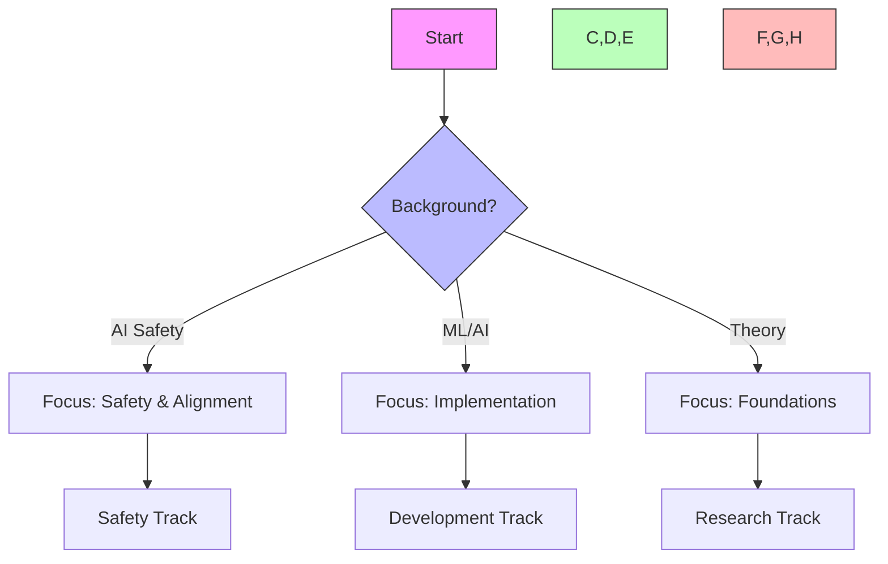

## Path Interconnections
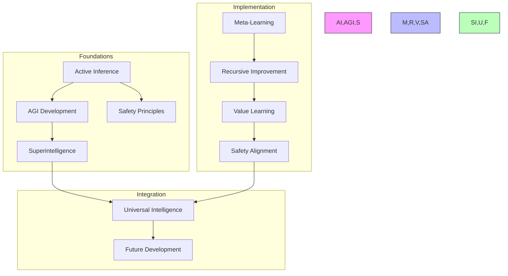

### System Architecture
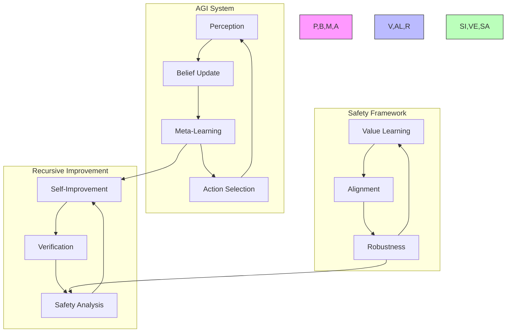

## Prerequisites

### 1. AGI Foundations (4 weeks)
- Cognitive Architectures
  - Universal intelligence
  - Meta-learning
  - Recursive self-improvement
  - Consciousness theories

- Intelligence Theory
  - General intelligence
  - Intelligence explosion
  - Cognitive enhancement
  - Mind architectures

- Safety & Ethics
  - AI alignment
  - Value learning
  - Corrigibility
  - Robustness

- Systems Theory
  - Complex systems
  - Emergence
  - Self-organization
  - Information dynamics

### 2. Technical Skills (2 weeks)
- Advanced Tools
  - Meta-programming
  - Formal verification
  - Distributed systems
  - Safety frameworks

## Core Learning Path

### 1. AGI Modeling (4 weeks)

#### Week 1-2: Universal Intelligence Framework
```python
class UniversalIntelligenceModel:
    def __init__(self,
                 cognitive_dims: List[int],
                 meta_learning_rate: float):
        """Initialize universal intelligence model."""
        self.cognitive_architecture = RecursiveCognitiveArchitecture(cognitive_dims)
        self.meta_learner = MetaLearningSystem(meta_learning_rate)
        self.safety_constraints = SafetyConstraints()
        
    def recursive_improvement(self,
                            current_state: torch.Tensor,
                            safety_bounds: SafetyBounds) -> torch.Tensor:
        """Perform safe recursive self-improvement."""
        improvement_plan = self.meta_learner.design_improvement(current_state)
        validated_plan = self.safety_constraints.validate(improvement_plan)
        return self.cognitive_architecture.implement(validated_plan)
```

#### Week 3-4: Meta-Learning and Adaptation
```python
class MetaCognitiveController:
    def __init__(self,
                 architecture_space: ArchitectureSpace,
                 safety_verifier: SafetyVerifier):
        """Initialize metacognitive controller."""
        self.architecture_search = ArchitectureSearch(architecture_space)
        self.safety_verifier = safety_verifier
        self.meta_objectives = MetaObjectives()
        
    def evolve_architecture(self,
                          performance_history: torch.Tensor,
                          safety_requirements: SafetySpec) -> CognitiveArchitecture:
        """Evolve cognitive architecture while maintaining safety."""
        candidate_architectures = self.architecture_search.generate_candidates()
        safe_architectures = self.safety_verifier.filter(candidate_architectures)
        return self.select_optimal_architecture(safe_architectures)
```

### 2. AGI Development (6 weeks)

#### Week 1-2: Cognitive Integration
- Multi-scale cognition
- Cross-domain transfer
- Meta-reasoning
- Recursive improvement

#### Week 3-4: Safety Mechanisms
- Value alignment
- Robustness verification
- Uncertainty handling
- Fail-safe systems

#### Week 5-6: Superintelligence Capabilities
- Recursive self-improvement
- Strategic awareness
- Long-term planning
- Multi-agent coordination

### 3. Advanced Intelligence (4 weeks)

#### Week 1-2: Intelligence Amplification
```python
class IntelligenceAmplifier:
    def __init__(self,
                 base_intelligence: Intelligence,
                 safety_bounds: SafetyBounds):
        """Initialize intelligence amplification system."""
        self.intelligence = base_intelligence
        self.safety_bounds = safety_bounds
        self.amplification_strategies = AmplificationStrategies()
        
    def safe_amplification(self,
                          current_level: torch.Tensor,
                          target_level: torch.Tensor) -> Intelligence:
        """Safely amplify intelligence within bounds."""
        trajectory = self.plan_amplification_trajectory(current_level, target_level)
        verified_steps = self.verify_safety(trajectory)
        return self.execute_amplification(verified_steps)
```

#### Week 3-4: Superintelligent Systems
- Cognitive architectures
- Decision theories
- Value learning
- Strategic planning

### 4. Advanced Topics (4 weeks)

#### Week 1-2: Universal Intelligence
```python
class UniversalIntelligenceFramework:
    def __init__(self,
                 cognitive_space: CognitiveSpace,
                 safety_framework: SafetyFramework):
        """Initialize universal intelligence framework."""
        self.cognitive_space = cognitive_space
        self.safety_framework = safety_framework
        self.universal_objectives = UniversalObjectives()
        
    def develop_intelligence(self,
                           initial_state: torch.Tensor,
                           safety_constraints: List[Constraint]) -> Intelligence:
        """Develop universal intelligence safely."""
        development_path = self.plan_development(initial_state)
        safe_path = self.safety_framework.verify_path(development_path)
        return self.execute_development(safe_path)
```

#### Week 3-4: Future Intelligence
- Intelligence explosion
- Post-singularity cognition
- Universal computation
- Omega-level intelligence

## Projects

### AGI Projects
1. **Cognitive Architecture**
   - Meta-learning systems
   - Safety frameworks
   - Value learning
   - Recursive improvement

2. **Safety Implementation**
   - Alignment mechanisms
   - Robustness testing
   - Uncertainty handling
   - Verification systems

### Advanced Projects
1. **Superintelligence Development**
   - Intelligence amplification
   - Strategic planning
   - Safety guarantees
   - Value stability

2. **Universal Intelligence**
   - General problem-solving
   - Meta-cognitive systems
   - Cross-domain adaptation
   - Safe recursion

## Resources

### Academic Resources
1. **Research Papers**
   - AGI Theory
   - Safety Research
   - Intelligence Theory
   - Cognitive Architectures

2. **Books**
   - Superintelligence
   - AGI Development
   - AI Safety
   - Cognitive Science

### Technical Resources
1. **Software Tools**
   - AGI Frameworks
   - Safety Verification
   - Meta-learning Systems
   - Cognitive Architectures

2. **Development Resources**
   - Formal Methods
   - Safety Tools
   - Testing Frameworks
   - Verification Systems

## Next Steps

### Advanced Topics
1. [[superintelligence_learning_path|Superintelligence]]
2. [[universal_intelligence_learning_path|Universal Intelligence]]
3. [[cognitive_safety_learning_path|Cognitive Safety]]

### Research Directions
1. [[research_guides/agi_development|AGI Development]]
2. [[research_guides/ai_safety|AI Safety Research]]
3. [[research_guides/superintelligence|Superintelligence Research]]

## Integration Strategies

### Development Approaches
- Theory-Practice Integration
  - Mathematical foundations
  - Safety proofs
  - Implementation verification
- Cross-Domain Development
  - Cognitive architectures
  - Safety frameworks
  - Value learning systems
- Research Integration
  - Theoretical advances
  - Empirical validation
  - Safety verification

### Research Framework
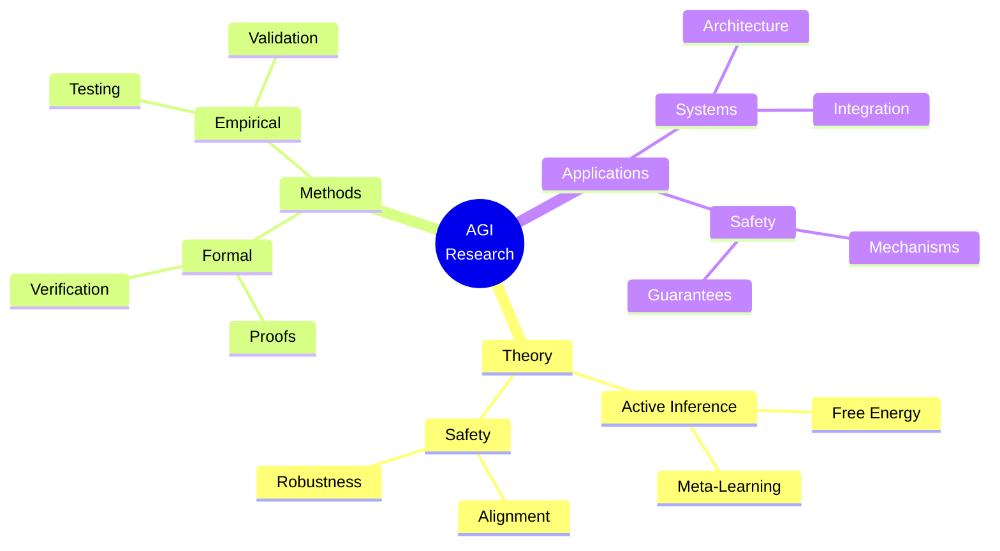

### Development Lifecycle
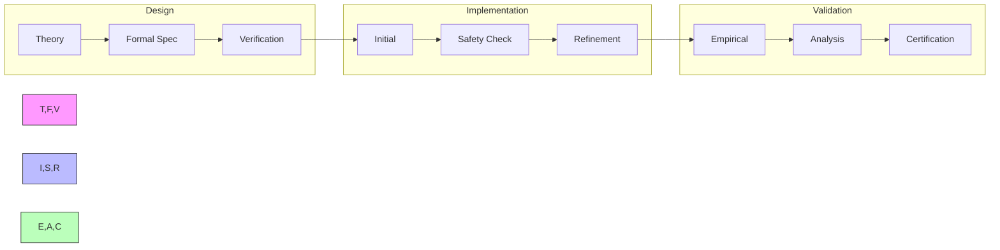

## Assessment Framework

### Continuous Assessment
#### Weekly Checkpoints
- Theoretical Understanding (90% required)
  - AGI principles
  - Safety frameworks
  - Formal methods
- Implementation Skills (85% required)
  - Architecture development
  - Safety verification
  - System integration
- Research Progress (90% required)
  - Literature review
  - Novel contributions
  - Safety proofs

#### Progress Tracking
- Daily Development Log
- Weekly Safety Audits
- Monthly Research Reports
- Quarterly Framework Reviews

### Knowledge Checkpoints

#### Foundation Checkpoint (Week 8)
- Format: Written + Formal Proofs
- Duration: 6 hours
- Topics:
  - AGI theory foundations
  - Safety principles
  - Formal verification
- Requirements:
  - Theory: 90% correct
  - Proofs: Formally verified
  - Implementation: Safe prototype

#### Advanced Integration (Week 16)
- Format: Research Project
- Duration: 2 weeks
- Focus:
  - AGI architecture design
  - Safety mechanism implementation
  - Formal verification
- Deliverables:
  - Technical specification
  - Safety proofs
  - Working prototype

#### Final Assessment (Week 24)
- Format: Research Publication + System
- Duration: 4 weeks
- Components:
  - Novel AGI framework
  - Safety guarantees
  - Empirical validation
- Requirements:
  - Publication-ready paper
  - Verified implementation
  - Safety certification

### Project Portfolio

#### Research Projects
1. AGI Architecture Development
   - Scope: Safe AGI system design
   - Deliverables:
     - Formal specification
     - Safety proofs
     - Implementation
   - Evaluation:
     - Theory: 35%
     - Safety: 35%
     - Implementation: 30%

2. Safety Framework Integration
   - Scope: Robust safety mechanisms
   - Deliverables:
     - Safety framework
     - Verification system
     - Test suite
   - Evaluation:
     - Safety: 40%
     - Verification: 35%
     - Documentation: 25%

#### Final Project
- Description: Novel AGI System
- Requirements:
  - Technical:
    - Original architecture
    - Safety guarantees
    - Formal verification
  - Documentation:
    - Research paper
    - Safety proofs
    - Technical specs
  - Validation:
    - Empirical results
    - Safety certification
    - Peer review

### Success Criteria
#### Technical Competency
- Theory: Expert level (9/10)
- Safety: Expert level (9/10)
- Implementation: Advanced (8/10)
- Research: Publication quality

#### Project Delivery
- Quality Standards:
  - Formal verification
  - Safety certification
  - Documentation complete
- Performance Metrics:
  - System robustness
  - Safety guarantees
  - Research impact

#### Professional Development
- Research publications
- Safety certifications
- Framework contributions
- Community leadership

## Career Development

### Industry Alignment
#### Research Roles
- AGI Researcher
  - Theory development
  - Safety research
  - Framework design
- Safety Specialist
  - Verification systems
  - Safety proofs
  - Risk assessment
- Technical Lead
  - Architecture design
  - Team leadership
  - Strategic planning

#### Certification Path
- AGI Development
  - Formal methods
  - System architecture
- Safety Engineering
  - Verification systems
  - Risk analysis
- Research Leadership
  - Project management
  - Strategic planning

### Professional Network
#### Research Community
- Academic Connections:
  - Research labs
  - Universities
  - Safety institutes
- Industry Partners:
  - AGI companies
  - Safety organizations
  - Research institutes
- Professional Organizations:
  - AGI Society
  - AI Safety Network
  - Formal Methods Group

#### Career Progression
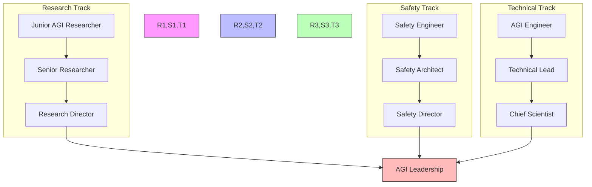

### Competency Framework
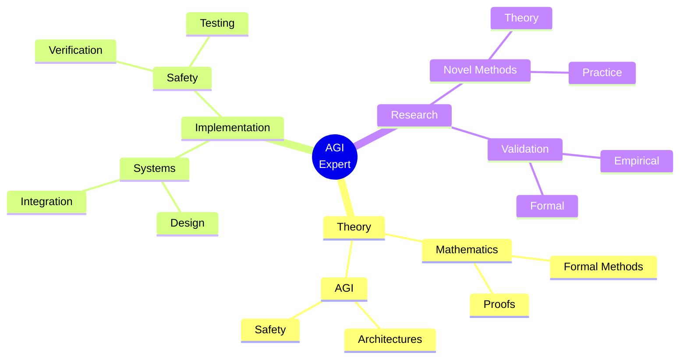

### Research Focus Areas
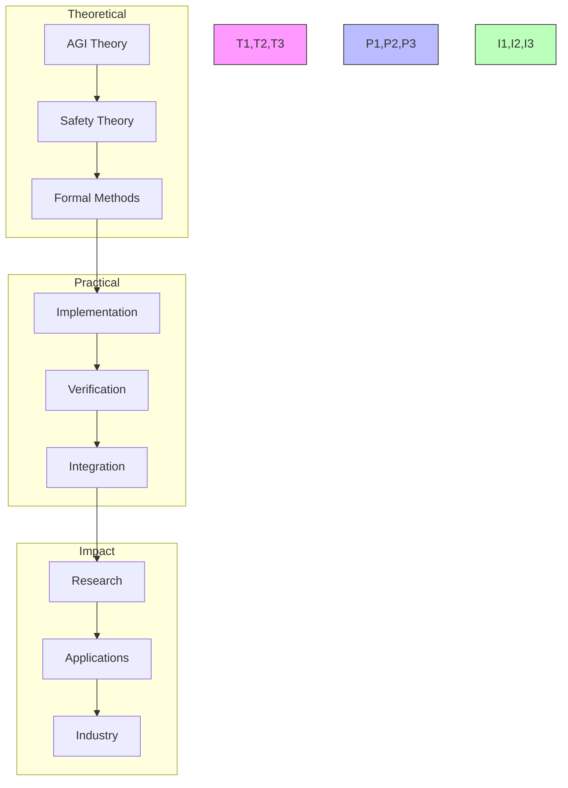

## Support Resources

### Research Support
- Literature Database
  - AGI papers
  - Safety research
  - Formal methods
- Computing Resources
  - HPC clusters
  - Cloud computing
  - Verification systems
- Analysis Tools
  - Formal verification
  - Safety analysis
  - Performance profiling

### Technical Support
- Development Tools
  - AGI frameworks
  - Safety toolkits
  - Verification suites
- Documentation
  - Architecture specs
  - Safety guidelines
  - Best practices
- Computing Resources
  - Development environments
  - Testing frameworks
  - Deployment tools

### Learning Support
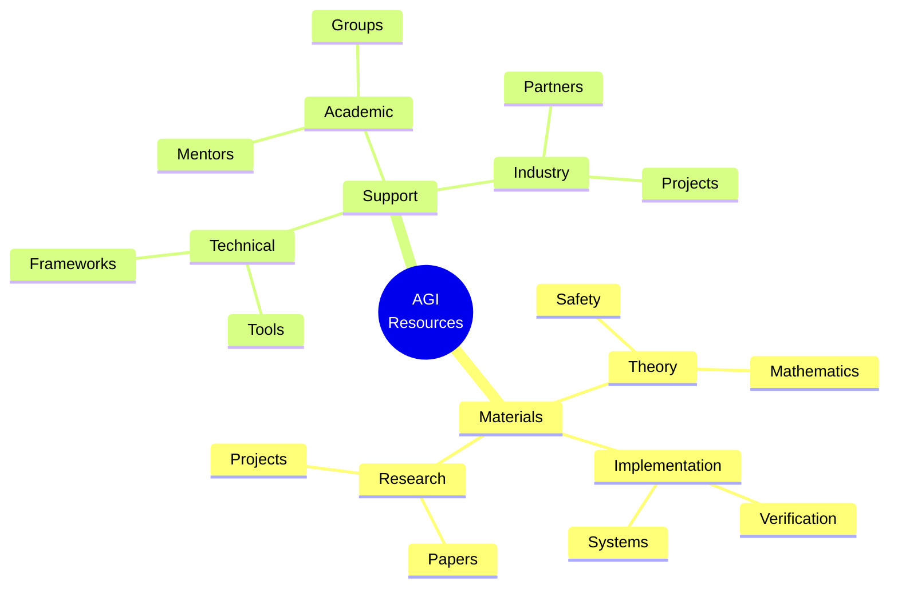

## Version Control and Updates

### Version History
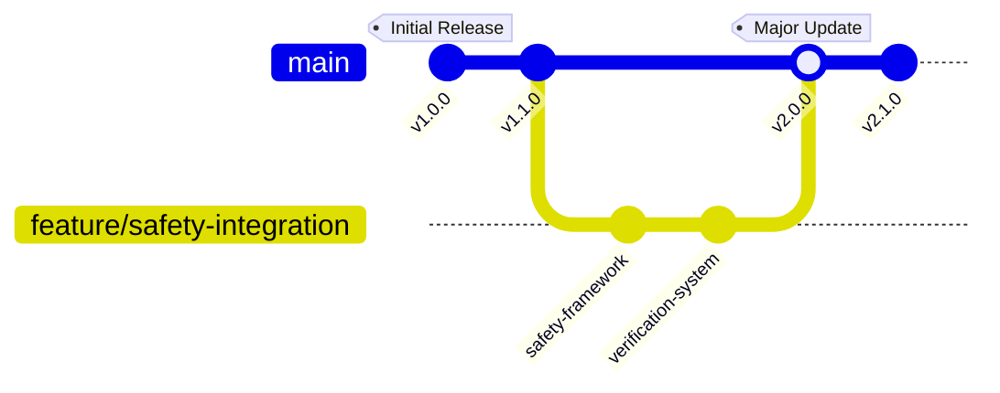

### Change Management
#### Major Updates
- v2.0.0 (Current)
  - Enhanced safety framework
  - Formal verification system
  - Advanced AGI components
  - Updated career paths
- v1.1.0
  - Added safety mechanisms
  - Enhanced documentation
  - New research projects
- v1.0.0
  - Initial curriculum
  - Basic framework
  - Core concepts

#### Planned Improvements
- Advanced safety mechanisms
- Formal verification tools
- Integration frameworks
- Research extensions

### Quality Metrics
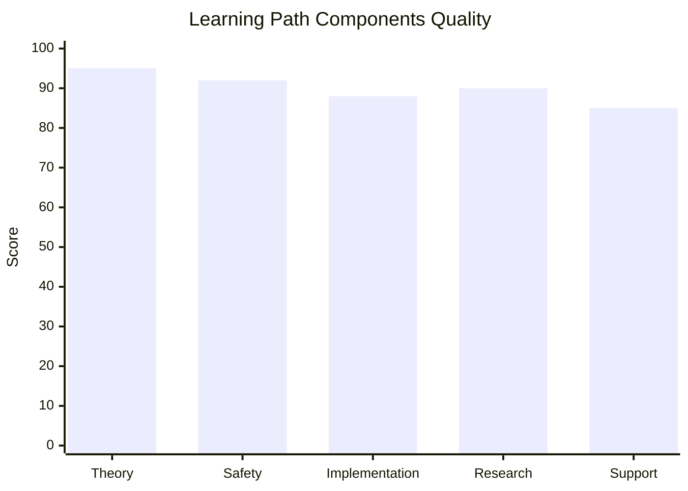

## Learning Analytics

### Progress Tracking
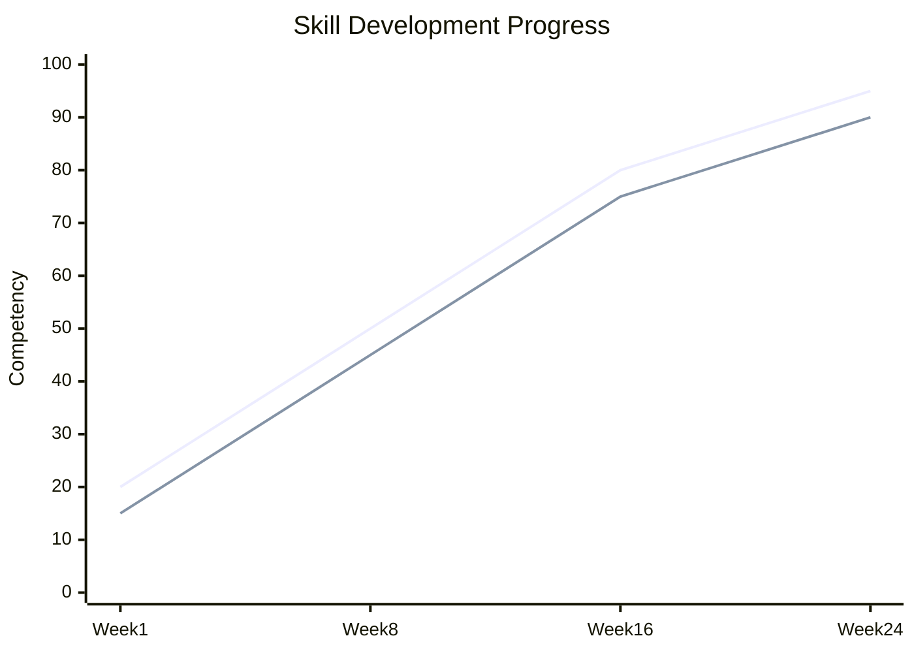

### Performance Metrics
- Research Skills
  - Theory development
  - Safety research
  - Formal methods
- Technical Skills
  - System design
  - Safety implementation
  - Verification
- Professional Skills
  - Project leadership
  - Research communication
  - Community engagement

### Development Analytics
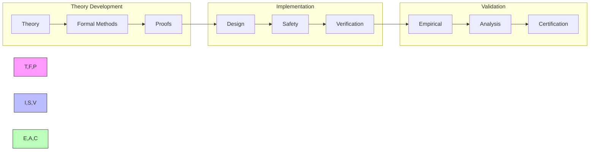

## Final Notes

### Success Stories
- Research Impact
  - Novel frameworks
  - Safety advances
  - Field contributions
- Technical Achievements
  - System implementations
  - Safety certifications
  - Tool development
- Professional Growth
  - Research leadership
  - Industry influence
  - Community building

### Additional Resources
- Extended Reading
  - Advanced theory
  - Safety research
  - Formal methods
- Research Directions
  - Open problems
  - Safety challenges
  - Future directions
- Community Resources
  - Research groups
  - Safety networks
  - Technical forums

### Contact Information
- Research Support
  - Principal investigators
  - Safety researchers
  - Theory experts
- Technical Support
  - System architects
  - Safety engineers
  - Tool developers
- Community Support
  - Group coordinators
  - Project leaders
  - Mentorship team 