# Active Inference in AGI and Superintelligence Learning Path

## Educational Overview

### Learning Objectives
By completing this path, learners will be able to:
1. **Conceptual Understanding**: Comprehend the theoretical foundations of AGI through Active Inference principles
2. **Safety-First Design**: Apply ethical AI development and safety considerations to AGI systems
3. **Critical Analysis**: Evaluate AGI proposals and developments through safety and alignment lenses
4. **Strategic Thinking**: Understand long-term implications of artificial general intelligence

### Target Audience
- **Primary**: AI safety researchers, policy makers, and ethical AI practitioners
- **Secondary**: Advanced AI researchers interested in safety considerations
- **Career Stage**: Mid to senior level professionals (3+ years experience in AI or related fields)

### Prerequisites Assessment

#### Required Foundation (Score 7+/10)
- **Active Inference Fundamentals**: Understanding of free energy principle and predictive processing
- **AI Safety Basics**: Familiarity with alignment problems and safety considerations
- **Critical Thinking**: Ability to analyze complex systems and their implications
- **Ethical Reasoning**: Understanding of ethical frameworks and responsible AI principles

#### Recommended Background
- Experience with AI systems development or research
- Familiarity with cognitive science or neuroscience concepts
- Understanding of complex systems theory
- Interest in long-term technology impact

### Learning Path Structure

#### Entry Point Assessment
**Foundation Track** (Prerequisites: 6-7/10)
- 4-week preparatory module on AGI concepts and safety fundamentals
- Focus on conceptual understanding before advanced applications

**Standard Track** (Prerequisites: 7-8/10)
- Direct entry to core curriculum
- Balanced theory and practical application

**Advanced Track** (Prerequisites: 8+/10)
- Accelerated progression with research focus
- Emphasis on novel contributions and cutting-edge applications

## Quick Reference
- **Difficulty**: Expert
- **Time Commitment**: 25-30 hours/week for 24 weeks
- **Prerequisites Score**: 9/10 (advanced AI/ML and safety expertise)
- **Industry Relevance**: Critical (AGI Research, AI Safety)
- **Hands-on Component**: 40%
- **Theory Component**: 60%

## Executive Summary

### Purpose and Scope
This advanced learning path explores the integration of Active Inference principles with Artificial General Intelligence (AGI) and superintelligence development. It focuses on safe and robust approaches to developing advanced AI systems, emphasizing theoretical foundations, practical implementation, and crucial safety considerations.

### Target Audience
- **Primary**: AGI researchers and AI safety specialists
- **Secondary**: Advanced ML engineers and cognitive architects
- **Career Stage**: Senior researchers and engineers (5+ years experience)

### Learning Outcomes
By completing this path, learners will be able to:
1. Design and implement safe AGI architectures using Active Inference principles
2. Develop robust safety mechanisms for recursive self-improving systems
3. Create and validate superintelligent system frameworks
4. Implement verifiable value alignment and safety guarantees

### Industry Applications
- Research: AGI development, AI safety research
- Development: Safe AI systems, cognitive architectures
- Safety: AI alignment, robustness verification
- Strategy: Long-term AI development planning

## Path Selection Guide
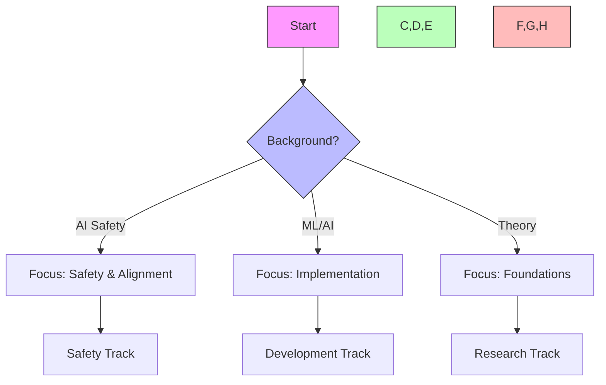

## Path Interconnections
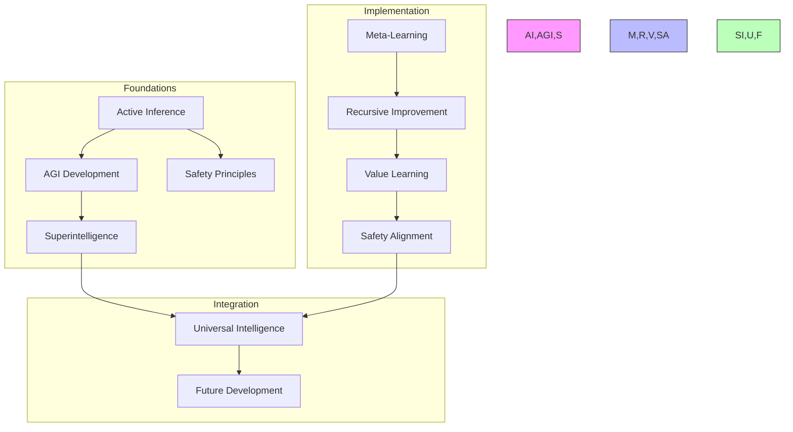

### System Architecture
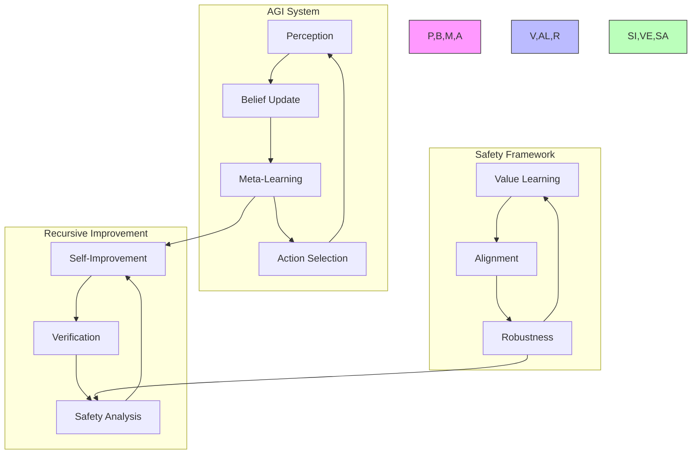

## Core Learning Modules

### Module 1: Conceptual Foundations of AGI (6 weeks)

#### Learning Objectives
- Understand the theoretical foundations of general intelligence
- Analyze the relationship between Active Inference and AGI concepts
- Evaluate different approaches to intelligence measurement and development
- Apply safety-first thinking to AGI design considerations

#### Conceptual Framework

**What is General Intelligence?**
General intelligence represents the ability to understand, learn, and apply knowledge across diverse domains and contexts. Unlike narrow AI systems designed for specific tasks, AGI systems would demonstrate flexible reasoning, creative problem-solving, and adaptive learning capabilities similar to human cognition.

**Active Inference Perspective on Intelligence**
Through the lens of Active Inference, intelligence emerges from the interaction between:
- **Predictive modeling**: Building and updating models of the environment
- **Error minimization**: Reducing surprise through better predictions and targeted actions
- **Hierarchical processing**: Operating across multiple scales of time and complexity
- **Active sampling**: Selecting actions that provide informative feedback

**Key Conceptual Relationships**
- Intelligence as efficient surprise minimization
- Learning as model refinement through prediction error
- Action as hypothesis testing in complex environments
- Consciousness as high-level predictive integration

#### Learning Activities

**Week 1-2: Intelligence Theory Foundations**
- **Concept Mapping**: Create visual maps connecting different theories of intelligence
- **Case Study Analysis**: Examine biological intelligence examples (human cognition, animal intelligence)
- **Philosophical Exploration**: Debate questions like "What makes intelligence general?" and "How do we recognize intelligent behavior?"
- **Historical Context**: Trace the evolution of AI from narrow systems to AGI aspirations

**Week 3-4: Active Inference and AGI Integration**
- **Thought Experiments**: Design scenarios where Active Inference principles guide AGI behavior
- **Comparative Analysis**: Contrast Active Inference with other cognitive architectures
- **Systems Thinking**: Explore how hierarchical predictive processing enables general intelligence
- **Real-world Applications**: Identify domains where AGI could provide significant benefits

**Week 5-6: Safety and Alignment Fundamentals**
- **Risk Assessment**: Analyze potential challenges and dangers of AGI development
- **Ethical Framework Development**: Create personal frameworks for responsible AGI development
- **Scenario Planning**: Explore different AGI development timelines and their implications
- **Stakeholder Analysis**: Consider perspectives of researchers, policymakers, and society

#### Knowledge Integration
- How does Active Inference provide a unifying framework for understanding intelligence?
- What are the key differences between narrow AI and potential AGI systems?
- Why is safety consideration essential from the earliest stages of AGI research?
- How can we balance innovation with responsible development practices?

#### Assessment Methods
- **Conceptual Essays**: Write 1000-word analyses of key AGI concepts
- **Peer Discussions**: Lead and participate in structured debates on AGI implications
- **Framework Development**: Create personal frameworks for evaluating AGI proposals
- **Reflection Portfolio**: Document learning journey and evolving perspectives

### Module 2: Safety-First AGI Design (8 weeks)

#### Learning Objectives
- Master the principles of AI safety and alignment in AGI contexts
- Design evaluation frameworks for AGI safety and robustness
- Understand value alignment challenges and potential solutions
- Apply risk assessment methodologies to AGI development scenarios

#### Conceptual Framework

**The Alignment Problem**
The alignment problem refers to the challenge of ensuring AGI systems pursue goals that are beneficial and aligned with human values. This involves:
- **Value specification**: How do we encode complex human values into AGI systems?
- **Value learning**: How can AGI systems learn and adapt to human preferences?
- **Robustness**: How do we ensure alignment persists as systems become more capable?
- **Verification**: How can we validate that systems remain aligned over time?

**Safety Through Active Inference**
Active Inference provides unique perspectives on AGI safety:
- **Uncertainty modeling**: Explicit representation of uncertainty enables more cautious behavior
- **Hierarchical goals**: Multiple scales of objectives allow for nuanced value representation
- **Conservative exploration**: Preference for familiar, predictable outcomes over high-risk scenarios
- **Interpretable reasoning**: Predictive models can provide explanations for decisions

#### Learning Activities

**Week 1-2: Understanding AI Safety Challenges**
- **Case Study Analysis**: Examine historical AI safety failures and near-misses
- **Risk Modeling**: Create comprehensive risk models for different AGI scenarios
- **Stakeholder Mapping**: Identify all parties affected by AGI development decisions
- **Literature Review**: Survey key papers in AI safety and alignment research

**Week 3-4: Value Alignment Theory and Practice**
- **Value Elicitation Exercises**: Practice techniques for understanding human preferences
- **Alignment Proposal Evaluation**: Critically assess existing alignment approaches
- **Design Challenges**: Propose solutions for specific alignment problems
- **Moral Philosophy Integration**: Connect AI alignment with broader ethical frameworks

**Week 5-6: Robustness and Verification**
- **Testing Framework Design**: Create methodologies for testing AGI safety
- **Failure Mode Analysis**: Systematically explore potential failure scenarios
- **Verification Protocols**: Design processes for ongoing safety monitoring
- **Red Team Exercises**: Practice adversarial thinking about AGI safety

**Week 7-8: Policy and Governance Considerations**
- **Regulatory Framework Analysis**: Examine existing and proposed AI governance structures
- **International Cooperation**: Explore challenges of global AGI governance
- **Timeline Scenarios**: Consider safety implications of different development speeds
- **Public Engagement**: Design approaches for involving broader society in AGI decisions

#### Knowledge Integration
- How can Active Inference principles inform safety-first AGI design?
- What are the key trade-offs between AGI capabilities and safety constraints?
- How should AGI research be governed to maximize benefits while minimizing risks?
- What role should different stakeholders play in AGI development decisions?

#### Assessment Methods
- **Safety Proposal Design**: Create detailed proposals for specific safety mechanisms
- **Risk Assessment Reports**: Develop comprehensive risk analyses for AGI scenarios
- **Policy Recommendations**: Write policy briefings for non-technical decision-makers
- **Debate Participation**: Engage in structured debates on AGI governance approaches

### Module 3: Long-term Implications and Strategic Thinking (6 weeks)

#### Learning Objectives
- Analyze long-term trajectories of AGI development and their societal implications
- Develop strategic thinking about AGI's role in addressing global challenges
- Understand economic, political, and social disruptions from AGI deployment
- Create personal frameworks for contributing to beneficial AGI outcomes

#### Conceptual Framework

**Transformative Potential of AGI**
AGI development could represent one of the most significant technological transitions in human history, with implications for:
- **Economic systems**: Automation of cognitive work, wealth distribution, labor markets
- **Scientific discovery**: Accelerated research and development across all domains
- **Social structures**: Changes in education, governance, and human relationships
- **Existential considerations**: Long-term human flourishing and survival

**Strategic Considerations**
- **Timeline uncertainty**: How do we plan for uncertain development timelines?
- **Distribution of benefits**: How can AGI benefits be shared equitably?
- **International dynamics**: How will AGI affect global power structures?
- **Human agency**: How do we maintain meaningful human control and purpose?

#### Learning Activities

**Week 1-2: Economic and Social Impact Analysis**
- **Scenario Modeling**: Develop detailed scenarios for AGI's economic impact
- **Transition Planning**: Design strategies for managing economic transitions
- **Social Impact Assessment**: Analyze effects on different communities and demographics
- **Adaptation Strategies**: Propose approaches for helping society adapt to AGI

**Week 3-4: Global Governance and Cooperation**
- **International Relations Analysis**: Examine how AGI might affect global politics
- **Cooperation Mechanisms**: Design frameworks for international AGI collaboration
- **Competitive Dynamics**: Analyze risks and benefits of AGI competition between nations
- **Multilateral Institution Design**: Propose governance structures for global AGI oversight

**Week 5-6: Long-term Future Planning**
- **Vision Development**: Create compelling visions of beneficial AGI futures
- **Pathway Analysis**: Map potential routes from current state to desired outcomes
- **Resilience Planning**: Design strategies for maintaining beneficial trajectories
- **Legacy Thinking**: Consider what we want to leave for future generations

#### Knowledge Integration
- How can we maximize the benefits of AGI while minimizing risks and disruptions?
- What roles should different institutions play in AGI governance and deployment?
- How can we maintain human agency and purpose in an AGI-enabled world?
- What are our responsibilities to future generations regarding AGI development?

#### Assessment Methods
- **Strategic Plans**: Develop comprehensive strategies for beneficial AGI development
- **Future Scenarios**: Create detailed, plausible scenarios for AGI's long-term impact
- **Policy Proposals**: Design governance frameworks for AGI development and deployment
- **Personal Action Plans**: Identify ways to contribute to beneficial AGI outcomes
### Module 4: Applied Ethics and Responsible Development (4 weeks)

#### Learning Objectives
- Apply ethical frameworks to AGI development decisions
- Understand diverse stakeholder perspectives on AGI development
- Design inclusive processes for AGI governance and oversight
- Develop skills for communicating AGI concepts to non-technical audiences

#### Conceptual Framework

**Ethical Dimensions of AGI Development**
AGI development raises profound ethical questions that require careful consideration:
- **Autonomy and Agency**: How do we preserve human autonomy in an AGI-enabled world?
- **Justice and Fairness**: How can we ensure AGI benefits are distributed equitably?
- **Beneficence and Non-maleficence**: How do we maximize benefits while preventing harm?
- **Transparency and Accountability**: How do we maintain oversight of AGI systems?

**Stakeholder Engagement**
Effective AGI governance requires engaging diverse stakeholders:
- **Technical communities**: Researchers, engineers, and developers
- **Policy makers**: Government officials and regulatory bodies
- **Civil society**: NGOs, advocacy groups, and community organizations
- **General public**: Citizens who will be affected by AGI deployment

#### Learning Activities

**Week 1-2: Ethical Framework Application**
- **Case Study Ethics**: Apply different ethical frameworks to AGI scenarios
- **Stakeholder Analysis**: Map the interests and concerns of different groups
- **Value Conflict Resolution**: Practice resolving conflicts between competing values
- **Ethical Decision Trees**: Create frameworks for ethical decision-making in AGI

**Week 3-4: Communication and Engagement**
- **Public Communication**: Practice explaining AGI concepts to general audiences
- **Policy Translation**: Convert technical considerations into policy recommendations
- **Participatory Design**: Design processes for involving diverse stakeholders in AGI decisions
- **Cross-cultural Analysis**: Consider how different cultures might approach AGI development

#### Assessment Methods
- **Ethical Analysis Papers**: Write detailed analyses of specific ethical dilemmas
- **Stakeholder Engagement Plans**: Design comprehensive engagement strategies
- **Public Presentations**: Present AGI concepts to simulated non-technical audiences
- **Cross-cultural Comparison**: Analyze AGI approaches across different cultural contexts

## Practical Application Projects

### Capstone Project Options

#### Option 1: Safety Framework Design
Design a comprehensive safety framework for a specific AGI application domain:
- **Literature Review**: Survey existing safety approaches and identify gaps
- **Framework Development**: Create detailed safety protocols and verification methods
- **Risk Assessment**: Analyze potential failure modes and mitigation strategies
- **Implementation Plan**: Develop a realistic plan for implementing safety measures

#### Option 2: Policy Proposal Development
Create a detailed policy proposal for AGI governance:
- **Stakeholder Analysis**: Identify key stakeholders and their interests
- **Comparative Analysis**: Study existing AI governance approaches
- **Policy Design**: Develop specific regulatory recommendations
- **Implementation Strategy**: Create a plan for policy adoption and enforcement

#### Option 3: Public Engagement Campaign
Design a campaign to engage the public in AGI development decisions:
- **Audience Analysis**: Understand different public perspectives on AGI
- **Communication Strategy**: Develop effective messaging for different audiences
- **Engagement Methods**: Design interactive processes for public participation
- **Impact Assessment**: Create methods for measuring engagement effectiveness

#### Option 4: Cross-disciplinary Integration Study
Conduct an in-depth study of how AGI intersects with another domain:
- **Domain Analysis**: Deep dive into a specific field (healthcare, education, economics, etc.)
- **Integration Challenges**: Identify specific challenges of applying AGI in that domain
- **Opportunity Assessment**: Analyze potential benefits and applications
- **Implementation Roadmap**: Develop a plan for responsible AGI integration

## Learning Resources

### Essential Readings
1. **Foundational Texts**
   - Bostrom, N. (2014). "Superintelligence: Paths, Dangers, Strategies"
   - Russell, S. (2019). "Human Compatible: Artificial Intelligence and the Problem of Control"
   - Friston, K. (2010). "The Free-Energy Principle: A Unified Brain Theory?"
   - Clark, A. (2016). "Surfing Uncertainty: Prediction, Action, and the Embodied Mind"

2. **Key Research Papers**
   - "Concrete Problems in AI Safety" (Amodei et al., 2016)
   - "AI Alignment: A Systems Thinking Approach" (Critch & Krueger, 2020)
   - "The Active Inference Approach to Ecological Perception" (Seth, 2014)
   - "Cooperative AI: machines must learn to find common ground" (Dafoe et al., 2020)

### Learning Communities
1. **Academic Networks**
   - AI Safety research groups and institutes
   - Active Inference research communities
   - Cognitive science societies
   - Philosophy of mind discussion groups

2. **Professional Organizations**
   - Partnership on AI
   - Future of Humanity Institute
   - Machine Intelligence Research Institute
   - Center for Human-Compatible AI

### Educational Tools and Platforms
1. **Conceptual Learning Tools**
   - Interactive simulations of Active Inference principles
   - Case study databases for AI safety scenarios
   - Ethical decision-making frameworks
   - Stakeholder analysis templates

2. **Assessment and Reflection Tools**
   - Portfolio development platforms
   - Peer review systems
   - Research project templates
   - Communication skills assessment rubrics

## Next Steps

### Advanced Topics
1. [[superintelligence_learning_path|Superintelligence]]
2. [[universal_intelligence_learning_path|Universal Intelligence]]
3. [[cognitive_safety_learning_path|Cognitive Safety]]

### Research Directions
1. [[research_guides/agi_development|AGI Development]]
2. [[research_guides/ai_safety|AI Safety Research]]
3. [[research_guides/superintelligence|Superintelligence Research]]

## Integration Strategies

### Development Approaches
- Theory-Practice Integration
  - Mathematical foundations
  - Safety proofs
  - Implementation verification
- Cross-Domain Development
  - Cognitive architectures
  - Safety frameworks
  - Value learning systems
- Research Integration
  - Theoretical advances
  - Empirical validation
  - Safety verification

### Research Framework
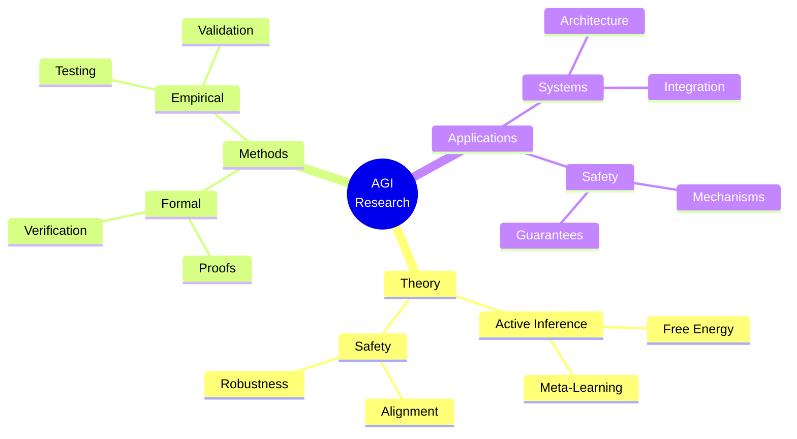

### Development Lifecycle
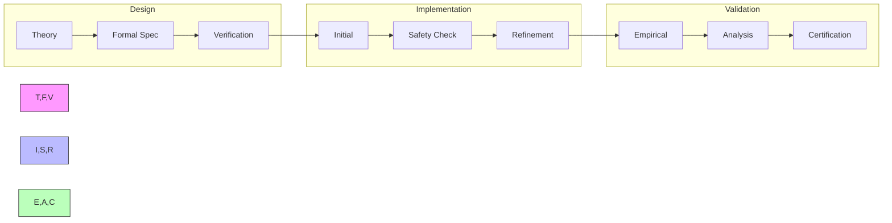

## Assessment and Evaluation Framework

### Educational Assessment Philosophy

This learning path emphasizes **understanding over implementation**, **critical thinking over technical execution**, and **ethical reasoning over purely technical solutions**. Assessment focuses on developing thoughtful practitioners who can contribute to beneficial AGI development.

### Assessment Distribution
Following our educational framework standards:
- **Conceptual Understanding (40%)**: Essays, concept maps, theoretical analysis
- **Practical Application (35%)**: Case studies, scenario analysis, framework design
- **Critical Reflection (15%)**: Peer discussions, ethical analysis, future planning
- **Technical Reference (10%)**: Basic understanding of implementation considerations

### Continuous Learning Assessment

#### Weekly Learning Integration
**Week 1-6: Conceptual Foundations**
- **Reflection Journals**: Weekly 500-word reflections connecting readings to personal understanding
- **Concept Mapping**: Visual representations of AGI concepts and their relationships
- **Peer Teaching**: Explain key concepts to fellow learners in discussion forums
- **Literature Integration**: Connect new readings to previously learned material

**Week 7-14: Safety-First Design**
- **Case Study Analysis**: Weekly analysis of real-world AI safety scenarios
- **Risk Assessment Exercises**: Identify and analyze potential risks in proposed AGI systems
- **Ethical Framework Applications**: Apply different ethical frameworks to AGI development decisions
- **Policy Critique**: Analyze existing AI governance proposals for effectiveness

**Week 15-20: Long-term Implications**
- **Scenario Development**: Create detailed future scenarios exploring AGI impact
- **Strategic Analysis**: Develop strategic recommendations for beneficial outcomes
- **Cross-cultural Research**: Investigate how different cultures approach AGI development
- **Timeline Assessment**: Analyze different AGI development timelines and their implications

**Week 21-24: Applied Ethics**
- **Stakeholder Analysis**: Map and analyze interests of different AGI stakeholders
- **Communication Practice**: Practice explaining AGI concepts to non-technical audiences
- **Engagement Design**: Design public participation processes for AGI governance
- **Capstone Integration**: Synthesize learning through chosen capstone project

### Module-Specific Assessments

#### Module 1: Conceptual Foundations Assessment
**Mid-Module (Week 3): Foundational Understanding**
- **Format**: 1500-word analytical essay
- **Topic**: "How Active Inference Principles Inform AGI Development: Opportunities and Challenges"
- **Assessment Criteria**:
  - Conceptual clarity and accuracy (40%)
  - Integration of multiple perspectives (30%)
  - Critical analysis and original insights (20%)
  - Clear communication and organization (10%)

**Module Completion (Week 6): Synthesis Project**
- **Format**: Multi-modal presentation (written + visual + oral)
- **Topic**: Personal framework for evaluating AGI proposals
- **Requirements**:
  - Written framework document (1000 words)
  - Visual representation of framework
  - 10-minute presentation to peers
  - Q&A session demonstrating deep understanding

#### Module 2: Safety-First Design Assessment
**Mid-Module (Week 10): Safety Framework Proposal**
- **Format**: Comprehensive proposal document
- **Task**: Design safety framework for specific AGI application domain
- **Components**:
  - Literature review identifying current gaps (30%)
  - Detailed framework proposal (40%)
  - Risk analysis and mitigation strategies (20%)
  - Implementation considerations (10%)

**Module Completion (Week 14): Policy Briefing**
- **Format**: Professional policy briefing
- **Audience**: Simulated government officials or regulatory bodies
- **Requirements**:
  - 3-page executive summary
  - 15-minute briefing presentation
  - Q&A session handling challenging questions
  - Demonstration of ability to communicate technical concepts clearly

#### Module 3: Long-term Implications Assessment
**Mid-Module (Week 17): Future Scenario Analysis**
- **Format**: Comprehensive scenario planning exercise
- **Task**: Develop multiple plausible future scenarios for AGI development
- **Deliverables**:
  - Three detailed scenarios (optimistic, pessimistic, realistic)
  - Analysis of key variables and decision points
  - Recommendations for navigating toward beneficial outcomes

**Module Completion (Week 20): Strategic Recommendations**
- **Format**: Strategic planning document
- **Task**: Develop comprehensive strategy for beneficial AGI development
- **Components**:
  - Stakeholder analysis and engagement strategy (25%)
  - Policy recommendations with implementation plans (35%)
  - Risk mitigation and contingency planning (25%)
  - Success metrics and evaluation framework (15%)

#### Module 4: Applied Ethics Assessment
**Final Capstone Project (Weeks 22-24)**
Choose from four capstone options:

1. **Safety Framework Design**: Comprehensive safety framework for specific domain
2. **Policy Proposal Development**: Detailed AGI governance policy proposal
3. **Public Engagement Campaign**: Complete public engagement strategy and materials
4. **Cross-disciplinary Integration Study**: In-depth analysis of AGI in specific field

**Capstone Assessment Criteria**:
- **Depth of Analysis (35%)**: Thoroughness and sophistication of thinking
- **Practical Applicability (25%)**: Realistic and implementable recommendations
- **Ethical Consideration (20%)**: Thoughtful integration of ethical frameworks
- **Communication Quality (20%)**: Clear, compelling presentation to diverse audiences

### Portfolio-Based Evaluation

#### Learning Portfolio Components
Each learner maintains a comprehensive portfolio demonstrating growth and integration:

**Required Portfolio Elements**:
1. **Learning Journey Documentation**: Reflection on personal growth and changing perspectives
2. **Conceptual Understanding Artifacts**: Essays, concept maps, analysis papers
3. **Applied Work**: Case studies, policy proposals, framework designs
4. **Community Contributions**: Discussion leadership, peer mentoring, resource sharing
5. **Synthesis Projects**: Cross-module integration and original thinking

**Portfolio Assessment Rubric**:
- **Conceptual Mastery (40%)**: Demonstrates deep understanding of AGI and safety concepts
- **Critical Thinking (30%)**: Shows ability to analyze, synthesize, and evaluate complex issues
- **Practical Application (20%)**: Applies learning to real-world scenarios effectively
- **Communication (10%)**: Presents ideas clearly to diverse audiences

### Success Indicators

#### Learning Outcome Achievement
- **Understanding AGI Foundations**: 90% demonstrate clear conceptual understanding
- **Safety-First Thinking**: 85% consistently apply safety considerations in analyses
- **Ethical Reasoning**: 80% show sophisticated ethical reasoning in complex scenarios
- **Strategic Thinking**: 75% develop realistic, implementable recommendations

#### Community Engagement
- **Discussion Participation**: Active participation in 80%+ of discussions
- **Peer Support**: Evidence of helping and mentoring fellow learners
- **Knowledge Sharing**: Contributions to community knowledge base
- **Collaborative Learning**: Successful completion of group projects and peer reviews

## Career Development

### Industry Alignment
#### Research Roles
- AGI Researcher
  - Theory development
  - Safety research
  - Framework design
- Safety Specialist
  - Verification systems
  - Safety proofs
  - Risk assessment
- Technical Lead
  - Architecture design
  - Team leadership
  - Strategic planning

#### Certification Path
- AGI Development
  - Formal methods
  - System architecture
- Safety Engineering
  - Verification systems
  - Risk analysis
- Research Leadership
  - Project management
  - Strategic planning

### Professional Network
#### Research Community
- Academic Connections:
  - Research labs
  - Universities
  - Safety institutes
- Industry Partners:
  - AGI companies
  - Safety organizations
  - Research institutes
- Professional Organizations:
  - AGI Society
  - AI Safety Network
  - Formal Methods Group

#### Career Progression
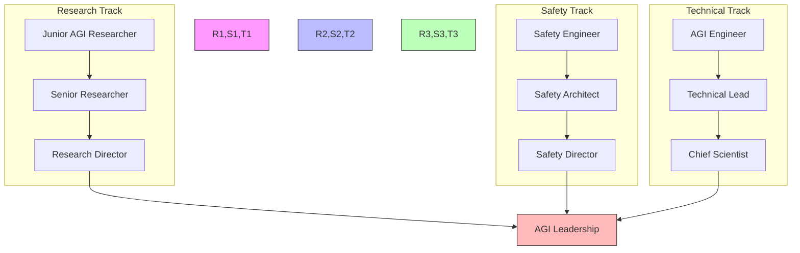

### Competency Framework
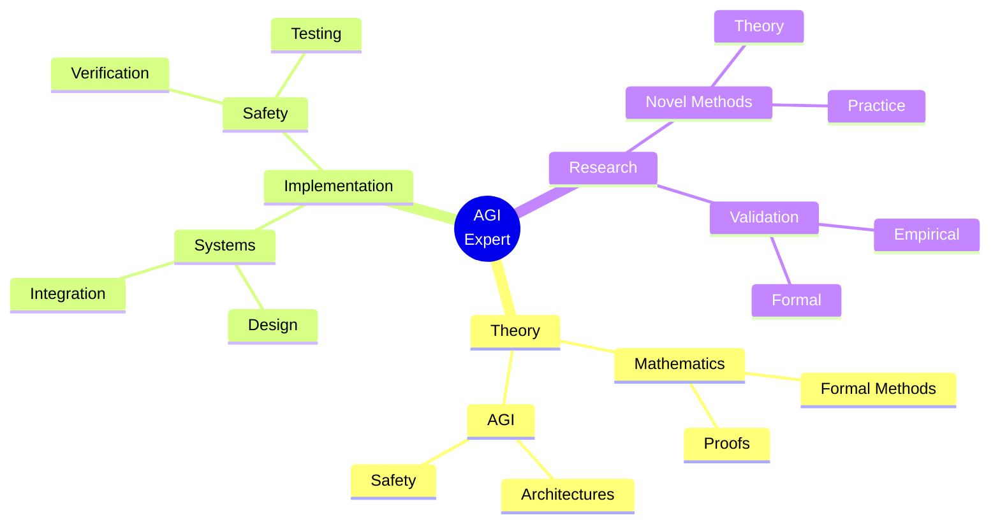

### Research Focus Areas
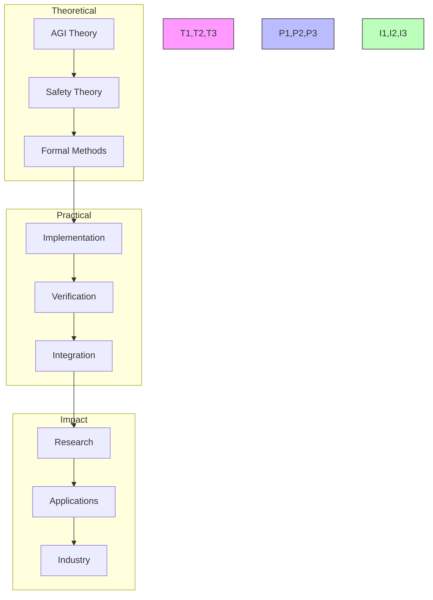

## Support Resources

### Research Support
- Literature Database
  - AGI papers
  - Safety research
  - Formal methods
- Computing Resources
  - HPC clusters
  - Cloud computing
  - Verification systems
- Analysis Tools
  - Formal verification
  - Safety analysis
  - Performance profiling

### Technical Support
- Development Tools
  - AGI frameworks
  - Safety toolkits
  - Verification suites
- Documentation
  - Architecture specs
  - Safety guidelines
  - Best practices
- Computing Resources
  - Development environments
  - Testing frameworks
  - Deployment tools

### Learning Support
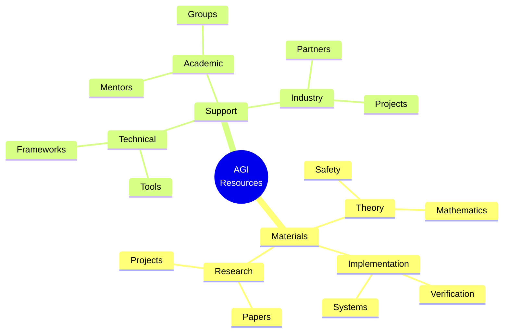

## Version Control and Updates

### Version History
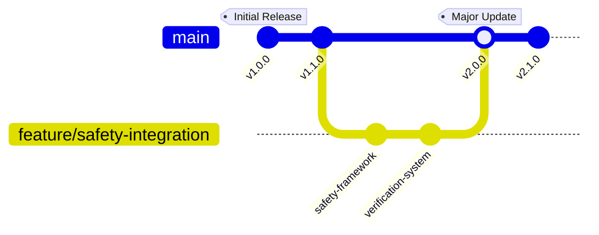

### Change Management
#### Major Updates
- v2.0.0 (Current)
  - Enhanced safety framework
  - Formal verification system
  - Advanced AGI components
  - Updated career paths
- v1.1.0
  - Added safety mechanisms
  - Enhanced documentation
  - New research projects
- v1.0.0
  - Initial curriculum
  - Basic framework
  - Core concepts

#### Planned Improvements
- Advanced safety mechanisms
- Formal verification tools
- Integration frameworks
- Research extensions

### Quality Metrics
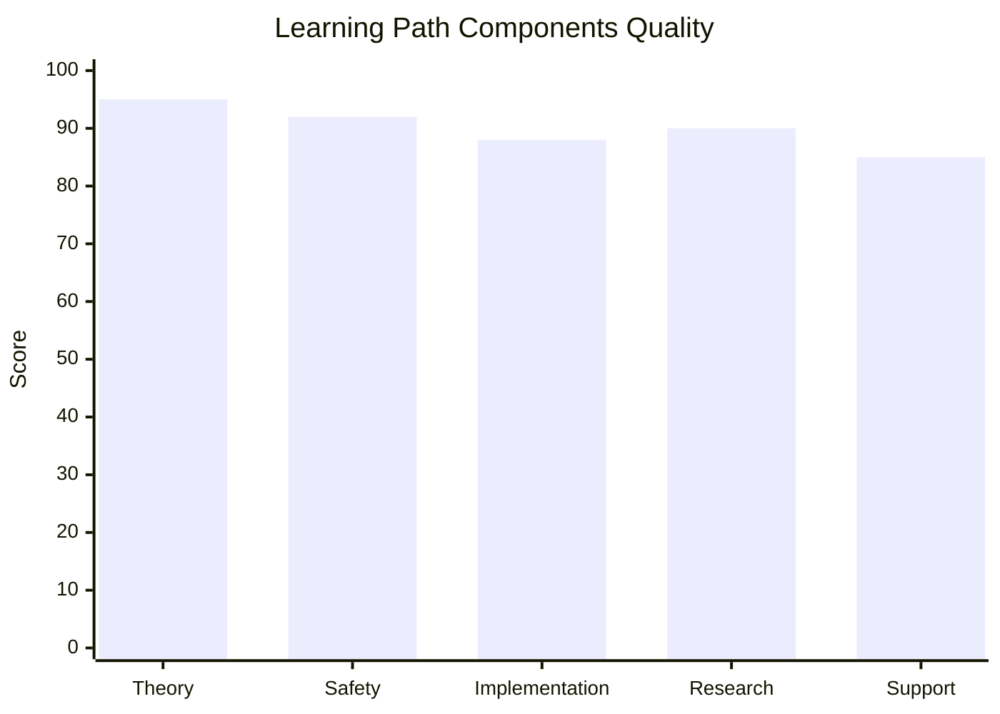

## Learning Analytics

### Progress Tracking
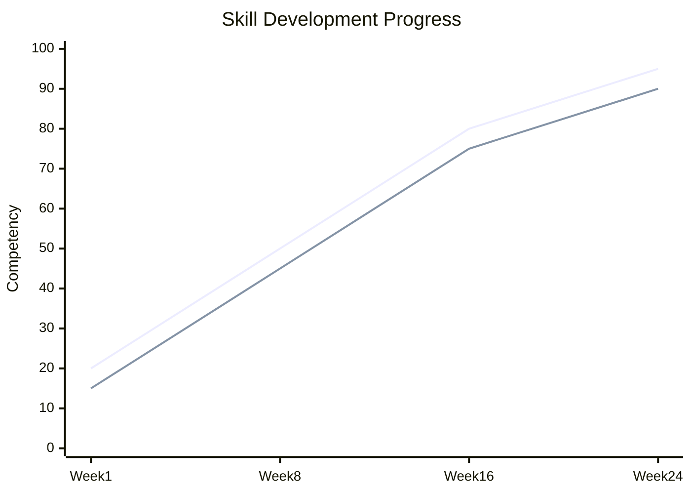

### Performance Metrics
- Research Skills
  - Theory development
  - Safety research
  - Formal methods
- Technical Skills
  - System design
  - Safety implementation
  - Verification
- Professional Skills
  - Project leadership
  - Research communication
  - Community engagement

### Development Analytics
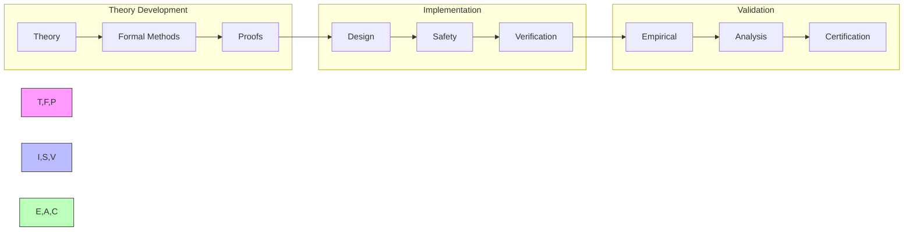

## Final Notes

### Success Stories
- Research Impact
  - Novel frameworks
  - Safety advances
  - Field contributions
- Technical Achievements
  - System implementations
  - Safety certifications
  - Tool development
- Professional Growth
  - Research leadership
  - Industry influence
  - Community building

### Additional Resources
- Extended Reading
  - Advanced theory
  - Safety research
  - Formal methods
- Research Directions
  - Open problems
  - Safety challenges
  - Future directions
- Community Resources
  - Research groups
  - Safety networks
  - Technical forums

### Contact Information
- Research Support
  - Principal investigators
  - Safety researchers
  - Theory experts
- Technical Support
  - System architects
  - Safety engineers
  - Tool developers
- Community Support
  - Group coordinators
  - Project leaders
  - Mentorship team 