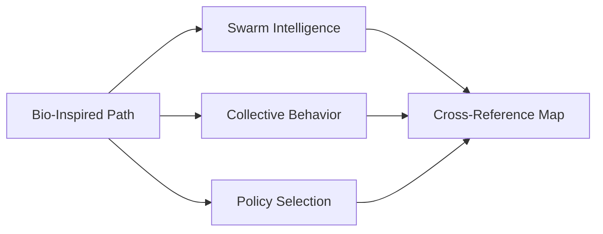

---

title: Bio-Inspired Cognitive Systems Learning Path

type: learning_path

status: stable

created: 2024-03-15

modified: 2025-08-08

version: 2.1.0

complexity: advanced

processing_priority: 1

authors:

  - name: Cognitive Systems Team

    role: Research & Development

difficulty_level: advanced

estimated_hours: 480

completion_time: "20 weeks"

certification_track: true

tags:

  - biological systems

  - cognitive science

  - interdisciplinary

  - bio-inspired computing

  - neural networks

  - evolutionary algorithms

  - embodied cognition

semantic_relations:

  - type: prerequisite

    links:

      - [[biological_systems_learning_path]]

      - [[cognitive_architecture_learning_path]]

  - type: specializes

    links: [[active_inference_learning_path]]

  - type: related

    links:

      - [[evolutionary_computation_learning_path]]

      - [[neural_networks_learning_path]]

      - [[active_inference_biological_learning_path]]

  - type: integrates_with

    links:

      - [[active_inference_robotics_learning_path]]

      - [[active_inference_agi_learning_path]]

---

# Bio-Inspired Cognitive Systems Learning Path

## Quick Start

- Launch the ant colony simulation and add info-gain foraging checks; compare to baseline

- Build a cell-level inference sketch with repo primitives; verify belief update trends

- Prototype a simple GA vs. swarm policy selection; assert convergence stability

## External Web Resources

- [Centralized resources hub](./index.md#centralized-external-web-resources)

- Ant Colony Optimization background (book reference at MIT Press); myrmecology journals (see hub pointers)

## Quick Reference

- **Difficulty**: Advanced

- **Time Commitment**: 20-25 hours/week for 20 weeks

- **Prerequisites Score**: 8/10 (biology, computer science, and mathematics background)

- **Industry Relevance**: High (Research, Robotics, AI Systems)

- **Hands-on Component**: 55%

- **Theory Component**: 45%

## Executive Summary

### Purpose and Scope

This comprehensive learning path explores the intersection of biological systems and cognitive architectures, focusing on bio-inspired approaches to cognitive system design. It integrates principles from neuroscience, evolutionary biology, and cognitive science to develop more natural, adaptive, and robust computational systems using Active Inference principles.

### Target Audience

- **Primary**: Researchers in bio-inspired computing and cognitive systems

- **Secondary**: Engineers developing adaptive AI systems

- **Career Stage**: Advanced practitioners and researchers (3+ years experience)

### Learning Outcomes

By completing this path, learners will be able to:

1. Design bio-inspired cognitive architectures using Active Inference principles

1. Implement natural computation algorithms based on biological mechanisms

1. Develop adaptive systems that learn and evolve like biological organisms

1. Apply bio-inspired solutions to real-world engineering challenges

### Industry Applications

- Research: Bio-inspired computing, cognitive systems research

- Robotics: Adaptive robotic systems, swarm robotics

- AI Systems: Natural language processing, computer vision

- Biotechnology: Computational biology, synthetic biology

### Repo-integrated labs (TDD)

- Swarm coordination from biology to code

  - Start the ant colony simulation

    ```bash

    python3 /home/trim/Documents/GitHub/cognitive/Things/Ant_Colony/ant_colony/main.py --config /home/trim/Documents/GitHub/cognitive/Things/Ant_Colony/config/colony_config.yaml

    ```

  - Add tests in `Things/Ant_Colony/ant_colony/utils/data_collection.py` usages to verify information-gain-oriented foraging

- Cellular-to-network modeling bridge

  - Use `tools/src/models/active_inference` primitives to sketch cell-level inference

  - Validate via unit tests that belief updates match expected qualitative trends

- Bio-inspired optimization

  - Implement small GA baseline and compare to swarm policy selection using repo matrices

  - Add assertions on convergence speed and stability

### Foundations

- [[../../knowledge_base/mathematics/expected_free_energy]] · [[../../knowledge_base/mathematics/policy_selection]] · [[../../knowledge_base/mathematics/precision_parameter]] · [[../../knowledge_base/mathematics/softmax_function]] · [[../../knowledge_base/mathematics/numerical_stability]] · [[../../knowledge_base/mathematics/message_passing]] · [[../../knowledge_base/mathematics/bethe_free_energy]]

## Knowledge Base Anchors

- Bio-inspired: [[../../knowledge_base/cognitive/collective_behavior]] · [[../../knowledge_base/cognitive/swarm_intelligence]] · [[../../knowledge_base/cognitive/stigmergic_coordination]]

- Math: [[../../knowledge_base/mathematics/policy_selection]] · [[../../knowledge_base/mathematics/dynamical_systems]]

- Cross-map: [[../../knowledge_base/mathematics/cross_reference_map]]



## Learner Assessment and Entry Guidance

### Pre-Learning Assessment

```yaml

assessment_dimensions:

  biological_knowledge:

    - neuroscience_basics: [none, basic, intermediate, advanced]

    - evolutionary_biology: [none, basic, intermediate, advanced]

    - systems_biology: [none, basic, intermediate, advanced]

    - cellular_biology: [none, basic, intermediate, advanced]

  technical_background:

    - programming_experience: [none, basic, intermediate, advanced, expert]

    - mathematics_level: [basic, intermediate, advanced, expert]

    - ai_ml_knowledge: [none, basic, intermediate, advanced, expert]

    - systems_design: [none, basic, intermediate, advanced]

  interdisciplinary_experience:

    - cross_domain_projects: [none, limited, moderate, extensive]

    - research_experience: [none, undergraduate, graduate, professional]

    - collaboration_skills: [developing, proficient, advanced, expert]

```

### Recommended Entry Points

**Foundation Track** (Prerequisites: 6/10)

- For learners with strong biology OR computer science background

- 4-week interdisciplinary bridge module

- Focus on building missing domain knowledge

- **Start Here If**: Strong in one domain, need the other

**Integration Track** (Prerequisites: 7-8/10)

- For learners with moderate background in both domains

- 2-week synthesis and methodology module

- Focus on integration principles

- **Start Here If**: Good foundation in both biology and CS

**Advanced Track** (Prerequisites: 8-9/10)

- Direct entry to core bio-inspired systems

- **Start Here If**: Strong interdisciplinary background

**Research Track** (Prerequisites: 9-10/10)

- Focus on novel research and cutting-edge applications

- **Start Here If**: Extensive research experience in related fields

## Core Learning Path

### Foundation Track Bridge (4 weeks)

#### Week 1-2: Biological Foundations for Engineers

```python

class BiologicalFoundationModule:

    def __init__(self):

        """Initialize biological foundations for computational learners."""

        self.core_concepts = {

            'neural_computation': {

                'theory': 'Biological neural networks and information processing',

                'implementation': 'Simple neural network models',

                'assessment': 'Neural network design project'

            },

            'evolutionary_principles': {

                'theory': 'Natural selection, adaptation, and optimization',

                'implementation': 'Genetic algorithm implementation',

                'assessment': 'Evolutionary optimization project'

            },

            'biological_information_processing': {

                'theory': 'DNA, protein folding, cellular computation',

                'implementation': 'Cellular automata models',

                'assessment': 'Biological simulation project'

            }

        }

    def create_learning_plan(self, learner_background):

        """Create personalized learning plan based on background."""

        if learner_background.biology_level < 3:

            return self.intensive_biology_track()

        else:

            return self.computational_integration_track()

biological_modules = {

    'week_1': {

        'title': 'Neural Systems and Computation',

        'concepts': [

            'Neuron structure and function',

            'Synaptic transmission and plasticity',

            'Neural networks and information flow',

            'Brain architecture and hierarchies'

        ],

        'implementations': [

            'single_neuron_model',

            'synaptic_plasticity_simulation',

            'small_network_dynamics'

        ],

        'assessments': ['neural_modeling_project', 'concept_integration']

    },

    'week_2': {

        'title': 'Evolutionary and Adaptive Systems',

        'concepts': [

            'Natural selection mechanisms',

            'Adaptive landscapes and optimization',

            'Population dynamics and evolution',

            'Co-evolution and arms races'

        ],

        'implementations': [

            'genetic_algorithm_basics',

            'population_simulation',

            'adaptive_landscape_exploration'

        ],

        'assessments': ['evolution_simulation', 'optimization_comparison']

    }

}

```

#### Week 3-4: Computational Foundations for Biologists

```python

computational_modules = {

    'week_3': {

        'title': 'Computational Thinking and Algorithms',

        'concepts': [

            'Algorithm design principles',

            'Data structures and complexity',

            'Machine learning fundamentals',

            'Optimization and search'

        ],

        'implementations': [

            'basic_algorithms',

            'data_structure_practice',

            'ml_model_implementation'

        ],

        'assessments': ['algorithm_design', 'implementation_project']

    },

    'week_4': {

        'title': 'Systems Design and Architecture',

        'concepts': [

            'System architecture principles',

            'Modular design and interfaces',

            'Distributed systems basics',

            'Performance and scalability'

        ],

        'implementations': [

            'modular_system_design',

            'interface_specification',

            'performance_analysis'

        ],

        'assessments': ['system_design_project', 'architecture_review']

    }

}

```

### Module 1: Bio-Inspired Architecture Design (4 weeks)

#### Week 1-2: Neural-Inspired Architectures

```python

class NeuralInspiredArchitecture:

    def __init__(self, 

                 architecture_type: str,

                 bio_constraints: BiologicalConstraints):

        """Initialize neural-inspired architecture."""

        self.architecture = self._build_architecture(architecture_type)

        self.bio_constraints = bio_constraints

        self.adaptation_mechanism = AdaptationMechanism()

    def design_hierarchical_system(self,

                                 input_modalities: List[str],

                                 processing_layers: int) -> CognitiveArchitecture:

        """Design hierarchical processing system."""

        # Build sensory processing layers

        sensory_layers = self._create_sensory_layers(input_modalities)

        # Create hierarchical processing

        processing_hierarchy = self._build_processing_hierarchy(

            sensory_layers, processing_layers

        )

        # Add adaptation mechanisms

        adaptive_system = self.adaptation_mechanism.integrate(

            processing_hierarchy, self.bio_constraints

        )

        return adaptive_system

class BiologicalConstraints:

    def __init__(self):

        """Initialize biological constraints for realistic modeling."""

        self.constraints = {

            'energy_efficiency': {

                'max_power_consumption': 20,  # watts (brain-like)

                'computation_per_watt': 'optimize',

                'idle_power_ratio': 0.1

            },

            'timing_constraints': {

                'reaction_time': 100,  # milliseconds

                'learning_timescales': [100, 1000, 10000],  # ms, s, min

                'plasticity_rates': 'biological_realistic'

            },

            'connectivity_limits': {

                'max_connections_per_unit': 10000,

                'connection_sparsity': 0.1,

                'locality_preference': True

            },

            'noise_tolerance': {

                'signal_noise_ratio': 3.0,

                'fault_tolerance': 'graceful_degradation',

                'redundancy_factor': 1.5

            }

        }

```

#### Week 3-4: Evolutionary Architecture Adaptation

```python

class EvolutionaryArchitectureDesigner:

    def __init__(self,

                 population_size: int,

                 mutation_rate: float):

        """Initialize evolutionary architecture designer."""

        self.population = ArchitecturePopulation(population_size)

        self.evolutionary_ops = EvolutionaryOperators(mutation_rate)

        self.fitness_evaluator = ArchitectureFitnessEvaluator()

    def evolve_architecture(self,

                          problem_specifications: ProblemSpec,

                          generations: int) -> OptimalArchitecture:

        """Evolve optimal architecture for problem."""

        current_generation = self.population.initialize_random()

        for gen in range(generations):

            # Evaluate fitness

            fitness_scores = self.fitness_evaluator.evaluate_population(

                current_generation, problem_specifications

            )

            # Selection and reproduction

            selected = self.evolutionary_ops.selection(

                current_generation, fitness_scores

            )

            offspring = self.evolutionary_ops.crossover_mutation(selected)

            # Environmental selection

            current_generation = self.evolutionary_ops.environmental_selection(

                current_generation + offspring, problem_specifications

            )

            # Track evolution progress

            self._log_generation_progress(gen, current_generation, fitness_scores)

        return self._extract_best_architecture(current_generation)

```

### Module 2: Natural Computation Mechanisms (5 weeks)

#### Week 1-2: Cellular and Molecular Computation

```python

class CellularComputationModel:

    def __init__(self,

                 cell_types: List[str],

                 molecular_networks: Dict[str, MolecularNetwork]):

        """Initialize cellular computation model."""

        self.cells = {cell_type: CellModel(cell_type) 

                     for cell_type in cell_types}

        self.molecular_networks = molecular_networks

        self.signaling_pathways = SignalingPathways()

    def simulate_cellular_decision(self,

                                 environmental_signals: torch.Tensor,

                                 cell_state: CellState) -> CellularResponse:

        """Simulate cellular decision-making process."""

        # Process environmental signals

        signal_transduction = self.signaling_pathways.transduce(

            environmental_signals, cell_state

        )

        # Molecular network computation

        network_response = self.molecular_networks['decision'].process(

            signal_transduction

        )

        # Generate cellular response

        cellular_response = self._integrate_responses(

            network_response, cell_state.internal_state

        )

        return cellular_response

class MolecularNetwork:

    def __init__(self,

                 network_topology: Dict[str, List[str]],

                 reaction_rates: Dict[str, float]):

        """Initialize molecular reaction network."""

        self.topology = network_topology

        self.rates = reaction_rates

        self.concentrations = self._initialize_concentrations()

    def simulate_dynamics(self,

                        time_steps: int,

                        external_inputs: torch.Tensor) -> NetworkState:

        """Simulate molecular network dynamics."""

        states = []

        current_state = self.concentrations.copy()

        for t in range(time_steps):

            # Calculate reaction rates

            reaction_fluxes = self._calculate_fluxes(

                current_state, external_inputs[t]

            )

            # Update concentrations

            current_state = self._update_concentrations(

                current_state, reaction_fluxes

            )

            states.append(current_state.copy())

        return NetworkState(states)

```

#### Week 3-4: Swarm Intelligence and Collective Behavior

```python

class SwarmIntelligenceSystem:

    def __init__(self,

                 n_agents: int,

                 interaction_rules: InteractionRules):

        """Initialize swarm intelligence system."""

        self.agents = [SwarmAgent(i) for i in range(n_agents)]

        self.interaction_rules = interaction_rules

        self.environment = SwarmEnvironment()

    def simulate_collective_behavior(self,

                                   task: CollectiveTask,

                                   time_steps: int) -> CollectiveSolution:

        """Simulate emergence of collective intelligence."""

        collective_state = CollectiveState()

        for t in range(time_steps):

            # Local agent decisions

            agent_actions = []

            for agent in self.agents:

                local_observations = self.environment.get_local_observations(agent)

                neighbor_states = self._get_neighbor_states(agent)

                action = agent.decide_action(

                    local_observations, neighbor_states, task

                )

                agent_actions.append(action)

            # Update environment and collective state

            self.environment.update(agent_actions)

            collective_state.update(self.agents, self.environment)

            # Check for task completion

            if collective_state.task_completed(task):

                break

        return collective_state.extract_solution()

class SwarmAgent:

    def __init__(self, agent_id: int):

        """Initialize swarm agent."""

        self.id = agent_id

        self.state = AgentState()

        self.memory = AgentMemory()

        self.decision_model = LocalDecisionModel()

    def decide_action(self,

                     observations: Observations,

                     neighbor_states: List[AgentState],

                     task: CollectiveTask) -> Action:

        """Make local decision based on observations and social information."""

        # Process local observations

        local_info = self.decision_model.process_observations(observations)

        # Integrate social information

        social_info = self.decision_model.process_social_signals(neighbor_states)

        # Task-specific processing

        task_relevance = self.decision_model.assess_task_relevance(

            local_info, social_info, task

        )

        # Generate action

        action = self.decision_model.select_action(

            local_info, social_info, task_relevance

        )

        # Update memory

        self.memory.update(observations, neighbor_states, action)

        return action

```

#### Week 5: Embodied Cognition Systems

```python

class EmbodiedCognitionSystem:

    def __init__(self,

                 body_model: BodyModel,

                 environment: Environment):

        """Initialize embodied cognition system."""

        self.body = body_model

        self.environment = environment

        self.sensorimotor_system = SensorimotorSystem()

        self.cognitive_controller = CognitiveController()

    def enactive_learning_cycle(self,

                              learning_episodes: int) -> LearnedBehaviors:

        """Implement enactive learning through embodied interaction."""

        learned_behaviors = LearnedBehaviors()

        for episode in range(learning_episodes):

            # Sensorimotor exploration

            sensory_data = self.body.get_sensory_data(self.environment)

            motor_commands = self.sensorimotor_system.explore(sensory_data)

            # Execute actions and observe consequences

            action_results = self.body.execute_actions(

                motor_commands, self.environment

            )

            # Cognitive processing and learning

            cognitive_update = self.cognitive_controller.process_experience(

                sensory_data, motor_commands, action_results

            )

            # Update behavioral repertoire

            learned_behaviors.integrate_experience(

                sensory_data, motor_commands, action_results, cognitive_update

            )

            # Adaptive modification of exploration strategy

            self.sensorimotor_system.adapt_exploration_strategy(

                learned_behaviors.get_effectiveness_metrics()

            )

        return learned_behaviors

class SensorimotorSystem:

    def __init__(self):

        """Initialize sensorimotor system."""

        self.sensory_processors = {

            'visual': VisualProcessor(),

            'tactile': TactileProcessor(),

            'proprioceptive': ProprioceptiveProcessor()

        }

        self.motor_controllers = {

            'locomotion': LocomotionController(),

            'manipulation': ManipulationController(),

            'orientation': OrientationController()

        }

        self.sensorimotor_mappings = SensorimotorMappings()

    def process_sensorimotor_loop(self,

                                sensory_input: SensoryInput,

                                intended_action: IntendedAction) -> MotorCommands:

        """Process complete sensorimotor loop."""

        # Multi-modal sensory processing

        processed_sensory = {}

        for modality, processor in self.sensory_processors.items():

            processed_sensory[modality] = processor.process(

                sensory_input.get_modality(modality)

            )

        # Sensorimotor mapping

        motor_plan = self.sensorimotor_mappings.map_intention_to_motor_plan(

            intended_action, processed_sensory

        )

        # Motor control

        motor_commands = {}

        for control_type, controller in self.motor_controllers.items():

            if motor_plan.requires_control(control_type):

                motor_commands[control_type] = controller.generate_commands(

                    motor_plan.get_control_requirements(control_type)

                )

        return MotorCommands(motor_commands)

```

### Module 3: Adaptive Learning Systems (4 weeks)

#### Week 1-2: Biological Learning Mechanisms

```python

class BiologicalLearningSystem:

    def __init__(self,

                 learning_mechanisms: List[str],

                 plasticity_rules: PlasticityRules):

        """Initialize biological learning system."""

        self.mechanisms = {

            'hebbian': HebbianLearning(),

            'homeostatic': HomeostaticPlasticity(),

            'neuromodulated': NeuromodulatedLearning(),

            'developmental': DevelopmentalPlasticity()

        }

        self.plasticity_rules = plasticity_rules

        self.meta_learning = MetaLearningSystem()

    def implement_synaptic_plasticity(self,

                                    neural_network: NeuralNetwork,

                                    learning_experiences: List[Experience]) -> UpdatedNetwork:

        """Implement multiple forms of synaptic plasticity."""

        updated_network = neural_network.copy()

        for experience in learning_experiences:

            # Hebbian plasticity

            hebbian_updates = self.mechanisms['hebbian'].compute_updates(

                experience.pre_synaptic_activity,

                experience.post_synaptic_activity

            )

            # Homeostatic regulation

            homeostatic_updates = self.mechanisms['homeostatic'].regulate_activity(

                updated_network.get_activity_levels()

            )

            # Neuromodulated learning

            neuromodulated_updates = self.mechanisms['neuromodulated'].modulate_learning(

                hebbian_updates,

                experience.neuromodulator_levels,

                experience.behavioral_context

            )

            # Apply integrated updates

            updated_network = self._apply_plasticity_updates(

                updated_network,

                hebbian_updates,

                homeostatic_updates,

                neuromodulated_updates

            )

        return updated_network

class MetaLearningSystem:

    def __init__(self):

        """Initialize meta-learning system for learning to learn."""

        self.learning_history = LearningHistory()

        self.strategy_selector = LearningStrategySelector()

        self.performance_evaluator = PerformanceEvaluator()

    def optimize_learning_strategy(self,

                                 current_task: Task,

                                 performance_history: PerformanceHistory) -> LearningStrategy:

        """Optimize learning strategy based on task and history."""

        # Analyze task characteristics

        task_features = self._extract_task_features(current_task)

        # Find similar past tasks

        similar_tasks = self.learning_history.find_similar_tasks(task_features)

        # Evaluate strategy effectiveness

        strategy_performance = {}

        for task in similar_tasks:

            strategies_used = self.learning_history.get_strategies_used(task)

            for strategy in strategies_used:

                performance = self.performance_evaluator.evaluate_strategy(

                    strategy, task

                )

                strategy_performance[strategy] = performance

        # Select optimal strategy

        optimal_strategy = self.strategy_selector.select_best_strategy(

            strategy_performance, current_task

        )

        return optimal_strategy

```

#### Week 3-4: Evolutionary and Developmental Learning

```python

class EvolutionaryDevelopmentalSystem:

    def __init__(self,

                 genome_structure: GenomeStructure,

                 development_rules: DevelopmentRules):

        """Initialize evo-devo learning system."""

        self.genome = genome_structure

        self.development = development_rules

        self.phenotype_evaluator = PhenotypeEvaluator()

    def evolve_learning_systems(self,

                              generations: int,

                              learning_challenges: List[Challenge]) -> EvolvedLearner:

        """Evolve learning systems through multiple generations."""

        population = self._initialize_population()

        for generation in range(generations):

            # Development: genome to phenotype

            phenotypes = []

            for individual in population:

                phenotype = self.development.develop_from_genome(

                    individual.genome

                )

                phenotypes.append(phenotype)

            # Evaluation on learning challenges

            fitness_scores = []

            for phenotype in phenotypes:

                total_fitness = 0

                for challenge in learning_challenges:

                    learning_performance = phenotype.learn_task(challenge)

                    task_fitness = self.phenotype_evaluator.evaluate_learning(

                        learning_performance, challenge

                    )

                    total_fitness += task_fitness

                fitness_scores.append(total_fitness)

            # Selection and reproduction

            selected = self._selection(population, fitness_scores)

            offspring = self._reproduction_with_mutation(selected)

            population = selected + offspring

        # Return best evolved learner

        best_individual = population[np.argmax(fitness_scores)]

        return self.development.develop_from_genome(best_individual.genome)

class DevelopmentalPlasticity:

    def __init__(self):

        """Initialize developmental plasticity system."""

        self.critical_periods = CriticalPeriods()

        self.experience_dependent_dev = ExperienceDependentDevelopment()

        self.pruning_mechanisms = PruningMechanisms()

    def simulate_development(self,

                           initial_network: NeuralNetwork,

                           experiences: DevelopmentalExperiences) -> MatureNetwork:

        """Simulate neural development with experience."""

        developing_network = initial_network.copy()

        for age, experience_batch in experiences.age_ordered_experiences():

            # Check critical periods

            active_periods = self.critical_periods.get_active_periods(age)

            # Experience-dependent modifications

            for experience in experience_batch:

                if self.critical_periods.is_sensitive_to(experience, active_periods):

                    modifications = self.experience_dependent_dev.process_experience(

                        experience, developing_network, age

                    )

                    developing_network = self._apply_modifications(

                        developing_network, modifications

                    )

            # Developmental pruning

            if self.pruning_mechanisms.should_prune(age):

                developing_network = self.pruning_mechanisms.prune_connections(

                    developing_network, age

                )

        return developing_network

```

### Module 4: Integration and Applications (4 weeks)

#### Week 1-2: Multi-Scale Integration

```python

class MultiScaleIntegrationSystem:

    def __init__(self,

                 scales: List[str],

                 integration_mechanisms: IntegrationMechanisms):

        """Initialize multi-scale integration system."""

        self.scales = {

            'molecular': MolecularScale(),

            'cellular': CellularScale(),

            'network': NetworkScale(),

            'system': SystemScale(),

            'behavioral': BehavioralScale()

        }

        self.integration = integration_mechanisms

        self.scale_coordinators = ScaleCoordinators()

    def integrate_across_scales(self,

                              inputs: MultiscaleInputs,

                              integration_objectives: List[Objective]) -> IntegratedSystem:

        """Integrate information and processing across multiple scales."""

        # Process at each scale

        scale_outputs = {}

        for scale_name, scale_processor in self.scales.items():

            scale_inputs = inputs.get_scale_inputs(scale_name)

            scale_outputs[scale_name] = scale_processor.process(scale_inputs)

        # Bottom-up integration

        bottom_up_signals = self.integration.bottom_up_integration(scale_outputs)

        # Top-down modulation

        top_down_signals = self.integration.top_down_modulation(

            integration_objectives, scale_outputs

        )

        # Cross-scale coordination

        coordinated_system = self.scale_coordinators.coordinate_scales(

            scale_outputs, bottom_up_signals, top_down_signals

        )

        return coordinated_system

class BioInspiredApplicationFramework:

    def __init__(self,

                 application_domain: str,

                 bio_principles: List[BioPrinciple]):

        """Initialize bio-inspired application framework."""

        self.domain = application_domain

        self.bio_principles = bio_principles

        self.design_patterns = BioInspiredDesignPatterns()

        self.validation_framework = ValidationFramework()

    def design_bio_inspired_solution(self,

                                   problem_specification: ProblemSpec,

                                   constraints: SystemConstraints) -> BioInspiredSolution:

        """Design bio-inspired solution for specific problem."""

        # Analyze problem characteristics

        problem_features = self._analyze_problem(problem_specification)

        # Select relevant biological principles

        relevant_principles = self._select_bio_principles(

            problem_features, self.bio_principles

        )

        # Apply design patterns

        design_candidates = []

        for principle in relevant_principles:

            patterns = self.design_patterns.get_patterns_for_principle(principle)

            for pattern in patterns:

                candidate = pattern.apply_to_problem(

                    problem_specification, constraints

                )

                design_candidates.append(candidate)

        # Evaluate and select best design

        best_design = self.validation_framework.evaluate_designs(

            design_candidates, problem_specification

        )

        return best_design

```

#### Week 3-4: Real-World Applications

```python

class BioInspiredApplications:

    def __init__(self):

        """Initialize bio-inspired applications."""

        self.applications = {

            'robotics': BioInspiredRobotics(),

            'optimization': BioInspiredOptimization(),

            'materials': BioInspiredMaterials(),

            'computing': BioInspiredComputing(),

            'sensing': BioInspiredSensing()

        }

    def implement_swarm_robotics(self,

                               robot_specifications: RobotSpecs,

                               task_requirements: TaskRequirements) -> SwarmRoboticsSystem:

        """Implement bio-inspired swarm robotics system."""

        # Design individual robot controllers

        robot_controller = self._design_bio_inspired_controller(

            robot_specifications,

            biological_model='ant_colony_behavior'

        )

        # Implement swarm coordination protocols

        coordination_protocol = self._implement_coordination_protocol(

            biological_model='honeybee_communication',

            task_requirements=task_requirements

        )

        # Integrate sensing and navigation

        sensing_system = self._implement_bio_sensing(

            biological_model='echolocation_and_vision',

            environment_characteristics=task_requirements.environment

        )

        return SwarmRoboticsSystem(

            robot_controller,

            coordination_protocol,

            sensing_system

        )

    def develop_adaptive_optimization(self,

                                    optimization_problem: OptimizationProblem) -> AdaptiveOptimizer:

        """Develop bio-inspired adaptive optimization system."""

        # Select appropriate biological mechanisms

        if optimization_problem.is_multi_objective():

            bio_mechanism = 'immune_system_optimization'

        elif optimization_problem.is_dynamic():

            bio_mechanism = 'evolutionary_adaptation'

        else:

            bio_mechanism = 'genetic_algorithm'

        # Implement bio-inspired optimizer

        optimizer = self.applications['optimization'].create_optimizer(

            bio_mechanism, optimization_problem

        )

        # Add adaptive mechanisms

        adaptive_optimizer = self._add_adaptive_mechanisms(

            optimizer, optimization_problem

        )

        return adaptive_optimizer

### Project Portfolio

project_types = {

    'bio_inspired_architecture': {

        'description': 'Design novel bio-inspired cognitive architecture',

        'duration': '6_weeks',

        'deliverables': [

            'architecture_specification',

            'prototype_implementation',

            'performance_evaluation',

            'bio_validation_study'

        ],

        'assessment_criteria': [

            'biological_accuracy',

            'computational_efficiency',

            'adaptability',

            'innovation',

            'test_coverage>=85%'

        ]

    },

    'natural_computation_system': {

        'description': 'Implement natural computation mechanism',

        'duration': '4_weeks',

        'deliverables': [

            'mechanism_analysis',

            'computational_model',

            'simulation_results',

            'application_demonstration'

        ],

        'assessment_criteria': [

            'biological_fidelity',

            'computational_performance',

            'scalability',

            'practical_utility',

            'reproducible_results'

        ]

    },

    'adaptive_learning_application': {

        'description': 'Develop adaptive learning system for real-world problem',

        'duration': '5_weeks',

        'deliverables': [

            'learning_system_design',

            'implementation_and_testing',

            'performance_analysis',

            'deployment_strategy'

        ],

        'assessment_criteria': [

            'learning_effectiveness',

            'adaptation_capability',

            'robustness',

            'practical_impact',

            'benchmark_against_baselines'

        ]

    },

    'integration_research': {

        'description': 'Research project on multi-scale bio-inspired integration',

        'duration': '8_weeks',

        'deliverables': [

            'literature_review',

            'novel_integration_framework',

            'experimental_validation',

            'research_publication'

        ],

        'assessment_criteria': [

            'research_quality',

            'theoretical_contribution',

            'experimental_rigor',

            'publication_potential'

        ]

    }

}

```

### Assessment Framework

```python

class BioinspiredAssessmentFramework:

    def __init__(self):

        """Initialize comprehensive assessment framework."""

        self.competency_dimensions = {

            'biological_understanding': {

                'weight': 0.25,

                'sub_competencies': [

                    'neural_systems_knowledge',

                    'evolutionary_principles',

                    'cellular_mechanisms',

                    'system_integration'

                ]

            },

            'computational_implementation': {

                'weight': 0.25,

                'sub_competencies': [

                    'algorithm_design',

                    'system_architecture',

                    'performance_optimization',

                    'scalability_analysis'

                ]

            },

            'bio_inspired_design': {

                'weight': 0.25,

                'sub_competencies': [

                    'abstraction_skills',

                    'design_creativity',

                    'constraint_satisfaction',

                    'validation_methodology'

                ]

            },

            'integration_synthesis': {

                'weight': 0.25,

                'sub_competencies': [

                    'cross_domain_thinking',

                    'system_synthesis',

                    'research_methodology',

                    'communication_skills'

                ]

            }

        }

    def adaptive_assessment(self, learner, concept_area):

        """Perform adaptive assessment of bio-inspired competencies."""

        assessment_results = {}

        for dimension, config in self.competency_dimensions.items():

            dimension_score = 0

            for sub_competency in config['sub_competencies']:

                # Generate assessment tasks

                tasks = self._generate_adaptive_tasks(

                    learner.current_level, sub_competency

                )

                # Evaluate performance

                performance = self._evaluate_competency(learner, tasks)

                dimension_score += performance.normalized_score

            assessment_results[dimension] = {

                'score': dimension_score / len(config['sub_competencies']),

                'weight': config['weight']

            }

        return self._calculate_overall_competency(assessment_results)

### Advanced Assessment Methods

assessment_methods = {

    'portfolio_assessment': {

        'components': [

            'design_portfolio',

            'implementation_showcase',

            'research_contributions',

            'peer_collaboration_evidence'

        ],

        'evaluation_rubric': 'competency_based_with_innovation_bonus'

    },

    'project_based_evaluation': {

        'project_types': [

            'individual_research_project',

            'collaborative_design_challenge',

            'real_world_application',

            'cross_disciplinary_integration'

        ],

        'assessment_dimensions': [

            'technical_quality',

            'biological_inspiration',

            'innovation_level',

            'practical_impact'

        ]

    },

    'peer_review_system': {

        'mechanisms': [

            'design_review_sessions',

            'collaborative_problem_solving',

            'cross_project_evaluation',

            'community_contribution_assessment'

        ],

        'skill_development': [

            'critical_evaluation',

            'constructive_feedback',

            'collaborative_learning',

            'communication_skills'

        ]

    }

}

```

## Version History

- Created: 2024-03-15

- Last Updated: 2024-03-15

- Status: Stable

- Version: 1.0.0

