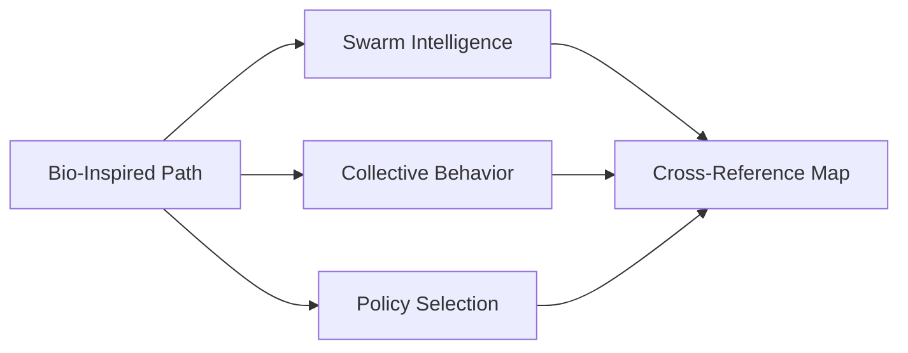

---

title: Bio-Inspired Cognitive Systems Learning Path

type: learning_path

status: stable

created: 2024-03-15

modified: 2025-08-08

version: 2.1.0

complexity: advanced

processing_priority: 1

authors:

  - name: Cognitive Systems Team

    role: Research & Development

difficulty_level: advanced

estimated_hours: 480

completion_time: "20 weeks"

certification_track: true

tags:

  - biological systems

  - cognitive science

  - interdisciplinary

  - bio-inspired computing

  - neural networks

  - evolutionary algorithms

  - embodied cognition

semantic_relations:

  - type: prerequisite

    links:

      - [[active_inference_biological_learning_path]]

      - [[active_inference_cognitive_learning_path]]

  - type: specializes

    links: [[active_inference_learning_path]]

  - type: related

    links:


      - [[active_inference_computational_learning_path]]

      - [[active_inference_biological_learning_path]]

  - type: integrates_with

    links:

      - [[active_inference_robotics_learning_path]]

      - [[active_inference_agi_learning_path]]

---

# Bio-Inspired Cognitive Systems Learning Path

## Quick Start

- Launch the ant colony simulation and add info-gain foraging checks; compare to baseline

- Build a cell-level inference sketch with repo primitives; verify belief update trends

- Prototype a simple GA vs. swarm policy selection; assert convergence stability

## External Web Resources

- [[index#centralized-external-web-resources|Centralized resources hub]]

- Ant Colony Optimization background (book reference at MIT Press); myrmecology journals (see hub pointers)

## Quick Reference

- **Difficulty**: Advanced

- **Time Commitment**: 20-25 hours/week for 20 weeks

- **Prerequisites Score**: 8/10 (biology, computer science, and mathematics background)

- **Industry Relevance**: High (Research, Robotics, AI Systems)

- **Hands-on Component**: 55%

- **Theory Component**: 45%

## Executive Summary

### Purpose and Scope

This comprehensive learning path explores the intersection of biological systems and cognitive architectures, focusing on bio-inspired approaches to cognitive system design. It integrates principles from neuroscience, evolutionary biology, and cognitive science to develop more natural, adaptive, and robust computational systems using Active Inference principles.

### Target Audience

- **Primary**: Researchers in bio-inspired computing and cognitive systems

- **Secondary**: Engineers developing adaptive AI systems

- **Career Stage**: Advanced practitioners and researchers (3+ years experience)

### Learning Outcomes

By completing this path, learners will be able to:

1. Design bio-inspired cognitive architectures using Active Inference principles

1. Implement natural computation algorithms based on biological mechanisms

1. Develop adaptive systems that learn and evolve like biological organisms

1. Apply bio-inspired solutions to real-world engineering challenges

### Industry Applications

- Research: Bio-inspired computing, cognitive systems research

- Robotics: Adaptive robotic systems, swarm robotics

- AI Systems: Natural language processing, computer vision

- Biotechnology: Computational biology, synthetic biology

### Repo-integrated labs (TDD)

- Swarm coordination from biology to code

  - Start the ant colony simulation

    ```bash

    python3 /home/trim/Documents/GitHub/cognitive/Things/Ant_Colony/ant_colony/main.py --config /home/trim/Documents/GitHub/cognitive/Things/Ant_Colony/config/colony_config.yaml

    ```

  - Add tests in `Things/Ant_Colony/ant_colony/utils/data_collection.py` usages to verify information-gain-oriented foraging

- Cellular-to-network modeling bridge

  - Use `tools/src/models/active_inference` primitives to sketch cell-level inference

  - Validate via unit tests that belief updates match expected qualitative trends

- Bio-inspired optimization

  - Implement small GA baseline and compare to swarm policy selection using repo matrices

  - Add assertions on convergence speed and stability

### Foundations

- [[knowledge_base/mathematics/expected_free_energy]] · [[knowledge_base/mathematics/policy_selection]] · [[knowledge_base/mathematics/precision_parameter]] · [[knowledge_base/mathematics/softmax_function]] · [[knowledge_base/mathematics/numerical_stability]] · [[knowledge_base/mathematics/message_passing]] · [[knowledge_base/mathematics/bethe_free_energy]]

## Knowledge Base Anchors

- Bio-inspired: [[knowledge_base/cognitive/collective_behavior]] · [[knowledge_base/cognitive/swarm_intelligence]] · [[knowledge_base/cognitive/stigmergic_coordination]]

- Math: [[knowledge_base/mathematics/policy_selection]] · [[knowledge_base/mathematics/dynamical_systems]]

- Cross-map: [[knowledge_base/mathematics/cross_reference_map]]


```mermaid

graph LR

  BIOC[Bio-Inspired Path] --> SW[Swarm Intelligence]

  BIOC --> CB[Collective Behavior]

  BIOC --> PS[Policy Selection]

  SW --> CRM[Cross-Reference Map]

  CB --> CRM

  PS --> CRM

```

## Learner Assessment and Entry Guidance

### Pre-Learning Assessment

```yaml

assessment_dimensions:

  biological_knowledge:

    - neuroscience_basics: [none, basic, intermediate, advanced]

    - evolutionary_biology: [none, basic, intermediate, advanced]

    - systems_biology: [none, basic, intermediate, advanced]

    - cellular_biology: [none, basic, intermediate, advanced]

  technical_background:

    - programming_experience: [none, basic, intermediate, advanced, expert]

    - mathematics_level: [basic, intermediate, advanced, expert]

    - ai_ml_knowledge: [none, basic, intermediate, advanced, expert]

    - systems_design: [none, basic, intermediate, advanced]

  interdisciplinary_experience:

    - cross_domain_projects: [none, limited, moderate, extensive]

    - research_experience: [none, undergraduate, graduate, professional]

    - collaboration_skills: [developing, proficient, advanced, expert]

```

### Recommended Entry Points

**Foundation Track** (Prerequisites: 6/10)

- For learners with strong biology OR computer science background

- 4-week interdisciplinary bridge module

- Focus on building missing domain knowledge

- **Start Here If**: Strong in one domain, need the other

**Integration Track** (Prerequisites: 7-8/10)

- For learners with moderate background in both domains

- 2-week synthesis and methodology module

- Focus on integration principles

- **Start Here If**: Good foundation in both biology and CS

**Advanced Track** (Prerequisites: 8-9/10)

- Direct entry to core bio-inspired systems

- **Start Here If**: Strong interdisciplinary background

**Research Track** (Prerequisites: 9-10/10)

- Focus on novel research and cutting-edge applications

- **Start Here If**: Extensive research experience in related fields

## Core Learning Path

### Foundation Track Bridge (4 weeks)

#### Week 1-2: Biological Foundations for Engineers


#### Week 3-4: Computational Foundations for Biologists

```python

computational_modules = {

    'week_3': {

        'title': 'Computational Thinking and Algorithms',

        'concepts': [

            'Algorithm design principles',

            'Data structures and complexity',

            'Machine learning fundamentals',

            'Optimization and search'

        ],

        'implementations': [

            'basic_algorithms',

            'data_structure_practice',

            'ml_model_implementation'

        ],

        'assessments': ['algorithm_design', 'implementation_project']

    },

    'week_4': {

        'title': 'Systems Design and Architecture',

        'concepts': [

            'System architecture principles',

            'Modular design and interfaces',

            'Distributed systems basics',

            'Performance and scalability'

        ],

        'implementations': [

            'modular_system_design',

            'interface_specification',

            'performance_analysis'

        ],

        'assessments': ['system_design_project', 'architecture_review']

    }

}

```

### Module 1: Bio-Inspired Architecture Design (4 weeks)

#### Week 1-2: Neural-Inspired Architectures


#### Week 3-4: Evolutionary Architecture Adaptation


### Module 2: Natural Computation Mechanisms (5 weeks)

#### Week 1-2: Cellular and Molecular Computation


#### Week 3-4: Swarm Intelligence and Collective Behavior


#### Week 5: Embodied Cognition Systems


### Module 3: Adaptive Learning Systems (4 weeks)

#### Week 1-2: Biological Learning Mechanisms


#### Week 3-4: Evolutionary and Developmental Learning


### Module 4: Integration and Applications (4 weeks)

#### Week 1-2: Multi-Scale Integration


#### Week 3-4: Real-World Applications


### Assessment Framework


## Version History

- Created: 2024-03-15

- Last Updated: 2024-03-15

- Status: Stable

- Version: 1.0.0
