# Active Inference in Biological Intelligence Learning Path

## Quick Reference
- **Difficulty**: Advanced
- **Time Commitment**: 20-25 hours/week for 20 weeks
- **Prerequisites Score**: 8/10 (biology and computational expertise)
- **Industry Relevance**: High (Research, Biotech, Healthcare)
- **Hands-on Component**: 45%
- **Theory Component**: 55%

## Executive Summary

### Purpose and Scope
This specialized learning path integrates Active Inference principles with biological intelligence research, providing a comprehensive framework for understanding and modeling intelligent behavior across biological scales. It bridges theoretical biology with computational modeling, focusing on natural computation and evolutionary systems.

### Target Audience
- **Primary**: Computational biologists and systems biologists
- **Secondary**: AI researchers and bioinformaticians
- **Career Stage**: Advanced researchers (3+ years experience)

### Learning Outcomes
By completing this path, learners will be able to:
1. Develop sophisticated models of biological intelligence using Active Inference
2. Implement multi-scale biological computation systems
3. Design and conduct biological experiments with Active Inference frameworks
4. Apply models to understand natural intelligence and adaptation

### Industry Applications
- Research: Systems biology, evolutionary computation
- Biotech: Drug discovery, synthetic biology
- Healthcare: Disease modeling, personalized medicine
- Technology: Bio-inspired computing, natural algorithms

## Path Selection Guide
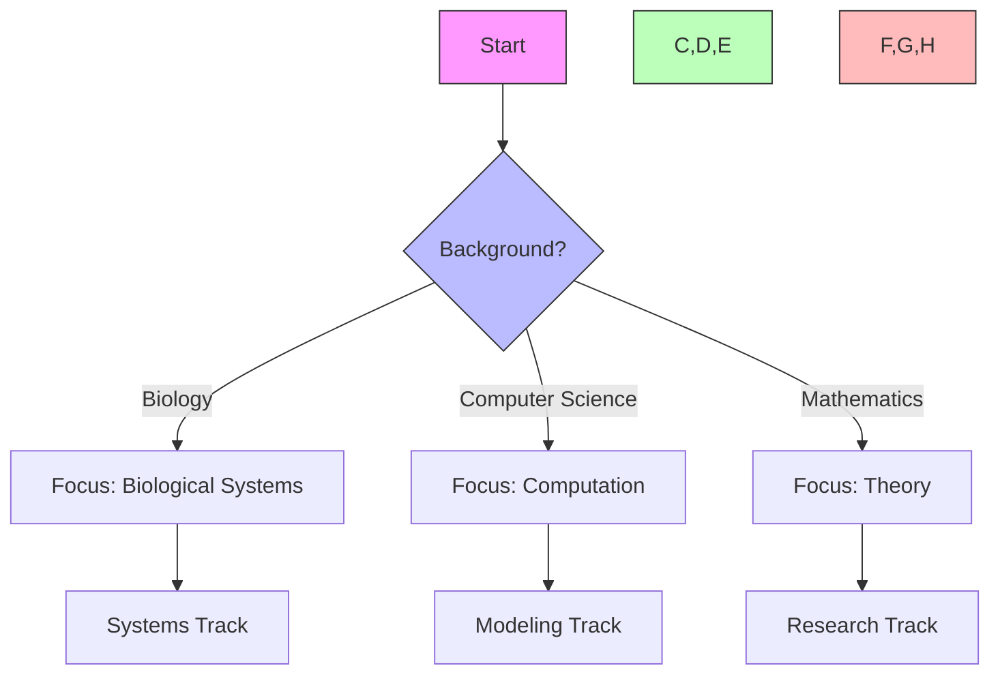

## Path Interconnections
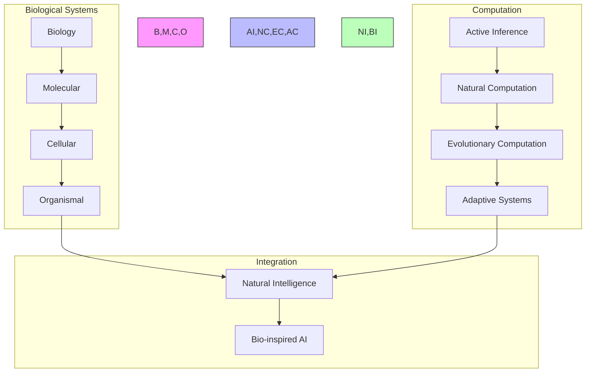

### System Architecture
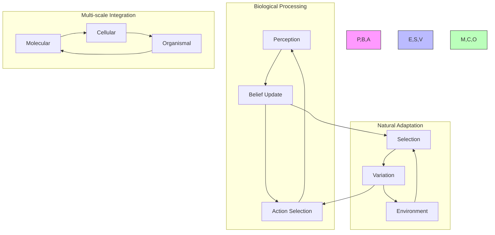

## Prerequisites

### 1. Biological Foundations (4 weeks)
- Biological Systems
  - Cellular biology
  - Neural systems
  - Organismal behavior
  - Evolutionary processes

- Natural Computation
  - Biological information processing
  - Natural algorithms
  - Collective computation
  - Adaptive systems

- Evolutionary Theory
  - Natural selection
  - Adaptation mechanisms
  - Fitness landscapes
  - Population dynamics

- Systems Biology
  - Molecular networks
  - Cellular signaling
  - Metabolic pathways
  - Regulatory systems

### 2. Technical Skills (2 weeks)
- Biological Tools
  - Bioinformatics
  - Systems modeling
  - Network analysis
  - Evolutionary simulation

## Core Learning Path

### 1. Biological Intelligence Modeling (4 weeks)

#### Week 1-2: Natural State Inference
```python
class BiologicalStateEstimator:
    def __init__(self,
                 system_levels: List[str],
                 adaptation_rate: float):
        """Initialize biological state estimator."""
        self.system_hierarchy = SystemHierarchy(system_levels)
        self.adaptation_mechanism = AdaptationMechanism(adaptation_rate)
        self.homeostasis_monitor = HomeostasisMonitor()
        
    def estimate_state(self,
                      environmental_signals: torch.Tensor,
                      internal_state: torch.Tensor) -> BiologicalState:
        """Estimate biological system state."""
        current_state = self.system_hierarchy.integrate_signals(
            environmental_signals, internal_state
        )
        adapted_state = self.adaptation_mechanism.update(current_state)
        return self.homeostasis_monitor.validate_state(adapted_state)
```

#### Week 3-4: Natural Decision Making
```python
class BiologicalDecisionMaker:
    def __init__(self,
                 behavior_space: BehaviorSpace,
                 fitness_function: FitnessFunction):
        """Initialize biological decision maker."""
        self.behavior_repertoire = BehaviorRepertoire(behavior_space)
        self.fitness_evaluator = fitness_function
        self.adaptation_policy = AdaptationPolicy()
        
    def select_behavior(self,
                       environmental_state: torch.Tensor,
                       internal_needs: torch.Tensor) -> Behavior:
        """Select adaptive behavior."""
        options = self.behavior_repertoire.generate_options()
        fitness_scores = self.evaluate_fitness(options, environmental_state)
        return self.adaptation_policy.select_action(options, fitness_scores)
```

### 2. Natural Applications (6 weeks)

#### Week 1-2: Cellular Intelligence
- Molecular computation
- Cellular decision-making
- Metabolic adaptation
- Signal processing

#### Week 3-4: Neural Intelligence
- Neural computation
- Synaptic plasticity
- Network adaptation
- Information integration

#### Week 5-6: Organismal Intelligence
- Behavioral adaptation
- Learning mechanisms
- Memory formation
- Social behavior

### 3. Evolutionary Intelligence (4 weeks)

#### Week 1-2: Evolutionary Learning
```python
class EvolutionaryLearner:
    def __init__(self,
                 population_size: int,
                 mutation_rate: float):
        """Initialize evolutionary learning system."""
        self.population = Population(population_size)
        self.selection = NaturalSelection()
        self.variation = VariationOperator(mutation_rate)
        
    def evolve_generation(self,
                         environment: Environment) -> Population:
        """Evolve population through one generation."""
        fitness = self.evaluate_fitness(self.population, environment)
        selected = self.selection.select(self.population, fitness)
        return self.variation.create_offspring(selected)
```

#### Week 3-4: Adaptive Systems
- Population dynamics
- Fitness landscapes
- Evolutionary strategies
- Collective adaptation

### 4. Advanced Topics (4 weeks)

#### Week 1-2: Multi-scale Integration
```python
class BiologicalHierarchy:
    def __init__(self,
                 scale_levels: List[ScaleLevel],
                 integration_params: IntegrationParams):
        """Initialize biological hierarchy."""
        self.levels = scale_levels
        self.integrator = ScaleIntegrator(integration_params)
        self.coordinator = SystemCoordinator()
        
    def process_information(self,
                          inputs: Dict[str, torch.Tensor]) -> SystemState:
        """Process information across scales."""
        level_states = {level: level.process(inputs[level.name])
                       for level in self.levels}
        integrated_state = self.integrator.combine_states(level_states)
        return self.coordinator.coordinate_responses(integrated_state)
```

#### Week 3-4: Natural Computation
- Biological algorithms
- Natural optimization
- Collective intelligence
- Emergent computation

## Projects

### Biological Projects
1. **Cellular Systems**
   - Molecular networks
   - Cellular decisions
   - Metabolic adaptation
   - Signal integration

2. **Neural Systems**
   - Neural plasticity
   - Network adaptation
   - Information processing
   - Learning mechanisms

### Advanced Projects
1. **Evolutionary Systems**
   - Population dynamics
   - Adaptive strategies
   - Fitness landscapes
   - Collective behavior

2. **Natural Intelligence**
   - Biological computation
   - Adaptive systems
   - Multi-scale integration
   - Emergent behavior

## Resources

### Academic Resources
1. **Research Papers**
   - Biological Intelligence
   - Natural Computation
   - Evolutionary Systems
   - Systems Biology

2. **Books**
   - Biological Systems
   - Natural Intelligence
   - Evolutionary Theory
   - Complex Adaptation

### Technical Resources
1. **Software Tools**
   - Bioinformatics Tools
   - Systems Modeling
   - Network Analysis
   - Evolutionary Simulation

2. **Biological Resources**
   - Molecular Databases
   - Neural Data
   - Behavioral Records
   - Evolutionary Models

## Next Steps

### Advanced Topics
1. [[biological_systems_learning_path|Biological Systems]]
2. [[evolutionary_computation_learning_path|Evolutionary Computation]]
3. [[natural_intelligence_learning_path|Natural Intelligence]]

### Research Directions
1. [[research_guides/biological_intelligence|Biological Intelligence Research]]
2. [[research_guides/natural_computation|Natural Computation Research]]
3. [[research_guides/evolutionary_systems|Evolutionary Systems Research]]

## Integration Strategies

### Development Approaches
- Theory-Practice Integration
  - Biological principles
  - Computational models
  - Experimental validation
- Cross-Scale Development
  - Molecular systems
  - Cellular networks
  - Organismal behavior
- Research Integration
  - Literature synthesis
  - Model development
  - Empirical testing

### Research Framework
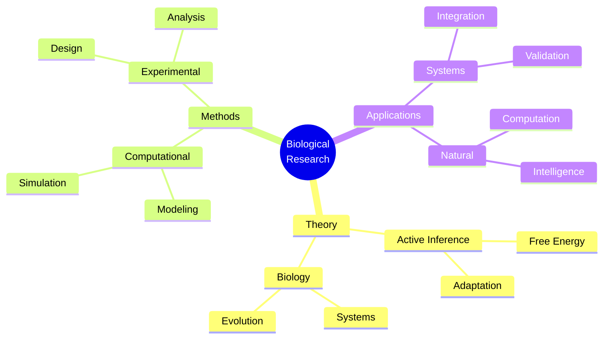

### Development Lifecycle
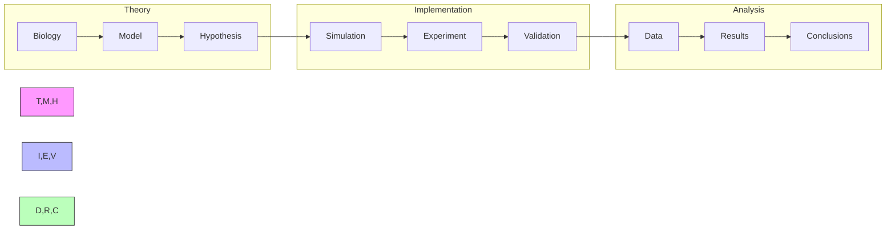

## Assessment Framework

### Continuous Assessment
#### Weekly Checkpoints
- Theoretical Understanding (85% required)
  - Biological principles
  - Active inference mathematics
  - Systems theory
- Implementation Skills (80% required)
  - Model development
  - Simulation design
  - Data analysis
- Research Progress (85% required)
  - Literature review
  - Experimental design
  - Results analysis

#### Progress Tracking
- Daily Research Log
- Weekly Model Review
- Monthly Project Assessment
- Quarterly Publication Progress

### Knowledge Checkpoints

#### Foundation Checkpoint (Week 6)
- Format: Written + Implementation
- Duration: 4 hours
- Topics:
  - Biological systems
  - Active inference basics
  - Computational modeling
- Requirements:
  - Theory: 85% correct
  - Implementation: Working biological model

#### Advanced Integration (Week 12)
- Format: Research Project
- Duration: 2 weeks
- Focus:
  - Complex biological systems
  - Multi-scale integration
  - Experimental validation
- Deliverables:
  - Research paper draft
  - Working implementation
  - Experimental results

#### Final Assessment (Week 20)
- Format: Research Publication
- Duration: 3 weeks
- Components:
  - Original research
  - Novel implementation
  - Biological validation
- Requirements:
  - Publication-ready paper
  - Validated model
  - Experimental data

### Project Portfolio

#### Research Projects
1. Biological Model Development
   - Scope: Natural system modeling
   - Deliverables:
     - Model implementation
     - Validation results
     - Documentation
   - Evaluation:
     - Code quality: 30%
     - Results: 40%
     - Documentation: 30%

2. Experimental Application
   - Scope: Biological validation
   - Deliverables:
     - Experimental design
     - Data analysis
     - Results interpretation
   - Evaluation:
     - Design: 35%
     - Analysis: 35%
     - Documentation: 30%

#### Final Project
- Description: Novel Biological Application
- Requirements:
  - Technical:
    - Original model
    - Experimental validation
    - Data analysis
  - Documentation:
    - Research paper
    - Technical docs
    - Experimental protocol
  - Presentation:
    - Research talk
    - Code review
    - Experimental demo

### Success Criteria
#### Technical Competency
- Theory: Advanced understanding (9/10)
- Implementation: Expert level (8/10)
- Research: Publication quality
- Experimental: Lab ready

#### Project Delivery
- Quality Standards:
  - Code coverage > 90%
  - Experimental validation
  - Documentation complete
- Performance Metrics:
  - Model accuracy
  - Biological relevance
  - Research impact

#### Professional Development
- Research publications
- Experimental validations
- Conference presentations
- Community contributions

## Career Development

### Industry Alignment
#### Research Roles
- Computational Biologist
  - Model development
  - System analysis
  - Research design
- Systems Biologist
  - Network analysis
  - Integration studies
  - Data interpretation
- Research Scientist
  - Experimental design
  - Data analysis
  - Theory development

#### Certification Path
- Biological Systems
  - Experimental methods
  - Data analysis
- Computational Biology
  - Model development
  - System simulation
- Research Methods
  - Experimental design
  - Statistical analysis

### Professional Network
#### Research Community
- Academic Connections:
  - Research labs
  - Universities
  - Biotech centers
- Industry Partners:
  - Biotech companies
  - Research institutes
  - Healthcare organizations
- Professional Organizations:
  - Systems Biology Society
  - Computational Biology Association
  - Bioinformatics Groups

#### Career Progression
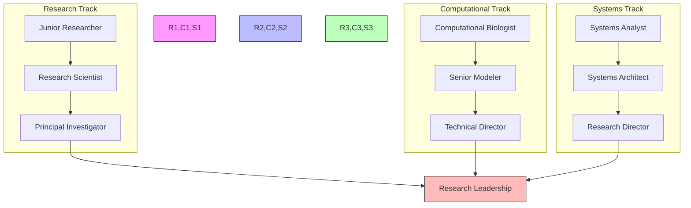

### Competency Framework
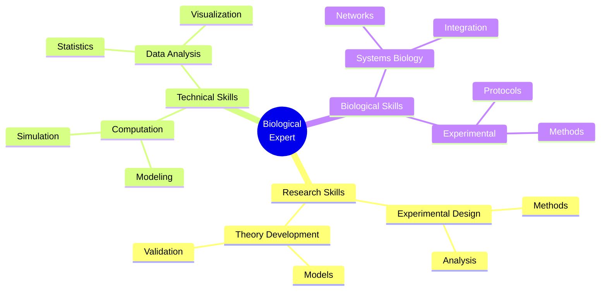

### Research Focus Areas
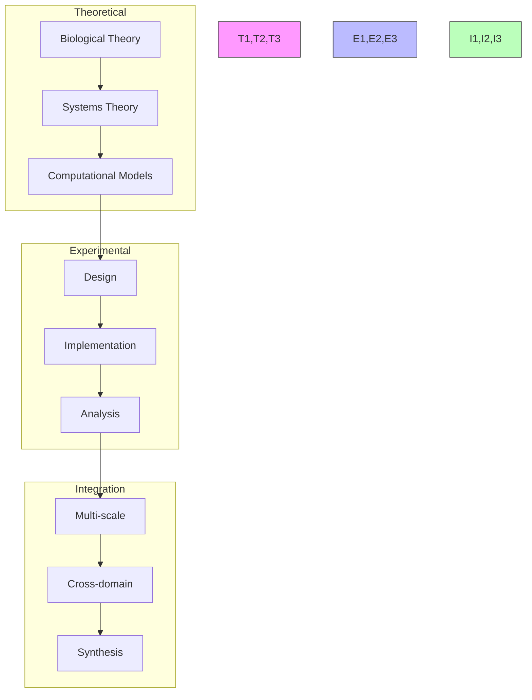

## Support Resources

### Research Support
- Literature Database
  - Biological papers
  - Systems research
  - Computational models
- Computing Resources
  - HPC clusters
  - Cloud computing
  - Simulation platforms
- Analysis Tools
  - Statistical packages
  - Visualization tools
  - Data processing

### Technical Support
- Development Tools
  - Modeling frameworks
  - Simulation tools
  - Analysis suites
- Documentation
  - API references
  - Implementation guides
  - Best practices
- Computing Resources
  - Development environments
  - Testing frameworks
  - Deployment tools

### Learning Support
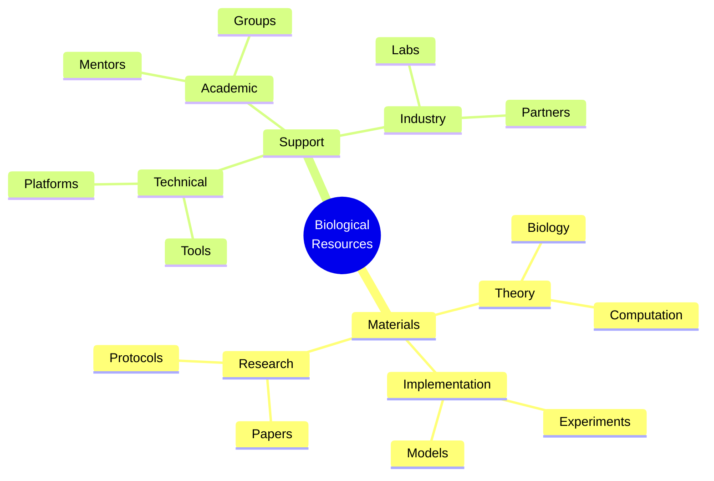

## Version Control and Updates

### Version History
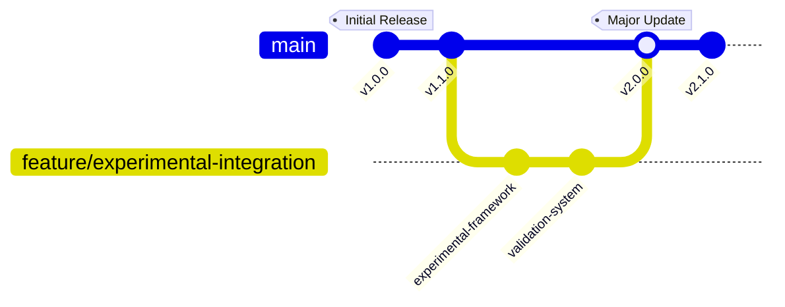

### Change Management
#### Major Updates
- v2.0.0 (Current)
  - Enhanced experimental framework
  - Advanced biological models
  - Improved validation system
  - Updated career paths
- v1.1.0
  - Added experimental protocols
  - Enhanced documentation
  - New research projects
- v1.0.0
  - Initial curriculum
  - Basic framework
  - Core concepts

#### Planned Improvements
- Advanced biological models
- Experimental protocols
- Integration frameworks
- Research extensions

### Quality Metrics
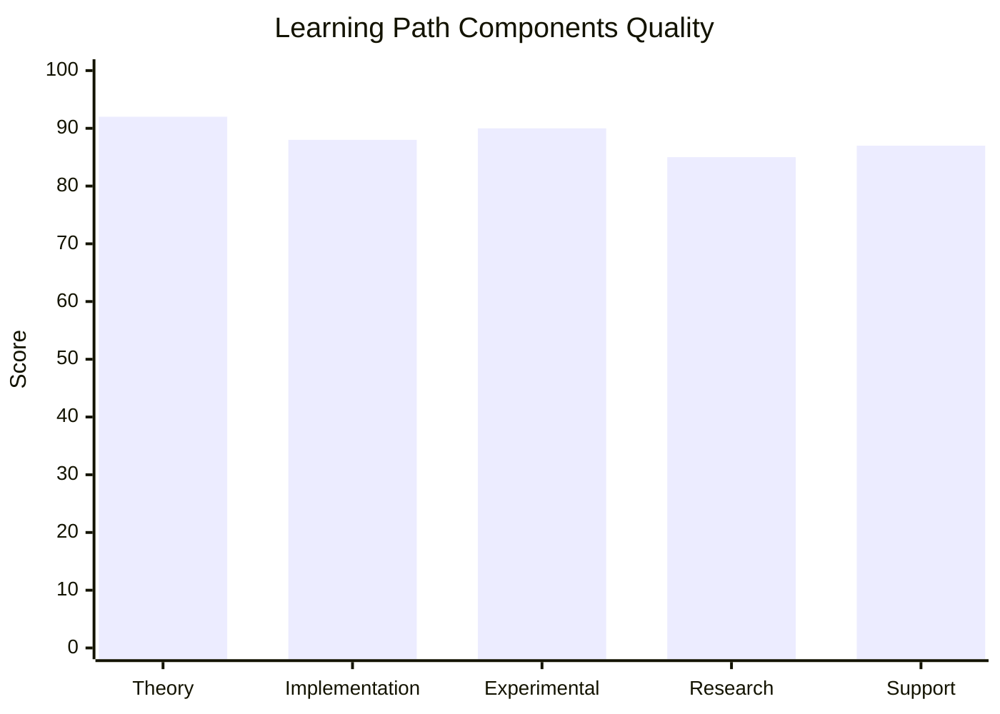

## Learning Analytics

### Progress Tracking
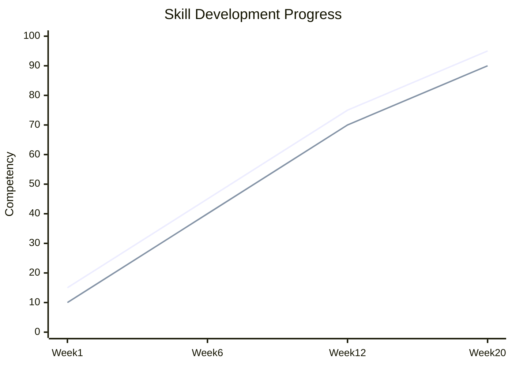

### Performance Metrics
- Research Skills
  - Theory understanding
  - Experimental design
  - Data analysis
- Technical Skills
  - Model development
  - System simulation
  - Implementation
- Biological Skills
  - Systems understanding
  - Experimental methods
  - Data interpretation

### Development Analytics
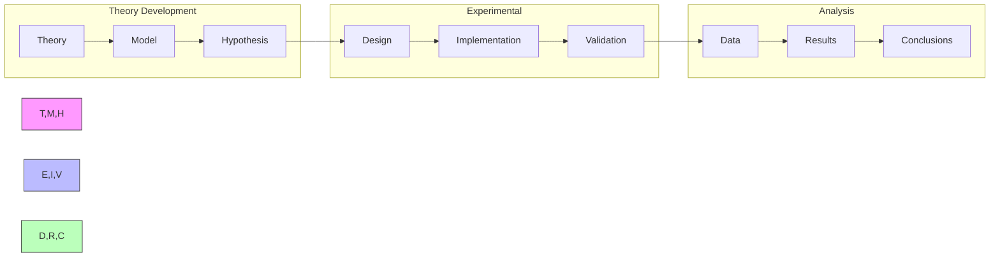

## Final Notes

### Success Stories
- Research Impact
  - Published papers
  - Novel methods
  - Field contributions
- Experimental Achievements
  - Validated models
  - System implementations
  - Protocol development
- Professional Growth
  - Research leadership
  - Industry influence
  - Community building

### Additional Resources
- Extended Reading
  - Advanced theory
  - Experimental methods
  - Technical guides
- Research Directions
  - Open problems
  - Future applications
  - Integration opportunities
- Community Resources
  - Research groups
  - Technical forums
  - Professional networks

### Contact Information
- Research Support
  - Principal investigators
  - Lab managers
  - Research coordinators
- Technical Support
  - System developers
  - Tool specialists
  - Integration experts
- Community Support
  - Group coordinators
  - Project leaders
  - Mentorship team 