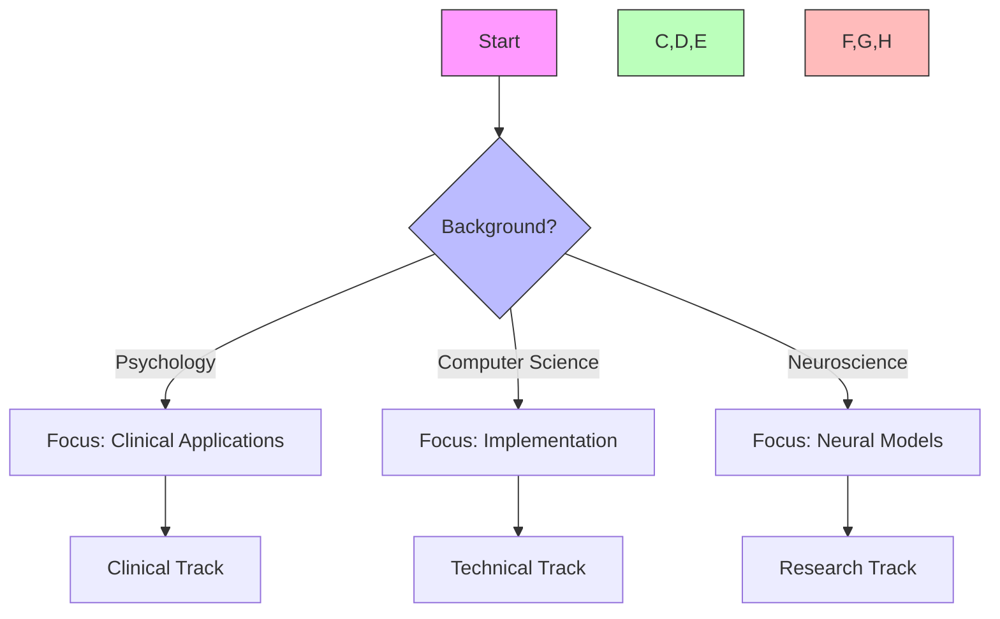
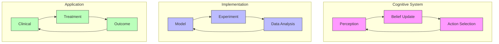
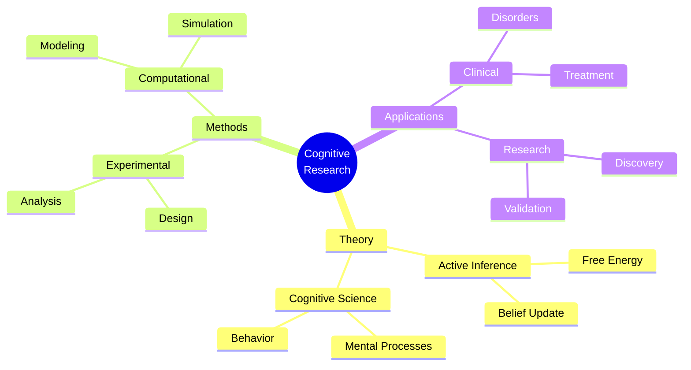
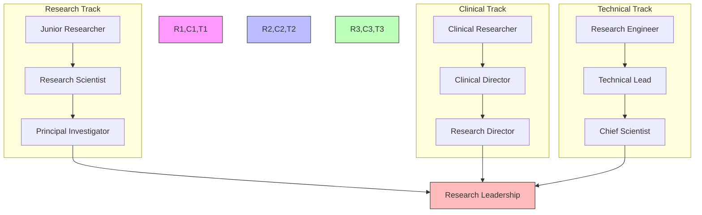
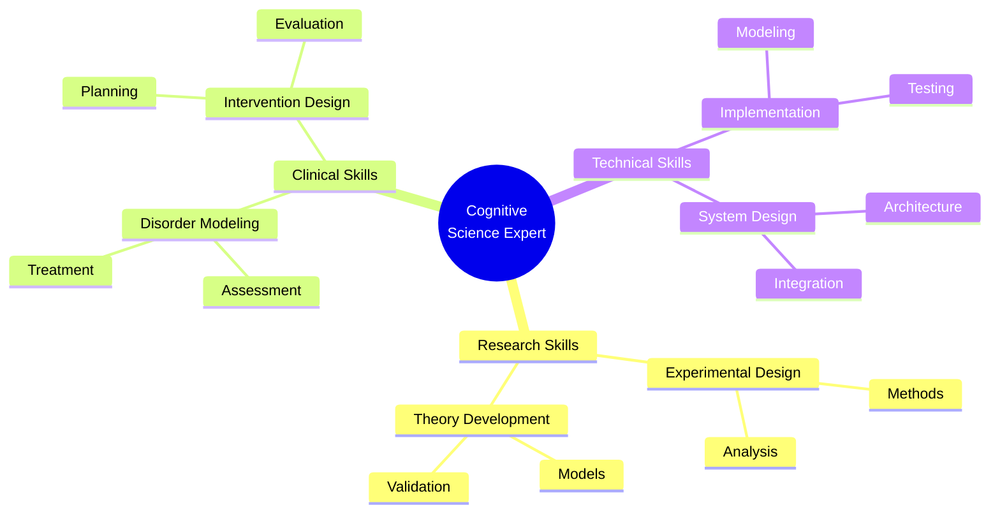
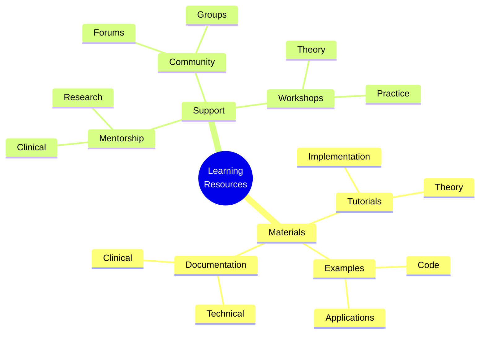
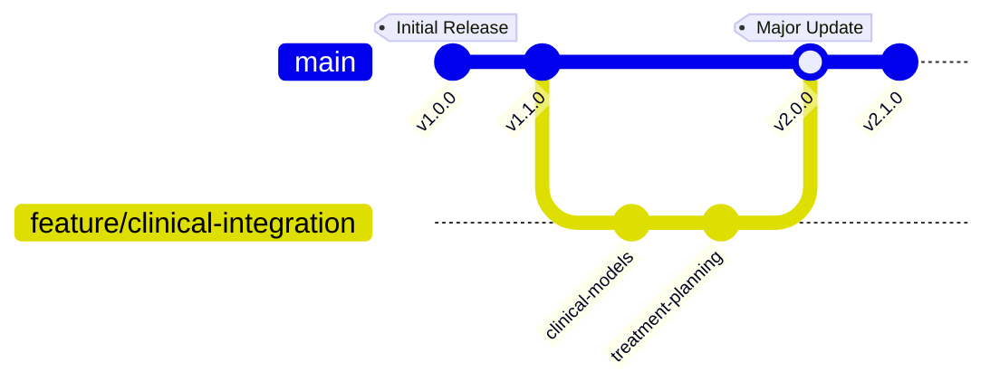
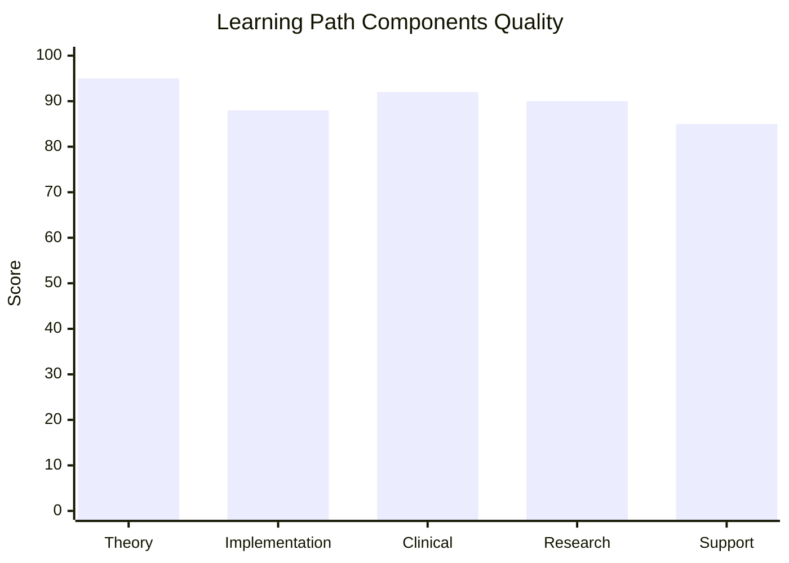
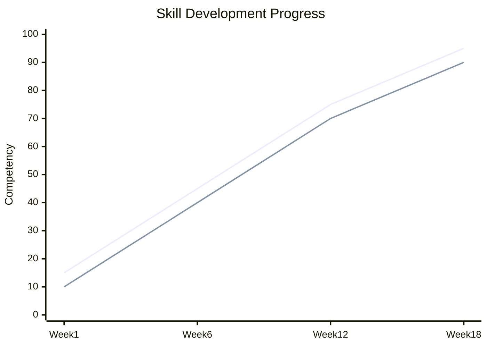
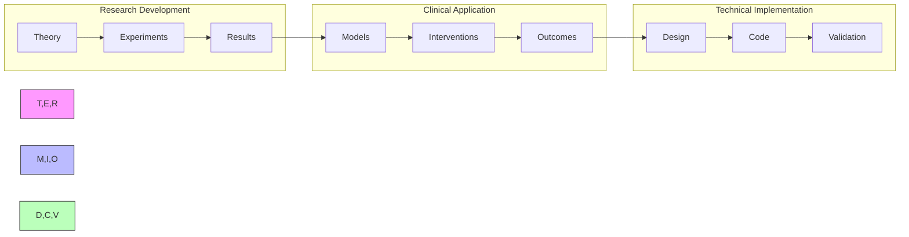

# Active Inference in Cognitive Science Learning Path

## Quick Reference
- **Difficulty**: Advanced
- **Time Commitment**: 20-25 hours/week for 18 weeks
- **Prerequisites Score**: 8/10 (cognitive science and programming foundation)
- **Industry Relevance**: High (Research, Clinical, Technology)
- **Hands-on Component**: 50%
- **Theory Component**: 50%

## Executive Summary

### Purpose and Scope
This specialized learning path integrates Active Inference principles with cognitive science, providing a comprehensive framework for understanding and modeling mental processes. It bridges theoretical cognitive science with computational implementation, focusing on both fundamental research and practical applications in clinical and technological domains.

### Target Audience
- **Primary**: Cognitive scientists and computational psychologists
- **Secondary**: AI researchers and clinical practitioners
- **Career Stage**: Advanced researchers and practitioners (3+ years experience)

### Learning Outcomes
By completing this path, learners will be able to:
1. Develop sophisticated cognitive models using Active Inference principles
2. Implement computational models of mental processes and behavior
3. Design and conduct cognitive experiments with Active Inference frameworks
4. Apply models to clinical and research applications

### Industry Applications
- Research: Cognitive science labs, neuroscience research
- Clinical: Computational psychiatry, behavioral therapy
- Technology: Cognitive systems, human-AI interaction
- Education: Cognitive training, educational technology

## Path Selection Guide


## Overview

This specialized path focuses on applying Active Inference to understand cognitive processes, behavior, and mental phenomena. It integrates psychological theory with computational modeling.

## Prerequisites

### 1. Cognitive Science Foundations (4 weeks)
- Cognitive Psychology
  - Perception
  - Attention
  - Memory
  - Decision making

- Behavioral Science
  - Learning theory
  - Motivation
  - Emotion
  - Social cognition

- Experimental Methods
  - Research design
  - Data collection
  - Statistical analysis
  - Behavioral measures

- Computational Theory
  - Information processing
  - Mental representations
  - Cognitive architectures
  - Neural computation

### 2. Technical Skills (2 weeks)
- Research Tools
  - Python/R
  - Statistical packages
  - Experimental software
  - Data visualization

## Core Learning Path

### 1. Cognitive Modeling (4 weeks)

#### Week 1-2: Mental State Inference
```python
class CognitiveStateEstimator:
    def __init__(self,
                 belief_dim: int,
                 observation_dim: int):
        """Initialize cognitive state estimator."""
        self.belief_model = BeliefUpdateModel(belief_dim)
        self.obs_model = ObservationModel(belief_dim, observation_dim)
        self.beliefs = torch.zeros(belief_dim)
        
    def update_beliefs(self,
                      observation: torch.Tensor) -> torch.Tensor:
        """Update beliefs based on observation."""
        # Generate prediction
        pred_obs = self.obs_model(self.beliefs)
        
        # Compute prediction error
        error = observation - pred_obs
        
        # Update beliefs
        self.beliefs = self.belief_model.update(self.beliefs, error)
        return self.beliefs
```

#### Week 3-4: Action Selection
```python
class BehavioralController:
    def __init__(self,
                 action_space: int,
                 goal_space: int):
        """Initialize behavioral controller."""
        self.policy = PolicyNetwork(action_space)
        self.value = ValueNetwork(goal_space)
        
    def select_action(self,
                     beliefs: torch.Tensor,
                     goals: torch.Tensor) -> torch.Tensor:
        """Select action using active inference."""
        # Generate policies
        policies = self.policy.generate_policies(beliefs)
        
        # Evaluate expected free energy
        G = torch.zeros(len(policies))
        for i, pi in enumerate(policies):
            future_beliefs = self.simulate_policy(beliefs, pi)
            G[i] = self.compute_expected_free_energy(
                future_beliefs, goals
            )
        
        # Select optimal policy
        best_policy = policies[torch.argmin(G)]
        return best_policy[0]
```

### 2. Cognitive Domains (6 weeks)

#### Week 1-2: Perceptual Processing
- Sensory Integration
- Feature Extraction
- Pattern Recognition
- Attention Allocation

#### Week 3-4: Decision Making
- Value Computation
- Risk Assessment
- Temporal Planning
- Social Decision Making

#### Week 5-6: Learning and Memory
- Skill Acquisition
- Knowledge Formation
- Memory Consolidation
- Habit Learning

### 3. Applications (4 weeks)

#### Week 1-2: Behavioral Tasks
```python
class CognitiveBehaviorTask:
    def __init__(self,
                 task_type: str,
                 difficulty: float):
        """Initialize cognitive task."""
        self.type = task_type
        self.difficulty = difficulty
        self.stimuli = self.generate_stimuli()
        
    def run_trial(self,
                 agent: CognitiveAgent) -> Dict[str, Any]:
        """Run single trial of task."""
        # Present stimulus
        observation = self.present_stimulus()
        
        # Get agent response
        response = agent.process_stimulus(observation)
        
        # Evaluate performance
        results = self.evaluate_response(response)
        return results
```

#### Week 3-4: Clinical Applications
- Psychiatric Disorders
- Behavioral Therapy
- Cognitive Training
- Intervention Design

### 4. Advanced Topics (4 weeks)

#### Week 1-2: Social Cognition
```python
class SocialCognitionModel:
    def __init__(self,
                 n_agents: int,
                 social_dim: int):
        """Initialize social cognition model."""
        self.agents = [CognitiveAgent() for _ in range(n_agents)]
        self.social_space = SocialSpace(social_dim)
        
    def simulate_interaction(self,
                           context: Dict[str, Any]) -> List[torch.Tensor]:
        """Simulate social interaction."""
        # Initialize interaction
        states = []
        for agent in self.agents:
            # Update beliefs about others
            social_obs = self.social_space.get_observations(agent)
            agent.update_social_beliefs(social_obs)
            
            # Generate social action
            action = agent.select_social_action(context)
            states.append(action)
        
        return states
```

#### Week 3-4: Metacognition
- Self-monitoring
- Confidence Estimation
- Strategy Selection
- Learning to Learn

## Projects

### Cognitive Projects
1. **Perceptual Tasks**
   - Visual Search
   - Pattern Recognition
   - Category Learning
   - Attention Tasks

2. **Decision Tasks**
   - Value-based Choice
   - Risk Assessment
   - Social Dilemmas
   - Sequential Planning

### Clinical Projects
1. **Disorder Modeling**
   - Anxiety
   - Depression
   - OCD
   - ADHD

2. **Intervention Design**
   - Cognitive Training
   - Behavioral Therapy
   - Treatment Planning
   - Outcome Prediction

## Assessment

### Knowledge Assessment
1. **Theoretical Understanding**
   - Cognitive Processes
   - Behavioral Principles
   - Clinical Applications
   - Research Methods

2. **Practical Skills**
   - Experimental Design
   - Data Analysis
   - Model Implementation
   - Result Interpretation

### Final Projects
1. **Research Project**
   - Theory Development
   - Experimental Design
   - Data Collection
   - Analysis

2. **Clinical Application**
   - Disorder Modeling
   - Treatment Design
   - Validation Study
   - Outcome Assessment

## Resources

### Academic Resources
1. **Research Papers**
   - Theoretical Papers
   - Empirical Studies
   - Review Articles
   - Clinical Studies

2. **Books**
   - Cognitive Science
   - Computational Modeling
   - Clinical Psychology
   - Research Methods

### Technical Resources
1. **Software Tools**
   - Experimental Software
   - Analysis Packages
   - Modeling Tools
   - Visualization Libraries

2. **Data Resources**
   - Behavioral Datasets
   - Clinical Data
   - Model Benchmarks
   - Analysis Scripts

## Next Steps

### Advanced Topics
1. [[computational_psychiatry_learning_path|Computational Psychiatry]]
2. [[social_cognition_learning_path|Social Cognition]]
3. [[metacognition_learning_path|Metacognition]]

### Research Directions
1. [[research_guides/cognitive_science|Cognitive Science Research]]
2. [[research_guides/clinical_psychology|Clinical Psychology Research]]
3. [[research_guides/computational_modeling|Computational Modeling Research]]

## Integration Strategies

### Development Approaches
- Theory-Practice Integration
  - Cognitive theory implementation
  - Experimental validation
  - Clinical application
- Cross-Domain Development
  - Psychological models
  - Computational frameworks
  - Clinical tools
- Research Integration
  - Literature review
  - Model development
  - Empirical validation

### System Architecture


### Research Framework


## Assessment Framework

### Continuous Assessment
#### Weekly Checkpoints
- Theoretical Understanding (85% required)
  - Cognitive science principles
  - Active inference mathematics
  - Research methodology
- Implementation Skills (80% required)
  - Model development
  - Experimental design
  - Data analysis
- Clinical Applications (85% required)
  - Disorder modeling
  - Intervention design
  - Treatment planning

#### Progress Tracking
- Daily Research Log
- Weekly Implementation Review
- Monthly Project Assessment
- Quarterly Publication Progress

### Knowledge Checkpoints

#### Foundation Checkpoint (Week 6)
- Format: Written + Programming
- Duration: 4 hours
- Topics:
  - Cognitive science foundations
  - Active inference basics
  - Implementation fundamentals
- Requirements:
  - Theory: 85% correct
  - Implementation: Working cognitive model

#### Advanced Integration (Week 12)
- Format: Research Project
- Duration: 1 week
- Focus:
  - Complex cognitive models
  - Experimental validation
  - Clinical applications
- Deliverables:
  - Research paper draft
  - Working implementation
  - Experimental results

#### Final Assessment (Week 18)
- Format: Research Publication
- Duration: 2 weeks
- Components:
  - Original research
  - Novel implementation
  - Clinical validation
- Requirements:
  - Publication-ready paper
  - Validated model
  - Clinical application

### Project Portfolio

#### Research Projects
1. Cognitive Model Development
   - Scope: Mental process modeling
   - Deliverables:
     - Model implementation
     - Validation results
     - Documentation
   - Evaluation:
     - Code quality: 30%
     - Results: 40%
     - Documentation: 30%

2. Clinical Application
   - Scope: Disorder treatment
   - Deliverables:
     - Treatment model
     - Clinical validation
     - Case studies
   - Evaluation:
     - Model accuracy: 35%
     - Clinical utility: 35%
     - Documentation: 30%

#### Final Project
- Description: Novel Cognitive Application
- Requirements:
  - Technical:
    - Original model
    - Empirical validation
    - Clinical testing
  - Documentation:
    - Research paper
    - Technical docs
    - Clinical guide
  - Presentation:
    - Research talk
    - Code review
    - Clinical demo

### Success Criteria
#### Technical Competency
- Theory: Advanced understanding (9/10)
- Implementation: Expert level (8/10)
- Research: Publication quality
- Clinical: Practice ready

#### Project Delivery
- Quality Standards:
  - Code coverage > 90%
  - Test validation > 85%
  - Documentation complete
- Performance Metrics:
  - Model accuracy
  - Clinical efficacy
  - Research impact

#### Professional Development
- Research publications
- Clinical validations
- Conference presentations
- Community contributions

## Career Development

### Industry Alignment
#### Research Roles
- Cognitive Scientist
  - Research design
  - Theory development
  - Publication track
- Clinical Researcher
  - Treatment modeling
  - Intervention design
  - Clinical trials
- Research Engineer
  - Model implementation
  - System development
  - Technical validation

#### Certification Path
- Cognitive Science Research
  - Experimental methods
  - Statistical analysis
- Clinical Applications
  - Disorder modeling
  - Treatment planning
- Technical Implementation
  - Model development
  - System integration

### Professional Network
#### Research Community
- Academic Connections:
  - Research labs
  - Universities
  - Clinical centers
- Industry Partners:
  - Tech companies
  - Clinical practices
  - Research institutes
- Professional Organizations:
  - Cognitive Science Society
  - Clinical Psychology Association
  - AI Research Groups

#### Career Progression


### Competency Framework


## Support Resources

### Research Support
- Literature Database
  - Key papers
  - Review articles
  - Latest research
- Computing Resources
  - HPC access
  - Cloud computing
  - GPU clusters
- Analysis Tools
  - Statistical packages
  - Visualization tools
  - Data processing

### Technical Support
- Development Tools
  - Code repositories
  - Version control
  - Testing frameworks
- Documentation
  - API references
  - Implementation guides
  - Best practices
- Computing Resources
  - Development environments
  - Debugging tools
  - Performance profilers

### Learning Support


## Version Control and Updates

### Version History


### Change Management
#### Major Updates
- v2.0.0 (Current)
  - Enhanced clinical integration
  - Advanced research components
  - Improved assessment framework
  - Updated career paths
- v1.1.0
  - Added clinical applications
  - Enhanced documentation
  - New example projects
- v1.0.0
  - Initial curriculum
  - Basic implementations
  - Core concepts

#### Planned Improvements
- Advanced clinical models
- Real-world case studies
- Integration frameworks
- Research extensions

### Quality Metrics


## Learning Analytics

### Progress Tracking


### Performance Metrics
- Research Skills
  - Theory understanding
  - Experimental design
  - Data analysis
- Clinical Skills
  - Model development
  - Treatment planning
  - Outcome assessment
- Technical Skills
  - Implementation quality
  - System integration
  - Documentation

### Development Analytics


## Final Notes

### Success Stories
- Research Impact
  - Published papers
  - Novel methods
  - Field contributions
- Clinical Applications
  - Treatment models
  - Patient outcomes
  - Practice improvements
- Technical Achievements
  - System implementations
  - Tool development
  - Framework adoption

### Additional Resources
- Extended Reading
  - Advanced theory
  - Clinical papers
  - Technical guides
- Research Directions
  - Open problems
  - Future applications
  - Integration opportunities
- Community Resources
  - Research groups
  - Clinical networks
  - Technical forums

### Contact Information
- Research Support
  - Principal investigators
  - Research coordinators
  - Lab managers
- Clinical Support
  - Clinical directors
  - Treatment specialists
  - Research clinicians
- Technical Support
  - Lead developers
  - System architects
  - Integration specialists 