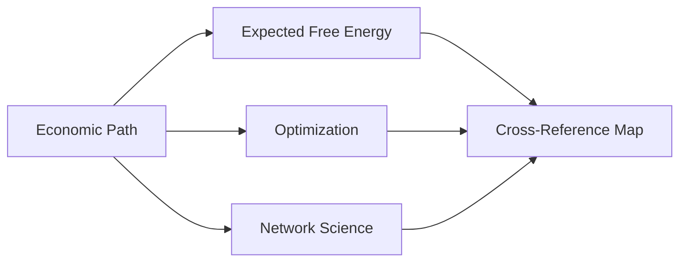

---

title: Active Inference in Economic Systems Learning Path

type: learning_path

status: stable

created: 2024-03-15

complexity: advanced

processing_priority: 1

tags:

  - active-inference

  - economics

  - market-dynamics

  - decision-theory

  - complex-systems

  - network-economics

  - cross-disciplinary

  - co-learning

semantic_relations:

  - type: specializes

    links: [[active_inference_learning_path]]

  - type: relates

    links:

      - [[active_inference_mathematical_learning_path]]

      - [[active_inference_resilient_systems_path]]


---

# Active Inference in Economic Systems Learning Path

## Quick Start

- Define an economic toy model (market state inference + controller) and validate stability vs. baseline

- Add policy evaluation with risk-adjusted utility under uncertainty; compare interventions

- Document assumptions and run sensitivity analysis

## External Web Resources

- [[index#centralized-external-web-resources|Centralized resources hub]]

- [JASSS](https://jasss.soc.surrey.ac.uk/), [ComSES Network](https://www.comses.net/)

- [FRED Economic Data](https://fred.stlouisfed.org/)

### Foundations

- [[knowledge_base/mathematics/expected_free_energy]] · [[knowledge_base/mathematics/policy_selection]] · [[knowledge_base/mathematics/precision_parameter]] · [[knowledge_base/mathematics/softmax_function]] · [[knowledge_base/mathematics/numerical_stability]] · [[knowledge_base/mathematics/message_passing]] · [[knowledge_base/mathematics/bethe_free_energy]]

## Overview

This specialized path focuses on applying Active Inference to understand economic systems, market dynamics, and decision-making under uncertainty. It integrates economic theory with complex systems modeling, emphasizing the use of active inference principles to model and predict economic behaviors and outcomes.

This learning path is designed as a co-learning program between Economics departments and the Active Inference Institute, accommodating diverse backgrounds in mathematics, biology, economics, and computer science. The program spans three quarters, offering multiple tracks and contribution avenues for participants from various disciplines.

## Program Structure

### Quarter 1: Foundations & Integration

**Theme: Building Common Ground**

#### Module 1: Bridging Disciplines (3 weeks)

- Economics for AI/Biology students

  - Basic economic principles

  - Market mechanisms

  - Economic decision-making

  - Policy fundamentals

- Active Inference for Economics students

  - Free energy principle

  - Belief updating

  - Policy selection

  - Hierarchical inference

- Shared mathematical foundations

  - Probability theory

  - Information theory

  - Optimization methods

  - Statistical inference

#### Module 2: Mathematical Tools (3 weeks)

- Core Mathematics

  - Probability & statistics

  - Information theory

  - Optimization techniques

  - Linear algebra

- Track-Specific Advanced Topics

  - Economics Track: Advanced calculus, Basic programming

  - Technical Track: Stochastic processes, Advanced optimization

  - Research Track: Mathematical modeling, Research methods

#### Module 3: Computational Foundations (4 weeks)

- Programming Essentials

  - Python fundamentals

  - Scientific computing

  - Data analysis

  - Visualization

- Economic Modeling

  - Agent-based models

  - Market simulations

  - Network analysis

  - Time series analysis

### Quarter 2: Core Integration

**Theme: Active Inference in Economic Systems**

#### Module 1: Market Dynamics (2 weeks)

##### Market State Inference


##### Economic Decision Making


- Price Formation

- Supply and Demand

- Market Equilibrium

- Trading Strategies

#### Module 2: Strategic Behavior (2 weeks)

- Game Theory Applications

- Strategic Planning

- Competition Dynamics

- Cooperation Mechanisms

#### Module 3: Financial Systems (2 weeks)

- Asset Pricing

- Risk Management

- Portfolio Optimization

- Market Efficiency

#### Module 4: Economic Policy & Networks (4 weeks)

##### Policy Design


##### Complex Economic Networks


##### Impact Analysis

- Policy Evaluation

- Welfare Analysis

- Distributional Effects

- Systemic Risk

##### Adaptive Markets

- Market Evolution

- Learning Dynamics

- Innovation Diffusion

- Institutional Adaptation

### Quarter 3: Applications & Research

**Theme: Real-world Integration**

#### Module 1: Applied Projects (4 weeks)

- Market Simulation Projects

  - Price discovery systems

  - Trading algorithms

  - Risk management tools

  - Market microstructure analysis

- Policy Design Projects

  - Regulatory frameworks

  - Intervention strategies

  - Impact assessment tools

  - Welfare analysis systems

#### Module 2: Research Methods (3 weeks)

- Experimental Design

  - Research methodology

  - Data collection

  - Statistical analysis

  - Result interpretation

- Model Validation

  - Empirical testing

  - Robustness checks

  - Sensitivity analysis

  - Performance metrics

#### Module 3: Capstone Projects (3 weeks)

- Team-based Integration Projects

  - Cross-disciplinary collaboration

  - Real-world applications

  - Research presentations

  - Industry partnerships

## Multi-track Learning Paths

### 1. Technical Track

- Focus: Implementation & modeling

- Prerequisites: Programming experience

- Core Activities:

  - Model implementation

  - Simulation development

  - Algorithm design

  - Performance optimization

- Deliverables:

  - Working models

  - Simulation frameworks

  - Technical documentation

  - Performance analysis

### 2. Economic Theory Track

- Focus: Economic principles & applications

- Prerequisites: Economics background

- Core Activities:

  - Theory development

  - Model specification

  - Policy analysis

  - Market research

- Deliverables:

  - Theoretical frameworks

  - Policy proposals

  - Market analyses

  - Research papers

### 3. Research Track

- Focus: Novel contributions

- Prerequisites: Research methods

- Core Activities:

  - Literature review

  - Hypothesis development

  - Experimental design

  - Data analysis

- Deliverables:

  - Research papers

  - Conference presentations

  - Grant proposals

  - Publication submissions

## Contribution Avenues

### Technical Contributions

- Model Implementation

  - Algorithm development

  - Code optimization

  - Testing frameworks

  - Performance tuning

- Tool Development

  - Analysis utilities

  - Visualization tools

  - Testing suites

  - Documentation systems

### Theoretical Contributions

- Framework Development

  - Economic theory

  - Active inference extensions

  - Integration methods

  - Mathematical proofs

- Policy Analysis

  - Intervention design

  - Impact assessment

  - Risk analysis

  - Welfare evaluation

### Educational Contributions

- Learning Materials

  - Tutorials

  - Case studies

  - Code examples

  - Documentation

- Mentorship

  - Peer teaching

  - Workshop facilitation

  - Code reviews

  - Project guidance

## Assessment & Support

### Continuous Assessment

- Weekly Assignments

  - Technical exercises

  - Theory problems

  - Research tasks

  - Project milestones

- Portfolio Development

  - Code repositories

  - Research papers

  - Project documentation

  - Presentation materials

### Support Structure

- Learning Resources

  - Online materials

  - Code repositories

  - Economic databases

  - Research papers

- Mentorship Program

  - Faculty advisors

  - Industry mentors

  - Peer mentoring

  - Research guidance

## Resources

### Academic Resources

1. **Research Papers**

   - Economic Theory

   - Market Microstructure

   - Financial Economics

   - Behavioral Finance

1. **Books**

   - Market Dynamics

   - Economic Policy

   - Financial Theory

   - Complex Systems

### Technical Resources

1. **Software Tools**

   - Economic Modeling

   - Market Simulation

   - Risk Analysis

   - Portfolio Management

1. **Data Resources**

   - Market Data

   - Economic Indicators

   - Financial Time Series

   - Policy Databases

## Next Steps

### Advanced Topics

1. Market Microstructure

1. Financial Economics

1. Economic Policy

### Research Directions

1. [[knowledge_base/research/market_dynamics|Market Dynamics Research]]

1. [[knowledge_base/research/economic_policy|Economic Policy Research]]

1. [[knowledge_base/research/financial_systems|Financial Systems Research]]

## Innovation & Integration

### Cross-disciplinary Synthesis

- Active learning approaches

- Mixed-background teams

- Integrated projects

- Knowledge synthesis

### Real-world Applications

- Industry partnerships

- Policy relevance

- Market applications

- Research impact

### Continuous Development

- Program evolution

- Content updates

- Tool enhancement

- Community feedback

## Centralized Resource Discovery System

### Dynamic Resource Integration Platform

See `docs/examples/README.md` for runnable examples.


### Smart Resource Curation Pipeline

## Knowledge Base Anchors

- Economics-related math: [[knowledge_base/mathematics/expected_free_energy]] · [[knowledge_base/mathematics/optimization_theory]] · [[knowledge_base/mathematics/network_science]]

- Systems perspective: [[knowledge_base/systems/systems_theory]]

- Cross-map: [[knowledge_base/mathematics/cross_reference_map]]



```python

class SmartCurationPipeline:

    def __init__(self):

        """Initialize smart curation pipeline."""

        self.content_analyzer = ContentAnalyzer()

        self.quality_validator = QualityValidator()

        self.relevance_scorer = RelevanceScorer()

        self.integration_processor = IntegrationProcessor()

    def process_new_resource(self, resource_url, metadata=None):

        """Process and integrate new resource into system."""

        # Content analysis

        content = self.content_analyzer.extract_content(resource_url)

        topics = self.content_analyzer.identify_topics(content)

        complexity = self.content_analyzer.assess_complexity(content)

        # Quality validation

        quality_metrics = self.quality_validator.assess(resource_url, content)

        # Relevance scoring

        relevance_scores = {}

        for path in self.get_all_learning_paths():

            relevance_scores[path] = self.relevance_scorer.score(

                content, topics, path.concepts

            )

        # Integration processing

        integration_points = self.integration_processor.identify_integration_points(

            topics, relevance_scores

        )

        # Knowledge base linking

        kb_links = self.generate_kb_links(topics, content)

        # Cross-path connections

        cross_connections = self.identify_cross_path_connections(

            topics, relevance_scores

        )

        return {

            'resource_metadata': {

                'quality_score': quality_metrics.overall_score,

                'complexity_level': complexity,

                'primary_topics': topics,

                'kb_integration_points': kb_links,

                'cross_path_connections': cross_connections

            },

            'integration_recommendations': integration_points,

            'suggested_placements': self.suggest_optimal_placement(relevance_scores)

        }

### Personalized Resource Dashboard

learning_resource_dashboard = {

    'current_module_resources': {

        'essential_readings': 'automatically_curated',

        'supplementary_materials': 'learner_customizable',

        'interactive_tools': 'skill_level_adapted',

        'assessment_resources': 'progress_aligned'

    },

    'discovery_recommendations': {

        'trending_content': 'community_validated',

        'advanced_materials': 'readiness_based',

        'cross_disciplinary': 'interest_driven',

        'career_relevant': 'goal_aligned'

    },

    'progress_integrated': {

        'completed_resources': 'achievement_tracked',

        'bookmarked_materials': 'revisit_scheduled',

        'peer_shared': 'collaboration_enhanced',

        'mentor_recommended': 'guidance_integrated'

    }

}
