---

title: Active Inference in Environmental Applications Learning Path

type: learning_path

status: stable

created: 2024-03-25

modified: 2024-03-25

version: 2.0.0

complexity: advanced

processing_priority: 2

authors:

  - name: Cognitive Systems Team

    role: Research & Development

difficulty_level: advanced

estimated_hours: 480

completion_time: "20 weeks"

certification_track: true

tags:

  - active-inference

  - environment

  - ecology

  - sustainability

  - systems

  - environmental-monitoring

  - ecosystem-management

semantic_relations:

  - type: specializes

    links:

      - [[active_inference_learning_path]]

  - type: relates

    links:

      - [[active_inference_ecological_learning_path]]

      - [[active_inference_social_learning_path]]

      - [[active_inference_cognitive_systems_integration_path]]

  - type: builds_on

    links:

      - [[knowledge_base/systems/environmental_applications|Environmental Applications]]

      - [[knowledge_base/systems/ecosystem_management|Ecosystem Management]]

---

# Active Inference in Environmental Applications Learning Path

## Quick Start

- Choose an ecosystem dataset (e.g., NASA Earthdata) and build a minimal state-estimation model

- Compare Active Inference vs. a classical baseline; evaluate uncertainty and planning implications

- Align with EFI forecasting practices; document decision-support considerations

## External Web Resources

- [Centralized resources hub](./index.md#centralized-external-web-resources)

- [Ecological Forecasting Initiative](https://ecoforecast.org/)

- [NASA Earthdata](https://www.earthdata.nasa.gov/)

- [IPCC reports](https://www.ipcc.ch/reports/)

## Quick Reference

- **Difficulty**: Advanced

- **Time Commitment**: 25-30 hours/week for 20 weeks

- **Prerequisites Score**: 8/10 (environmental science and data analysis expertise)

- **Industry Relevance**: High (Environmental Management, Sustainability, Research)

- **Hands-on Component**: 50%

- **Theory Component**: 50%

## Executive Summary

### Purpose and Scope

This specialized learning path integrates Active Inference principles with environmental science and management, providing a comprehensive framework for understanding and managing complex ecological systems. It bridges environmental monitoring with predictive processing, focusing on sustainable ecosystem management and environmental decision-making.

### Target Audience

- **Primary**: Environmental scientists and ecosystem managers

- **Secondary**: Data scientists and sustainability specialists

- **Career Stage**: Advanced practitioners (3+ years experience)

### Learning Outcomes

By completing this path, learners will be able to:

1. Develop sophisticated environmental monitoring systems using Active Inference

1. Implement adaptive ecosystem management strategies

1. Design and validate environmental prediction models

1. Apply active inference to sustainability challenges

### Industry Applications

- Environmental Management: Ecosystem monitoring, resource management

- Sustainability: Climate adaptation, conservation planning

- Research: Environmental modeling, ecological forecasting

- Policy: Environmental decision-making, impact assessment

## Path Selection Guide

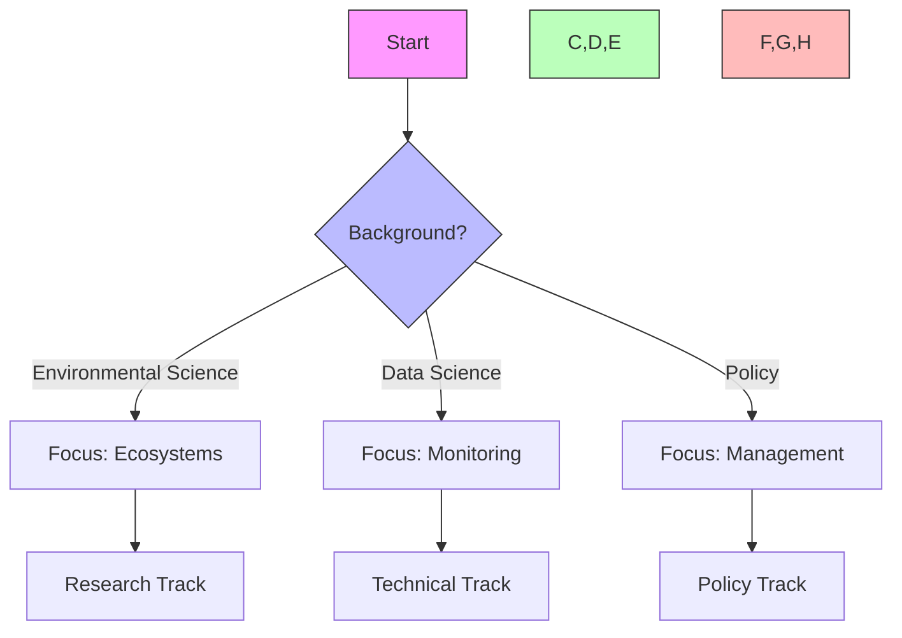

## Path Interconnections

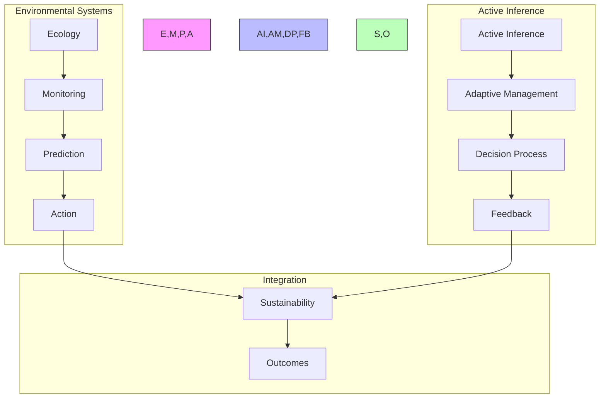

### System Architecture

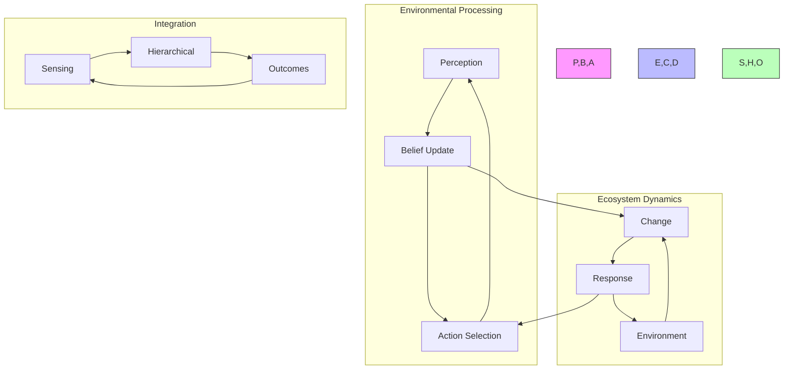

## Overview

This learning path explores the application of active inference principles to environmental systems, management, and sustainability challenges. It integrates ecological science, systems thinking, and predictive processing to develop innovative approaches to environmental monitoring, modeling, and management. The path addresses how active inference can enhance our understanding of complex environmental systems and inform more effective and adaptive strategies for ecosystem stewardship and sustainability.

## Prerequisites

### 1. Environmental Science Foundations (3 weeks)

- Ecological Systems

  - Ecosystem structure and function

  - Nutrient cycles and energy flow

  - Population dynamics

  - Biodiversity and ecosystem services

- Environmental Monitoring

  - Sensing technologies and methods

  - Data collection protocols

  - Baseline measurements

  - Environmental indicators

- Environmental Change

  - Climate dynamics

  - Anthropogenic impacts

  - Habitat transformation

  - Pollution and contamination

- Sustainability Frameworks

  - Sustainable development goals

  - Planetary boundaries

  - Circular economy

  - Resilience thinking

### 2. Active Inference Fundamentals (3 weeks)

- Predictive Processing

  - Hierarchical predictive models

  - Prediction error minimization

  - Precision-weighted inference

  - Bayesian belief updating

- Free Energy Principle

  - Variational free energy

  - Entropy minimization

  - Self-organization

  - Markov blankets

- Information Theory

  - Shannon information

  - Mutual information

  - Complexity and simplicity

  - Intrinsic and extrinsic value

- Systems Modeling

  - Dynamic systems theory

  - Agent-based modeling

  - Network theory

  - Complex adaptive systems

### 3. Data Science and Technology (2 weeks)

- Environmental Data Analysis

  - Statistical methods

  - Geospatial analysis

  - Time series analysis

  - Multivariate techniques

- Sensing Technologies

  - Remote sensing

  - In-situ monitoring

  - IoT environmental sensors

  - Citizen science platforms

- Modeling Tools

  - Ecological modeling software

  - Geospatial information systems

  - Bayesian statistical platforms

  - Simulation environments

## Core Learning Modules

### Module 1: Active Inference Framework for Environmental Systems (3 weeks)

#### 1.1 Environmental Perception and Sensing

- **Key Concepts**

  - Environmental perception as hierarchical inference

  - Multi-scale information processing in ecosystems

  - Precision-weighted environmental signals

  - Sensing across temporal and spatial scales

- **Learning Resources**

  - Reading: [[knowledge_base/systems/environmental_applications|Environmental Applications]]

  - Article: "Hierarchical Predictive Processing in Ecological Systems"

  - Tutorial: "Modeling Environmental Sensing Networks"

- **Exercises**

  - Design an environmental sensing network using precision principles

  - Analyze environmental data using hierarchical predictive models

  - Map information flows in an ecosystem

#### 1.2 Active Environmental Sampling

- **Key Concepts**

  - Active sampling as uncertainty reduction

  - Adaptive monitoring strategies

  - Information-seeking behavior in environmental research

  - Optimizing data collection for model improvement

- **Learning Resources**

  - Reading: [[knowledge_base/cognitive/active_inference|Active Inference]]

  - Case Study: "Adaptive Environmental Monitoring Programs"

  - Tutorial: "Designing Active Sampling Protocols"

- **Exercises**

  - Develop an active sampling strategy for an environmental parameter

  - Optimize sensor placement using information theory

  - Create an adaptive monitoring program for ecosystem change

#### 1.3 Environmental Generative Models

- **Key Concepts**

  - Ecosystem dynamics as generative models

  - Multi-scale environmental prediction

  - Bayesian approaches to environmental uncertainty

  - Model selection in ecological systems

- **Learning Resources**

  - Reading: [[knowledge_base/cognitive/generative_models|Generative Models]]

  - Article: "Generative Models in Ecosystem Science"

  - Tutorial: "Building Hierarchical Models of Environmental Systems"

- **Exercises**

  - Develop a generative model for a specific ecosystem process

  - Test competing environmental models using Bayesian methods

  - Create a multi-scale prediction system for environmental change

### Module 2: Environmental Monitoring and Management (4 weeks)

#### 2.1 Precision Environmental Monitoring

- **Key Concepts**

  - Precision-weighted environmental sensing

  - Adaptive sampling frameworks

  - Confidence-based monitoring systems

  - Early warning indicators as precision signals

- **Learning Resources**

  - Reading: [[knowledge_base/systems/environmental_monitoring|Environmental Monitoring]]

  - Article: "Precision and Uncertainty in Environmental Data"

  - Template: "Precision-Based Monitoring Protocol Design"

- **Exercises**

  - Design a precision-weighted monitoring system

  - Develop an uncertainty quantification framework for environmental data

  - Create early warning indicators based on precision changes

#### 2.2 Adaptive Resource Management

- **Key Concepts**

  - Resource management as action-oriented inference

  - Closed-loop environmental control systems

  - Policy selection as model testing

  - Feedback-driven management adaptation

- **Learning Resources**

  - Reading: [[knowledge_base/systems/ecosystem_management|Ecosystem Management]]

  - Case Study: "Adaptive Management of Natural Resources"

  - Tutorial: "Implementing Closed-Loop Resource Management"

- **Exercises**

  - Design an adaptive management protocol using active inference

  - Develop a feedback system for natural resource decisions

  - Create a policy selection framework based on model evidence

#### 2.3 Environmental Decision-Making Under Uncertainty

- **Key Concepts**

  - Decision-making as expected free energy minimization

  - Multi-objective optimization in environmental management

  - Risk assessment through Bayesian methods

  - Value of information in environmental decisions

- **Learning Resources**

  - Article: "Active Inference in Environmental Decision-Making"

  - Tutorial: "Bayesian Decision Analysis for Environmental Management"

  - Template: "Expected Free Energy Decision Framework"

- **Exercises**

  - Apply expected free energy to an environmental decision problem

  - Conduct a value of information analysis for monitoring data

  - Design a Bayesian decision support system for resource management

### Module 3: Ecosystem Modeling and Prediction (4 weeks)

#### 3.1 Hierarchical Ecosystem Models

- **Key Concepts**

  - Multi-scale modeling of ecosystem processes

  - Top-down and bottom-up constraints in ecological systems

  - Cross-scale interactions and emergence

  - Model integration across spatial and temporal scales

- **Learning Resources**

  - Article: "Hierarchical Modeling in Ecology"

  - Case Study: "Multi-Scale Forest Ecosystem Models"

  - Tutorial: "Building Hierarchical Models in Environmental Science"

- **Exercises**

  - Develop a hierarchical model of an ecosystem process

  - Implement cross-scale feedback in an ecological model

  - Design a multi-resolution approach to ecosystem prediction

#### 3.2 Dynamic Environmental Prediction

- **Key Concepts**

  - Temporal prediction in environmental systems

  - Anticipatory modeling of ecosystem changes

  - Regime shifts and tipping points

  - Scenario planning through active inference

- **Learning Resources**

  - Reading: "Predictive Processing in Environmental Systems"

  - Tutorial: "Forecasting Environmental Change"

  - Case Study: "Early Warning Systems for Ecosystem Shifts"

- **Exercises**

  - Develop a predictive model for environmental change

  - Create early warning indicators for regime shifts

  - Design scenario planning methods using active inference principles

#### 3.3 Spatial Environmental Modeling

- **Key Concepts**

  - Spatial inference in ecological systems

  - Landscape dynamics as active inference

  - Geospatial prediction and uncertainty

  - Multi-scale spatial modeling

- **Learning Resources**

  - Reading: [[knowledge_base/systems/spatial_ecology|Spatial Ecology]]

  - Article: "Spatial Active Inference in Landscape Ecology"

  - Tutorial: "Geospatial Predictive Modeling"

- **Exercises**

  - Develop a spatial predictive model for an ecological variable

  - Create uncertainty maps for environmental predictions

  - Design a multi-scale spatial analysis of ecosystem patterns

### Module 4: Sustainability and Resilience (4 weeks)

#### 4.1 Resilience Through Active Inference

- **Key Concepts**

  - Ecosystem resilience as adaptive inference

  - Resistance, recovery, and transformation

  - Resilience indicators as precision measures

  - Adaptive capacity as model flexibility

- **Learning Resources**

  - Reading: [[knowledge_base/systems/resilient_systems|Resilient Systems]]

  - Article: "Resilience Theory Through Active Inference"

  - Case Study: "Measuring and Managing Ecosystem Resilience"

- **Exercises**

  - Analyze ecosystem resilience using active inference principles

  - Develop resilience indicators based on prediction error

  - Design management strategies to enhance adaptive capacity

#### 4.2 Sustainable Systems Design

- **Key Concepts**

  - Sustainability as long-term prediction error minimization

  - Circular systems as generative models

  - Sustainable resource flows through active inference

  - Anticipatory design for environmental harmony

- **Learning Resources**

  - Reading: [[knowledge_base/systems/sustainable_systems|Sustainable Systems]]

  - Article: "Sustainability Through Predictive Processing"

  - Tutorial: "Designing Circular Systems Using Active Inference"

- **Exercises**

  - Apply active inference principles to circular economy design

  - Develop sustainability indicators based on prediction horizons

  - Create a predictive framework for long-term system viability

#### 4.3 Social-Ecological Systems Integration

- **Key Concepts**

  - Coupled human-natural systems as integrated active inference

  - Cross-domain prediction in social-ecological systems

  - Collective action as shared environmental modeling

  - Governance as precision management

- **Learning Resources**

  - Reading: [[knowledge_base/systems/social_ecological_systems|Social-Ecological Systems]]

  - Article: "Active Inference in Human-Nature Interactions"

  - Case Study: "Collaborative Environmental Management"

- **Exercises**

  - Model a social-ecological system using active inference

  - Design governance structures based on precision principles

  - Develop collaborative environmental decision frameworks

### Module 5: Climate Change and Complex Environmental Challenges (3 weeks)

#### 5.1 Climate Modeling Through Active Inference

- **Key Concepts**

  - Climate systems as hierarchical generative models

  - Multi-scale climate prediction

  - Uncertainty quantification in climate science

  - Downscaling through precision-weighted inference

- **Learning Resources**

  - Article: "Climate Science Through the Lens of Active Inference"

  - Case Study: "Uncertainty in Climate Predictions"

  - Tutorial: "Hierarchical Climate Modeling"

- **Exercises**

  - Apply active inference to climate data analysis

  - Develop uncertainty estimates for climate predictions

  - Create a multi-scale approach to regional climate modeling

#### 5.2 Adaptation and Mitigation Strategies

- **Key Concepts**

  - Climate adaptation as model revision

  - Mitigation as action-oriented environmental inference

  - Policy selection through expected free energy

  - Robust decision-making under deep uncertainty

- **Learning Resources**

  - Article: "Active Inference Approaches to Climate Adaptation"

  - Case Study: "Climate Mitigation Policy Evaluation"

  - Template: "Climate Adaptation Planning Framework"

- **Exercises**

  - Design a climate adaptation strategy using active inference

  - Evaluate mitigation policies through expected free energy

  - Develop robust decision methods for deep climate uncertainty

#### 5.3 Biodiversity Conservation

- **Key Concepts**

  - Biodiversity as informational richness

  - Conservation planning through predictive modeling

  - Species interactions as mutual prediction

  - Protected area design through information theory

- **Learning Resources**

  - Article: "Biodiversity Conservation Through Active Inference"

  - Case Study: "Predictive Models in Conservation Planning"

  - Tutorial: "Information-Theoretic Approaches to Biodiversity"

- **Exercises**

  - Apply information theory to biodiversity assessment

  - Design conservation plans using predictive models

  - Develop monitoring systems for biodiversity management

## Advanced Topics

### 1. Environmental Complexity Science

- **Key Concepts**

  - Complex adaptive systems in the environment

  - Self-organization and emergence in ecosystems

  - Critical transitions and early warning signals

  - Environmental network theory

- **Learning Resources**

  - Reading: [[knowledge_base/systems/complex_systems|Complex Systems]]

  - Article: "Complex Systems Approaches to Environmental Challenges"

  - Tutorial: "Analyzing Environmental Complexity"

- **Exercises**

  - Analyze critical transitions in environmental data

  - Model self-organizing environmental processes

  - Apply network theory to ecosystem interactions

### 2. Precision Agriculture and Forestry

- **Key Concepts**

  - Site-specific management through active inference

  - Precision resource application

  - Environmental monitoring for agricultural systems

  - Adaptive forest management

- **Learning Resources**

  - Article: "Precision Agriculture Through Active Inference"

  - Case Study: "Data-Driven Forestry Management"

  - Tutorial: "Implementing Precision Resource Management"

- **Exercises**

  - Design a precision agriculture system using active inference

  - Develop adaptive management protocols for forestry

  - Create sensor networks for precision resource management

### 3. Environmental AI and Machine Learning

- **Key Concepts**

  - Deep learning for environmental prediction

  - Reinforcement learning in resource management

  - Computer vision for environmental monitoring

  - Hybrid AI-physical models of ecosystems

- **Learning Resources**

  - Article: "AI Applications in Environmental Science"

  - Tutorial: "Machine Learning for Ecological Forecasting"

  - Case Study: "AI-Enabled Conservation Programs"

- **Exercises**

  - Apply deep learning to environmental image analysis

  - Develop reinforcement learning for resource management

  - Create hybrid models combining physics and machine learning

## Implementation Projects

### Project 1: Environmental Monitoring System

**Objective**: Design and implement an active inference-based environmental monitoring system.

**Requirements**:

- Create a hierarchical monitoring strategy

- Develop adaptive sampling protocols

- Implement real-time data analysis methods

- Design visualization and decision support tools

- Include uncertainty quantification

- Develop response triggers based on precision changes

**Evaluation Criteria**:

- Theoretical alignment with active inference

- Practical implementability

- Data quality and uncertainty handling

- Cost-effectiveness and resource efficiency

- Integration with existing systems

- Adaptability to changing conditions

### Project 2: Ecosystem Management Plan

**Objective**: Develop a comprehensive management plan for an ecosystem using active inference principles.

**Requirements**:

- Create ecosystem models at multiple scales

- Develop adaptive management protocols

- Design monitoring and feedback systems

- Include stakeholder engagement mechanisms

- Address uncertainty and knowledge gaps

- Create learning mechanisms for plan improvement

**Evaluation Criteria**:

- Integration of active inference principles

- Scientific rigor and ecological validity

- Practical feasibility for managers

- Stakeholder inclusivity

- Adaptability to new information

- Attention to multiple values and objectives

### Project 3: Climate Adaptation System

**Objective**: Design a climate adaptation system for a region or sector using active inference.

**Requirements**:

- Develop downscaled climate predictions

- Create vulnerability and risk assessments

- Design adaptive response strategies

- Implement monitoring and early warning systems

- Include governance and decision-making structures

- Address equity and justice considerations

**Evaluation Criteria**:

- Scientific foundation and evidence base

- Integration of active inference concepts

- Practical implementability

- Robustness to various climate scenarios

- Fairness and equity considerations

- Cost-effectiveness and resource efficiency

## Assessment

### Knowledge Assessment

- **Written Examination**: Tests understanding of active inference principles in environmental contexts

- **Case Analysis**: Evaluate environmental challenges using active inference framework

- **Research Review**: Critically analyze environmental research through predictive processing lens

### Skills Assessment

- **Modeling Exercise**: Develop an environmental model using active inference principles

- **Management Plan**: Create a resource management strategy using active inference approaches

- **Data Analysis**: Apply active inference methods to environmental datasets

### Project Assessment

Evaluation of one of the implementation projects based on:

- Theoretical foundation

- Methodological rigor

- Practical applicability

- Innovation and creativity

- Sustainability and long-term viability

- Communication and documentation

## References and Resources

### Books

1. Haber, W. (2020). "Ecosystem Services and Active Inference: Integrating Perspectives."

1. Clark, A. (2016). "Surfing Uncertainty: Prediction, Action, and the Embodied Mind."

1. Levin, S. A. (2005). "Self-organization and the Emergence of Complexity in Ecological Systems."

1. Walker, B., & Salt, D. (2012). "Resilience Thinking: Sustaining Ecosystems and People in a Changing World."

1. Chapin, F. S., Kofinas, G. P., & Folke, C. (Eds.). (2009). "Principles of Ecosystem Stewardship: Resilience-Based Natural Resource Management in a Changing World."

### Journal Articles

1. Constant, A., et al. (2019). "A Variational Approach to Niche Construction."

1. Ramstead, M. J., Badcock, P. B., & Friston, K. J. (2018). "Answering Schrödinger's Question: A Free-Energy Formulation."

1. Palmer, P. I., & Smith, M. J. (2014). "Earth Systems Modeling 2.0: A Blueprint for Models That Learn From Observations and Targeted High-Resolution Simulations."

1. Carpenter, S. R., et al. (2009). "Science for Managing Ecosystem Services: Beyond the Millennium Ecosystem Assessment."

1. Folke, C., et al. (2016). "Social-Ecological Resilience and Biosphere-Based Sustainability Science."

### Online Resources

1. [[knowledge_base/systems/environmental_applications|Environmental Applications Knowledge Base]]

1. [[knowledge_base/systems/ecosystem_management|Ecosystem Management Knowledge Base]]

1. Active Inference Institute Environmental Research Group

1. Environmental Prediction and Information Theory Research Network

1. Ecological Forecasting Initiative Resources

### Communities and Forums

1. Active Inference Environmental Sciences Network

1. Ecological Modeling and Prediction Community

1. Environmental Data Science Alliance

1. Resilience Alliance Knowledge Network

1. Sustainability Transitions Research Network

## Next Steps

### Continued Learning

- **Research Track**: Pursue research in environmental active inference

- **Application Track**: Focus on implementing active inference in environmental management

- **Policy Track**: Explore environmental policy through active inference

### Related Learning Paths

- [[active_inference_ecological_learning_path|Active Inference in Ecology]]

- [[active_inference_social_systems_learning_path|Active Inference in Social Systems]]

- [[active_inference_cognitive_systems_integration_path|Active Inference Cognitive Systems Integration]]

### Certification Path

1. **Foundation Certificate**: Environmental Applications of Active Inference

1. **Practitioner Certificate**: Environmental Modeling and Management Through Active Inference

1. **Expert Certificate**: Advanced Environmental Systems Analysis and Design

## Integration Strategies

### Development Approaches

- Theory-Practice Integration

  - Environmental science

  - Active inference

  - Systems modeling

- Cross-Domain Development

  - Ecosystem monitoring

  - Data analysis

  - Policy implementation

- Research Integration

  - Literature synthesis

  - Field studies

  - Impact assessment

### Research Framework

```mermaid

mindmap

    root((Environmental

    Research))

        Theory

            Active Inference

                Monitoring

                Management

            Ecology

                Systems

                Dynamics

        Methods

            Empirical

                Field Studies

                Data Collection

            Computational

                Modeling

                Analysis

        Applications

            Management

                Resources

                Conservation

            Policy

                Planning

                Assessment

```

### Development Lifecycle

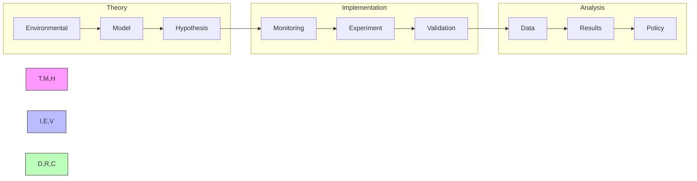

### Environmental Management Framework

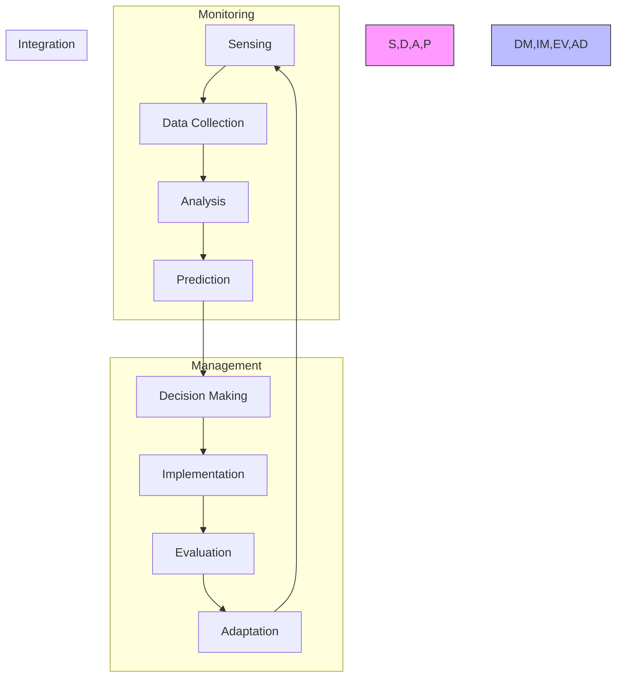

## Assessment Framework

### Continuous Assessment

Weekly checkpoints assess progress in:

- Environmental modeling (80% pass)

- Data analysis (75% pass)

- Systems integration (85% pass)

- Policy development (80% pass)

- Research methods (85% pass)

### Knowledge Checkpoints

1. **Foundation Checkpoint**

   - Format: Written + Practical

   - Duration: 4 hours

   - Topics: Environmental science, active inference basics

   - Pass: 75%

1. **Advanced Integration**

   - Format: Project-based

   - Duration: 1 week

   - Topics: System modeling, data analysis

   - Pass: 80%

1. **Final Assessment**

   - Format: Research project

   - Duration: 4 weeks

   - Topics: Complete system implementation

   - Pass: 85%

### Project Portfolio

- Environmental monitoring system

- Ecosystem modeling project

- Policy impact assessment

- Sustainability analysis

- Capstone: Integrated environmental management system

### Success Criteria

```mermaid

mindmap

    root((Success

    Metrics))

        Technical

            Modeling

            Analysis

            Integration

        Research

            Methods

            Publications

            Impact

        Professional

            Projects

            Communication

            Leadership

```

## Career Development

### Industry Alignment

1. **Research Roles**

   - Environmental Data Scientist

   - Ecosystem Modeler

   - Research Scientist

   - Policy Analyst

1. **Technical Roles**

   - Environmental Systems Engineer

   - Sustainability Consultant

   - Environmental Technology Specialist

1. **Management Roles**

   - Environmental Program Manager

   - Sustainability Director

   - Research Program Lead

### Career Progression

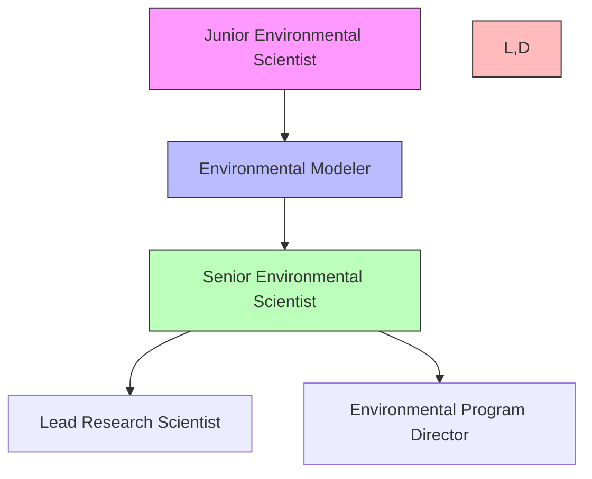

### Professional Network

- Research collaborations

- Industry partnerships

- Policy networks

- Academic institutions

- Environmental organizations

### Certification Path

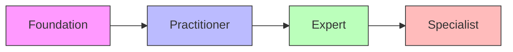

## Support Resources

### Research Support

```mermaid

mindmap

    root((Research

    Resources))

        Literature

            Journals

            Publications

            Case Studies

        Data

            Environmental

            Climate

            Ecological

        Tools

            Analysis

            Modeling

            Visualization

```

### Technical Support

- Environmental modeling tools

- Data analysis platforms

- Monitoring systems

- Documentation resources

- Development environments

### Learning Support

- Mentorship program

- Research groups

- Online forums

- Expert consultations

- Workshop sessions

## Version Control and Updates

### Version History

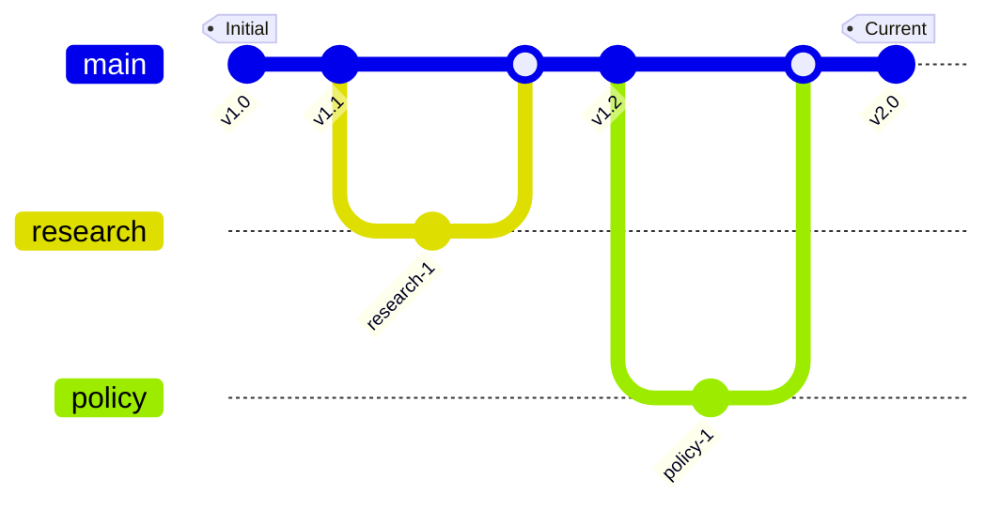

### Change Management

- v1.0: Initial framework

- v1.1: Enhanced research methods

- v1.2: Updated policy integration

- v2.0: Complete system revision

### Quality Metrics

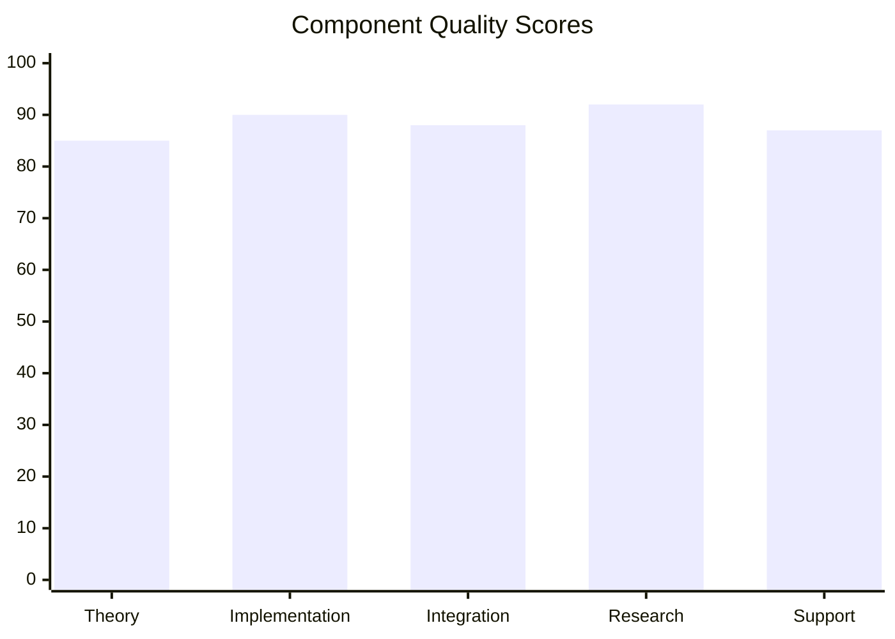

## Learning Analytics

### Progress Tracking

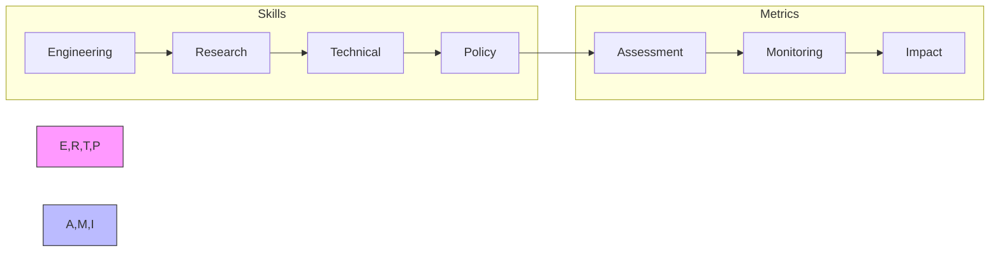

### Development Analytics

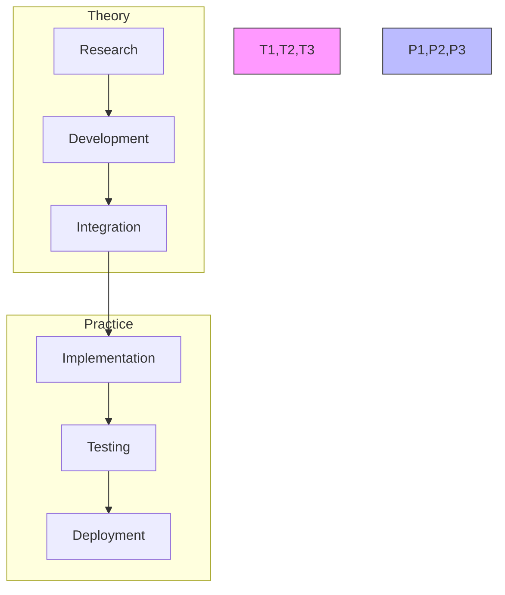

## Final Notes

### Success Stories

- Research impact

- Technical achievements

- Professional growth

- Community contributions

### Additional Resources

- Extended reading

- Research directions

- Community resources

### Support Contacts

- Research support

- Technical assistance

- Industry connections

