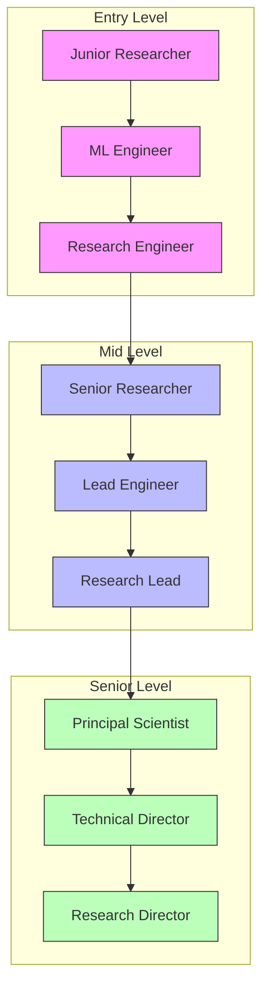
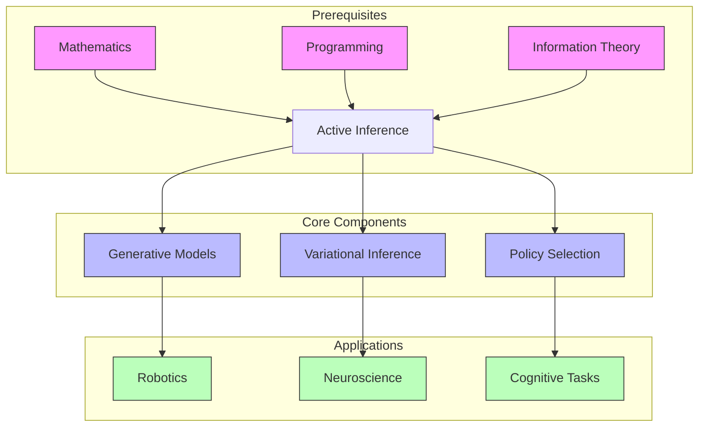
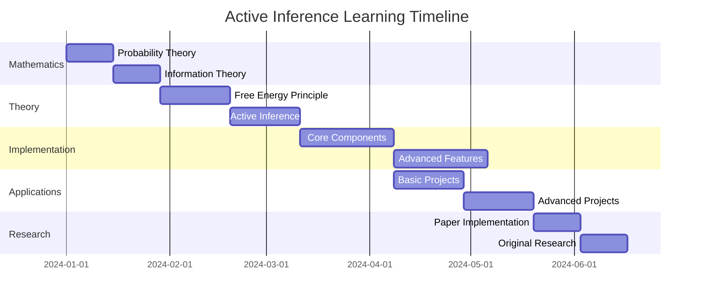
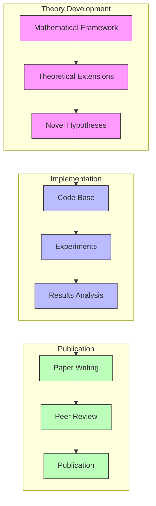
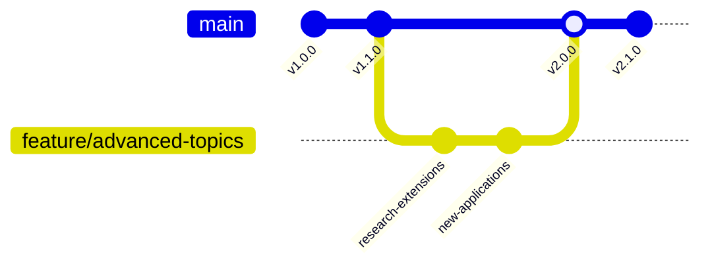
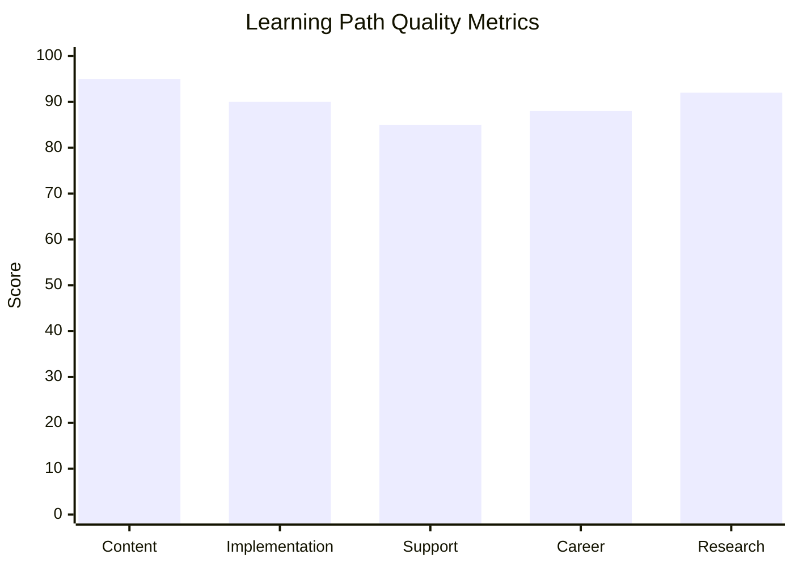
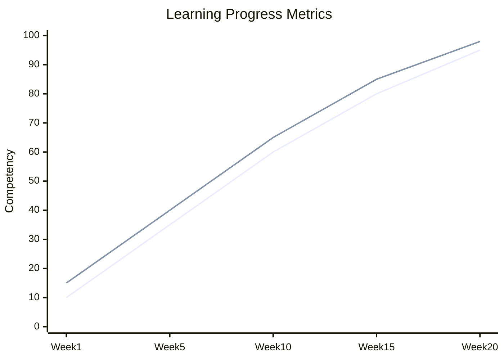

---

title: Active Inference Learning Path

type: learning_path

status: stable

created: 2024-03-15

modified: 2024-03-15

modified: 2025-08-08

version: 2.1.0

complexity: advanced

processing_priority: 1

authors:

  - name: Cognitive Systems Team

    role: Research & Development

difficulty_level: advanced

estimated_hours: 480

completion_time: "20 weeks"

certification_track: true

tags:

  - active-inference

  - free-energy-principle

  - cognitive-science

  - machine-learning

  - computational-neuroscience

  - artificial-intelligence

semantic_relations:

  - type: foundation_for

    links:

      - [[predictive_processing_learning_path]]

      - [[cognitive_architecture_learning_path]]

  - type: implements

    links:

      - [[free_energy_principle_learning_path]]

      - [[variational_inference_learning_path]]

  - type: relates

    links:

      - [[dynamical_systems_learning_path]]

      - [[stochastic_processes_learning_path]]

      - [[information_theory_learning_path]]

---

# Active Inference Learning Path

## Quick Start

- Read Friston (2010), Parr et al. (2022), and Smith et al. (2022) tutorial (see index hub)

- Implement a minimal discrete-state agent; verify inference and policy selection on a toy task

- Compare EFE components under different preferences; reflect on precision effects

## External Web Resources

- [Centralized resources hub](./index.md#centralized-external-web-resources)

- [`pymdp` tutorial notebook](https://pymdp-rtd.readthedocs.io/en/master/notebooks/active_inference_from_scratch.html)

## Quick Reference

- **Difficulty**: Advanced

- **Time Commitment**: 20-25 hours/week for 20 weeks

- **Prerequisites Score**: 8/10 (strong mathematics and programming foundation)

- **Industry Relevance**: High

- **Hands-on Component**: 60%

- **Theory Component**: 40%

## Executive Summary

### Purpose and Scope

This learning path provides a comprehensive journey through Active Inference, from mathematical foundations to cutting-edge applications. It covers theoretical principles, practical implementations, and real-world applications in cognitive science, robotics, and AI systems. The path emphasizes both theoretical understanding and practical implementation skills.

### Target Audience

- **Primary**: Research scientists and advanced engineers in AI/ML

- **Secondary**: PhD students and postdocs in cognitive science/neuroscience

- **Career Stage**: Advanced (3+ years experience in related fields)

### Learning Outcomes

By completing this path, learners will be able to:

1. Master the mathematical foundations of Active Inference and the Free Energy Principle

1. Implement sophisticated Active Inference agents for complex tasks

1. Apply Active Inference to real-world problems in robotics, neuroscience, and AI

1. Contribute to cutting-edge research in the field

### Industry Applications

- Robotics: Autonomous systems, human-robot interaction

- Healthcare: Medical diagnosis, brain-machine interfaces

- AI Systems: Advanced decision-making, adaptive learning

- Research: Computational neuroscience, cognitive modeling

## Repo-integrated labs (TDD)

- Baseline discrete agent and safety checks

  - Run baseline simulation

    ```bash
    python3 /home/trim/Documents/GitHub/cognitive/Things/Generic_POMDP/generic_pomdp.py
    ```

  - Inspect plots under `Things/Generic_POMDP/Output/plots`

  - Extend with a simple preference prior; add an assertion to detect unsafe policy drift

- Earth-systems scaffold stress test (BioFirm)

  - Execute dispatcher with provided configs

    ```bash
    python3 /home/trim/Documents/GitHub/cognitive/Things/BioFirm/active_inference/dispatcher.py
    ```

  - Verify logs/visualizations under `Things/BioFirm/output` and `logs`

- Adversarial exploration with swarm agents

  - Launch ant colony demo

    ```bash
    python3 /home/trim/Documents/GitHub/cognitive/Things/Ant_Colony/ant_colony/main.py --config /home/trim/Documents/GitHub/cognitive/Things/Ant_Colony/config/colony_config.yaml
    ```

  - Instrument expected free energy components; confirm conservative exploration in tests

- Quick tests

  ```bash
  python3 -m pytest /home/trim/Documents/GitHub/cognitive/tests/visualization/test_continuous_generic.py -q
  python3 -m pytest /home/trim/Documents/GitHub/cognitive/Things/Generic_Thing/tests -q
  ```

### Cross-repo anchors

- `knowledge_base/mathematics/expected_free_energy.md` · `knowledge_base/mathematics/vfe_components.md` · `knowledge_base/cognitive/active_inference.md`

- `tools/src/visualization/matrix_plots.py` · `tools/src/utils/matrix_utils.py`

## Prerequisites

### Required Knowledge

#### Core Competencies

- [[mathematics_foundations|Mathematics]] - Proficiency Level: 9/10

  - Key concepts needed:

    - Advanced calculus

    - Linear algebra

    - Probability theory

    - Information theory

  - Recommended preparation:

    - Complete mathematics prerequisite path

    - Review key papers in variational inference

- [[programming_skills|Programming]] - Proficiency Level: 8/10

  - Python expertise

  - Scientific computing

  - Machine learning frameworks

  - Software engineering practices

#### Technical Requirements

- Software:

  - Python 3.8+

  - PyTorch/JAX

  - Git

  - Scientific Python stack

- Hardware:

  - GPU-enabled workstation

  - 16GB+ RAM

  - CUDA support

- Access:

  - Research paper repositories

  - Code repositories

  - Computing clusters (optional)

## Core Learning Path

### 1. Theoretical Foundations (4 weeks)

#### Week 1-2: Free Energy Principle

- Variational Free Energy

  ```python

  def compute_free_energy(q_dist, p_dist, obs):

      """Compute variational free energy."""

      expected_log_likelihood = compute_expected_ll(q_dist, p_dist, obs)

      kl_divergence = compute_kl(q_dist, p_dist)

      return -expected_log_likelihood + kl_divergence

  ```

- Markov Blankets

- Self-organization

- Information Geometry

#### Week 3-4: Active Inference

- Expected Free Energy

  ```python

  def compute_expected_free_energy(policy, model):

      """Compute expected free energy for policy."""

      ambiguity = compute_ambiguity(policy, model)

      risk = compute_risk(policy, model)

      return ambiguity + risk

  ```

- Policy Selection

- Precision Engineering

- Message Passing

### 2. Implementation (6 weeks)

#### Week 1-2: Core Components

- Generative Models

  ```python

  class GenerativeModel:

      def __init__(self,

                  hidden_dims: List[int],

                  obs_dim: int):

          """Initialize generative model."""

          self.hidden_states = [

              torch.zeros(dim) for dim in hidden_dims

          ]

          self.obs_model = ObservationModel(hidden_dims[-1], obs_dim)

          self.trans_model = TransitionModel(hidden_dims)

      def generate(self, policy: torch.Tensor) -> torch.Tensor:

          """Generate observations under policy."""

          states = self.propagate_states(policy)

          return self.obs_model(states)

  ```

- Variational Inference

- Policy Networks

- Precision Parameters

#### Week 3-4: Agent Implementation

- Perception

  ```python

  class ActiveInferenceAgent:

      def __init__(self,

                  model: GenerativeModel,

                  learning_rate: float = 0.01):

          """Initialize active inference agent."""

          self.model = model

          self.lr = learning_rate

          self.beliefs = initialize_beliefs()

      def infer_states(self, obs: torch.Tensor) -> torch.Tensor:

          """Perform state inference."""

          for _ in range(self.inference_steps):

              pred_error = self.compute_prediction_error(obs)

              self.update_beliefs(pred_error)

          return self.beliefs

  ```

- Action Selection

- Learning

- Memory

#### Week 5-6: Advanced Features

- Hierarchical Models

- Active Learning

- Meta-learning

- Adaptive Behavior

### 3. Applications (4 weeks)

#### Week 1-2: Cognitive Tasks

- Perception Tasks

  ```python

  class PerceptionTask:

      def __init__(self,

                  stimuli: torch.Tensor,

                  categories: torch.Tensor):

          """Initialize perception task."""

          self.stimuli = stimuli

          self.categories = categories

      def evaluate(self, agent: ActiveInferenceAgent) -> Dict[str, float]:

          """Evaluate agent performance."""

          predictions = []

          for stimulus in self.stimuli:

              belief = agent.infer_states(stimulus)

              pred = agent.model.predict_category(belief)

              predictions.append(pred)

          return compute_metrics(predictions, self.categories)

  ```

- Decision Making

- Motor Control

- Learning Tasks

#### Week 3-4: Real-world Applications

- Robotics

- Neural Data Analysis

- Clinical Applications

- Social Systems

### 4. Advanced Topics (4 weeks)

#### Week 1-2: Theoretical Extensions

- Non-equilibrium Physics

- Information Geometry

- Quantum Extensions

- Continuous Time

#### Week 3-4: Research Frontiers

- Mixed Models

- Group Behavior

- Development

- Consciousness

## Projects

### Beginner Projects

1. **Simple Perception**

   - Binary classification

   - Feature extraction

   - Belief updating

   - Performance analysis

1. **Basic Control**

   - Pendulum balance

   - Target reaching

   - Simple navigation

   - Error correction

### Intermediate Projects

1. **Cognitive Tasks**

   - Visual recognition

   - Decision making

   - Sequence learning

   - Working memory

1. **Robotic Control**

   - Arm control

   - Object manipulation

   - Path planning

   - Multi-joint coordination

### Advanced Projects

1. **Complex Cognition**

   - Meta-learning

   - Hierarchical control

   - Active exploration

   - Social interaction

1. **Real-world Applications**

   - Medical diagnosis

   - Brain-machine interfaces

   - Autonomous systems

   - Clinical interventions

## Resources

### Reading Materials

1. **Core Papers**

   - Original formulations

   - Key extensions

   - Review papers

   - Applications

1. **Books**

   - Mathematical foundations

   - Cognitive science

   - Machine learning

   - Neuroscience

### Software Tools

1. **Libraries**

   - PyAI (Active Inference)

   - Torch/JAX implementations

   - Simulation environments

   - Analysis tools

1. **Environments**

   - OpenAI Gym

   - MuJoCo

   - Custom environments

   - Real-world interfaces

## Assessment Framework

### Continuous Assessment

#### Weekly Quizzes

- Mathematical Foundations Quiz - Passing Score: 85%

- Free Energy Principle Quiz - Passing Score: 80%

- Implementation Concepts Quiz - Passing Score: 85%

- Applications Understanding Quiz - Passing Score: 80%

#### Progress Tracking

- Daily Implementation Log

- Weekly Theory Summary

- Bi-weekly Code Reviews

- Monthly Research Paper Analysis

### Knowledge Checkpoints

#### Foundation Checkpoint (Week 4)

- Format: Written + Programming Test

- Duration: 4 hours

- Topics Covered:

  - Mathematical prerequisites

  - Basic Active Inference concepts

  - Initial implementation skills

- Minimum Pass Requirements:

  - Theory: 85% correct

  - Implementation: Working basic agent

#### Intermediate Checkpoint (Week 12)

- Format: Project + Presentation

- Duration: 1 week

- Topics Covered:

  - Advanced theory

  - Complex implementations

  - Real-world applications

- Requirements:

  - Working complex agent

  - Documentation

  - Performance analysis

#### Advanced Checkpoint (Week 18)

- Format: Research Project

- Duration: 2 weeks

- Topics Covered:

  - Cutting-edge applications

  - Novel implementations

  - Research contributions

- Deliverables:

  - Original research implementation

  - Technical paper

  - Presentation

### Projects Portfolio

#### Mini-Projects

1. Basic Active Inference Agent

   - Scope: Simple perception task

   - Deliverables:

     - Working implementation

     - Documentation

     - Performance analysis

   - Evaluation Criteria:

     - Code quality: 30%

     - Performance: 40%

     - Documentation: 30%

1. Hierarchical Agent Implementation

   - Scope: Multi-level inference

   - Deliverables:

     - Implementation

     - Validation tests

     - Analysis report

   - Evaluation Criteria:

     - Architecture: 35%

     - Performance: 35%

     - Analysis: 30%

#### Final Project

- Description: Novel Active Inference Application

- Requirements:

  - Technical:

    - Original implementation

    - Performance optimization

    - Scalability considerations

  - Documentation:

    - Technical documentation

    - Research paper

    - User guide

  - Presentation:

    - Technical presentation

    - Code walkthrough

    - Live demo

- Evaluation Matrix:

  - Technical Implementation: 40%

  - Research Quality: 30%

  - Documentation: 20%

  - Presentation: 10%

### Success Criteria

#### Technical Competency

- Mathematics: Advanced proficiency (9/10)

- Programming: Expert level (8/10)

- Research: Publication-ready work

- Implementation: Production-quality code

#### Project Delivery

- Quality Standards:

  - Code coverage > 90%

  - Documentation completeness

  - Performance benchmarks met

- Performance Metrics:

  - Algorithm efficiency

  - Model accuracy

  - System scalability

#### Professional Development

- Research paper authorship

- Open-source contributions

- Conference presentations

- Community engagement

## Career Development

### Industry Alignment

#### Job Roles

- Research Scientist

  - Focus on novel algorithms

  - Publication track

  - Team leadership

- ML Engineer

  - Implementation expertise

  - System optimization

  - Production deployment

- Technical Lead

  - Architecture design

  - Team management

  - Strategic planning

#### Certification Preparation

- Deep Learning Specialization

  - Neural network foundations

  - Advanced architectures

- Probabilistic Modeling

  - Bayesian methods

  - Variational inference

- Research Methods

  - Experimental design

  - Statistical analysis

### Professional Network

#### Mentorship

- Finding Mentors:

  - Academic advisors

  - Industry experts

  - Research leaders

- Being a Mentor:

  - Student supervision

  - Code reviews

  - Project guidance

- Peer Learning Groups:

  - Reading groups

  - Coding sessions

  - Research discussions

#### Portfolio Building

- Project Showcase:

  - GitHub repositories

  - Research papers

  - Blog posts

- Documentation:

  - Technical writing

  - API documentation

  - Tutorial creation

- Presentation Skills:

  - Conference talks

  - Technical workshops

  - Research presentations

### Competency Development

```mermaid

mindmap

    root((Active Inference

    Expert))

        Mathematical Foundation

            Probability Theory

                Bayesian Inference

                Variational Methods

            Information Theory

                Free Energy

                KL Divergence

            Optimization

                Gradient Descent

                Optimal Control

        Implementation Skills

            Programming

                Python Expertise

                ML Frameworks

            Software Engineering

                Architecture

                Best Practices

            System Design

                Scalability

                Performance

        Research Abilities

            Paper Writing

                Technical Writing

                Scientific Method

            Experimentation

                Design

                Analysis

            Innovation

                Novel Methods

                Applications

        Domain Expertise

            Neuroscience

                Brain Theory

                Neural Data

            Robotics

                Control Theory

                Automation

            AI Systems

                Architecture

                Integration

```

### Career Progression



## Next Steps

### Advanced Paths

1. [[predictive_processing_learning_path|Predictive Processing]]

1. [[cognitive_architecture_learning_path|Cognitive Architecture]]

1. [[free_energy_principle_learning_path|Free Energy Principle]]

### Research Directions

1. [[research_guides/active_inference|Active Inference Research]]

1. [[research_guides/cognitive_science|Cognitive Science Research]]

1. [[research_guides/machine_learning|Machine Learning Research]]

### Path Interconnections

#### Skill Bridges



#### Learning Progression Timeline



## Integration Strategies

### Combined Learning Approaches

- Theory-Practice Integration

  - Mathematical foundations with immediate implementation

  - Real-world case studies with theoretical analysis

  - Research papers with reproduction exercises

- Cross-Domain Applications

  - Neuroscience experiments

  - Robotics implementations

  - AI system development

- Collaborative Learning

  - Peer programming sessions

  - Research group meetings

  - Industry collaborations

### Resource Optimization

- Shared Development Environment

  - Standard Docker containers

  - Pre-configured Jupyter environments

  - Version-controlled dependencies

- Documentation Standards

  - API documentation templates

  - Research paper templates

  - Code documentation guidelines

- Assessment Tools

  - Automated testing frameworks

  - Performance benchmarking tools

  - Code quality metrics

### Research Integration



## Support Resources

### Technical Support

- Online Resources

  - Documentation Hub

  - Code Repository

  - Issue Tracker

- Development Tools

  - IDE configurations

  - Debug tools

  - Profiling tools

- Community Support

  - Stack Overflow tags

  - GitHub discussions

  - Research forums

### Learning Support

- Study Materials

  - Lecture recordings

  - Tutorial notebooks

  - Example implementations

- Mentorship Program

  - Weekly office hours

  - Code review sessions

  - Research guidance

- Peer Learning

  - Study groups

  - Paper reading clubs

  - Coding workshops

### Research Support

```mermaid

mindmap

    root((Research

    Support))

        Literature

            Paper Database

                Organized by Topic

                Key Findings

                Implementation Notes

            Review Papers

                Summaries

                Critical Analysis

            Latest Research

                arXiv Updates

                Conference Papers

        Tools

            Code Libraries

                Implementation

                Testing

                Documentation

            Computing Resources

                GPU Clusters

                Cloud Services

            Analysis Tools

                Data Processing

                Visualization

        Community

            Research Groups

                Weekly Meetings

                Collaborations

            Conferences

                Presentations

                Networking

            Online Forums

                Q&A

                Discussions

```

## Version Control and Updates

### Version History



### Change Management

#### Major Updates

- v2.0.0 (Current)

  - Added advanced research topics

  - Expanded application domains

  - Enhanced assessment framework

  - Updated career paths

- v1.1.0

  - Improved code examples

  - Added case studies

  - Updated resources

- v1.0.0

  - Initial release

  - Core curriculum

  - Basic implementations

#### Planned Improvements

- Enhanced visualization tools

- Additional case studies

- Advanced research topics

- Industry applications

### Quality Metrics



## Community Engagement

### Contribution Opportunities

- Code Contributions

  - Core implementations

  - Example applications

  - Testing frameworks

- Documentation

  - Tutorials

  - Case studies

  - API documentation

- Research

  - Paper reviews

  - Experiment reproduction

  - Novel applications

### Community Resources

```mermaid

mindmap

    root((Community

    Resources))

        Online

            Forums

                Technical Q&A

                Research Discussion

            Repositories

                Code

                Documentation

            Social Media

                Twitter Updates

                Blog Posts

        Offline

            Meetups

                Local Groups

                Workshops

            Conferences

                Presentations

                Networking

            Research Labs

                Collaborations

                Visits

```

### Feedback Channels

- Course Feedback

  - Weekly surveys

  - Project reviews

  - Exit interviews

- Content Improvement

  - Issue tracking

  - Pull requests

  - Feature requests

- Community Input

  - Discussion forums

  - Research meetings

  - Industry feedback

## Learning Analytics

### Learning Progress Tracking



### Skills Performance Metrics

- Technical Skills

  - Code quality scores

  - Implementation success

  - Performance optimization

- Research Abilities

  - Paper understanding

  - Novel contributions

  - Experimental design

- Professional Growth

  - Project management

  - Communication skills

  - Leadership development

## Final Notes

### Success Stories

- Research Publications

- Industry Applications

- Career Transitions

- Novel Contributions

### Additional Resources

- Extended Reading List

- Advanced Topics

- Research Directions

- Industry Connections

### Contact Information

- Course Coordinators

- Technical Support

- Research Advisors

- Community Leaders

