# Active Inference in Myrmecology Learning Path

## Quick Reference
- **Difficulty**: Advanced
- **Time Commitment**: 25-30 hours/week for 20 weeks
- **Prerequisites Score**: 8/10 (biology and computational expertise)
- **Industry Relevance**: High (Research, Ecology, Bio-inspired Computing)
- **Hands-on Component**: 50%
- **Theory Component**: 50%

## Executive Summary

### Purpose and Scope
This specialized learning path integrates Active Inference principles with myrmecology (the study of ants), providing a comprehensive framework for understanding multi-scale cognitive processes in ant colonies. It bridges theoretical biology with computational modeling, focusing on collective behavior and colony-level intelligence.

### Target Audience
- **Primary**: Myrmecologists and computational biologists
- **Secondary**: AI researchers and complex systems scientists
- **Career Stage**: Advanced researchers (3+ years experience)

### Learning Outcomes
By completing this path, learners will be able to:
1. Develop sophisticated models of ant colony behavior using Active Inference
2. Implement multi-scale simulations of collective intelligence
3. Design and conduct myrmecological experiments with Active Inference frameworks
4. Apply models to understand natural and artificial collective systems

### Industry Applications
- Research: Ant behavior, collective intelligence
- Bio-inspired Computing: Swarm algorithms, distributed systems
- Ecology: Colony dynamics, species interactions
- Conservation: Population monitoring, habitat management

## Path Selection Guide
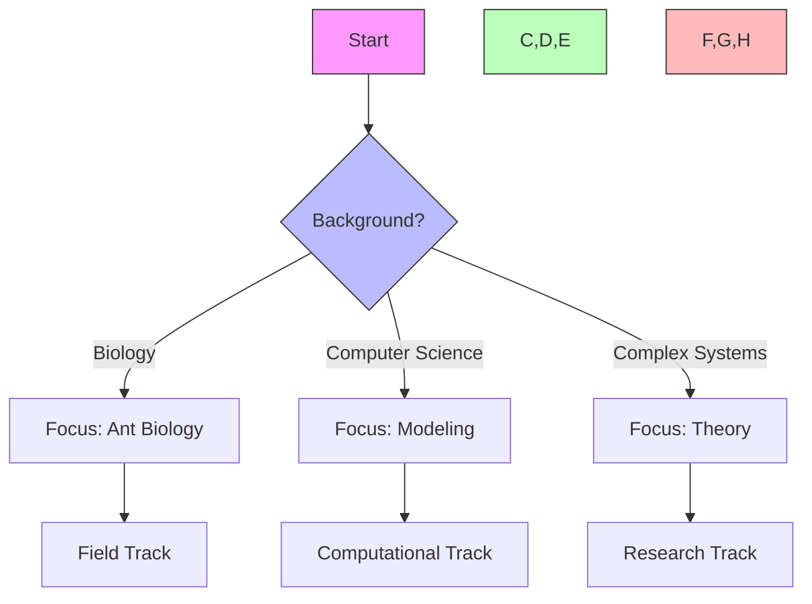

## Path Interconnections
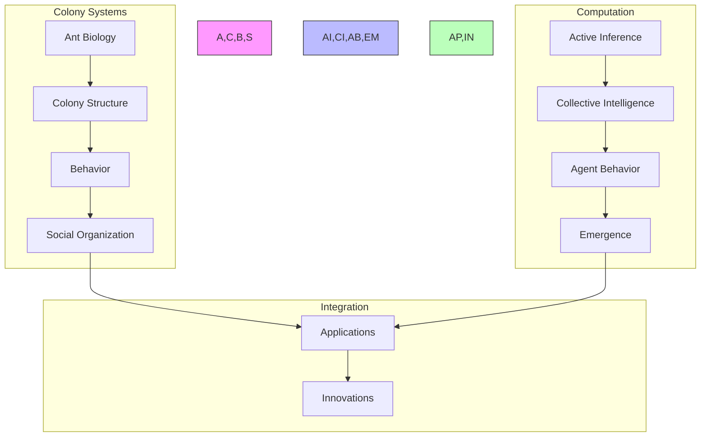

### System Architecture
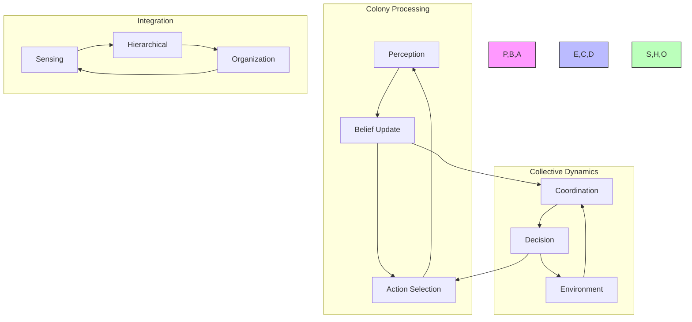

## Prerequisites

### 1. Myrmecology Foundations (4 weeks)
- Ant Biology
  - Taxonomy and morphology
  - Colony structure
  - Life cycles
  - Behavior patterns

- Social Organization
  - Division of labor
  - Communication systems
  - Collective decision-making
  - Colony dynamics

- Research Methods
  - Field techniques
  - Laboratory methods
  - Data collection
  - Experimental design

- Complex Systems
  - Emergence
  - Self-organization
  - Network analysis
  - Information theory

### 2. Technical Skills (2 weeks)
- Research Tools
  - Python/R programming
  - Statistical analysis
  - Data visualization
  - Simulation frameworks

## Mathematical Foundations

### 1. Essential Mathematics
#### Calculus and Analysis
- Differential equations for population dynamics
- Partial differential equations for spatial patterns
- Variational calculus for free energy principles
- Stochastic processes in ant behavior

#### Linear Algebra
- Matrix operations for transition states
- Eigenvalue analysis for stability
- Vector spaces for behavioral mapping
- Tensor operations for multi-scale analysis

#### Information Theory
- Shannon entropy in colony communication
- Kullback-Leibler divergence
- Mutual information measures
- Fisher information metrics

#### Statistical Methods
- Bayesian inference
- Maximum entropy principles
- Markov chain Monte Carlo
- Time series analysis

### 2. Computational Frameworks
#### Simulation Tools
- Agent-based modeling platforms
- Neural network implementations
- Differential equation solvers
- Network analysis tools

#### Programming Skills
- Python for data analysis
- R for statistical modeling
- NetLogo for agent-based simulations
- Julia for high-performance computing

## Core Learning Modules

### 1. Colony-Level Active Inference (4 weeks)

#### Week 1-2: Colony State Inference
```python
class ColonyStateEstimator:
    def __init__(self,
                 n_ants: int,
                 state_dim: int):
        """Initialize colony state estimator."""
        self.ants = [AntAgent() for _ in range(n_ants)]
        self.colony_state = torch.zeros(state_dim)
        self.interaction_network = self._build_network()
        
    def estimate_state(self,
                      environmental_signals: torch.Tensor,
                      pheromone_state: torch.Tensor) -> ColonyState:
        """Estimate colony system state."""
        individual_states = [
            ant.process_signals(environmental_signals, pheromone_state)
            for ant in self.ants
        ]
        colony_state = self.aggregate_states(individual_states)
        return self.validate_state(colony_state)
```

#### Week 3-4: Collective Decision Making
```python
class ColonyDecisionMaker:
    def __init__(self,
                 action_space: ActionSpace,
                 pheromone_system: PheromoneSystem):
        """Initialize colony decision maker."""
        self.action_repertoire = ActionRepertoire(action_space)
        self.pheromone_system = pheromone_system
        self.decision_policy = CollectivePolicy()
        
    def select_actions(self,
                      colony_state: torch.Tensor,
                      objectives: torch.Tensor) -> List[AntAction]:
        """Select collective actions."""
        options = self.action_repertoire.generate_options()
        pheromone_influence = self.pheromone_system.get_state()
        return self.decision_policy.select_actions(
            options, colony_state, pheromone_influence
        )
```

### 2. Multi-scale Analysis (6 weeks)

#### Week 1-2: Individual Ant Behavior
- Sensory processing
- Movement patterns
- Task selection
- Local interactions

#### Week 3-4: Colony Organization
- Division of labor
- Nest construction
- Foraging strategies
- Territory defense

#### Week 5-6: Emergent Phenomena
- Collective decision-making
- Pattern formation
- Resource allocation
- Adaptive responses

### 3. Field Applications (4 weeks)

#### Week 1-2: Field Studies
```python
class FieldExperiment:
    def __init__(self,
                 colony_id: str,
                 measurement_tools: List[Tool]):
        """Initialize field experiment."""
        self.colony = Colony(colony_id)
        self.tools = measurement_tools
        self.data_collector = DataCollector()
        
    def run_experiment(self,
                      protocol: ExperimentProtocol) -> ExperimentData:
        """Execute field experiment."""
        baseline = self.collect_baseline_data()
        intervention = self.apply_intervention(protocol)
        response = self.measure_response()
        return self.analyze_results(baseline, intervention, response)
```

#### Week 3-4: Natural Systems
- Colony monitoring
- Population dynamics
- Species interactions
- Habitat relationships

### 4. Advanced Topics (4 weeks)

#### Week 1-2: Multi-Colony Systems
```python
class MultiColonySystem:
    def __init__(self,
                 colonies: List[Colony],
                 interaction_params: InteractionParams):
        """Initialize multi-colony system."""
        self.colonies = colonies
        self.territory_map = TerritoryMap()
        self.interaction_model = ColonyInteractions(interaction_params)
        
    def simulate_interactions(self,
                            time_steps: int) -> SystemDynamics:
        """Simulate colony interactions."""
        states = []
        for t in range(time_steps):
            colony_states = [c.get_state() for c in self.colonies]
            interactions = self.interaction_model.compute_interactions(
                colony_states, self.territory_map
            )
            self.update_colonies(interactions)
            states.append(self.get_system_state())
        return SystemDynamics(states)
```

#### Week 3-4: Advanced Applications
- Swarm robotics
- Distributed algorithms
- Bio-inspired computing
- Conservation applications

## Specialized Module: Harvester Ant Foraging Through Active Inference

### Module Overview
This specialized module explores Pogonomyrmex harvester ant foraging behavior through the lens of active inference, examining how colonies optimize resource collection while managing uncertainty and environmental risks.

### 1. Theoretical Framework (2 weeks)

#### Active Inference in Foraging Decisions
```python
class HarvesterForagingModel:
    def __init__(self,
                 colony_size: int,
                 environment_params: EnvironmentParams):
        """Initialize harvester ant foraging model."""
        self.colony = HarvesterColony(colony_size)
        self.environment = ForagingEnvironment(environment_params)
        self.pheromone_network = PheromoneNetwork()
        self.weather_model = WeatherModel()
        
    def compute_foraging_policy(self,
                              humidity: float,
                              temperature: float,
                              food_density: float) -> ForagingPolicy:
        """Compute optimal foraging policy using active inference."""
        # Generate predictions about environmental conditions
        weather_prediction = self.weather_model.predict_conditions(
            humidity, temperature
        )
        
        # Estimate food availability and risk
        food_prediction = self.environment.predict_resources(food_density)
        risk_assessment = self.assess_foraging_risks(weather_prediction)
        
        # Compute expected free energy for different policies
        policies = self.generate_foraging_policies()
        G = torch.zeros(len(policies))
        
        for i, policy in enumerate(policies):
            # Simulate outcomes under policy
            outcomes = self.simulate_foraging_outcomes(
                policy, weather_prediction, food_prediction
            )
            
            # Compute expected free energy components
            ambiguity = self.compute_sensory_ambiguity(outcomes)
            risk = self.compute_foraging_risk(outcomes, risk_assessment)
            
            # Total expected free energy
            G[i] = ambiguity + risk
            
        return policies[torch.argmin(G)]
```

#### Foraging Pattern Analysis
```python
class ForagingPatternAnalyzer:
    def __init__(self,
                 spatial_resolution: float,
                 temporal_resolution: float):
        """Initialize foraging pattern analyzer."""
        self.spatial_grid = SpatialGrid(spatial_resolution)
        self.temporal_tracker = TemporalTracker(temporal_resolution)
        self.pattern_detector = PatternDetector()
        
    def analyze_foraging_patterns(self,
                                trail_data: TrailData,
                                ant_movements: List[Movement]) -> PatternAnalysis:
        """Analyze spatiotemporal foraging patterns."""
        # Extract spatial patterns
        spatial_patterns = self.spatial_grid.analyze_trails(trail_data)
        
        # Analyze temporal dynamics
        temporal_patterns = self.temporal_tracker.analyze_movements(ant_movements)
        
        # Detect emergent patterns
        emergent_patterns = self.pattern_detector.detect_patterns(
            spatial_patterns, temporal_patterns
        )
        
        return PatternAnalysis(
            spatial=spatial_patterns,
            temporal=temporal_patterns,
            emergent=emergent_patterns
        )
```

### 2. Field Studies and Data Collection (2 weeks)

#### Observation Protocols
1. **Colony Activity Monitoring**
   - Forager counts (15-minute intervals)
   - Trail formation tracking
   - Return rates with/without food
   - Weather condition correlation

2. **Environmental Variables**
   - Temperature and humidity logging
   - Soil moisture measurements
   - Food source mapping
   - Competitor presence

3. **Individual Behavior**
   - Scout behavior tracking
   - Forager path analysis
   - Food item selection
   - Information sharing events

#### Data Collection Framework
```python
class HarvesterDataCollector:
    def __init__(self,
                 colony_id: str,
                 monitoring_equipment: MonitoringEquipment):
        """Initialize harvester ant data collector."""
        self.colony = colony_id
        self.equipment = monitoring_equipment
        self.data_logger = DataLogger()
        self.weather_station = WeatherStation()
        
    def collect_foraging_data(self,
                             observation_period: TimePeriod) -> ForagingData:
        """Collect comprehensive foraging data."""
        # Environmental data
        weather_data = self.weather_station.collect_data(observation_period)
        soil_data = self.equipment.soil_sensor.measure()
        
        # Colony activity data
        activity_data = self.monitor_colony_activity(observation_period)
        trail_data = self.track_foraging_trails()
        
        # Individual behavior data
        scout_data = self.track_scouts()
        forager_data = self.track_foragers()
        
        return ForagingData(
            weather=weather_data,
            soil=soil_data,
            activity=activity_data,
            trails=trail_data,
            scouts=scout_data,
            foragers=forager_data
        )
```

### 3. Active Inference Models (2 weeks)

#### Colony-Level Decision Making
```python
class ColonyForagingController:
    def __init__(self,
                 colony_state: ColonyState,
                 environment_model: EnvironmentModel):
        """Initialize colony foraging controller."""
        self.colony_state = colony_state
        self.environment_model = environment_model
        self.decision_policy = ForagingPolicy()
        
    def update_foraging_strategy(self,
                               observations: ForagingObservations) -> ForagingStrategy:
        """Update colony foraging strategy using active inference."""
        # Update beliefs about environment
        self.environment_model.update(observations)
        
        # Generate predictions
        predictions = self.environment_model.predict_conditions()
        
        # Compute expected free energy for different strategies
        strategies = self.generate_strategies()
        G = self.compute_expected_free_energy(strategies, predictions)
        
        # Select optimal strategy
        optimal_strategy = strategies[torch.argmin(G)]
        
        # Update colony state
        self.colony_state.update_strategy(optimal_strategy)
        
        return optimal_strategy
```

#### Individual Forager Models
```python
class ForagerAgent:
    def __init__(self,
                 sensory_capacity: SensoryParams,
                 memory_capacity: MemoryParams):
        """Initialize individual forager agent."""
        self.sensory = SensorySystem(sensory_capacity)
        self.memory = MemorySystem(memory_capacity)
        self.action_policy = ActionPolicy()
        
    def process_information(self,
                          sensory_input: SensoryInput,
                          social_input: SocialInput) -> ForagerAction:
        """Process information and select action using active inference."""
        # Update sensory beliefs
        sensory_beliefs = self.sensory.process_input(sensory_input)
        
        # Integrate social information
        integrated_beliefs = self.integrate_information(
            sensory_beliefs, social_input
        )
        
        # Generate predictions
        predictions = self.generate_predictions(integrated_beliefs)
        
        # Select action through active inference
        action = self.action_policy.select_action(
            integrated_beliefs, predictions
        )
        
        # Update memory
        self.memory.update(integrated_beliefs, action)
        
        return action
```

### 4. Integration with Environmental Factors (2 weeks)

#### Environmental Modeling
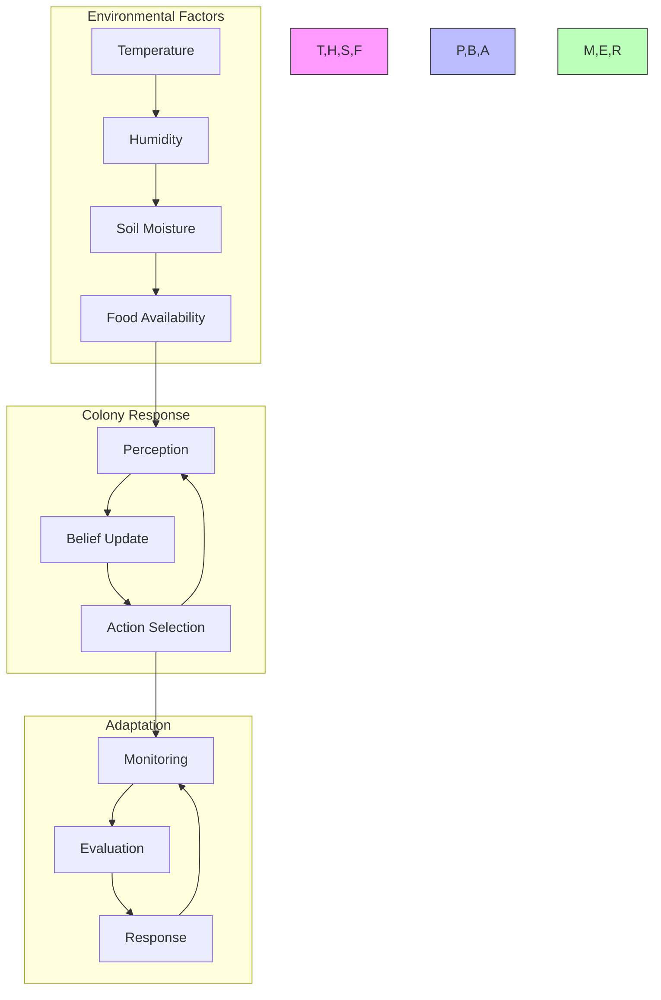

#### Weather-Dependent Foraging
```python
class WeatherDependentForaging:
    def __init__(self,
                 weather_sensitivity: float,
                 risk_threshold: float):
        """Initialize weather-dependent foraging system."""
        self.sensitivity = weather_sensitivity
        self.threshold = risk_threshold
        self.weather_model = WeatherModel()
        
    def evaluate_foraging_conditions(self,
                                   weather_data: WeatherData) -> ForagingDecision:
        """Evaluate whether to forage based on weather conditions."""
        # Predict near-term weather changes
        weather_prediction = self.weather_model.predict_changes(weather_data)
        
        # Assess risk levels
        temperature_risk = self.assess_temperature_risk(weather_prediction)
        humidity_risk = self.assess_humidity_risk(weather_prediction)
        
        # Compute overall risk
        total_risk = self.compute_total_risk(temperature_risk, humidity_risk)
        
        # Make foraging decision
        if total_risk > self.threshold:
            return ForagingDecision.SUSPEND
        else:
            return ForagingDecision.CONTINUE
```

### 5. Practical Applications (2 weeks)

#### Conservation and Management
1. **Habitat Protection**
   - Foraging range mapping
   - Critical resource identification
   - Disturbance mitigation
   - Restoration planning

2. **Population Monitoring**
   - Colony health assessment
   - Population dynamics tracking
   - Impact evaluation
   - Long-term monitoring

#### Research Applications
```python
class HarvesterResearchFramework:
    def __init__(self,
                 research_parameters: ResearchParams):
        """Initialize harvester ant research framework."""
        self.parameters = research_parameters
        self.data_collector = DataCollector()
        self.analyzer = DataAnalyzer()
        
    def conduct_research_study(self,
                             study_design: StudyDesign) -> ResearchResults:
        """Conduct comprehensive research study."""
        # Collect baseline data
        baseline = self.collect_baseline_data()
        
        # Implement experimental conditions
        experimental_data = self.run_experiment(study_design)
        
        # Analyze results
        analysis = self.analyzer.analyze_data(baseline, experimental_data)
        
        # Generate insights
        insights = self.generate_insights(analysis)
        
        return ResearchResults(
            baseline=baseline,
            experimental=experimental_data,
            analysis=analysis,
            insights=insights
        )
```

### 6. Advanced Foraging Dynamics (2 weeks)

#### Recruitment System Analysis
```python
class RecruitmentAnalyzer:
    def __init__(self,
                 colony_size: int,
                 trail_params: TrailParams):
        """Initialize recruitment analysis system."""
        self.colony_size = colony_size
        self.trail_params = trail_params
        self.interaction_model = InteractionModel()
        self.recruitment_tracker = RecruitmentTracker()
        
    def analyze_recruitment_dynamics(self,
                                   trail_data: TrailData,
                                   forager_interactions: List[Interaction]) -> RecruitmentAnalysis:
        """Analyze recruitment patterns and dynamics."""
        # Analyze interaction networks
        interaction_graph = self.build_interaction_graph(forager_interactions)
        
        # Track information flow
        information_cascade = self.track_information_flow(interaction_graph)
        
        # Analyze recruitment efficiency
        recruitment_metrics = self.compute_recruitment_metrics(
            trail_data, information_cascade
        )
        
        # Model decision propagation
        decision_dynamics = self.model_decision_propagation(
            interaction_graph, recruitment_metrics
        )
        
        return RecruitmentAnalysis(
            interaction_graph=interaction_graph,
            information_cascade=information_cascade,
            recruitment_metrics=recruitment_metrics,
            decision_dynamics=decision_dynamics
        )
```

#### Temporal Foraging Patterns
```python
class TemporalForagingAnalyzer:
    def __init__(self,
                 time_resolution: float,
                 seasonal_factors: SeasonalParams):
        """Initialize temporal analysis system."""
        self.resolution = time_resolution
        self.seasonal = seasonal_factors
        self.pattern_detector = PatternDetector()
        self.rhythm_analyzer = CircadianAnalyzer()
        
    def analyze_temporal_patterns(self,
                                activity_data: ActivityTimeSeries,
                                environmental_data: EnvironmentalData) -> TemporalAnalysis:
        """Analyze temporal foraging patterns."""
        # Detect daily patterns
        daily_patterns = self.rhythm_analyzer.analyze_daily_rhythms(activity_data)
        
        # Analyze seasonal trends
        seasonal_patterns = self.analyze_seasonal_trends(
            activity_data, environmental_data
        )
        
        # Identify environmental correlations
        env_correlations = self.compute_environmental_correlations(
            activity_data, environmental_data
        )
        
        return TemporalAnalysis(
            daily_patterns=daily_patterns,
            seasonal_patterns=seasonal_patterns,
            environmental_correlations=env_correlations
        )
```

### 7. Energy Economics and Optimization (2 weeks)

#### Energy Budget Analysis
```python
class EnergyBudgetAnalyzer:
    def __init__(self,
                 metabolic_params: MetabolicParams,
                 colony_params: ColonyParams):
        """Initialize energy budget analysis."""
        self.metabolic = metabolic_params
        self.colony = colony_params
        self.energy_model = EnergyModel()
        
    def analyze_energy_budget(self,
                            foraging_data: ForagingData,
                            colony_state: ColonyState) -> EnergyAnalysis:
        """Analyze colony energy economics."""
        # Calculate energy expenditure
        expenditure = self.calculate_energy_expenditure(foraging_data)
        
        # Calculate energy gains
        gains = self.calculate_energy_gains(foraging_data)
        
        # Compute efficiency metrics
        efficiency = self.compute_efficiency_metrics(expenditure, gains)
        
        # Optimize foraging strategy
        optimal_strategy = self.optimize_energy_strategy(
            efficiency, colony_state
        )
        
        return EnergyAnalysis(
            expenditure=expenditure,
            gains=gains,
            efficiency=efficiency,
            optimal_strategy=optimal_strategy
        )
```

#### Resource Quality Assessment
```python
class ResourceQualityAnalyzer:
    def __init__(self,
                 quality_metrics: QualityMetrics,
                 nutritional_params: NutritionalParams):
        """Initialize resource quality analysis."""
        self.metrics = quality_metrics
        self.nutritional = nutritional_params
        self.quality_model = QualityModel()
        
    def analyze_resource_quality(self,
                               collected_items: List[FoodItem],
                               environmental_context: Environment) -> QualityAnalysis:
        """Analyze resource quality and selection."""
        # Assess nutritional content
        nutritional_value = self.assess_nutritional_value(collected_items)
        
        # Analyze selection patterns
        selection_patterns = self.analyze_selection_patterns(collected_items)
        
        # Evaluate environmental context
        context_analysis = self.evaluate_environmental_context(
            environmental_context
        )
        
        return QualityAnalysis(
            nutritional_value=nutritional_value,
            selection_patterns=selection_patterns,
            context_analysis=context_analysis
        )
```

## Specialized Module: Fire Ant Colony Organization Through Active Inference

### Module Overview
This module examines Solenopsis invicta (Fire Ant) colony organization through active inference, focusing on their unique multi-queen system, territorial behavior, and adaptive responses to environmental challenges.

### 1. Social Structure Analysis (2 weeks)

#### Queen-Worker Dynamics
```python
class QueenWorkerSystem:
    def __init__(self,
                 n_queens: int,
                 worker_population: int,
                 genetic_params: GeneticParams):
        """Initialize queen-worker system analysis."""
        self.queens = [Queen(genetic_params) for _ in range(n_queens)]
        self.worker_population = worker_population
        self.social_network = SocialNetwork()
        
    def analyze_social_structure(self,
                               interaction_data: InteractionData,
                               genetic_data: GeneticData) -> SocialAnalysis:
        """Analyze queen-worker social dynamics."""
        # Analyze queen interactions
        queen_relations = self.analyze_queen_relations(interaction_data)
        
        # Map worker allegiance
        worker_allegiance = self.map_worker_allegiance(
            interaction_data, genetic_data
        )
        
        # Analyze colony cohesion
        colony_cohesion = self.assess_colony_cohesion(
            queen_relations, worker_allegiance
        )
        
        return SocialAnalysis(
            queen_relations=queen_relations,
            worker_allegiance=worker_allegiance,
            colony_cohesion=colony_cohesion
        )
```

#### Territory Defense System
```python
class TerritoryDefenseSystem:
    def __init__(self,
                 territory_size: float,
                 defense_params: DefenseParams):
        """Initialize territory defense analysis."""
        self.territory = Territory(territory_size)
        self.defense = DefenseModel(defense_params)
        self.threat_detector = ThreatDetector()
        
    def analyze_defense_system(self,
                             threat_data: ThreatData,
                             response_data: ResponseData) -> DefenseAnalysis:
        """Analyze territory defense dynamics."""
        # Detect and classify threats
        threat_assessment = self.threat_detector.assess_threats(threat_data)
        
        # Analyze response patterns
        response_patterns = self.analyze_response_patterns(response_data)
        
        # Evaluate defense efficiency
        defense_efficiency = self.evaluate_defense_efficiency(
            threat_assessment, response_patterns
        )
        
        return DefenseAnalysis(
            threat_assessment=threat_assessment,
            response_patterns=response_patterns,
            defense_efficiency=defense_efficiency
        )
```

### 2. Environmental Adaptation (2 weeks)

#### Flood Response System
```python
class FloodResponseSystem:
    def __init__(self,
                 colony_params: ColonyParams,
                 flood_risk_params: FloodRiskParams):
        """Initialize flood response analysis."""
        self.colony = colony_params
        self.flood_risk = flood_risk_params
        self.response_model = FloodResponseModel()
        
    def analyze_flood_response(self,
                             water_level_data: WaterLevelData,
                             colony_response: ResponseData) -> FloodAnalysis:
        """Analyze colony's flood response mechanisms."""
        # Assess flood risk
        risk_assessment = self.assess_flood_risk(water_level_data)
        
        # Analyze raft formation
        raft_analysis = self.analyze_raft_formation(colony_response)
        
        # Evaluate survival strategies
        survival_strategies = self.evaluate_survival_strategies(
            risk_assessment, raft_analysis
        )
        
        return FloodAnalysis(
            risk_assessment=risk_assessment,
            raft_analysis=raft_analysis,
            survival_strategies=survival_strategies
        )
```

#### Temperature Regulation System
```python
class TemperatureRegulator:
    def __init__(self,
                 thermal_params: ThermalParams,
                 nest_structure: NestStructure):
        """Initialize temperature regulation analysis."""
        self.thermal = thermal_params
        self.nest = nest_structure
        self.regulation_model = ThermalRegulationModel()
        
    def analyze_thermal_regulation(self,
                                 temperature_data: TemperatureData,
                                 colony_behavior: BehaviorData) -> ThermalAnalysis:
        """Analyze colony's temperature regulation mechanisms."""
        # Analyze thermal gradients
        thermal_gradients = self.analyze_thermal_gradients(temperature_data)
        
        # Track colony responses
        behavioral_responses = self.track_thermal_responses(colony_behavior)
        
        # Evaluate regulation efficiency
        regulation_efficiency = self.evaluate_regulation_efficiency(
            thermal_gradients, behavioral_responses
        )
        
        return ThermalAnalysis(
            thermal_gradients=thermal_gradients,
            behavioral_responses=behavioral_responses,
            regulation_efficiency=regulation_efficiency
        )
```

### 3. Colony Expansion and Competition (2 weeks)

#### Territory Expansion Model
```python
class TerritoryExpansion:
    def __init__(self,
                 initial_territory: Territory,
                 expansion_params: ExpansionParams):
        """Initialize territory expansion analysis."""
        self.territory = initial_territory
        self.expansion = expansion_params
        self.competition_model = CompetitionModel()
        
    def analyze_expansion_dynamics(self,
                                 resource_data: ResourceData,
                                 competitor_data: CompetitorData) -> ExpansionAnalysis:
        """Analyze territory expansion dynamics."""
        # Assess resource distribution
        resource_map = self.map_resources(resource_data)
        
        # Analyze competition pressure
        competition = self.analyze_competition(competitor_data)
        
        # Model expansion strategies
        expansion_strategies = self.model_expansion_strategies(
            resource_map, competition
        )
        
        return ExpansionAnalysis(
            resource_map=resource_map,
            competition=competition,
            expansion_strategies=expansion_strategies
        )
```

#### Inter-Colony Warfare
```python
class WarfareAnalyzer:
    def __init__(self,
                 combat_params: CombatParams,
                 colony_strength: ColonyStrength):
        """Initialize warfare analysis system."""
        self.combat = combat_params
        self.strength = colony_strength
        self.warfare_model = WarfareModel()
        
    def analyze_warfare_dynamics(self,
                               conflict_data: ConflictData,
                               resource_context: ResourceContext) -> WarfareAnalysis:
        """Analyze inter-colony warfare dynamics."""
        # Assess combat capabilities
        combat_assessment = self.assess_combat_capabilities()
        
        # Analyze battle strategies
        battle_strategies = self.analyze_battle_strategies(conflict_data)
        
        # Evaluate resource competition
        resource_competition = self.evaluate_resource_competition(
            resource_context
        )
        
        return WarfareAnalysis(
            combat_assessment=combat_assessment,
            battle_strategies=battle_strategies,
            resource_competition=resource_competition
        )
```

### 4. Social Immunity and Disease Response (2 weeks)

#### Disease Detection System
```python
class DiseaseDetector:
    def __init__(self,
                 immunity_params: ImmunityParams,
                 colony_health: ColonyHealth):
        """Initialize disease detection system."""
        self.immunity = immunity_params
        self.health = colony_health
        self.detection_model = DiseaseDetectionModel()
        
    def analyze_disease_response(self,
                               health_data: HealthData,
                               behavioral_data: BehaviorData) -> DiseaseAnalysis:
        """Analyze colony's disease response mechanisms."""
        # Detect health threats
        threat_detection = self.detect_health_threats(health_data)
        
        # Analyze immune responses
        immune_responses = self.analyze_immune_responses(behavioral_data)
        
        # Evaluate collective immunity
        collective_immunity = self.evaluate_collective_immunity(
            threat_detection, immune_responses
        )
        
        return DiseaseAnalysis(
            threat_detection=threat_detection,
            immune_responses=immune_responses,
            collective_immunity=collective_immunity
        )
```

#### Social Prophylaxis
```python
class SocialProphylaxis:
    def __init__(self,
                 hygiene_params: HygieneParams,
                 social_params: SocialParams):
        """Initialize social prophylaxis analysis."""
        self.hygiene = hygiene_params
        self.social = social_params
        self.prophylaxis_model = ProphylaxisModel()
        
    def analyze_prophylactic_behavior(self,
                                    grooming_data: GroomingData,
                                    waste_management: WasteData) -> ProphylaxisAnalysis:
        """Analyze prophylactic behaviors."""
        # Analyze grooming patterns
        grooming_patterns = self.analyze_grooming_patterns(grooming_data)
        
        # Evaluate waste management
        waste_handling = self.evaluate_waste_handling(waste_management)
        
        # Assess prophylactic efficiency
        prophylactic_efficiency = self.assess_prophylactic_efficiency(
            grooming_patterns, waste_handling
        )
        
        return ProphylaxisAnalysis(
            grooming_patterns=grooming_patterns,
            waste_handling=waste_handling,
            prophylactic_efficiency=prophylactic_efficiency
        )
```

### 5. Practical Applications and Integration (2 weeks)

#### Pest Management Applications
```python
class PestManagementSystem:
    def __init__(self,
                 control_params: ControlParams,
                 ecological_params: EcologicalParams):
        """Initialize pest management system."""
        self.control = control_params
        self.ecological = ecological_params
        self.management_model = ManagementModel()
        
    def develop_management_strategy(self,
                                  population_data: PopulationData,
                                  impact_data: ImpactData) -> ManagementStrategy:
        """Develop integrated pest management strategy."""
        # Assess population dynamics
        population_assessment = self.assess_population_dynamics(population_data)
        
        # Analyze ecological impact
        ecological_impact = self.analyze_ecological_impact(impact_data)
        
        # Design control measures
        control_measures = self.design_control_measures(
            population_assessment, ecological_impact
        )
        
        return ManagementStrategy(
            population_assessment=population_assessment,
            ecological_impact=ecological_impact,
            control_measures=control_measures
        )
```

#### Ecological Impact Assessment
```python
class EcologicalImpactAnalyzer:
    def __init__(self,
                 ecosystem_params: EcosystemParams,
                 impact_metrics: ImpactMetrics):
        """Initialize ecological impact analysis."""
        self.ecosystem = ecosystem_params
        self.metrics = impact_metrics
        self.impact_model = ImpactModel()
        
    def analyze_ecological_impact(self,
                                ecosystem_data: EcosystemData,
                                invasion_data: InvasionData) -> ImpactAnalysis:
        """Analyze ecological impact of fire ants."""
        # Assess ecosystem changes
        ecosystem_changes = self.assess_ecosystem_changes(ecosystem_data)
        
        # Analyze species interactions
        species_interactions = self.analyze_species_interactions(invasion_data)
        
        # Evaluate ecosystem resilience
        ecosystem_resilience = self.evaluate_ecosystem_resilience(
            ecosystem_changes, species_interactions
        )
        
        return ImpactAnalysis(
            ecosystem_changes=ecosystem_changes,
            species_interactions=species_interactions,
            ecosystem_resilience=ecosystem_resilience
        )
```

## Specialized Module: Leaf-Cutter Ant Agricultural Systems Through Active Inference

### Module Overview
This module examines Atta and Acromyrmex leaf-cutter ant species through active inference, focusing on their sophisticated agricultural systems, fungus cultivation, and complex division of labor.

### 1. Agricultural System Analysis (2 weeks)

#### Fungus Garden Management
```python
class FungusGardenManager:
    def __init__(self,
                 garden_params: GardenParams,
                 environmental_controls: EnvironmentalControls):
        """Initialize fungus garden management system."""
        self.garden = FungusGarden(garden_params)
        self.controls = environmental_controls
        self.health_monitor = GardenHealthMonitor()
        
    def manage_garden_conditions(self,
                               current_state: GardenState,
                               environmental_data: EnvironmentData) -> ManagementActions:
        """Manage fungus garden conditions using active inference."""
        # Monitor garden health
        health_status = self.health_monitor.assess_health(current_state)
        
        # Predict environmental impacts
        env_predictions = self.predict_environmental_effects(environmental_data)
        
        # Generate management strategies
        strategies = self.generate_management_strategies(
            health_status, env_predictions
        )
        
        # Select optimal actions
        actions = self.select_optimal_actions(strategies)
        
        return ManagementActions(
            ventilation=actions.ventilation,
            humidity_control=actions.humidity,
            waste_management=actions.waste,
            garden_maintenance=actions.maintenance
        )
```

#### Substrate Selection System
```python
class SubstrateSelector:
    def __init__(self,
                 quality_metrics: QualityMetrics,
                 processing_params: ProcessingParams):
        """Initialize substrate selection system."""
        self.metrics = quality_metrics
        self.processing = processing_params
        self.selection_model = SelectionModel()
        
    def evaluate_substrate(self,
                          leaf_samples: List[LeafSample],
                          current_needs: GardenNeeds) -> SubstrateDecision:
        """Evaluate and select optimal substrate materials."""
        # Analyze substrate quality
        quality_analysis = self.analyze_substrate_quality(leaf_samples)
        
        # Assess garden requirements
        garden_requirements = self.assess_garden_needs(current_needs)
        
        # Generate selection policies
        policies = self.generate_selection_policies(
            quality_analysis, garden_requirements
        )
        
        # Compute expected free energy for each policy
        G = self.compute_policy_free_energy(policies)
        
        return SubstrateDecision(
            selected_substrates=policies[torch.argmin(G)],
            processing_instructions=self.generate_processing_instructions()
        )
```

### 2. Caste System and Labor Division (2 weeks)

#### Task Allocation System
```python
class TaskAllocator:
    def __init__(self,
                 colony_size: int,
                 caste_distribution: CasteDistribution):
        """Initialize task allocation system."""
        self.colony_size = colony_size
        self.castes = caste_distribution
        self.allocation_model = AllocationModel()
        
    def optimize_task_allocation(self,
                               current_needs: ColonyNeeds,
                               worker_availability: WorkerState) -> TaskAllocation:
        """Optimize task allocation across castes."""
        # Assess colony needs
        need_assessment = self.assess_colony_needs(current_needs)
        
        # Evaluate worker availability
        available_workers = self.evaluate_worker_availability(worker_availability)
        
        # Generate allocation strategies
        strategies = self.generate_allocation_strategies(
            need_assessment, available_workers
        )
        
        # Select optimal allocation
        optimal_allocation = self.select_optimal_allocation(strategies)
        
        return TaskAllocation(
            garden_workers=optimal_allocation.garden,
            foragers=optimal_allocation.foraging,
            waste_managers=optimal_allocation.waste,
            defenders=optimal_allocation.defense
        )
```

### 3. Foraging and Processing Chain (2 weeks)

#### Multi-Stage Processing
```python
class LeafProcessingChain:
    def __init__(self,
                 chain_params: ChainParams,
                 efficiency_metrics: EfficiencyMetrics):
        """Initialize leaf processing chain analysis."""
        self.chain = chain_params
        self.metrics = efficiency_metrics
        self.process_model = ProcessingModel()
        
    def analyze_processing_chain(self,
                               material_flow: MaterialFlow,
                               worker_efficiency: WorkerEfficiency) -> ChainAnalysis:
        """Analyze multi-stage leaf processing chain."""
        # Track material flow
        flow_analysis = self.analyze_material_flow(material_flow)
        
        # Measure stage efficiency
        stage_efficiency = self.measure_stage_efficiency(worker_efficiency)
        
        # Optimize chain operations
        chain_optimization = self.optimize_chain_operations(
            flow_analysis, stage_efficiency
        )
        
        return ChainAnalysis(
            flow_metrics=flow_analysis,
            efficiency_metrics=stage_efficiency,
            optimization_recommendations=chain_optimization
        )
```

### 4. Environmental Control Systems (2 weeks)

#### Climate Control System
```python
class ClimateController:
    def __init__(self,
                 target_conditions: TargetConditions,
                 control_capabilities: ControlCapabilities):
        """Initialize climate control system analysis."""
        self.targets = target_conditions
        self.capabilities = control_capabilities
        self.control_model = ClimateControlModel()
        
    def regulate_conditions(self,
                          current_conditions: EnvironmentalConditions,
                          external_factors: ExternalFactors) -> ControlActions:
        """Regulate nest climate conditions."""
        # Monitor current conditions
        condition_assessment = self.assess_conditions(current_conditions)
        
        # Predict environmental changes
        predictions = self.predict_changes(external_factors)
        
        # Generate control strategies
        strategies = self.generate_control_strategies(
            condition_assessment, predictions
        )
        
        # Select optimal controls
        optimal_controls = self.select_optimal_controls(strategies)
        
        return ControlActions(
            ventilation=optimal_controls.ventilation,
            humidity=optimal_controls.humidity,
            temperature=optimal_controls.temperature
        )
```

### 5. Agricultural Optimization (2 weeks)

#### Yield Optimization System
```python
class YieldOptimizer:
    def __init__(self,
                 production_params: ProductionParams,
                 resource_constraints: ResourceConstraints):
        """Initialize yield optimization system."""
        self.production = production_params
        self.constraints = resource_constraints
        self.optimization_model = OptimizationModel()
        
    def optimize_production(self,
                          current_yield: YieldMetrics,
                          resource_availability: Resources) -> OptimizationPlan:
        """Optimize fungus garden yield."""
        # Analyze current production
        production_analysis = self.analyze_production(current_yield)
        
        # Assess resource efficiency
        resource_efficiency = self.assess_resource_efficiency(
            resource_availability
        )
        
        # Generate optimization strategies
        strategies = self.generate_optimization_strategies(
            production_analysis, resource_efficiency
        )
        
        return OptimizationPlan(
            substrate_adjustments=strategies.substrate,
            processing_improvements=strategies.processing,
            maintenance_schedule=strategies.maintenance
        )
```

### Integration Projects

#### Cross-Species Comparative Analysis
```python
class ComparativeAnalyzer:
    def __init__(self,
                 species_params: Dict[str, SpeciesParams]):
        """Initialize comparative analysis system."""
        self.species = species_params
        self.analysis_model = ComparisonModel()
        
    def compare_strategies(self,
                         harvester_data: SpeciesData,
                         fire_ant_data: SpeciesData,
                         leaf_cutter_data: SpeciesData) -> ComparisonResults:
        """Compare strategies across ant species."""
        # Analyze foraging strategies
        foraging_comparison = self.compare_foraging_strategies(
            harvester_data.foraging,
            fire_ant_data.foraging,
            leaf_cutter_data.foraging
        )
        
        # Compare social structures
        social_comparison = self.compare_social_structures(
            harvester_data.social,
            fire_ant_data.social,
            leaf_cutter_data.social
        )
        
        # Evaluate adaptive behaviors
        adaptation_comparison = self.compare_adaptations(
            harvester_data.adaptation,
            fire_ant_data.adaptation,
            leaf_cutter_data.adaptation
        )
        
        return ComparisonResults(
            foraging=foraging_comparison,
            social=social_comparison,
            adaptation=adaptation_comparison
        )
```

### Cross-Species Integration and Advanced Analysis

#### Evolutionary Strategy Comparison
```python
class EvolutionaryStrategyAnalyzer:
    def __init__(self,
                 phylogenetic_data: PhylogeneticData,
                 behavioral_traits: BehavioralTraits):
        """Initialize evolutionary strategy analysis."""
        self.phylogeny = phylogenetic_data
        self.traits = behavioral_traits
        self.evolution_model = EvolutionaryModel()
        
    def analyze_evolutionary_strategies(self,
                                     species_data: Dict[str, SpeciesData],
                                     environmental_context: EnvironmentalContext) -> EvolutionaryAnalysis:
        """Analyze evolutionary strategies across species."""
        # Map trait evolution
        trait_mapping = self.map_trait_evolution(species_data)
        
        # Analyze environmental adaptations
        adaptation_analysis = self.analyze_adaptations(
            species_data, environmental_context
        )
        
        # Compare evolutionary strategies
        strategy_comparison = self.compare_strategies(
            trait_mapping, adaptation_analysis
        )
        
        return EvolutionaryAnalysis(
            trait_evolution=trait_mapping,
            adaptations=adaptation_analysis,
            strategy_comparison=strategy_comparison
        )
```

#### Multi-Species Active Inference Framework
```python
class MultiSpeciesInferenceFramework:
    def __init__(self,
                 species_models: Dict[str, SpeciesModel],
                 interaction_params: InteractionParams):
        """Initialize multi-species inference framework."""
        self.species_models = species_models
        self.interactions = interaction_params
        self.inference_engine = MultiSpeciesInference()
        
    def analyze_collective_dynamics(self,
                                  ecological_data: EcologicalData,
                                  species_interactions: InteractionData) -> CollectiveDynamics:
        """Analyze collective dynamics across species."""
        # Model species-specific inference
        species_inference = {
            species: model.infer_state(ecological_data)
            for species, model in self.species_models.items()
        }
        
        # Analyze inter-species interactions
        interaction_dynamics = self.analyze_interactions(
            species_inference, species_interactions
        )
        
        # Model collective behavior
        collective_behavior = self.model_collective_behavior(
            species_inference, interaction_dynamics
        )
        
        return CollectiveDynamics(
            species_states=species_inference,
            interactions=interaction_dynamics,
            collective_behavior=collective_behavior
        )
```

#### Ecological Network Analysis
```python
class EcologicalNetworkAnalyzer:
    def __init__(self,
                 network_params: NetworkParams,
                 analysis_metrics: AnalysisMetrics):
        """Initialize ecological network analysis."""
        self.network = network_params
        self.metrics = analysis_metrics
        self.network_model = NetworkModel()
        
    def analyze_species_networks(self,
                               interaction_data: InteractionData,
                               resource_data: ResourceData) -> NetworkAnalysis:
        """Analyze ecological networks and interactions."""
        # Build interaction networks
        interaction_networks = self.build_networks(interaction_data)
        
        # Analyze network properties
        network_properties = self.analyze_network_properties(
            interaction_networks
        )
        
        # Model resource flow
        resource_flow = self.model_resource_flow(
            interaction_networks, resource_data
        )
        
        return NetworkAnalysis(
            networks=interaction_networks,
            properties=network_properties,
            resource_flow=resource_flow
        )
```

### Advanced Comparative Studies

#### Behavioral Plasticity Analysis
```python
class BehavioralPlasticityAnalyzer:
    def __init__(self,
                 plasticity_metrics: PlasticityMetrics,
                 response_params: ResponseParams):
        """Initialize behavioral plasticity analysis."""
        self.metrics = plasticity_metrics
        self.response = response_params
        self.plasticity_model = PlasticityModel()
        
    def analyze_plasticity(self,
                          species_behaviors: Dict[str, BehaviorData],
                          environmental_changes: EnvironmentalChanges) -> PlasticityAnalysis:
        """Analyze behavioral plasticity across species."""
        # Measure baseline behaviors
        baseline = self.measure_baseline_behaviors(species_behaviors)
        
        # Track behavioral changes
        behavioral_changes = self.track_behavioral_changes(
            species_behaviors, environmental_changes
        )
        
        # Analyze adaptation capacity
        adaptation_capacity = self.analyze_adaptation_capacity(
            behavioral_changes
        )
        
        return PlasticityAnalysis(
            baseline_behaviors=baseline,
            behavioral_changes=behavioral_changes,
            adaptation_capacity=adaptation_capacity
        )
```

#### Cognitive Architecture Comparison
```python
class CognitiveArchitectureComparator:
    def __init__(self,
                 architecture_params: Dict[str, ArchitectureParams],
                 comparison_metrics: ComparisonMetrics):
        """Initialize cognitive architecture comparison."""
        self.architectures = architecture_params
        self.metrics = comparison_metrics
        self.comparison_model = ComparisonModel()
        
    def compare_architectures(self,
                            species_cognition: Dict[str, CognitionData],
                            task_performance: Dict[str, PerformanceData]) -> ArchitectureComparison:
        """Compare cognitive architectures across species."""
        # Analyze information processing
        processing_analysis = self.analyze_information_processing(
            species_cognition
        )
        
        # Compare decision making
        decision_comparison = self.compare_decision_making(
            species_cognition, task_performance
        )
        
        # Evaluate learning capabilities
        learning_evaluation = self.evaluate_learning_capabilities(
            species_cognition, task_performance
        )
        
        return ArchitectureComparison(
            processing=processing_analysis,
            decision_making=decision_comparison,
            learning=learning_evaluation
        )
```

### Synthesis and Integration

#### Cross-Species Knowledge Integration
```python
class KnowledgeIntegrator:
    def __init__(self,
                 species_knowledge: Dict[str, SpeciesKnowledge],
                 integration_params: IntegrationParams):
        """Initialize knowledge integration system."""
        self.knowledge = species_knowledge
        self.params = integration_params
        self.integration_model = IntegrationModel()
        
    def integrate_knowledge(self,
                          research_findings: Dict[str, ResearchFindings],
                          theoretical_framework: TheoreticalFramework) -> IntegratedKnowledge:
        """Integrate knowledge across species studies."""
        # Synthesize findings
        synthesis = self.synthesize_findings(research_findings)
        
        # Identify common principles
        common_principles = self.identify_common_principles(
            synthesis, theoretical_framework
        )
        
        # Generate unified framework
        unified_framework = self.generate_unified_framework(
            common_principles
        )
        
        return IntegratedKnowledge(
            synthesis=synthesis,
            principles=common_principles,
            framework=unified_framework
        )
```

## Assessment Methods

#### Field Assessment
- Colony mapping accuracy
- Data collection proficiency
- Pattern recognition skills
- Environmental analysis

#### Theoretical Assessment
- Active inference understanding
- Model development capability
- Data analysis proficiency
- Integration of concepts

#### Project Deliverables
1. **Research Paper**
   - Literature review
   - Methods description
   - Results analysis
   - Theoretical integration

2. **Field Report**
   - Colony documentation
   - Behavioral analysis
   - Environmental data
   - Management recommendations

### Resources

#### Technical Tools
- GPS mapping equipment
- Weather monitoring stations
- Video recording systems
- Data analysis software

#### Reference Materials
1. **Key Papers**
   - Gordon, D.M. (2019). "The Ecology of Collective Behavior in Ants"
   - Friston, K.J. (2019). "Active Inference in Ecological Systems"
   - Additional relevant literature

2. **Field Guides**
   - Harvester ant identification
   - Behavioral observation
   - Environmental assessment
   - Data collection protocols

## Implementation Projects

### Field Projects
1. **Colony Mapping**
   - Spatial organization
   - Activity patterns
   - Resource distribution
   - Territory dynamics

2. **Behavioral Studies**
   - Task allocation
   - Communication networks
   - Decision-making
   - Learning patterns

### Computational Projects
1. **Colony Simulation**
   - Multi-agent models
   - Pheromone dynamics
   - Collective behavior
   - Adaptive strategies

2. **Analysis Tools**
   - Tracking systems
   - Data visualization
   - Pattern recognition
   - Network analysis

### Advanced Projects
1. **Research Applications**
   - Novel hypotheses
   - Experimental design
   - Data analysis
   - Theory development

2. **Applied Systems**
   - Swarm algorithms
   - Distributed control
   - Bio-inspired systems
   - Conservation tools

## Resources

### Academic Resources
1. **Research Papers**
   - Myrmecology
   - Active Inference
   - Collective Behavior
   - Complex Systems

2. **Books**
   - Ant Biology
   - Social Insects
   - Complex Systems
   - Computational Biology

### Technical Resources
1. **Software Tools**
   - Analysis Packages
   - Simulation Platforms
   - Visualization Tools
   - Data Collection Systems

2. **Field Equipment**
   - Observation Tools
   - Recording Devices
   - Tracking Systems
   - Environmental Sensors

## Next Steps

### Advanced Topics
1. [[evolutionary_computation_learning_path|Evolutionary Computation]]
2. [[collective_intelligence_learning_path|Collective Intelligence]]
3. [[complex_systems_learning_path|Complex Systems]]

### Research Directions
1. [[research_guides/myrmecology|Myrmecology Research]]
2. [[research_guides/collective_behavior|Collective Behavior Research]]
3. [[research_guides/bio_inspired_computing|Bio-inspired Computing Research]]

## Diagram Types to Master

### 1. Scientific Diagrams
- Colony structure schematics
- Behavioral flow charts
- Decision tree mappings
- Network topology graphs

### 2. Mathematical Visualizations
- Phase space plots
- Information flow diagrams
- Statistical distributions
- Markov blanket illustrations

### 3. Artistic Representations
- Anatomical drawings
- Behavioral sketches
- Colony architecture plans
- Environmental context maps

## Assessment Framework

### Continuous Assessment
#### Weekly Checkpoints
- Theoretical Understanding (85% required)
  - Ant biology and behavior
  - Active inference mathematics
  - Complex systems theory
- Implementation Skills (80% required)
  - Field techniques
  - Data analysis
  - Model development
- Research Progress (85% required)
  - Literature review
  - Experimental design
  - Results analysis

#### Progress Tracking
- Daily Field Notes
- Weekly Model Review
- Monthly Project Assessment
- Quarterly Publication Progress

### Knowledge Checkpoints

#### Foundation Checkpoint (Week 6)
- Format: Written + Field Work
- Duration: 4 hours
- Topics:
  - Ant biology and behavior
  - Active inference basics
  - Field methods
- Requirements:
  - Theory: 85% correct
  - Field skills: Proficient
  - Data analysis: Working knowledge

#### Advanced Integration (Week 12)
- Format: Research Project
- Duration: 2 weeks
- Focus:
  - Complex colony systems
  - Multi-scale analysis
  - Field validation
- Deliverables:
  - Research paper draft
  - Field study design
  - Data analysis results

#### Final Assessment (Week 20)
- Format: Research Publication
- Duration: 3 weeks
- Components:
  - Original research
  - Novel methodology
  - Field validation
- Requirements:
  - Publication-ready paper
  - Validated methods
  - Field data

### Project Portfolio

#### Research Projects
1. Colony Behavior Study
   - Scope: Field-based research
   - Deliverables:
     - Study design
     - Data collection
     - Analysis report
   - Evaluation:
     - Methods: 35%
     - Results: 35%
     - Documentation: 30%

2. Computational Model
   - Scope: Colony simulation
   - Deliverables:
     - Model implementation
     - Validation results
     - Documentation
   - Evaluation:
     - Code quality: 30%
     - Results: 40%
     - Documentation: 30%

#### Final Project
- Description: Novel Myrmecological Application
- Requirements:
  - Technical:
    - Original research
    - Field validation
    - Data analysis
  - Documentation:
    - Research paper
    - Technical docs
    - Field protocols
  - Presentation:
    - Research talk
    - Field demonstration
    - Results discussion

### Success Criteria
#### Technical Competency
- Theory: Advanced understanding (9/10)
- Field Work: Expert level (8/10)
- Research: Publication quality
- Analysis: Expert level (9/10)

#### Project Delivery
- Quality Standards:
  - Field validation
  - Statistical rigor
  - Documentation complete
- Performance Metrics:
  - Research impact
  - Method reliability
  - Analysis quality

#### Professional Development
- Research publications
- Field studies
- Conference presentations
- Community engagement

## Career Development

### Industry Alignment
#### Research Roles
- Myrmecologist
  - Field research
  - Colony studies
  - Species discovery
- Computational Biologist
  - Model development
  - Data analysis
  - System simulation
- Research Scientist
  - Theory development
  - Experimental design
  - Publication track

#### Certification Path
- Field Biology
  - Field methods
  - Species identification
  - Ecological assessment
- Computational Methods
  - Model development
  - Data analysis
  - Simulation design
- Research Methods
  - Experimental design
  - Statistical analysis
  - Publication writing

### Professional Network
#### Research Community
- Academic Connections:
  - Research labs
  - Universities
  - Field stations
- Industry Partners:
  - Conservation organizations
  - Technology companies
  - Research institutes
- Professional Organizations:
  - International Union for the Study of Social Insects
  - Myrmecological Society
  - Complex Systems Society

#### Career Progression
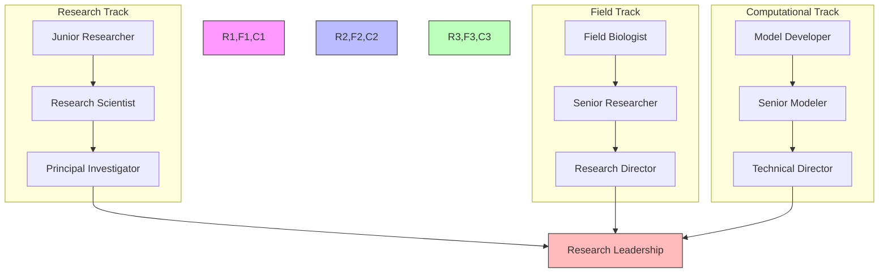

### Competency Framework
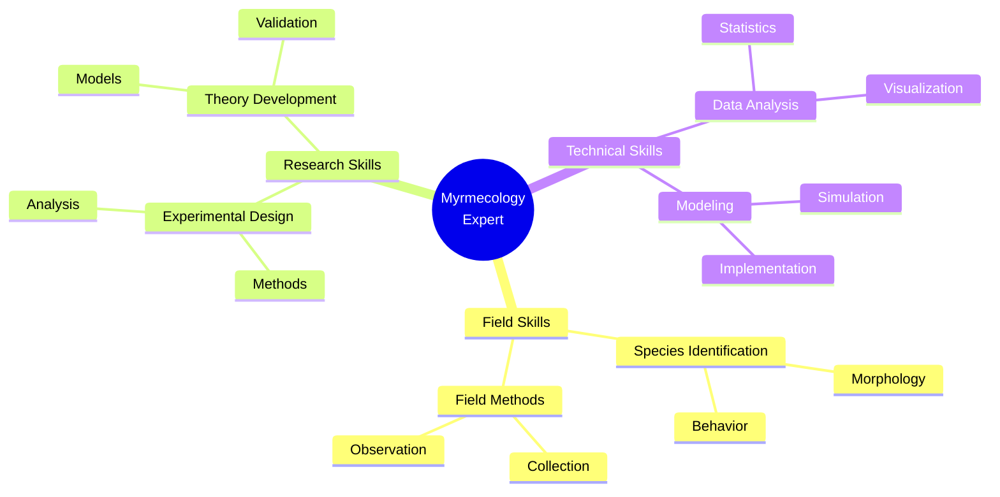

### Research Focus Areas
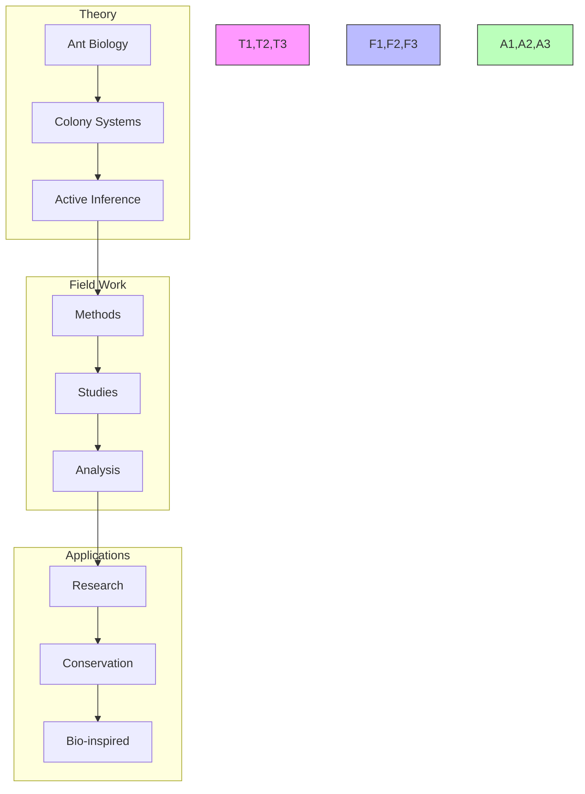

## Support Resources

### Research Support
- Literature Database
  - Myrmecology papers
  - Active inference research
  - Field methods
- Computing Resources
  - Analysis software
  - Simulation platforms
  - Data processing
- Field Resources
  - Equipment access
  - Field stations
  - Collection permits

### Technical Support
- Development Tools
  - Analysis packages
  - Modeling frameworks
  - Visualization tools
- Documentation
  - API references
  - Field guides
  - Best practices
- Computing Resources
  - Development environments
  - Data storage
  - Processing power

### Learning Support
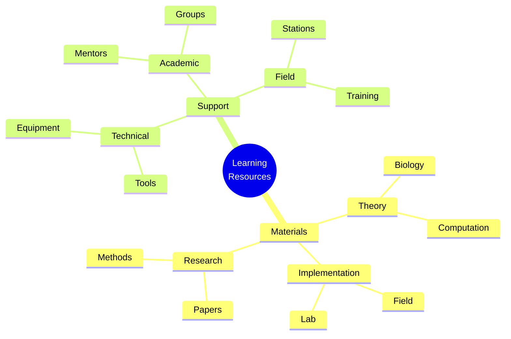

## Version Control and Updates

### Version History
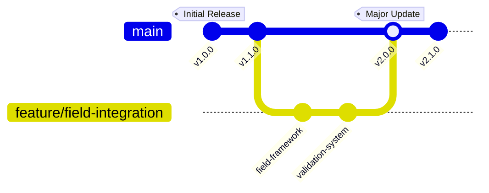

### Change Management
#### Major Updates
- v2.0.0 (Current)
  - Enhanced field framework
  - Advanced colony models
  - Improved validation system
  - Updated career paths
- v1.1.0
  - Added field protocols
  - Enhanced documentation
  - New research projects
- v1.0.0
  - Initial curriculum
  - Basic framework
  - Core concepts

#### Planned Improvements
- Advanced colony models
- Field protocols
- Integration frameworks
- Research extensions

### Quality Metrics
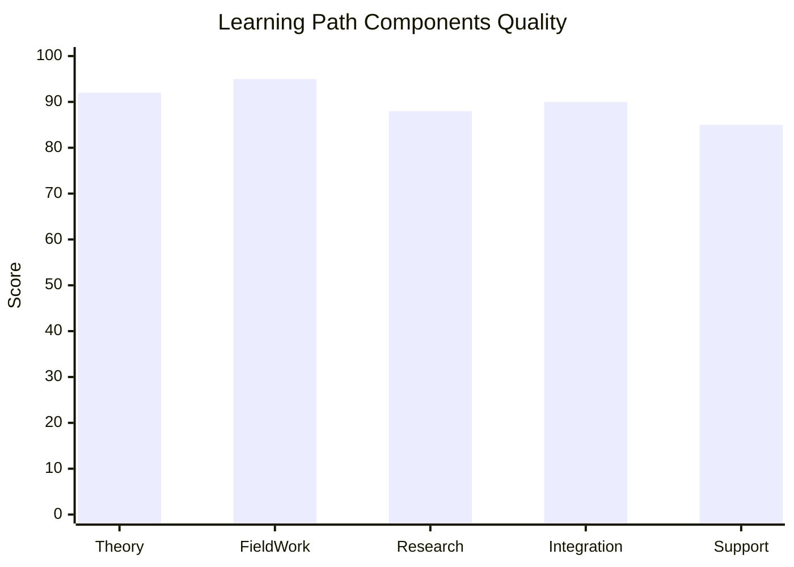

## Learning Analytics

### Progress Tracking
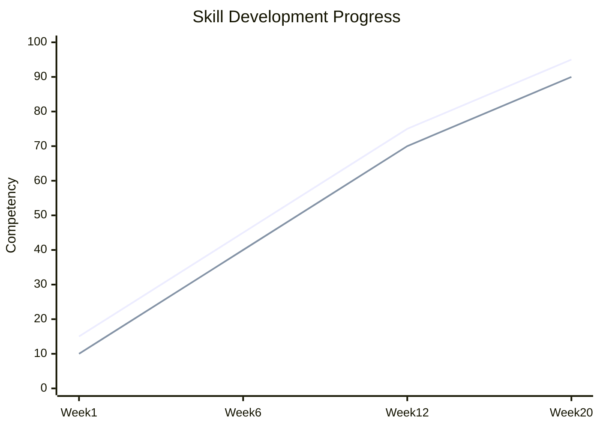

### Performance Metrics
- Field Skills
  - Species identification
  - Field methods
  - Data collection
- Research Skills
  - Experimental design
  - Data analysis
  - Theory development
- Technical Skills
  - Model implementation
  - Data processing
  - Documentation

### Development Analytics
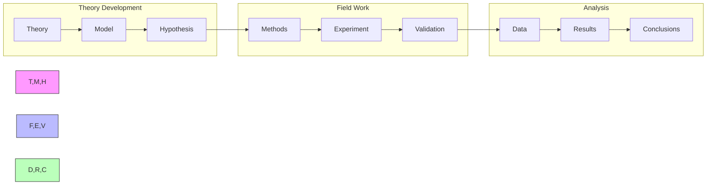

## Final Notes

### Success Stories
- Research Impact
  - Novel discoveries
  - Method innovations
  - Field contributions
- Technical Achievements
  - Model implementations
  - Analysis tools
  - Field techniques
- Professional Growth
  - Research leadership
  - Field expertise
  - Community building

### Additional Resources
- Extended Reading
  - Advanced myrmecology
  - Field techniques
  - Analysis methods
- Research Directions
  - Open problems
  - Future applications
  - Integration opportunities
- Community Resources
  - Research groups
  - Field stations
  - Professional networks

### Contact Information
- Research Support
  - Principal investigators
  - Field coordinators
  - Research managers
- Technical Support
  - Analysis specialists
  - Tool developers
  - Equipment managers
- Field Support
  - Station managers
  - Field technicians
  - Collection managers

---
*This expanded learning path now incorporates deep cultural, historical, and natural history dimensions while maintaining its scientific and technical foundations. It celebrates both the wonder and rigor of myrmecological study.*