---

title: Active Inference in Myrmecology Learning Path

type: learning_path

status: stable

created: 2024-03-25

modified: 2024-03-25

version: 2.0.0

complexity: advanced

processing_priority: 2

authors:

  - name: Cognitive Systems Team

    role: Research & Development

difficulty_level: advanced

estimated_hours: 480

completion_time: "20 weeks"

certification_track: true

tags:

  - active-inference

  - myrmecology

  - collective-behavior

  - social-insects

  - complex-systems

  - biological-intelligence

  - ant-behavior

semantic_relations:

  - type: specializes

    links:

      - [[active_inference_learning_path]]

      - [[active_inference_biological_learning_path]]

  - type: relates

    links:

      - [[active_inference_biological_learning_path]]

      - [[active_inference_social_learning_path]]

      - [[active_inference_resilient_systems_path]]

---

# Active Inference in Myrmecology Learning Path

## Quick Start

- Choose a species/module (harvester, fire ant, leaf-cutter) and outline observational variables

- Implement a minimal colony-level inference sketch; validate qualitative expectations

- Plan a field or data re-analysis study with clear observation protocols

## External Web Resources

- [[index#centralized-external-web-resources|Centralized resources hub]]

- [Myrmecological News](https://myrmecologicalnews.org/)

- [AntWeb](https://www.antweb.org/) • [AntWiki](https://www.antwiki.org/wiki/Welcome_to_AntWiki)

## Quick Reference

- **Difficulty**: Advanced

- **Time Commitment**: 25-30 hours/week for 20 weeks

- **Prerequisites Score**: 8/10 (biology and computational expertise)

- **Industry Relevance**: High (Research, Ecology, Bio-inspired Computing)

- **Hands-on Component**: 50%

- **Theory Component**: 50%

## Executive Summary

### Purpose and Scope

This specialized learning path integrates Active Inference principles with myrmecology (the study of ants), providing a comprehensive framework for understanding multi-scale cognitive processes in ant colonies. It bridges theoretical biology with computational modeling, focusing on collective behavior and colony-level intelligence.

### Target Audience

- **Primary**: Myrmecologists and computational biologists

- **Secondary**: AI researchers and complex systems scientists

- **Career Stage**: Advanced researchers (3+ years experience)

### Learning Outcomes

By completing this path, learners will be able to:

1. Develop sophisticated models of ant colony behavior using Active Inference

1. Implement multi-scale simulations of collective intelligence

1. Design and conduct myrmecological experiments with Active Inference frameworks

1. Apply models to understand natural and artificial collective systems

### Industry Applications

- Research: Ant behavior, collective intelligence

- Bio-inspired Computing: Swarm algorithms, distributed systems

- Ecology: Colony dynamics, species interactions

- Conservation: Population monitoring, habitat management

## Path Selection Guide

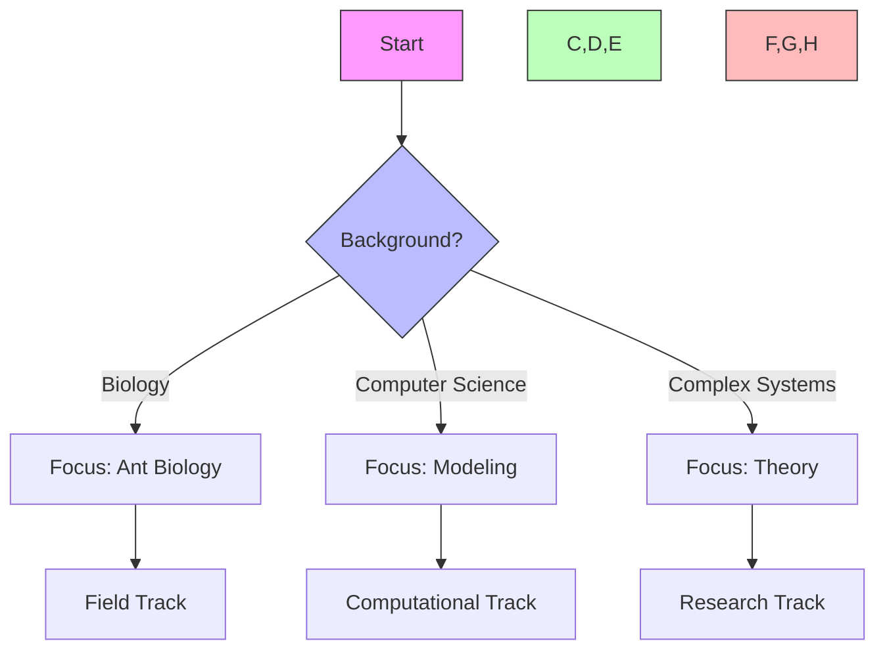
```mermaid

flowchart TD

    A[Start] --> B{Background?}

    B -->|Biology| C[Focus: Ant Biology]

    B -->|Computer Science| D[Focus: Modeling]

    B -->|Complex Systems| E[Focus: Theory]

    C --> F[Field Track]

    D --> G[Computational Track]

    E --> H[Research Track]

    style A fill:#f9f,stroke:#333

    style B fill:#bbf,stroke:#333

    style C,D,E fill:#bfb,stroke:#333

    style F,G,H fill:#fbb,stroke:#333

```

## Path Interconnections

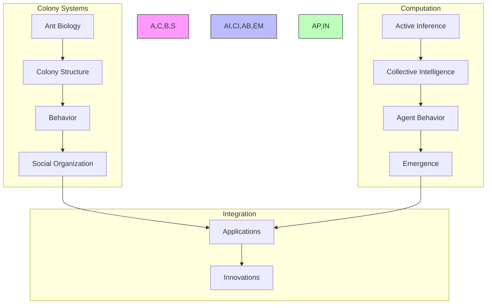
```mermaid

graph TB

    subgraph Colony Systems

        A[Ant Biology] --> C[Colony Structure]

        C --> B[Behavior]

        B --> S[Social Organization]

    end

    subgraph Computation

        AI[Active Inference] --> CI[Collective Intelligence]

        CI --> AB[Agent Behavior]

        AB --> EM[Emergence]

    end

    subgraph Integration

        S --> AP[Applications]

        EM --> AP

        AP --> IN[Innovations]

    end

    style A,C,B,S fill:#f9f,stroke:#333

    style AI,CI,AB,EM fill:#bbf,stroke:#333

    style AP,IN fill:#bfb,stroke:#333

```

### System Architecture

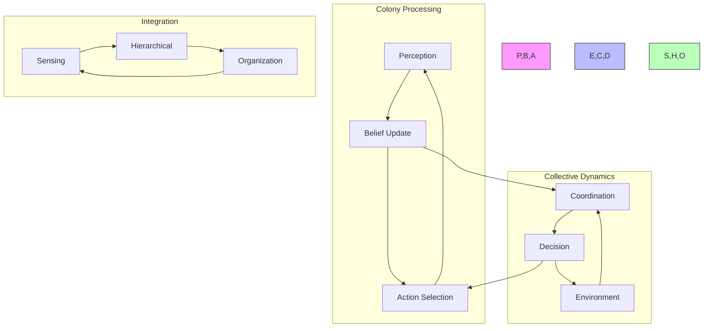
```mermaid

graph TB

    subgraph Colony Processing

        P[Perception] --> B[Belief Update]

        B --> A[Action Selection]

        A --> P

    end

    subgraph Collective Dynamics

        E[Environment] --> C[Coordination]

        C --> D[Decision]

        D --> E

    end

    subgraph Integration

        S[Sensing] --> H[Hierarchical]

        H --> O[Organization]

        O --> S

    end

    B --> C

    D --> A

    style P,B,A fill:#f9f,stroke:#333

    style E,C,D fill:#bbf,stroke:#333

    style S,H,O fill:#bfb,stroke:#333

```

## Prerequisites

### 1. Myrmecology Foundations (4 weeks)

- Ant Biology

  - Taxonomy and morphology

  - Colony structure

  - Life cycles

  - Behavior patterns

- Social Organization

  - Division of labor

  - Communication systems

  - Collective decision-making

  - Colony dynamics

- Research Methods

  - Field techniques

  - Laboratory methods

  - Data collection

  - Experimental design

- Complex Systems

  - Emergence

  - Self-organization

  - Network analysis

  - Information theory

### 2. Technical Skills (2 weeks)

- Research Tools

  - Python/R programming

  - Statistical analysis

  - Data visualization

  - Simulation frameworks

## Mathematical Foundations

### 1. Essential Mathematics

#### Calculus and Analysis

- Differential equations for population dynamics

- Partial differential equations for spatial patterns

- Variational calculus for free energy principles

- Stochastic processes in ant behavior

#### Linear Algebra

- Matrix operations for transition states

- Eigenvalue analysis for stability

- Vector spaces for behavioral mapping

- Tensor operations for multi-scale analysis

#### Information Theory

- Shannon entropy in colony communication

- Kullback-Leibler divergence

- Mutual information measures

- Fisher information metrics

#### Statistical Methods

- Bayesian inference

- Maximum entropy principles

- Markov chain Monte Carlo

- Time series analysis

### 2. Computational Frameworks

#### Simulation Tools

- Agent-based modeling platforms

- Neural network implementations

- Differential equation solvers

- Network analysis tools

#### Programming Skills

- Python for data analysis

- R for statistical modeling

- NetLogo for agent-based simulations

- Julia for high-performance computing

## Core Learning Modules

### 1. Colony-Level Active Inference (4 weeks)

#### Week 1-2: Colony State Inference

#### Week 3-4: Collective Decision Making

### 2. Multi-scale Analysis (6 weeks)

#### Week 1-2: Individual Ant Behavior

- Sensory processing

- Movement patterns

- Task selection

- Local interactions

#### Week 3-4: Colony Organization

- Division of labor

- Nest construction

- Foraging strategies

- Territory defense

#### Week 5-6: Emergent Phenomena

- Collective decision-making

- Pattern formation

- Resource allocation

- Adaptive responses

### 3. Field Applications (4 weeks)

#### Week 1-2: Field Studies

#### Week 3-4: Natural Systems

- Colony monitoring

- Population dynamics

- Species interactions

- Habitat relationships

### 4. Advanced Topics (4 weeks)

#### Week 1-2: Multi-Colony Systems

#### Week 3-4: Advanced Applications

- Swarm robotics

- Distributed algorithms

- Bio-inspired computing

- Conservation applications

## Specialized Module: Harvester Ant Foraging Through Active Inference

### Module Overview

This specialized module explores Pogonomyrmex harvester ant foraging behavior through the lens of active inference, examining how colonies optimize resource collection while managing uncertainty and environmental risks.

### 1. Theoretical Framework (2 weeks)

#### Active Inference in Foraging Decisions

#### Foraging Pattern Analysis

### 2. Field Studies and Data Collection (2 weeks)

#### Observation Protocols

1. **Colony Activity Monitoring**

   - Forager counts (15-minute intervals)

   - Trail formation tracking

   - Return rates with/without food

   - Weather condition correlation

1. **Environmental Variables**

   - Temperature and humidity logging

   - Soil moisture measurements

   - Food source mapping

   - Competitor presence

1. **Individual Behavior**

   - Scout behavior tracking

   - Forager path analysis

   - Food item selection

   - Information sharing events

#### Data Collection Framework

### 3. Active Inference Models (2 weeks)

#### Colony-Level Decision Making

#### Individual Forager Models

### 4. Integration with Environmental Factors (2 weeks)

#### Environmental Modeling

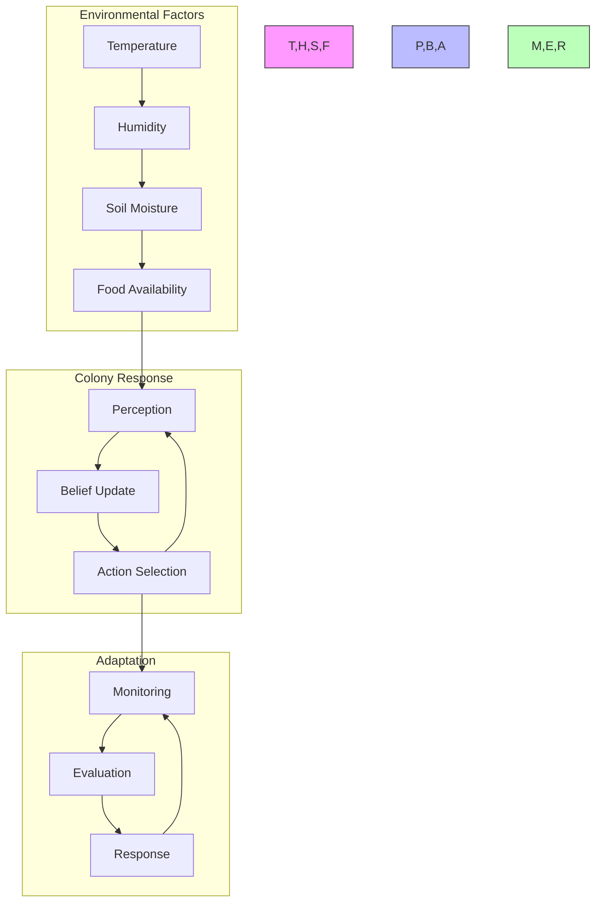
```mermaid

graph TB

    subgraph Environmental Factors

        T[Temperature] --> H[Humidity]

        H --> S[Soil Moisture]

        S --> F[Food Availability]

    end

    subgraph Colony Response

        P[Perception] --> B[Belief Update]

        B --> A[Action Selection]

        A --> P

    end

    subgraph Adaptation

        M[Monitoring] --> E[Evaluation]

        E --> R[Response]

        R --> M

    end

    F --> P

    A --> M

    style T,H,S,F fill:#f9f,stroke:#333

    style P,B,A fill:#bbf,stroke:#333

    style M,E,R fill:#bfb,stroke:#333

```

#### Weather-Dependent Foraging

### 5. Practical Applications (2 weeks)

#### Conservation and Management

1. **Habitat Protection**

   - Foraging range mapping

   - Critical resource identification

   - Disturbance mitigation

   - Restoration planning

1. **Population Monitoring**

   - Colony health assessment

   - Population dynamics tracking

   - Impact evaluation

   - Long-term monitoring

#### Research Applications

### 6. Advanced Foraging Dynamics (2 weeks)

#### Recruitment System Analysis

#### Temporal Foraging Patterns

### 7. Energy Economics and Optimization (2 weeks)

#### Energy Budget Analysis

#### Resource Quality Assessment

## Specialized Module: Fire Ant Colony Organization Through Active Inference

### Module Overview

This module examines Solenopsis invicta (Fire Ant) colony organization through active inference, focusing on their unique multi-queen system, territorial behavior, and adaptive responses to environmental challenges.

### 1. Social Structure Analysis (2 weeks)

#### Queen-Worker Dynamics

#### Territory Defense System

### 2. Environmental Adaptation (2 weeks)

#### Flood Response System

#### Temperature Regulation System

### 3. Colony Expansion and Competition (2 weeks)

#### Territory Expansion Model

#### Inter-Colony Warfare

### 4. Social Immunity and Disease Response (2 weeks)

#### Disease Detection System

#### Social Prophylaxis

### 5. Practical Applications and Integration (2 weeks)

#### Pest Management Applications

#### Ecological Impact Assessment

## Specialized Module: Leaf-Cutter Ant Agricultural Systems Through Active Inference

### Module Overview

This module examines Atta and Acromyrmex leaf-cutter ant species through active inference, focusing on their sophisticated agricultural systems, fungus cultivation, and complex division of labor.

### 1. Agricultural System Analysis (2 weeks)

#### Fungus Garden Management

#### Substrate Selection System

### 2. Caste System and Labor Division (2 weeks)

#### Task Allocation System

### 3. Foraging and Processing Chain (2 weeks)

#### Multi-Stage Processing

### 4. Environmental Control Systems (2 weeks)

#### Climate Control System

### 5. Agricultural Optimization (2 weeks)

#### Yield Optimization System

### Integration Projects

#### Cross-Species Comparative Analysis

### Cross-Species Integration and Advanced Analysis

#### Evolutionary Strategy Comparison

#### Multi-Species Active Inference Framework

#### Ecological Network Analysis

### Advanced Comparative Studies

#### Behavioral Plasticity Analysis

#### Cognitive Architecture Comparison

### Synthesis and Integration

#### Cross-Species Knowledge Integration

## Assessment Methods

#### Field Assessment

- Colony mapping accuracy

- Data collection proficiency

- Pattern recognition skills

- Environmental analysis

#### Theoretical Assessment

- Active inference understanding

- Model development capability

- Data analysis proficiency

- Integration of concepts

#### Project Deliverables

1. **Research Paper**

   - Literature review

   - Methods description

   - Results analysis

   - Theoretical integration

1. **Field Report**

   - Colony documentation

   - Behavioral analysis

   - Environmental data

   - Management recommendations

### Resources

#### Technical Tools

- GPS mapping equipment

- Weather monitoring stations

- Video recording systems

- Data analysis software

#### Reference Materials

1. **Key Papers**

   - Gordon, D.M. (2019). "The Ecology of Collective Behavior in Ants"

   - Friston, K.J. (2019). "Active Inference in Ecological Systems"

   - Additional relevant literature

1. **Field Guides**

   - Harvester ant identification

   - Behavioral observation

   - Environmental assessment

   - Data collection protocols

## Implementation Projects

### Field Projects

1. **Colony Mapping**

   - Spatial organization

   - Activity patterns

   - Resource distribution

   - Territory dynamics

1. **Behavioral Studies**

   - Task allocation

   - Communication networks

   - Decision-making

   - Learning patterns

### Computational Projects

1. **Colony Simulation**

   - Multi-agent models

   - Pheromone dynamics

   - Collective behavior

   - Adaptive strategies

1. **Analysis Tools**

   - Tracking systems

   - Data visualization

   - Pattern recognition

   - Network analysis

### Advanced Projects

1. **Research Applications**

   - Novel hypotheses

   - Experimental design

   - Data analysis

   - Theory development

1. **Applied Systems**

   - Swarm algorithms

   - Distributed control

   - Bio-inspired systems

   - Conservation tools

## Resources

### Academic Resources

1. **Research Papers**

   - Myrmecology

   - Active Inference

   - Collective Behavior

   - Complex Systems

1. **Books**

   - Ant Biology

   - Social Insects

   - Complex Systems

   - Computational Biology

### Technical Resources

1. **Software Tools**

   - Analysis Packages

   - Simulation Platforms

   - Visualization Tools

   - Data Collection Systems

1. **Field Equipment**

   - Observation Tools

   - Recording Devices

   - Tracking Systems

   - Environmental Sensors

## Next Steps

### Advanced Topics

1. Evolutionary Computation

1. Collective Intelligence

1. Complex Systems

### Research Directions

1. [[knowledge_base/biology/myrmecology|Myrmecology Research]]

1. [[knowledge_base/cognitive/collective_behavior|Collective Behavior Research]]

1. [[knowledge_base/research/bio_inspired_computing|Bio-inspired Computing Research]]

## Diagram Types to Master

### 1. Scientific Diagrams

- Colony structure schematics

- Behavioral flow charts

- Decision tree mappings

- Network topology graphs

### 2. Mathematical Visualizations

- Phase space plots

- Information flow diagrams

- Statistical distributions

- Markov blanket illustrations

### 3. Artistic Representations

- Anatomical drawings

- Behavioral sketches

- Colony architecture plans

- Environmental context maps

## Assessment Framework

### Continuous Assessment

#### Weekly Checkpoints

- Theoretical Understanding (85% required)

  - Ant biology and behavior

  - Active inference mathematics

  - Complex systems theory

- Implementation Skills (80% required)

  - Field techniques

  - Data analysis

  - Model development

- Research Progress (85% required)

  - Literature review

  - Experimental design

  - Results analysis

#### Progress Tracking

- Daily Field Notes

- Weekly Model Review

- Monthly Project Assessment

- Quarterly Publication Progress

### Knowledge Checkpoints

#### Foundation Checkpoint (Week 6)

- Format: Written + Field Work

- Duration: 4 hours

- Topics:

  - Ant biology and behavior

  - Active inference basics

  - Field methods

- Requirements:

  - Theory: 85% correct

  - Field skills: Proficient

  - Data analysis: Working knowledge

#### Advanced Integration (Week 12)

- Format: Research Project

- Duration: 2 weeks

- Focus:

  - Complex colony systems

  - Multi-scale analysis

  - Field validation

- Deliverables:

  - Research paper draft

  - Field study design

  - Data analysis results

#### Final Assessment (Week 20)

- Format: Research Publication

- Duration: 3 weeks

- Components:

  - Original research

  - Novel methodology

  - Field validation

- Requirements:

  - Publication-ready paper

  - Validated methods

  - Field data

### Project Portfolio

#### Research Projects

1. Colony Behavior Study

   - Scope: Field-based research

   - Deliverables:

     - Study design

     - Data collection

     - Analysis report

   - Evaluation:

     - Methods: 35%

     - Results: 35%

     - Documentation: 30%

1. Computational Model

   - Scope: Colony simulation

   - Deliverables:

     - Model implementation

     - Validation results

     - Documentation

   - Evaluation:

     - Code quality: 30%

     - Results: 40%

     - Documentation: 30%

#### Final Project

- Description: Novel Myrmecological Application

- Requirements:

  - Technical:

    - Original research

    - Field validation

    - Data analysis

  - Documentation:

    - Research paper

    - Technical docs

    - Field protocols

  - Presentation:

    - Research talk

    - Field demonstration

    - Results discussion

### Success Criteria

#### Technical Competency

- Theory: Advanced understanding (9/10)

- Field Work: Expert level (8/10)

- Research: Publication quality

- Analysis: Expert level (9/10)

#### Project Delivery

- Quality Standards:

  - Field validation

  - Statistical rigor

  - Documentation complete

- Performance Metrics:

  - Research impact

  - Method reliability

  - Analysis quality

#### Professional Development

- Research publications

- Field studies

- Conference presentations

- Community engagement

## Career Development

### Industry Alignment

#### Research Roles

- Myrmecologist

  - Field research

  - Colony studies

  - Species discovery

- Computational Biologist

  - Model development

  - Data analysis

  - System simulation

- Research Scientist

  - Theory development

  - Experimental design

  - Publication track

#### Certification Path

- Field Biology

  - Field methods

  - Species identification

  - Ecological assessment

- Computational Methods

  - Model development

  - Data analysis

  - Simulation design

- Research Methods

  - Experimental design

  - Statistical analysis

  - Publication writing

### Professional Network

#### Research Community

- Academic Connections:

  - Research labs

  - Universities

  - Field stations

- Industry Partners:

  - Conservation organizations

  - Technology companies

  - Research institutes

- Professional Organizations:

  - International Union for the Study of Social Insects

  - Myrmecological Society

  - Complex Systems Society

#### Career Progression

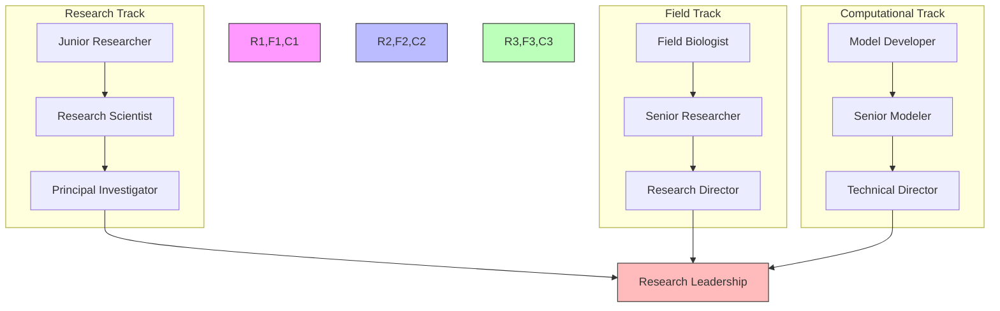
```mermaid

graph TB

    subgraph Research Track

        R1[Junior Researcher] --> R2[Research Scientist]

        R2 --> R3[Principal Investigator]

    end

    subgraph Field Track

        F1[Field Biologist] --> F2[Senior Researcher]

        F2 --> F3[Research Director]

    end

    subgraph Computational Track

        C1[Model Developer] --> C2[Senior Modeler]

        C2 --> C3[Technical Director]

    end

    R3 --> L[Research Leadership]

    F3 --> L

    C3 --> L

    style R1,F1,C1 fill:#f9f,stroke:#333

    style R2,F2,C2 fill:#bbf,stroke:#333

    style R3,F3,C3 fill:#bfb,stroke:#333

    style L fill:#fbb,stroke:#333

```

### Competency Framework

```mermaid

mindmap

    root((Myrmecology

    Expert))

        Field Skills

            Species Identification

                Morphology

                Behavior

            Field Methods

                Collection

                Observation

        Research Skills

            Experimental Design

                Methods

                Analysis

            Theory Development

                Models

                Validation

        Technical Skills

            Data Analysis

                Statistics

                Visualization

            Modeling

                Simulation

                Implementation

```

### Research Focus Areas

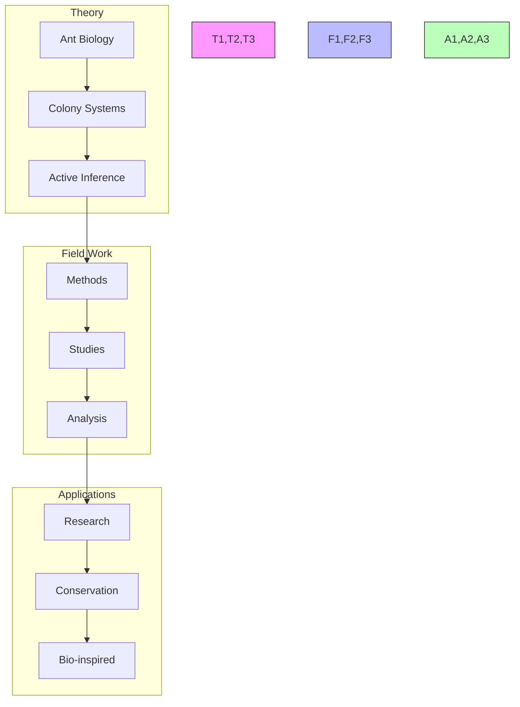
```mermaid

graph TB

    subgraph Theory

        T1[Ant Biology] --> T2[Colony Systems]

        T2 --> T3[Active Inference]

    end

    subgraph Field Work

        F1[Methods] --> F2[Studies]

        F2 --> F3[Analysis]

    end

    subgraph Applications

        A1[Research] --> A2[Conservation]

        A2 --> A3[Bio-inspired]

    end

    T3 --> F1

    F3 --> A1

    style T1,T2,T3 fill:#f9f,stroke:#333

    style F1,F2,F3 fill:#bbf,stroke:#333

    style A1,A2,A3 fill:#bfb,stroke:#333

```

## Support Resources

### Research Support

- Literature Database

  - Myrmecology papers

  - Active inference research

  - Field methods

- Computing Resources

  - Analysis software

  - Simulation platforms

  - Data processing

- Field Resources

  - Equipment access

  - Field stations

  - Collection permits

### Technical Support

- Development Tools

  - Analysis packages

  - Modeling frameworks

  - Visualization tools

- Documentation

  - API references

  - Field guides

  - Best practices

- Computing Resources

  - Development environments

  - Data storage

  - Processing power

### Learning Support

```mermaid

mindmap

    root((Learning

    Resources))

        Materials

            Theory

                Biology

                Computation

            Implementation

                Field

                Lab

            Research

                Papers

                Methods

        Support

            Technical

                Tools

                Equipment

            Academic

                Mentors

                Groups

            Field

                Stations

                Training

```

## Knowledge Base Anchors

- Myrmecology + cognition: [[knowledge_base/cognitive/collective_behavior_ants]] · [[knowledge_base/cognitive/collective_behavior]] · [[knowledge_base/cognitive/swarm_intelligence]]

- Math: [[knowledge_base/mathematics/expected_free_energy]] · [[knowledge_base/mathematics/policy_selection]] · [[knowledge_base/mathematics/precision_parameter]] · [[knowledge_base/mathematics/message_passing]]

- Cross-map: [[knowledge_base/mathematics/cross_reference_map]]

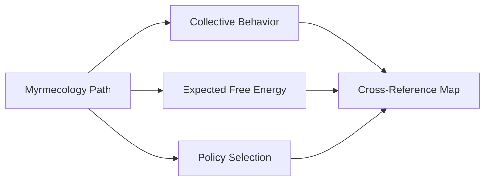
```mermaid

graph LR

  MYR[Myrmecology Path] --> CB[Collective Behavior]

  MYR --> EFE[Expected Free Energy]

  MYR --> PS[Policy Selection]

  CB --> CRM[Cross-Reference Map]

  EFE --> CRM

  PS --> CRM

```

## Version Control and Updates

### Version History

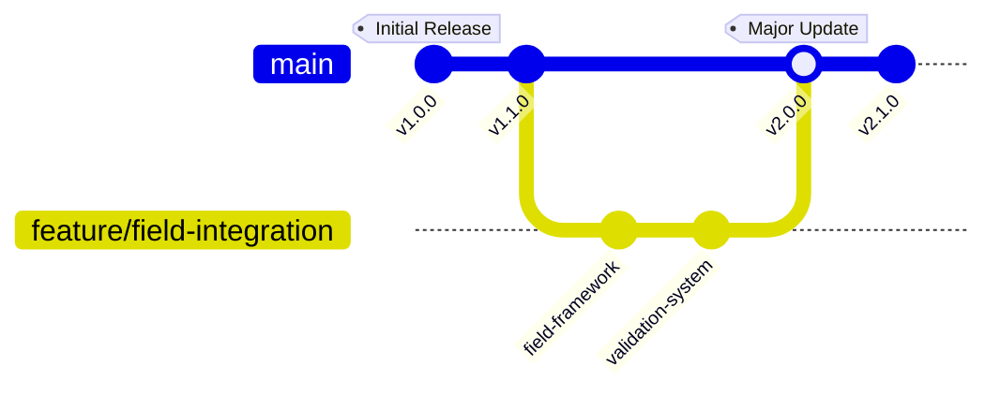
```mermaid

gitGraph

    commit id: "v1.0.0" tag: "Initial Release"

    commit id: "v1.1.0"

    branch feature/field-integration

    commit id: "field-framework"

    commit id: "validation-system"

    checkout main

    merge feature/field-integration id: "v2.0.0" tag: "Major Update"

    commit id: "v2.1.0"

```

### Change Management

#### Major Updates

- v2.0.0 (Current)

  - Enhanced field framework

  - Advanced colony models

  - Improved validation system

  - Updated career paths

- v1.1.0

  - Added field protocols

  - Enhanced documentation

  - New research projects

- v1.0.0

  - Initial curriculum

  - Basic framework

  - Core concepts

#### Planned Improvements

- Advanced colony models

- Field protocols

- Integration frameworks

- Research extensions

### Quality Metrics

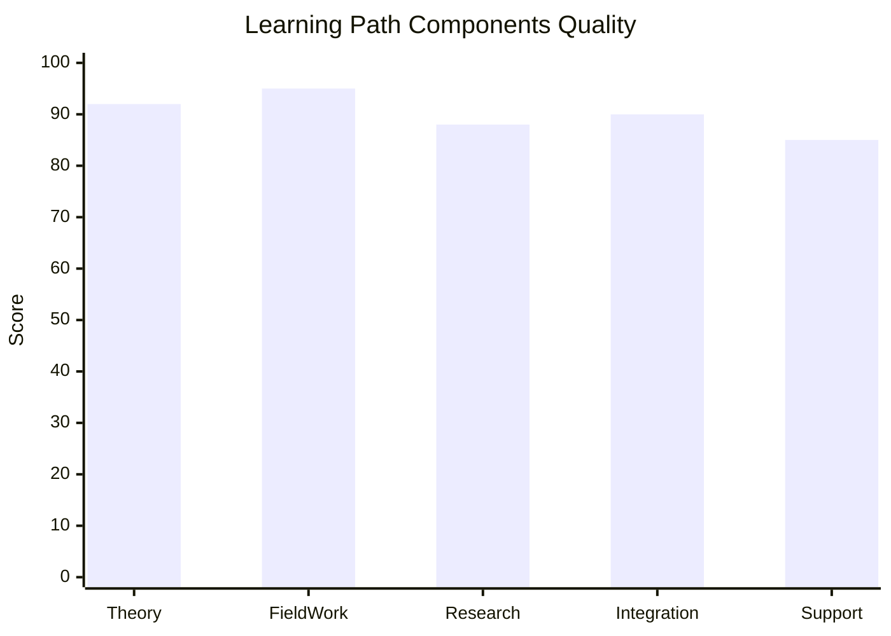
```mermaid

xychart-beta

    title "Learning Path Components Quality"

    x-axis [Theory, Field Work, Research, Integration, Support]

    y-axis "Score" 0 --> 100

    bar [92, 95, 88, 90, 85]

```

## Learning Analytics

### Progress Tracking

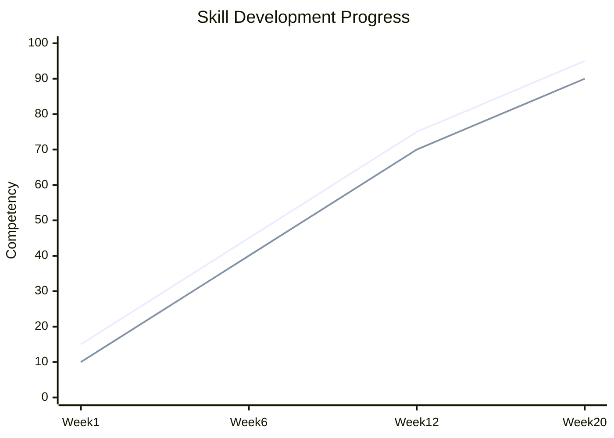
```mermaid

xychart-beta

    title "Skill Development Progress"

    x-axis [Week 1, Week 6, Week 12, Week 20]

    y-axis "Competency" 0 --> 100

    line [15, 45, 75, 95]

    line [10, 40, 70, 90]

```

### Performance Metrics

- Field Skills

  - Species identification

  - Field methods

  - Data collection

- Research Skills

  - Experimental design

  - Data analysis

  - Theory development

- Technical Skills

  - Model implementation

  - Data processing

  - Documentation

### Development Analytics

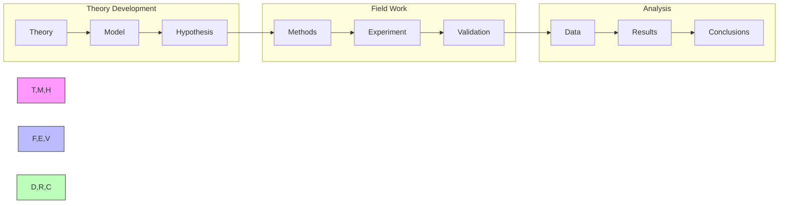
```mermaid

graph LR

    subgraph Theory Development

        T[Theory] --> M[Model]

        M --> H[Hypothesis]

    end

    subgraph Field Work

        F[Methods] --> E[Experiment]

        E --> V[Validation]

    end

    subgraph Analysis

        D[Data] --> R[Results]

        R --> C[Conclusions]

    end

    H --> F

    V --> D

    style T,M,H fill:#f9f,stroke:#333

    style F,E,V fill:#bbf,stroke:#333

    style D,R,C fill:#bfb,stroke:#333

```

## Final Notes

### Success Stories

- Research Impact

  - Novel discoveries

  - Method innovations

  - Field contributions

- Technical Achievements

  - Model implementations

  - Analysis tools

  - Field techniques

- Professional Growth

  - Research leadership

  - Field expertise

  - Community building

### Additional Resources

- Extended Reading

  - Advanced myrmecology

  - Field techniques

  - Analysis methods

- Research Directions

  - Open problems

  - Future applications

  - Integration opportunities

- Community Resources

  - Research groups

  - Field stations

  - Professional networks

### Contact Information

- Research Support

  - Principal investigators

  - Field coordinators

  - Research managers

- Technical Support

  - Analysis specialists

  - Tool developers

  - Equipment managers

- Field Support

  - Station managers

  - Field technicians

  - Collection managers

---

*This expanded learning path now incorporates deep cultural, historical, and natural history dimensions while maintaining its scientific and technical foundations. It celebrates both the wonder and rigor of myrmecological study.*
