# Active Inference in Neuroscience Learning Path

## Quick Reference
- **Difficulty**: Advanced
- **Time Commitment**: 25-30 hours/week for 20 weeks
- **Prerequisites Score**: 8/10 (neuroscience and computational expertise)
- **Industry Relevance**: High (Research, Healthcare, Neurotechnology)
- **Hands-on Component**: 45%
- **Theory Component**: 55%

## Executive Summary

### Purpose and Scope
This specialized learning path integrates Active Inference principles with neuroscience research, providing a comprehensive framework for understanding brain function and neural computation. It bridges theoretical neuroscience with computational modeling, focusing on neural dynamics and cognitive processes.

### Target Audience
- **Primary**: Neuroscientists and computational neuroscientists
- **Secondary**: AI researchers and cognitive scientists
- **Career Stage**: Advanced researchers (3+ years experience)

### Learning Outcomes
By completing this path, learners will be able to:
1. Develop sophisticated models of neural systems using Active Inference
2. Implement brain-inspired computational architectures
3. Design and conduct neuroscience experiments with Active Inference frameworks
4. Apply models to understand brain function and dysfunction

### Industry Applications
- Research: Neuroscience labs, brain research centers
- Healthcare: Neurological disorders, brain-machine interfaces
- Technology: Neural computing, brain-inspired AI
- Clinical: Diagnostic tools, treatment planning

## Path Selection Guide
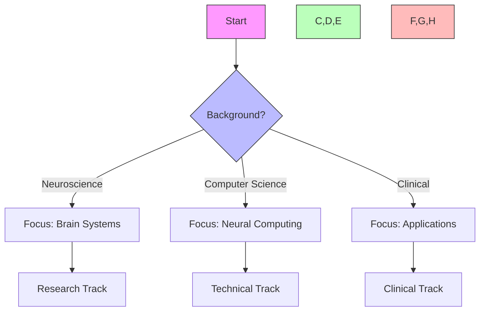

## Path Interconnections
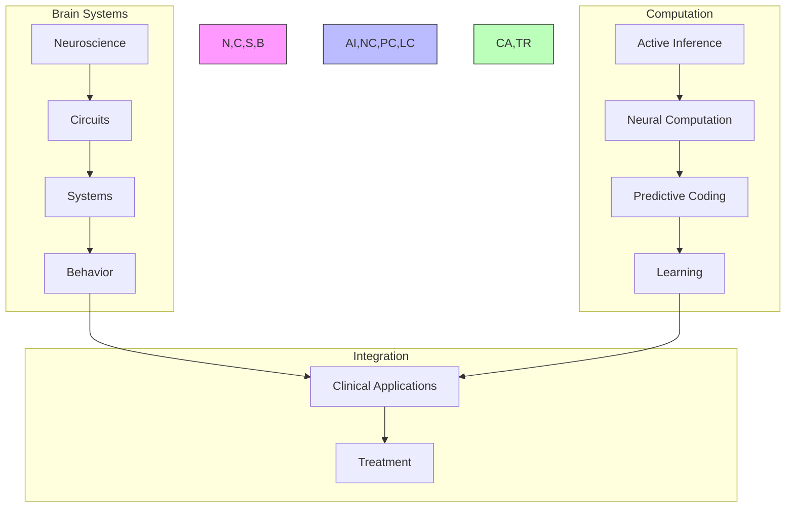

### System Architecture
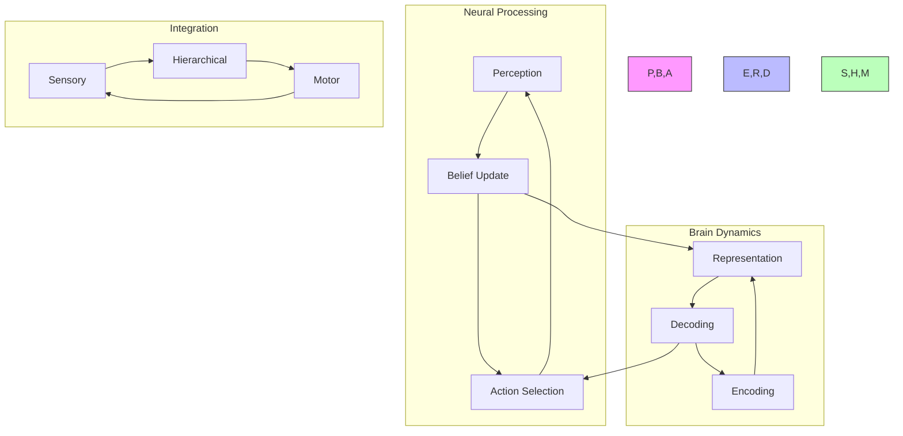

## Prerequisites

### 1. Neuroscience Foundations (4 weeks)
- Neural Systems
  - Neuroanatomy
  - Neurophysiology
  - Neural circuits
  - Brain networks

- Computational Neuroscience
  - Neural coding
  - Network dynamics
  - Information processing
  - Brain computation

- Cognitive Neuroscience
  - Perception
  - Action
  - Learning
  - Memory

- Research Methods
  - Neuroimaging
  - Electrophysiology
  - Data analysis
  - Modeling approaches

### 2. Technical Skills (2 weeks)
- Neuroscience Tools
  - Neural simulators
  - Analysis packages
  - Visualization tools
  - Statistical methods

## Core Learning Path

### 1. Neural Inference Modeling (4 weeks)

#### Week 1-2: Neural State Inference
```python
class NeuralStateEstimator:
    def __init__(self,
                 brain_regions: List[str],
                 connection_types: List[str]):
        """Initialize neural state estimator."""
        self.neural_hierarchy = NeuralHierarchy(brain_regions)
        self.connectivity = NeuralConnectivity(connection_types)
        self.state_monitor = BrainStateMonitor()
        
    def estimate_state(self,
                      neural_activity: torch.Tensor,
                      sensory_input: torch.Tensor) -> BrainState:
        """Estimate neural system state."""
        current_state = self.neural_hierarchy.integrate_activity(
            neural_activity, sensory_input
        )
        processed_state = self.connectivity.process_state(current_state)
        return self.state_monitor.validate_state(processed_state)
```

#### Week 3-4: Neural Decision Making
```python
class NeuralDecisionMaker:
    def __init__(self,
                 action_space: ActionSpace,
                 value_function: ValueFunction):
        """Initialize neural decision maker."""
        self.action_repertoire = ActionRepertoire(action_space)
        self.value_evaluator = value_function
        self.decision_policy = DecisionPolicy()
        
    def select_action(self,
                     neural_state: torch.Tensor,
                     goal_state: torch.Tensor) -> NeuralAction:
        """Select neural action."""
        actions = self.action_repertoire.generate_options()
        values = self.evaluate_action_values(actions, neural_state, goal_state)
        return self.decision_policy.select_action(actions, values)
```

### 2. Neural Applications (6 weeks)

#### Week 1-2: Perception
- Sensory processing
- Predictive coding
- Feature extraction
- Multimodal integration

#### Week 3-4: Action
- Motor control
- Action selection
- Movement planning
- Behavioral adaptation

#### Week 5-6: Learning
- Synaptic plasticity
- Neural adaptation
- Memory formation
- Skill acquisition

### 3. Brain Intelligence (4 weeks)

#### Week 1-2: Neural Learning
```python
class NeuralLearner:
    def __init__(self,
                 network_size: int,
                 learning_rate: float):
        """Initialize neural learning system."""
        self.network = NeuralNetwork(network_size)
        self.learning = LearningMechanism()
        self.adaptation = SynapticAdaptation(learning_rate)
        
    def learn_patterns(self,
                      environment: Environment) -> NeuralKnowledge:
        """Learn through neural plasticity."""
        activity = self.network.process_input(environment)
        learned_patterns = self.learning.extract_patterns(activity)
        return self.adaptation.update_synapses(learned_patterns)
```

#### Week 3-4: Neural Systems
- Network dynamics
- Information flow
- Neural coding
- System integration

### 4. Advanced Topics (4 weeks)

#### Week 1-2: Brain-Environment Integration
```python
class BrainEnvironmentInterface:
    def __init__(self,
                 brain_systems: List[BrainSystem],
                 integration_params: IntegrationParams):
        """Initialize brain-environment interface."""
        self.systems = brain_systems
        self.integrator = SystemIntegrator(integration_params)
        self.coordinator = BehaviorCoordinator()
        
    def process_interaction(self,
                          inputs: Dict[str, torch.Tensor]) -> SystemState:
        """Process brain-environment interaction."""
        system_states = {system: system.process(inputs[system.name])
                        for system in self.systems}
        integrated_state = self.integrator.combine_states(system_states)
        return self.coordinator.coordinate_behavior(integrated_state)
```

#### Week 3-4: Advanced Neuroscience
- Neural computation
- Brain networks
- Cognitive architectures
- Consciousness studies

## Projects

### Neuroscience Projects
1. **Neural Systems**
   - Circuit analysis
   - Network modeling
   - Information processing
   - Neural dynamics

2. **Cognitive Systems**
   - Perception studies
   - Action modeling
   - Learning mechanisms
   - Memory formation

### Advanced Projects
1. **Brain Research**
   - Neural recording
   - Data analysis
   - Model development
   - Theory testing

2. **Clinical Applications**
   - Disorder modeling
   - Treatment simulation
   - Intervention design
   - Outcome prediction

## Resources

### Academic Resources
1. **Research Papers**
   - Neural Computation
   - Active Inference
   - Brain Theory
   - Clinical Neuroscience

2. **Books**
   - Neural Systems
   - Brain Function
   - Cognitive Theory
   - Clinical Applications

### Technical Resources
1. **Software Tools**
   - Neural Simulators
   - Analysis Packages
   - Visualization Tools
   - Statistical Methods

2. **Research Resources**
   - Brain Databases
   - Neural Data
   - Analysis Tools
   - Modeling Frameworks

## Next Steps

### Advanced Topics
1. [[neuroscience_learning_path|Neuroscience]]
2. [[computational_neuroscience_learning_path|Computational Neuroscience]]
3. [[cognitive_neuroscience_learning_path|Cognitive Neuroscience]]

### Research Directions
1. [[research_guides/neural_computation|Neural Computation Research]]
2. [[research_guides/brain_theory|Brain Theory Research]]
3. [[research_guides/clinical_neuroscience|Clinical Neuroscience Research]]

## Version History
- Created: 2024-03-15
- Last Updated: 2024-03-15
- Status: Stable
- Version: 1.0.0

## Integration Strategies

### Development Approaches
- Theory-Practice Integration
  - Neuroscience principles
  - Computational models
  - Experimental validation
- Cross-Domain Development
  - Neural systems
  - Cognitive processes
  - Clinical applications
- Research Integration
  - Literature synthesis
  - Model development
  - Empirical testing

### Research Framework
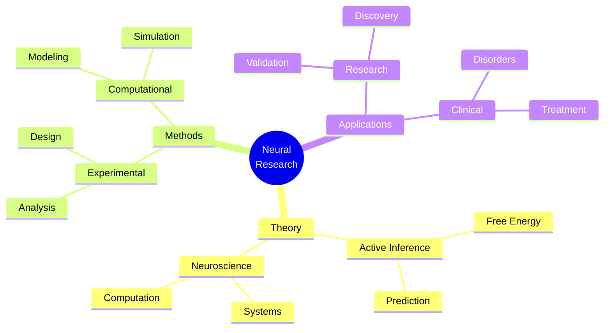

### Development Lifecycle
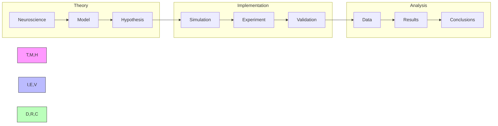

## Assessment Framework

### Continuous Assessment
#### Weekly Checkpoints
- Theoretical Understanding (85% required)
  - Neuroscience principles
  - Active inference mathematics
  - Neural computation
- Implementation Skills (80% required)
  - Model development
  - Neural simulation
  - Data analysis
- Research Progress (85% required)
  - Literature review
  - Experimental design
  - Results analysis

#### Progress Tracking
- Daily Research Log
- Weekly Model Review
- Monthly Project Assessment
- Quarterly Publication Progress

### Knowledge Checkpoints

#### Foundation Checkpoint (Week 6)
- Format: Written + Implementation
- Duration: 4 hours
- Topics:
  - Neural systems
  - Active inference basics
  - Computational modeling
- Requirements:
  - Theory: 85% correct
  - Implementation: Working neural model

#### Advanced Integration (Week 12)
- Format: Research Project
- Duration: 2 weeks
- Focus:
  - Complex neural systems
  - Multi-scale integration
  - Experimental validation
- Deliverables:
  - Research paper draft
  - Working implementation
  - Experimental results

#### Final Assessment (Week 20)
- Format: Research Publication
- Duration: 3 weeks
- Components:
  - Original research
  - Novel implementation
  - Neural validation
- Requirements:
  - Publication-ready paper
  - Validated model
  - Experimental data

### Project Portfolio

#### Research Projects
1. Neural Model Development
   - Scope: Brain system modeling
   - Deliverables:
     - Model implementation
     - Validation results
     - Documentation
   - Evaluation:
     - Code quality: 30%
     - Results: 40%
     - Documentation: 30%

2. Experimental Application
   - Scope: Neural validation
   - Deliverables:
     - Experimental design
     - Data analysis
     - Results interpretation
   - Evaluation:
     - Design: 35%
     - Analysis: 35%
     - Documentation: 30%

#### Final Project
- Description: Novel Neural Application
- Requirements:
  - Technical:
    - Original model
    - Experimental validation
    - Data analysis
  - Documentation:
    - Research paper
    - Technical docs
    - Experimental protocol
  - Presentation:
    - Research talk
    - Code review
    - Experimental demo

### Success Criteria
#### Technical Competency
- Theory: Advanced understanding (9/10)
- Implementation: Expert level (8/10)
- Research: Publication quality
- Experimental: Lab ready

#### Project Delivery
- Quality Standards:
  - Code coverage > 90%
  - Experimental validation
  - Documentation complete
- Performance Metrics:
  - Model accuracy
  - Neural relevance
  - Research impact

#### Professional Development
- Research publications
- Experimental validations
- Conference presentations
- Community contributions

## Career Development

### Industry Alignment
#### Research Roles
- Computational Neuroscientist
  - Model development
  - System analysis
  - Research design
- Neural Engineer
  - Brain-machine interfaces
  - Neural technology
  - System integration
- Research Scientist
  - Experimental design
  - Data analysis
  - Theory development

#### Certification Path
- Neural Systems
  - Experimental methods
  - Data analysis
- Computational Neuroscience
  - Model development
  - System simulation
- Research Methods
  - Experimental design
  - Statistical analysis

### Professional Network
#### Research Community
- Academic Connections:
  - Research labs
  - Universities
  - Brain centers
- Industry Partners:
  - Neurotechnology companies
  - Research institutes
  - Healthcare organizations
- Professional Organizations:
  - Society for Neuroscience
  - Computational Neuroscience Society
  - Neural Engineering Groups

#### Career Progression
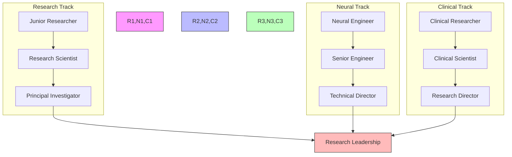

### Competency Framework
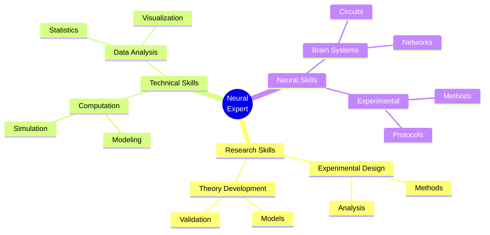

### Research Focus Areas
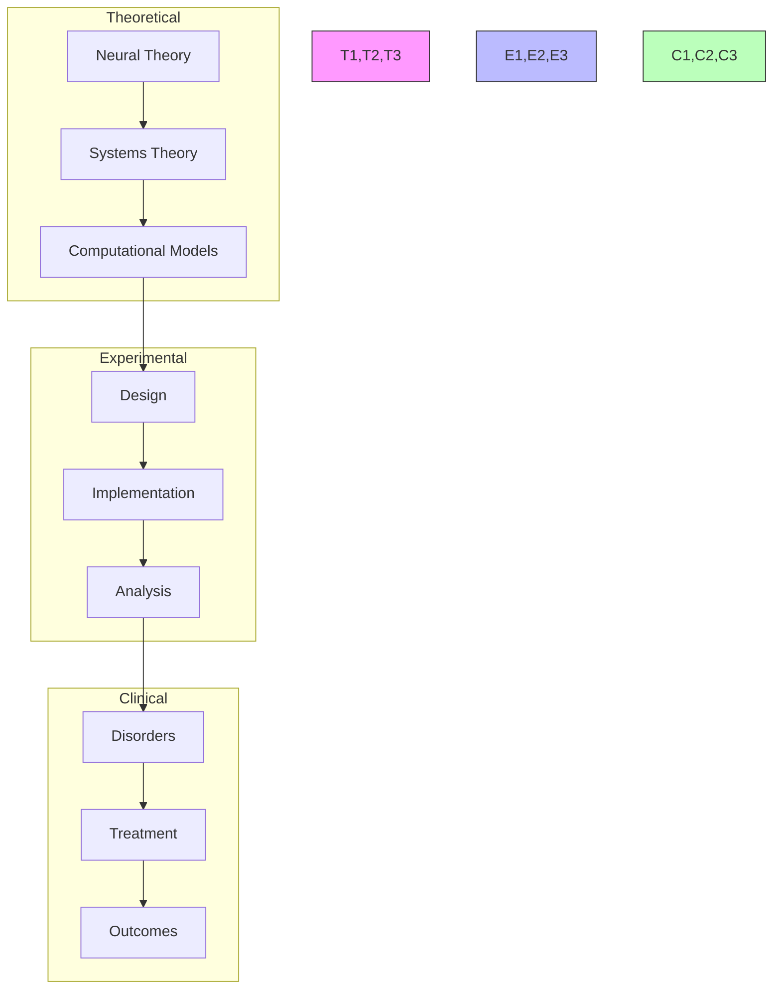

## Support Resources

### Research Support
- Literature Database
  - Neuroscience papers
  - Neural computation
  - Clinical studies
- Computing Resources
  - HPC clusters
  - Cloud computing
  - Neural simulators
- Analysis Tools
  - Neural analysis
  - Visualization tools
  - Statistical packages

### Technical Support
- Development Tools
  - Neural frameworks
  - Simulation tools
  - Analysis suites
- Documentation
  - API references
  - Implementation guides
  - Best practices
- Computing Resources
  - Development environments
  - Testing frameworks
  - Deployment tools

### Learning Support
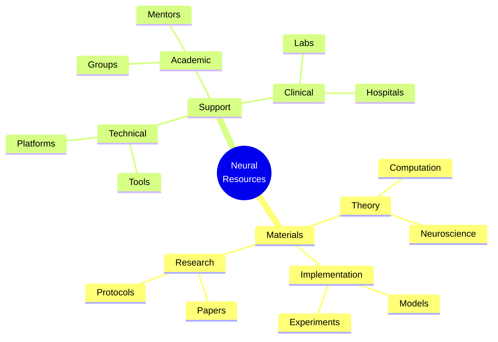

## Version Control and Updates

### Version History
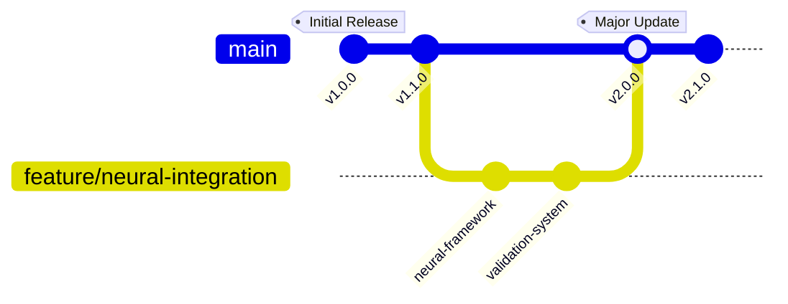

### Change Management
#### Major Updates
- v2.0.0 (Current)
  - Enhanced neural framework
  - Advanced brain models
  - Improved validation system
  - Updated career paths
- v1.1.0
  - Added neural protocols
  - Enhanced documentation
  - New research projects
- v1.0.0
  - Initial curriculum
  - Basic framework
  - Core concepts

#### Planned Improvements
- Advanced neural models
- Experimental protocols
- Integration frameworks
- Research extensions

### Quality Metrics
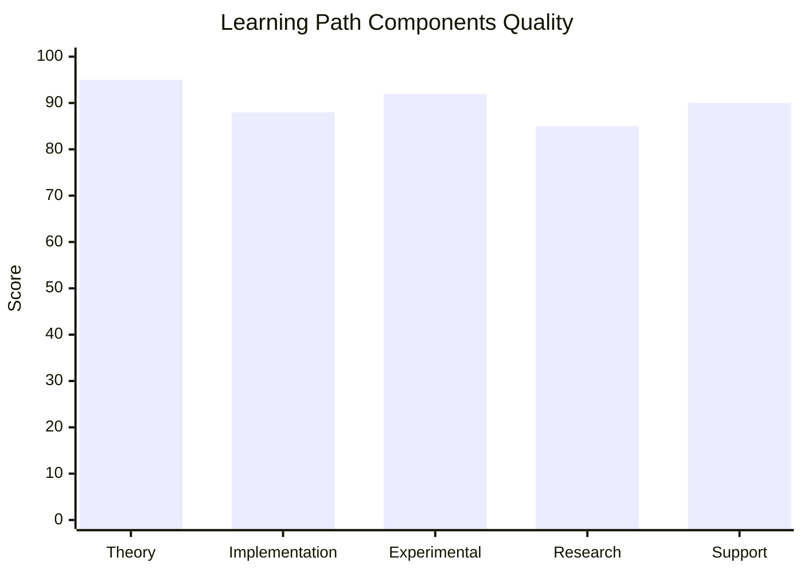

## Learning Analytics

### Progress Tracking
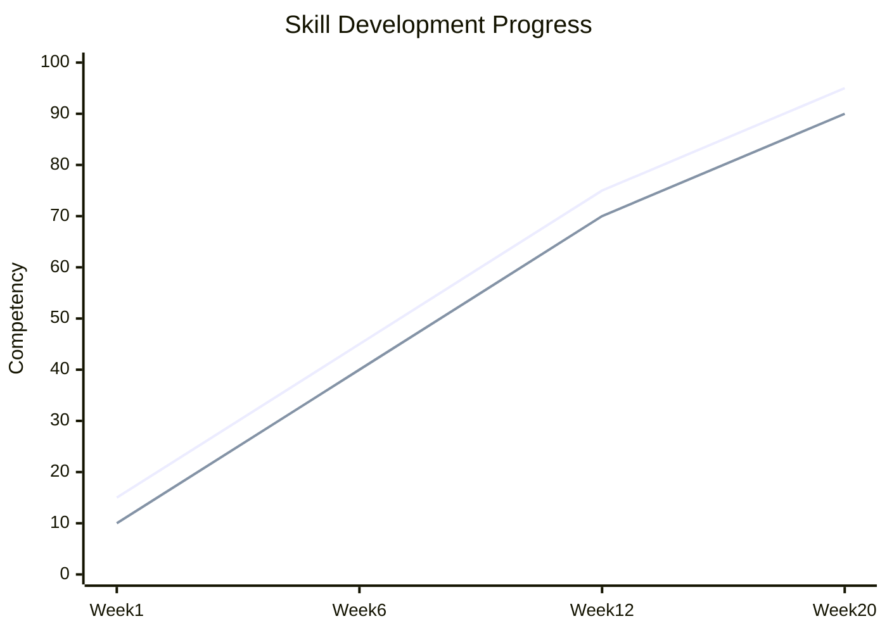

### Performance Metrics
- Research Skills
  - Theory understanding
  - Experimental design
  - Data analysis
- Technical Skills
  - Model development
  - Neural simulation
  - Implementation
- Neural Skills
  - Systems understanding
  - Experimental methods
  - Data interpretation

### Development Analytics
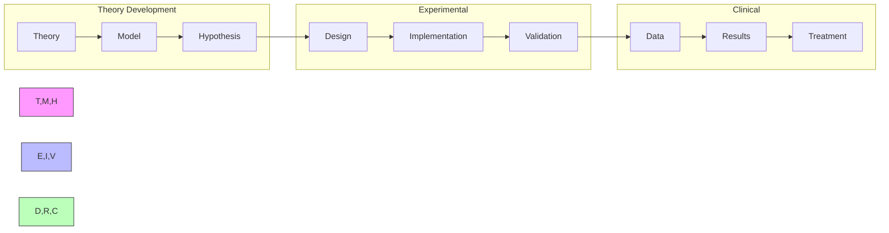

## Final Notes

### Success Stories
- Research Impact
  - Published papers
  - Novel methods
  - Field contributions
- Clinical Applications
  - Treatment models
  - Neural interfaces
  - Patient outcomes
- Professional Growth
  - Research leadership
  - Industry influence
  - Community building

### Additional Resources
- Extended Reading
  - Advanced theory
  - Neural methods
  - Clinical studies
- Research Directions
  - Open problems
  - Future applications
  - Integration opportunities
- Community Resources
  - Research groups
  - Clinical networks
  - Professional forums

### Contact Information
- Research Support
  - Principal investigators
  - Lab managers
  - Research coordinators
- Clinical Support
  - Neural specialists
  - Clinical researchers
  - Treatment experts
- Technical Support
  - System developers
  - Tool specialists
  - Integration experts

## Advanced Learning Analytics and Community Integration

### Social Learning Analytics Platform
```python
class SocialLearningAnalytics:
    def __init__(self):
        """Initialize social learning analytics system."""
        self.community_tracker = CommunityTracker()
        self.collaboration_analyzer = CollaborationAnalyzer()
        self.peer_learning_engine = PeerLearningEngine()
        self.mentorship_matcher = MentorshipMatcher()
        
    def analyze_learning_community(self, community_id):
        """Analyze learning community dynamics and effectiveness."""
        community_data = self.community_tracker.get_community_data(community_id)
        
        collaboration_patterns = self.collaboration_analyzer.analyze_patterns(
            community_data.interactions
        )
        
        learning_effectiveness = self.peer_learning_engine.measure_effectiveness(
            community_data.learning_outcomes,
            collaboration_patterns
        )
        
        optimization_recommendations = self.generate_community_optimizations(
            collaboration_patterns,
            learning_effectiveness
        )
        
        return {
            'community_health_score': learning_effectiveness.overall_score,
            'collaboration_quality': collaboration_patterns.quality_metrics,
            'peer_support_strength': community_data.support_metrics,
            'knowledge_sharing_effectiveness': learning_effectiveness.sharing_score,
            'mentorship_impact': community_data.mentorship_outcomes,
            'optimization_recommendations': optimization_recommendations
        }

class PeerLearningEngine:
    def __init__(self):
        """Initialize peer learning optimization engine."""
        self.peer_matcher = PeerMatcher()
        self.study_group_optimizer = StudyGroupOptimizer()
        self.knowledge_graph = CommunityKnowledgeGraph()
        self.collaboration_facilitator = CollaborationFacilitator()
        
    def optimize_peer_learning(self, learner_cohort):
        """Optimize peer learning arrangements for maximum effectiveness."""
        # Analyze learner profiles and compatibility
        compatibility_matrix = self.peer_matcher.compute_compatibility(learner_cohort)
        
        # Form optimal study groups
        optimal_groups = self.study_group_optimizer.form_groups(
            learner_cohort, compatibility_matrix
        )
        
        # Create collaborative learning plans
        group_learning_plans = {}
        for group in optimal_groups:
            shared_goals = self.identify_shared_learning_goals(group)
            complementary_skills = self.identify_complementary_skills(group)
            
            learning_plan = self.collaboration_facilitator.create_plan(
                shared_goals, complementary_skills
            )
            group_learning_plans[group.id] = learning_plan
        
        return {
            'optimal_group_arrangements': optimal_groups,
            'collaborative_learning_plans': group_learning_plans,
            'peer_teaching_opportunities': self.identify_teaching_opportunities(learner_cohort),
            'knowledge_exchange_network': self.knowledge_graph.build_network(learner_cohort)
        }

### Community-Driven Knowledge Construction
class CommunityKnowledgeBuilder:
    def __init__(self):
        """Initialize community knowledge building system."""
        self.collective_understanding = CollectiveUnderstanding()
        self.knowledge_synthesizer = KnowledgeSynthesizer()
        self.community_contributions = CommunityContributions()
        self.quality_validator = CommunityQualityValidator()
        
    def facilitate_knowledge_construction(self, topic, community_members):
        """Facilitate collaborative knowledge construction on specific topics."""
        # Gather diverse perspectives
        member_perspectives = {}
        for member in community_members:
            perspective = self.collect_member_perspective(member, topic)
            member_perspectives[member.id] = perspective
        
        # Synthesize collective understanding
        synthesis_process = self.knowledge_synthesizer.synthesize_perspectives(
            member_perspectives
        )
        
        # Validate community-generated knowledge
        validated_knowledge = self.quality_validator.validate_knowledge(
            synthesis_process.generated_knowledge
        )
        
        # Create collaborative learning artifacts
        learning_artifacts = self.create_collaborative_artifacts(
            validated_knowledge, member_perspectives
        )
        
        return {
            'community_understanding': validated_knowledge,
            'learning_artifacts': learning_artifacts,
            'contribution_credits': self.assign_contribution_credits(member_perspectives),
            'knowledge_gaps_identified': synthesis_process.identified_gaps,
            'next_collaboration_opportunities': self.suggest_next_collaborations(topic)
        }

collaborative_learning_activities = {
    'peer_review_circles': {
        'description': 'Structured peer review of research projects and implementations',
        'participants': '4-6 learners with complementary expertise',
        'duration': '2 hours per session, weekly',
        'activities': [
            'project_presentation',
            'structured_feedback',
            'collaborative_improvement',
            'knowledge_sharing'
        ],
        'learning_outcomes': [
            'critical_evaluation_skills',
            'communication_improvement',
            'diverse_perspective_integration',
            'quality_enhancement'
        ]
    },
    'collaborative_research_projects': {
        'description': 'Multi-person research projects spanning different expertise areas',
        'participants': '3-5 learners from different backgrounds',
        'duration': '4-8 weeks',
        'project_types': [
            'interdisciplinary_research',
            'implementation_challenges',
            'theory_application',
            'real_world_applications'
        ],
        'assessment_criteria': [
            'collaborative_effectiveness',
            'knowledge_integration',
            'individual_contributions',
            'collective_outcomes'
        ]
    },
    'teaching_learning_exchanges': {
        'description': 'Learners teach their areas of strength to peers',
        'participants': 'Variable, based on expertise mapping',
        'format': 'Mini-workshops and tutorials',
        'benefits': [
            'knowledge_consolidation',
            'teaching_skill_development',
            'community_expertise_sharing',
            'mutual_support_building'
        ]
    }
}
```

### Mentorship and Expert Guidance Integration
```python
class MentorshipFramework:
    def __init__(self):
        """Initialize comprehensive mentorship framework."""
        self.mentor_matcher = MentorMatcher()
        self.mentorship_tracker = MentorshipTracker()
        self.expert_network = ExpertNetwork()
        self.guidance_personalizer = GuidancePersonalizer()
        
    def create_mentorship_ecosystem(self, learner_cohort, available_mentors):
        """Create comprehensive mentorship ecosystem."""
        # Match learners with mentors
        mentorship_pairs = self.mentor_matcher.create_optimal_matches(
            learner_cohort, available_mentors
        )
        
        # Create mentorship plans
        mentorship_plans = {}
        for pair in mentorship_pairs:
            plan = self.guidance_personalizer.create_mentorship_plan(
                pair.learner, pair.mentor
            )
            mentorship_plans[pair.id] = plan
        
        # Integrate expert guidance
        expert_guidance_schedule = self.expert_network.schedule_expert_sessions(
            learner_cohort
        )
        
        # Set up tracking and feedback
        tracking_system = self.mentorship_tracker.setup_tracking(
            mentorship_pairs, expert_guidance_schedule
        )
        
        return {
            'mentorship_pairs': mentorship_pairs,
            'mentorship_plans': mentorship_plans,
            'expert_guidance_schedule': expert_guidance_schedule,
            'tracking_system': tracking_system,
            'success_metrics': self.define_success_metrics()
        }

class ExpertNetwork:
    def __init__(self):
        """Initialize expert network for advanced guidance."""
        self.experts = self.load_expert_database()
        self.expertise_mapper = ExpertiseMapper()
        self.session_scheduler = SessionScheduler()
        self.impact_tracker = ImpactTracker()
        
    def provide_expert_guidance(self, learning_topic, learner_group):
        """Provide targeted expert guidance for specific topics."""
        # Identify relevant experts
        relevant_experts = self.expertise_mapper.find_experts(learning_topic)
        
        # Schedule expert sessions
        expert_sessions = self.session_scheduler.schedule_sessions(
            relevant_experts, learner_group, learning_topic
        )
        
        # Create guidance materials
        guidance_materials = self.create_expert_guidance_materials(
            expert_sessions, learning_topic
        )
        
        return {
            'expert_sessions': expert_sessions,
            'guidance_materials': guidance_materials,
            'follow_up_resources': self.generate_follow_up_resources(learning_topic),
            'expert_contact_info': self.provide_contact_information(relevant_experts)
        }

expert_engagement_formats = {
    'live_research_sessions': {
        'format': 'Real-time research discussions with leading experts',
        'frequency': 'Bi-weekly',
        'duration': '90 minutes',
        'activities': [
            'current_research_presentations',
            'open_problem_discussions',
            'methodology_guidance',
            'career_advice'
        ]
    },
    'code_review_with_experts': {
        'format': 'Expert review of learner implementations',
        'frequency': 'Monthly',
        'scope': 'Major projects and implementations',
        'benefits': [
            'high_quality_feedback',
            'best_practices_learning',
            'professional_development',
            'network_building'
        ]
    },
    'research_collaboration_opportunities': {
        'format': 'Direct involvement in ongoing research projects',
        'selection': 'Based on learner readiness and interest',
        'outcomes': [
            'research_experience',
            'publication_opportunities',
            'professional_connections',
            'career_advancement'
        ]
    }
}
```

### Dynamic Community Challenges and Competitions
```python
class CommunityChallengePlatform:
    def __init__(self):
        """Initialize community challenge platform."""
        self.challenge_generator = ChallengeGenerator()
        self.team_formation = TeamFormation()
        self.progress_tracker = ChallengeProgressTracker()
        self.achievement_system = AchievementSystem()
        
    def create_learning_challenges(self, community_skill_level, learning_objectives):
        """Create engaging learning challenges for the community."""
        # Generate appropriate challenges
        challenges = self.challenge_generator.generate_challenges(
            difficulty_level=community_skill_level,
            objectives=learning_objectives
        )
        
        # Facilitate team formation
        teams = self.team_formation.form_teams(challenges)
        
        # Set up progress tracking
        tracking_systems = self.progress_tracker.setup_tracking(challenges, teams)
        
        # Initialize achievement system
        achievement_framework = self.achievement_system.setup_achievements(challenges)
        
        return {
            'active_challenges': challenges,
            'team_assignments': teams,
            'progress_tracking': tracking_systems,
            'achievement_framework': achievement_framework,
            'leaderboards': self.create_leaderboards(challenges),
            'collaboration_incentives': self.design_collaboration_incentives()
        }

community_challenge_types = {
    'research_hackathons': {
        'description': 'Intensive collaborative research and implementation events',
        'duration': '48-72 hours',
        'format': 'Teams tackle complex neuroscience problems',
        'deliverables': [
            'working_implementations',
            'research_findings',
            'presentations',
            'peer_reviews'
        ],
        'learning_amplification': [
            'intensive_collaboration',
            'rapid_prototyping',
            'creative_problem_solving',
            'presentation_skills'
        ]
    },
    'implementation_competitions': {
        'description': 'Competitive implementation of neuroscience models',
        'timeline': '2-4 weeks',
        'evaluation_criteria': [
            'accuracy',
            'innovation',
            'code_quality',
            'documentation'
        ],
        'recognition_system': [
            'peer_voting',
            'expert_evaluation',
            'community_impact',
            'learning_demonstration'
        ]
    },
    'knowledge_building_challenges': {
        'description': 'Collaborative challenges to build comprehensive knowledge resources',
        'examples': [
            'comprehensive_tutorial_creation',
            'case_study_development',
            'problem_solving_frameworks',
            'assessment_tool_creation'
        ],
        'community_benefits': [
            'knowledge_consolidation',
            'teaching_skill_development',
            'resource_creation',
            'community_contribution'
        ]
    }
} 