---

title: Active Inference in Neuroscience Learning Path

type: learning_path

status: stable

created: 2024-03-15

modified: 2024-03-15

version: 2.0.0

complexity: advanced

processing_priority: 1

authors:

  - name: Cognitive Systems Team

    role: Research & Development

difficulty_level: advanced

estimated_hours: 500

completion_time: "20 weeks"

certification_track: true

tags:

  - active-inference

  - neuroscience

  - brain-modeling

  - neural-computation

  - cognitive-neuroscience

  - neuroimaging

  - neural-dynamics

semantic_relations:

  - type: specializes

    links: [[active_inference_learning_path]]

  - type: relates

    links:


---

# Active Inference in Neuroscience Learning Path

## Quick Start

- Select a neural domain (perception/action/learning) and outline an inference model at circuit level

- Validate a small predictive coding example; compare to a classical baseline

- Draft an experimental mapping plan (signals, measures, expected effects)

## External Web Resources

- [[index#centralized-external-web-resources|Centralized resources hub]]

- Active Inference Institute resources and neuroimaging best practices (see hub)

### Foundations

- [[knowledge_base/mathematics/expected_free_energy]] · [[knowledge_base/mathematics/policy_selection]] · [[knowledge_base/mathematics/precision_parameter]] · [[knowledge_base/mathematics/softmax_function]] · [[knowledge_base/mathematics/numerical_stability]] · [[knowledge_base/mathematics/message_passing]] · [[knowledge_base/mathematics/bethe_free_energy]]

## Quick Reference

- **Difficulty**: Advanced

- **Time Commitment**: 25-30 hours/week for 20 weeks

- **Prerequisites Score**: 8/10 (neuroscience and computational expertise)

- **Industry Relevance**: High (Research, Healthcare, Neurotechnology)

- **Hands-on Component**: 45%

- **Theory Component**: 55%

## Executive Summary

### Purpose and Scope

This specialized learning path integrates Active Inference principles with neuroscience research, providing a comprehensive framework for understanding brain function and neural computation. It bridges theoretical neuroscience with computational modeling, focusing on neural dynamics and cognitive processes.

### Target Audience

- **Primary**: Neuroscientists and computational neuroscientists

- **Secondary**: AI researchers and cognitive scientists

- **Career Stage**: Advanced researchers (3+ years experience)

### Learning Outcomes

By completing this path, learners will be able to:

1. Develop sophisticated models of neural systems using Active Inference

1. Implement brain-inspired computational architectures

1. Design and conduct neuroscience experiments with Active Inference frameworks

1. Apply models to understand brain function and dysfunction

### Industry Applications

- Research: Neuroscience labs, brain research centers

- Healthcare: Neurological disorders, brain-machine interfaces

- Technology: Neural computing, brain-inspired AI

- Clinical: Diagnostic tools, treatment planning

## Path Selection Guide

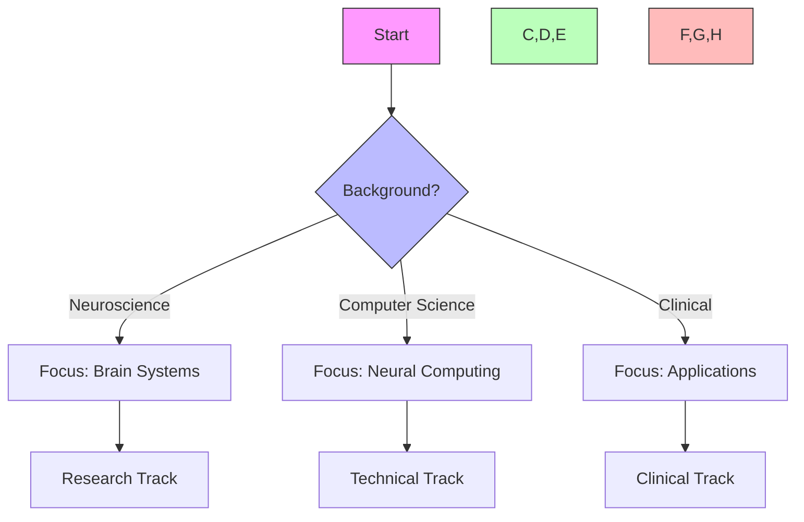
```mermaid

flowchart TD

    A[Start] --> B{Background?}

    B -->|Neuroscience| C[Focus: Brain Systems]

    B -->|Computer Science| D[Focus: Neural Computing]

    B -->|Clinical| E[Focus: Applications]

    C --> F[Research Track]

    D --> G[Technical Track]

    E --> H[Clinical Track]

    style A fill:#f9f,stroke:#333

    style B fill:#bbf,stroke:#333

    style C,D,E fill:#bfb,stroke:#333

    style F,G,H fill:#fbb,stroke:#333

```

## Path Interconnections

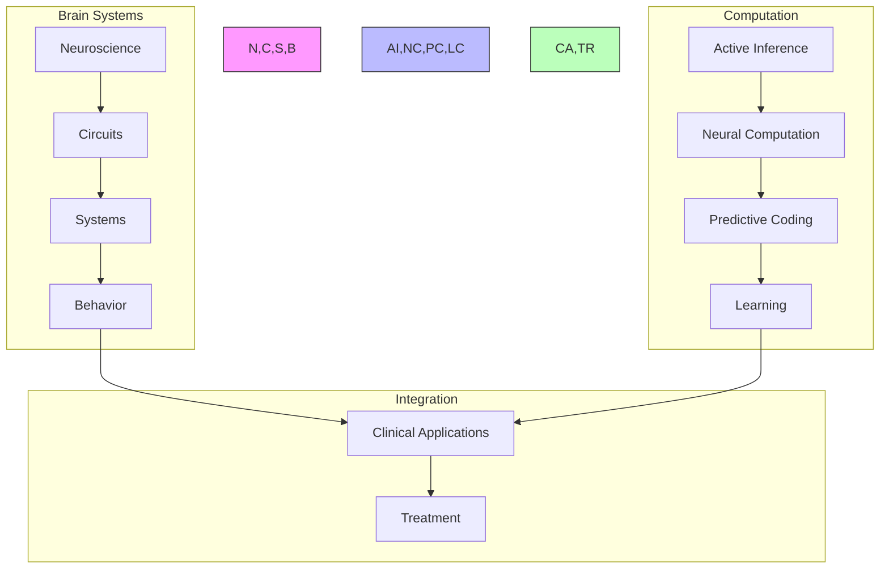
```mermaid

graph TB

    subgraph Brain Systems

        N[Neuroscience] --> C[Circuits]

        C --> S[Systems]

        S --> B[Behavior]

    end

    subgraph Computation

        AI[Active Inference] --> NC[Neural Computation]

        NC --> PC[Predictive Coding]

        PC --> LC[Learning]

    end

    subgraph Integration

        B --> CA[Clinical Applications]

        LC --> CA

        CA --> TR[Treatment]

    end

    style N,C,S,B fill:#f9f,stroke:#333

    style AI,NC,PC,LC fill:#bbf,stroke:#333

    style CA,TR fill:#bfb,stroke:#333

```

### System Architecture

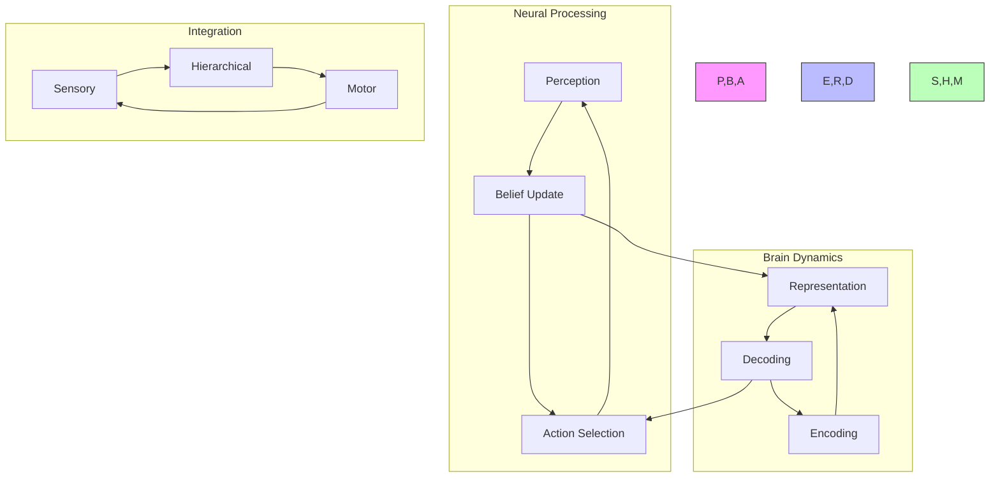
```mermaid

graph TB

    subgraph Neural Processing

        P[Perception] --> B[Belief Update]

        B --> A[Action Selection]

        A --> P

    end

    subgraph Brain Dynamics

        E[Encoding] --> R[Representation]

        R --> D[Decoding]

        D --> E

    end

    subgraph Integration

        S[Sensory] --> H[Hierarchical]

        H --> M[Motor]

        M --> S

    end

    B --> R

    D --> A

    style P,B,A fill:#f9f,stroke:#333

    style E,R,D fill:#bbf,stroke:#333

    style S,H,M fill:#bfb,stroke:#333

```

## Prerequisites

### 1. Neuroscience Foundations (4 weeks)

- Neural Systems

  - Neuroanatomy

  - Neurophysiology

  - Neural circuits

  - Brain networks

- Computational Neuroscience

  - Neural coding

  - Network dynamics

  - Information processing

  - Brain computation

- Cognitive Neuroscience

  - Perception

  - Action

  - Learning

  - Memory

- Research Methods

  - Neuroimaging

  - Electrophysiology

  - Data analysis

  - Modeling approaches

### 2. Technical Skills (2 weeks)

- Neuroscience Tools

  - Neural simulators

  - Analysis packages

  - Visualization tools

  - Statistical methods

## Core Learning Path

### 1. Neural Inference Modeling (4 weeks)

#### Week 1-2: Neural State Inference


#### Week 3-4: Neural Decision Making


### 2. Neural Applications (6 weeks)

#### Week 1-2: Perception

- Sensory processing

- Predictive coding

- Feature extraction

- Multimodal integration

#### Week 3-4: Action

- Motor control

- Action selection

- Movement planning

- Behavioral adaptation

#### Week 5-6: Learning

- Synaptic plasticity

- Neural adaptation

- Memory formation

- Skill acquisition

### 3. Brain Intelligence (4 weeks)

#### Week 1-2: Neural Learning


#### Week 3-4: Neural Systems

- Network dynamics

- Information flow

- Neural coding

- System integration

### 4. Advanced Topics (4 weeks)

#### Week 1-2: Brain-Environment Integration


#### Week 3-4: Advanced Neuroscience

- Neural computation

- Brain networks

- Cognitive architectures

- Consciousness studies

## Projects

### Neuroscience Projects

1. **Neural Systems**

   - Circuit analysis

   - Network modeling

   - Information processing

   - Neural dynamics

1. **Cognitive Systems**

   - Perception studies

   - Action modeling

   - Learning mechanisms

   - Memory formation

### Advanced Projects

1. **Brain Research**

   - Neural recording

   - Data analysis

   - Model development

   - Theory testing

1. **Clinical Applications**

   - Disorder modeling

   - Treatment simulation

   - Intervention design

   - Outcome prediction

## Resources

### Academic Resources

1. **Research Papers**

   - Neural Computation

   - Active Inference

   - Brain Theory

   - Clinical Neuroscience

1. **Books**

   - Neural Systems

   - Brain Function

   - Cognitive Theory

   - Clinical Applications

### Technical Resources

1. **Software Tools**

   - Neural Simulators

   - Analysis Packages

   - Visualization Tools

   - Statistical Methods

1. **Research Resources**

   - Brain Databases

   - Neural Data

   - Analysis Tools

   - Modeling Frameworks

## Next Steps

### Advanced Topics

1. Neuroscience

1. Computational Neuroscience

1. Cognitive Neuroscience

### Research Directions

1. [[knowledge_base/cognitive/neural_computation|Neural Computation Research]]

1. [[knowledge_base/research/brain_theory|Brain Theory Research]]

1. [[knowledge_base/research/clinical_neuroscience|Clinical Neuroscience Research]]

## Version History

- Created: 2024-03-15

- Last Updated: 2024-03-15

- Status: Stable

- Version: 1.0.0

## Integration Strategies

### Development Approaches

- Theory-Practice Integration

  - Neuroscience principles

  - Computational models

  - Experimental validation

- Cross-Domain Development

  - Neural systems

  - Cognitive processes

  - Clinical applications

- Research Integration

  - Literature synthesis

  - Model development

  - Empirical testing

### Research Framework

```mermaid

mindmap

    root((Neural

    Research))

        Theory

            Active Inference

                Free Energy

                Prediction

            Neuroscience

                Systems

                Computation

        Methods

            Experimental

                Design

                Analysis

            Computational

                Modeling

                Simulation

        Applications

            Clinical

                Disorders

                Treatment

            Research

                Discovery

                Validation

```

### Development Lifecycle

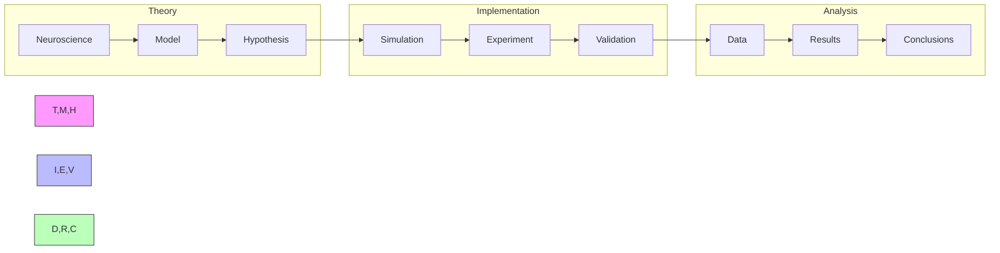
```mermaid

graph LR

    subgraph Theory

        T[Neuroscience] --> M[Model]

        M --> H[Hypothesis]

    end

    subgraph Implementation

        I[Simulation] --> E[Experiment]

        E --> V[Validation]

    end

    subgraph Analysis

        D[Data] --> R[Results]

        R --> C[Conclusions]

    end

    H --> I

    V --> D

    style T,M,H fill:#f9f,stroke:#333

    style I,E,V fill:#bbf,stroke:#333

    style D,R,C fill:#bfb,stroke:#333

```

## Assessment Framework

### Continuous Assessment

#### Weekly Checkpoints

- Theoretical Understanding (85% required)

  - Neuroscience principles

  - Active inference mathematics

  - Neural computation

- Implementation Skills (80% required)

  - Model development

  - Neural simulation

  - Data analysis

- Research Progress (85% required)

  - Literature review

  - Experimental design

  - Results analysis

#### Progress Tracking

- Daily Research Log

- Weekly Model Review

- Monthly Project Assessment

- Quarterly Publication Progress

### Knowledge Checkpoints

#### Foundation Checkpoint (Week 6)

- Format: Written + Implementation

- Duration: 4 hours

- Topics:

  - Neural systems

  - Active inference basics

  - Computational modeling

- Requirements:

  - Theory: 85% correct

  - Implementation: Working neural model

#### Advanced Integration (Week 12)

- Format: Research Project

- Duration: 2 weeks

- Focus:

  - Complex neural systems

  - Multi-scale integration

  - Experimental validation

- Deliverables:

  - Research paper draft

  - Working implementation

  - Experimental results

#### Final Assessment (Week 20)

- Format: Research Publication

- Duration: 3 weeks

- Components:

  - Original research

  - Novel implementation

  - Neural validation

- Requirements:

  - Publication-ready paper

  - Validated model

  - Experimental data

### Project Portfolio

#### Research Projects

1. Neural Model Development

   - Scope: Brain system modeling

   - Deliverables:

     - Model implementation

     - Validation results

     - Documentation

   - Evaluation:

     - Code quality: 30%

     - Results: 40%

     - Documentation: 30%

1. Experimental Application

   - Scope: Neural validation

   - Deliverables:

     - Experimental design

     - Data analysis

     - Results interpretation

   - Evaluation:

     - Design: 35%

     - Analysis: 35%

     - Documentation: 30%

#### Final Project

- Description: Novel Neural Application

- Requirements:

  - Technical:

    - Original model

    - Experimental validation

    - Data analysis

  - Documentation:

    - Research paper

    - Technical docs

    - Experimental protocol

  - Presentation:

    - Research talk

    - Code review

    - Experimental demo

### Success Criteria

#### Technical Competency

- Theory: Advanced understanding (9/10)

- Implementation: Expert level (8/10)

- Research: Publication quality

- Experimental: Lab ready

#### Project Delivery

- Quality Standards:

  - Code coverage > 90%

  - Experimental validation

  - Documentation complete

- Performance Metrics:

  - Model accuracy

  - Neural relevance

  - Research impact

#### Professional Development

- Research publications

- Experimental validations

- Conference presentations

- Community contributions

## Career Development

### Industry Alignment

#### Research Roles

- Computational Neuroscientist

  - Model development

  - System analysis

  - Research design

- Neural Engineer

  - Brain-machine interfaces

  - Neural technology

  - System integration

- Research Scientist

  - Experimental design

  - Data analysis

  - Theory development

#### Certification Path

- Neural Systems

  - Experimental methods

  - Data analysis

- Computational Neuroscience

  - Model development

  - System simulation

- Research Methods

  - Experimental design

  - Statistical analysis

### Professional Network

#### Research Community

- Academic Connections:

  - Research labs

  - Universities

  - Brain centers

- Industry Partners:

  - Neurotechnology companies

  - Research institutes

  - Healthcare organizations

- Professional Organizations:

  - Society for Neuroscience

  - Computational Neuroscience Society

  - Neural Engineering Groups

#### Career Progression

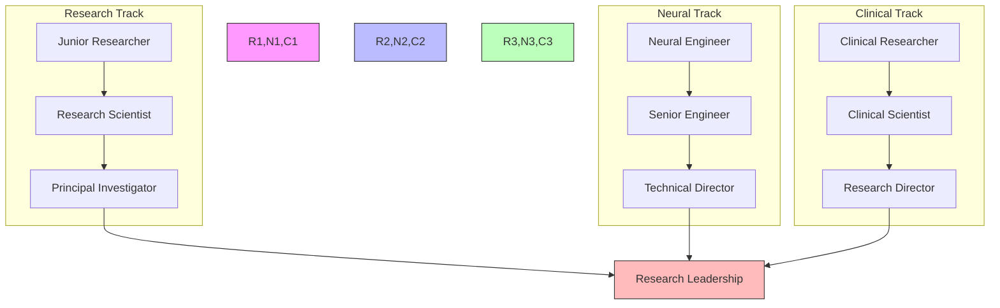
```mermaid

graph TB

    subgraph Research Track

        R1[Junior Researcher] --> R2[Research Scientist]

        R2 --> R3[Principal Investigator]

    end

    subgraph Neural Track

        N1[Neural Engineer] --> N2[Senior Engineer]

        N2 --> N3[Technical Director]

    end

    subgraph Clinical Track

        C1[Clinical Researcher] --> C2[Clinical Scientist]

        C2 --> C3[Research Director]

    end

    R3 --> L[Research Leadership]

    N3 --> L

    C3 --> L

    style R1,N1,C1 fill:#f9f,stroke:#333

    style R2,N2,C2 fill:#bbf,stroke:#333

    style R3,N3,C3 fill:#bfb,stroke:#333

    style L fill:#fbb,stroke:#333

```

### Competency Framework

```mermaid

mindmap

    root((Neural

    Expert))

        Research Skills

            Experimental Design

                Methods

                Analysis

            Theory Development

                Models

                Validation

        Technical Skills

            Computation

                Modeling

                Simulation

            Data Analysis

                Statistics

                Visualization

        Neural Skills

            Brain Systems

                Circuits

                Networks

            Experimental

                Methods

                Protocols

```

### Research Focus Areas

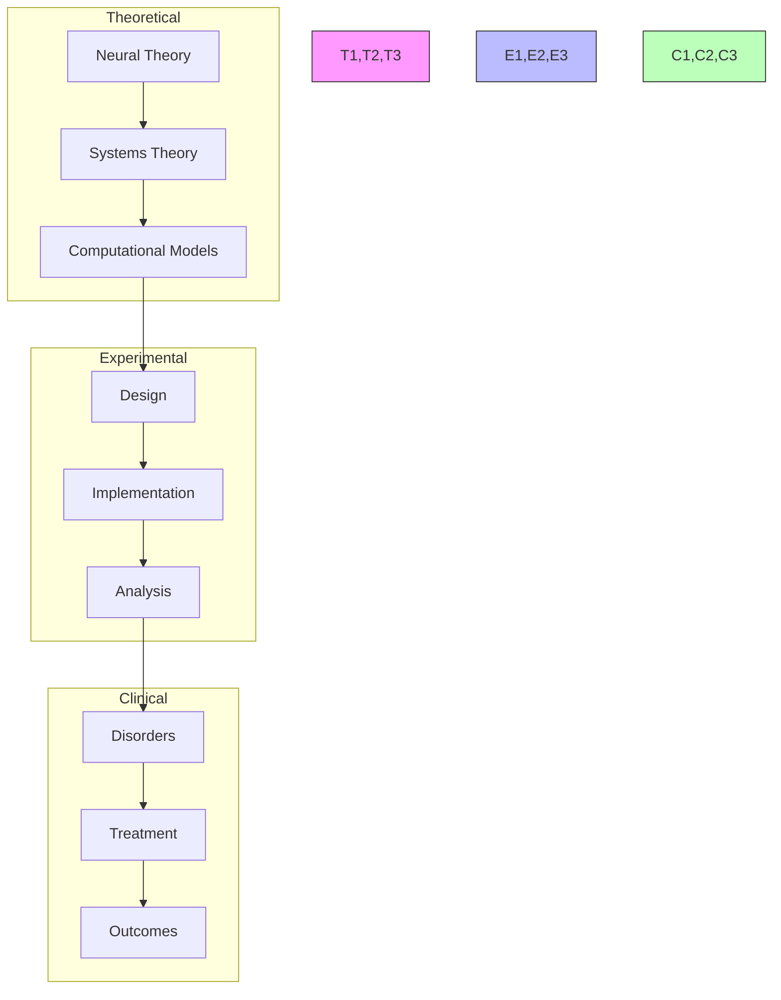
```mermaid

graph TB

    subgraph Theoretical

        T1[Neural Theory] --> T2[Systems Theory]

        T2 --> T3[Computational Models]

    end

    subgraph Experimental

        E1[Design] --> E2[Implementation]

        E2 --> E3[Analysis]

    end

    subgraph Clinical

        C1[Disorders] --> C2[Treatment]

        C2 --> C3[Outcomes]

    end

    T3 --> E1

    E3 --> C1

    style T1,T2,T3 fill:#f9f,stroke:#333

    style E1,E2,E3 fill:#bbf,stroke:#333

    style C1,C2,C3 fill:#bfb,stroke:#333

```

## Support Resources

### Research Support

- Literature Database

  - Neuroscience papers

  - Neural computation

  - Clinical studies

- Computing Resources

  - HPC clusters

  - Cloud computing

  - Neural simulators

- Analysis Tools

  - Neural analysis

  - Visualization tools

  - Statistical packages

### Technical Support

- Development Tools

  - Neural frameworks

  - Simulation tools

  - Analysis suites

- Documentation

  - API references

  - Implementation guides

  - Best practices

- Computing Resources

  - Development environments

  - Testing frameworks

  - Deployment tools

### Learning Support

```mermaid

mindmap

    root((Neural

    Resources))

        Materials

            Theory

                Neuroscience

                Computation

            Implementation

                Models

                Experiments

            Research

                Papers

                Protocols

        Support

            Technical

                Tools

                Platforms

            Academic

                Mentors

                Groups

            Clinical

                Labs

                Hospitals

```

## Version Control and Updates

### Version History

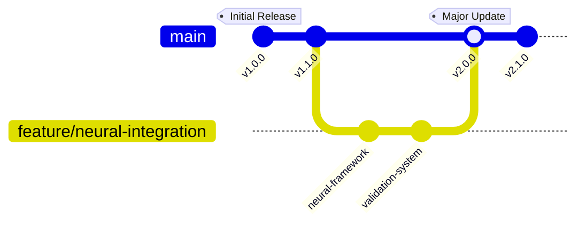
```mermaid

gitGraph

    commit id: "v1.0.0" tag: "Initial Release"

    commit id: "v1.1.0"

    branch feature/neural-integration

    commit id: "neural-framework"

    commit id: "validation-system"

    checkout main

    merge feature/neural-integration id: "v2.0.0" tag: "Major Update"

    commit id: "v2.1.0"

```

### Change Management

#### Major Updates

- v2.0.0 (Current)

  - Enhanced neural framework

  - Advanced brain models

  - Improved validation system

  - Updated career paths

- v1.1.0

  - Added neural protocols

  - Enhanced documentation

  - New research projects

- v1.0.0

  - Initial curriculum

  - Basic framework

  - Core concepts

#### Planned Improvements

- Advanced neural models

- Experimental protocols

- Integration frameworks

- Research extensions

### Quality Metrics

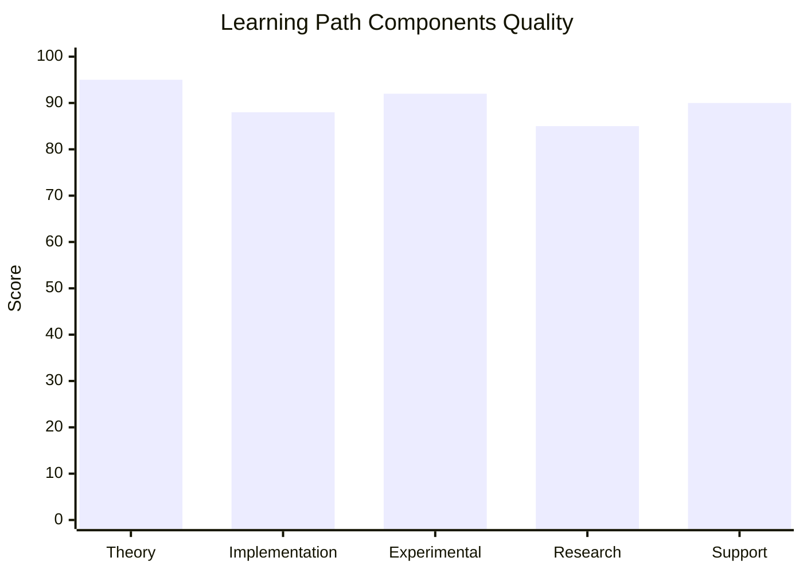
```mermaid

xychart-beta

    title "Learning Path Components Quality"

    x-axis [Theory, Implementation, Experimental, Research, Support]

    y-axis "Score" 0 --> 100

    bar [95, 88, 92, 85, 90]

```

## Learning Analytics

### Progress Tracking

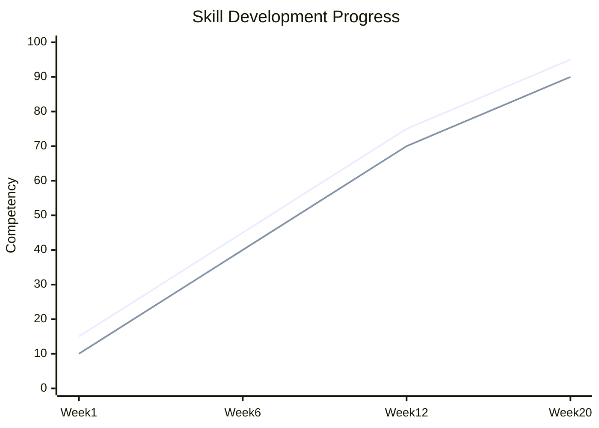
```mermaid

xychart-beta

    title "Skill Development Progress"

    x-axis [Week 1, Week 6, Week 12, Week 20]

    y-axis "Competency" 0 --> 100

    line [15, 45, 75, 95]

    line [10, 40, 70, 90]

```

### Performance Metrics

- Research Skills

  - Theory understanding

  - Experimental design

  - Data analysis

- Technical Skills

  - Model development

  - Neural simulation

  - Implementation

- Neural Skills

  - Systems understanding

  - Experimental methods

  - Data interpretation

### Development Analytics

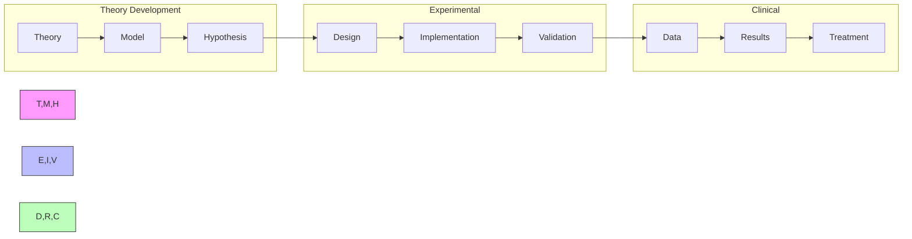
```mermaid

graph LR

    subgraph Theory Development

        T[Theory] --> M[Model]

        M --> H[Hypothesis]

    end

    subgraph Experimental

        E[Design] --> I[Implementation]

        I --> V[Validation]

    end

    subgraph Clinical

        D[Data] --> R[Results]

        R --> C[Treatment]

    end

    H --> E

    V --> D

    style T,M,H fill:#f9f,stroke:#333

    style E,I,V fill:#bbf,stroke:#333

    style D,R,C fill:#bfb,stroke:#333

```

## Final Notes

### Success Stories

- Research Impact

  - Published papers

  - Novel methods

  - Field contributions

- Clinical Applications

  - Treatment models

  - Neural interfaces

  - Patient outcomes

- Professional Growth

  - Research leadership

  - Industry influence

  - Community building

### Additional Resources

- Extended Reading

  - Advanced theory

  - Neural methods

  - Clinical studies

- Research Directions

  - Open problems

  - Future applications

  - Integration opportunities

- Community Resources

  - Research groups

  - Clinical networks

  - Professional forums

### Contact Information

- Research Support

  - Principal investigators

  - Lab managers

  - Research coordinators

- Clinical Support

  - Neural specialists

  - Clinical researchers

  - Treatment experts

- Technical Support

  - System developers

  - Tool specialists

  - Integration experts

## Advanced Learning Analytics and Community Integration

### Social Learning Analytics Platform


### Mentorship and Expert Guidance Integration


### Dynamic Community Challenges and Competitions

## Knowledge Base Anchors

- Neuroscience: [[knowledge_base/cognitive/predictive_coding]] · [[knowledge_base/cognitive/neural_plasticity]]

- Math: [[knowledge_base/mathematics/message_passing]] · [[knowledge_base/mathematics/information_theory]]

- Cross-map: [[knowledge_base/mathematics/cross_reference_map]]

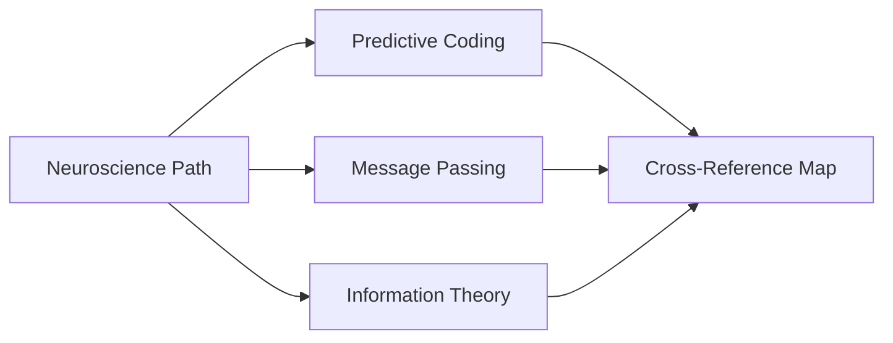
```mermaid

graph LR

  NEURO[Neuroscience Path] --> PC[Predictive Coding]

  NEURO --> MP[Message Passing]

  NEURO --> IT[Information Theory]

  PC --> CRM[Cross-Reference Map]

  MP --> CRM

  IT --> CRM

```

```python

class CommunityChallengePlatform:

    def __init__(self):

        """Initialize community challenge platform."""

        self.challenge_generator = ChallengeGenerator()

        self.team_formation = TeamFormation()

        self.progress_tracker = ChallengeProgressTracker()

        self.achievement_system = AchievementSystem()

    def create_learning_challenges(self, community_skill_level, learning_objectives):

        """Create engaging learning challenges for the community."""

        # Generate appropriate challenges

        challenges = self.challenge_generator.generate_challenges(

            difficulty_level=community_skill_level,

            objectives=learning_objectives

        )

        # Facilitate team formation

        teams = self.team_formation.form_teams(challenges)

        # Set up progress tracking

        tracking_systems = self.progress_tracker.setup_tracking(challenges, teams)

        # Initialize achievement system

        achievement_framework = self.achievement_system.setup_achievements(challenges)

        return {

            'active_challenges': challenges,

            'team_assignments': teams,

            'progress_tracking': tracking_systems,

            'achievement_framework': achievement_framework,

            'leaderboards': self.create_leaderboards(challenges),

            'collaboration_incentives': self.design_collaboration_incentives()

        }

community_challenge_types = {

    'research_hackathons': {

        'description': 'Intensive collaborative research and implementation events',

        'duration': '48-72 hours',

        'format': 'Teams tackle complex neuroscience problems',

        'deliverables': [

            'working_implementations',

            'research_findings',

            'presentations',

            'peer_reviews'

        ],

        'learning_amplification': [

            'intensive_collaboration',

            'rapid_prototyping',

            'creative_problem_solving',

            'presentation_skills'

        ]

    },

    'implementation_competitions': {

        'description': 'Competitive implementation of neuroscience models',

        'timeline': '2-4 weeks',

        'evaluation_criteria': [

            'accuracy',

            'innovation',

            'code_quality',

            'documentation'

        ],

        'recognition_system': [

            'peer_voting',

            'expert_evaluation',

            'community_impact',

            'learning_demonstration'

        ]

    },

    'knowledge_building_challenges': {

        'description': 'Collaborative challenges to build comprehensive knowledge resources',

        'examples': [

            'comprehensive_tutorial_creation',

            'case_study_development',

            'problem_solving_frameworks',

            'assessment_tool_creation'

        ],

        'community_benefits': [

            'knowledge_consolidation',

            'teaching_skill_development',

            'resource_creation',

            'community_contribution'

        ]

    }

}
