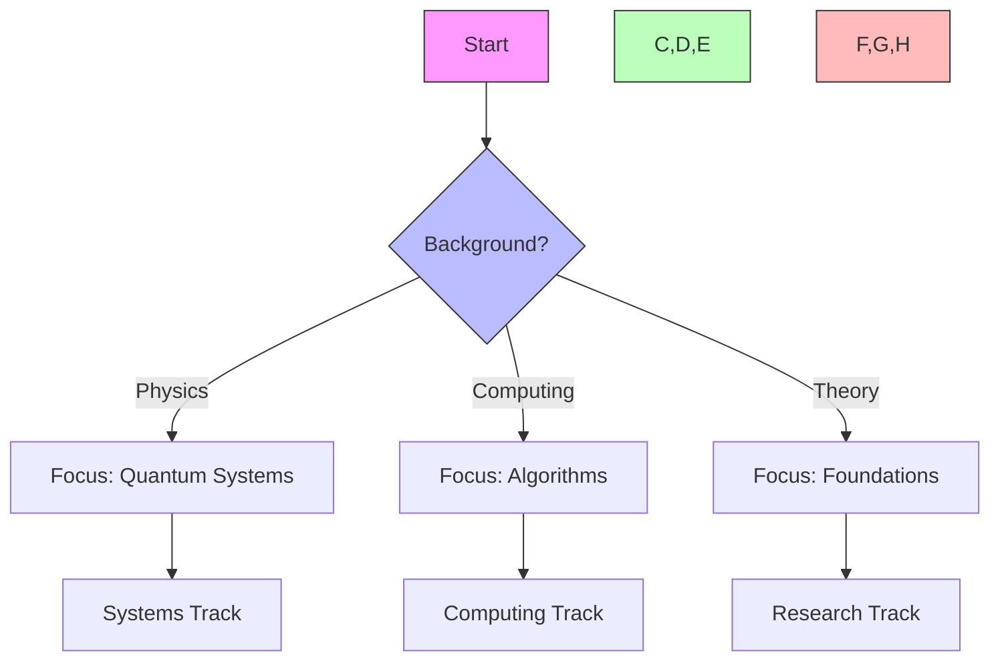
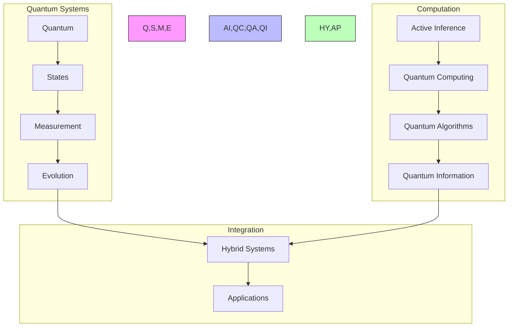
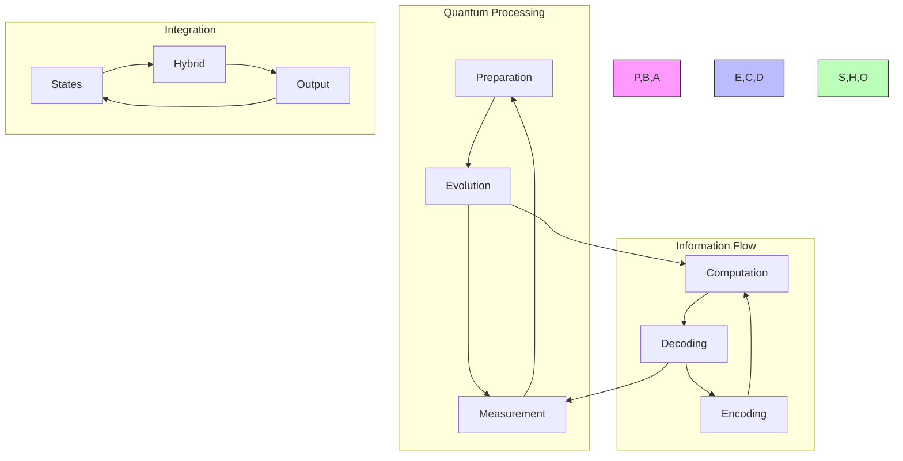
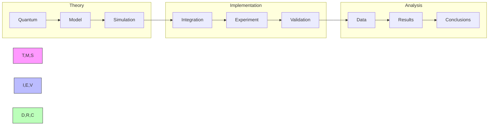
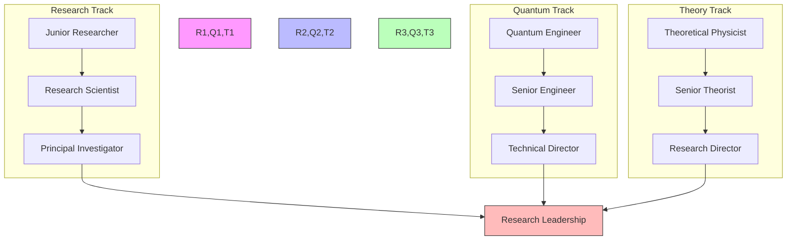
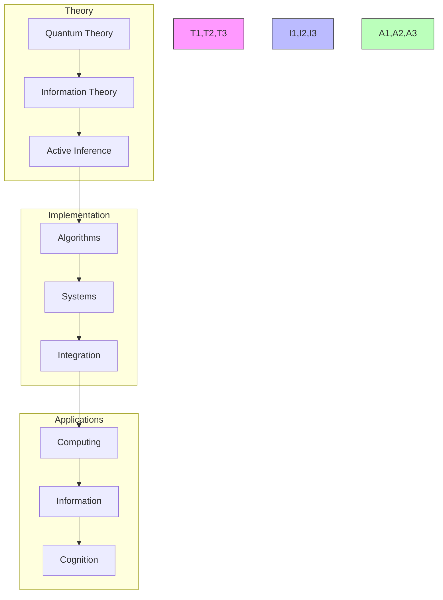
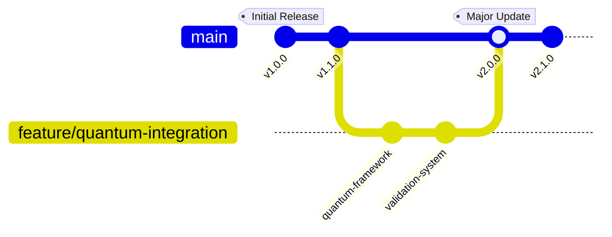
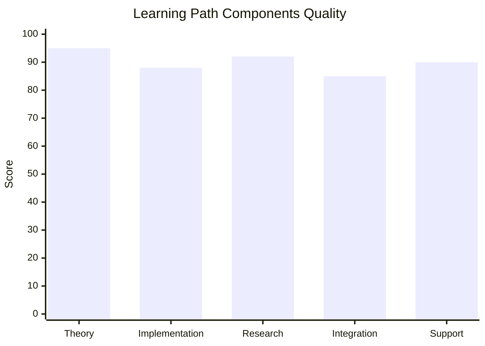
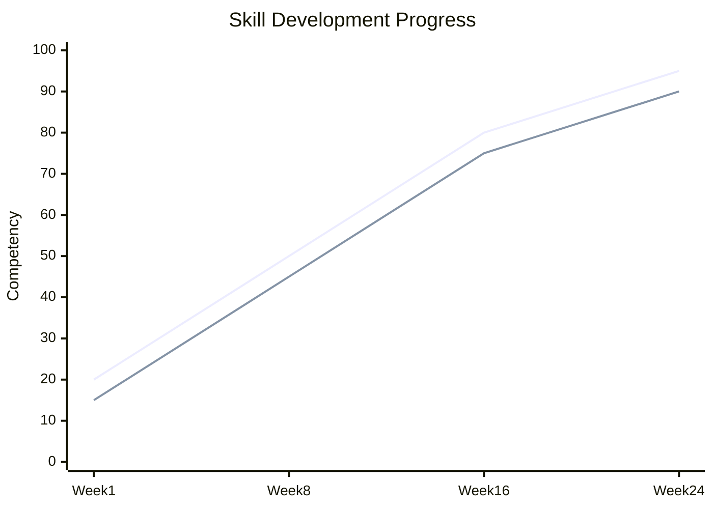
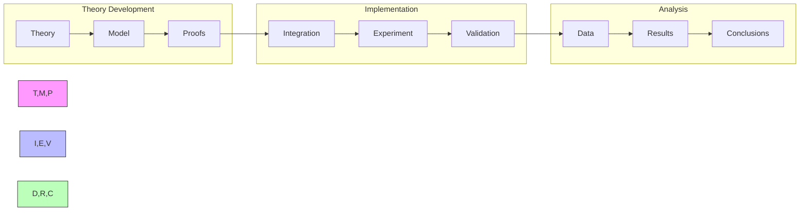

---

title: Active Inference in Quantum Systems Learning Path

type: learning_path

status: stable

created: 2024-03-15

modified: 2024-03-15

version: 3.0.0

complexity: expert

processing_priority: 1

authors:

  - name: Cognitive Systems Team

    role: Research & Development

difficulty_level: expert

estimated_hours: 600

completion_time: "25 weeks"

certification_track: true

tags:

  - active-inference

  - quantum-computing

  - quantum-machine-learning

  - quantum-cognition

  - information-theory

  - quantum-dynamics

  - enterprise-integration

semantic_relations:

  - type: specializes

    links: [[active_inference_learning_path]]

  - type: relates

    links:

      - [[quantum_computing_learning_path]]

      - [[quantum_machine_learning_path]]

      - [[information_theory_learning_path]]

---

# Active Inference in Quantum Systems Learning Path

## Quick Start

- Refresh core texts (Friston 2010; Parr et al. 2022) and the overview “Demystified and Compared”

- Install Qiskit; implement a toy quantum decision process and reflect on inference/measurement

- Map where quantum resources plausibly help (encoding, sampling, optimization) vs. where classical is adequate

## External Web Resources

- [Centralized resources hub](./index.md#centralized-external-web-resources)

- Qiskit documentation: [qiskit.org/documentation](https://qiskit.org/documentation/)

- Quantum cognition review (Pothos & Busemeyer, 2013): Psychological Bulletin (overview entry): [APA PsycNet](https://psycnet.apa.org/record/2013-06753-001)

- Active Inference Institute resources: [activeinference.org](https://www.activeinference.org/research/resources)

## Quick Reference

- **Difficulty**: Expert

- **Time Commitment**: 25-30 hours/week for 25 weeks

- **Prerequisites Score**: 9/10 (quantum physics and advanced mathematics)

- **Industry Relevance**: Emerging Critical (Quantum Computing, Tech Industry)

- **Hands-on Component**: 40%

- **Theory Component**: 60%

## Executive Summary

### Purpose and Scope

This cutting-edge learning path explores the intersection of Active Inference and quantum systems, providing theoretical foundations and practical implementation skills for quantum-enhanced cognitive computing. The curriculum bridges quantum mechanics with information theory and cognitive architectures, preparing learners for the emerging quantum computing industry.

### Target Audience

- **Primary**: Quantum computing researchers and quantum algorithm developers

- **Secondary**: Theoretical physicists and advanced AI researchers

- **Career Stage**: Expert-level practitioners (5+ years quantum/AI experience)

### Learning Outcomes

By completing this path, learners will be able to:

1. Develop quantum algorithms implementing Active Inference principles

1. Design quantum-enhanced cognitive architectures

1. Apply quantum machine learning to cognitive modeling

1. Create quantum information processing systems for intelligence applications

### Industry Applications

- Technology: Quantum computing platforms, quantum AI

- Research: Quantum cognition, quantum information theory

- Finance: Quantum optimization, quantum risk modeling

- Defense: Quantum communication, quantum sensing

## Industry Integration and Real-World Application Framework

### Enterprise Partnership Network

```python

class EnterprisePartnershipManager:

    def __init__(self):

        """Initialize enterprise partnership management system."""

        self.industry_partners = IndustryPartnerRegistry()

        self.project_matcher = ProjectMatcher()

        self.internship_coordinator = InternshipCoordinator()

        self.transition_support = ProfessionalTransitionSupport()

    def facilitate_industry_integration(self, learner_cohort):

        """Facilitate comprehensive industry integration for learners."""

        # Identify industry partnership opportunities

        partnership_opportunities = self.industry_partners.find_opportunities(

            learner_skills=learner_cohort.collective_skills,

            industry_needs=self.assess_industry_needs(),

            project_types=['research_collaboration', 'pilot_projects', 'internships']

        )

        # Match learners with appropriate opportunities

        learner_matches = {}

        for learner in learner_cohort:

            matches = self.project_matcher.find_matches(

                learner_profile=learner,

                opportunities=partnership_opportunities,

                match_criteria=['skill_alignment', 'career_goals', 'location_preference']

            )

            learner_matches[learner.id] = matches

        # Coordinate internship placements

        internship_placements = self.internship_coordinator.arrange_internships(

            learner_matches,

            duration_preferences=['summer', 'semester', 'year_long'],

            compensation_types=['paid', 'research_credit', 'project_based']

        )

        # Set up transition support

        transition_programs = self.transition_support.create_programs(

            learner_cohort,

            target_roles=['quantum_researcher', 'quantum_engineer', 'quantum_consultant'],

            support_types=['mentorship', 'networking', 'interview_prep']

        )

        return {

            'partnership_opportunities': partnership_opportunities,

            'learner_opportunity_matches': learner_matches,

            'internship_placements': internship_placements,

            'transition_support_programs': transition_programs,

            'industry_network_access': self.provide_network_access(),

            'ongoing_collaboration_framework': self.setup_ongoing_collaboration()

        }

class IndustryPartnerRegistry:

    def __init__(self):

        """Initialize industry partner registry."""

        self.quantum_companies = self.load_quantum_companies()

        self.research_institutions = self.load_research_institutions()

        self.tech_giants = self.load_tech_giants()

        self.startups = self.load_quantum_startups()

    def get_comprehensive_partner_network(self):

        """Get comprehensive network of industry partners."""

        return {

            'quantum_hardware_companies': {

                'ibm_quantum': {

                    'partnership_type': 'strategic',

                    'available_opportunities': [

                        'quantum_algorithm_research',

                        'quantum_cognition_projects',

                        'qiskit_development',

                        'quantum_education_initiatives'

                    ],

                    'resources_provided': [

                        'quantum_hardware_access',

                        'technical_mentorship',

                        'research_funding',

                        'publication_opportunities'

                    ],

                    'learner_requirements': {

                        'skill_level': 'advanced',

                        'quantum_knowledge': 'intermediate+',

                        'programming_skills': 'python_qiskit'

                    }

                },

                'google_quantum': {

                    'partnership_type': 'research_collaboration',

                    'focus_areas': [

                        'quantum_supremacy_applications',

                        'quantum_machine_learning',

                        'quantum_error_correction',

                        'quantum_algorithms'

                    ],

                    'collaboration_formats': [

                        'joint_research_projects',

                        'visiting_researcher_programs',

                        'conference_presentations',

                        'open_source_contributions'

                    ]

                },

                'rigetti_computing': {

                    'partnership_type': 'practical_application',

                    'opportunities': [

                        'quantum_cloud_computing',

                        'hybrid_algorithms',

                        'quantum_advantage_demonstrations',

                        'commercial_applications'

                    ]

                }

            },

            'quantum_software_companies': {

                'cambridge_quantum_computing': {

                    'specialization': 'quantum_software_development',

                    'collaboration_areas': [

                        'quantum_nlp',

                        'quantum_machine_learning',

                        'quantum_optimization',

                        'quantum_cryptography'

                    ]

                },

                'xanadu': {

                    'specialization': 'photonic_quantum_computing',

                    'opportunities': [

                        'pennylane_development',

                        'quantum_machine_learning_research',

                        'continuous_variable_systems'

                    ]

                }

            },

            'research_institutions': {

                'quantum_information_labs': [

                    'mit_center_for_quantum_engineering',

                    'stanford_quantum_information_lab',

                    'oxford_quantum_computing',

                    'waterloo_institute_for_quantum_computing'

                ],

                'collaboration_types': [

                    'joint_research_projects',

                    'visiting_scholar_programs',

                    'shared_equipment_access',

                    'co_supervised_dissertations'

                ]

            }

        }

### Real-World Project Implementation Framework

class RealWorldProjectFramework:

    def __init__(self):

        """Initialize real-world project implementation framework."""

        self.project_pipeline = ProjectPipeline()

        self.stakeholder_manager = StakeholderManager()

        self.impact_assessor = ImpactAssessor()

        self.commercialization_support = CommercializationSupport()

    def implement_industry_project(self, project_proposal, industry_partner):

        """Implement real-world project with industry partner."""

        # Project planning and scoping

        project_plan = self.project_pipeline.create_project_plan(

            proposal=project_proposal,

            partner_requirements=industry_partner.requirements,

            resource_constraints=industry_partner.resource_allocation,

            timeline_constraints=industry_partner.timeline

        )

        # Stakeholder engagement

        stakeholder_engagement = self.stakeholder_manager.engage_stakeholders(

            internal_stakeholders=['learners', 'instructors', 'researchers'],

            external_stakeholders=industry_partner.stakeholder_list,

            engagement_frequency='bi_weekly',

            communication_channels=['video_calls', 'progress_reports', 'demos']

        )

        # Implementation with impact tracking

        implementation_process = self.execute_with_tracking(

            project_plan,

            stakeholder_engagement,

            success_metrics=project_proposal.success_criteria

        )

        # Assess real-world impact

        impact_assessment = self.impact_assessor.assess_impact(

            project_outcomes=implementation_process.outcomes,

            industry_metrics=industry_partner.impact_metrics,

            learning_outcomes=implementation_process.learning_data

        )

        # Support commercialization if applicable

        commercialization_pathway = self.commercialization_support.assess_pathway(

            project_outcomes=implementation_process.outcomes,

            market_potential=impact_assessment.market_analysis,

            intellectual_property=implementation_process.ip_analysis

        )

        return {

            'project_implementation': implementation_process,

            'stakeholder_satisfaction': stakeholder_engagement.satisfaction_metrics,

            'real_world_impact': impact_assessment,

            'commercialization_potential': commercialization_pathway,

            'learning_value': implementation_process.educational_impact,

            'future_collaboration_opportunities': self.identify_future_opportunities()

        }

industry_project_categories = {

    'quantum_optimization_applications': {

        'partner_types': ['financial_institutions', 'logistics_companies', 'energy_companies'],

        'project_examples': [

            {

                'title': 'Quantum Portfolio Optimization for Asset Management',

                'industry_partner': 'major_investment_bank',

                'duration': '6 months',

                'learner_involvement': '3-4 advanced learners',

                'deliverables': [

                    'quantum_algorithm_implementation',

                    'performance_comparison_study',

                    'scalability_analysis',

                    'commercial_viability_assessment'

                ],

                'real_world_constraints': [

                    'regulatory_compliance',

                    'data_privacy_requirements',

                    'performance_benchmarks',

                    'cost_effectiveness'

                ],

                'success_metrics': [

                    'optimization_quality_improvement',

                    'computational_time_reduction',

                    'risk_adjusted_returns',

                    'implementation_feasibility'

                ]

            },

            {

                'title': 'Quantum Supply Chain Optimization',

                'industry_partner': 'global_logistics_company',

                'challenge': 'Optimize complex multi-modal supply chains with uncertainty',

                'quantum_advantage': [

                    'exponential_search_space',

                    'uncertainty_quantification',

                    'real_time_adaptation',

                    'multi_objective_optimization'

                ],

                'implementation_phases': [

                    'problem_formulation',

                    'quantum_algorithm_design',

                    'simulation_validation',

                    'pilot_deployment'

                ]

            }

        ]

    },

    'quantum_machine_learning_applications': {

        'partner_types': ['tech_companies', 'healthcare_organizations', 'research_labs'],

        'focus_areas': [

            'quantum_enhanced_ai',

            'quantum_pattern_recognition',

            'quantum_data_analysis',

            'quantum_feature_mapping'

        ],

        'implementation_approach': [

            'hybrid_classical_quantum',

            'near_term_quantum_algorithms',

            'error_mitigation_strategies',

            'scalability_planning'

        ]

    },

    'quantum_sensing_applications': {

        'partner_types': ['defense_contractors', 'medical_device_companies', 'research_institutions'],

        'applications': [

            'quantum_enhanced_imaging',

            'precision_measurement',

            'quantum_radar',

            'quantum_gravimetry'

        ]

    }

}

```

### Professional Transition and Career Development

```python

class ProfessionalTransitionFramework:

    def __init__(self):

        """Initialize professional transition framework."""

        self.career_assessor = CareerAssessor()

        self.skill_mapper = SkillMapper()

        self.network_builder = NetworkBuilder()

        self.placement_facilitator = PlacementFacilitator()

    def facilitate_career_transition(self, learner, target_role):

        """Facilitate comprehensive career transition for learners."""

        # Assess current career position

        career_assessment = self.career_assessor.assess_position(

            current_skills=learner.skill_profile,

            experience_level=learner.experience,

            career_goals=learner.career_objectives,

            market_conditions=self.get_market_analysis()

        )

        # Map skill gaps and development needs

        skill_analysis = self.skill_mapper.analyze_gaps(

            current_skills=learner.skill_profile,

            target_role_requirements=target_role.skill_requirements,

            industry_standards=target_role.industry.skill_standards

        )

        # Build professional network

        network_development = self.network_builder.develop_network(

            learner_profile=learner,

            target_industry=target_role.industry,

            networking_strategies=['conferences', 'online_communities', 'mentorship'],

            relationship_building_plan=self.create_relationship_plan()

        )

        # Facilitate job placement

        placement_support = self.placement_facilitator.provide_support(

            learner_profile=learner,

            skill_development_plan=skill_analysis.development_plan,

            network_connections=network_development.connections,

            placement_strategies=['direct_application', 'referrals', 'project_showcase']

        )

        return {

            'career_transition_plan': career_assessment.transition_plan,

            'skill_development_roadmap': skill_analysis.development_plan,

            'professional_network': network_development.network_map,

            'placement_strategy': placement_support.strategy,

            'success_probability': placement_support.success_probability,

            'timeline_estimate': placement_support.timeline,

            'ongoing_support_plan': self.create_ongoing_support_plan()

        }

class CareerPathwayOptimizer:

    def __init__(self):

        """Initialize career pathway optimizer."""

        self.role_analyzer = RoleAnalyzer()

        self.market_predictor = MarketPredictor()

        self.compensation_analyzer = CompensationAnalyzer()

        self.growth_projector = GrowthProjector()

    def optimize_career_pathway(self, learner_profile, time_horizon):

        """Optimize career pathway based on market dynamics and personal goals."""

        # Analyze available quantum career roles

        available_roles = self.role_analyzer.analyze_quantum_roles(

            experience_level=learner_profile.experience_level,

            geographic_preferences=learner_profile.location_preferences,

            industry_preferences=learner_profile.industry_interests

        )

        # Predict market evolution

        market_predictions = self.market_predictor.predict_market_evolution(

            time_horizon=time_horizon,

            technology_trends=['quantum_advantage', 'error_correction', 'commercialization'],

            industry_adoption_rates=self.get_adoption_forecasts()

        )

        # Analyze compensation trends

        compensation_analysis = self.compensation_analyzer.analyze_trends(

            role_categories=available_roles.categories,

            market_predictions=market_predictions,

            geographic_factors=learner_profile.location_preferences

        )

        # Project career growth potential

        growth_projections = self.growth_projector.project_growth(

            current_profile=learner_profile,

            available_roles=available_roles,

            market_evolution=market_predictions,

            time_horizon=time_horizon

        )

        return {

            'optimal_career_path': growth_projections.optimal_path,

            'alternative_pathways': growth_projections.alternative_paths,

            'compensation_trajectory': compensation_analysis.trajectory,

            'skill_development_priorities': growth_projections.skill_priorities,

            'market_positioning_strategy': self.create_positioning_strategy(),

            'risk_mitigation_plan': growth_projections.risk_analysis

        }

quantum_career_pathways = {

    'quantum_researcher': {

        'entry_requirements': {

            'education': 'phd_preferred',

            'experience': '2+ years quantum research',

            'skills': ['quantum_algorithms', 'quantum_mechanics', 'mathematical_modeling'],

            'publications': 'research_track_record'

        },

        'career_progression': [

            'postdoctoral_researcher',

            'research_scientist',

            'senior_research_scientist',

            'principal_investigator',

            'research_director'

        ],

        'compensation_ranges': {

            'entry_level': '$80k-$120k',

            'mid_level': '$120k-$180k',

            'senior_level': '$180k-$300k',

            'executive_level': '$300k+'

        },

        'industry_demand': 'high_growth',

        'geographic_hubs': ['silicon_valley', 'boston', 'toronto', 'london', 'singapore']

    },

    'quantum_software_engineer': {

        'entry_requirements': {

            'education': 'masters_preferred',

            'experience': '3+ years software development',

            'skills': ['quantum_programming', 'software_engineering', 'algorithm_design'],

            'portfolio': 'quantum_software_projects'

        },

        'specialization_tracks': [

            'quantum_algorithm_development',

            'quantum_software_architecture',

            'quantum_compiler_development',

            'quantum_application_development'

        ],

        'growth_trajectory': {

            'technical_track': ['senior_engineer', 'staff_engineer', 'principal_engineer'],

            'management_track': ['tech_lead', 'engineering_manager', 'director_of_engineering']

        }

    },

    'quantum_consultant': {

        'entry_requirements': {

            'experience': '5+ years technology consulting',

            'skills': ['quantum_technology', 'business_strategy', 'client_management'],

            'certifications': 'quantum_technology_certifications'

        },

        'service_areas': [

            'quantum_strategy_consulting',

            'quantum_technology_assessment',

            'quantum_implementation_planning',

            'quantum_risk_analysis'

        ],

        'compensation_model': 'project_based_premium_rates',

        'market_opportunity': 'rapidly_expanding'

    }

}

```

### Enterprise Integration and Commercialization Support

```python

class EnterpriseIntegrationPlatform:

    def __init__(self):

        """Initialize enterprise integration platform."""

        self.enterprise_connector = EnterpriseConnector()

        self.solution_architect = SolutionArchitect()

        self.deployment_manager = DeploymentManager()

        self.value_demonstrator = ValueDemonstrator()

    def integrate_quantum_solutions(self, enterprise_client, quantum_solution):

        """Integrate quantum solutions into enterprise environments."""

        # Assess enterprise readiness

        readiness_assessment = self.enterprise_connector.assess_readiness(

            client_infrastructure=enterprise_client.infrastructure,

            technical_capabilities=enterprise_client.technical_team,

            business_requirements=enterprise_client.requirements,

            integration_constraints=enterprise_client.constraints

        )

        # Design integration architecture

        integration_architecture = self.solution_architect.design_integration(

            quantum_solution=quantum_solution,

            enterprise_environment=enterprise_client.environment,

            performance_requirements=enterprise_client.performance_targets,

            security_requirements=enterprise_client.security_standards

        )

        # Manage deployment process

        deployment_process = self.deployment_manager.manage_deployment(

            integration_plan=integration_architecture.deployment_plan,

            rollout_strategy='phased_deployment',

            risk_mitigation=integration_architecture.risk_mitigation,

            success_criteria=enterprise_client.success_metrics

        )

        # Demonstrate business value

        value_demonstration = self.value_demonstrator.demonstrate_value(

            quantum_solution_performance=deployment_process.performance_data,

            business_impact_metrics=enterprise_client.impact_metrics,

            cost_benefit_analysis=self.calculate_roi(deployment_process),

            competitive_advantage=self.assess_competitive_impact()

        )

        return {

            'integration_success': deployment_process.success_indicators,

            'business_value_delivered': value_demonstration.value_metrics,

            'enterprise_satisfaction': enterprise_client.satisfaction_score,

            'scalability_potential': deployment_process.scalability_analysis,

            'future_enhancement_opportunities': self.identify_enhancement_opportunities(),

            'knowledge_transfer_completion': deployment_process.knowledge_transfer_metrics

        }

commercialization_support_framework = {

    'intellectual_property_management': {

        'patent_support': {

            'services': [

                'prior_art_analysis',

                'patent_application_preparation',

                'patent_prosecution_support',

                'patent_portfolio_strategy'

            ],

            'quantum_specific_expertise': [

                'quantum_algorithm_patents',

                'quantum_hardware_ip',

                'quantum_software_patents',

                'quantum_application_patents'

            ]

        },

        'trade_secret_protection': {

            'scope': [

                'proprietary_algorithms',

                'optimization_techniques',

                'implementation_know_how',

                'performance_enhancements'

            ],

            'protection_strategies': [

                'confidentiality_agreements',

                'employee_training',

                'access_controls',

                'documentation_management'

            ]

        }

    },

    'startup_incubation_support': {

        'business_development': {

            'services': [

                'business_model_validation',

                'market_analysis',

                'competitive_positioning',

                'go_to_market_strategy'

            ],

            'quantum_specific_guidance': [

                'quantum_advantage_articulation',

                'technical_risk_assessment',

                'commercialization_timeline',

                'customer_education_strategy'

            ]

        },

        'funding_assistance': {

            'funding_sources': [

                'quantum_focused_vcs',

                'government_grants',

                'corporate_ventures',

                'strategic_partnerships'

            ],

            'preparation_support': [

                'pitch_deck_development',

                'technical_validation',

                'market_sizing',

                'competitive_analysis'

            ]

        }

    },

    'enterprise_sales_support': {

        'customer_acquisition': {

            'lead_generation': [

                'industry_conference_networking',

                'thought_leadership_content',

                'technical_demonstrations',

                'partner_referrals'

            ],

            'sales_process_support': [

                'technical_sales_training',

                'proof_of_concept_development',

                'roi_calculation_tools',

                'implementation_planning'

            ]

        },

        'customer_success': {

            'implementation_support': [

                'technical_integration_assistance',

                'performance_optimization',

                'user_training',

                'ongoing_support'

            ],

            'value_realization': [

                'success_metrics_tracking',

                'business_impact_measurement',

                'case_study_development',

                'reference_customer_development'

            ]

        }

    }

}

```

## Path Selection Guide



## Path Interconnections



### System Architecture



## Prerequisites

### 1. Quantum Foundations (4 weeks)

- Quantum Mechanics

  - State vectors

  - Operators

  - Measurement theory

  - Entanglement

- Quantum Information

  - Qubits

  - Quantum gates

  - Quantum circuits

  - Quantum algorithms

- Quantum Computing

  - Quantum architectures

  - Error correction

  - Quantum software

  - Implementation challenges

- Mathematical Tools

  - Linear algebra

  - Complex analysis

  - Probability theory

  - Information theory

### 2. Technical Skills (2 weeks)

- Quantum Tools

  - Quantum simulators

  - Circuit design

  - State preparation

  - Measurement analysis

## Core Learning Path

### 1. Quantum Inference Modeling (4 weeks)

#### Week 1-2: Quantum State Inference

```python

class QuantumStateEstimator:

    def __init__(self,

                 n_qubits: int,

                 measurement_basis: str):

        """Initialize quantum state estimator."""

        self.quantum_system = QuantumSystem(n_qubits)

        self.measurement = QuantumMeasurement(measurement_basis)

        self.state_monitor = StateMonitor()

    def estimate_state(self,

                      quantum_signals: torch.Tensor,

                      prior_state: torch.Tensor) -> QuantumState:

        """Estimate quantum system state."""

        current_state = self.quantum_system.evolve_state(

            quantum_signals, prior_state

        )

        measured_state = self.measurement.perform(current_state)

        return self.state_monitor.validate_state(measured_state)

```

#### Week 3-4: Quantum Decision Making

```python

class QuantumDecisionMaker:

    def __init__(self,

                 action_space: QuantumActionSpace,

                 utility_operator: QuantumOperator):

        """Initialize quantum decision maker."""

        self.action_repertoire = QuantumActionRepertoire(action_space)

        self.utility_evaluator = utility_operator

        self.decision_policy = QuantumPolicy()

    def select_action(self,

                     quantum_state: torch.Tensor,

                     objectives: torch.Tensor) -> QuantumAction:

        """Select quantum action."""

        superpositions = self.action_repertoire.generate_options()

        utilities = self.evaluate_quantum_utility(superpositions, quantum_state)

        return self.decision_policy.collapse_to_action(superpositions, utilities)

```

### 2. Quantum Applications (6 weeks)

#### Week 1-2: Quantum Systems

- State preparation

- Quantum control

- Error mitigation

- Decoherence management

#### Week 3-4: Quantum Algorithms

- Quantum search

- State estimation

- Optimization

- Machine learning

#### Week 5-6: Quantum Cognition

- Decision theory

- Concept composition

- Memory effects

- Contextual reasoning

### 3. Quantum Intelligence (4 weeks)

#### Week 1-2: Quantum Learning

```python

class QuantumLearner:

    def __init__(self,

                 n_qubits: int,

                 learning_rate: float):

        """Initialize quantum learning system."""

        self.quantum_memory = QuantumMemory(n_qubits)

        self.learning = QuantumLearningMechanism()

        self.adaptation = QuantumAdaptation(learning_rate)

    def learn_quantum(self,

                     environment: QuantumEnvironment) -> QuantumKnowledge:

        """Learn through quantum interaction."""

        observations = self.quantum_memory.observe_environment(environment)

        coherent_knowledge = self.learning.superpose_knowledge(observations)

        return self.adaptation.update_quantum_knowledge(coherent_knowledge)

```

#### Week 3-4: Quantum Systems

- Quantum control

- Error correction

- State tomography

- Quantum simulation

### 4. Advanced Topics (4 weeks)

#### Week 1-2: Quantum-Classical Integration

```python

class QuantumClassicalBridge:

    def __init__(self,

                 quantum_levels: List[QuantumLevel],

                 integration_params: IntegrationParams):

        """Initialize quantum-classical bridge."""

        self.levels = quantum_levels

        self.integrator = HybridIntegrator(integration_params)

        self.coordinator = QuantumCoordinator()

    def process_hybrid_information(self,

                                 inputs: Dict[str, torch.Tensor]) -> SystemState:

        """Process information across quantum-classical boundary."""

        level_states = {level: level.process(inputs[level.name])

                       for level in self.levels}

        integrated_state = self.integrator.combine_states(level_states)

        return self.coordinator.coordinate_responses(integrated_state)

```

#### Week 3-4: Quantum Computation

- Quantum algorithms

- Hybrid computing

- Quantum advantage

- Implementation strategies

## Projects

### Quantum Projects

1. **Quantum Systems**

   - State preparation

   - Quantum control

   - Error mitigation

   - Measurement optimization

1. **Quantum Algorithms**

   - Search algorithms

   - Optimization methods

   - Machine learning

   - Simulation techniques

### Advanced Projects

1. **Quantum Cognition**

   - Decision models

   - Concept spaces

   - Memory systems

   - Reasoning frameworks

1. **Quantum Intelligence**

   - Learning systems

   - Adaptive control

   - Error correction

   - Hybrid computation

## Resources

### Academic Resources

1. **Research Papers**

   - Quantum Mechanics

   - Quantum Computing

   - Quantum Cognition

   - Active Inference

1. **Books**

   - Quantum Systems

   - Quantum Information

   - Quantum Algorithms

   - Quantum Control

### Technical Resources

1. **Software Tools**

   - Quantum Simulators

   - Circuit Design

   - State Analysis

   - Visualization Tools

1. **Quantum Resources**

   - Hardware Access

   - Cloud Platforms

   - Development Kits

   - Testing Frameworks

## Next Steps

### Advanced Topics

1. [[quantum_computing_learning_path|Quantum Computing]]

1. [[quantum_information_learning_path|Quantum Information]]

1. [[quantum_cognition_learning_path|Quantum Cognition]]

### Research Directions

1. [[research_guides/quantum_systems|Quantum Systems Research]]

1. [[research_guides/quantum_computation|Quantum Computation Research]]

1. [[research_guides/quantum_cognition|Quantum Cognition Research]]

## Version History

- Created: 2024-03-15

- Last Updated: 2024-03-15

- Status: Stable

- Version: 1.0.0

## Integration Strategies

### Development Approaches

- Theory-Practice Integration

  - Quantum mechanics

  - Information theory

  - System validation

- Cross-Domain Development

  - Quantum systems

  - Classical systems

  - Hybrid approaches

- Research Integration

  - Literature synthesis

  - Experimental design

  - Performance analysis

### Research Framework

```mermaid

mindmap

    root((Quantum

    Research))

        Theory

            Active Inference

                Quantum

                Classical

            Physics

                Systems

                Information

        Methods

            Experimental

                Design

                Validation

            Computational

                Simulation

                Analysis

        Applications

            Computing

                Algorithms

                Control

            Cognition

                Models

                Protocols

```

### Development Lifecycle



## Assessment Framework

### Continuous Assessment

#### Weekly Checkpoints

- Theoretical Understanding (90% required)

  - Quantum mechanics

  - Active inference mathematics

  - Information theory

- Implementation Skills (85% required)

  - Quantum programming

  - Algorithm development

  - System simulation

- Research Progress (90% required)

  - Literature review

  - Theoretical development

  - Results analysis

#### Progress Tracking

- Daily Research Log

- Weekly Theory Review

- Monthly Project Assessment

- Quarterly Publication Progress

### Knowledge Checkpoints

#### Foundation Checkpoint (Week 8)

- Format: Written + Implementation

- Duration: 6 hours

- Topics:

  - Quantum systems

  - Active inference basics

  - Information theory

- Requirements:

  - Theory: 90% correct

  - Implementation: Working quantum simulation

#### Advanced Integration (Week 16)

- Format: Research Project

- Duration: 2 weeks

- Focus:

  - Complex quantum systems

  - Hybrid integration

  - Theoretical validation

- Deliverables:

  - Research paper draft

  - Working implementation

  - Theoretical proofs

#### Final Assessment (Week 24)

- Format: Research Publication

- Duration: 4 weeks

- Components:

  - Original research

  - Novel implementation

  - Theoretical validation

- Requirements:

  - Publication-ready paper

  - Validated implementation

  - Complete proofs

### Project Portfolio

#### Research Projects

1. Quantum System Development

   - Scope: Quantum model design

   - Deliverables:

     - System implementation

     - Theoretical analysis

     - Documentation

   - Evaluation:

     - Theory: 40%

     - Implementation: 30%

     - Documentation: 30%

1. Quantum Information Integration

   - Scope: Information protocols

   - Deliverables:

     - Protocol design

     - Implementation

     - Analysis

   - Evaluation:

     - Theory: 40%

     - Protocol: 35%

     - Documentation: 25%

#### Final Project

- Description: Novel Quantum Application

- Requirements:

  - Technical:

    - Original theory

    - Implementation

    - Validation

  - Documentation:

    - Research paper

    - Technical docs

    - Theoretical proofs

  - Presentation:

    - Research talk

    - System demo

    - Theory discussion

### Success Criteria

#### Technical Competency

- Theory: Expert level (9/10)

- Implementation: Advanced (8/10)

- Research: Publication quality

- Mathematics: Expert level (9/10)

#### Project Delivery

- Quality Standards:

  - Theoretical validation

  - Implementation verification

  - Documentation complete

- Performance Metrics:

  - Theory soundness

  - System accuracy

  - Research impact

#### Professional Development

- Research publications

- Theoretical contributions

- Conference presentations

- Community engagement

## Career Development

### Industry Alignment

#### Research Roles

- Quantum Physicist

  - Theory development

  - System analysis

  - Research design

- Quantum Engineer

  - System implementation

  - Algorithm design

  - Protocol development

- Research Scientist

  - Theoretical research

  - Algorithm development

  - Innovation design

#### Certification Path

- Quantum Systems

  - Quantum mechanics

  - Information theory

- Quantum Computing

  - Algorithm design

  - System implementation

- Research Methods

  - Theoretical development

  - Experimental design

### Professional Network

#### Research Community

- Academic Connections:

  - Research labs

  - Universities

  - Quantum centers

- Industry Partners:

  - Quantum companies

  - Research institutes

  - Technology firms

- Professional Organizations:

  - Quantum Computing Society

  - Physics Research Groups

  - Information Theory Society

#### Career Progression



### Competency Framework

```mermaid

mindmap

    root((Quantum

    Expert))

        Theory Skills

            Quantum Mechanics

                Foundations

                Applications

            Information Theory

                Protocols

                Systems

        Research Skills

            Theoretical Development

                Proofs

                Analysis

            Validation

                Methods

                Testing

        Technical Skills

            Implementation

                Programming

                Simulation

            Systems

                Design

                Integration

```

### Research Focus Areas



## Support Resources

### Research Support

- Literature Database

  - Quantum papers

  - Information theory

  - Active inference

- Computing Resources

  - Quantum simulators

  - Cloud platforms

  - Development tools

- Analysis Tools

  - Mathematical software

  - Visualization tools

  - Statistical packages

### Technical Support

- Development Tools

  - Quantum frameworks

  - Circuit design

  - Simulation tools

- Documentation

  - API references

  - Implementation guides

  - Best practices

- Computing Resources

  - Quantum computers

  - Classical systems

  - Hybrid platforms

### Learning Support

```mermaid

mindmap

    root((Quantum

    Resources))

        Materials

            Theory

                Physics

                Information

            Implementation

                Algorithms

                Systems

            Research

                Papers

                Proofs

        Support

            Technical

                Tools

                Platforms

            Academic

                Mentors

                Groups

            Industry

                Partners

                Labs

```

## Version Control and Updates

### Version History



### Change Management

#### Major Updates

- v2.0.0 (Current)

  - Enhanced quantum framework

  - Advanced theoretical models

  - Improved validation system

  - Updated career paths

- v1.1.0

  - Added quantum systems

  - Enhanced documentation

  - New research projects

- v1.0.0

  - Initial curriculum

  - Basic framework

  - Core concepts

#### Planned Improvements

- Advanced quantum models

- Theoretical extensions

- Integration frameworks

- Research directions

### Quality Metrics



## Learning Analytics

### Progress Tracking



### Performance Metrics

- Theoretical Skills

  - Quantum mechanics

  - Information theory

  - Mathematical analysis

- Research Skills

  - Theory development

  - Proof construction

  - Paper writing

- Technical Skills

  - Implementation

  - Simulation

  - Validation

### Development Analytics



## Final Notes

### Success Stories

- Research Impact

  - Novel theories

  - Quantum frameworks

  - Field contributions

- Technical Achievements

  - System implementations

  - Protocol development

  - Algorithm design

- Professional Growth

  - Research leadership

  - Theory development

  - Community building

### Additional Resources

- Extended Reading

  - Advanced quantum theory

  - Information theory

  - Mathematical methods

- Research Directions

  - Open problems

  - Future applications

  - Integration opportunities

- Community Resources

  - Research groups

  - Theory forums

  - Professional networks

### Contact Information

- Research Support

  - Principal investigators

  - Theory experts

  - Research coordinators

- Technical Support

  - Quantum engineers

  - System specialists

  - Integration experts

- Academic Support

  - University professors

  - Research fellows

  - Graduate students

