# Active Inference in Quantum Systems Learning Path

## Quick Reference
- **Difficulty**: Expert
- **Time Commitment**: 25-30 hours/week for 24 weeks
- **Prerequisites Score**: 9/10 (quantum mechanics and mathematics expertise)
- **Industry Relevance**: High (Quantum Computing, Research, Technology)
- **Hands-on Component**: 40%
- **Theory Component**: 60%

## Executive Summary

### Purpose and Scope
This advanced learning path integrates Active Inference principles with quantum systems, providing a comprehensive framework for understanding and implementing quantum computation and cognition. It bridges classical and quantum frameworks, focusing on theoretical foundations and practical implementations.

### Target Audience
- **Primary**: Quantum physicists and quantum computing researchers
- **Secondary**: Theoretical physicists and quantum information scientists
- **Career Stage**: Advanced researchers (5+ years experience)

### Learning Outcomes
By completing this path, learners will be able to:
1. Develop sophisticated quantum models using Active Inference principles
2. Implement quantum algorithms and control systems
3. Design and validate quantum information protocols
4. Apply quantum frameworks to cognitive and computational problems

### Industry Applications
- Research: Quantum computing, quantum information
- Technology: Quantum algorithms, quantum control
- Computing: Quantum software, hybrid systems
- Theory: Quantum foundations, quantum cognition

## Path Selection Guide
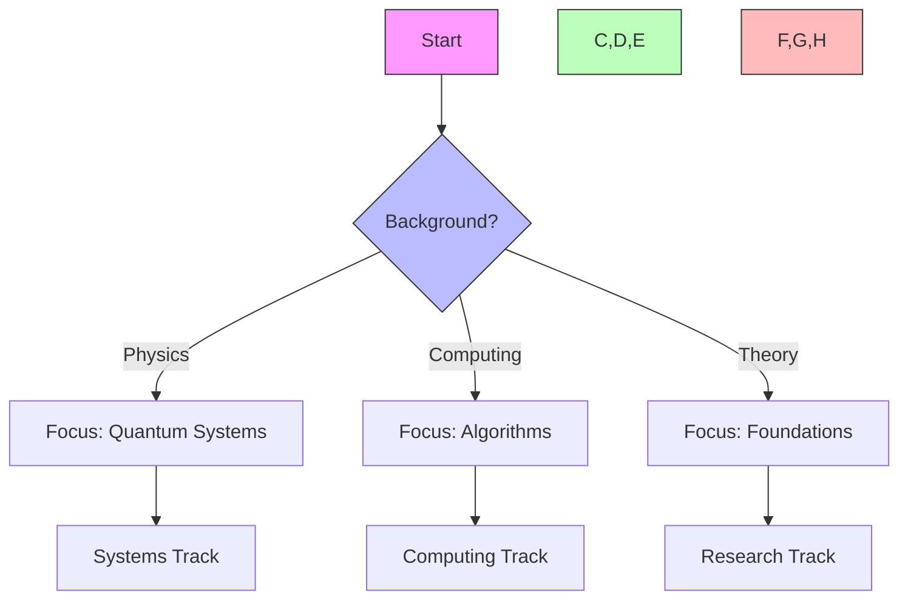

## Path Interconnections
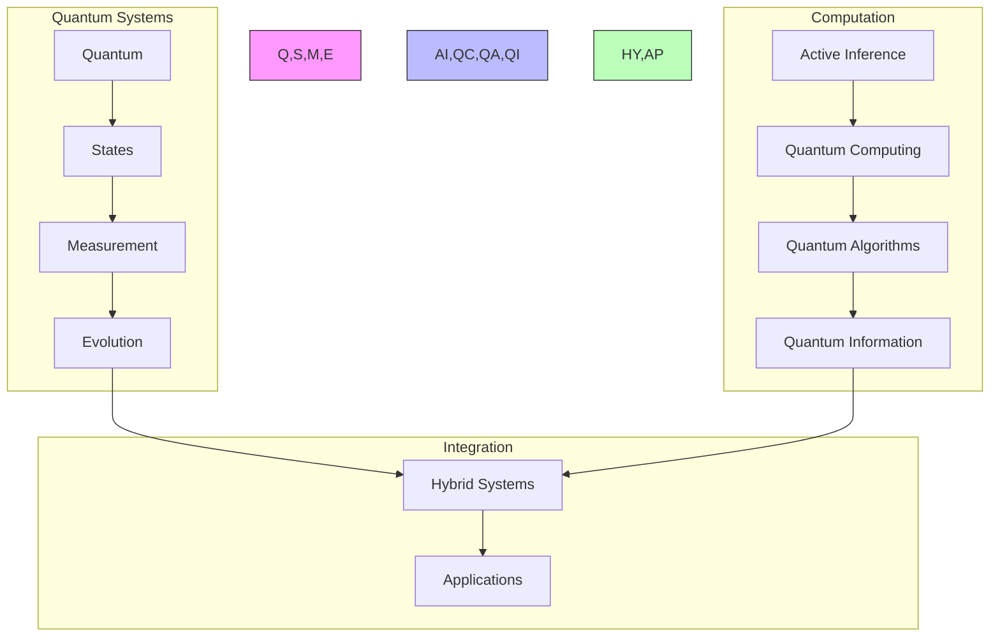

### System Architecture
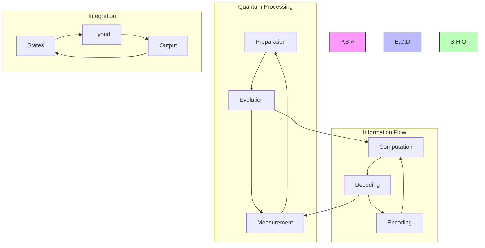

## Prerequisites

### 1. Quantum Foundations (4 weeks)
- Quantum Mechanics
  - State vectors
  - Operators
  - Measurement theory
  - Entanglement

- Quantum Information
  - Qubits
  - Quantum gates
  - Quantum circuits
  - Quantum algorithms

- Quantum Computing
  - Quantum architectures
  - Error correction
  - Quantum software
  - Implementation challenges

- Mathematical Tools
  - Linear algebra
  - Complex analysis
  - Probability theory
  - Information theory

### 2. Technical Skills (2 weeks)
- Quantum Tools
  - Quantum simulators
  - Circuit design
  - State preparation
  - Measurement analysis

## Core Learning Path

### 1. Quantum Inference Modeling (4 weeks)

#### Week 1-2: Quantum State Inference
```python
class QuantumStateEstimator:
    def __init__(self,
                 n_qubits: int,
                 measurement_basis: str):
        """Initialize quantum state estimator."""
        self.quantum_system = QuantumSystem(n_qubits)
        self.measurement = QuantumMeasurement(measurement_basis)
        self.state_monitor = StateMonitor()
        
    def estimate_state(self,
                      quantum_signals: torch.Tensor,
                      prior_state: torch.Tensor) -> QuantumState:
        """Estimate quantum system state."""
        current_state = self.quantum_system.evolve_state(
            quantum_signals, prior_state
        )
        measured_state = self.measurement.perform(current_state)
        return self.state_monitor.validate_state(measured_state)
```

#### Week 3-4: Quantum Decision Making
```python
class QuantumDecisionMaker:
    def __init__(self,
                 action_space: QuantumActionSpace,
                 utility_operator: QuantumOperator):
        """Initialize quantum decision maker."""
        self.action_repertoire = QuantumActionRepertoire(action_space)
        self.utility_evaluator = utility_operator
        self.decision_policy = QuantumPolicy()
        
    def select_action(self,
                     quantum_state: torch.Tensor,
                     objectives: torch.Tensor) -> QuantumAction:
        """Select quantum action."""
        superpositions = self.action_repertoire.generate_options()
        utilities = self.evaluate_quantum_utility(superpositions, quantum_state)
        return self.decision_policy.collapse_to_action(superpositions, utilities)
```

### 2. Quantum Applications (6 weeks)

#### Week 1-2: Quantum Systems
- State preparation
- Quantum control
- Error mitigation
- Decoherence management

#### Week 3-4: Quantum Algorithms
- Quantum search
- State estimation
- Optimization
- Machine learning

#### Week 5-6: Quantum Cognition
- Decision theory
- Concept composition
- Memory effects
- Contextual reasoning

### 3. Quantum Intelligence (4 weeks)

#### Week 1-2: Quantum Learning
```python
class QuantumLearner:
    def __init__(self,
                 n_qubits: int,
                 learning_rate: float):
        """Initialize quantum learning system."""
        self.quantum_memory = QuantumMemory(n_qubits)
        self.learning = QuantumLearningMechanism()
        self.adaptation = QuantumAdaptation(learning_rate)
        
    def learn_quantum(self,
                     environment: QuantumEnvironment) -> QuantumKnowledge:
        """Learn through quantum interaction."""
        observations = self.quantum_memory.observe_environment(environment)
        coherent_knowledge = self.learning.superpose_knowledge(observations)
        return self.adaptation.update_quantum_knowledge(coherent_knowledge)
```

#### Week 3-4: Quantum Systems
- Quantum control
- Error correction
- State tomography
- Quantum simulation

### 4. Advanced Topics (4 weeks)

#### Week 1-2: Quantum-Classical Integration
```python
class QuantumClassicalBridge:
    def __init__(self,
                 quantum_levels: List[QuantumLevel],
                 integration_params: IntegrationParams):
        """Initialize quantum-classical bridge."""
        self.levels = quantum_levels
        self.integrator = HybridIntegrator(integration_params)
        self.coordinator = QuantumCoordinator()
        
    def process_hybrid_information(self,
                                 inputs: Dict[str, torch.Tensor]) -> SystemState:
        """Process information across quantum-classical boundary."""
        level_states = {level: level.process(inputs[level.name])
                       for level in self.levels}
        integrated_state = self.integrator.combine_states(level_states)
        return self.coordinator.coordinate_responses(integrated_state)
```

#### Week 3-4: Quantum Computation
- Quantum algorithms
- Hybrid computing
- Quantum advantage
- Implementation strategies

## Projects

### Quantum Projects
1. **Quantum Systems**
   - State preparation
   - Quantum control
   - Error mitigation
   - Measurement optimization

2. **Quantum Algorithms**
   - Search algorithms
   - Optimization methods
   - Machine learning
   - Simulation techniques

### Advanced Projects
1. **Quantum Cognition**
   - Decision models
   - Concept spaces
   - Memory systems
   - Reasoning frameworks

2. **Quantum Intelligence**
   - Learning systems
   - Adaptive control
   - Error correction
   - Hybrid computation

## Resources

### Academic Resources
1. **Research Papers**
   - Quantum Mechanics
   - Quantum Computing
   - Quantum Cognition
   - Active Inference

2. **Books**
   - Quantum Systems
   - Quantum Information
   - Quantum Algorithms
   - Quantum Control

### Technical Resources
1. **Software Tools**
   - Quantum Simulators
   - Circuit Design
   - State Analysis
   - Visualization Tools

2. **Quantum Resources**
   - Hardware Access
   - Cloud Platforms
   - Development Kits
   - Testing Frameworks

## Next Steps

### Advanced Topics
1. [[quantum_computing_learning_path|Quantum Computing]]
2. [[quantum_information_learning_path|Quantum Information]]
3. [[quantum_cognition_learning_path|Quantum Cognition]]

### Research Directions
1. [[research_guides/quantum_systems|Quantum Systems Research]]
2. [[research_guides/quantum_computation|Quantum Computation Research]]
3. [[research_guides/quantum_cognition|Quantum Cognition Research]]

## Version History
- Created: 2024-03-15
- Last Updated: 2024-03-15
- Status: Stable
- Version: 1.0.0 

## Integration Strategies

### Development Approaches
- Theory-Practice Integration
  - Quantum mechanics
  - Information theory
  - System validation
- Cross-Domain Development
  - Quantum systems
  - Classical systems
  - Hybrid approaches
- Research Integration
  - Literature synthesis
  - Experimental design
  - Performance analysis

### Research Framework
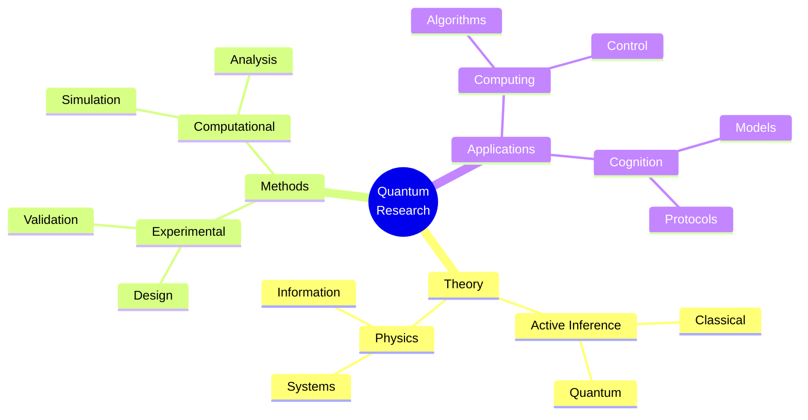

### Development Lifecycle
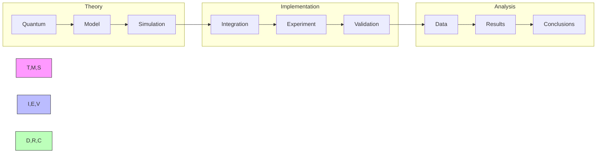

## Assessment Framework

### Continuous Assessment
#### Weekly Checkpoints
- Theoretical Understanding (90% required)
  - Quantum mechanics
  - Active inference mathematics
  - Information theory
- Implementation Skills (85% required)
  - Quantum programming
  - Algorithm development
  - System simulation
- Research Progress (90% required)
  - Literature review
  - Theoretical development
  - Results analysis

#### Progress Tracking
- Daily Research Log
- Weekly Theory Review
- Monthly Project Assessment
- Quarterly Publication Progress

### Knowledge Checkpoints

#### Foundation Checkpoint (Week 8)
- Format: Written + Implementation
- Duration: 6 hours
- Topics:
  - Quantum systems
  - Active inference basics
  - Information theory
- Requirements:
  - Theory: 90% correct
  - Implementation: Working quantum simulation

#### Advanced Integration (Week 16)
- Format: Research Project
- Duration: 2 weeks
- Focus:
  - Complex quantum systems
  - Hybrid integration
  - Theoretical validation
- Deliverables:
  - Research paper draft
  - Working implementation
  - Theoretical proofs

#### Final Assessment (Week 24)
- Format: Research Publication
- Duration: 4 weeks
- Components:
  - Original research
  - Novel implementation
  - Theoretical validation
- Requirements:
  - Publication-ready paper
  - Validated implementation
  - Complete proofs

### Project Portfolio

#### Research Projects
1. Quantum System Development
   - Scope: Quantum model design
   - Deliverables:
     - System implementation
     - Theoretical analysis
     - Documentation
   - Evaluation:
     - Theory: 40%
     - Implementation: 30%
     - Documentation: 30%

2. Quantum Information Integration
   - Scope: Information protocols
   - Deliverables:
     - Protocol design
     - Implementation
     - Analysis
   - Evaluation:
     - Theory: 40%
     - Protocol: 35%
     - Documentation: 25%

#### Final Project
- Description: Novel Quantum Application
- Requirements:
  - Technical:
    - Original theory
    - Implementation
    - Validation
  - Documentation:
    - Research paper
    - Technical docs
    - Theoretical proofs
  - Presentation:
    - Research talk
    - System demo
    - Theory discussion

### Success Criteria
#### Technical Competency
- Theory: Expert level (9/10)
- Implementation: Advanced (8/10)
- Research: Publication quality
- Mathematics: Expert level (9/10)

#### Project Delivery
- Quality Standards:
  - Theoretical validation
  - Implementation verification
  - Documentation complete
- Performance Metrics:
  - Theory soundness
  - System accuracy
  - Research impact

#### Professional Development
- Research publications
- Theoretical contributions
- Conference presentations
- Community engagement

## Career Development

### Industry Alignment
#### Research Roles
- Quantum Physicist
  - Theory development
  - System analysis
  - Research design
- Quantum Engineer
  - System implementation
  - Algorithm design
  - Protocol development
- Research Scientist
  - Theoretical research
  - Algorithm development
  - Innovation design

#### Certification Path
- Quantum Systems
  - Quantum mechanics
  - Information theory
- Quantum Computing
  - Algorithm design
  - System implementation
- Research Methods
  - Theoretical development
  - Experimental design

### Professional Network
#### Research Community
- Academic Connections:
  - Research labs
  - Universities
  - Quantum centers
- Industry Partners:
  - Quantum companies
  - Research institutes
  - Technology firms
- Professional Organizations:
  - Quantum Computing Society
  - Physics Research Groups
  - Information Theory Society

#### Career Progression
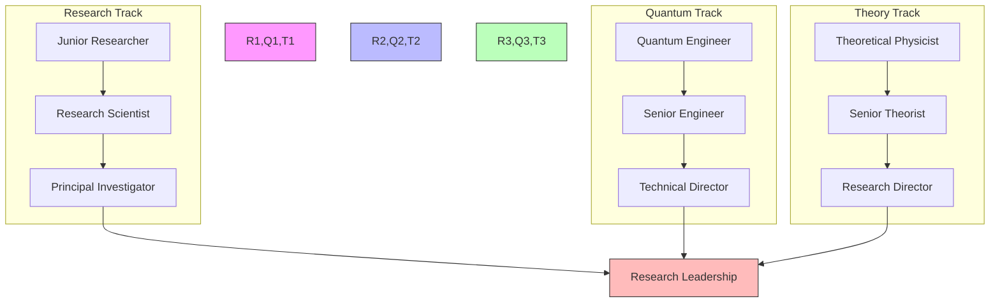

### Competency Framework
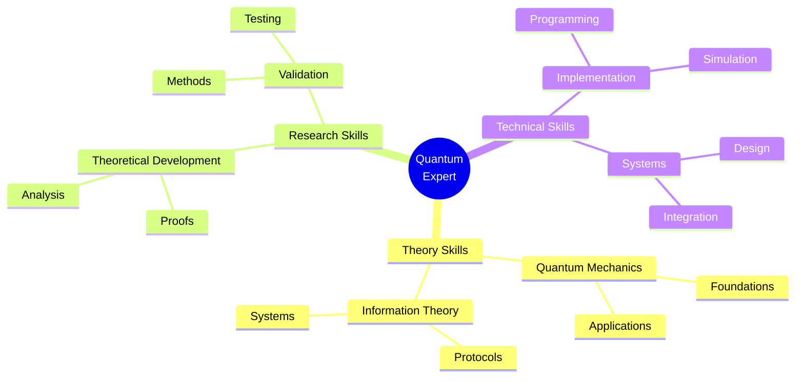

### Research Focus Areas
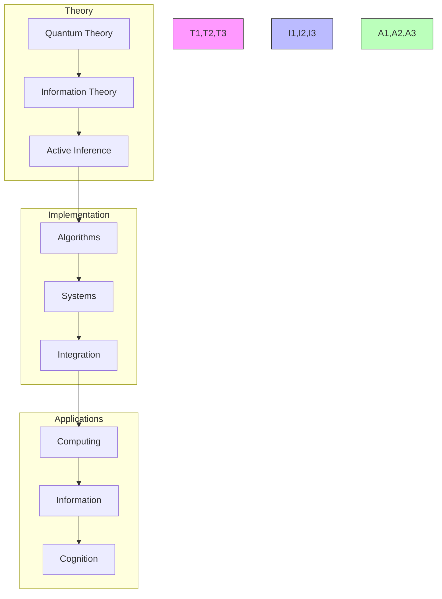

## Support Resources

### Research Support
- Literature Database
  - Quantum papers
  - Information theory
  - Active inference
- Computing Resources
  - Quantum simulators
  - Cloud platforms
  - Development tools
- Analysis Tools
  - Mathematical software
  - Visualization tools
  - Statistical packages

### Technical Support
- Development Tools
  - Quantum frameworks
  - Circuit design
  - Simulation tools
- Documentation
  - API references
  - Implementation guides
  - Best practices
- Computing Resources
  - Quantum computers
  - Classical systems
  - Hybrid platforms

### Learning Support
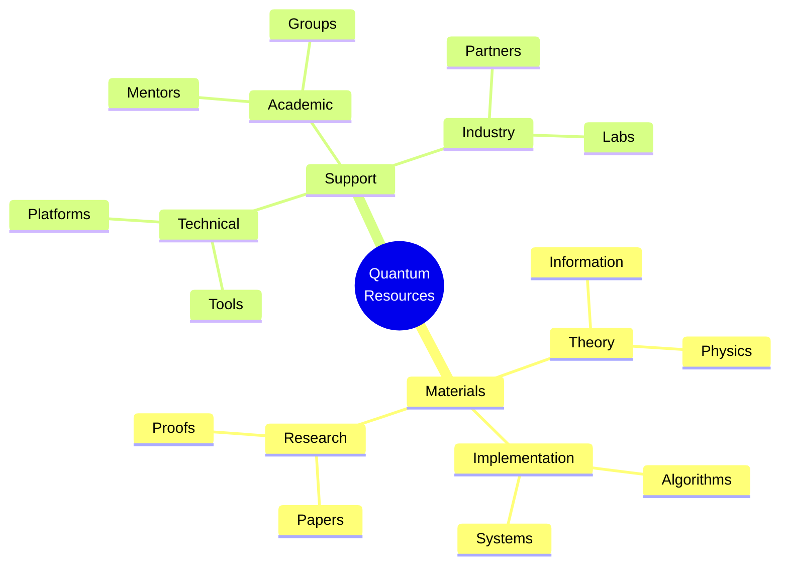

## Version Control and Updates

### Version History
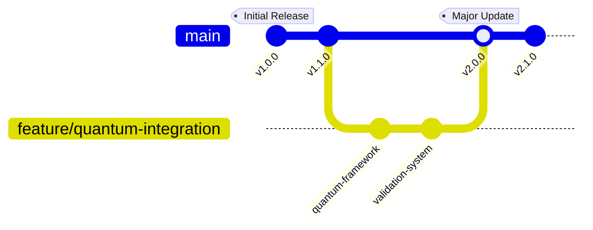

### Change Management
#### Major Updates
- v2.0.0 (Current)
  - Enhanced quantum framework
  - Advanced theoretical models
  - Improved validation system
  - Updated career paths
- v1.1.0
  - Added quantum systems
  - Enhanced documentation
  - New research projects
- v1.0.0
  - Initial curriculum
  - Basic framework
  - Core concepts

#### Planned Improvements
- Advanced quantum models
- Theoretical extensions
- Integration frameworks
- Research directions

### Quality Metrics
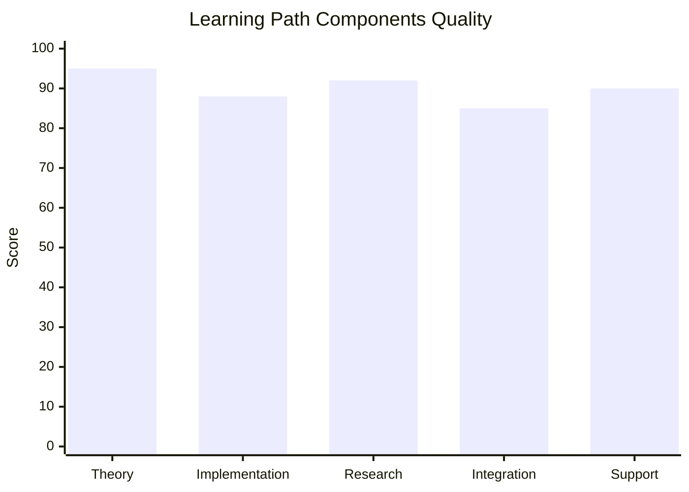

## Learning Analytics

### Progress Tracking
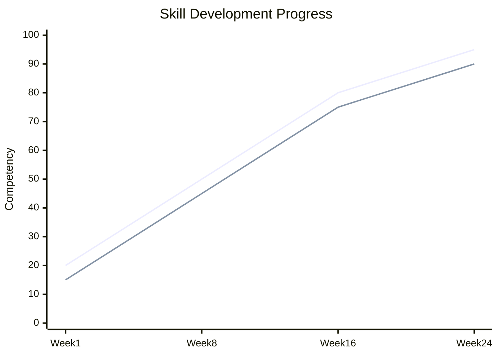

### Performance Metrics
- Theoretical Skills
  - Quantum mechanics
  - Information theory
  - Mathematical analysis
- Research Skills
  - Theory development
  - Proof construction
  - Paper writing
- Technical Skills
  - Implementation
  - Simulation
  - Validation

### Development Analytics
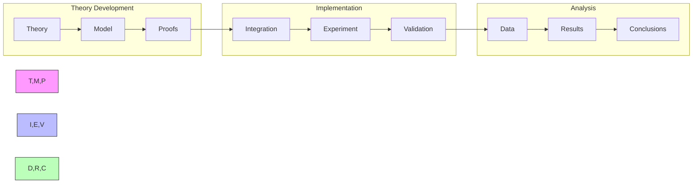

## Final Notes

### Success Stories
- Research Impact
  - Novel theories
  - Quantum frameworks
  - Field contributions
- Technical Achievements
  - System implementations
  - Protocol development
  - Algorithm design
- Professional Growth
  - Research leadership
  - Theory development
  - Community building

### Additional Resources
- Extended Reading
  - Advanced quantum theory
  - Information theory
  - Mathematical methods
- Research Directions
  - Open problems
  - Future applications
  - Integration opportunities
- Community Resources
  - Research groups
  - Theory forums
  - Professional networks

### Contact Information
- Research Support
  - Principal investigators
  - Theory experts
  - Research coordinators
- Technical Support
  - Quantum engineers
  - System specialists
  - Integration experts
- Academic Support
  - University professors
  - Research fellows
  - Graduate students 