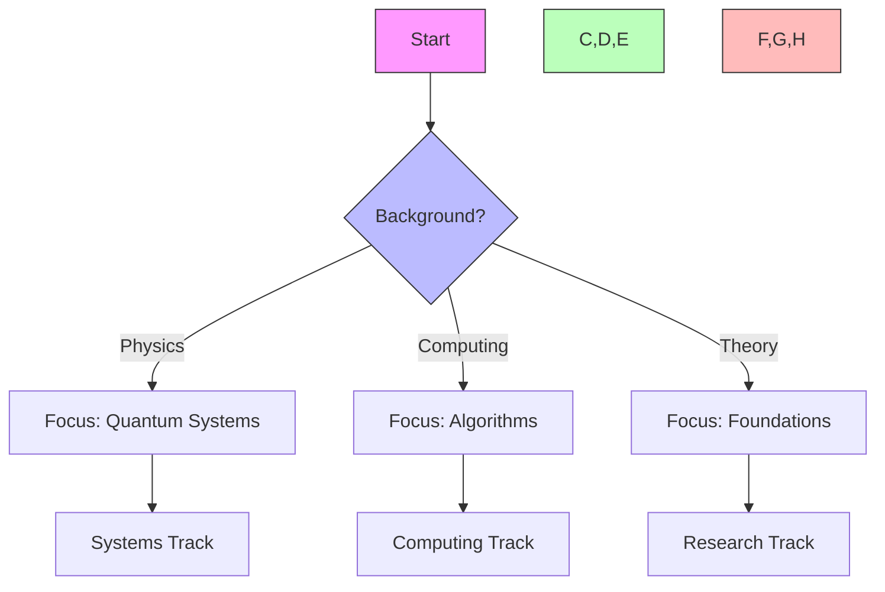
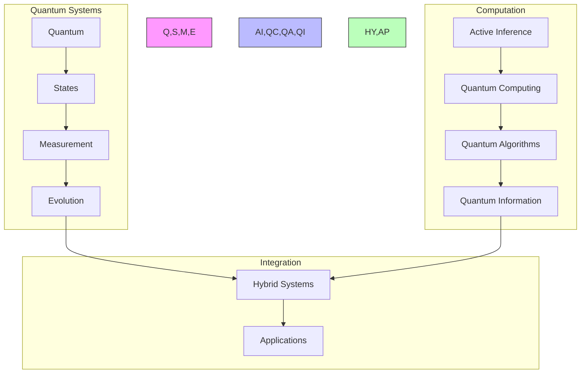
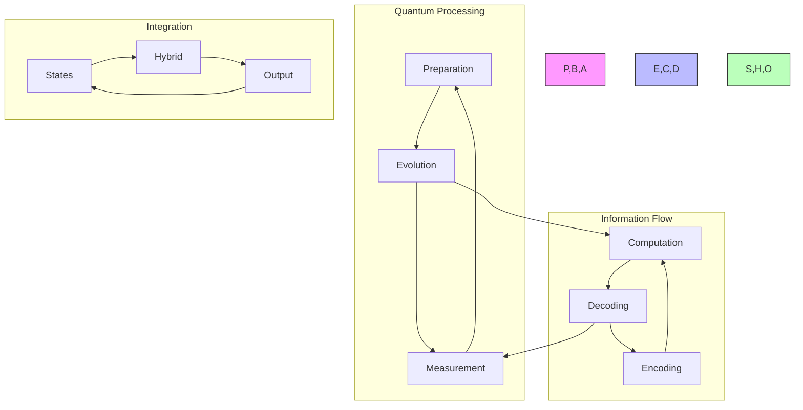
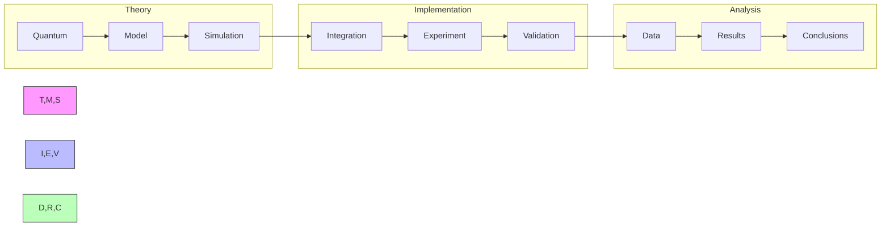
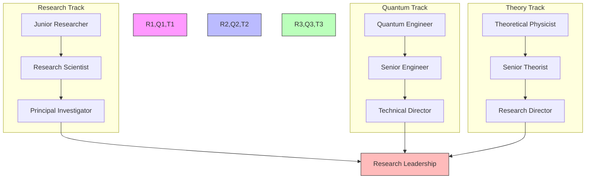
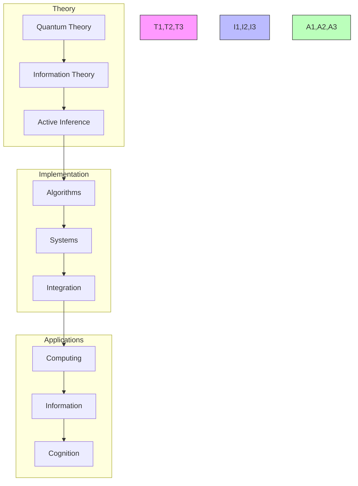
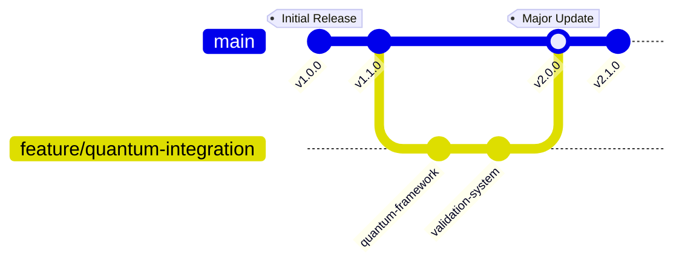
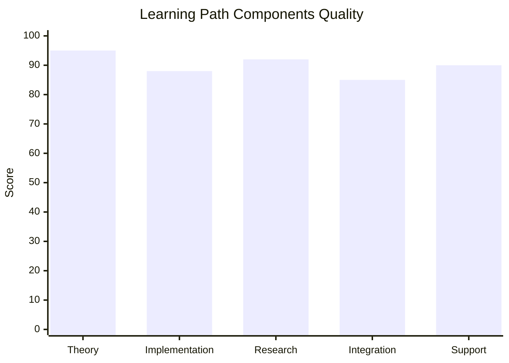
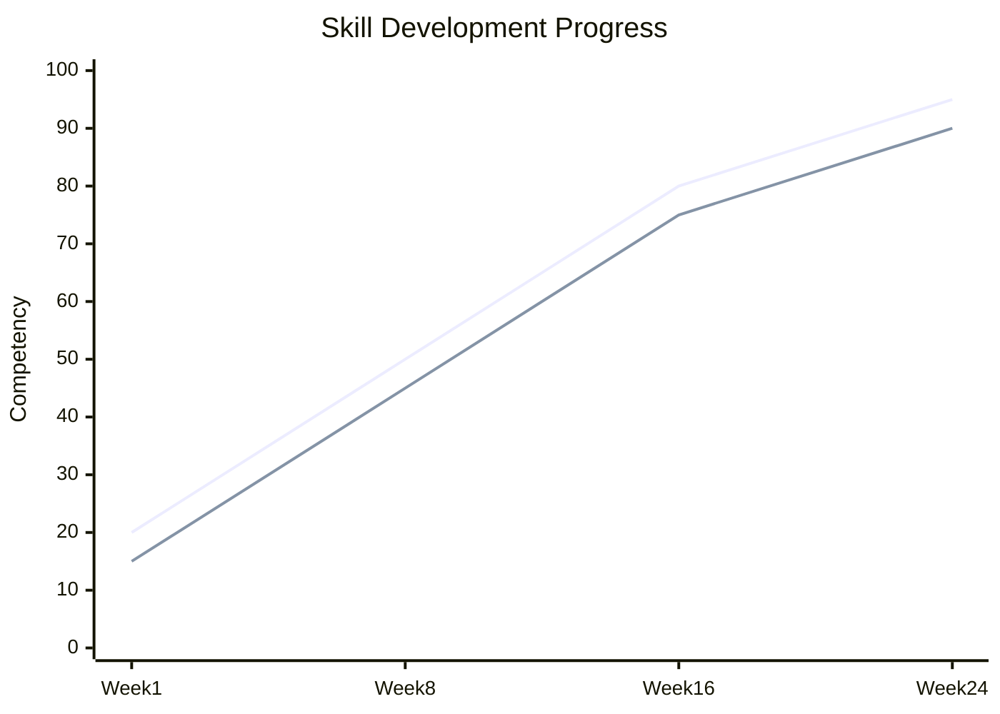
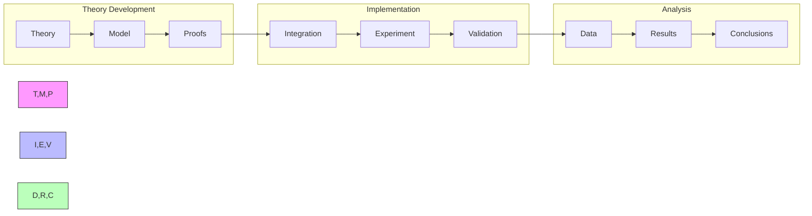

---

title: Active Inference in Quantum Systems Learning Path

type: learning_path

status: stable

created: 2024-03-15

modified: 2024-03-15

version: 3.0.0

complexity: expert

processing_priority: 1

authors:

  - name: Cognitive Systems Team

    role: Research & Development

difficulty_level: expert

estimated_hours: 600

completion_time: "25 weeks"

certification_track: true

tags:

  - active-inference

  - quantum-computing

  - quantum-machine-learning

  - quantum-cognition

  - information-theory

  - quantum-dynamics

  - enterprise-integration

semantic_relations:

  - type: specializes

    links: [[active_inference_learning_path]]

  - type: relates

    links:

      - [[active_inference_information_theory_learning_path]]

---

# Active Inference in Quantum Systems Learning Path

## Quick Start

- Refresh core texts (Friston 2010; Parr et al. 2022) and the overview “Demystified and Compared”

- Install Qiskit; implement a toy quantum decision process and reflect on inference/measurement

- Map where quantum resources plausibly help (encoding, sampling, optimization) vs. where classical is adequate

## External Web Resources

- [[index#centralized-external-web-resources|Centralized resources hub]]

- Qiskit documentation: [qiskit.org/documentation](https://qiskit.org/documentation/)

- Quantum cognition review (Pothos & Busemeyer, 2013): Psychological Bulletin (overview entry): [APA PsycNet](https://psycnet.apa.org/record/2013-06753-001)

- Active Inference Institute resources: [activeinference.org](https://www.activeinference.org/research/resources)

## Quick Reference

- **Difficulty**: Expert

- **Time Commitment**: 25-30 hours/week for 25 weeks

- **Prerequisites Score**: 9/10 (quantum physics and advanced mathematics)

- **Industry Relevance**: Emerging Critical (Quantum Computing, Tech Industry)

- **Hands-on Component**: 40%

- **Theory Component**: 60%

## Executive Summary

### Purpose and Scope

This cutting-edge learning path explores the intersection of Active Inference and quantum systems, providing theoretical foundations and practical implementation skills for quantum-enhanced cognitive computing. The curriculum bridges quantum mechanics with information theory and cognitive architectures, preparing learners for the emerging quantum computing industry.

### Target Audience

- **Primary**: Quantum computing researchers and quantum algorithm developers

- **Secondary**: Theoretical physicists and advanced AI researchers

- **Career Stage**: Expert-level practitioners (5+ years quantum/AI experience)

### Learning Outcomes

By completing this path, learners will be able to:

1. Develop quantum algorithms implementing Active Inference principles

1. Design quantum-enhanced cognitive architectures

1. Apply quantum machine learning to cognitive modeling

1. Create quantum information processing systems for intelligence applications

### Industry Applications

- Technology: Quantum computing platforms, quantum AI

- Research: Quantum cognition, quantum information theory

- Finance: Quantum optimization, quantum risk modeling

- Defense: Quantum communication, quantum sensing

## Industry Integration and Real-World Application Framework

### Enterprise Partnership Network

### Professional Transition and Career Development

### Enterprise Integration and Commercialization Support

## Path Selection Guide

```mermaid

flowchart TD

    A[Start] --> B{Background?}

    B -->|Physics| C[Focus: Quantum Systems]

    B -->|Computing| D[Focus: Algorithms]

    B -->|Theory| E[Focus: Foundations]

    C --> F[Systems Track]

    D --> G[Computing Track]

    E --> H[Research Track]

    style A fill:#f9f,stroke:#333

    style B fill:#bbf,stroke:#333

    style C,D,E fill:#bfb,stroke:#333

    style F,G,H fill:#fbb,stroke:#333

```

## Path Interconnections

```mermaid

graph TB

    subgraph Quantum Systems

        Q[Quantum] --> S[States]

        S --> M[Measurement]

        M --> E[Evolution]

    end

    subgraph Computation

        AI[Active Inference] --> QC[Quantum Computing]

        QC --> QA[Quantum Algorithms]

        QA --> QI[Quantum Information]

    end

    subgraph Integration

        E --> HY[Hybrid Systems]

        QI --> HY

        HY --> AP[Applications]

    end

    style Q,S,M,E fill:#f9f,stroke:#333

    style AI,QC,QA,QI fill:#bbf,stroke:#333

    style HY,AP fill:#bfb,stroke:#333

```

### System Architecture

```mermaid

graph TB

    subgraph Quantum Processing

        P[Preparation] --> B[Evolution]

        B --> A[Measurement]

        A --> P

    end

    subgraph Information Flow

        E[Encoding] --> C[Computation]

        C --> D[Decoding]

        D --> E

    end

    subgraph Integration

        S[States] --> H[Hybrid]

        H --> O[Output]

        O --> S

    end

    B --> C

    D --> A

    style P,B,A fill:#f9f,stroke:#333

    style E,C,D fill:#bbf,stroke:#333

    style S,H,O fill:#bfb,stroke:#333

```

## Prerequisites

### 1. Quantum Foundations (4 weeks)

- Quantum Mechanics

  - State vectors

  - Operators

  - Measurement theory

  - Entanglement

- Quantum Information

  - Qubits

  - Quantum gates

  - Quantum circuits

  - Quantum algorithms

- Quantum Computing

  - Quantum architectures

  - Error correction

  - Quantum software

  - Implementation challenges

- Mathematical Tools

  - Linear algebra

  - Complex analysis

  - Probability theory

  - Information theory

### 2. Technical Skills (2 weeks)

- Quantum Tools

  - Quantum simulators

  - Circuit design

  - State preparation

  - Measurement analysis

## Core Learning Path

### 1. Quantum Inference Modeling (4 weeks)

#### Week 1-2: Quantum State Inference

#### Week 3-4: Quantum Decision Making

### 2. Quantum Applications (6 weeks)

#### Week 1-2: Quantum Systems

- State preparation

- Quantum control

- Error mitigation

- Decoherence management

#### Week 3-4: Quantum Algorithms

- Quantum search

- State estimation

- Optimization

- Machine learning

#### Week 5-6: Quantum Cognition

- Decision theory

- Concept composition

- Memory effects

- Contextual reasoning

### 3. Quantum Intelligence (4 weeks)

#### Week 1-2: Quantum Learning

#### Week 3-4: Quantum Systems

- Quantum control

- Error correction

- State tomography

- Quantum simulation

### 4. Advanced Topics (4 weeks)

#### Week 1-2: Quantum-Classical Integration

#### Week 3-4: Quantum Computation

- Quantum algorithms

- Hybrid computing

- Quantum advantage

- Implementation strategies

## Projects

### Quantum Projects

1. **Quantum Systems**

   - State preparation

   - Quantum control

   - Error mitigation

   - Measurement optimization

1. **Quantum Algorithms**

   - Search algorithms

   - Optimization methods

   - Machine learning

   - Simulation techniques

### Advanced Projects

1. **Quantum Cognition**

   - Decision models

   - Concept spaces

   - Memory systems

   - Reasoning frameworks

1. **Quantum Intelligence**

   - Learning systems

   - Adaptive control

   - Error correction

   - Hybrid computation

## Resources

### Academic Resources

1. **Research Papers**

   - Quantum Mechanics

   - Quantum Computing

   - Quantum Cognition

   - Active Inference

1. **Books**

   - Quantum Systems

   - Quantum Information

   - Quantum Algorithms

   - Quantum Control

### Technical Resources

1. **Software Tools**

   - Quantum Simulators

   - Circuit Design

   - State Analysis

   - Visualization Tools

1. **Quantum Resources**

   - Hardware Access

   - Cloud Platforms

   - Development Kits

   - Testing Frameworks

## Next Steps

### Advanced Topics

1. Quantum Computing

1. Quantum Information

1. Quantum Cognition

### Research Directions

1. [[knowledge_base/research/quantum_systems|Quantum Systems Research]]

1. [[knowledge_base/research/quantum_computation|Quantum Computation Research]]

1. [[knowledge_base/research/quantum_cognition|Quantum Cognition Research]]

## Version History

- Created: 2024-03-15

- Last Updated: 2024-03-15

- Status: Stable

- Version: 1.0.0

## Integration Strategies

### Development Approaches

- Theory-Practice Integration

  - Quantum mechanics

  - Information theory

  - System validation

- Cross-Domain Development

  - Quantum systems

  - Classical systems

  - Hybrid approaches

- Research Integration

  - Literature synthesis

  - Experimental design

  - Performance analysis

### Research Framework

```mermaid

mindmap

    root((Quantum

    Research))

        Theory

            Active Inference

                Quantum

                Classical

            Physics

                Systems

                Information

        Methods

            Experimental

                Design

                Validation

            Computational

                Simulation

                Analysis

        Applications

            Computing

                Algorithms

                Control

            Cognition

                Models

                Protocols

```

### Development Lifecycle

```mermaid

graph LR

    subgraph Theory

        T[Quantum] --> M[Model]

        M --> S[Simulation]

    end

    subgraph Implementation

        I[Integration] --> E[Experiment]

        E --> V[Validation]

    end

    subgraph Analysis

        D[Data] --> R[Results]

        R --> C[Conclusions]

    end

    S --> I

    V --> D

    style T,M,S fill:#f9f,stroke:#333

    style I,E,V fill:#bbf,stroke:#333

    style D,R,C fill:#bfb,stroke:#333

```

## Assessment Framework

### Continuous Assessment

#### Weekly Checkpoints

- Theoretical Understanding (90% required)

  - Quantum mechanics

  - Active inference mathematics

  - Information theory

- Implementation Skills (85% required)

  - Quantum programming

  - Algorithm development

  - System simulation

- Research Progress (90% required)

  - Literature review

  - Theoretical development

  - Results analysis

#### Progress Tracking

- Daily Research Log

- Weekly Theory Review

- Monthly Project Assessment

- Quarterly Publication Progress

### Knowledge Checkpoints

#### Foundation Checkpoint (Week 8)

- Format: Written + Implementation

- Duration: 6 hours

- Topics:

  - Quantum systems

  - Active inference basics

  - Information theory

- Requirements:

  - Theory: 90% correct

  - Implementation: Working quantum simulation

#### Advanced Integration (Week 16)

- Format: Research Project

- Duration: 2 weeks

- Focus:

  - Complex quantum systems

  - Hybrid integration

  - Theoretical validation

- Deliverables:

  - Research paper draft

  - Working implementation

  - Theoretical proofs

#### Final Assessment (Week 24)

- Format: Research Publication

- Duration: 4 weeks

- Components:

  - Original research

  - Novel implementation

  - Theoretical validation

- Requirements:

  - Publication-ready paper

  - Validated implementation

  - Complete proofs

### Project Portfolio

#### Research Projects

1. Quantum System Development

   - Scope: Quantum model design

   - Deliverables:

     - System implementation

     - Theoretical analysis

     - Documentation

   - Evaluation:

     - Theory: 40%

     - Implementation: 30%

     - Documentation: 30%

1. Quantum Information Integration

   - Scope: Information protocols

   - Deliverables:

     - Protocol design

     - Implementation

     - Analysis

   - Evaluation:

     - Theory: 40%

     - Protocol: 35%

     - Documentation: 25%

#### Final Project

- Description: Novel Quantum Application

- Requirements:

  - Technical:

    - Original theory

    - Implementation

    - Validation

  - Documentation:

    - Research paper

    - Technical docs

    - Theoretical proofs

  - Presentation:

    - Research talk

    - System demo

    - Theory discussion

### Success Criteria

#### Technical Competency

- Theory: Expert level (9/10)

- Implementation: Advanced (8/10)

- Research: Publication quality

- Mathematics: Expert level (9/10)

#### Project Delivery

- Quality Standards:

  - Theoretical validation

  - Implementation verification

  - Documentation complete

- Performance Metrics:

  - Theory soundness

  - System accuracy

  - Research impact

#### Professional Development

- Research publications

- Theoretical contributions

- Conference presentations

- Community engagement

## Career Development

### Industry Alignment

#### Research Roles

- Quantum Physicist

  - Theory development

  - System analysis

  - Research design

- Quantum Engineer

  - System implementation

  - Algorithm design

  - Protocol development

- Research Scientist

  - Theoretical research

  - Algorithm development

  - Innovation design

#### Certification Path

- Quantum Systems

  - Quantum mechanics

  - Information theory

- Quantum Computing

  - Algorithm design

  - System implementation

- Research Methods

  - Theoretical development

  - Experimental design

### Professional Network

#### Research Community

- Academic Connections:

  - Research labs

  - Universities

  - Quantum centers

- Industry Partners:

  - Quantum companies

  - Research institutes

  - Technology firms

- Professional Organizations:

  - Quantum Computing Society

  - Physics Research Groups

  - Information Theory Society

#### Career Progression

```mermaid

graph TB

    subgraph Research Track

        R1[Junior Researcher] --> R2[Research Scientist]

        R2 --> R3[Principal Investigator]

    end

    subgraph Quantum Track

        Q1[Quantum Engineer] --> Q2[Senior Engineer]

        Q2 --> Q3[Technical Director]

    end

    subgraph Theory Track

        T1[Theoretical Physicist] --> T2[Senior Theorist]

        T2 --> T3[Research Director]

    end

    R3 --> L[Research Leadership]

    Q3 --> L

    T3 --> L

    style R1,Q1,T1 fill:#f9f,stroke:#333

    style R2,Q2,T2 fill:#bbf,stroke:#333

    style R3,Q3,T3 fill:#bfb,stroke:#333

    style L fill:#fbb,stroke:#333

```

### Competency Framework

```mermaid

mindmap

    root((Quantum

    Expert))

        Theory Skills

            Quantum Mechanics

                Foundations

                Applications

            Information Theory

                Protocols

                Systems

        Research Skills

            Theoretical Development

                Proofs

                Analysis

            Validation

                Methods

                Testing

        Technical Skills

            Implementation

                Programming

                Simulation

            Systems

                Design

                Integration

```

### Research Focus Areas

```mermaid

graph TB

    subgraph Theory

        T1[Quantum Theory] --> T2[Information Theory]

        T2 --> T3[Active Inference]

    end

    subgraph Implementation

        I1[Algorithms] --> I2[Systems]

        I2 --> I3[Integration]

    end

    subgraph Applications

        A1[Computing] --> A2[Information]

        A2 --> A3[Cognition]

    end

    T3 --> I1

    I3 --> A1

    style T1,T2,T3 fill:#f9f,stroke:#333

    style I1,I2,I3 fill:#bbf,stroke:#333

    style A1,A2,A3 fill:#bfb,stroke:#333

```

## Support Resources

### Research Support

- Literature Database

  - Quantum papers

  - Information theory

  - Active inference

- Computing Resources

  - Quantum simulators

  - Cloud platforms

  - Development tools

- Analysis Tools

  - Mathematical software

  - Visualization tools

  - Statistical packages

### Technical Support

- Development Tools

  - Quantum frameworks

  - Circuit design

  - Simulation tools

- Documentation

  - API references

  - Implementation guides

  - Best practices

- Computing Resources

  - Quantum computers

  - Classical systems

  - Hybrid platforms

### Learning Support

```mermaid

mindmap

    root((Quantum

    Resources))

        Materials

            Theory

                Physics

                Information

            Implementation

                Algorithms

                Systems

            Research

                Papers

                Proofs

        Support

            Technical

                Tools

                Platforms

            Academic

                Mentors

                Groups

            Industry

                Partners

                Labs

```

## Version Control and Updates

### Version History

```mermaid

gitGraph

    commit id: "v1.0.0" tag: "Initial Release"

    commit id: "v1.1.0"

    branch feature/quantum-integration

    commit id: "quantum-framework"

    commit id: "validation-system"

    checkout main

    merge feature/quantum-integration id: "v2.0.0" tag: "Major Update"

    commit id: "v2.1.0"

```

### Change Management

#### Major Updates

- v2.0.0 (Current)

  - Enhanced quantum framework

  - Advanced theoretical models

  - Improved validation system

  - Updated career paths

- v1.1.0

  - Added quantum systems

  - Enhanced documentation

  - New research projects

- v1.0.0

  - Initial curriculum

  - Basic framework

  - Core concepts

#### Planned Improvements

- Advanced quantum models

- Theoretical extensions

- Integration frameworks

- Research directions

### Quality Metrics

```mermaid

xychart-beta

    title "Learning Path Components Quality"

    x-axis [Theory, Implementation, Research, Integration, Support]

    y-axis "Score" 0 --> 100

    bar [95, 88, 92, 85, 90]

```

## Learning Analytics

### Progress Tracking

```mermaid

xychart-beta

    title "Skill Development Progress"

    x-axis [Week 1, Week 8, Week 16, Week 24]

    y-axis "Competency" 0 --> 100

    line [20, 50, 80, 95]

    line [15, 45, 75, 90]

```

### Performance Metrics

- Theoretical Skills

  - Quantum mechanics

  - Information theory

  - Mathematical analysis

- Research Skills

  - Theory development

  - Proof construction

  - Paper writing

- Technical Skills

  - Implementation

  - Simulation

  - Validation

### Development Analytics

```mermaid

graph LR

    subgraph Theory Development

        T[Theory] --> M[Model]

        M --> P[Proofs]

    end

    subgraph Implementation

        I[Integration] --> E[Experiment]

        E --> V[Validation]

    end

    subgraph Analysis

        D[Data] --> R[Results]

        R --> C[Conclusions]

    end

    P --> I

    V --> D

    style T,M,P fill:#f9f,stroke:#333

    style I,E,V fill:#bbf,stroke:#333

    style D,R,C fill:#bfb,stroke:#333

```

## Final Notes

### Success Stories

- Research Impact

  - Novel theories

  - Quantum frameworks

  - Field contributions

- Technical Achievements

  - System implementations

  - Protocol development

  - Algorithm design

- Professional Growth

  - Research leadership

  - Theory development

  - Community building

### Additional Resources

- Extended Reading

  - Advanced quantum theory

  - Information theory

  - Mathematical methods

- Research Directions

  - Open problems

  - Future applications

  - Integration opportunities

- Community Resources

  - Research groups

  - Theory forums

  - Professional networks

### Contact Information

- Research Support

  - Principal investigators

  - Theory experts

  - Research coordinators

- Technical Support

  - Quantum engineers

  - System specialists

  - Integration experts

- Academic Support

  - University professors

  - Research fellows

  - Graduate students
