# Active Inference in Robotics Learning Path

## Quick Reference
- **Difficulty**: Advanced
- **Time Commitment**: 22-25 hours/week for 22 weeks
- **Prerequisites Score**: 8/10 (robotics and programming expertise)
- **Industry Relevance**: Critical (Robotics, Autonomous Systems)
- **Hands-on Component**: 65%
- **Theory Component**: 35%

## Executive Summary

### Purpose and Scope
This comprehensive learning path integrates Active Inference principles with robotics and autonomous systems, providing theoretical foundations and practical implementation skills for developing intelligent robotic systems. The curriculum emphasizes real-time control, sensorimotor integration, and embodied cognition principles.

### Target Audience
- **Primary**: Robotics engineers and autonomous systems developers
- **Secondary**: AI researchers and mechatronics engineers
- **Career Stage**: Advanced practitioners (3+ years robotics experience)

### Learning Outcomes
By completing this path, learners will be able to:
1. Design and implement Active Inference controllers for robotic systems
2. Develop real-time sensorimotor integration systems
3. Create autonomous robots with adaptive behavior capabilities
4. Implement distributed robotics systems with collective intelligence

### Industry Applications
- Manufacturing: Adaptive industrial robotics
- Automotive: Autonomous vehicle systems
- Healthcare: Medical robotics and assistive devices
- Defense: Autonomous systems and swarm robotics

## Advanced Technical Infrastructure

### Cloud-Integrated Development Environment
```python
class CloudRoboticsInfrastructure:
    def __init__(self):
        """Initialize cloud-integrated robotics development environment."""
        self.cloud_compute = CloudComputeManager()
        self.simulation_cluster = DistributedSimulationCluster()
        self.model_repository = RoboticsModelRepository()
        self.deployment_manager = RobotDeploymentManager()
        
    def setup_development_environment(self, learner_profile):
        """Set up personalized cloud development environment."""
        # Allocate cloud resources based on project complexity
        compute_allocation = self.cloud_compute.allocate_resources(
            cpu_cores=learner_profile.complexity_level * 4,
            gpu_memory=learner_profile.simulation_requirements,
            storage=learner_profile.dataset_size
        )
        
        # Configure simulation environment
        simulation_config = self.simulation_cluster.configure_environment(
            physics_engine='bullet',
            rendering_quality='high_fidelity',
            real_time_factor=learner_profile.speed_requirements
        )
        
        # Set up model management
        model_workspace = self.model_repository.create_workspace(
            learner_profile.id,
            version_control=True,
            collaborative_features=True
        )
        
        return {
            'compute_resources': compute_allocation,
            'simulation_environment': simulation_config,
            'model_workspace': model_workspace,
            'development_tools': self.provision_development_tools(),
            'monitoring_dashboard': self.create_monitoring_dashboard()
        }

class DistributedSimulationCluster:
    def __init__(self):
        """Initialize distributed simulation cluster."""
        self.node_manager = SimulationNodeManager()
        self.load_balancer = SimulationLoadBalancer()
        self.result_aggregator = ResultAggregator()
        self.fault_tolerance = FaultToleranceManager()
        
    def run_parallel_experiments(self, experiment_suite):
        """Run parallel robotics experiments across cluster."""
        # Distribute experiments across nodes
        node_assignments = self.load_balancer.distribute_experiments(
            experiment_suite.experiments
        )
        
        # Execute experiments in parallel
        experiment_results = {}
        for node_id, experiments in node_assignments.items():
            node_results = self.node_manager.execute_experiments(
                node_id, experiments
            )
            experiment_results[node_id] = node_results
        
        # Aggregate and analyze results
        aggregated_results = self.result_aggregator.combine_results(
            experiment_results
        )
        
        # Generate comprehensive analysis
        analysis = self.generate_comparative_analysis(aggregated_results)
        
        return {
            'experiment_results': aggregated_results,
            'performance_analysis': analysis,
            'resource_utilization': self.get_resource_metrics(),
            'recommendations': self.generate_optimization_recommendations()
        }

### Real-Time Robotics Framework
class RealTimeActiveInferenceController:
    def __init__(self, robot_config):
        """Initialize real-time Active Inference controller."""
        self.robot = RobotInterface(robot_config)
        self.belief_updater = RealTimeBeliefUpdater()
        self.action_selector = RealTimeActionSelector()
        self.sensory_processor = SensoryProcessor()
        self.motor_controller = MotorController()
        self.timing_manager = RealTimeTimingManager()
        
    def control_loop(self):
        """Main real-time control loop."""
        while self.robot.is_active():
            # Timing-critical sensor processing
            with self.timing_manager.critical_section():
                sensor_data = self.robot.get_sensor_data()
                processed_observations = self.sensory_processor.process(
                    sensor_data, 
                    timestamp=self.timing_manager.current_time()
                )
            
            # Belief updating with real-time constraints
            updated_beliefs = self.belief_updater.update(
                processed_observations,
                max_computation_time=self.timing_manager.belief_update_budget
            )
            
            # Action selection with guaranteed timing
            selected_action = self.action_selector.select(
                updated_beliefs,
                deadline=self.timing_manager.action_deadline()
            )
            
            # Motor command execution
            self.motor_controller.execute_action(
                selected_action,
                execution_time=self.timing_manager.motor_execution_time()
            )
            
            # Performance monitoring
            self.timing_manager.log_cycle_performance()

### Advanced Simulation Infrastructure
simulation_environments = {
    'photorealistic_physics': {
        'description': 'High-fidelity physics simulation with photorealistic rendering',
        'use_cases': [
            'visual_perception_training',
            'complex_manipulation_tasks',
            'human_robot_interaction',
            'environmental_adaptation'
        ],
        'technical_specs': {
            'physics_engine': 'bullet_with_soft_body',
            'rendering_engine': 'ray_tracing_enabled',
            'sensor_simulation': 'noise_realistic',
            'real_time_factor': 0.1  # Slower than real-time for accuracy
        },
        'compute_requirements': {
            'gpu_memory': '16GB+',
            'cpu_cores': '16+',
            'ram': '64GB+',
            'storage': '1TB+ SSD'
        }
    },
    'multi_robot_coordination': {
        'description': 'Large-scale multi-robot simulation environment',
        'capabilities': [
            'swarm_behavior_simulation',
            'distributed_coordination',
            'communication_protocols',
            'emergent_behavior_analysis'
        ],
        'scale_parameters': {
            'max_robots': 1000,
            'communication_range': 'configurable',
            'environment_size': 'scalable',
            'interaction_complexity': 'full_physics'
        }
    },
    'real_world_digital_twins': {
        'description': 'Digital twins of real-world robotics environments',
        'environments': [
            'manufacturing_floors',
            'warehouse_operations',
            'hospital_settings',
            'outdoor_terrains'
        ],
        'synchronization': {
            'real_time_sync': True,
            'bidirectional_updates': True,
            'predictive_modeling': True,
            'anomaly_detection': True
        }
    }
}
```

### Collaborative Development Platform
```python
class CollaborativeRoboticsDevelopment:
    def __init__(self):
        """Initialize collaborative robotics development platform."""
        self.version_control = RoboticsVersionControl()
        self.collaborative_simulator = CollaborativeSimulator()
        self.peer_review_system = RoboticsCodeReview()
        self.knowledge_sharing = RoboticsKnowledgeSharing()
        
    def enable_collaborative_development(self, project_team):
        """Enable collaborative development for robotics projects."""
        # Set up shared development environment
        shared_environment = self.collaborative_simulator.create_shared_environment(
            team_members=project_team,
            concurrent_development=True,
            real_time_collaboration=True
        )
        
        # Configure version control for robotics
        version_control_setup = self.version_control.setup_robotics_repo(
            code_versioning=True,
            model_versioning=True,
            data_versioning=True,
            configuration_versioning=True
        )
        
        # Enable peer review processes
        review_workflows = self.peer_review_system.create_workflows(
            code_review=True,
            simulation_validation=True,
            hardware_testing=True,
            documentation_review=True
        )
        
        return {
            'shared_development_environment': shared_environment,
            'version_control': version_control_setup,
            'review_workflows': review_workflows,
            'collaboration_tools': self.provision_collaboration_tools(),
            'knowledge_sharing_platform': self.setup_knowledge_sharing()
        }

class RoboticsVersionControl:
    def __init__(self):
        """Initialize specialized version control for robotics."""
        self.git_lfs = GitLargeFileSupport()
        self.model_registry = RoboticsModelRegistry()
        self.data_lineage = DataLineageTracker()
        self.reproducibility = ReproducibilityManager()
        
    def commit_robotics_project(self, project_state):
        """Commit complete robotics project state."""
        # Version control code
        code_commit = self.git_lfs.commit_code(
            project_state.source_code,
            message=project_state.commit_message
        )
        
        # Version control models
        model_version = self.model_registry.register_model(
            project_state.trained_models,
            performance_metrics=project_state.model_performance,
            training_data=project_state.training_data_hash
        )
        
        # Track data lineage
        data_lineage = self.data_lineage.track_lineage(
            input_data=project_state.input_data,
            transformations=project_state.data_transformations,
            output_data=project_state.output_data
        )
        
        # Ensure reproducibility
        reproducibility_package = self.reproducibility.create_package(
            environment=project_state.environment_config,
            dependencies=project_state.dependencies,
            hardware_config=project_state.hardware_config,
            execution_parameters=project_state.execution_params
        )
        
        return {
            'code_version': code_commit.hash,
            'model_version': model_version.id,
            'data_lineage': data_lineage.id,
            'reproducibility_package': reproducibility_package.id,
            'complete_state_hash': self.generate_state_hash(project_state)
        }

### Hardware-in-the-Loop Integration
class HardwareInTheLoopIntegration:
    def __init__(self):
        """Initialize hardware-in-the-loop integration system."""
        self.hardware_manager = HardwareManager()
        self.simulation_bridge = SimulationHardwareBridge()
        self.remote_lab_access = RemoteLabAccess()
        self.safety_monitor = SafetyMonitor()
        
    def setup_remote_robotics_lab(self, learner_access_level):
        """Set up remote access to robotics hardware."""
        # Allocate hardware resources
        hardware_allocation = self.hardware_manager.allocate_hardware(
            access_level=learner_access_level,
            safety_constraints=True,
            time_slot_management=True
        )
        
        # Configure simulation-hardware bridge
        bridge_config = self.simulation_bridge.configure_bridge(
            hardware_allocation.robot_systems,
            simulation_fidelity='high',
            latency_compensation=True
        )
        
        # Set up remote access
        remote_access = self.remote_lab_access.create_session(
            hardware_allocation,
            video_streaming=True,
            real_time_control=True,
            collaborative_access=learner_access_level.allows_collaboration
        )
        
        # Initialize safety monitoring
        safety_config = self.safety_monitor.configure_monitoring(
            hardware_systems=hardware_allocation.robot_systems,
            emergency_stops=True,
            behavior_boundaries=learner_access_level.safety_boundaries
        )
        
        return {
            'hardware_allocation': hardware_allocation,
            'remote_access_session': remote_access,
            'safety_monitoring': safety_config,
            'available_experiments': self.list_available_experiments(),
            'scheduling_interface': self.create_scheduling_interface()
        }

remote_lab_capabilities = {
    'robotic_platforms': {
        'manipulator_arms': [
            'ur5_collaborative_robot',
            'franka_emika_panda',
            'kuka_iiwa',
            'barrett_wam'
        ],
        'mobile_platforms': [
            'turtlebot3',
            'clearpath_jackal',
            'spot_quadruped',
            'custom_differential_drive'
        ],
        'specialized_systems': [
            'soft_robotics_platform',
            'swarm_robotics_testbed',
            'aerial_drone_system',
            'underwater_rov'
        ]
    },
    'sensor_suites': {
        'perception_sensors': [
            'rgb_cameras',
            'depth_cameras',
            'lidar_systems',
            'tactile_sensors'
        ],
        'navigation_sensors': [
            'imu_systems',
            'gps_modules',
            'wheel_encoders',
            'magnetometers'
        ],
        'environmental_sensors': [
            'temperature_humidity',
            'gas_sensors',
            'pressure_sensors',
            'light_sensors'
        ]
    },
    'interaction_capabilities': {
        'real_time_control': 'sub_millisecond_latency',
        'video_streaming': '4k_60fps_multi_angle',
        'audio_feedback': 'bidirectional_communication',
        'haptic_feedback': 'force_torque_sensing'
    }
}
```

### Performance Optimization and Monitoring
```python
class RoboticsPerformanceOptimizer:
    def __init__(self):
        """Initialize robotics performance optimization system."""
        self.profiler = RoboticsProfiler()
        self.optimizer = PerformanceOptimizer()
        self.monitor = RealTimeMonitor()
        self.tuner = HyperparameterTuner()
        
    def optimize_robotics_system(self, robot_system, performance_targets):
        """Optimize robotics system performance."""
        # Profile current performance
        performance_profile = self.profiler.profile_system(
            robot_system,
            metrics=['latency', 'accuracy', 'energy_efficiency', 'reliability']
        )
        
        # Identify optimization opportunities
        optimization_opportunities = self.optimizer.identify_opportunities(
            performance_profile,
            performance_targets
        )
        
        # Apply optimizations
        optimization_results = {}
        for opportunity in optimization_opportunities:
            result = self.apply_optimization(robot_system, opportunity)
            optimization_results[opportunity.type] = result
        
        # Tune hyperparameters
        tuning_results = self.tuner.optimize_hyperparameters(
            robot_system,
            optimization_objective=performance_targets.primary_objective
        )
        
        # Set up continuous monitoring
        monitoring_setup = self.monitor.setup_monitoring(
            robot_system,
            performance_targets,
            alert_thresholds=True
        )
        
        return {
            'initial_performance': performance_profile,
            'optimization_results': optimization_results,
            'tuning_results': tuning_results,
            'monitoring_setup': monitoring_setup,
            'performance_gains': self.calculate_performance_gains()
        }

performance_optimization_strategies = {
    'computational_optimization': {
        'model_quantization': {
            'description': 'Reduce model precision for faster inference',
            'techniques': ['int8_quantization', 'dynamic_quantization', 'qat'],
            'expected_speedup': '2-4x',
            'accuracy_impact': 'minimal'
        },
        'model_pruning': {
            'description': 'Remove unnecessary model parameters',
            'techniques': ['magnitude_pruning', 'structured_pruning', 'gradual_pruning'],
            'expected_reduction': '50-90% parameters',
            'performance_impact': 'variable'
        },
        'gpu_acceleration': {
            'description': 'Leverage GPU computing for parallel processing',
            'frameworks': ['cuda', 'opencl', 'tensorrt'],
            'expected_speedup': '10-100x',
            'applicability': 'parallel_algorithms'
        }
    },
    'control_optimization': {
        'predictive_caching': {
            'description': 'Cache frequently used predictions',
            'techniques': ['lru_cache', 'predictive_prefetch', 'context_aware_cache'],
            'memory_trade_off': 'increased_memory_for_speed',
            'effectiveness': 'high_for_repetitive_tasks'
        },
        'adaptive_control_frequency': {
            'description': 'Dynamically adjust control loop frequency',
            'adaptation_criteria': ['task_complexity', 'environmental_dynamics', 'accuracy_requirements'],
            'energy_savings': '20-50%',
            'performance_maintenance': 'task_dependent'
        }
    }
}
```

## Comprehensive Project Portfolio

### Advanced Robotics Projects
```python
class AdvancedRoboticsProjectSuite:
    def __init__(self):
        """Initialize advanced robotics project suite."""
        self.project_generator = ProjectGenerator()
        self.difficulty_scaler = DifficultyScaler()
        self.assessment_framework = ProjectAssessmentFramework()
        self.collaboration_manager = CollaborationManager()
        
    def generate_personalized_projects(self, learner_profile, learning_objectives):
        """Generate personalized robotics projects."""
        # Assess learner capabilities
        capability_assessment = self.assess_learner_capabilities(learner_profile)
        
        # Generate appropriate projects
        project_candidates = self.project_generator.generate_projects(
            difficulty_level=capability_assessment.current_level,
            learning_objectives=learning_objectives,
            interest_areas=learner_profile.interest_areas
        )
        
        # Scale difficulty appropriately
        scaled_projects = self.difficulty_scaler.scale_projects(
            project_candidates,
            target_challenge_level=learner_profile.preferred_challenge
        )
        
        # Create project timeline
        project_timeline = self.create_project_timeline(
            scaled_projects,
            available_time=learner_profile.available_time
        )
        
        return {
            'recommended_projects': scaled_projects,
            'project_timeline': project_timeline,
            'assessment_criteria': self.define_assessment_criteria(scaled_projects),
            'collaboration_opportunities': self.identify_collaboration_opportunities(scaled_projects)
        }

advanced_project_categories = {
    'autonomous_navigation': {
        'beginner_projects': [
            {
                'title': 'Indoor Navigation with Active Inference',
                'description': 'Implement Active Inference for robot navigation in structured environments',
                'duration': '3 weeks',
                'deliverables': [
                    'navigation_algorithm_implementation',
                    'simulation_validation',
                    'performance_analysis',
                    'documentation'
                ],
                'learning_objectives': [
                    'spatial_reasoning',
                    'path_planning',
                    'obstacle_avoidance',
                    'sensor_fusion'
                ],
                'assessment_criteria': {
                    'navigation_accuracy': 40,
                    'computational_efficiency': 25,
                    'code_quality': 20,
                    'documentation': 15
                }
            }
        ],
        'intermediate_projects': [
            {
                'title': 'Multi-Modal SLAM with Uncertainty Quantification',
                'description': 'Develop SLAM system using Active Inference with multiple sensor modalities',
                'duration': '5 weeks',
                'complexity_factors': [
                    'multi_sensor_integration',
                    'uncertainty_modeling',
                    'real_time_constraints',
                    'map_optimization'
                ],
                'hardware_requirements': [
                    'mobile_robot_platform',
                    'lidar_sensor',
                    'camera_system',
                    'imu_system'
                ],
                'expected_outcomes': [
                    'robust_slam_implementation',
                    'uncertainty_quantification',
                    'real_world_validation',
                    'comparative_analysis'
                ]
            }
        ],
        'advanced_projects': [
            {
                'title': 'Adaptive Multi-Robot Exploration',
                'description': 'Coordinate multiple robots for efficient environment exploration',
                'duration': '8 weeks',
                'research_components': [
                    'distributed_active_inference',
                    'multi_agent_coordination',
                    'information_theoretic_exploration',
                    'communication_protocols'
                ],
                'innovation_requirements': [
                    'novel_coordination_algorithm',
                    'efficiency_improvements',
                    'scalability_demonstration',
                    'theoretical_analysis'
                ],
                'industry_relevance': [
                    'search_and_rescue',
                    'environmental_monitoring',
                    'space_exploration',
                    'disaster_response'
                ]
            }
        ]
    },
    'manipulation_and_grasping': {
        'projects': [
            {
                'title': 'Adaptive Grasping with Tactile Feedback',
                'description': 'Implement Active Inference for object grasping with tactile sensing',
                'technical_challenges': [
                    'tactile_processing',
                    'grasp_planning',
                    'force_control',
                    'object_recognition'
                ],
                'hardware_integration': [
                    'robotic_manipulator',
                    'tactile_sensors',
                    'force_torque_sensor',
                    'vision_system'
                ],
                'success_metrics': [
                    'grasp_success_rate',
                    'adaptation_speed',
                    'force_control_accuracy',
                    'object_damage_prevention'
                ]
            }
        ]
    },
    'human_robot_interaction': {
        'projects': [
            {
                'title': 'Socially Aware Robot Navigation',
                'description': 'Develop robot navigation that considers human social dynamics',
                'interdisciplinary_aspects': [
                    'social_psychology',
                    'human_behavior_modeling',
                    'proxemics',
                    'cultural_considerations'
                ],
                'evaluation_methods': [
                    'human_subject_studies',
                    'social_acceptability_metrics',
                    'comfort_assessments',
                    'efficiency_measurements'
                ]
            }
        ]
    }
}
```

## Path Selection Guide
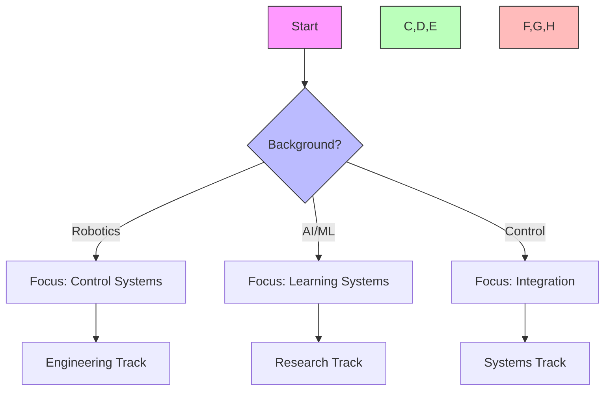

## Path Interconnections
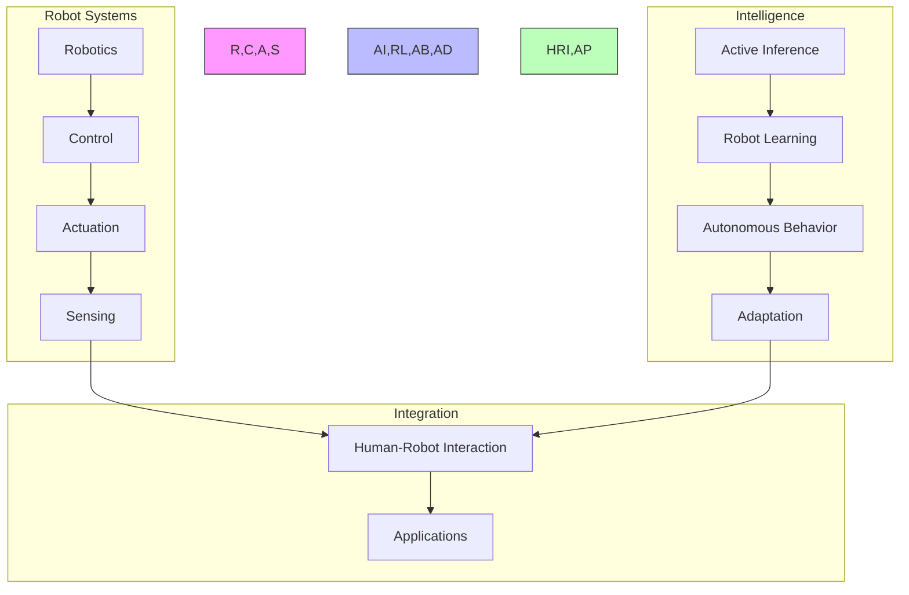

### System Architecture
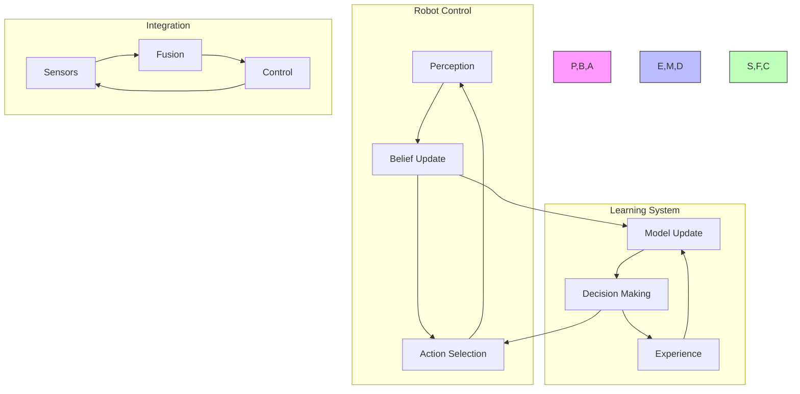

## Prerequisites

### 1. Robotics Foundations (4 weeks)
- Robot Systems
  - Kinematics
  - Dynamics
  - Control theory
  - Sensor integration

- Control Systems
  - Feedback control
  - State estimation
  - Trajectory planning
  - System identification

- Mechanical Systems
  - Actuators
  - Sensors
  - Mechanisms
  - Power systems

- Software Systems
  - Robot middleware
  - Real-time control
  - System architecture
  - Safety systems

### 2. Technical Skills (2 weeks)
- Robotics Tools
  - ROS/ROS2
  - Simulation environments
  - Control libraries
  - Vision systems

## Core Learning Path

### 1. Robot Inference Modeling (4 weeks)

#### Week 1-2: Robot State Inference
```python
class RobotStateEstimator:
    def __init__(self,
                 state_dims: int,
                 sensor_types: List[str]):
        """Initialize robot state estimator."""
        self.state_space = StateSpace(state_dims)
        self.sensor_fusion = SensorFusion(sensor_types)
        self.state_monitor = StateMonitor()
        
    def estimate_state(self,
                      sensor_data: torch.Tensor,
                      control_inputs: torch.Tensor) -> RobotState:
        """Estimate robot system state."""
        sensor_state = self.sensor_fusion.integrate_data(
            sensor_data, control_inputs
        )
        filtered_state = self.state_space.filter_state(sensor_state)
        return self.state_monitor.validate_state(filtered_state)
```

#### Week 3-4: Robot Decision Making
```python
class RobotDecisionMaker:
    def __init__(self,
                 action_space: ActionSpace,
                 cost_function: CostFunction):
        """Initialize robot decision maker."""
        self.action_repertoire = ActionRepertoire(action_space)
        self.cost_evaluator = cost_function
        self.control_policy = ControlPolicy()
        
    def select_action(self,
                     current_state: torch.Tensor,
                     goal_state: torch.Tensor) -> RobotAction:
        """Select robot action."""
        actions = self.action_repertoire.generate_options()
        costs = self.evaluate_action_costs(actions, current_state, goal_state)
        return self.control_policy.select_action(actions, costs)
```

### 2. Robotics Applications (6 weeks)

#### Week 1-2: Basic Control
- Position control
- Velocity control
- Force control
- Impedance control

#### Week 3-4: Advanced Control
- Adaptive control
- Robust control
- Optimal control
- Learning control

#### Week 5-6: Autonomous Systems
- Path planning
- Navigation
- Manipulation
- Task execution

### 3. Robot Intelligence (4 weeks)

#### Week 1-2: Robot Learning
```python
class RobotLearner:
    def __init__(self,
                 state_dim: int,
                 learning_rate: float):
        """Initialize robot learning system."""
        self.memory = ExperienceMemory(state_dim)
        self.learning = LearningMechanism()
        self.adaptation = BehaviorAdaptation(learning_rate)
        
    def learn_behavior(self,
                      environment: Environment) -> BehaviorPolicy:
        """Learn through interaction."""
        experience = self.memory.collect_experience(environment)
        learned_policy = self.learning.update_policy(experience)
        return self.adaptation.refine_behavior(learned_policy)
```

#### Week 3-4: Robot Systems
- System integration
- Behavior synthesis
- Task learning
- Skill transfer

### 4. Advanced Topics (4 weeks)

#### Week 1-2: Robot-Environment Integration
```python
class RobotEnvironmentInterface:
    def __init__(self,
                 robot_systems: List[RobotSystem],
                 integration_params: IntegrationParams):
        """Initialize robot-environment interface."""
        self.systems = robot_systems
        self.integrator = SystemIntegrator(integration_params)
        self.coordinator = BehaviorCoordinator()
        
    def process_interaction(self,
                          inputs: Dict[str, torch.Tensor]) -> SystemState:
        """Process robot-environment interaction."""
        system_states = {system: system.process(inputs[system.name])
                        for system in self.systems}
        integrated_state = self.integrator.combine_states(system_states)
        return self.coordinator.coordinate_behavior(integrated_state)
```

#### Week 3-4: Advanced Robotics
- Multi-robot systems
- Human-robot interaction
- Social robotics
- Cognitive robotics

## Projects

### Robotics Projects
1. **Control Systems**
   - Position control
   - Force control
   - Impedance control
   - Adaptive control

2. **Autonomous Systems**
   - Path planning
   - Navigation
   - Manipulation
   - Task execution

### Advanced Projects
1. **Intelligent Robotics**
   - Learning systems
   - Adaptive behavior
   - Skill acquisition
   - Task generalization

2. **Interactive Systems**
   - Human-robot interaction
   - Social robotics
   - Multi-robot coordination
   - Environmental adaptation

## Resources

### Academic Resources
1. **Research Papers**
   - Robot Control
   - Active Inference
   - Learning Systems
   - Autonomous Robotics

2. **Books**
   - Robot Systems
   - Control Theory
   - Learning Control
   - Cognitive Robotics

### Technical Resources
1. **Software Tools**
   - ROS/ROS2
   - Simulation Tools
   - Control Libraries
   - Vision Systems

2. **Hardware Resources**
   - Robot Platforms
   - Sensor Systems
   - Control Hardware
   - Development Kits

## Next Steps

### Advanced Topics
1. [[robotics_learning_path|Robotics]]
2. [[control_systems_learning_path|Control Systems]]
3. [[embodied_cognition_learning_path|Embodied Cognition]]

### Research Directions
1. [[research_guides/robot_control|Robot Control Research]]
2. [[research_guides/autonomous_systems|Autonomous Systems Research]]
3. [[research_guides/cognitive_robotics|Cognitive Robotics Research]]

## Version History
- Created: 2024-03-15
- Last Updated: 2024-03-15
- Status: Stable
- Version: 1.0.0

## Integration Strategies

### Development Approaches
- Theory-Practice Integration
  - Control theory
  - Robot learning
  - System validation
- Cross-Domain Development
  - Mechanical systems
  - Control systems
  - Cognitive systems
- Research Integration
  - Literature synthesis
  - Experimental design
  - Performance analysis

### Research Framework
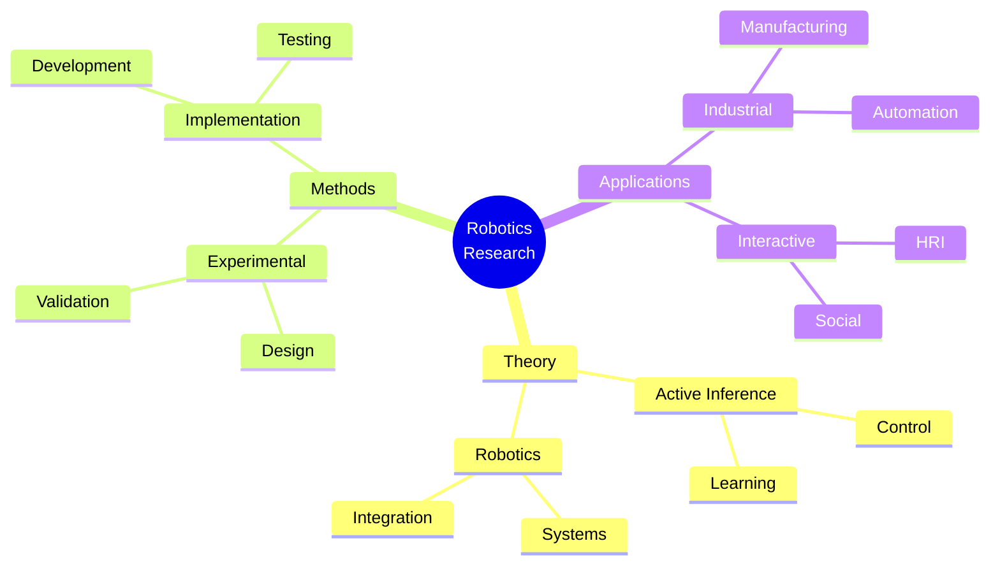

### Development Lifecycle
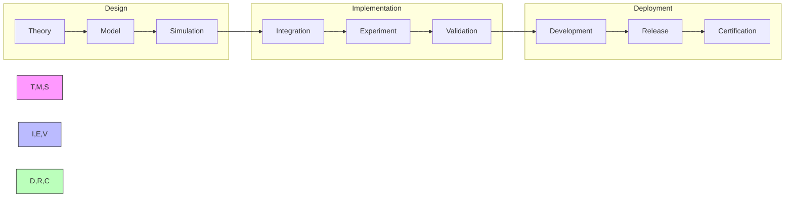

## Assessment Framework

### Continuous Assessment
#### Weekly Checkpoints
- Theoretical Understanding (85% required)
  - Control theory
  - Active inference mathematics
  - Robotics systems
- Implementation Skills (90% required)
  - Robot programming
  - Control implementation
  - System integration
- Research Progress (85% required)
  - Literature review
  - Experimental design
  - Results analysis

#### Progress Tracking
- Daily Development Log
- Weekly System Review
- Monthly Project Assessment
- Quarterly Integration Tests

### Knowledge Checkpoints

#### Foundation Checkpoint (Week 6)
- Format: Written + Implementation
- Duration: 4 hours
- Topics:
  - Robot control systems
  - Active inference basics
  - System integration
- Requirements:
  - Theory: 85% correct
  - Implementation: Working robot controller

#### Advanced Integration (Week 12)
- Format: Research Project
- Duration: 2 weeks
- Focus:
  - Complex control systems
  - Multi-robot integration
  - System validation
- Deliverables:
  - Technical specification
  - Working implementation
  - Validation results

#### Final Assessment (Week 20)
- Format: System Implementation
- Duration: 3 weeks
- Components:
  - Original system
  - Novel implementation
  - Performance validation
- Requirements:
  - Complete system
  - Validation tests
  - Documentation

### Project Portfolio

#### Research Projects
1. Robot Control Development
   - Scope: Control system design
   - Deliverables:
     - Controller implementation
     - Validation results
     - Documentation
   - Evaluation:
     - Code quality: 30%
     - Performance: 40%
     - Documentation: 30%

2. System Integration
   - Scope: Robot system integration
   - Deliverables:
     - System architecture
     - Integration tests
     - Performance analysis
   - Evaluation:
     - Design: 35%
     - Integration: 35%
     - Documentation: 30%

#### Final Project
- Description: Novel Robotics Application
- Requirements:
  - Technical:
    - Original system
    - Performance validation
    - Integration testing
  - Documentation:
    - Technical specs
    - User manual
    - Test reports
  - Presentation:
    - System demo
    - Code review
    - Performance analysis

### Success Criteria
#### Technical Competency
- Theory: Advanced understanding (9/10)
- Implementation: Expert level (9/10)
- Integration: Production quality
- Research: Publication ready

#### Project Delivery
- Quality Standards:
  - Code coverage > 90%
  - Performance validation
  - Documentation complete
- Performance Metrics:
  - Control accuracy
  - System reliability
  - Integration quality

#### Professional Development
- Technical publications
- System implementations
- Conference presentations
- Community contributions

## Career Development

### Industry Alignment
#### Research Roles
- Robotics Engineer
  - Control systems
  - System integration
  - Research design
- Control Systems Specialist
  - Controller design
  - System optimization
  - Performance analysis
- Research Scientist
  - Algorithm development
  - System architecture
  - Innovation design

#### Certification Path
- Robotics Systems
  - Control theory
  - System integration
- Autonomous Systems
  - Robot learning
  - Behavior design
- Research Methods
  - Experimental design
  - Statistical analysis

### Professional Network
#### Research Community
- Academic Connections:
  - Research labs
  - Universities
  - Robotics centers
- Industry Partners:
  - Robotics companies
  - Manufacturing firms
  - Research institutes
- Professional Organizations:
  - IEEE Robotics
  - Control Systems Society
  - Robotics Research Groups

#### Career Progression
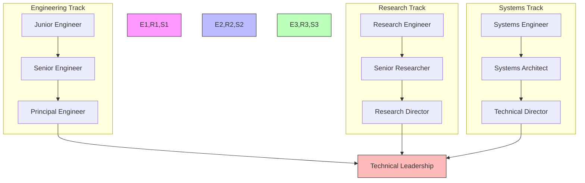

### Competency Framework
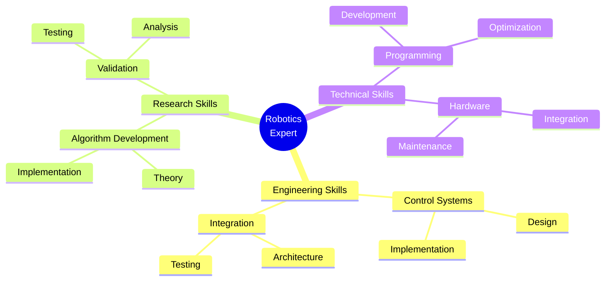

### Research Focus Areas
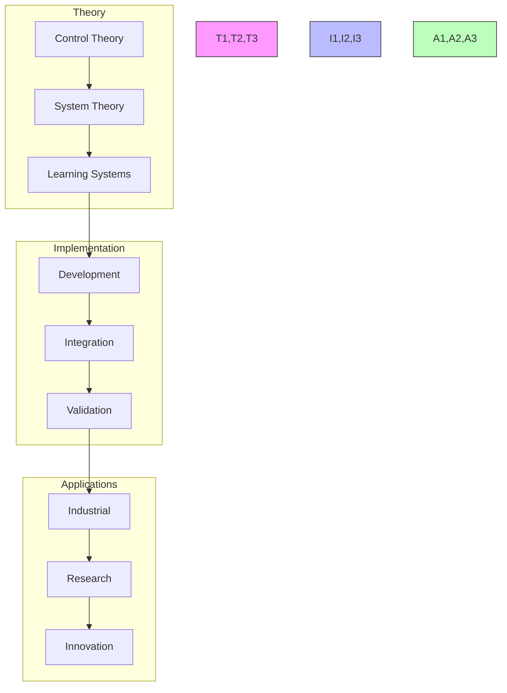

## Support Resources

### Research Support
- Literature Database
  - Robotics papers
  - Control theory
  - System integration
- Computing Resources
  - Simulation platforms
  - Cloud computing
  - Development tools
- Analysis Tools
  - Performance analysis
  - Visualization tools
  - Statistical packages

### Technical Support
- Development Tools
  - ROS/ROS2
  - Control libraries
  - Integration frameworks
- Documentation
  - API references
  - Implementation guides
  - Best practices
- Hardware Resources
  - Robot platforms
  - Sensor systems
  - Control hardware

### Learning Support
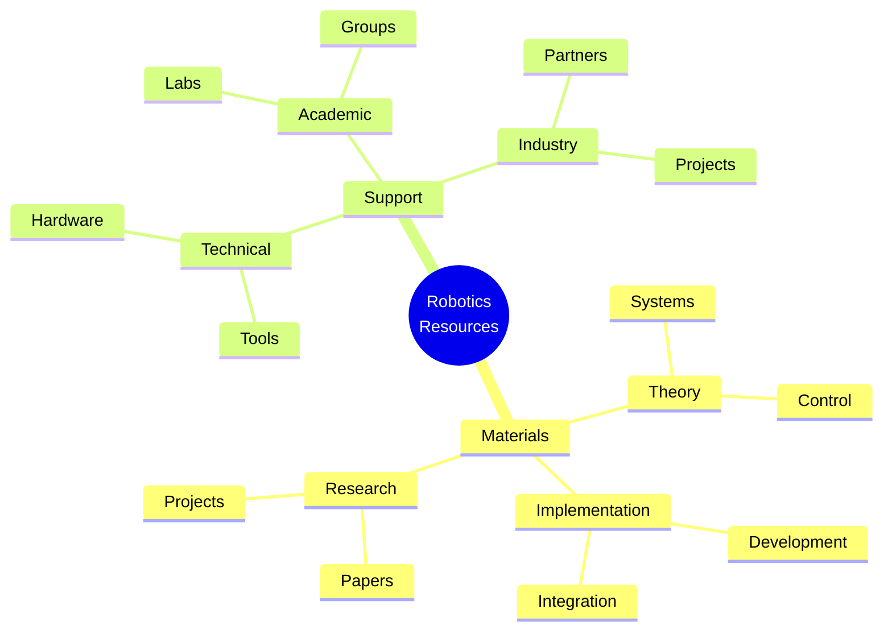

## Version Control and Updates

### Version History
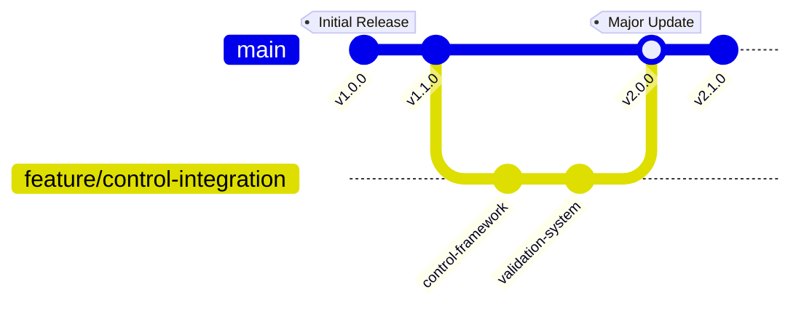

### Change Management
#### Major Updates
- v2.0.0 (Current)
  - Enhanced control framework
  - Advanced robot systems
  - Improved validation system
  - Updated career paths
- v1.1.0
  - Added control systems
  - Enhanced documentation
  - New research projects
- v1.0.0
  - Initial curriculum
  - Basic framework
  - Core concepts

#### Planned Improvements
- Advanced control systems
- Multi-robot integration
- Learning frameworks
- Research extensions

### Quality Metrics
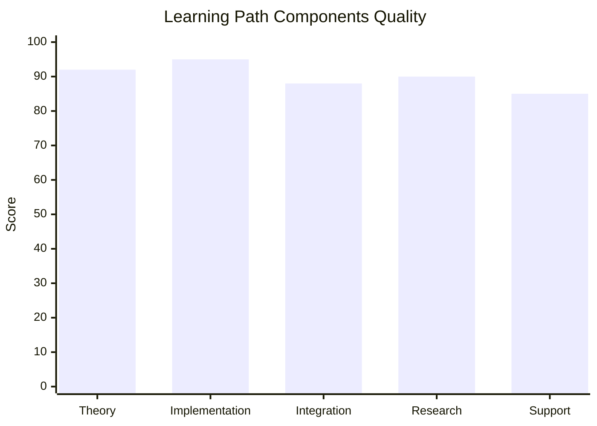

## Learning Analytics

### Progress Tracking
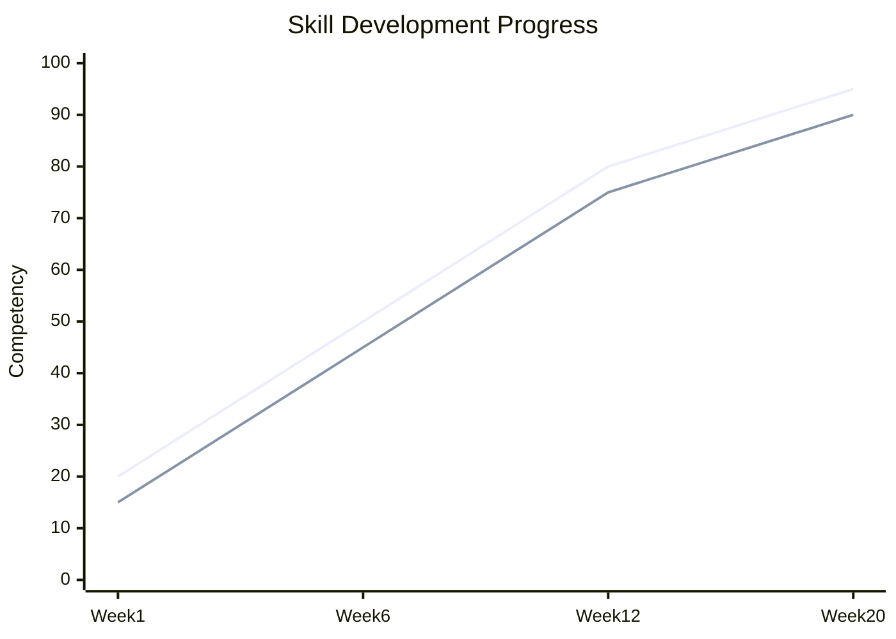

### Performance Metrics
- Engineering Skills
  - Control systems
  - System integration
  - Hardware implementation
- Research Skills
  - Algorithm development
  - Experimental design
  - Data analysis
- Technical Skills
  - Programming
  - System architecture
  - Documentation

### Development Analytics
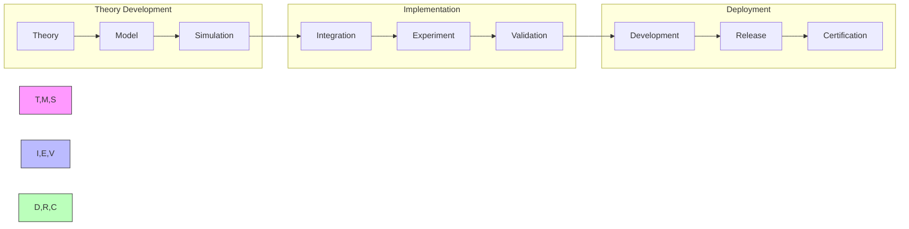

## Final Notes

### Success Stories
- Research Impact
  - Novel systems
  - Control frameworks
  - Field contributions
- Technical Achievements
  - System implementations
  - Integration solutions
  - Performance improvements
- Professional Growth
  - Technical leadership
  - Industry influence
  - Community building

### Additional Resources
- Extended Reading
  - Advanced control
  - System integration
  - Technical guides
- Research Directions
  - Open problems
  - Future applications
  - Integration opportunities
- Community Resources
  - Research groups
  - Technical forums
  - Professional networks

### Contact Information
- Research Support
  - Principal investigators
  - Lab managers
  - Research coordinators
- Technical Support
  - System engineers
  - Control specialists
  - Integration experts
- Industry Support
  - Robotics companies
  - Manufacturing firms
  - Research institutes 