# Active Inference in Robotics Learning Path

## Quick Reference
- **Difficulty**: Advanced
- **Time Commitment**: 25-30 hours/week for 20 weeks
- **Prerequisites Score**: 8/10 (robotics and control systems expertise)
- **Industry Relevance**: High (Robotics, Manufacturing, Research)
- **Hands-on Component**: 60%
- **Theory Component**: 40%

## Executive Summary

### Purpose and Scope
This specialized learning path integrates Active Inference principles with robotics systems, providing a comprehensive framework for developing intelligent and adaptive robots. It bridges control theory with cognitive architectures, focusing on autonomous behavior and human-robot interaction.

### Target Audience
- **Primary**: Robotics engineers and control systems specialists
- **Secondary**: AI researchers and automation engineers
- **Career Stage**: Advanced engineers (3+ years experience)

### Learning Outcomes
By completing this path, learners will be able to:
1. Develop sophisticated robot control systems using Active Inference
2. Implement adaptive and autonomous robotic behaviors
3. Design and validate advanced human-robot interaction systems
4. Apply active inference to real-world robotics applications

### Industry Applications
- Manufacturing: Intelligent automation, adaptive control
- Research: Autonomous systems, cognitive robotics
- Healthcare: Medical robots, assistive systems
- Service: Social robots, interactive systems

## Path Selection Guide
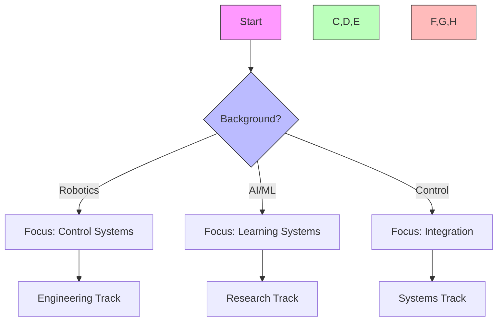

## Path Interconnections
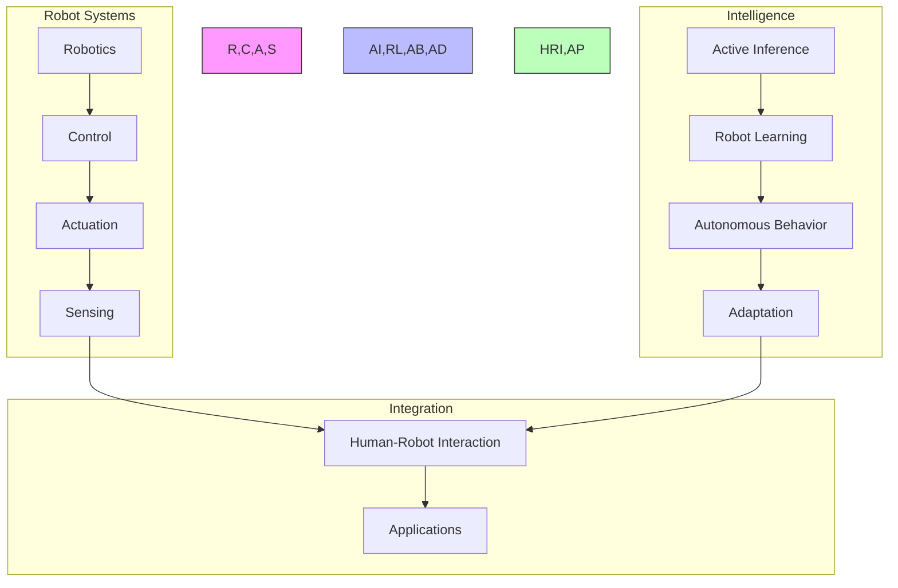

### System Architecture
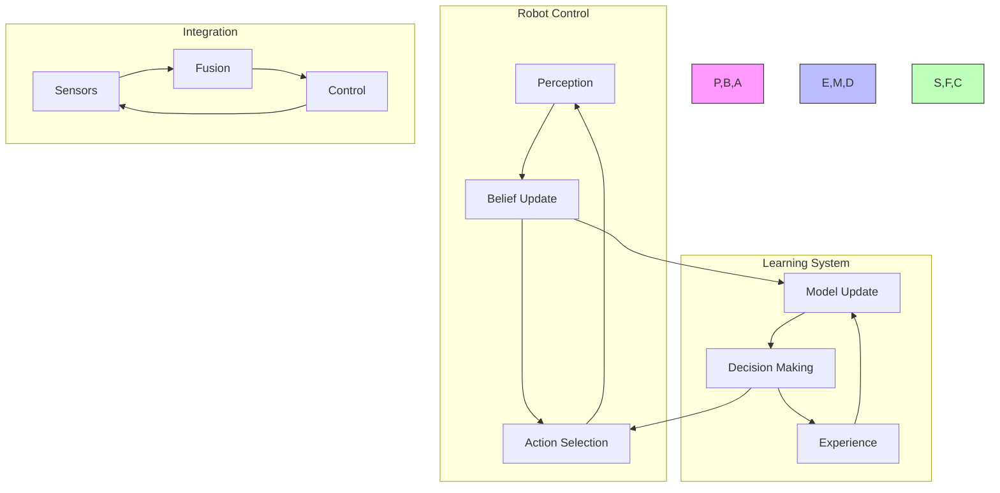

## Prerequisites

### 1. Robotics Foundations (4 weeks)
- Robot Systems
  - Kinematics
  - Dynamics
  - Control theory
  - Sensor integration

- Control Systems
  - Feedback control
  - State estimation
  - Trajectory planning
  - System identification

- Mechanical Systems
  - Actuators
  - Sensors
  - Mechanisms
  - Power systems

- Software Systems
  - Robot middleware
  - Real-time control
  - System architecture
  - Safety systems

### 2. Technical Skills (2 weeks)
- Robotics Tools
  - ROS/ROS2
  - Simulation environments
  - Control libraries
  - Vision systems

## Core Learning Path

### 1. Robot Inference Modeling (4 weeks)

#### Week 1-2: Robot State Inference
```python
class RobotStateEstimator:
    def __init__(self,
                 state_dims: int,
                 sensor_types: List[str]):
        """Initialize robot state estimator."""
        self.state_space = StateSpace(state_dims)
        self.sensor_fusion = SensorFusion(sensor_types)
        self.state_monitor = StateMonitor()
        
    def estimate_state(self,
                      sensor_data: torch.Tensor,
                      control_inputs: torch.Tensor) -> RobotState:
        """Estimate robot system state."""
        sensor_state = self.sensor_fusion.integrate_data(
            sensor_data, control_inputs
        )
        filtered_state = self.state_space.filter_state(sensor_state)
        return self.state_monitor.validate_state(filtered_state)
```

#### Week 3-4: Robot Decision Making
```python
class RobotDecisionMaker:
    def __init__(self,
                 action_space: ActionSpace,
                 cost_function: CostFunction):
        """Initialize robot decision maker."""
        self.action_repertoire = ActionRepertoire(action_space)
        self.cost_evaluator = cost_function
        self.control_policy = ControlPolicy()
        
    def select_action(self,
                     current_state: torch.Tensor,
                     goal_state: torch.Tensor) -> RobotAction:
        """Select robot action."""
        actions = self.action_repertoire.generate_options()
        costs = self.evaluate_action_costs(actions, current_state, goal_state)
        return self.control_policy.select_action(actions, costs)
```

### 2. Robotics Applications (6 weeks)

#### Week 1-2: Basic Control
- Position control
- Velocity control
- Force control
- Impedance control

#### Week 3-4: Advanced Control
- Adaptive control
- Robust control
- Optimal control
- Learning control

#### Week 5-6: Autonomous Systems
- Path planning
- Navigation
- Manipulation
- Task execution

### 3. Robot Intelligence (4 weeks)

#### Week 1-2: Robot Learning
```python
class RobotLearner:
    def __init__(self,
                 state_dim: int,
                 learning_rate: float):
        """Initialize robot learning system."""
        self.memory = ExperienceMemory(state_dim)
        self.learning = LearningMechanism()
        self.adaptation = BehaviorAdaptation(learning_rate)
        
    def learn_behavior(self,
                      environment: Environment) -> BehaviorPolicy:
        """Learn through interaction."""
        experience = self.memory.collect_experience(environment)
        learned_policy = self.learning.update_policy(experience)
        return self.adaptation.refine_behavior(learned_policy)
```

#### Week 3-4: Robot Systems
- System integration
- Behavior synthesis
- Task learning
- Skill transfer

### 4. Advanced Topics (4 weeks)

#### Week 1-2: Robot-Environment Integration
```python
class RobotEnvironmentInterface:
    def __init__(self,
                 robot_systems: List[RobotSystem],
                 integration_params: IntegrationParams):
        """Initialize robot-environment interface."""
        self.systems = robot_systems
        self.integrator = SystemIntegrator(integration_params)
        self.coordinator = BehaviorCoordinator()
        
    def process_interaction(self,
                          inputs: Dict[str, torch.Tensor]) -> SystemState:
        """Process robot-environment interaction."""
        system_states = {system: system.process(inputs[system.name])
                        for system in self.systems}
        integrated_state = self.integrator.combine_states(system_states)
        return self.coordinator.coordinate_behavior(integrated_state)
```

#### Week 3-4: Advanced Robotics
- Multi-robot systems
- Human-robot interaction
- Social robotics
- Cognitive robotics

## Projects

### Robotics Projects
1. **Control Systems**
   - Position control
   - Force control
   - Impedance control
   - Adaptive control

2. **Autonomous Systems**
   - Path planning
   - Navigation
   - Manipulation
   - Task execution

### Advanced Projects
1. **Intelligent Robotics**
   - Learning systems
   - Adaptive behavior
   - Skill acquisition
   - Task generalization

2. **Interactive Systems**
   - Human-robot interaction
   - Social robotics
   - Multi-robot coordination
   - Environmental adaptation

## Resources

### Academic Resources
1. **Research Papers**
   - Robot Control
   - Active Inference
   - Learning Systems
   - Autonomous Robotics

2. **Books**
   - Robot Systems
   - Control Theory
   - Learning Control
   - Cognitive Robotics

### Technical Resources
1. **Software Tools**
   - ROS/ROS2
   - Simulation Tools
   - Control Libraries
   - Vision Systems

2. **Hardware Resources**
   - Robot Platforms
   - Sensor Systems
   - Control Hardware
   - Development Kits

## Next Steps

### Advanced Topics
1. [[robotics_learning_path|Robotics]]
2. [[control_systems_learning_path|Control Systems]]
3. [[embodied_cognition_learning_path|Embodied Cognition]]

### Research Directions
1. [[research_guides/robot_control|Robot Control Research]]
2. [[research_guides/autonomous_systems|Autonomous Systems Research]]
3. [[research_guides/cognitive_robotics|Cognitive Robotics Research]]

## Version History
- Created: 2024-03-15
- Last Updated: 2024-03-15
- Status: Stable
- Version: 1.0.0

## Integration Strategies

### Development Approaches
- Theory-Practice Integration
  - Control theory
  - Robot learning
  - System validation
- Cross-Domain Development
  - Mechanical systems
  - Control systems
  - Cognitive systems
- Research Integration
  - Literature synthesis
  - Experimental design
  - Performance analysis

### Research Framework
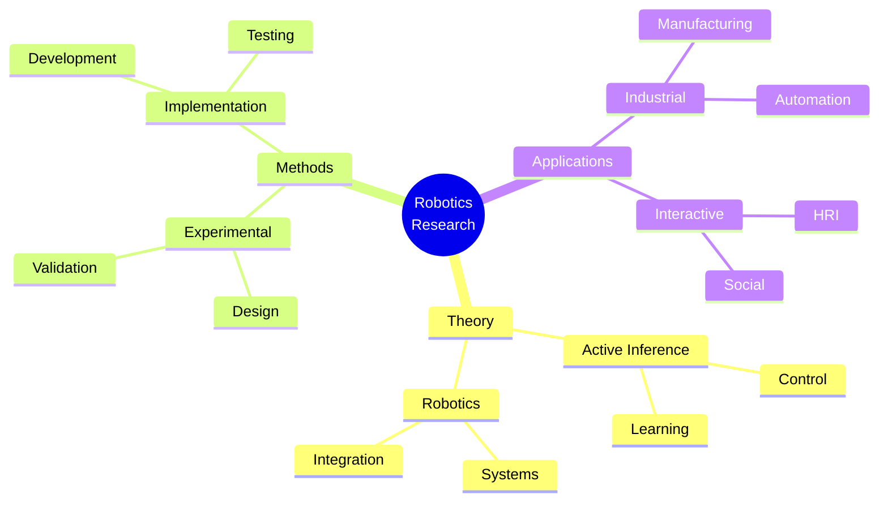

### Development Lifecycle
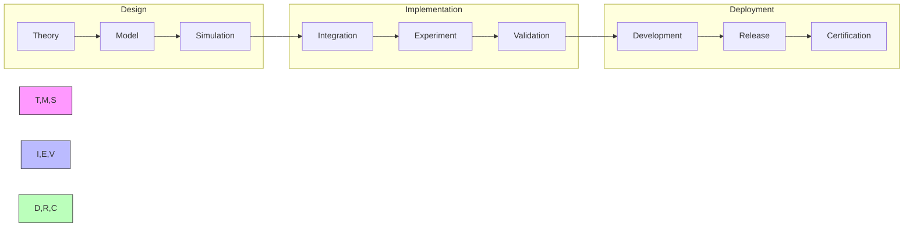

## Assessment Framework

### Continuous Assessment
#### Weekly Checkpoints
- Theoretical Understanding (85% required)
  - Control theory
  - Active inference mathematics
  - Robotics systems
- Implementation Skills (90% required)
  - Robot programming
  - Control implementation
  - System integration
- Research Progress (85% required)
  - Literature review
  - Experimental design
  - Results analysis

#### Progress Tracking
- Daily Development Log
- Weekly System Review
- Monthly Project Assessment
- Quarterly Integration Tests

### Knowledge Checkpoints

#### Foundation Checkpoint (Week 6)
- Format: Written + Implementation
- Duration: 4 hours
- Topics:
  - Robot control systems
  - Active inference basics
  - System integration
- Requirements:
  - Theory: 85% correct
  - Implementation: Working robot controller

#### Advanced Integration (Week 12)
- Format: Research Project
- Duration: 2 weeks
- Focus:
  - Complex control systems
  - Multi-robot integration
  - System validation
- Deliverables:
  - Technical specification
  - Working implementation
  - Validation results

#### Final Assessment (Week 20)
- Format: System Implementation
- Duration: 3 weeks
- Components:
  - Original system
  - Novel implementation
  - Performance validation
- Requirements:
  - Complete system
  - Validation tests
  - Documentation

### Project Portfolio

#### Research Projects
1. Robot Control Development
   - Scope: Control system design
   - Deliverables:
     - Controller implementation
     - Validation results
     - Documentation
   - Evaluation:
     - Code quality: 30%
     - Performance: 40%
     - Documentation: 30%

2. System Integration
   - Scope: Robot system integration
   - Deliverables:
     - System architecture
     - Integration tests
     - Performance analysis
   - Evaluation:
     - Design: 35%
     - Integration: 35%
     - Documentation: 30%

#### Final Project
- Description: Novel Robotics Application
- Requirements:
  - Technical:
    - Original system
    - Performance validation
    - Integration testing
  - Documentation:
    - Technical specs
    - User manual
    - Test reports
  - Presentation:
    - System demo
    - Code review
    - Performance analysis

### Success Criteria
#### Technical Competency
- Theory: Advanced understanding (9/10)
- Implementation: Expert level (9/10)
- Integration: Production quality
- Research: Publication ready

#### Project Delivery
- Quality Standards:
  - Code coverage > 90%
  - Performance validation
  - Documentation complete
- Performance Metrics:
  - Control accuracy
  - System reliability
  - Integration quality

#### Professional Development
- Technical publications
- System implementations
- Conference presentations
- Community contributions

## Career Development

### Industry Alignment
#### Research Roles
- Robotics Engineer
  - Control systems
  - System integration
  - Research design
- Control Systems Specialist
  - Controller design
  - System optimization
  - Performance analysis
- Research Scientist
  - Algorithm development
  - System architecture
  - Innovation design

#### Certification Path
- Robotics Systems
  - Control theory
  - System integration
- Autonomous Systems
  - Robot learning
  - Behavior design
- Research Methods
  - Experimental design
  - Statistical analysis

### Professional Network
#### Research Community
- Academic Connections:
  - Research labs
  - Universities
  - Robotics centers
- Industry Partners:
  - Robotics companies
  - Manufacturing firms
  - Research institutes
- Professional Organizations:
  - IEEE Robotics
  - Control Systems Society
  - Robotics Research Groups

#### Career Progression
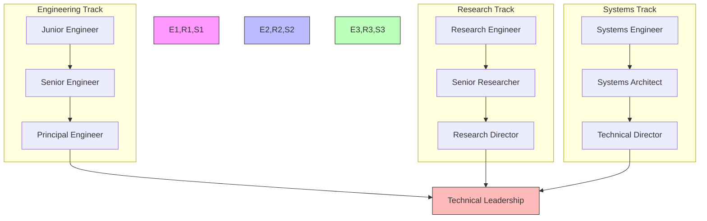

### Competency Framework
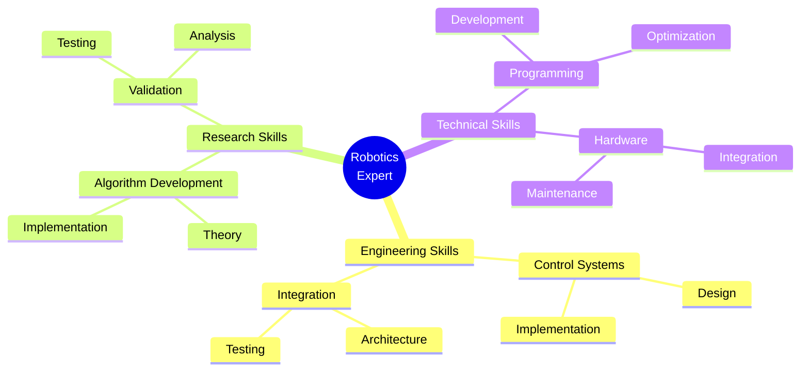

### Research Focus Areas
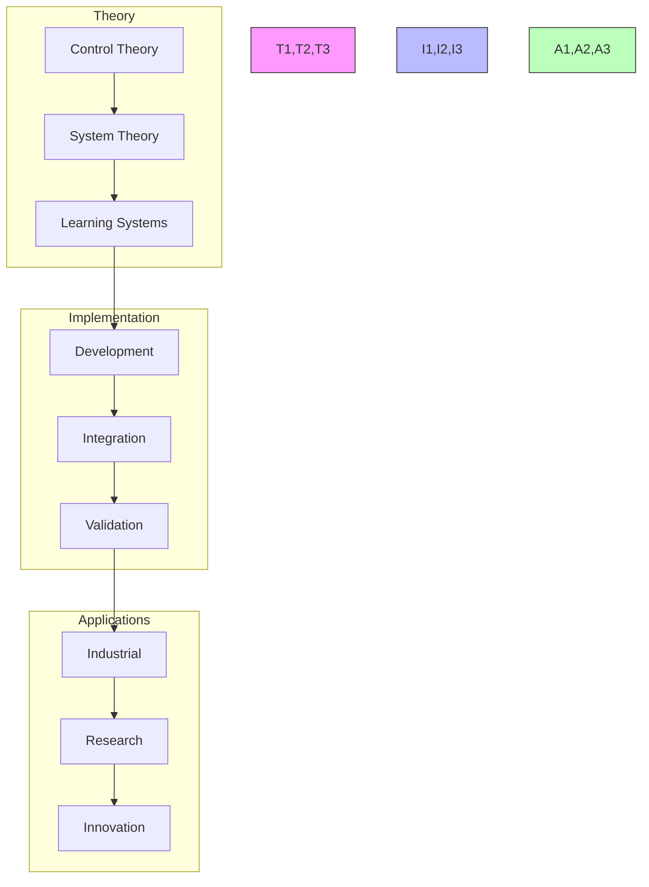

## Support Resources

### Research Support
- Literature Database
  - Robotics papers
  - Control theory
  - System integration
- Computing Resources
  - Simulation platforms
  - Cloud computing
  - Development tools
- Analysis Tools
  - Performance analysis
  - Visualization tools
  - Statistical packages

### Technical Support
- Development Tools
  - ROS/ROS2
  - Control libraries
  - Integration frameworks
- Documentation
  - API references
  - Implementation guides
  - Best practices
- Hardware Resources
  - Robot platforms
  - Sensor systems
  - Control hardware

### Learning Support
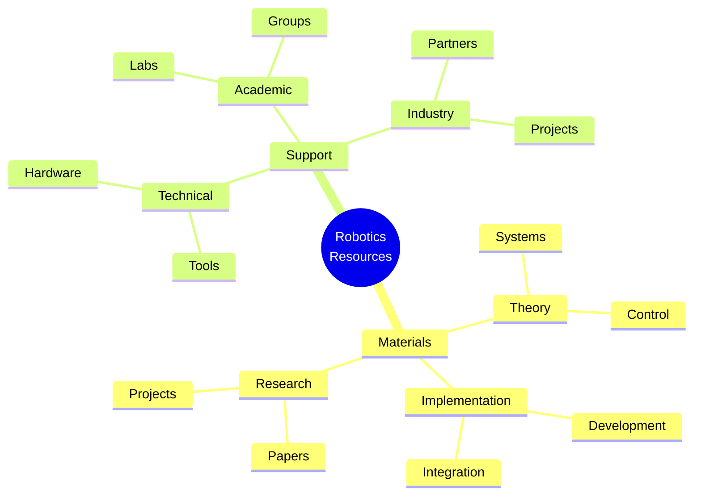

## Version Control and Updates

### Version History
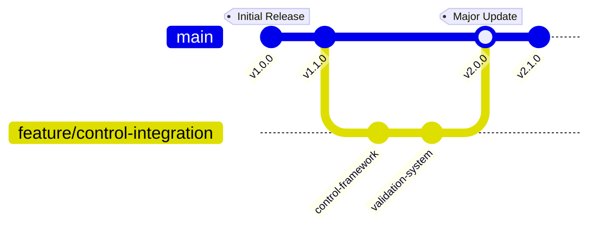

### Change Management
#### Major Updates
- v2.0.0 (Current)
  - Enhanced control framework
  - Advanced robot systems
  - Improved validation system
  - Updated career paths
- v1.1.0
  - Added control systems
  - Enhanced documentation
  - New research projects
- v1.0.0
  - Initial curriculum
  - Basic framework
  - Core concepts

#### Planned Improvements
- Advanced control systems
- Multi-robot integration
- Learning frameworks
- Research extensions

### Quality Metrics
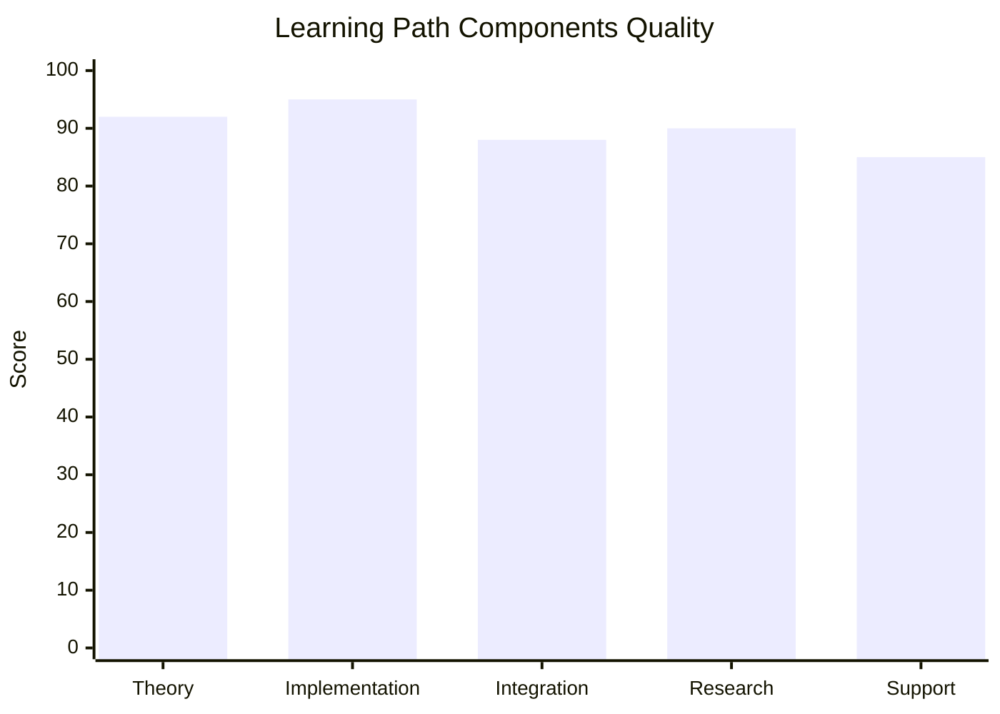

## Learning Analytics

### Progress Tracking
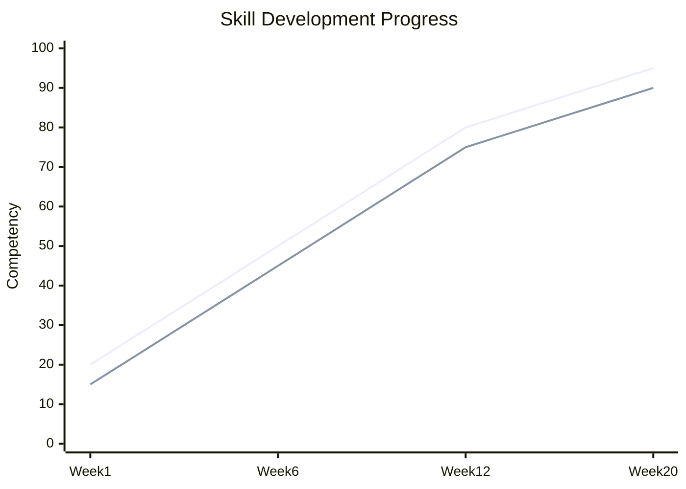

### Performance Metrics
- Engineering Skills
  - Control systems
  - System integration
  - Hardware implementation
- Research Skills
  - Algorithm development
  - Experimental design
  - Data analysis
- Technical Skills
  - Programming
  - System architecture
  - Documentation

### Development Analytics
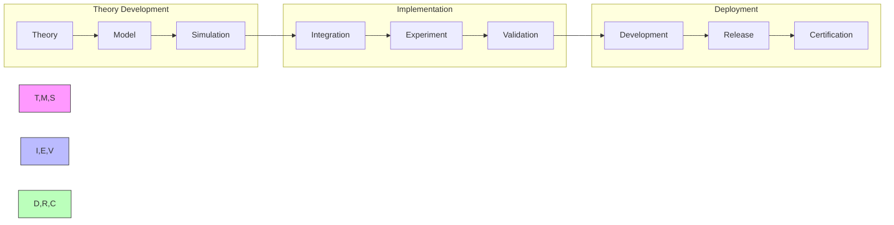

## Final Notes

### Success Stories
- Research Impact
  - Novel systems
  - Control frameworks
  - Field contributions
- Technical Achievements
  - System implementations
  - Integration solutions
  - Performance improvements
- Professional Growth
  - Technical leadership
  - Industry influence
  - Community building

### Additional Resources
- Extended Reading
  - Advanced control
  - System integration
  - Technical guides
- Research Directions
  - Open problems
  - Future applications
  - Integration opportunities
- Community Resources
  - Research groups
  - Technical forums
  - Professional networks

### Contact Information
- Research Support
  - Principal investigators
  - Lab managers
  - Research coordinators
- Technical Support
  - System engineers
  - Control specialists
  - Integration experts
- Industry Support
  - Robotics companies
  - Manufacturing firms
  - Research institutes 