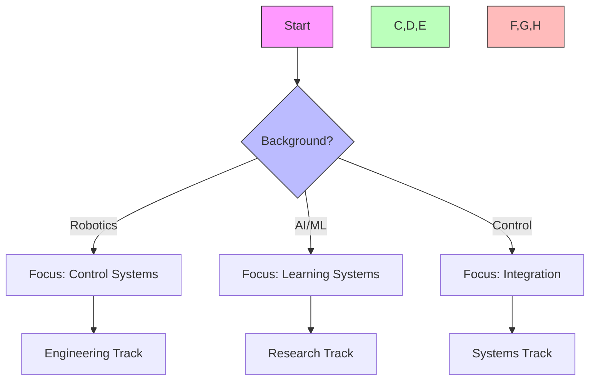
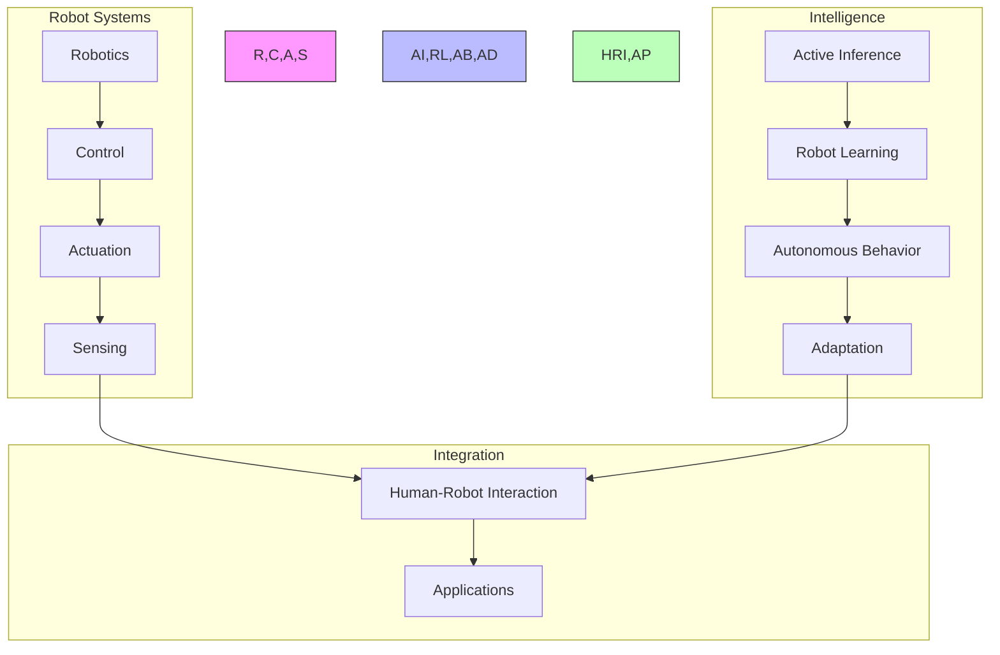
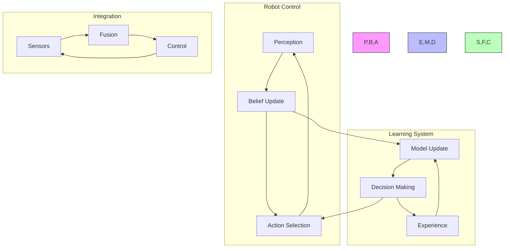
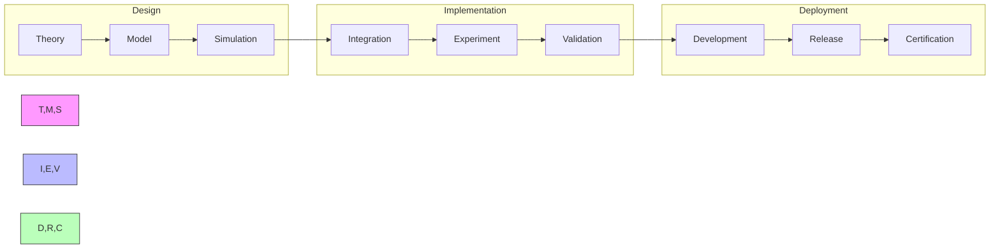
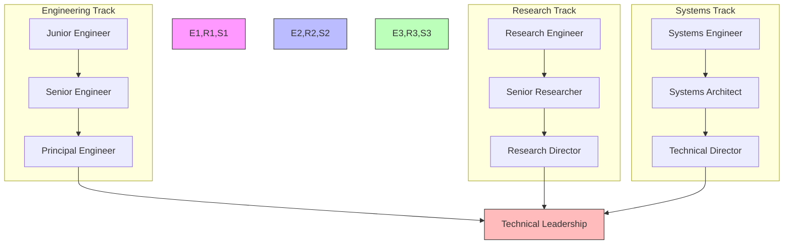
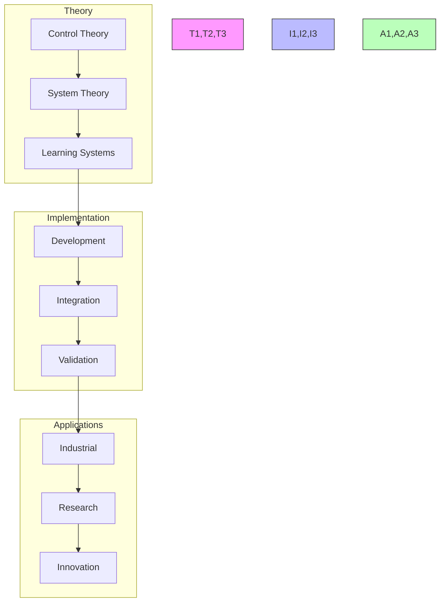
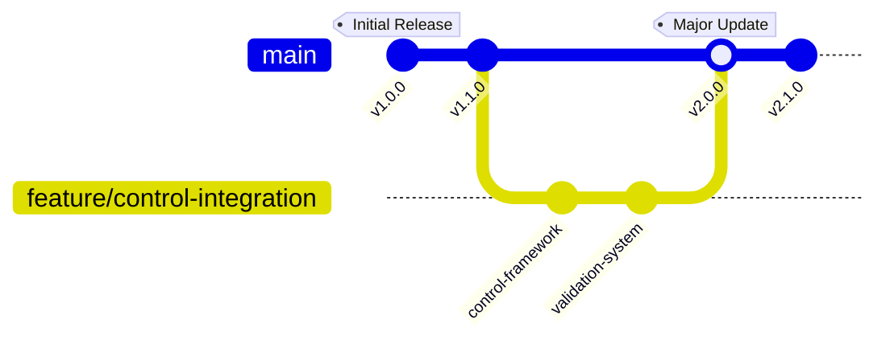
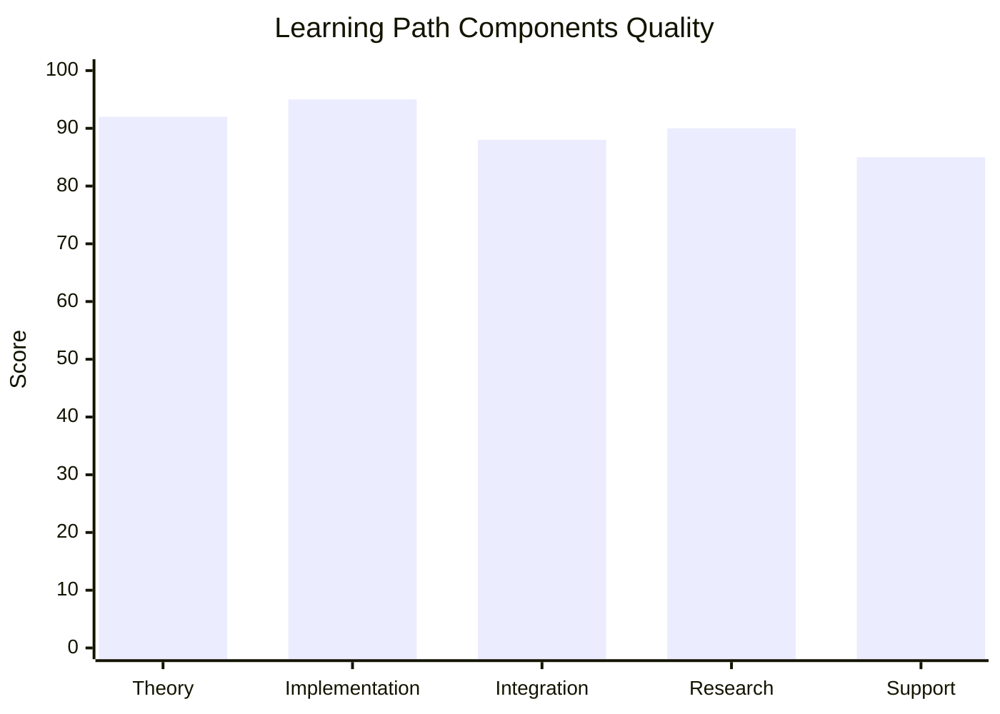
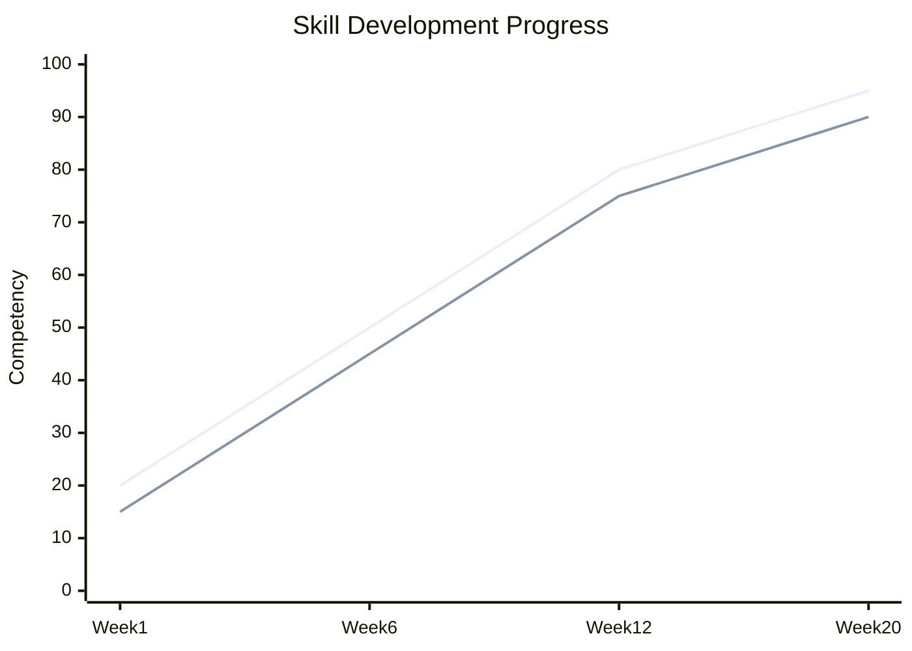
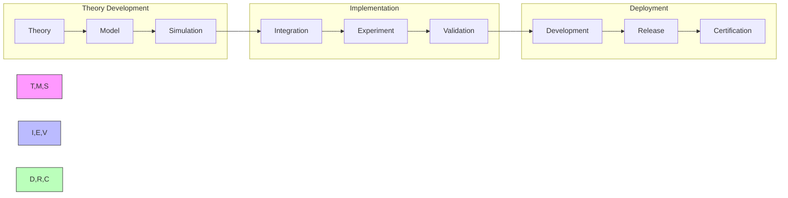

---

title: Active Inference in Robotics Learning Path

type: learning_path

status: stable

created: 2024-03-15

modified: 2024-03-15

modified: 2025-08-08

version: 3.1.0

complexity: advanced

processing_priority: 1

authors:

  - name: Cognitive Systems Team

    role: Research & Development

difficulty_level: advanced

estimated_hours: 520

completion_time: "22 weeks"

certification_track: true

tags:

  - active-inference

  - robotics

  - autonomous-systems

  - embodied-cognition

  - sensorimotor-integration

  - real-time-control

  - distributed-systems

semantic_relations:

  - type: specializes

    links: [[active_inference_learning_path]]

  - type: relates

    links:


---

# Active Inference in Robotics Learning Path

## Quick Start

- Read a robotics-focused survey: “Active Inference in Robotics and Artificial Agents: Survey and Challenges” [arXiv 2112.01871](https://arxiv.org/abs/2112.01871)

- Stand up ROS 2 and a simulator (Gazebo/Ignition) with a minimal mobile base; prototype a discrete Active Inference controller in sim

- Iterate fast: instrument expected free energy components; validate timing budgets in control loops

## External Web Resources

- [[index#centralized-external-web-resources|Centralized resources hub]]

- Robotics survey: [arXiv 2112.01871](https://arxiv.org/abs/2112.01871)

- ROS 2 documentation: [docs.ros.org](https://docs.ros.org/)

- Gazebo (Ignition) docs: [gazebosim.org](https://gazebosim.org/)

- PyTorch for real-time components (when needed): [pytorch.org](https://pytorch.org/)

## Quick Reference

- **Difficulty**: Advanced

- **Time Commitment**: 22-25 hours/week for 22 weeks

- **Prerequisites Score**: 8/10 (robotics and programming expertise)

- **Industry Relevance**: Critical (Robotics, Autonomous Systems)

- **Hands-on Component**: 65%

- **Theory Component**: 35%

## Repo-integrated labs (TDD)

- Validate control loops with Generic POMDP simplifications (timing budgets)

  ```bash
  python3 /home/trim/Documents/GitHub/cognitive/Things/Generic_POMDP/generic_pomdp.py
  ```

- Swarm robotics concepts via Ant Colony

  ```bash
  python3 /home/trim/Documents/GitHub/cognitive/Things/Ant_Colony/ant_colony/main.py --config /home/trim/Documents/GitHub/cognitive/Things/Ant_Colony/config/colony_config.yaml
  ```

  - Add tests for info-gain exploration under resource constraints

### Cross-repo anchors

- `knowledge_base/mathematics/expected_free_energy.md` · `knowledge_base/cognitive/active_inference.md`

## Executive Summary

### Purpose and Scope

This comprehensive learning path integrates Active Inference principles with robotics and autonomous systems, providing theoretical foundations and practical implementation skills for developing intelligent robotic systems. The curriculum emphasizes real-time control, sensorimotor integration, and embodied cognition principles.

### Target Audience

- **Primary**: Robotics engineers and autonomous systems developers

- **Secondary**: AI researchers and mechatronics engineers

- **Career Stage**: Advanced practitioners (3+ years robotics experience)

### Learning Outcomes

By completing this path, learners will be able to:

1. Design and implement Active Inference controllers for robotic systems

1. Develop real-time sensorimotor integration systems

1. Create autonomous robots with adaptive behavior capabilities

1. Implement distributed robotics systems with collective intelligence

### Industry Applications

- Manufacturing: Adaptive industrial robotics

- Automotive: Autonomous vehicle systems

- Healthcare: Medical robotics and assistive devices

- Defense: Autonomous systems and swarm robotics

## Advanced Technical Infrastructure

### Cloud-Integrated Development Environment


### Collaborative Development Platform


### Performance Optimization and Monitoring


## Comprehensive Project Portfolio

### Advanced Robotics Projects


## Path Selection Guide


```mermaid

flowchart TD

    A[Start] --> B{Background?}

    B -->|Robotics| C[Focus: Control Systems]

    B -->|AI/ML| D[Focus: Learning Systems]

    B -->|Control| E[Focus: Integration]

    C --> F[Engineering Track]

    D --> G[Research Track]

    E --> H[Systems Track]

    style A fill:#f9f,stroke:#333

    style B fill:#bbf,stroke:#333

    style C,D,E fill:#bfb,stroke:#333

    style F,G,H fill:#fbb,stroke:#333

```

## Path Interconnections


```mermaid

graph TB

    subgraph Robot Systems

        R[Robotics] --> C[Control]

        C --> A[Actuation]

        A --> S[Sensing]

    end

    subgraph Intelligence

        AI[Active Inference] --> RL[Robot Learning]

        RL --> AB[Autonomous Behavior]

        AB --> AD[Adaptation]

    end

    subgraph Integration

        S --> HRI[Human-Robot Interaction]

        AD --> HRI

        HRI --> AP[Applications]

    end

    style R,C,A,S fill:#f9f,stroke:#333

    style AI,RL,AB,AD fill:#bbf,stroke:#333

    style HRI,AP fill:#bfb,stroke:#333

```

### System Architecture


```mermaid

graph TB

    subgraph Robot Control

        P[Perception] --> B[Belief Update]

        B --> A[Action Selection]

        A --> P

    end

    subgraph Learning System

        E[Experience] --> M[Model Update]

        M --> D[Decision Making]

        D --> E

    end

    subgraph Integration

        S[Sensors] --> F[Fusion]

        F --> C[Control]

        C --> S

    end

    B --> M

    D --> A

    style P,B,A fill:#f9f,stroke:#333

    style E,M,D fill:#bbf,stroke:#333

    style S,F,C fill:#bfb,stroke:#333

```

## Prerequisites

### 1. Robotics Foundations (4 weeks)

- Robot Systems

  - Kinematics

  - Dynamics

  - Control theory

  - Sensor integration

- Control Systems

  - Feedback control

  - State estimation

  - Trajectory planning

  - System identification

- Mechanical Systems

  - Actuators

  - Sensors

  - Mechanisms

  - Power systems

- Software Systems

  - Robot middleware

  - Real-time control

  - System architecture

  - Safety systems

### 2. Technical Skills (2 weeks)

- Robotics Tools

  - ROS/ROS2

  - Simulation environments

  - Control libraries

  - Vision systems

## Core Learning Path

### 1. Robot Inference Modeling (4 weeks)

#### Week 1-2: Robot State Inference


#### Week 3-4: Robot Decision Making


### 2. Robotics Applications (6 weeks)

#### Week 1-2: Basic Control

- Position control

- Velocity control

- Force control

- Impedance control

#### Week 3-4: Advanced Control

- Adaptive control

- Robust control

- Optimal control

- Learning control

#### Week 5-6: Autonomous Systems

- Path planning

- Navigation

- Manipulation

- Task execution

### 3. Robot Intelligence (4 weeks)

#### Week 1-2: Robot Learning


#### Week 3-4: Robot Systems

- System integration

- Behavior synthesis

- Task learning

- Skill transfer

### 4. Advanced Topics (4 weeks)

#### Week 1-2: Robot-Environment Integration


#### Week 3-4: Advanced Robotics

- Multi-robot systems

- Human-robot interaction

- Social robotics

- Cognitive robotics

## Projects

### Robotics Projects

1. **Control Systems**

   - Position control

   - Force control

   - Impedance control

   - Adaptive control

1. **Autonomous Systems**

   - Path planning

   - Navigation

   - Manipulation

   - Task execution

### Advanced Projects

1. **Intelligent Robotics**

   - Learning systems

   - Adaptive behavior

   - Skill acquisition

   - Task generalization

1. **Interactive Systems**

   - Human-robot interaction

   - Social robotics

   - Multi-robot coordination

   - Environmental adaptation

## Resources

### Academic Resources

1. **Research Papers**

   - Robot Control

   - Active Inference

   - Learning Systems

   - Autonomous Robotics

1. **Books**

   - Robot Systems

   - Control Theory

   - Learning Control

   - Cognitive Robotics

### Technical Resources

1. **Software Tools**

   - ROS/ROS2

   - Simulation Tools

   - Control Libraries

   - Vision Systems

1. **Hardware Resources**

   - Robot Platforms

   - Sensor Systems

   - Control Hardware

   - Development Kits

## Next Steps

### Advanced Topics

1. Robotics

1. Control Systems

1. Embodied Cognition

### Research Directions

1. [[knowledge_base/research/robot_control|Robot Control Research]]

1. [[knowledge_base/research/autonomous_systems|Autonomous Systems Research]]

1. [[knowledge_base/research/cognitive_robotics|Cognitive Robotics Research]]

## Version History

- Created: 2024-03-15

- Last Updated: 2024-03-15

- Status: Stable

- Version: 1.0.0

## Integration Strategies

### Development Approaches

- Theory-Practice Integration

  - Control theory

  - Robot learning

  - System validation

- Cross-Domain Development

  - Mechanical systems

  - Control systems

  - Cognitive systems

- Research Integration

  - Literature synthesis

  - Experimental design

  - Performance analysis

### Research Framework

```mermaid

mindmap

    root((Robotics

    Research))

        Theory

            Active Inference

                Control

                Learning

            Robotics

                Systems

                Integration

        Methods

            Experimental

                Design

                Validation

            Implementation

                Development

                Testing

        Applications

            Industrial

                Manufacturing

                Automation

            Interactive

                HRI

                Social

```

### Development Lifecycle


```mermaid

graph LR

    subgraph Design

        T[Theory] --> M[Model]

        M --> S[Simulation]

    end

    subgraph Implementation

        I[Integration] --> E[Experiment]

        E --> V[Validation]

    end

    subgraph Deployment

        D[Development] --> R[Release]

        R --> C[Certification]

    end

    S --> I

    V --> D

    style T,M,S fill:#f9f,stroke:#333

    style I,E,V fill:#bbf,stroke:#333

    style D,R,C fill:#bfb,stroke:#333

```

## Assessment Framework

### Continuous Assessment

#### Weekly Checkpoints

- Theoretical Understanding (85% required)

  - Control theory

  - Active inference mathematics

  - Robotics systems

- Implementation Skills (90% required)

  - Robot programming

  - Control implementation

  - System integration

- Research Progress (85% required)

  - Literature review

  - Experimental design

  - Results analysis

#### Progress Tracking

- Daily Development Log

- Weekly System Review

- Monthly Project Assessment

- Quarterly Integration Tests

### Knowledge Checkpoints

#### Foundation Checkpoint (Week 6)

- Format: Written + Implementation

- Duration: 4 hours

- Topics:

  - Robot control systems

  - Active inference basics

  - System integration

- Requirements:

  - Theory: 85% correct

  - Implementation: Working robot controller

#### Advanced Integration (Week 12)

- Format: Research Project

- Duration: 2 weeks

- Focus:

  - Complex control systems

  - Multi-robot integration

  - System validation

- Deliverables:

  - Technical specification

  - Working implementation

  - Validation results

#### Final Assessment (Week 20)

- Format: System Implementation

- Duration: 3 weeks

- Components:

  - Original system

  - Novel implementation

  - Performance validation

- Requirements:

  - Complete system

  - Validation tests

  - Documentation

### Project Portfolio

#### Research Projects

1. Robot Control Development

   - Scope: Control system design

   - Deliverables:

     - Controller implementation

     - Validation results

     - Documentation

   - Evaluation:

     - Code quality: 30%

     - Performance: 40%

     - Documentation: 30%

1. System Integration

   - Scope: Robot system integration

   - Deliverables:

     - System architecture

     - Integration tests

     - Performance analysis

   - Evaluation:

     - Design: 35%

     - Integration: 35%

     - Documentation: 30%

#### Final Project

- Description: Novel Robotics Application

- Requirements:

  - Technical:

    - Original system

    - Performance validation

    - Integration testing

  - Documentation:

    - Technical specs

    - User manual

    - Test reports

  - Presentation:

    - System demo

    - Code review

    - Performance analysis

### Success Criteria

#### Technical Competency

- Theory: Advanced understanding (9/10)

- Implementation: Expert level (9/10)

- Integration: Production quality

- Research: Publication ready

#### Project Delivery

- Quality Standards:

  - Code coverage > 90%

  - Performance validation

  - Documentation complete

- Performance Metrics:

  - Control accuracy

  - System reliability

  - Integration quality

#### Professional Development

- Technical publications

- System implementations

- Conference presentations

- Community contributions

## Career Development

### Industry Alignment

#### Research Roles

- Robotics Engineer

  - Control systems

  - System integration

  - Research design

- Control Systems Specialist

  - Controller design

  - System optimization

  - Performance analysis

- Research Scientist

  - Algorithm development

  - System architecture

  - Innovation design

#### Certification Path

- Robotics Systems

  - Control theory

  - System integration

- Autonomous Systems

  - Robot learning

  - Behavior design

- Research Methods

  - Experimental design

  - Statistical analysis

### Professional Network

#### Research Community

- Academic Connections:

  - Research labs

  - Universities

  - Robotics centers

- Industry Partners:

  - Robotics companies

  - Manufacturing firms

  - Research institutes

- Professional Organizations:

  - IEEE Robotics

  - Control Systems Society

  - Robotics Research Groups

#### Career Progression


```mermaid

graph TB

    subgraph Engineering Track

        E1[Junior Engineer] --> E2[Senior Engineer]

        E2 --> E3[Principal Engineer]

    end

    subgraph Research Track

        R1[Research Engineer] --> R2[Senior Researcher]

        R2 --> R3[Research Director]

    end

    subgraph Systems Track

        S1[Systems Engineer] --> S2[Systems Architect]

        S2 --> S3[Technical Director]

    end

    E3 --> L[Technical Leadership]

    R3 --> L

    S3 --> L

    style E1,R1,S1 fill:#f9f,stroke:#333

    style E2,R2,S2 fill:#bbf,stroke:#333

    style E3,R3,S3 fill:#bfb,stroke:#333

    style L fill:#fbb,stroke:#333

```

### Competency Framework

```mermaid

mindmap

    root((Robotics

    Expert))

        Engineering Skills

            Control Systems

                Design

                Implementation

            Integration

                Architecture

                Testing

        Research Skills

            Algorithm Development

                Theory

                Implementation

            Validation

                Testing

                Analysis

        Technical Skills

            Programming

                Development

                Optimization

            Hardware

                Integration

                Maintenance

```

### Research Focus Areas


```mermaid

graph TB

    subgraph Theory

        T1[Control Theory] --> T2[System Theory]

        T2 --> T3[Learning Systems]

    end

    subgraph Implementation

        I1[Development] --> I2[Integration]

        I2 --> I3[Validation]

    end

    subgraph Applications

        A1[Industrial] --> A2[Research]

        A2 --> A3[Innovation]

    end

    T3 --> I1

    I3 --> A1

    style T1,T2,T3 fill:#f9f,stroke:#333

    style I1,I2,I3 fill:#bbf,stroke:#333

    style A1,A2,A3 fill:#bfb,stroke:#333

```

## Support Resources

### Research Support

- Literature Database

  - Robotics papers

  - Control theory

  - System integration

- Computing Resources

  - Simulation platforms

  - Cloud computing

  - Development tools

- Analysis Tools

  - Performance analysis

  - Visualization tools

  - Statistical packages

### Technical Support

- Development Tools

  - ROS/ROS2

  - Control libraries

  - Integration frameworks

- Documentation

  - API references

  - Implementation guides

  - Best practices

- Hardware Resources

  - Robot platforms

  - Sensor systems

  - Control hardware

### Learning Support

```mermaid

mindmap

    root((Robotics

    Resources))

        Materials

            Theory

                Control

                Systems

            Implementation

                Development

                Integration

            Research

                Papers

                Projects

        Support

            Technical

                Tools

                Hardware

            Academic

                Labs

                Groups

            Industry

                Partners

                Projects

```

## Version Control and Updates

### Version History (Robotics)


```mermaid

gitGraph

    commit id: "v1.0.0" tag: "Initial Release"

    commit id: "v1.1.0"

    branch feature/control-integration

    commit id: "control-framework"

    commit id: "validation-system"

    checkout main

    merge feature/control-integration id: "v2.0.0" tag: "Major Update"

    commit id: "v2.1.0"

```

### Change Management (Robotics)

#### Major Updates

- v2.0.0 (Current)

  - Enhanced control framework

  - Advanced robot systems

  - Improved validation system

  - Updated career paths

- v1.1.0

  - Added control systems

  - Enhanced documentation

  - New research projects

- v1.0.0

  - Initial curriculum

  - Basic framework

  - Core concepts

#### Planned Improvements

- Advanced control systems

- Multi-robot integration

- Learning frameworks

- Research extensions

### Quality Metrics


```mermaid

xychart-beta

    title "Learning Path Components Quality"

    x-axis [Theory, Implementation, Integration, Research, Support]

    y-axis "Score" 0 --> 100

    bar [92, 95, 88, 90, 85]

```

## Learning Analytics

### Robotics Learning Progress Tracking


```mermaid

xychart-beta

    title "Skill Development Progress"

    x-axis [Week 1, Week 6, Week 12, Week 20]

    y-axis "Competency" 0 --> 100

    line [20, 50, 80, 95]

    line [15, 45, 75, 90]

```

### Skill and System Performance Metrics

- Engineering Skills

  - Control systems

  - System integration

  - Hardware implementation

- Research Skills

  - Algorithm development

  - Experimental design

  - Data analysis

- Technical Skills

  - Programming

  - System architecture

  - Documentation

### Development Analytics


```mermaid

graph LR

    subgraph Theory Development

        T[Theory] --> M[Model]

        M --> S[Simulation]

    end

    subgraph Implementation

        I[Integration] --> E[Experiment]

        E --> V[Validation]

    end

    subgraph Deployment

        D[Development] --> R[Release]

        R --> C[Certification]

    end

    S --> I

    V --> D

    style T,M,S fill:#f9f,stroke:#333

    style I,E,V fill:#bbf,stroke:#333

    style D,R,C fill:#bfb,stroke:#333

```

## Final Notes

### Success Stories

- Research Impact

  - Novel systems

  - Control frameworks

  - Field contributions

- Technical Achievements

  - System implementations

  - Integration solutions

  - Performance improvements

- Professional Growth

  - Technical leadership

  - Industry influence

  - Community building

### Additional Resources

- Extended Reading

  - Advanced control

  - System integration

  - Technical guides

- Research Directions

  - Open problems

  - Future applications

  - Integration opportunities

- Community Resources

  - Research groups

  - Technical forums

  - Professional networks

### Contact Information

- Research Support

  - Principal investigators

  - Lab managers

  - Research coordinators

- Technical Support

  - System engineers

  - Control specialists

  - Integration experts

- Industry Support

  - Robotics companies

  - Manufacturing firms

  - Research institutes
