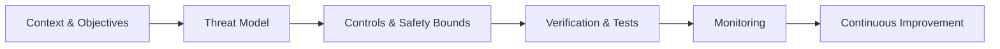
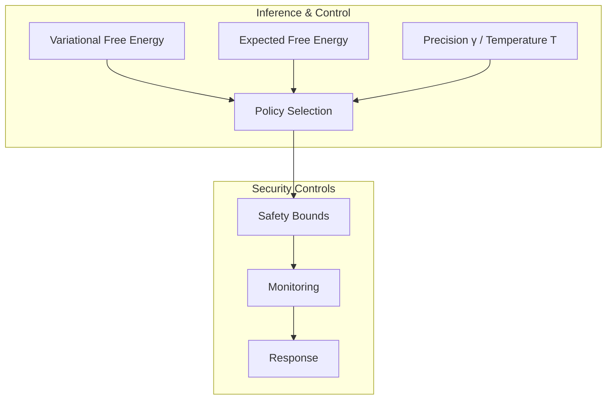
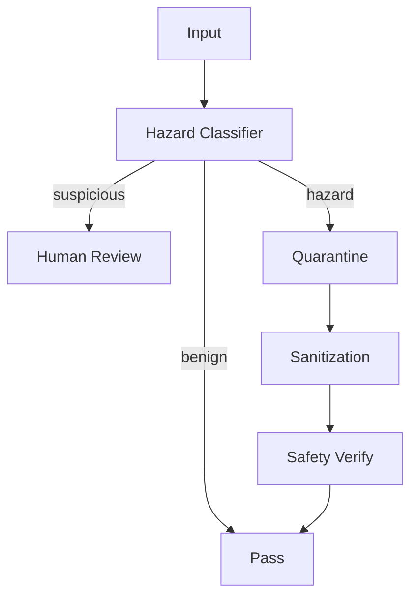

---

title: Active Inference in Cognitive Security Learning Path

type: learning_path

status: stable

created: 2024-03-15

complexity: advanced

processing_priority: 1

tags:

  - active-inference

  - cognitive-security

  - infohazard-management

  - security-protocols

semantic_relations:

  - type: specializes

    links: [[active_inference_learning_path]]

  - type: relates

    links:

      - [[cognitive_safety_learning_path]]

      - [[infohazard_management_learning_path]]

      - [[security_protocols_learning_path]]

---

# Active Inference in Cognitive Security Learning Path

## Quick Start

- Align to public frameworks: read NIST AI RMF 1.0 and skim EU AI Act obligations

- Define a minimal threat model for your Active Inference component (assets, threats, mitigations)

- Add safety bounds tests (entropy → [[../../knowledge_base/mathematics/information_theory]], action limits → [[../../knowledge_base/mathematics/action_distribution]]) and a red-team regression test



## External Web Resources

- [Centralized resources hub](./index.md#centralized-external-web-resources)

- NIST AI Risk Management Framework 1.0: [nist.gov/ai/rmf](https://www.nist.gov/itl/ai-risk-management-framework)

- EU AI Act official (EUR-Lex): [eur-lex.europa.eu](https://eur-lex.europa.eu/)

- ISO/IEC 27001 overview: [iso.org](https://www.iso.org/standard/27001.html)

- MITRE ATLAS (adversarial ML): [atlas.mitre.org](https://atlas.mitre.org/)

## Overview

This specialized path focuses on applying Active Inference to cognitive security, infohazard management, and secure information processing. It integrates security principles with cognitive architectures while maintaining robust safeguards.

> Note: Core math links include VFE/EFE, policy selection, precision/temperature control, and numerical stability.

### Core Active Inference References

- [[../../knowledge_base/cognitive/active_inference]]

- [[../../knowledge_base/mathematics/expected_free_energy]]

- [[../../knowledge_base/mathematics/policy_selection]]

- [[../../knowledge_base/mathematics/precision_parameter]]

 - [[../../knowledge_base/mathematics/numerical_stability]]

- [[../../knowledge_base/mathematics/temperature_parameter]]

- [[../../knowledge_base/mathematics/markov_blanket]]

- [[../../knowledge_base/cognitive/predictive_coding]]

- [[../../knowledge_base/mathematics/convergence_control]]

- [[../../knowledge_base/mathematics/annealing_schedules]]

 - [[../../knowledge_base/mathematics/softmax_function]]



## Prerequisites

### 1. Security Foundations (4 weeks)

- Information Security

  - Cryptography basics

  - Security protocols

  - Threat modeling

  - Risk assessment

- Cognitive Security

  - Mental models

  - Information hazards

  - Cognitive vulnerabilities

  - Protection mechanisms

- Ethics & Safety

  - Responsible disclosure

  - Ethical guidelines

  - Safety protocols

  - Containment strategies

- Systems Theory

  - Security architecture

  - Defense in depth

  - System boundaries

  - Failure modes

#### Governance & Compliance (1 week)

- Map NIST AI RMF functions to program activities

- Identify applicable EU AI Act obligations

- Define evidence and reporting templates

### 2. Technical Skills (2 weeks)

- Security Tools

  - Security frameworks

  - Monitoring systems

  - Analysis tools

  - Containment systems

## Core Learning Path

### 1. Cognitive Security Modeling (4 weeks)

#### Week 1-2: Security State Inference

```python

class CognitiveSecurityMonitor:

    def __init__(self,

                 security_dims: List[int],

                 threat_levels: List[str]):

        """Initialize cognitive security monitor."""

        self.security_model = SecurityModel(security_dims)

        self.threat_detector = ThreatDetector(threat_levels)

        self.containment_system = ContainmentSystem()

    def assess_security_state(self,

                            information_state: torch.Tensor,

                            safety_bounds: SafetyBounds) -> SecurityState:

        """Assess cognitive security state."""

        threat_assessment = self.threat_detector.analyze(information_state)

        security_measures = self.security_model.recommend_measures(threat_assessment)

        return self.containment_system.validate_state(security_measures)

```

#### Week 3-4: Infohazard Management

```python

class InfohazardManager:

    def __init__(self,

                 hazard_types: List[str],

                 containment_protocols: Dict[str, Protocol]):

        """Initialize infohazard management system."""

        self.hazard_classifier = HazardClassifier(hazard_types)

        self.containment = containment_protocols

        self.safety_verifier = SafetyVerifier()

    def manage_infohazard(self,

                         information: Information,

                         context: Context) -> SafetyResponse:

        """Manage potential infohazard."""

        hazard_level = self.hazard_classifier.classify(information)

        protocol = self.select_containment_protocol(hazard_level)

        return self.apply_containment(information, protocol, context)

```

Threat model template (YAML):

```yaml

assets:

  - name: belief_state

    sensitivity: high

threats:

  - id: T1

    desc: exfiltration via action channel

    likelihood: medium

    impact: high

controls:

  - id: C1

    desc: action-rate limiter & entropy cap

verification:

  - id: V1

    desc: red-team simulation with bounded policies

```

### 2. Security Applications (6 weeks)

#### Week 1-2: Threat Detection

- Pattern recognition

- Anomaly detection

- Risk assessment

- Early warning systems

#### Week 3-4: Containment Strategies

- Information containment

- Cognitive quarantine

- Hazard isolation

- Security boundaries ([[../../knowledge_base/mathematics/markov_blanket]])

Containment architecture:



#### Week 5-6: Security Protocols

- Access control

- Information flow

- Security policies

- Response procedures

### 3. Advanced Security (4 weeks)

#### Week 1-2: Security Architecture

```python

class SecurityArchitecture:

    def __init__(self,

                 security_layers: List[SecurityLayer],

                 verification_system: VerificationSystem):

        """Initialize security architecture."""

        self.layers = security_layers

        self.verifier = verification_system

        self.monitor = SecurityMonitor()

    def process_information(self,

                          input_information: Information,

                          security_policy: SecurityPolicy) -> SafeInformation:

        """Process information through security layers."""

        current_state = input_information

        for layer in self.layers:

            current_state = layer.apply_security(current_state)

            self.verifier.verify_safety(current_state)

        return self.monitor.ensure_safety(current_state)

```

Layered design checklist:

- Perception guardrails (input validation, provenance)

- Inference guardrails (precision bounds [[../../knowledge_base/mathematics/precision_parameter]], annealing [[../../knowledge_base/mathematics/annealing_schedules]])

- Action guardrails (policy entropy bounds, blocking lists)

- Logging & audit (immutable logs, metrics)

#### Week 3-4: Response Systems

- Incident response

- Recovery procedures

- System restoration

- Learning mechanisms

Key metrics:

- Time-to-detect (TTD), time-to-respond (TTR)

- Bounded-entropy violations per 1k decisions

- Hazard classification precision/recall

### 4. Advanced Topics (4 weeks)

#### Week 1-2: Cognitive Defense

```python

class CognitiveDefenseSystem:

    def __init__(self,

                 defense_mechanisms: List[DefenseMechanism],

                 safety_bounds: SafetyBounds):

        """Initialize cognitive defense system."""

        self.mechanisms = defense_mechanisms

        self.bounds = safety_bounds

        self.monitor = DefenseMonitor()

    def protect_cognition(self,

                         cognitive_state: CognitiveState,

                         threat_model: ThreatModel) -> ProtectedState:

        """Apply cognitive protection measures."""

        defense_plan = self.plan_defense(cognitive_state, threat_model)

        protected_state = self.apply_defenses(defense_plan)

        return self.monitor.validate_protection(protected_state)

```

#### Week 3-4: Future Security

- Advanced threats

- Emerging hazards

- Security evolution

- Adaptive defense

## Projects

### Security Projects

1. **Security Implementation**

   - Threat detection

   - Containment systems

   - Response protocols

   - Recovery procedures

1. **Infohazard Management**

   - Classification systems

   - Containment protocols

   - Safety verification

   - Risk mitigation

1. **Red Teaming Protocols**

   - Adversary simulation design

   - Reproducible test corpus

   - Safety regressions and gates

### Advanced Projects

1. **Cognitive Protection**

   - Defense mechanisms

   - Security architecture

   - Monitoring systems

   - Recovery procedures

1. **Future Security**

   - Threat prediction

   - Adaptive defense

   - Evolution tracking

   - Resilience building

## Resources

### Academic Resources

1. **Research Papers**

   - Cognitive Security

   - Infohazard Management

   - Security Theory

   - Defense Systems

1. **Books**

   - Security Principles

   - Cognitive Defense

   - Information Safety

   - Protection Systems

### Technical Resources

1. **Software Tools**

   - Security Frameworks

   - Monitoring Systems

   - Analysis Tools

   - Protection Systems

1. **Security Resources**

   - Threat Databases

   - Security Protocols

   - Defense Patterns

   - Safety Guidelines

### Patterns & References

- NIST AI RMF 1.0 mappings

- MITRE ATLAS tactic-mitigations

- EU AI Act conformity assessment artifacts

## Next Steps

### Advanced Topics

1. [[cognitive_safety_learning_path|Cognitive Safety]]

1. [[infohazard_management_learning_path|Infohazard Management]]

1. [[security_protocols_learning_path|Security Protocols]]

### Research Directions

1. [[research_guides/cognitive_security|Cognitive Security Research]]

1. [[research_guides/infohazard_management|Infohazard Management Research]]

1. [[research_guides/security_evolution|Security Evolution Research]]

