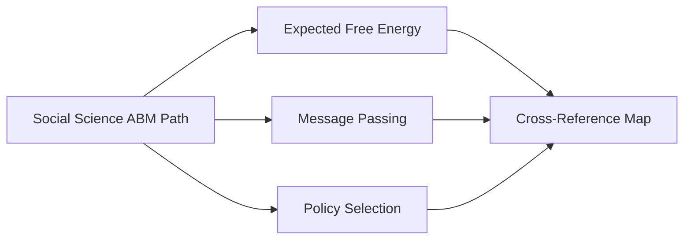

# Active Inference and Social Science ABM Learning Path

## Quick Start

- Pick a platform and replicate a minimal ABM: NetLogo (fast prototyping) or Mesa (Python)

- Add an Active Inference agent variant; compare emergent macro behavior against baseline

- Use JASSS articles for model validation norms; share models on ComSES

## External Web Resources

- [[index#centralized-external-web-resources|Centralized resources hub]]

- Mesa (Python ABM) docs: [mesa.readthedocs.io](https://mesa.readthedocs.io/)

- NetLogo docs: [ccl.northwestern.edu/netlogo](https://ccl.northwestern.edu/netlogo/)

- Journal of Artificial Societies and Social Simulation (JASSS): [jasss.soc.surrey.ac.uk](https://jasss.soc.surrey.ac.uk/)

- ComSES Network model library and resources: [comses.net](https://www.comses.net/)

### Foundations

- [[knowledge_base/mathematics/expected_free_energy]] · [[knowledge_base/mathematics/policy_selection]] · [[knowledge_base/mathematics/precision_parameter]] · [[knowledge_base/mathematics/softmax_function]] · [[knowledge_base/mathematics/numerical_stability]] · [[knowledge_base/mathematics/message_passing]] · [[knowledge_base/mathematics/bethe_free_energy]]

## Knowledge Base Anchors

- Social systems and networks: [[knowledge_base/cognitive/collective_behavior]] · [[knowledge_base/cognitive/swarm_intelligence]] · [[knowledge_base/cognitive/attention_networks]]

- Math core: [[knowledge_base/mathematics/message_passing]] · [[knowledge_base/mathematics/expected_free_energy]] · [[knowledge_base/mathematics/policy_selection]]

- Cross-map: [[knowledge_base/mathematics/cross_reference_map]]



## Introduction

This learning path guide provides a structured approach to understanding and implementing abm in social science through the lens of active inference. It is designed to accommodate learners from both the active inference and social science communities, acknowledging their distinct ontological perspectives and methodological backgrounds.

### Purpose and Scope

- Bridge the conceptual gap between active inference and social science

- Provide practical implementation guidelines for abm development

- Foster interdisciplinary collaboration and knowledge exchange

- Enable robust social simulation research

### Target Audience

1. **social scientists**

   - Researchers in sociology, anthropology, and political science

   - Policy analysts and social planners

   - computational social science practitioners

1. **active inference Researchers**

   - Cognitive scientists

   - Neuroscientists

   - machine learning researchers

1. **abm Practitioners**

   - complex systems modelers

   - simulation specialists

   - Data scientists

### Learning Outcomes

By completing this learning path, you will be able to:

1. Design and implement social ABMs using active inference principles

1. Analyze complex social phenomena through computational modeling

1. Validate and calibrate social simulations

1. Contribute to interdisciplinary research projects

## Prerequisites

- Basic understanding of probability theory and statistics

- Familiarity with at least one programming language (python recommended)

- Background in either social science research methods or computational modeling

- Basic understanding of complex systems concepts

## Core Concepts and Ontological Frameworks

### 1. Social Science Foundations

- **Key Theoretical Frameworks**

  - structuration theory

  - social network analysis

  - complex adaptive systems

  - emergence and social emergence

  - social construction of reality

- **Methodological Approaches**

  - qualitative research methods

  - quantitative research methods

  - mixed methods research

  - computational social science

### 2. Active Inference Foundations

- **Theoretical Components**

  - free energy principle

  - variational free energy

  - markov blankets

  - generative models

  - belief updating

  - action selection

- **Mathematical Prerequisites**

  - bayesian inference

  - variational inference

  - information theory

  - dynamical systems

### 3. Agent-Based Modeling Fundamentals

- **Core Concepts**

  - Emergence

  - agent architecture

  - environment design

  - interaction rules

  - model validation

  - calibration techniques

- **Technical Skills**

  - Programming Fundamentals

  - ABM Frameworks

  - Data Structures

  - [[knowledge_base/cognitive/visualization_tools]]

- **Advanced Agent Architectures**

  - cognitive architectures

    - BDI (Belief-Desire-Intention)

    - SOAR

    - act r

  - social cognitive architectures

    - theory of mind implementation

    - social learning mechanisms

    - cultural evolution models

- **Environment Modeling Approaches**

  - spatial representations

    - GIS

    - network topologies

    - hybrid spaces

  - temporal dynamics

    - event driven simulation

    - continuous time models

    - multi scale temporal integration

### 4. Integration Frameworks

- **Theoretical Integration**

  - active inference in social systems

  - social theory in computation

  - multi scale integration

- **Technical Integration**

  - Hybrid Modeling Approaches

  - Data-Model Integration

  - Theory-Model Mapping

## Learning Trajectory

### Phase 1: Foundations (4-6 weeks)

1. **social science concepts**

   - social theory

   - research methods

   - data collection

1. **Active Inference Basics**

   - [[knowledge_base/cognitive/free_energy_principle|FEP Fundamentals]]

   - [[knowledge_base/cognitive/belief_updating|Belief Update Methods]]

   - [[knowledge_base/cognitive/action_selection|Action Selection Principles]]

1. **ABM Fundamentals**

   - Agent Design

   - Environment Modeling

   - Basic Implementations

1. **Mathematical Foundations**

   - Information Theory Basics

   - Probability Theory

   - Statistical Inference

   - Dynamical Systems

1. **Computational Thinking**

   - Algorithmic Problem Solving

   - Data Structures for Social Science

   - Complexity Analysis

   - Pattern Recognition

### Phase 2: Integration (6-8 weeks)

1. **bridging concepts**

   - social mechanisms in active inference

   - active inference in social systems

   - multi agent active inference

1. **technical implementation**

   - programming tools

   - simulation frameworks

   - data analysis methods

### Phase 3: Advanced Applications (8-12 weeks)

1. **complex social phenomena**

   - collective behavior

   - social norms

   - institution formation

1. **advanced modeling**

   - multi level models

   - hybrid approaches

   - validation methods

### Phase 4: Specialization Tracks (12-16 weeks)

1. **social network analysis track**

   - network theory fundamentals

   - dynamic network analysis

   - social influence models

   - network intervention design

1. **policy analysis track**

   - policy design principles

   - impact assessment

   - scenario analysis

   - stakeholder modeling

1. **cultural evolution track**

   - cultural transmission models

   - innovation diffusion

   - social learning dynamics

   - cultural attractor theory

1. **organizational dynamics track**

   - organizational structure modeling

   - decision making processes

   - resource allocation

   - institutional change

## Tools and Resources

### Software Tools

1. **abm platforms**

   - netlogo

   - mesa python

   - mason

   - repast

   - anylogic

1. **programming languages**

   - Python

   - Julia

   - R

   - MATLAB

1. **analysis tools**

   - jupyter notebooks

   - statistical packages

   - visualization libraries

### Learning Resources

#### Books

1. **Social Science References**

   - Complex Adaptive Systems - Miller and Page

   - Generative Social Science - Epstein

   - Agent-Based Models - Gilbert

1. **Active Inference References**

   - Active Inference - Parr et al

   - The Free Energy Principle - Friston

   - Hidden - A Theory of Learning - Friston et al

#### Online Resources

1. **Courses**

   - Complexity Explorer (Santa Fe Institute)

   - Coursera Computational Social Science

   - EdX System Dynamics and Complexity

1. **Communities**

   - Complex Systems Society

   - Society for Social Simulation

   - Active Inference Institute

   - OpenAI Forums

## Research Areas and Applications

### Current Research Directions

1. **social dynamics**

   - opinion formation

   - social network evolution

   - cultural transmission

1. **economic systems**

   - market behavior

   - innovation diffusion

   - organizational dynamics

1. **political processes**

   - voting behavior

   - policy diffusion

   - conflict dynamics

### Methodological Challenges

1. **validation methods**

   - empirical validation

   - theory validation

   - cross validation techniques

1. **scale issues**

   - micro macro links

   - emergence properties

   - computational complexity

1. **integration challenges**

   - data integration methods

   - theory integration

   - method integration

## Best Practices and Guidelines

### Model Development

1. **design principles**

   - parsimony in modeling

   - modular design

   - scalable architecture

   - reproducible research

1. **documentation standards**

   - code documentation

   - model documentation

   - validation reports

### Research Ethics

1. **data ethics**

   - privacy in social simulation

   - informed consent

   - representation ethics

1. **model ethics**

   - bias in social models

   - model transparency

   - ethical modeling

## Future Directions

### Emerging Trends

1. **technical advances**

   - deep learning in abm

   - quantum social simulation

   - cloud based abm

1. **theoretical developments**

   - extended active inference

   - social physics

   - computational sociology

## Mathematical Foundations

The variational free energy \( F \) is defined as:

\[ F = \mathbb{E}_{q(s)}[\ln q(s) - \ln p(o,s)] \]

where:

- \( q(s) \) is the approximate posterior

- \( p(o,s) \) is the generative model

- \( s \) represents hidden states

- \( o \) represents observations

For multi agent systems, the joint free energy becomes:

\[ F_{joint} = \sum_i F_i + \mathcal{I}(s_1,...,s_n) \]

where \( \mathcal{I}(s_1,...,s_n) \) represents agent interactions.

## Code Examples

#### 1. Basic Active Inference Agent in Python

```python

import numpy as np

from scipy.special import softmax

class ActiveInferenceAgent:

    """

    Basic implementation of an [[knowledge_base/cognitive/active_inference]] agent for Social ABM

    """

    def __init__(self, num_states, num_observations, num_actions):

        # Initialize model parameters

        self.A = np.ones((num_observations, num_states)) / num_states  # Likelihood matrix

        self.B = np.ones((num_states, num_states, num_actions)) / num_states  # Transition matrix

        self.C = np.zeros(num_observations)  # Preferred observations

        self.D = np.ones(num_states) / num_states  # Initial state beliefs

        self.num_states = num_states

        self.num_actions = num_actions

    def update_beliefs(self, observation):

        # Belief updating using variational inference

        q = self.D.copy()

        for _ in range(10):  # Fixed point iteration

            q_prev = q.copy()

            q = softmax(np.log(self.D) + np.dot(self.A.T, observation))

            if np.abs(q - q_prev).max() < 1e-4:

                break

        return q

    def select_action(self, beliefs):

        # Action selection using expected free energy

        G = np.zeros(self.num_actions)

        for a in range(self.num_actions):

            # Calculate expected free energy for each action

            expected_state = np.dot(self.B[:,:,a].T, beliefs)

            expected_obs = np.dot(self.A, expected_state)

            G[a] = np.dot(expected_obs, self.C) - np.sum(expected_obs * np.log(expected_obs + 1e-8))

        return softmax(-G)  # Return action probabilities

```

#### 2. Social Network ABM Example

```python

import networkx as nx

import numpy as np

class SocialABM:

    def __init__(self, num_agents, connection_probability):

        # Initialize social network

        self.G = nx.erdos_renyi_graph(num_agents, connection_probability)

        self.agents = {}

        # Initialize agents with beliefs and states

        for node in self.G.nodes():

            self.agents[node] = {

                'belief': np.random.dirichlet(np.ones(5)),  # 5 possible belief states

                'state': np.random.choice(5),

                'susceptibility': np.random.random()

            }

    def update_agent_beliefs(self, agent_id):

        # Get neighboring beliefs

        neighbor_beliefs = []

        for neighbor in self.G.neighbors(agent_id):

            neighbor_beliefs.append(self.agents[neighbor]['belief'])

        if neighbor_beliefs:

            # Social influence mechanism

            mean_belief = np.mean(neighbor_beliefs, axis=0)

            agent = self.agents[agent_id]

            # Update beliefs using weighted average

            susceptibility = agent['susceptibility']

            agent['belief'] = (1 - susceptibility) * agent['belief'] + \

                            susceptibility * mean_belief

            # Normalize beliefs

            agent['belief'] /= agent['belief'].sum()

    def simulate_step(self):

        # Update all agents

        for agent_id in self.G.nodes():

            self.update_agent_beliefs(agent_id)

            # Update state based on beliefs

            self.agents[agent_id]['state'] = np.random.choice(

                5, p=self.agents[agent_id]['belief']

            )

```

#### 3. Integration Example: Active Inference Social Agents

```python

class SocialActiveInferenceAgent:

    """

    Implementation of a social agent using [[knowledge_base/cognitive/active_inference]] principles.

    Related concepts:

    - [[knowledge_base/cognitive/belief_updating]]

    - [[knowledge_base/cognitive/social_learning]]

    - cultural evolution

    """

    def __init__(self, id, num_states, social_weight=0.5):

        self.id = id

        self.num_states = num_states

        self.social_weight = social_weight

        # Individual beliefs

        self.private_beliefs = np.ones(num_states) / num_states

        # Social beliefs (influenced by others)

        self.social_beliefs = np.ones(num_states) / num_states

    def update_beliefs(self, observation, neighbor_beliefs):

        # Update private beliefs using active inference

        self.private_beliefs = self._update_private_beliefs(observation)

        # Update social beliefs based on neighbors

        if neighbor_beliefs:

            self.social_beliefs = np.mean(neighbor_beliefs, axis=0)

        # Combine private and social beliefs

        combined_beliefs = (1 - self.social_weight) * self.private_beliefs + \

                         self.social_weight * self.social_beliefs

        return combined_beliefs / combined_beliefs.sum()

    def _update_private_beliefs(self, observation):

        # Simplified belief updating

        likelihood = self._compute_likelihood(observation)

        posterior = likelihood * self.private_beliefs

        return posterior / posterior.sum()

    def _compute_likelihood(self, observation):

        # Placeholder for likelihood computation

        # In practice, this would depend on the specific model

        return np.exp(-0.5 * (observation - np.arange(self.num_states))**2)

```

#### 4. Validation and Analysis Tools

```python

class ModelValidator:

    def __init__(self, empirical_data, model_output):

        self.empirical_data = empirical_data

        self.model_output = model_output

    def compute_kl_divergence(self):

        """Compute KL divergence between empirical and model distributions"""

        eps = 1e-10  # Small constant to avoid log(0)

        P = self.empirical_data + eps

        Q = self.model_output + eps

        P_norm = P / P.sum()

        Q_norm = Q / Q.sum()

        return np.sum(P_norm * np.log(P_norm / Q_norm))

    def compute_network_metrics(self, empirical_network, model_network):

        """Compare network-level statistics"""

        metrics = {

            'empirical_density': nx.density(empirical_network),

            'model_density': nx.density(model_network),

            'empirical_clustering': nx.average_clustering(empirical_network),

            'model_clustering': nx.average_clustering(model_network),

            'empirical_path_length': nx.average_shortest_path_length(empirical_network),

            'model_path_length': nx.average_shortest_path_length(model_network)

        }

        return metrics

```

#### 5. Advanced Social ABM Implementation

```python

class ComplexSocialAgent:

    def __init__(self, id, num_cultural_dimensions, num_states):

        self.id = id

        self.cultural_vector = np.random.random(num_cultural_dimensions)

        self.opinion = np.random.normal(0, 1)

        self.phase = np.random.uniform(0, 2*np.pi)

        self.active_inference = SocialActiveInferenceAgent(id, num_states)

    def cultural_similarity(self, other_agent):

        """Compute cultural similarity with another agent"""

        return 1 - np.mean(np.abs(self.cultural_vector - other_agent.cultural_vector))

    def update_opinion(self, neighbors, dt=0.1, noise_strength=0.1):

        """Update opinion based on social influence"""

        social_influence = sum(

            self.influence_weight(neighbor) * (neighbor.opinion - self.opinion)

            for neighbor in neighbors

        )

        noise = np.random.normal(0, noise_strength)

        self.opinion += dt * (social_influence + noise)

    def influence_weight(self, other_agent):

        """Compute social influence weight"""

        similarity = self.cultural_similarity(other_agent)

        return np.exp(similarity) / (1 + np.exp(similarity))

    def update_phase(self, neighbors, coupling_strength=1.0, dt=0.1):

        """Update phase for collective behavior"""

        phase_diff = sum(np.sin(neighbor.phase - self.phase) for neighbor in neighbors)

        self.phase += dt * (self.natural_frequency + coupling_strength * phase_diff)

```

#### 6. Advanced Social Phenomena

```python

class CulturalEvolutionModel:

    def __init__(self, num_agents, num_cultural_variants):

        self.agents = [ComplexSocialAgent(i, num_cultural_variants, 5) 

                      for i in range(num_agents)]

        self.cultural_distribution = np.zeros(num_cultural_variants)

    def simulate_transmission(self, beta=1.0):

        """Simulate cultural transmission process"""

        for agent in self.agents:

            # Select cultural model

            similarities = [agent.cultural_similarity(other) 

                          for other in self.agents if other != agent]

            weights = np.exp(beta * np.array(similarities))

            weights /= weights.sum()

            # Transmit culture

            model_idx = np.random.choice(len(similarities), p=weights)

            model = [a for a in self.agents if a != agent][model_idx]

            # Update cultural vector

            transmission_rate = 0.1

            agent.cultural_vector = (1 - transmission_rate) * agent.cultural_vector + \

                                 transmission_rate * model.cultural_vector

```

#### 7. Enhanced Validation Tools

```python

class AdvancedModelValidator(ModelValidator):

    def compute_entropy(self, distribution):

        """Compute Shannon entropy of distribution"""

        p = distribution / distribution.sum()

        return -np.sum(p * np.log2(p + 1e-10))

    def compute_cultural_diversity(self, agents):

        """Measure cultural diversity in population"""

        cultural_vectors = np.array([agent.cultural_vector for agent in agents])

        return np.mean([

            np.std(cultural_vectors[:, i]) 

            for i in range(cultural_vectors.shape[1])

        ])

    def analyze_network_structure(self, network):

        """Comprehensive network analysis"""

        metrics = {

            'density': nx.density(network),

            'clustering': nx.average_clustering(network),

            'assortativity': nx.degree_assortativity_coefficient(network),

            'modularity': self._compute_modularity(network),

            'hierarchy': self._compute_hierarchy(network)

        }

        return metrics

    def _compute_modularity(self, network):

        """Compute network modularity using community detection"""

        communities = nx.community.greedy_modularity_communities(network)

        return nx.community.modularity(network, communities)

    def _compute_hierarchy(self, network):

        """Compute hierarchical structure measure"""

        in_degrees = dict(network.in_degree())

        return np.var(list(in_degrees.values())) / np.mean(list(in_degrees.values()))

    def validate_dynamics(self, empirical_timeseries, model_timeseries):

        """Compare empirical and model time series"""

        from scipy import stats

        metrics = {

            'correlation': stats.pearsonr(empirical_timeseries, model_timeseries)[0],

            'kl_divergence': self.compute_kl_divergence(),

            'wasserstein': stats.wasserstein_distance(

                empirical_timeseries, model_timeseries

            ),

            'ks_statistic': stats.ks_2samp(

                empirical_timeseries, model_timeseries

            ).statistic

        }

        return metrics

```

## References and Further Reading

### Key Papers

1. **foundational works**

   - Friston, K. (2010)

   - Epstein, J. (2006)

   - Miller & Page (2007)

1. **recent developments**

   - Recent papers

   - Latest developments

   - Methodological advances

### Software Documentation

- netlogo documentation

- mesa documentation

- python abm resources

- active inference tools

---

Tags: #active_inference #abm #social_science #computational_modeling #learning_path

