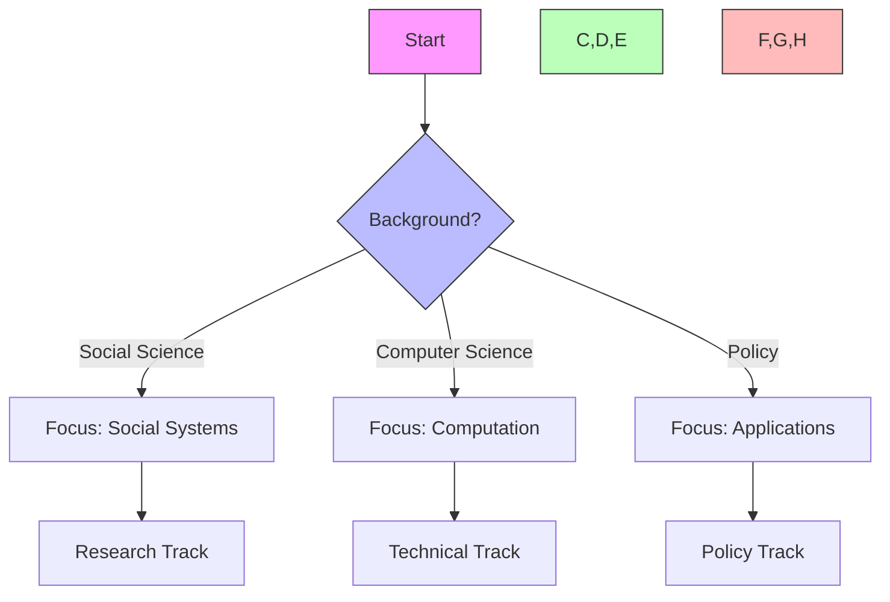
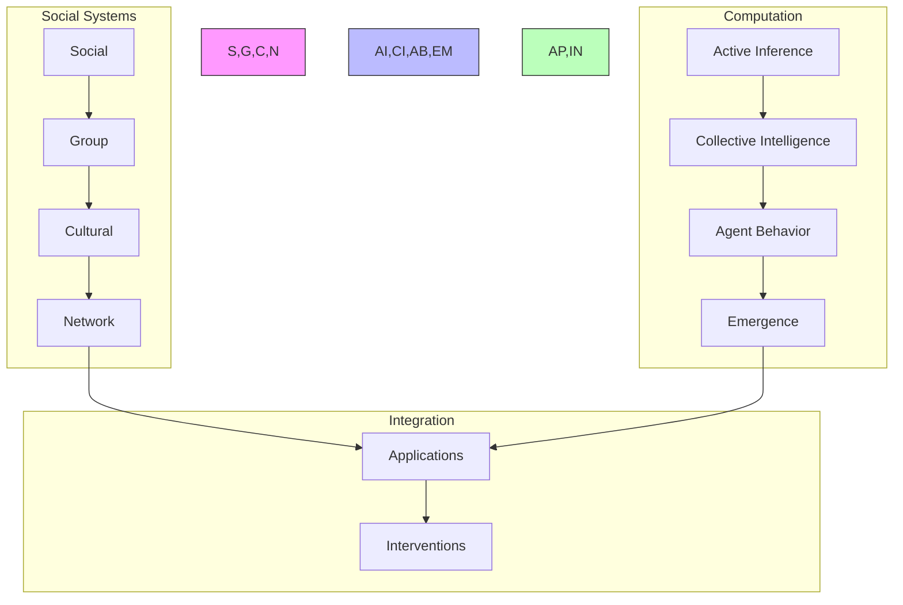
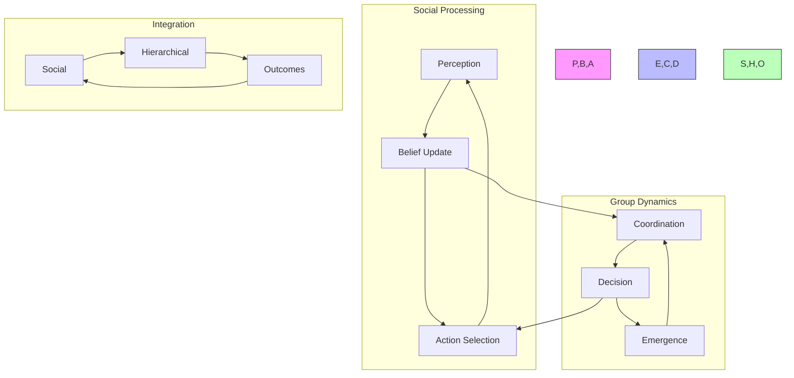
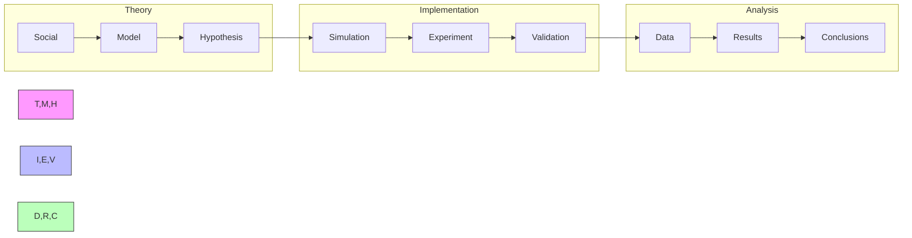
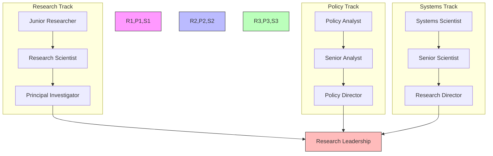
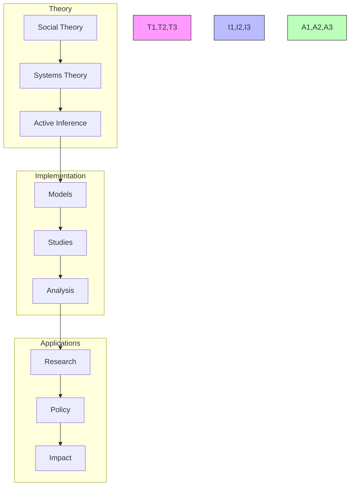
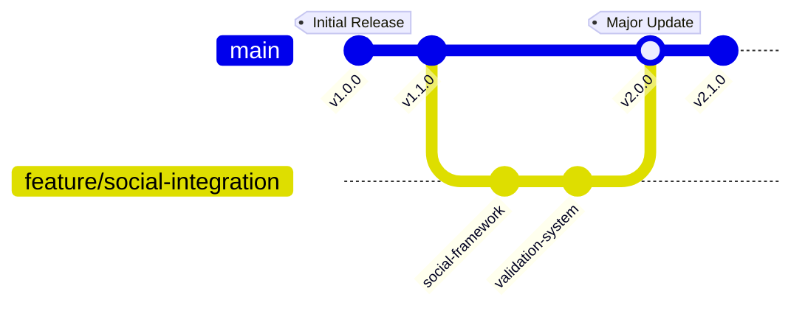
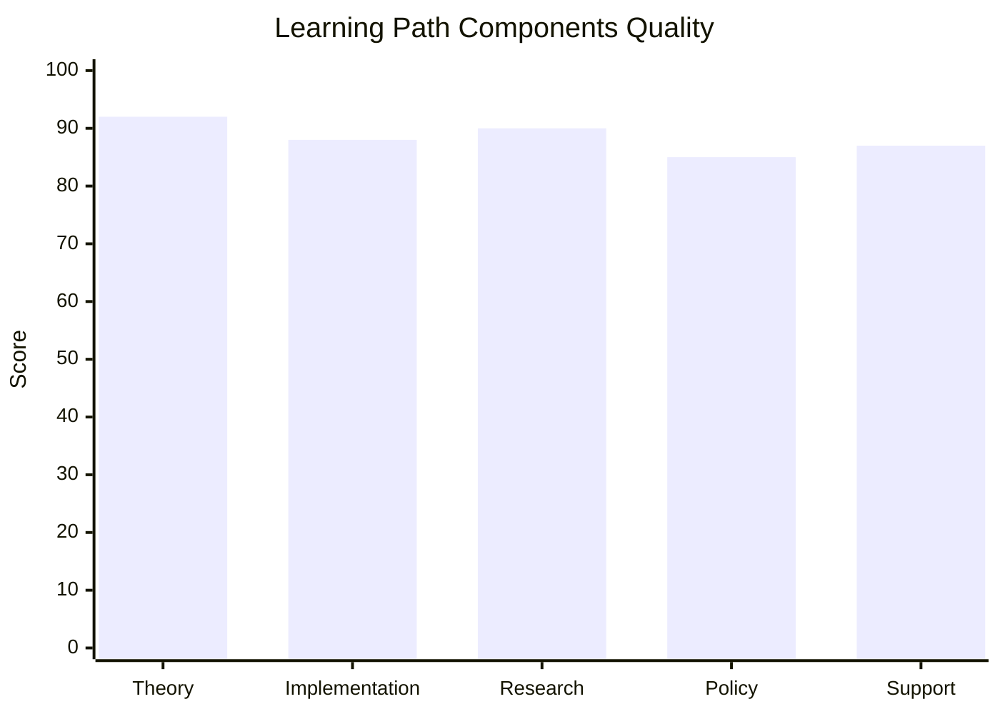
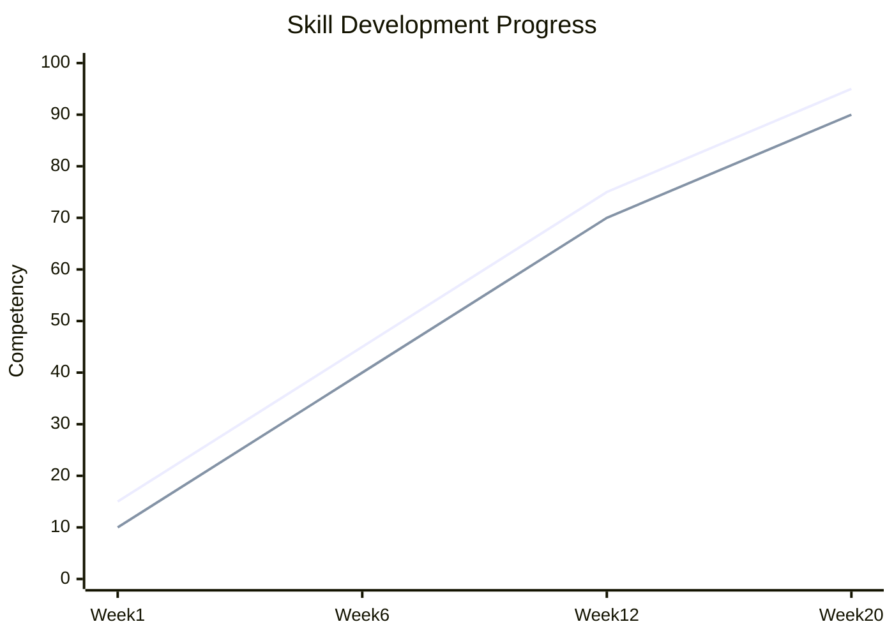
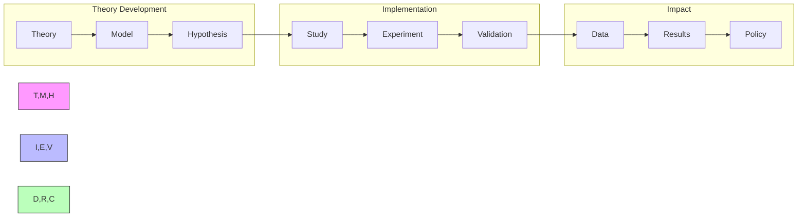

---

title: Active Inference in Social Systems Learning Path

type: learning_path

status: stable

created: 2024-03-15

modified: 2024-03-15

version: 2.0.0

complexity: advanced

processing_priority: 1

authors:

  - name: Cognitive Systems Team

    role: Research & Development

difficulty_level: advanced

estimated_hours: 480

completion_time: "20 weeks"

certification_track: true

tags:

  - active-inference

  - social-systems

  - collective-behavior

  - social-cognition

  - cultural-evolution

  - network-science

  - group-dynamics

semantic_relations:

  - type: specializes

    links: [[active_inference_learning_path]]

  - type: relates

    links:

      - [[social_systems_learning_path]]

      - [[collective_intelligence_learning_path]]

      - [[cultural_evolution_learning_path]]

---

# Active Inference in Social Systems Learning Path

## Quick Start

- Choose a small social modeling task (opinion dynamics or norm formation); implement and validate

- Instrument information flow and influence measures; compare interventions

- Document ethical considerations and data governance for any empirical work

## External Web Resources

- [Centralized resources hub](./index.md#centralized-external-web-resources)

- [JASSS](https://jasss.soc.surrey.ac.uk/)

- [ComSES Network](https://www.comses.net/)

## Quick Reference

- **Difficulty**: Advanced

- **Time Commitment**: 25-30 hours/week for 20 weeks

- **Prerequisites Score**: 8/10 (social science and computational expertise)

- **Industry Relevance**: High (Research, Policy, Technology)

- **Hands-on Component**: 45%

- **Theory Component**: 55%

## Executive Summary

### Purpose and Scope

This specialized learning path integrates Active Inference principles with social systems research, providing a comprehensive framework for understanding and modeling collective behavior and cultural dynamics. It bridges social science theory with computational modeling, focusing on emergent phenomena and complex social interactions.

### Target Audience

- **Primary**: Social scientists and computational social scientists

- **Secondary**: Complex systems researchers and policy analysts

- **Career Stage**: Advanced researchers (3+ years experience)

### Learning Outcomes

By completing this path, learners will be able to:

1. Develop sophisticated models of social systems using Active Inference

1. Implement collective behavior and cultural evolution simulations

1. Design and validate social intervention strategies

1. Apply models to understand and influence social dynamics

### Industry Applications

- Research: Social systems, cultural evolution

- Policy: Social interventions, cultural change

- Technology: Social computing, collective intelligence

- Organizations: Group dynamics, institutional design

## Path Selection Guide



## Path Interconnections



### System Architecture



## Prerequisites

### 1. Social Systems Foundations (4 weeks)

- Social Dynamics

  - Group behavior

  - Network effects

  - Collective action

  - Social norms

- Collective Intelligence

  - Group decision-making

  - Wisdom of crowds

  - Social learning

  - Distributed cognition

- Cultural Evolution

  - Cultural transmission

  - Social adaptation

  - Norm dynamics

  - Belief propagation

- Complex Social Systems

  - Network structures

  - Emergence patterns

  - Social hierarchies

  - Information flow

### 2. Technical Skills (2 weeks)

- Social Analysis Tools

  - Network analysis

  - Agent-based modeling

  - Statistical methods

  - Data visualization

## Core Learning Path

### 1. Social Inference Modeling (4 weeks)

#### Week 1-2: Social State Inference

```python

class SocialStateEstimator:

    def __init__(self,

                 social_levels: List[str],

                 learning_rate: float):

        """Initialize social state estimator."""

        self.social_hierarchy = SocialHierarchy(social_levels)

        self.learning_mechanism = SocialLearning(learning_rate)

        self.norm_monitor = NormMonitor()

    def estimate_state(self,

                      social_signals: torch.Tensor,

                      group_state: torch.Tensor) -> SocialState:

        """Estimate social system state."""

        current_state = self.social_hierarchy.integrate_signals(

            social_signals, group_state

        )

        learned_state = self.learning_mechanism.update(current_state)

        return self.norm_monitor.validate_state(learned_state)

```

#### Week 3-4: Collective Decision Making

```python

class CollectiveDecisionMaker:

    def __init__(self,

                 action_space: ActionSpace,

                 social_utility: SocialUtility):

        """Initialize collective decision maker."""

        self.action_repertoire = ActionRepertoire(action_space)

        self.utility_evaluator = social_utility

        self.coordination_policy = CoordinationPolicy()

    def select_action(self,

                     social_state: torch.Tensor,

                     group_goals: torch.Tensor) -> Action:

        """Select collective action."""

        options = self.action_repertoire.generate_options()

        utilities = self.evaluate_social_utility(options, social_state)

        return self.coordination_policy.select_action(options, utilities)

```

### 2. Social Applications (6 weeks)

#### Week 1-2: Group Dynamics

- Small group behavior

- Team coordination

- Social influence

- Collective learning

#### Week 3-4: Network Effects

- Information spread

- Opinion dynamics

- Social contagion

- Network resilience

#### Week 5-6: Cultural Systems

- Norm evolution

- Belief dynamics

- Cultural adaptation

- Social institutions

### 3. Collective Intelligence (4 weeks)

#### Week 1-2: Social Learning

```python

class SocialLearner:

    def __init__(self,

                 group_size: int,

                 learning_rate: float):

        """Initialize social learning system."""

        self.group = SocialGroup(group_size)

        self.learning = SocialLearningMechanism()

        self.adaptation = AdaptationOperator(learning_rate)

    def learn_collectively(self,

                         environment: Environment) -> GroupKnowledge:

        """Learn through social interaction."""

        observations = self.group.observe_environment(environment)

        shared_knowledge = self.learning.aggregate_knowledge(observations)

        return self.adaptation.update_group_knowledge(shared_knowledge)

```

#### Week 3-4: Collective Systems

- Group coordination

- Social computation

- Collective memory

- Distributed problem-solving

### 4. Advanced Topics (4 weeks)

#### Week 1-2: Multi-scale Social Integration

```python

class SocialHierarchy:

    def __init__(self,

                 scale_levels: List[ScaleLevel],

                 integration_params: IntegrationParams):

        """Initialize social hierarchy."""

        self.levels = scale_levels

        self.integrator = ScaleIntegrator(integration_params)

        self.coordinator = SocialCoordinator()

    def process_social_information(self,

                                 inputs: Dict[str, torch.Tensor]) -> SystemState:

        """Process information across social scales."""

        level_states = {level: level.process(inputs[level.name])

                       for level in self.levels}

        integrated_state = self.integrator.combine_states(level_states)

        return self.coordinator.coordinate_responses(integrated_state)

```

#### Week 3-4: Social Computation

- Collective algorithms

- Social optimization

- Group intelligence

- Emergent coordination

## Projects

### Social Projects

1. **Group Dynamics**

   - Team coordination

   - Social influence

   - Collective learning

   - Decision making

1. **Network Systems**

   - Information flow

   - Opinion dynamics

   - Social contagion

   - Network adaptation

### Advanced Projects

1. **Cultural Systems**

   - Norm evolution

   - Belief dynamics

   - Institution formation

   - Social adaptation

1. **Collective Intelligence**

   - Group problem solving

   - Distributed computation

   - Social learning

   - Emergent behavior

## Resources

### Academic Resources

1. **Research Papers**

   - Social Cognition

   - Collective Behavior

   - Cultural Evolution

   - Network Science

1. **Books**

   - Social Systems

   - Collective Intelligence

   - Cultural Dynamics

   - Complex Networks

### Technical Resources

1. **Software Tools**

   - Network Analysis

   - Agent-based Modeling

   - Statistical Analysis

   - Visualization Tools

1. **Social Data**

   - Behavioral Records

   - Network Data

   - Cultural Patterns

   - Social Dynamics

## Next Steps

### Advanced Topics

1. [[social_systems_learning_path|Social Systems]]

1. [[collective_intelligence_learning_path|Collective Intelligence]]

1. [[cultural_evolution_learning_path|Cultural Evolution]]

### Research Directions

1. [[research_guides/social_cognition|Social Cognition Research]]

1. [[research_guides/collective_behavior|Collective Behavior Research]]

1. [[research_guides/cultural_dynamics|Cultural Dynamics Research]]

## Version History

- Created: 2024-03-15

- Last Updated: 2024-03-15

- Status: Stable

- Version: 1.0.0

## Integration Strategies

### Development Approaches

- Theory-Practice Integration

  - Social theory

  - Computational models

  - Empirical validation

- Cross-Domain Development

  - Social systems

  - Network analysis

  - Cultural dynamics

- Research Integration

  - Literature synthesis

  - Model development

  - Field testing

### Research Framework

```mermaid

mindmap

    root((Social

    Research))

        Theory

            Active Inference

                Social

                Cultural

            Systems

                Networks

                Groups

        Methods

            Computational

                Modeling

                Simulation

            Empirical

                Studies

                Analysis

        Applications

            Policy

                Design

                Impact

            Social

                Change

                Innovation

```

### Development Lifecycle



## Assessment Framework

### Continuous Assessment

#### Weekly Checkpoints

- Theoretical Understanding (85% required)

  - Social theory

  - Active inference mathematics

  - Systems analysis

- Implementation Skills (80% required)

  - Model development

  - Network analysis

  - Data processing

- Research Progress (85% required)

  - Literature review

  - Study design

  - Results analysis

#### Progress Tracking

- Daily Research Log

- Weekly Model Review

- Monthly Project Assessment

- Quarterly Publication Progress

### Knowledge Checkpoints

#### Foundation Checkpoint (Week 6)

- Format: Written + Implementation

- Duration: 4 hours

- Topics:

  - Social systems

  - Active inference basics

  - Network analysis

- Requirements:

  - Theory: 85% correct

  - Implementation: Working social model

#### Advanced Integration (Week 12)

- Format: Research Project

- Duration: 2 weeks

- Focus:

  - Complex social systems

  - Cultural dynamics

  - Empirical validation

- Deliverables:

  - Research paper draft

  - Working implementation

  - Field study design

#### Final Assessment (Week 20)

- Format: Research Publication

- Duration: 3 weeks

- Components:

  - Original research

  - Novel implementation

  - Empirical validation

- Requirements:

  - Publication-ready paper

  - Validated model

  - Field study results

### Project Portfolio

#### Research Projects

1. Social System Development

   - Scope: Group dynamics modeling

   - Deliverables:

     - Model implementation

     - Empirical validation

     - Documentation

   - Evaluation:

     - Theory: 35%

     - Implementation: 35%

     - Documentation: 30%

1. Cultural Evolution Study

   - Scope: Cultural dynamics

   - Deliverables:

     - System design

     - Field study

     - Analysis report

   - Evaluation:

     - Design: 35%

     - Results: 35%

     - Documentation: 30%

#### Final Project

- Description: Novel Social Application

- Requirements:

  - Technical:

    - Original model

    - Field validation

    - Data analysis

  - Documentation:

    - Research paper

    - Technical docs

    - Study protocol

  - Presentation:

    - Research talk

    - System demo

    - Results discussion

### Success Criteria

#### Technical Competency

- Theory: Advanced understanding (9/10)

- Implementation: Expert level (8/10)

- Research: Publication quality

- Analysis: Expert level (9/10)

#### Project Delivery

- Quality Standards:

  - Empirical validation

  - Model verification

  - Documentation complete

- Performance Metrics:

  - Theory soundness

  - System accuracy

  - Research impact

#### Professional Development

- Research publications

- Field studies

- Conference presentations

- Community engagement

## Career Development

### Industry Alignment

#### Research Roles

- Social Systems Researcher

  - Theory development

  - System analysis

  - Study design

- Computational Social Scientist

  - Model development

  - Data analysis

  - System implementation

- Policy Analyst

  - Impact assessment

  - Intervention design

  - Program evaluation

#### Certification Path

- Social Systems

  - Theory foundations

  - Research methods

- Computational Methods

  - Model development

  - Network analysis

- Policy Applications

  - Impact assessment

  - Program design

### Professional Network

#### Research Community

- Academic Connections:

  - Research labs

  - Universities

  - Policy centers

- Industry Partners:

  - Think tanks

  - Research institutes

  - Policy organizations

- Professional Organizations:

  - Social Science Society

  - Complex Systems Society

  - Policy Research Groups

#### Career Progression



### Competency Framework

```mermaid

mindmap

    root((Social

    Expert))

        Research Skills

            Theory Development

                Models

                Validation

            Empirical Methods

                Design

                Analysis

        Technical Skills

            Computation

                Modeling

                Simulation

            Data Analysis

                Methods

                Tools

        Policy Skills

            Impact Assessment

                Design

                Evaluation

            Intervention

                Planning

                Implementation

```

### Research Focus Areas



## Support Resources

### Research Support

- Literature Database

  - Social science papers

  - Network analysis

  - Cultural evolution

- Computing Resources

  - Simulation platforms

  - Network tools

  - Analysis software

- Analysis Tools

  - Statistical packages

  - Visualization tools

  - Network analysis

### Technical Support

- Development Tools

  - Modeling frameworks

  - Network libraries

  - Analysis suites

- Documentation

  - API references

  - Implementation guides

  - Best practices

- Computing Resources

  - Development environments

  - Data processing

  - Visualization platforms

### Learning Support

```mermaid

mindmap

    root((Social

    Resources))

        Materials

            Theory

                Social

                Systems

            Implementation

                Models

                Studies

            Research

                Papers

                Methods

        Support

            Technical

                Tools

                Data

            Academic

                Mentors

                Groups

            Policy

                Centers

                Programs

```

## Version Control and Updates

### Version History



### Change Management

#### Major Updates

- v2.0.0 (Current)

  - Enhanced social framework

  - Advanced cultural models

  - Improved validation system

  - Updated career paths

- v1.1.0

  - Added social systems

  - Enhanced documentation

  - New research projects

- v1.0.0

  - Initial curriculum

  - Basic framework

  - Core concepts

#### Planned Improvements

- Advanced social models

- Cultural dynamics

- Network analysis

- Policy applications

### Quality Metrics



## Learning Analytics

### Progress Tracking



### Performance Metrics

- Research Skills

  - Theory development

  - Study design

  - Data analysis

- Technical Skills

  - Model implementation

  - Network analysis

  - System integration

- Policy Skills

  - Impact assessment

  - Program design

  - Evaluation methods

### Development Analytics



## Final Notes

### Success Stories

- Research Impact

  - Novel theories

  - Social frameworks

  - Field contributions

- Policy Applications

  - Intervention design

  - Program evaluation

  - Social impact

- Professional Growth

  - Research leadership

  - Policy influence

  - Community building

### Additional Resources

- Extended Reading

  - Advanced social theory

  - Network science

  - Policy analysis

- Research Directions

  - Open problems

  - Future applications

  - Policy implications

- Community Resources

  - Research groups

  - Policy forums

  - Professional networks

### Contact Information

- Research Support

  - Principal investigators

  - Research coordinators

  - Study managers

- Policy Support

  - Policy analysts

  - Program managers

  - Impact evaluators

- Technical Support

  - System developers

  - Data analysts

  - Integration experts

