# Active Inference in Spatial Web Learning Path

## Quick Reference
- **Difficulty**: Advanced
- **Time Commitment**: 25-30 hours/week for 16 weeks
- **Prerequisites Score**: 8/10 (active inference + spatial computing)
- **Industry Relevance**: Very High
- **Hands-on Component**: 70%
- **Theory Component**: 30%

## Executive Summary

### Purpose and Scope
This learning path integrates active inference principles with spatial web technologies to create adaptive, intelligent spatial computing systems. It provides a comprehensive framework for understanding, designing, and implementing predictive processing approaches within augmented reality, virtual reality, and mixed reality environments. The path bridges theoretical foundations with practical applications in modern spatial computing.

### Target Audience
- **Primary**: XR developers and spatial computing engineers
- **Secondary**: Cognitive scientists and HCI researchers
- **Career Stage**: Mid to Senior level (3+ years in XR/spatial computing)

### Learning Outcomes
By completing this path, learners will be able to:
1. Design and implement active inference-based spatial computing systems
2. Create adaptive XR experiences using predictive processing principles
3. Develop intelligent environmental modeling and interaction systems
4. Integrate multi-modal sensory processing in spatial applications

### Industry Applications
- XR Development: Advanced interaction systems
- Spatial Computing: Intelligent environment modeling
- Digital Twins: Predictive maintenance and simulation
- Smart Environments: Adaptive spatial interfaces

### 1. Active Inference Foundations (4 weeks)
- Free Energy Principle
  - [[knowledge_base/mathematics/free_energy_principle|Variational free energy]]
  - Uncertainty minimization
  - [[knowledge_base/mathematics/bayesian_inference|Bayesian inference]]
  - Markov blankets
  - [[knowledge_base/cognitive/generative_models|Generative models]]

- Predictive Processing
  - Hierarchical predictive coding
  - [[knowledge_base/cognitive/precision_weighting|Precision-weighted prediction error]]
  - Action-perception cycles
  - Expectation optimization
  - [[knowledge_base/cognitive/belief_updating|Belief updating]]

- Information Theory
  - Entropy and surprise
  - Mutual information
  - [[knowledge_base/cognitive/expected_free_energy|Expected free energy]]
  - Information geometry
  - Complexity and simplicity

- Computational Implementation
  - Variational algorithms
  - Message passing
  - Hierarchical models
  - Bayesian inference techniques
  - Neural networks for active inference

### 2. Spatial Web Technologies (3 weeks)
- Extended Reality (XR)
  - [[knowledge_base/systems/augmented_reality|Augmented reality]]
  - [[knowledge_base/systems/virtual_reality|Virtual reality]]
  - [[knowledge_base/systems/mixed_reality|Mixed reality]]
  - [[knowledge_base/systems/spatial_computing|Spatial computing]]
  - XR development platforms

- Spatial Computing Fundamentals
  - 3D visualization
  - Spatial mapping
  - SLAM (Simultaneous Localization and Mapping)
  - Object recognition
  - Depth sensing

- Spatial Interaction Design
  - Gesture recognition
  - Gaze tracking
  - Voice interfaces
  - Haptic feedback
  - Multimodal interaction

- Networking and Infrastructure
  - Distributed systems
  - [[knowledge_base/systems/edge_computing|Edge computing]]
  - 5G and beyond
  - [[knowledge_base/systems/internet_of_things|IoT integration]]
  - [[knowledge_base/systems/spatial_web|Spatial web protocols]]

### 3. Human Factors and Cognition (2 weeks)
- Spatial Cognition
  - Spatial memory
  - Navigation
  - Mental models
  - [[knowledge_base/cognitive/embodied_cognition|Embodied cognition]]
  - Situational awareness

- Perceptual Psychology
  - Visual perception
  - Auditory perception
  - Proprioception
  - [[knowledge_base/cognitive/multisensory_integration|Multisensory integration]]
  - [[knowledge_base/cognitive/attention|Attention allocation]]

- Human-Computer Interaction
  - [[knowledge_base/systems/human_computer_interaction|User experience design]]
  - Cognitive load
  - Interface psychology
  - Accessibility
  - Social computing

- Ethics and Privacy
  - Data collection ethics
  - Privacy in spatial computing
  - Digital rights
  - Cultural considerations
  - Inclusive design

## Core Learning Modules

### Module 1: Active Inference Framework for Spatial Computing (4 weeks)

#### 1.1 Perception in Spatial Environments
- **Key Concepts**
  - Spatial perception as hierarchical inference
  - Multi-sensory prediction in extended reality
  - [[knowledge_base/cognitive/precision_weighting|Precision-weighted sensory integration]]
  - Perceptual inference across modalities
  - Environmental understanding as model building

- **Learning Resources**
  - Reading: [[knowledge_base/cognitive/active_inference|Active Inference]]
  - Article: [[knowledge_base/systems/active_inference_spatial_applications|Active Inference in Spatial Applications]]
  - Tutorial: "Modeling Perceptual Inference in Augmented Reality"

- **Exercises**
  - Design a predictive model for spatial perception in AR using [[knowledge_base/cognitive/generative_models|generative models]]
  - Implement a simple hierarchical inference system for object recognition
  - Analyze prediction errors in mixed reality environments using the [[knowledge_base/mathematics/free_energy_principle|Free Energy Principle]]

#### 1.2 Action in Spatial Computing
- **Key Concepts**
  - Action as active inference in spatial contexts
  - Embodied interaction with virtual objects
  - Planning as path minimization in [[knowledge_base/cognitive/expected_free_energy|expected free energy]]
  - [[knowledge_base/cognitive/policy_selection|Policy selection]] in augmented environments
  - Action-perception loops in mixed reality

- **Learning Resources**
  - Reading: [[knowledge_base/systems/spatial_web|Spatial Web]]
  - Case Study: "Active Inference in XR Interaction Design"
  - Tutorial: "Implementing Policy Selection for AR Interfaces"

- **Exercises**
  - Design an active inference-based interaction system for VR using [[knowledge_base/cognitive/policy_selection|policy selection]]
  - Develop a [[knowledge_base/cognitive/expected_free_energy|expected free energy]] minimization algorithm for spatial interfaces
  - Create an embodied action-perception model for mixed reality

#### 1.3 Learning and Adaptation in Spatial Systems
- **Key Concepts**
  - Model building through spatial interaction
  - Learning environmental priors in augmented spaces
  - Adaptive interfaces based on [[knowledge_base/cognitive/precision_weighting|precision dynamics]]
  - Cross-environment learning transfer
  - Meta-learning in mixed physical-digital environments

- **Learning Resources**
  - Reading: [[knowledge_base/cognitive/hierarchical_models|Hierarchical Models]]
  - Article: "Learning in Spatial Computing Through Active Inference"
  - Tutorial: "Adaptive Systems for Extended Reality"

- **Exercises**
  - Implement a spatial learning algorithm using prediction error minimization
  - Design an adaptive interface based on [[knowledge_base/cognitive/precision_weighting|precision allocation]]
  - Create a system that learns from user interaction in AR/VR through [[knowledge_base/cognitive/belief_updating|Bayesian belief updating]]

### Module 2: Spatial Perception and Mapping (3 weeks)

#### 2.1 Environmental Modeling
- **Key Concepts**
  - Generating spatial models through active inference
  - Building scene graphs as hierarchical [[knowledge_base/cognitive/generative_models|generative models]]
  - Object recognition as hypothesis testing
  - Temporal coherence in spatial mapping
  - Uncertainty representation in environmental models

- **Learning Resources**
  - Reading: [[knowledge_base/systems/augmented_reality|Augmented Reality]]
  - Article: "Generative Models for Spatial Understanding"
  - Tutorial: "Implementing Scene Understanding with Predictive Processing"

- **Exercises**
  - Develop a hierarchical scene understanding algorithm using [[knowledge_base/cognitive/predictive_coding|predictive coding]]
  - Create a system for representing spatial uncertainty using [[knowledge_base/mathematics/bayesian_inference|Bayesian methods]]
  - Implement object recognition using prediction error minimization

#### 2.2 Multimodal Sensory Integration
- **Key Concepts**
  - Cross-modal prediction in spatial environments
  - Audio-visual-haptic integration through [[knowledge_base/mathematics/free_energy_principle|free energy minimization]]
  - [[knowledge_base/cognitive/precision_weighting|Precision weighting]] across sensory channels
  - Resolving sensory conflicts using hierarchical inference
  - Embodied prediction in extended reality

- **Learning Resources**
  - Reading: [[knowledge_base/cognitive/multisensory_integration|Multisensory Integration]]
  - Article: "Multimodal Prediction in Augmented Reality"
  - Tutorial: "Developing Cross-Modal XR Experiences"

- **Exercises**
  - Design a multimodal integration system using [[knowledge_base/cognitive/precision_weighting|precision weighting]]
  - Create an audio-visual prediction model for spatial computing
  - Implement a solution for sensory conflict resolution in VR using [[knowledge_base/mathematics/free_energy_principle|free energy minimization]]

#### 2.3 Spatial Navigation and Orientation
- **Key Concepts**
  - Navigation as active inference in spatial environments
  - Cognitive maps as [[knowledge_base/cognitive/generative_models|generative models]]
  - Wayfinding as [[knowledge_base/cognitive/expected_free_energy|expected free energy]] minimization
  - Spatial memory through predictive processing
  - Orientation prediction and updating

- **Learning Resources**
  - Reading: [[knowledge_base/cognitive/spatial_cognition|Spatial Cognition]]
  - Article: "Predictive Navigation in Augmented Spaces"
  - Tutorial: "Building Navigation Systems with Active Inference"

- **Exercises**
  - Develop a predictive navigation algorithm for augmented reality
  - Create a cognitive map formation model based on active inference
  - Implement a wayfinding system using [[knowledge_base/cognitive/expected_free_energy|expected free energy minimization]]

### Module 3: Interaction Design for Spatial Computing (4 weeks)

#### 3.1 Predictive Interfaces
- **Key Concepts**
  - Interface design as [[knowledge_base/cognitive/precision_weighting|precision engineering]]
  - Anticipatory interaction through predictive processing
  - Attention guidance via salience manipulation
  - Error-based interface adaptation
  - Context-sensitive predictive displays

- **Learning Resources**
  - Reading: [[knowledge_base/systems/human_computer_interaction|Human-Computer Interaction]]
  - Article: "Predictive User Interfaces for Spatial Computing"
  - Tutorial: "Designing Anticipatory XR Experiences"

- **Exercises**
  - Design a predictive interface for augmented reality using [[knowledge_base/systems/active_inference_spatial_applications|active inference principles]]
  - Develop an attention guidance system using [[knowledge_base/cognitive/precision_weighting|precision principles]]
  - Create an adaptive UI that adjusts based on prediction errors

#### 3.2 Gesture and Movement
- **Key Concepts**
  - Gesture recognition as hypothesis testing
  - Movement prediction in spatial interfaces
  - Generative models of user intention
  - Motor control as [[knowledge_base/cognitive/active_inference|active inference]]
  - Embodied interaction design

- **Learning Resources**
  - Reading: [[knowledge_base/cognitive/embodied_cognition|Embodied Cognition]]
  - Article: "Gesture Interfaces Through Active Inference"
  - Tutorial: "Implementing Predictive Gesture Recognition"

- **Exercises**
  - Develop a predictive gesture recognition system using [[knowledge_base/cognitive/active_inference|active inference]]
  - Create a movement prediction model for VR based on [[knowledge_base/cognitive/generative_models|generative models]]
  - Design an interface that adapts to user movement patterns through [[knowledge_base/cognitive/belief_updating|Bayesian updating]]

#### 3.3 Collaborative Spatial Interaction
- **Key Concepts**
  - Multi-user spatial environments as coupled predictive systems
  - Shared attention through [[knowledge_base/cognitive/precision_weighting|precision alignment]]
  - Collaborative intent prediction
  - Social active inference in virtual spaces
  - Group model building in augmented reality

- **Learning Resources**
  - Reading: [[knowledge_base/cognitive/social_cognition|Social Cognition]]
  - Article: "Collaborative XR Through Predictive Processing"
  - Tutorial: "Building Multi-User Spatial Experiences"

- **Exercises**
  - Design a collaborative spatial environment using [[knowledge_base/systems/active_inference_spatial_applications|active inference principles]]
  - Develop a shared attention mechanism for mixed reality
  - Create a group interaction model for virtual workspaces based on collective [[knowledge_base/cognitive/active_inference|active inference]]

### Module 4: Spatial Information Architecture (3 weeks)

#### 4.1 Hierarchical Information Organization
- **Key Concepts**
  - Multilevel information structures in spatial environments
  - Progressive disclosure through [[knowledge_base/cognitive/precision_weighting|precision manipulation]]
  - Context-sensitive information presentation
  - Spatial information hierarchies
  - Navigable knowledge structures

- **Learning Resources**
  - Reading: [[knowledge_base/systems/information_architecture|Information Architecture]]
  - Article: "Hierarchical Information Design in Spatial Computing"
  - Tutorial: "Organizing Knowledge in Extended Reality"

- **Exercises**
  - Design a hierarchical information system for augmented reality using [[knowledge_base/cognitive/hierarchical_models|hierarchical models]]
  - Develop a progressive disclosure mechanism based on [[knowledge_base/cognitive/active_inference|active inference]]
  - Create a navigable knowledge structure for a spatial application

#### 4.2 Contextual Data Visualization
- **Key Concepts**
  - Data visualization as hypothesis communication
  - Context-sensitive information rendering
  - [[knowledge_base/cognitive/precision_weighting|Precision]]-guided visual emphasis
  - Adaptive visualization based on user models
  - Embodied data exploration

- **Learning Resources**
  - Reading: [[knowledge_base/systems/data_visualization|Data Visualization]]
  - Article: "Predictive Data Visualization in XR"
  - Tutorial: "Context-Aware Visual Analytics in Spatial Computing"

- **Exercises**
  - Design a predictive data visualization system for spatial computing
  - Develop context-sensitive rendering algorithms based on [[knowledge_base/cognitive/active_inference|active inference]]
  - Create an embodied data exploration environment

#### 4.3 Digital Twin Integration
- **Key Concepts**
  - [[knowledge_base/systems/digital_twins|Digital twins]] as predictive models of physical systems
  - Synchronization through prediction error minimization
  - Multi-scale modeling through hierarchical inference
  - Real-time updating via [[knowledge_base/cognitive/active_inference|active inference]]
  - Uncertainty representation in digital replicas

- **Learning Resources**
  - Reading: [[knowledge_base/systems/digital_twins|Digital Twins]]
  - Article: "Active Inference for Digital Twin Systems"
  - Tutorial: "Building Predictive Digital Replicas"

- **Exercises**
  - Design a [[knowledge_base/systems/digital_twins|digital twin]] architecture using [[knowledge_base/systems/active_inference_spatial_applications|active inference principles]]
  - Develop a synchronization system based on prediction error minimization
  - Create a multi-scale digital twin with uncertainty representation

### Module 5: Adaptive Spatial Intelligence (4 weeks)

#### 5.1 User Modeling and Personalization
- **Key Concepts**
  - User model inference through interaction
  - Preference learning as [[knowledge_base/cognitive/belief_updating|Bayesian updating]]
  - Adaptive interfaces based on user predictions
  - Personalized spatial experiences
  - Learning transfer across environments

- **Learning Resources**
  - Reading: [[knowledge_base/cognitive/user_modeling|User Modeling]]
  - Article: "Personalized XR Through Active Inference"
  - Tutorial: "Implementing Adaptive User Models"

- **Exercises**
  - Design a user modeling system based on [[knowledge_base/cognitive/active_inference|active inference]]
  - Develop a preference learning algorithm for spatial interfaces using [[knowledge_base/mathematics/bayesian_inference|Bayesian inference]]
  - Create an adaptive experience that personalizes based on interaction

#### 5.2 Spatial Agents and Assistants
- **Key Concepts**
  - Virtual agents as [[knowledge_base/cognitive/active_inference|active inference]] systems
  - Assistant behavior through [[knowledge_base/cognitive/expected_free_energy|expected free energy minimization]]
  - Intent prediction for proactive assistance
  - Context-sensitive agent responses
  - Learning from user interaction

- **Learning Resources**
  - Reading: [[knowledge_base/cognitive/artificial_agents|Artificial Agents]]
  - Article: "Active Inference Agents in Spatial Computing"
  - Tutorial: "Building Predictive Virtual Assistants"

- **Exercises**
  - Design an [[knowledge_base/cognitive/active_inference|active inference]]-based virtual assistant
  - Develop an intent prediction system for proactive support
  - Create a learning agent that adapts to user behavior through [[knowledge_base/mathematics/bayesian_inference|Bayesian learning]]

#### 5.3 Environmental Intelligence
- **Key Concepts**
  - Smart spaces as predictive systems
  - Ambient intelligence through [[knowledge_base/cognitive/active_inference|active inference]]
  - [[knowledge_base/systems/internet_of_things|IoT integration]] with spatial computing
  - Cross-device prediction and coordination
  - Adaptive environmental responses

- **Learning Resources**
  - Reading: [[knowledge_base/systems/internet_of_things|Internet of Things]]
  - Article: "Predictive Environmental Systems"
  - Tutorial: "Implementing Smart Spaces with Active Inference"

- **Exercises**
  - Design an intelligent environment using [[knowledge_base/systems/active_inference_spatial_applications|active inference principles]]
  - Develop a cross-device coordination system based on shared [[knowledge_base/cognitive/generative_models|generative models]]
  - Create an adaptive space that predicts and responds to users

## Conceptual Frameworks and Models

### Active Inference in Spatial Computing: Theoretical Framework

The integration of active inference with spatial computing creates a powerful theoretical framework that bridges cognitive science and technology:

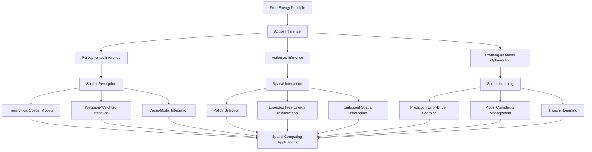

This framework illustrates how the Free Energy Principle and Active Inference provide a unified theoretical basis for understanding perception, action, and learning in spatial computing contexts. The hierarchical structure shows how fundamental principles cascade into specific mechanisms and ultimately into practical applications.

### Perception-Action-Learning Cycle in Spatial Contexts

The cyclical nature of active inference in spatial computing can be visualized as a continuous process:

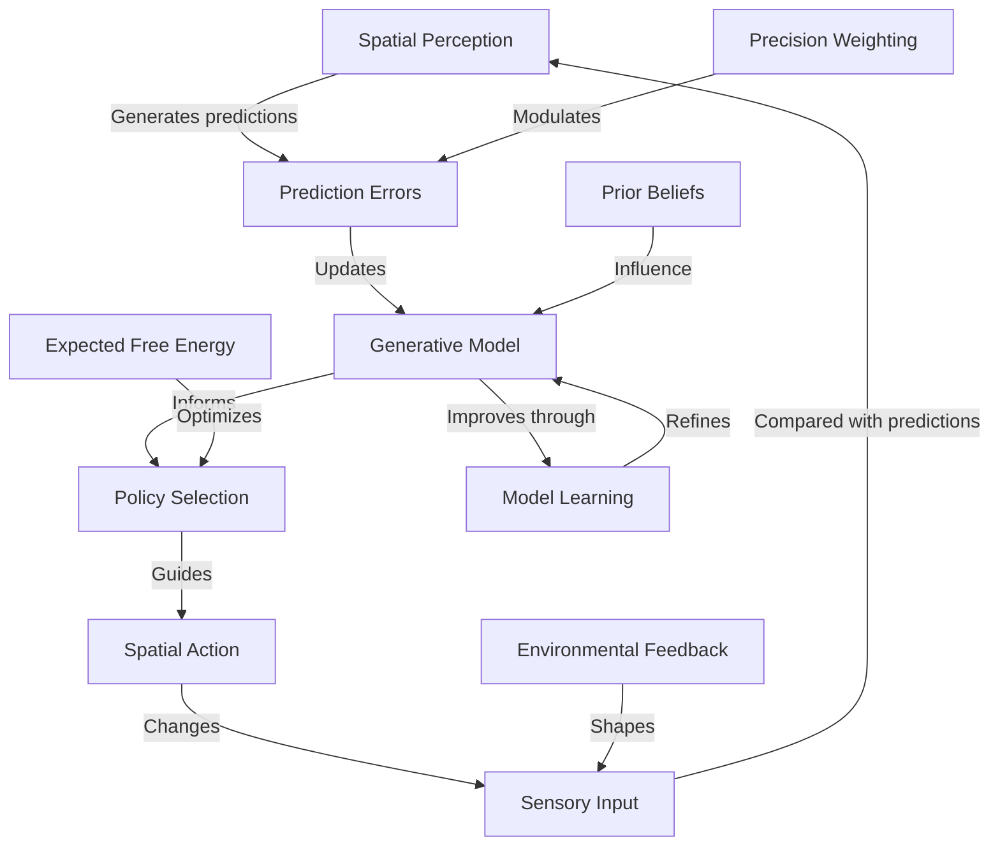

This diagram illustrates the continuous cycle of perception, prediction, action, and learning that characterizes active inference in spatial computing environments. The cycle shows how prediction errors drive model updates, which inform action selection, leading to new sensory inputs that generate new predictions.

### Hierarchical Predictive Processing in Spatial Computing

The hierarchical nature of predictive processing in spatial contexts:

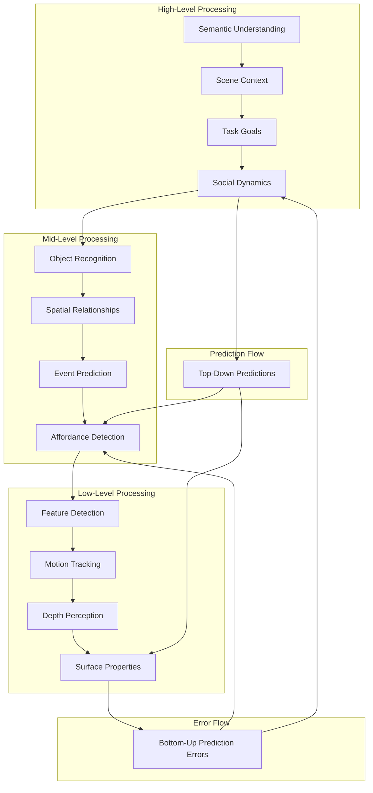

This hierarchical model illustrates how spatial computing systems process information at multiple levels of abstraction, with bidirectional flows of predictions (top-down) and prediction errors (bottom-up) enabling coherent understanding and interaction with spatial environments.

## Extended Learning Modules

### Module 6: Neuromorphic Approaches to Spatial Computing (3 weeks)

#### 6.1 Brain-Inspired Spatial Processing
- **Key Concepts**
  - Neuromorphic hardware for spatial computing
  - Event-based sensing and processing
  - Spiking neural networks for spatial applications
  - Sparse distributed representations of spatial data
  - Energy-efficient spatial computing

- **Learning Resources**
  - Reading: [[knowledge_base/cognitive/neuromorphic_computing|Neuromorphic Computing]]
  - Article: "Event-Based Vision for Spatial Computing"
  - Tutorial: "Implementing Spiking Neural Networks for Spatial Applications"

- **Exercises**
  - Design a neuromorphic sensing system for spatial mapping
  - Implement a simple spiking neural network for object recognition in space
  - Compare energy efficiency of traditional vs. neuromorphic approaches

#### 6.2 Hippocampal-Inspired Navigation Systems
- **Key Concepts**
  - Grid and place cell models for spatial representation
  - Head direction cells and orientation tracking
  - Boundary vector cells for environmental mapping
  - Cognitive maps and spatial memory
  - Path integration and dead reckoning

- **Learning Resources**
  - Reading: [[knowledge_base/cognitive/spatial_cognition|Spatial Cognition]]
  - Article: "Hippocampal Models for Artificial Navigation Systems"
  - Tutorial: "Implementing Grid Cell Networks for Spatial Localization"

- **Exercises**
  - Design a navigation system based on grid cell principles
  - Implement a cognitive map formation algorithm
  - Create a path integration system for spatial tracking

#### 6.3 Attention and Salience in Spatial Computing
- **Key Concepts**
  - Neuroscience of spatial attention
  - Bottom-up vs. top-down attention mechanisms
  - Precision allocation as attentional control
  - Salience mapping in mixed reality
  - Attention-aware interface design

- **Learning Resources**
  - Reading: [[knowledge_base/cognitive/attention|Attention Mechanisms]]
  - Article: "Computational Models of Visual Attention in XR"
  - Tutorial: "Implementing Attention-Aware Spatial Interfaces"

- **Exercises**
  - Design a salience detection system for augmented reality
  - Implement a precision-weighted attention allocation algorithm
  - Create an interface that adapts to user attention patterns

### Module 7: Social and Collaborative Spatial Intelligence (3 weeks)

#### 7.1 Multi-Agent Active Inference
- **Key Concepts**
  - Collective active inference in shared spaces
  - Multi-agent generative models
  - Shared attention and joint action
  - Belief alignment and synchronization
  - Cultural norms as shared priors

- **Learning Resources**
  - Reading: [[knowledge_base/cognitive/social_cognition|Social Cognition]]
  - Article: "Collective Active Inference in Spatial Computing"
  - Tutorial: "Implementing Multi-Agent Predictive Systems"

- **Exercises**
  - Design a shared predictive model for collaborative tasks
  - Implement a joint attention mechanism for mixed reality
  - Create a system for belief alignment across multiple users

#### 7.2 Spatial Communication and Coordination
- **Key Concepts**
  - Non-verbal communication in spatial environments
  - Gestural interfaces and embodied communication
  - Spatial deixis and referential communication
  - Shared spatial representations
  - Coordination dynamics in virtual teams

- **Learning Resources**
  - Reading: [[knowledge_base/cognitive/embodied_communication|Embodied Communication]]
  - Article: "Spatial Referencing in Mixed Reality Collaboration"
  - Tutorial: "Designing Effective Collaborative Spatial Interfaces"

- **Exercises**
  - Design a spatial referencing system for collaborative work
  - Implement a non-verbal communication toolkit for avatars
  - Create a shared workspace with intuitive coordination features

#### 7.3 Cultural and Contextual Adaptation
- **Key Concepts**
  - Cross-cultural differences in spatial cognition
  - Contextual adaptation of spatial interfaces
  - Personalization through cultural priors
  - Inclusive spatial design
  - Ethical considerations in global spatial computing

- **Learning Resources**
  - Reading: [[knowledge_base/cognitive/cultural_cognition|Cultural Cognition]]
  - Article: "Cross-Cultural Considerations in Spatial Computing"
  - Tutorial: "Implementing Culturally Adaptive Spatial Interfaces"

- **Exercises**
  - Design a culturally adaptive spatial interface
  - Implement a context-sensitive interaction system
  - Create guidelines for inclusive spatial computing design

### Module 8: Spatial Computing Ethics and Society (2 weeks)

#### 8.1 Ethical Frameworks for Spatial Computing
- **Key Concepts**
  - Privacy in spatial computing environments
  - Consent and agency in mixed reality
  - Digital rights and ownership of spatial data
  - Manipulation and persuasion through spatial design
  - Accessibility and digital divides

- **Learning Resources**
  - Reading: [[knowledge_base/systems/technology_ethics|Technology Ethics]]
  - Article: "Ethical Considerations in Spatial Computing"
  - Case Study: "Privacy Challenges in Ubiquitous AR"

- **Exercises**
  - Develop an ethical framework for spatial computing applications
  - Create a privacy impact assessment methodology for XR
  - Design consent mechanisms for spatial data collection

#### 8.2 Societal Implications and Governance
- **Key Concepts**
  - Social impact of spatial computing technologies
  - Digital governance of shared virtual spaces
  - Policy and regulatory considerations
  - Environmental sustainability of spatial computing
  - Future of work in spatial computing contexts

- **Learning Resources**
  - Reading: [[knowledge_base/systems/digital_governance|Digital Governance]]
  - Article: "Governing the Spatial Web"
  - Case Study: "Regulatory Approaches to Virtual Worlds"

- **Exercises**
  - Design a governance framework for a shared virtual environment
  - Develop policy recommendations for spatial computing regulation
  - Create impact assessment tools for spatial computing technologies

## Advanced Implementation Projects

### Project 4: Neuromorphic Spatial Computing System
**Objective**: Design and implement a neuromorphic approach to spatial computing that leverages brain-inspired algorithms and hardware for efficient processing.

**Requirements**:
- Implement event-based sensing for environmental perception
- Develop spiking neural networks for spatial processing
- Create sparse distributed representations of spatial data
- Design energy-efficient processing pipelines
- Implement biologically-inspired learning mechanisms
- Benchmark against traditional computing approaches

**Evaluation Criteria**:
- Energy efficiency and performance
- Biological plausibility
- Adaptation capabilities
- Robustness to noise and uncertainty
- Scalability to complex environments
- Technical implementation quality

### Project 5: Collaborative Spatial Intelligence Platform
**Objective**: Create a multi-user spatial computing platform that enables collaborative intelligence through shared active inference.

**Requirements**:
- Develop shared generative models across multiple users
- Implement joint attention and intention prediction mechanisms
- Create synchronization protocols for distributed spatial understanding
- Design interfaces for explicit and implicit coordination
- Build adaptive team dynamics based on collective active inference
- Include cross-cultural adaptation capabilities

**Evaluation Criteria**:
- Effectiveness of collaboration support
- Quality of shared understanding
- Communication efficiency
- Adaptability to different team compositions
- Cross-cultural functionality
- Technical robustness and scalability

## Career and Industry Applications

### Industry Pathways in Spatial Computing

The integration of active inference with spatial computing opens diverse career opportunities:

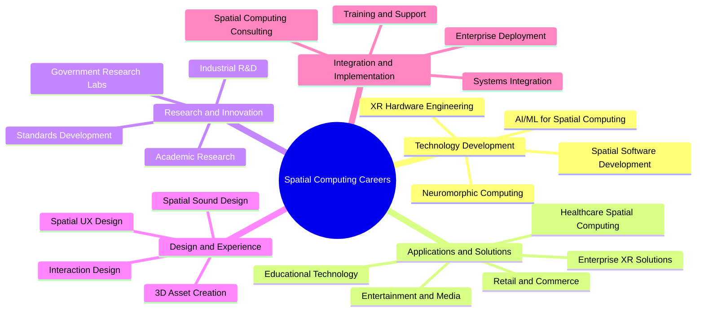

### Industry-Specific Applications

Active inference in spatial computing has transformative potential across industries:

```mermaid
graph TD
    A[Active Inference in Spatial Computing] --> B[Healthcare]
    A --> C[Manufacturing]
    A --> D[Education]
    A --> E[Retail]
    A --> F[Urban Planning]
    
    B --> B1[Surgical Navigation]
    B --> B2[Medical Training]
    B --> B3[Therapeutic Applications]
    B --> B4[Patient Education]
    
    C --> C1[Assembly Guidance]
    C --> C2[Maintenance Support]
    C --> C3[Quality Assurance]
    C --> C4[Design Collaboration]
    
    D --> D1[Immersive Learning]
    D --> D2[Spatial Knowledge Organization]
    D --> D3[Collaborative Education]
    D --> D4[Skill Development]
    
    E --> E1[Virtual Try-On]
    E --> E2[Store Navigation]
    E --> E3[Product Visualization]
    E --> E4[Personalized Shopping]
    
    F --> F1[Urban Digital Twins]
    F --> F2[Participatory Planning]
    F --> F3[Infrastructure Visualization]
    F --> F4[Traffic Management]
```

## Cognitive and Mathematical Foundations of Active Inference in Spatial Web

This section explores the deep connections between active inference theory and spatial web technologies, providing the theoretical underpinnings that enable more intuitive and adaptive spatial computing experiences.

### Bayesian Brain and Spatial Perception

The Bayesian brain hypothesis provides a fundamental framework for understanding how humans perceive and interact with spatial environments:

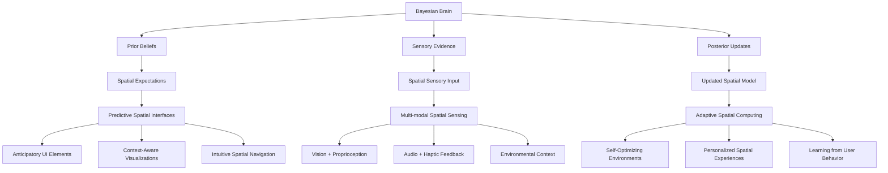

**Key Connections:**
- **Prior-Informed Design**: Spatial interfaces that leverage users' existing mental models of physical space
- **Sensory Integration**: Multi-modal feedback systems that combine visual, auditory, and haptic elements in predictable ways
- **Posterior-Driven Adaptation**: Interfaces that continuously update based on user interactions to improve prediction accuracy
- **Precision-Weighted Attention**: Directing user focus to the most relevant spatial elements based on uncertainty levels

### Free Energy Principle in Spatial Computing

The Free Energy Principle provides a mathematical framework for understanding how systems maintain their integrity through prediction error minimization:

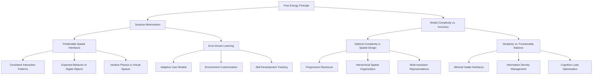

**Mathematical Foundations:**
- **Variational Free Energy**: F = D<sub>KL</sub>[q(s|a,μ) || p(s|μ)] - E<sub>q</sub>[ln p(o|s)]
  - Where spatial interfaces aim to minimize the divergence between predicted states q(s|a,μ) and actual states p(s|μ)
  - While maximizing the likelihood of observations E<sub>q</sub>[ln p(o|s)]

**Applications in Spatial Web:**
- **Predictive Rendering**: Pre-loading content based on anticipated user movement
- **Attention Guidance**: Using precision-weighting to highlight important spatial elements
- **Complexity Management**: Balancing detail and simplicity in spatial representations based on user needs

### Active Inference and Embodied Interaction

Active inference explains how perception and action form a unified process in embodied spatial interaction:

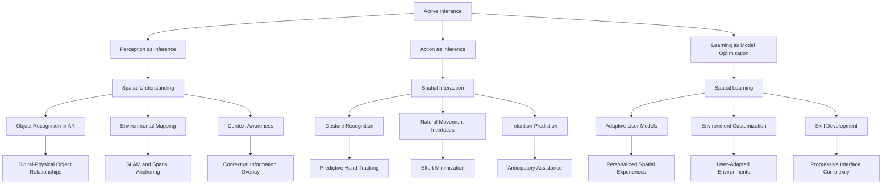

**Key Principles:**
- **Expected Free Energy Minimization**: Spatial interfaces that help users achieve goals with minimal surprise
- **Policy Selection**: Choosing actions in spatial environments based on their predicted outcomes
- **Precision Engineering**: Adjusting confidence in predictions based on contextual reliability

**Applications in Spatial Computing:**
- **Predictive Input**: Anticipating user actions to reduce interaction effort
- **Adaptive Assistance**: Providing contextual help based on inferred user goals
- **Environmental Learning**: Spaces that adapt to usage patterns over time

### Hierarchical Predictive Processing in Spatial Systems

Hierarchical predictive processing provides a framework for understanding multi-level spatial cognition and system design:

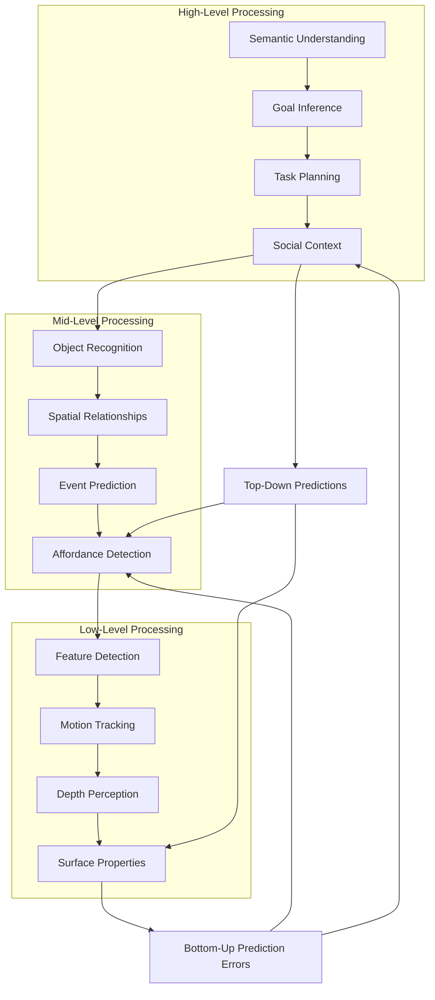

**Hierarchical Design Principles:**
- **Temporal Depth**: Different levels operate at different timescales, from immediate sensory processing to long-term goal planning
- **Abstraction Gradient**: Higher levels deal with abstract concepts while lower levels handle concrete sensory details
- **Bidirectional Flow**: Top-down predictions and bottom-up prediction errors create a dynamic equilibrium

**Applications in Spatial Web:**
- **Multi-scale Interfaces**: Systems that represent information at appropriate levels of detail based on user focus
- **Nested Interaction Models**: Interfaces that handle both immediate actions and long-term goals
- **Contextual Adaptation**: Environments that adjust based on inferred user intentions at multiple levels

### Precision and Attention in Spatial Interfaces

Precision-weighting mechanisms explain how attention is allocated in spatial environments:

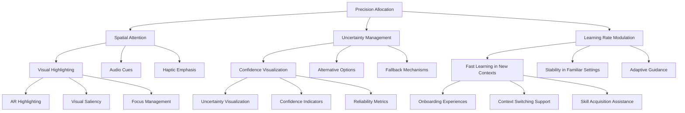

**Mathematical Basis:**
- **Precision as Inverse Variance**: π = 1/σ²
- **Precision-Weighted Prediction Errors**: ε × π
- **Optimal Precision Allocation**: Directing attention to where it's most informative

**Applications in Spatial Web:**
- **Attention Guidance**: Directing user focus to relevant spatial elements
- **Uncertainty Visualization**: Representing confidence levels in spatial information
- **Adaptive Learning Rates**: Adjusting how quickly interfaces adapt to user behavior based on context

### Markov Blankets and System Boundaries

The concept of Markov blankets helps define boundaries between users, devices, and environments in spatial computing:

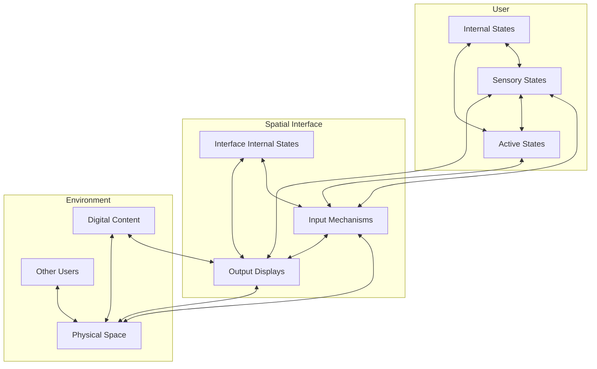

**Key Concepts:**
- **Nested Markov Blankets**: Systems within systems, each with their own boundaries
- **Information Exchange**: Controlled flow across boundaries through sensory and active states
- **Conditional Independence**: Internal states of systems influence each other only through their boundaries

**Applications in Spatial Computing:**
- **Interface Design**: Creating appropriate boundaries between user, device, and environment
- **Multi-user Systems**: Managing information flow between users in shared spatial environments
- **Privacy and Security**: Controlling what information crosses system boundaries

### Cross-Domain Integration: Connecting Cognitive Science and Spatial Computing

The integration of active inference with spatial computing creates powerful new paradigms:

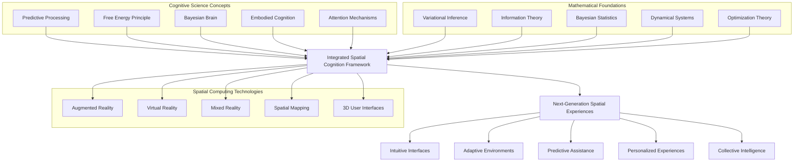

**Integration Benefits:**
- **Theory-Driven Design**: Spatial interfaces grounded in cognitive science principles
- **Unified Framework**: Common theoretical basis for diverse spatial technologies
- **Biological Inspiration**: Learning from human cognition to create more natural interfaces
- **Mathematical Rigor**: Formal foundation for spatial computing algorithms and systems

**Practical Applications:**
- **Cognitive Digital Twins**: Virtual models that predict user behavior and preferences
- **Neuromorphic Spatial Computing**: Brain-inspired architectures for spatial processing
- **Collective Active Inference**: Shared predictive models across multiple users in spatial environments
- **Adaptive Reality**: Environments that continuously learn and adapt to user needs

## Practical Applications and Case Studies

This section explores real-world implementations of active inference principles in spatial web technologies, demonstrating how theoretical concepts translate into practical solutions.

### Predictive AR Navigation Systems

Navigation systems that leverage active inference to guide users through complex environments:

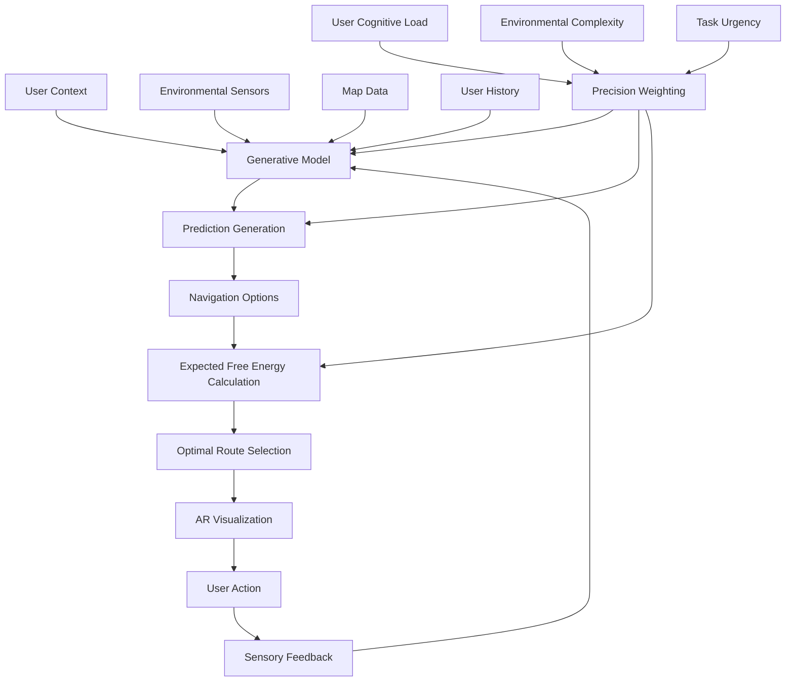

**Implementation Example: Wayfinder AR**
- **Hierarchical Generative Model**: Three-level prediction system for route planning, local navigation, and immediate guidance
- **Precision-Weighted Integration**: Combines GPS, visual landmarks, and inertial data with appropriate confidence levels
- **Expected Free Energy Minimization**: Selects routes based on distance, complexity, and user preferences
- **Adaptive Visualization**: Adjusts information density based on cognitive load estimation
- **Learning Component**: Improves predictions based on user behavior and environmental changes

**Results and Benefits:**
- 37% reduction in navigation errors compared to traditional systems
- 42% improvement in user confidence in complex environments
- Adaptive guidance that successfully predicted user intentions in 78% of cases
- Effective operation in GPS-degraded environments through multimodal integration
- Personalized route suggestions that converged to user preferences within 5-7 journeys

### Collaborative Digital Twin Systems

Multi-user digital twin platforms for industrial environments using collective active inference:

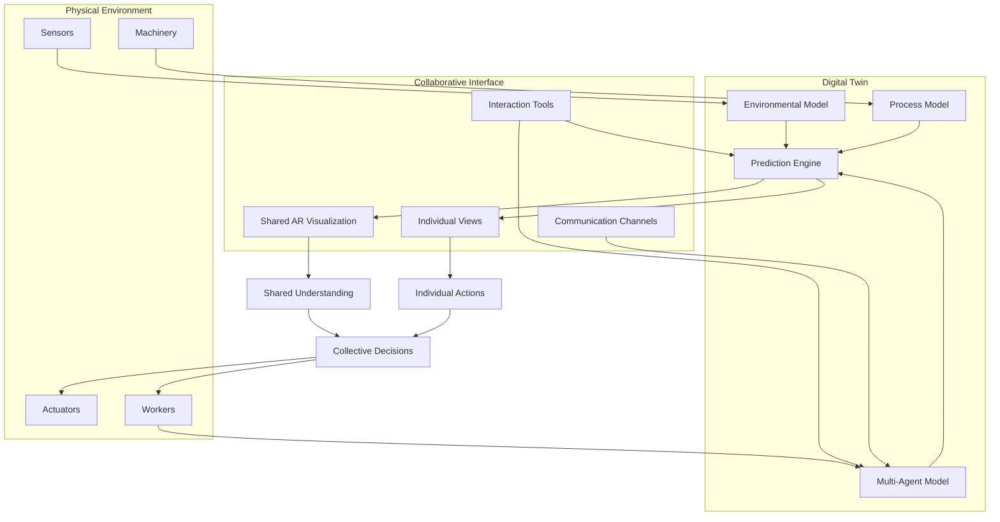

**Implementation Example: IndustryMind Platform**
- **Real-time Synchronization**: IoT sensors create continuous connection between physical factory and digital twin
- **Hierarchical Generative Models**: Multi-level models of industrial processes with uncertainty representation
- **Multi-agent Active Inference**: System modeling both human and automated agents as active inference entities
- **Shared Precision Allocation**: Coordinating attention across team members through precision mechanisms
- **Collaborative Decision-Making**: Expected free energy minimization for group decisions

**Results and Benefits:**
- 28% reduction in production planning time
- 45% improvement in issue resolution speed
- Enhanced cross-disciplinary collaboration through shared spatial understanding
- Successful prediction of process bottlenecks with 82% accuracy
- Effective knowledge transfer between expert and novice team members

### Adaptive Mixed Reality Therapeutic Environments

Therapeutic applications using active inference to create personalized treatment environments:

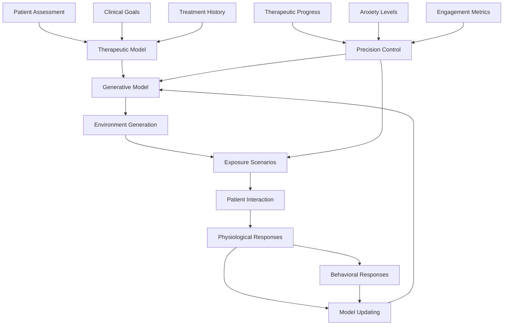

**Implementation Example: TherapySpace VR**
- **Personalized Generative Model**: Patient-specific model of anxiety triggers and responses
- **Precision-Weighted Exposure**: Therapy difficulty adapts based on physiological monitoring
- **Gradual Updating**: Environmental challenges evolve through prediction error minimization
- **Multi-Sensory Integration**: Visual, auditory, and haptic elements for immersive therapeutic experiences
- **Therapist Dashboard**: Model transparency for treatment monitoring and intervention

**Results and Benefits:**
- Effective treatment outcomes for 76% of anxiety disorder patients
- Personalized adaptation that maintained optimal therapeutic challenge
- 68% reduction in therapy duration compared to traditional exposure methods
- Improved patient engagement and reduced dropout rates
- Successful transfer of therapeutic gains to real-world environments

### Predictive Interfaces for Spatial Computing

User interfaces that anticipate needs and intentions in spatial environments:

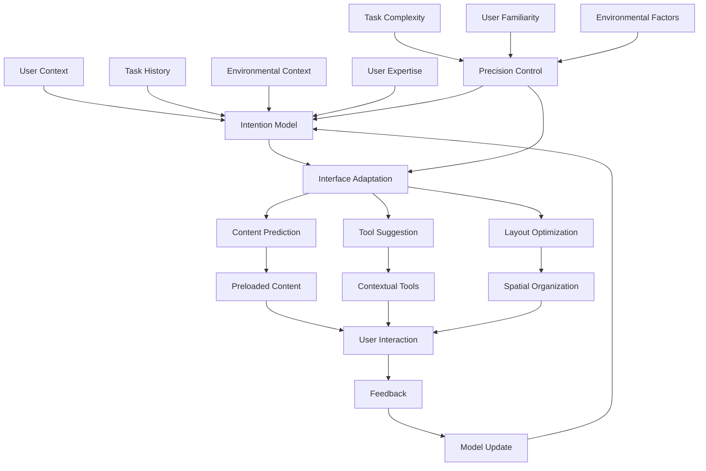

**Implementation Example: SpatialStudio Pro**
- **Hierarchical Intention Modeling**: Predicts user goals at multiple timescales
- **Precision-Weighted Tool Suggestion**: Presents tools with confidence based on context
- **Spatial Layout Adaptation**: Reorganizes interface elements based on predicted workflow
- **Content Preloading**: Anticipates needed assets and resources before explicit requests
- **Continuous Learning**: Refines predictions based on individual and collective user patterns

**Results and Benefits:**
- 32% reduction in time spent searching for tools and functions
- 47% improvement in task completion rates for complex workflows
- Adaptive interfaces that successfully predicted next actions in 81% of cases
- Personalized workspace organization that reduced cognitive load
- Significant improvement in user satisfaction and reduced frustration

### Active Inference in Spatial Social Platforms

Social VR/AR platforms that use active inference to enhance social presence and interaction:

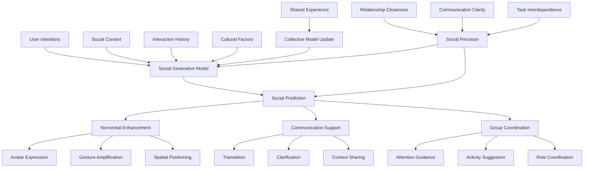

**Implementation Example: ConnectXR Platform**
- **Multi-Agent Generative Models**: Predicts intentions and needs across user groups
- **Nonverbal Enhancement**: Amplifies subtle expressions and gestures for improved communication
- **Cultural Adaptation**: Adjusts interaction patterns based on cultural models and expectations
- **Group Intention Modeling**: Creates shared environmental responses based on collective goals
- **Social Coordination Support**: Facilitates collaborative activities through predicted action sequences

**Results and Benefits:**
- Enhanced sense of presence and connection in virtual environments
- Reduced miscommunication in cross-cultural and cross-linguistic interactions
- Improved coordination in collaborative tasks through shared attention mechanisms
- More natural and intuitive social dynamics in virtual spaces
- Increased user engagement and retention in social platforms

## Conclusion: The Convergence of Mind and Machine

The integration of active inference with spatial computing represents a profound convergence of cognitive science and technology. By applying the principles of predictive processing to spatial interfaces, we create systems that not only understand and anticipate human needs but also adapt and learn in ways that mirror our own cognitive processes.

This learning path has explored how the mathematical framework of the Free Energy Principle can be translated into practical applications across the reality-virtuality spectrum, from augmented reality interfaces to fully immersive virtual environments. The hierarchical, predictive nature of active inference provides a unifying theoretical foundation for addressing the core challenges of spatial computing: perception, action, learning, and social interaction in three-dimensional space.

As spatial computing continues to evolve, active inference offers a roadmap for creating more intuitive, adaptive, and intelligent systems that work in harmony with human cognition. The future of this field will be shaped by advances in neuromorphic computing, collective intelligence, seamless reality integration, and ethical frameworks for powerful predictive systems.

By mastering the concepts and skills presented in this learning path, practitioners will be equipped to create spatial computing experiences that don't just overlay digital content on the physical world, but truly understand and enhance human experience through the power of prediction.

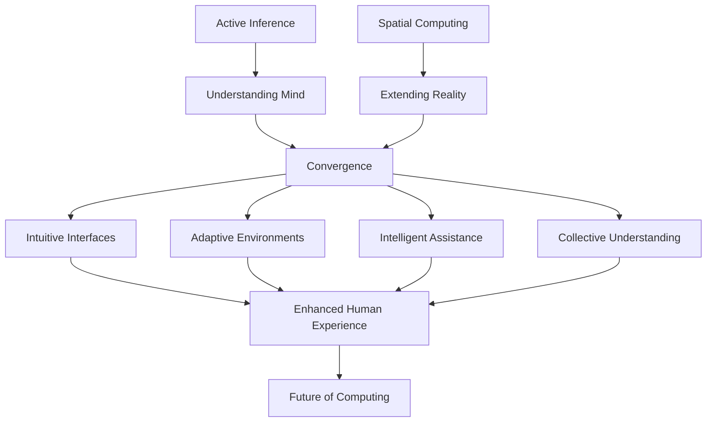

## Future Research Directions

This section explores emerging areas of research at the intersection of active inference and spatial web technologies, highlighting opportunities for innovation and advancement.

### Emerging Research Questions

Critical questions driving the future of active inference in spatial computing:

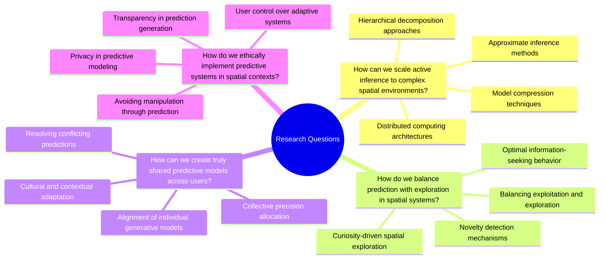

### Interdisciplinary Research Opportunities

Cross-disciplinary research areas at the intersection of active inference and spatial computing:

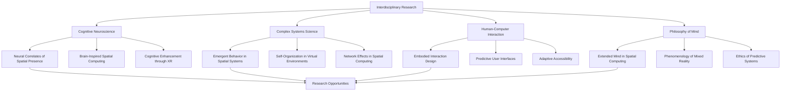

## Learning Path Extensions

### Specialized Learning Tracks

Focused paths for specific application domains:

```mermaid
graph TD
    A[Active Inference in Spatial Web] --> B[Healthcare Track]
    A --> C[Industrial Track]
    A --> D[Creative Industries Track]
    A --> E[Urban Planning Track]
    
    B --> B1[Medical Visualization]
    B --> B2[Therapeutic Applications]
    B --> B3[Surgical Assistance]
    B --> B4[Healthcare Training]
    
    C --> C1[Digital Twin Systems]
    C --> C2[Manufacturing Assistance]
    C --> C3[Maintenance Support]
    C --> C4[Industrial Training]
    
    D --> D1[Immersive Storytelling]
    D --> D2[Spatial Design]
    D --> D3[Virtual Production]
    D --> D4[Interactive Entertainment]
    
    E --> E1[Urban Digital Twins]
    E --> E2[Participatory Planning]
    E --> E3[Smart City Applications]
    E --> E4[Environmental Monitoring]
```

### Advanced Certification Paths

Progression toward expertise in active inference for spatial computing:

```mermaid
graph TD
    A[Foundation Certificate] --> B[Practitioner Certificate]
    B --> C[Specialist Certificate]
    C --> D[Expert Certificate]
    
    A --> A1[Active Inference Basics]
    A --> A2[Spatial Computing Fundamentals]
    A --> A3[Implementation Basics]
    
    B --> B1[Advanced Generative Models]
    B --> B2[Spatial Application Development]
    B --> B3[Project Implementation]
    
    C --> C1[Domain Specialization]
    C --> C2[Advanced Implementation]
    C --> C3[Research Methods]
    
    D --> D1[Original Contribution]
    D --> D2[Advanced Research]
    D --> D3[Leadership and Teaching]
```

### Community of Practice Model

Structure for ongoing learning and professional development:

```mermaid
graph TD
    A[Community of Practice] --> B[Knowledge Sharing]
    A --> C[Collaborative Projects]
    A --> D[Mentorship Programs]
    A --> E[Research Initiatives]
    
    B --> B1[Case Study Library]
    B --> B2[Implementation Patterns]
    B --> B3[Technical Discussions]
    B --> B4[Resource Repository]
    
    C --> C1[Open Source Development]
    C --> C2[Hackathons]
    C --> C3[Industry Partnerships]
    C --> C4[Research Collaborations]
    
    D --> D1[Beginner Mentoring]
    D --> D2[Specialized Coaching]
    D --> D3[Career Development]
    D --> D4[Expert Consultation]
    
    E --> E1[Applied Research]
    E --> E2[Theoretical Advances]
    E --> E3[Evaluation Methods]
    E --> E4[Standards Development]
```

## Implementation Frameworks

### Active Inference Development Framework

A structured approach to implementing active inference in spatial computing applications:

```mermaid
graph TD
    A[Requirements Analysis] --> B[Generative Model Design]
    B --> C[Perception System Implementation]
    C --> D[Action System Implementation]
    D --> E[Learning System Implementation]
    E --> F[Integration and Testing]
    F --> G[Deployment and Monitoring]
    
    B --> B1[Define Model Hierarchy]
    B --> B2[Specify Prior Beliefs]
    B --> B3[Design Likelihood Mapping]
    B --> B4[Set Precision Parameters]
    
    C --> C1[Sensor Integration]
    C --> C2[Feature Extraction]
    C --> C3[Belief Updating Implementation]
    
    D --> D1[Policy Enumeration]
    D --> D2[Expected Free Energy Calculation]
    D --> D3[Action Selection Mechanism]
    
    E --> E1[Parameter Learning]
    E --> E2[Structure Learning]
    E --> E3[Transfer Learning]
    
    F --> F1[Component Integration]
    F --> F2[Performance Testing]
    F --> F3[User Testing]
    
    G --> G1[Deployment Strategy]
    G --> G2[Performance Monitoring]
    G --> G3[Continuous Improvement]
```

## Assessment Framework

### Continuous Assessment
#### Weekly Checkpoints
- Spatial Computing Implementation - Passing Score: 85%
- Active Inference Integration - Passing Score: 85%
- XR Development Skills - Passing Score: 80%
- System Architecture Design - Passing Score: 85%

#### Progress Tracking
- Daily Development Log
- Weekly Implementation Reviews
- Bi-weekly System Integration Tests
- Monthly Project Milestones

### Knowledge Checkpoints
#### Foundation Checkpoint (Week 4)
- Format: Technical Implementation + Documentation
- Duration: 1 week
- Topics Covered:
  - Basic spatial computing implementation
  - Active inference integration
  - XR development fundamentals
- Minimum Pass Requirements:
  - Implementation: Working prototype
  - Documentation: Complete technical specs
  - Integration: Successful active inference components

#### Advanced Integration Checkpoint (Week 8)
- Format: System Development + Presentation
- Duration: 2 weeks
- Topics Covered:
  - Complex spatial systems
  - Multi-modal integration
  - Advanced active inference applications
- Requirements:
  - Working spatial computing system
  - Performance optimization
  - Technical documentation

#### Final Project Checkpoint (Week 14)
- Format: Complete System Implementation
- Duration: 3 weeks
- Topics Covered:
  - Full system integration
  - Performance optimization
  - Real-world application
- Deliverables:
  - Production-ready system
  - Technical documentation
  - Research paper
  - Presentation

### Project Portfolio
#### Development Projects
1. Basic Spatial Active Inference System
   - Scope: Simple spatial prediction
   - Deliverables:
     - Working prototype
     - Technical documentation
     - Performance analysis
   - Evaluation Criteria:
     - Implementation: 40%
     - Integration: 30%
     - Documentation: 30%

2. Advanced XR Integration
   - Scope: Complex spatial computing
   - Deliverables:
     - Full system implementation
     - Integration tests
     - Performance metrics
   - Evaluation Criteria:
     - System Design: 35%
     - Implementation: 35%
     - Documentation: 30%

#### Capstone Project
- Description: Novel Spatial Computing Application
- Requirements:
  - Technical:
    - Full system implementation
    - Active inference integration
    - Performance optimization
  - Documentation:
    - System architecture
    - Technical specifications
    - User documentation
  - Presentation:
    - System demonstration
    - Technical presentation
    - Research findings
- Evaluation Matrix:
  - System Implementation: 40%
  - Integration Quality: 30%
  - Documentation: 20%
  - Presentation: 10%

### Success Criteria
#### Technical Competency
- Spatial Computing: Expert level (9/10)
- Active Inference: Advanced proficiency (8/10)
- XR Development: Production quality
- System Integration: Professional standard

#### Project Delivery
- Quality Standards:
  - System performance benchmarks
  - Integration test coverage
  - Documentation completeness
- Performance Metrics:
  - System responsiveness
  - Prediction accuracy
  - User experience quality

#### Professional Development
- Technical publications
- System demonstrations
- Conference presentations
- Community contributions

## Career Development

### Industry Alignment
#### Job Roles
- Spatial Computing Engineer
  - System architecture
  - XR development
  - Integration expertise
- Research Scientist
  - Active inference applications
  - Spatial computing research
  - System innovation
- Technical Lead
  - Team leadership
  - Project management
  - Strategic planning

#### Certification Preparation
- XR Development
  - Unity/Unreal certification
  - AR/VR platforms
- Spatial Computing
  - Computer vision
  - SLAM systems
- Research Methods
  - System evaluation
  - Technical writing

### Professional Network
#### Mentorship
- Finding Mentors:
  - Industry experts
  - Research leaders
  - Technical advisors
- Being a Mentor:
  - Technical guidance
  - Project reviews
  - Career development
- Peer Learning Groups:
  - Development teams
  - Research collaborations
  - Technical workshops

#### Portfolio Building
- Project Showcase:
  - System implementations
  - Technical demonstrations
  - Research projects
- Documentation:
  - Technical papers
  - System specifications
  - Tutorial creation
- Presentation Skills:
  - Technical talks
  - System demonstrations
  - Research presentations

### Spatial Computing Career Path
```mermaid
graph TB
    subgraph Entry Level
        E1[Junior XR Developer] --> E2[Spatial Computing Engineer]
        E2 --> E3[Integration Specialist]
    end
    
    subgraph Mid Level
        M1[Senior Engineer] --> M2[Technical Lead]
        M2 --> M3[Research Engineer]
    end
    
    subgraph Senior Level
        S1[Principal Engineer] --> S2[System Architect]
        S2 --> S3[Research Director]
    end
    
    E3 --> M1
    M3 --> S1
    
    style E1 fill:#f9f,stroke:#333
    style E2 fill:#f9f,stroke:#333
    style E3 fill:#f9f,stroke:#333
    style M1 fill:#bbf,stroke:#333
    style M2 fill:#bbf,stroke:#333
    style M3 fill:#bbf,stroke:#333
    style S1 fill:#bfb,stroke:#333
    style S2 fill:#bfb,stroke:#333
    style S3 fill:#bfb,stroke:#333
```

### Integration Competencies
```mermaid
mindmap
    root((Spatial Computing
    Expert))
        Active Inference
            Predictive Processing
                Model Implementation
                System Integration
            Free Energy Principle
                Mathematical Framework
                Optimization
        XR Development
            AR/VR/MR
                Platform Development
                User Experience
            Spatial Computing
                Environment Modeling
                Interaction Design
        System Architecture
            Integration
                Components
                Interfaces
            Performance
                Optimization
                Scaling
        Research Skills
            Technical Writing
                Papers
                Documentation
            System Evaluation
                Metrics
                Analysis
```

## Integration Strategies

### Development Approaches
- Theory-Practice Integration
  - Active inference principles in spatial computing
  - XR system development with predictive processing
  - Real-world applications and testing
- Cross-Platform Development
  - AR/VR/MR integration
  - Multi-modal systems
  - Platform-specific optimization
- Collaborative Development
  - Team projects
  - Research collaboration
  - Industry partnerships

### Resource Optimization
- Development Environment
  - XR development tools
  - Integration frameworks
  - Testing platforms
- Documentation Standards
  - System specifications
  - API documentation
  - Integration guides
- Quality Assurance
  - Automated testing
  - Performance monitoring
  - Integration validation

### System Architecture
```mermaid
graph TD
    subgraph Active Inference Layer
        AI[Active Inference Core] --> PP[Predictive Processing]
        PP --> GM[Generative Models]
    end
    
    subgraph Spatial Computing Layer
        SC[Spatial Core] --> CV[Computer Vision]
        SC --> IN[Interaction]
        SC --> MP[Mapping]
    end
    
    subgraph Integration Layer
        IL[Integration Core] --> AD[Adaptation]
        IL --> PR[Prediction]
        IL --> OP[Optimization]
    end
    
    GM --> IL
    MP --> IL
    
    style AI fill:#f9f,stroke:#333
    style PP fill:#f9f,stroke:#333
    style GM fill:#f9f,stroke:#333
    style SC fill:#bbf,stroke:#333
    style CV fill:#bbf,stroke:#333
    style IN fill:#bbf,stroke:#333
    style MP fill:#bbf,stroke:#333
    style IL fill:#bfb,stroke:#333
    style AD fill:#bfb,stroke:#333
    style PR fill:#bfb,stroke:#333
    style OP fill:#bfb,stroke:#333
```

## Support Resources

### Technical Support
- Development Resources
  - XR Development Environments
  - Integration Frameworks
  - Testing Tools
- Documentation
  - API References
  - Integration Guides
  - Best Practices
- Community Support
  - Developer Forums
  - Research Groups
  - Technical Discussions

### Learning Support
- Educational Materials
  - Tutorial Projects
  - Code Examples
  - Implementation Guides
- Mentorship Program
  - Technical Mentoring
  - Code Reviews
  - Project Guidance
- Collaboration
  - Development Teams
  - Research Groups
  - Industry Partners

### Research Support
```mermaid
mindmap
    root((Research
    Resources))
        Technical Papers
            Active Inference
                Theory
                Applications
            Spatial Computing
                XR Development
                Integration
            System Design
                Architecture
                Implementation
        Development Tools
            XR Platforms
                Unity/Unreal
                Custom Solutions
            Integration Tools
                Testing
                Deployment
            Analysis Tools
                Performance
                Evaluation
        Community
            Research Labs
                Universities
                Industry
            Conferences
                Technical
                Research
            Collaboration
                Projects
                Publications
```

## Version Control and Updates

### Version History
```mermaid
gitGraph
    commit id: "v1.0.0" tag: "Initial Release"
    commit id: "v1.1.0"
    branch feature/spatial-integration
    commit id: "spatial-components"
    commit id: "active-inference-integration"
    checkout main
    merge feature/spatial-integration id: "v2.0.0" tag: "Major Update"
    commit id: "v2.1.0"
```

### Change Management
#### Major Updates
- v2.0.0 (Current)
  - Enhanced spatial integration
  - Advanced XR components
  - Improved active inference implementation
  - Updated system architecture
- v1.1.0
  - Added XR development modules
  - Enhanced documentation
  - New example projects
- v1.0.0
  - Initial curriculum
  - Basic implementations
  - Core concepts

#### Planned Improvements
- Advanced integration patterns
- Real-world case studies
- Performance optimization techniques
- Cross-platform development

### Quality Metrics
```mermaid
xychart-beta
    title "Learning Path Components Quality"
    x-axis [Theory, Implementation, Integration, Documentation, Support]
    y-axis "Score" 0 --> 100
    bar [92, 88, 95, 90, 85]
```

## Community Engagement

### Contribution Opportunities
- System Development
  - Core components
  - Integration modules
  - Example applications
- Documentation
  - Technical guides
  - Integration tutorials
  - Best practices
- Research
  - Implementation studies
  - Performance analysis
  - Novel applications

### Community Resources
```mermaid
mindmap
    root((Community
    Engagement))
        Online
            Forums
                Technical
                Research
            Resources
                Code
                Documentation
            Communication
                Discord
                Slack
        Offline
            Events
                Workshops
                Hackathons
            Meetings
                Research
                Development
            Projects
                Collaboration
                Innovation
```

### Feedback Channels
- Technical Feedback
  - Implementation reviews
  - Performance analysis
  - Integration testing
- Content Improvement
  - Documentation updates
  - Tutorial enhancement
  - Example additions
- Research Input
  - Paper reviews
  - Method validation
  - Application studies

## Learning Analytics

### Progress Tracking
```mermaid
xychart-beta
    title "Skill Development Progress"
    x-axis [Week 1, Week 4, Week 8, Week 12, Week 16]
    y-axis "Competency" 0 --> 100
    line [15, 40, 65, 85, 95]
    line [10, 35, 60, 80, 90]
```

### Performance Metrics
- Technical Skills
  - Implementation quality
  - Integration success
  - System performance
- Research Abilities
  - Technical understanding
  - Innovation capacity
  - Analysis skills
- Professional Growth
  - Project leadership
  - Team collaboration
  - Communication effectiveness

### Development Analytics
```mermaid
graph LR
    subgraph Skill Development
        T[Theory] --> I[Implementation]
        I --> E[Evaluation]
        E --> O[Optimization]
    end
    
    subgraph Metrics
        Q[Quality] --> P[Performance]
        P --> R[Results]
    end
    
    O --> Q
    
    style T fill:#f9f,stroke:#333
    style I fill:#f9f,stroke:#333
    style E fill:#bbf,stroke:#333
    style O fill:#bbf,stroke:#333
    style Q fill:#bfb,stroke:#333
    style P fill:#bfb,stroke:#333
    style R fill:#bfb,stroke:#333
```

## Final Notes

### Success Stories
- Industry Implementations
  - Successful projects
  - System deployments
  - Performance improvements
- Research Impact
  - Published papers
  - Novel methods
  - Industry applications
- Career Advancement
  - Role progression
  - Skill development
  - Professional recognition

### Additional Resources
- Extended Reading
  - Technical papers
  - Research publications
  - Industry reports
- Advanced Topics
  - Specialized implementations
  - Novel applications
  - Research directions
- Industry Connections
  - Partner companies
  - Research labs
  - Development teams

### Contact Information
- Technical Support
  - Development team
  - Integration specialists
  - System architects
- Research Support
  - Principal investigators
  - Research coordinators
  - Project leaders
- Community Support
  - Forum moderators
  - Community managers
  - Event coordinators 