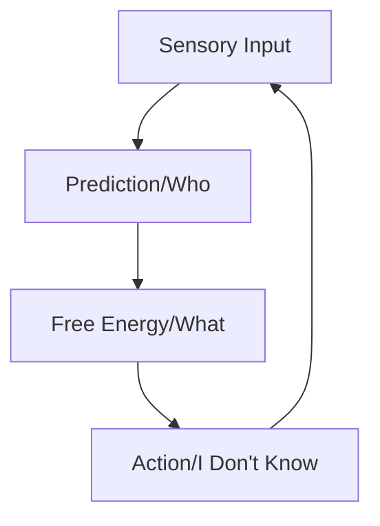

# Active Inference Learning Path: Who's on First?

## Introduction: The Perfect Game of Mind
Welcome to a unique exploration of [[Active Inference]] and the [[Free Energy Principle]], structured as the immortal "Who's on First?" comedy routine. Just as Abbott and Costello's routine plays with language and expectations, we'll use their format to unpack the fascinating world of how brains make sense of reality.

> "Baseball is like church. Many attend, few understand." - Leo Durocher, 1939

This learning path interweaves three grand American traditions:
- The science of cognition ([[Active Inference]])
- The art of baseball ([[Baseball Statistics|Sabermetrics]])
- The comedy of [[Abbott and Costello]]

## The Setup: At the Ballpark of Cognition (Act I)

*Setting: Yankee Stadium, 1928. The smell of peanuts and fresh-cut grass fills the air. A young Lou Costello, seeking wisdom about both baseball and the mind, approaches the veteran Bud Abbott.*

**Lou**: Hey Abbott, I've been studying this thing called Active Inference. Tell me about the team.

**Abbott**: Oh, you want to know about Active Inference? Well, who's on first.

**Lou**: That's what I'm asking you - who's handling the predictions in Active Inference?

**Abbott**: No no, Who IS the prediction. The brain's prediction IS first base.

### Technical Interlude: Predictive Processing Fundamentals
```math
P(hypothesis|data) = \frac{P(data|hypothesis)P(hypothesis)}{P(data)}
```
This Bayesian formulation underlies all predictive processing, just as first base underlies all forward progress in baseball.

## First Base: Predictive Processing - The Foundation

**Lou**: Let me get this straight. You're saying there's someone called "Prediction" on first?

**Abbott**: Who's on first.

**Lou**: I'm ASKING you - who's making the predictions?

**Abbott**: That's right! The brain makes predictions about sensory input - that's Who, our first baseman of Active Inference.

### Deep Dive: The Mathematics of Prediction
```math
F = E_q[\log q(s) - \log p(o,s)]
```
Where:
- F is the [[Free Energy]]
- q(s) is the recognition density
- p(o,s) is the generative model
- E_q is the expectation with respect to q

## Second Base: Free Energy - The Strategic Play

*A crowd gathers as Abbott sketches diagrams in the dirt with his baseball bat*

**Lou**: Okay, fine. What's on second?

**Abbott**: Free Energy is on second.

**Lou**: Free... what?

**Abbott**: Free Energy! It's what the brain minimizes to update its model.

### Technical Section: Free Energy Decomposition
```math
F = D_{KL}[q(s)||p(s|o)] - \log p(o)
```

#### Historical Baseball Analogy
Just as [[Bill James]] revolutionized baseball with sabermetrics, [[Karl Friston]] transformed neuroscience with the [[Free Energy Principle]].



## Third Base: Action Selection - The Power Hit

**Lou**: And third base?

**Abbott**: Action's on third.

**Lou**: What kind of action?

**Abbott**: Policy selection! The brain doesn't just predict - it acts to make its predictions come true!

### Mathematical Framework: Policy Selection
```math
Q(\pi) = E_{q(s|\pi)}[\log p(o|s) + \log p(s) - \log q(s|\pi)]
```

## The Outfield: Extended Concepts

### Left Field: [[Precision Weighting]]
**Lou**: Who's in left field?
**Abbott**: Precision.
**Lou**: You're being precise about what?
**Abbott**: No, Precision is IN left field!

### Center Field: [[Hierarchical Processing]]
**Lou**: Center field?
**Abbott**: Hierarchy's there.
**Lou**: Higher than what?
**Abbott**: No, Hierarchical Processing!

### Right Field: [[Active Learning]]
**Lou**: Right field?
**Abbott**: Learning's out there.
**Lou**: What're they learning?
**Abbott**: Exactly! They're learning What's on second!

## Practice Drills: Interactive Exercises

1. "Who's Making Predictions?" - Predictive Processing Exercises
   - Calculate prediction errors using real baseball statistics
   - Implement simple Bayesian updates
   - [[Prediction Error]] minimization games

2. "What's the Free Energy?" - Mathematical Workshops
   - Free Energy derivations
   - Variational inference basics
   - Information geometry on the diamond

3. "I Don't Know's" on Policy Selection
   - Action-oriented learning
   - Multi-armed bandit problems
   - Baseball strategy as active inference

## Historical Context: The 1920s Golden Era

### Baseball Statistics Meet Brain Statistics
- [[Babe Ruth]]'s batting average as a probability distribution
- [[Miller Huggins]]' strategy as policy selection
- The [[1927 Yankees]] as a predictive processing machine

### Cultural Integration
- Vaudeville and Variational Inference
- The Jazz Age and Information Theory
- Prohibition and Prior Beliefs

## Statistical Foundations: From Diamond to Brain

### The Statistical Revolution: SPM Meets Sabermetrics

**Lou**: Hey Abbott, these numbers are making my head spin!

**Abbott**: That's because you're looking at them like box scores. You need to think about them like brain maps!

#### The Parallel Evolution of Statistical Analysis
```math
\text{SPM}\{t\} = \frac{\text{contrast}^\top \hat{\beta}}{\sqrt{\text{contrast}^\top \text{Var}(\hat{\beta}) \text{contrast}}}
```

Just as Statistical Parametric Mapping revolutionized neuroimaging by allowing us to identify significant activations across brain regions, modern baseball analytics transformed our understanding of player performance through similar statistical frameworks.

### Gaussian Random Field Theory in Baseball and Brains

#### Multiple Comparisons in Space and Time
```math
P(\text{max}(t) > u) = R\phi(u) + \mathbb{E}[\chi(A_u)]
```

**Lou**: So you're saying the brain corrects for multiple comparisons just like we adjust batting averages?

**Abbott**: Exactly! Just as SPM uses Gaussian Random Field Theory to control for multiple comparisons across voxels, modern baseball analytics must account for multiple testing when analyzing thousands of pitches and plays.

### The Mathematics of Performance Prediction

#### Neural Response Functions and Player Performance Curves
```math
y(t) = \sum_{i=1}^n \beta_i h_i(t - \tau) + \epsilon(t)
```
Where:
- y(t) represents either neural response or player performance
- h_i are basis functions (hemodynamic response or performance curves)
- τ represents temporal lag
- ε(t) is structured noise

## Advanced Analytics: The Convergence

### Spatial Normalization and Player Normalization

Just as SPM normalizes brains to a standard template, baseball analytics normalizes across:
- Ballpark effects ([[Park Factors]])
- Era adjustments ([[Era+ Statistics]])
- Competition level ([[Strength of Schedule]])

```math
\text{Performance}_{\text{normalized}} = \frac{\text{Raw Performance}}{\text{Context Factor}} \times \text{Scaling Factor}
```

### Hierarchical Modeling in Both Domains

#### The Empirical Bayes Framework
```math
\begin{aligned}
P(\theta|\text{data}) &= \frac{P(\text{data}|\theta)P(\theta)}{P(\text{data})} \\
P(\theta) &\sim \mathcal{N}(\mu_\text{pop}, \sigma^2_\text{pop})
\end{aligned}
```

**Lou**: So the brain uses population priors just like we use league averages?

**Abbott**: Now you're thinking like a statistician, Who!

### Advanced Statistical Concepts

#### 1. Temporal Basis Functions
```math
\text{BOLD}(t) = \sum_{i=1}^n \beta_i \text{HRF}(t-\tau_i)
```
Parallels in baseball:
- Pitch sequencing effects
- Fatigue modeling
- Hot/cold streak analysis

#### 2. Spatial Basis Functions
```math
\phi_i(x) = \exp\left(-\frac{\|x-\mu_i\|^2}{2\sigma^2}\right)
```
Applications:
- Field positioning
- Pitch location analysis
- Defensive range modeling

## The Future of Analytics: Predictive Coding in Both Domains

### Neural Generative Models
```math
\begin{aligned}
P(o,s,\pi) &= P(o|s)P(s|\pi)P(\pi) \\
F &= \mathbb{E}_q[\log q(s,\pi) - \log P(o,s,\pi)]
\end{aligned}
```

### Baseball Generative Models
```math
\begin{aligned}
P(\text{outcome}|\theta) &= \int P(\text{outcome}|s,\theta)P(s|\theta)ds \\
\theta &= \{\text{player skills}, \text{context}, \text{strategy}\}
\end{aligned}
```

## Statistical Methods Comparison Table

| SPM Concept | Baseball Analytics Parallel |
|------------|---------------------------|
| Voxel-wise analysis | Pitch-by-pitch analysis |
| Temporal smoothing | Moving averages |
| Spatial smoothing | Position adjustments |
| Random field theory | Multiple testing in stats |
| DCM | Player interaction models |

### Implementation: The Statistical Engine Room

#### 1. Preprocessing Pipeline
```python
def preprocess_data(raw_data):
    """
    Common preprocessing steps for both domains
    """
    # Temporal filtering
    data_filtered = apply_temporal_filter(raw_data)
    
    # Spatial normalization
    data_normalized = normalize_to_template(data_filtered)
    
    # Noise correction
    data_clean = remove_artifacts(data_normalized)
    
    return data_clean
```

#### 2. Statistical Analysis
```R
# Example R code for both domains
model <- lmer(performance ~ condition + (1|subject),
             data = processed_data)
```

## Historical Development Timeline

### 1900s-1920s
- Early baseball statistics (batting average, ERA)
- Early brain mapping (Brodmann areas)

### 1950s-1970s
- Introduction of advanced baseball metrics
- Development of early neuroimaging

### 1990s
- SPM development by [[Karl Friston]]
- Sabermetrics revolution by [[Bill James]]

### 2020s and Beyond
- Neural networks in both domains
- Real-time analysis and prediction

## Practical Applications

### Cross-Domain Validation
```math
\text{CV}_{\text{score}} = \frac{1}{N}\sum_{i=1}^N (y_i - \hat{y}_i)^2
```

### Prediction Markets
- Neural response prediction
- Game outcome prediction
- Player performance forecasting

## Additional Resources

### Technical Papers
- [[Friston's Free Energy Principle]]
- [[Active Inference: A Process Theory]]
- [[The Mathematics of Baseball]]

### Baseball History
- [[Complete History of Who's on First]]
- [[Evolution of Baseball Statistics]]
- [[The Science of Baseball]]

### Interactive Elements
- [[Virtual Baseball Active Inference Simulator]]
- [[Free Energy Calculator]]
- [[Policy Selection Training Game]]

## Notes for Learners

Remember, just as Abbott and Costello's routine seems confusing at first but has a clear internal logic, Active Inference might initially appear complex but follows coherent principles. Keep practicing, and soon you'll be running the bases of cognitive science like a pro!

## Appendix A: Mathematical Proofs
[Detailed mathematical derivations and proofs]

## Appendix B: Baseball Statistics
[Historical statistics and their relationship to Active Inference]

## Appendix C: Dialog Variations
[Additional teaching dialogues and their technical implications]

## Appendix D: Advanced Statistical Methods
[Detailed mathematical derivations connecting SPM and baseball analytics]

## Appendix E: Historical Data Analysis
[Comprehensive statistical analysis of historical baseball data using neuroimaging techniques]
