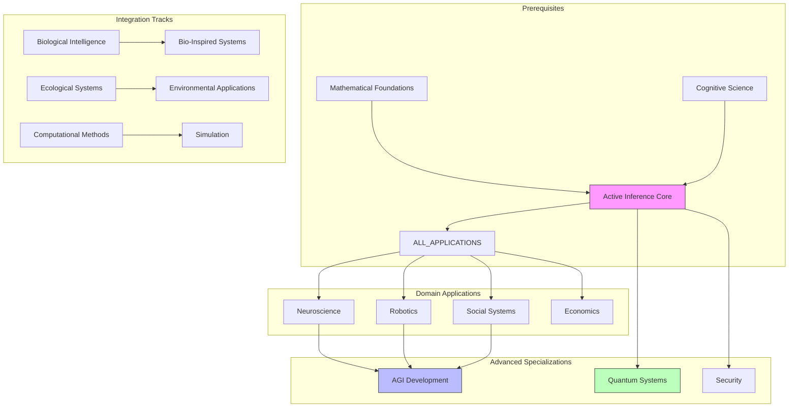

---

title: Catalog of Learning Paths

type: catalog

status: stable

created: 2024-03-15

modified: 2024-03-15
modified: 2025-08-08

version: 2.0.0

processing_priority: 1

authors:

  - name: Cognitive Systems Team

    role: Research & Development

---

# Catalog of Learning Paths

## Educational Framework Overview

This catalog presents our comprehensive collection of Active Inference learning paths, each designed as an **educational curriculum** that prioritizes learning outcomes over technical implementation. Every path follows our educational framework ensuring optimal learning experiences.

### Educational Design Standards

All learning paths in this catalog adhere to our core educational principles:

- **40% Theoretical Foundation**: Conceptual understanding and knowledge building

- **35% Practical Application**: Guided exercises and real-world case studies

- **15% Assessment & Reflection**: Knowledge validation and skill demonstration

- **10% Technical Reference**: Minimal, education-focused implementation examples

### Quick Links

- [[index|Learning Paths Index]]

- [[navigation_framework_implementation|Navigation Framework Implementation]]

- [[../../knowledge_base/mathematics/cross_reference_map|Knowledge Base Cross-Reference Map]]

- [[../../knowledge_base/mathematics/mathematics_resources|Mathematics Resources Hub]]

- [[../../knowledge_base/mathematics/worked_examples_index|Worked Examples (VFE/EFE)]]

- External web gateways: see “Centralized External Web Resources Hub” at the end of this page

### Knowledge Base Hubs

- **Mathematics foundations**: [[../../knowledge_base/mathematics/variational_free_energy]] · [[../../knowledge_base/mathematics/expected_free_energy]] · [[../../knowledge_base/mathematics/policy_selection]] · [[../../knowledge_base/mathematics/precision_parameter]] · [[../../knowledge_base/mathematics/softmax_function]] · [[../../knowledge_base/mathematics/numerical_stability]] · [[../../knowledge_base/mathematics/message_passing]] · [[../../knowledge_base/mathematics/bethe_free_energy]]

- **Cognitive science**: [[../../knowledge_base/cognitive/predictive_coding]] · [[../../knowledge_base/cognitive/active_inference]] · [[../../knowledge_base/cognitive/attention_mechanisms]] · [[../../knowledge_base/cognitive/markov_blanket]]

- **Systems and biology**: [[../../knowledge_base/biology/levels_of_organization]] · [[../../knowledge_base/systems/systems_theory]] · [[../../knowledge_base/systems/ecosystem_management]]

### Ontologies and Search

- **Ontology bridges**: [[../../knowledge_base/mathematics/msc_skos|MSC (SKOS)]] · [[../../knowledge_base/mathematics/ontomathpro_ontology|OntoMathPRO]] · [[../../knowledge_base/mathematics/mathgloss_knowledge_graph|MathGloss]]

- **How to tag**: See [[../../knowledge_base/mathematics/mathematics_resources#ontology-and-tagging|Mathematics Resources → Ontology and tagging]]

## Core Learning Paths

### 1. Foundation Paths

#### [[active_inference_learning_path|Active Inference Core Path]]

- **Educational Focus**: Fundamental principles and mathematical foundations

- **Target Audience**: Newcomers to Active Inference

- **Learning Approach**: Concept-driven with progressive complexity

- **Duration**: 16 weeks

- **Key Learning Outcomes**:

  - Understand free energy principle conceptually and mathematically

  - Apply Active Inference to simple perception and action scenarios

  - Connect theoretical principles to biological and artificial systems

  - Design basic Active Inference models for specific problems

#### [[active_inference_mathematical_learning_path|Mathematical Foundations Path]]

- **Educational Focus**: Mathematical frameworks underlying Active Inference

- **Target Audience**: Learners with strong mathematical backgrounds

- **Learning Approach**: Theorem-proof-application cycle

- **Duration**: 14 weeks

- **Key Learning Outcomes**:

  - Master variational calculus in Active Inference context

  - Understand information-theoretic foundations

  - Apply mathematical tools to novel problems

  - Derive key results from first principles

#### [[active_inference_cognitive_learning_path|Cognitive Science Integration Path]]

- **Educational Focus**: Connections between Active Inference and cognitive science

- **Target Audience**: Psychology and cognitive science practitioners

- **Learning Approach**: Theory-to-behavior translation

- **Duration**: 18 weeks

- **Key Learning Outcomes**:

  - Map cognitive phenomena to Active Inference principles

  - Design experiments testing Active Inference predictions

  - Integrate with existing cognitive theories

  - Apply to therapeutic and educational contexts

### 2. Domain Application Paths

#### [[active_inference_neuroscience_learning_path|Neuroscience Applications Path]]

- **Educational Focus**: Neural implementation of Active Inference principles

- **Target Audience**: Neuroscientists and computational biologists

- **Learning Approach**: Multi-scale brain modeling

- **Duration**: 20 weeks

- **Key Learning Outcomes**:

  - Connect Active Inference to neural mechanisms

  - Interpret neuroimaging data through Active Inference lens

  - Design neuroscience experiments

  - Bridge computational and biological perspectives

#### [[active_inference_robotics_learning_path|Robotics and Embodied AI Path]]

- **Educational Focus**: Active Inference in robotic systems

- **Target Audience**: Robotics engineers and AI researchers

- **Learning Approach**: Embodied cognition emphasis

- **Duration**: 22 weeks

- **Key Learning Outcomes**:

  - Design Active Inference control systems

  - Implement perception-action loops

  - Understand sensorimotor integration

  - Build adaptive robotic behaviors

#### [[active_inference_social_learning_path|Social Systems Path]]

- **Educational Focus**: Multi-agent Active Inference systems

- **Target Audience**: Social scientists and computational modelers

- **Learning Approach**: Individual-to-collective progression

- **Duration**: 18 weeks

- **Key Learning Outcomes**:

  - Model social behavior using Active Inference

  - Understand collective intelligence emergence

  - Design social simulation experiments

  - Apply to organizational and policy contexts

#### [[active_inference_economic_learning_path|Economic Applications Path]]

- **Educational Focus**: Decision-making and market dynamics

- **Target Audience**: Economists and decision scientists

- **Learning Approach**: Behavioral economics integration

- **Duration**: 16 weeks

- **Key Learning Outcomes**:

  - Model economic decision-making

  - Understand market dynamics through Active Inference

  - Design economic experiments

  - Apply to policy and behavioral interventions

### 3. Advanced Specialization Paths

#### [[active_inference_agi_learning_path|AGI and Superintelligence Path]]

- **Educational Focus**: Safe and robust artificial general intelligence

- **Target Audience**: AI safety researchers and AGI developers

- **Learning Approach**: Safety-first development

- **Duration**: 24 weeks

- **Key Learning Outcomes**:

  - Design safe AGI architectures

  - Implement value alignment mechanisms

  - Understand superintelligence implications

  - Develop safety verification methods

#### [[active_inference_quantum_learning_path|Quantum Cognitive Systems Path]]

- **Educational Focus**: Quantum computation meets Active Inference

- **Target Audience**: Quantum computing researchers

- **Learning Approach**: Quantum-classical bridge building

- **Duration**: 20 weeks

- **Key Learning Outcomes**:

  - Understand quantum cognitive phenomena

  - Design quantum Active Inference algorithms

  - Implement quantum-classical hybrid systems

  - Explore quantum consciousness implications

#### [[active_inference_security_learning_path|Security and Robustness Path]]

- **Educational Focus**: Secure and robust Active Inference systems

- **Target Audience**: Security researchers and system architects

- **Learning Approach**: Threat modeling and defense design

- **Duration**: 18 weeks

- **Key Learning Outcomes**:

  - Identify security vulnerabilities in AI systems

  - Design robust defense mechanisms

  - Implement secure Active Inference architectures

  - Understand adversarial dynamics

### 4. Interdisciplinary Integration Paths

#### [[active_inference_biological_learning_path|Biological Intelligence Path]]

- **Educational Focus**: Natural intelligence through Active Inference lens

- **Target Audience**: Biologists and computational researchers

- **Learning Approach**: Evolution-to-cognition progression

- **Duration**: 20 weeks

- **Key Learning Outcomes**:

  - Understand biological intelligence principles

  - Model evolutionary processes

  - Connect molecular to cognitive scales

  - Design bio-inspired AI systems

#### [[active_inference_bio_inspired_cognitive_systems_path|Bio-Inspired Systems Path]]

- **Educational Focus**: Engineering systems inspired by biology

- **Target Audience**: Engineers and bio-inspired computing researchers

- **Learning Approach**: Biology-to-engineering translation

- **Duration**: 20 weeks

- **Key Learning Outcomes**:

  - Extract engineering principles from biology

  - Design bio-inspired algorithms

  - Implement natural computation methods

  - Bridge biological and artificial systems

#### [[active_inference_ecological_learning_path|Ecological Systems Path]]

- **Educational Focus**: Environmental and ecosystem applications

- **Target Audience**: Environmental scientists and systems modelers

- **Learning Approach**: Multi-scale ecological modeling

- **Duration**: 18 weeks

- **Key Learning Outcomes**:

  - Model ecosystem dynamics

  - Understand environmental adaptation

  - Design conservation strategies

  - Apply to sustainability challenges

### 5. Computational and Technical Paths

#### [[active_inference_computational_learning_path|Computational Methods Path]]

- **Educational Focus**: Algorithmic thinking and computational efficiency

- **Target Audience**: Computer scientists and performance engineers

- **Learning Approach**: Concept-first computational design

- **Duration**: 22 weeks

- **Key Learning Outcomes**:

  - Understand computational principles behind Active Inference

  - Design efficient algorithms

  - Implement scalable systems

  - Optimize for real-world deployment

#### [[active_inference_simulation_learning_path|Simulation and Modeling Path]]

- **Educational Focus**: Virtual environment design and analysis

- **Target Audience**: Simulation engineers and researchers

- **Learning Approach**: Virtual-to-real progression

- **Duration**: 16 weeks

- **Key Learning Outcomes**:

  - Design Active Inference simulations

  - Validate models against real-world data

  - Understand simulation limitations

  - Transfer insights to real systems

### 6. Applied and Professional Paths

#### [[active_inference_educational_programs_path|Educational Applications Path]]

- **Educational Focus**: Learning and teaching applications

- **Target Audience**: Educators and learning scientists

- **Learning Approach**: Pedagogy-informed design

- **Duration**: 16 weeks

- **Key Learning Outcomes**:

  - Apply Active Inference to learning processes

  - Design educational interventions

  - Understand student modeling

  - Implement adaptive learning systems

#### [[active_inference_ethics_learning_path|Ethics and Responsible AI Path]]

- **Educational Focus**: Ethical AI development and deployment

- **Target Audience**: AI ethicists and responsible AI practitioners

- **Learning Approach**: Case-study driven ethics

- **Duration**: 14 weeks

- **Key Learning Outcomes**:

  - Identify ethical issues in AI systems

  - Design ethical AI frameworks

  - Implement bias detection and mitigation

  - Understand societal implications

#### [[active_inference_underwriting_learning_path|Insurance and Risk Assessment Path]]

- **Educational Focus**: Risk modeling and assessment applications

- **Target Audience**: Insurance professionals and risk analysts

- **Learning Approach**: Industry-specific case studies

- **Duration**: 12 weeks

- **Key Learning Outcomes**:

  - Model risk using Active Inference

  - Design risk assessment systems

  - Understand uncertainty quantification

  - Apply to insurance products

## Educational Progression Framework

### Learning Path Relationships



### Cross-Path Integration Opportunities

#### Concept Bridges

- **Mathematical ↔ Neuroscience**: Neural computation foundations

- **Cognitive ↔ Social**: Individual to collective behavior

- **Robotics ↔ Bio-Inspired**: Embodied intelligence principles

- **Economics ↔ Security**: Game theory and adversarial thinking

#### Collaborative Projects

- **Multi-Scale Modeling**: Combine biological, cognitive, and social paths

- **Safe AI Development**: Integrate AGI, ethics, and security paths

- **Sustainable Systems**: Connect ecological, economic, and policy paths

- **Educational Technology**: Merge educational, computational, and cognitive paths

### Assessment and Certification Framework

#### Competency Levels

```yaml

competency_framework:

  foundation_level:

    requirements:

      - conceptual_understanding: 80%

      - basic_application: 75%

      - knowledge_connections: 70%

    certification: "Active Inference Foundation Certificate"

  practitioner_level:

    requirements:

      - advanced_application: 85%

      - domain_integration: 80%

      - project_completion: 90%

    certification: "Active Inference Practitioner Certificate"

  expert_level:

    requirements:

      - research_contribution: 90%

      - teaching_capability: 85%

      - innovation_demonstration: 90%

    certification: "Active Inference Expert Certificate"

  specialist_level:

    requirements:

      - domain_mastery: 95%

      - cross_domain_synthesis: 90%

      - community_leadership: 85%

    certification: "Active Inference Specialist Certificate"

```

#### Portfolio Assessment

Each learner develops a comprehensive portfolio demonstrating:

- **Conceptual Understanding**: Essays, concept maps, peer explanations

- **Practical Application**: Case studies, problem solutions, project work

- **Integration Skills**: Cross-domain connections, synthesis projects

- **Communication**: Presentations, teaching demonstrations, publications

### Learning Support Resources

#### Academic Resources

- **Curated Reading Lists**: Essential papers and books for each path

- **Video Lectures**: Conceptual explanations and expert interviews

- **Interactive Simulations**: Hands-on exploration of key concepts

- **Discussion Forums**: Peer learning and expert guidance

#### Practical Resources

- **Case Study Library**: Real-world applications across domains

- **Project Templates**: Structured approaches to learning projects

- **Assessment Rubrics**: Clear criteria for evaluating learning outcomes

- **Mentor Network**: Connections with practitioners and researchers

#### Technical Resources

- **Tool Introductions**: Educational tutorials for relevant software

- **Code Repositories**: Minimal, well-documented examples

- **Data Sets**: Practice data for learning applications

- **Simulation Environments**: Standardized platforms for exploration

### Quality Assurance and Continuous Improvement

#### Educational Effectiveness Monitoring

```yaml

monitoring_framework:

  learner_outcomes:

    - completion_rates_by_path

    - concept_mastery_assessments

    - skill_demonstration_quality

    - knowledge_retention_tracking

  engagement_metrics:

    - time_spent_learning

    - discussion_participation

    - project_submission_quality

    - peer_interaction_frequency

  career_impact:

    - professional_advancement

    - research_contributions

    - community_involvement

    - real_world_applications

```

#### Feedback Integration Process

1. **Continuous Collection**: Regular learner surveys and analytics

1. **Expert Review**: Academic and industry expert evaluation

1. **Peer Assessment**: Learner-to-learner feedback systems

1. **Iterative Improvement**: Regular content updates and enhancements

### Getting Started Guide

#### For Learners

1. **Assessment**: Complete background and interest assessment

1. **Path Selection**: Choose primary path based on goals and background

1. **Learning Plan**: Develop personalized timeline and milestones

1. **Community Connection**: Join relevant discussion groups and find mentors

1. **Portfolio Development**: Begin documenting learning journey

#### For Educators

1. **Path Familiarization**: Review educational framework and content

1. **Adaptation Planning**: Customize content for specific contexts

1. **Assessment Design**: Develop appropriate evaluation methods

1. **Community Building**: Foster collaborative learning environments

1. **Outcome Tracking**: Monitor and support learner progress

This catalog ensures all learning paths function as comprehensive educational experiences that prioritize understanding, application, and skill development over technical implementation details.

## Centralized External Web Resources Hub

Use these authoritative gateways across paths:

- Foundations

  - Active Inference Institute (resources): [activeinference.org](https://www.activeinference.org/research/resources)

  - Free Energy Principle recommended readings: [activeinference.github.io](https://activeinference.github.io/)

  - Parr, Pezzulo, Friston (2022) book resources: [tejparr.github.io/Resources](https://tejparr.github.io/Resources.html)

  - “Active Inference: Demystified and Compared” overview: [arXiv 1909.10863](https://arxiv.org/abs/1909.10863)

- Tutorials and code

  - Smith et al. (2022) step-by-step tutorial: [PMC](https://pmc.ncbi.nlm.nih.gov/articles/PMC8956124/)

  - IC2S2 Active Inference ABM tutorial: [GitHub](https://github.com/apashea/IC2S2-Active-Inference-Tutorial)

  - `pymdp` notebooks: [ReadTheDocs](https://pymdp-rtd.readthedocs.io/en/master/notebooks/active_inference_from_scratch.html)

- Domain gateways

  - Robotics: [arXiv 2112.01871](https://arxiv.org/abs/2112.01871), ROS 2 [docs.ros.org](https://docs.ros.org/), Gazebo [gazebosim.org](https://gazebosim.org/)

  - Social ABM: Mesa [mesa.readthedocs.io](https://mesa.readthedocs.io/), NetLogo [ccl.northwestern.edu/netlogo](https://ccl.northwestern.edu/netlogo/), JASSS, ComSES

  - Security/Governance: NIST AI RMF, EU AI Act (EUR-Lex)

  - Quantum: Qiskit docs; Quantum cognition review (Pothos & Busemeyer, 2013)

  - Ecology/Climate: Ecological Forecasting Initiative; NASA Earthdata; IPCC

  - Spatial web: OpenXR spec; WebXR MDN; OGC standards

  - Edge: TinyML Foundation; NVIDIA Jetson docs

  - Underwriting/Risk: SOA, CAS, NAIC

  - Simulation/ML: Gymnasium, PettingZoo, SimPy, PyTorch, JAX, NumPyro

### Repo-integrated quick runners

```bash
python3 /home/trim/Documents/GitHub/cognitive/Things/Generic_POMDP/generic_pomdp.py
python3 /home/trim/Documents/GitHub/cognitive/Things/BioFirm/active_inference/dispatcher.py
python3 /home/trim/Documents/GitHub/cognitive/Things/Ant_Colony/ant_colony/main.py --config /home/trim/Documents/GitHub/cognitive/Things/Ant_Colony/config/colony_config.yaml
python3 -m pytest /home/trim/Documents/GitHub/cognitive/tests/visualization/test_continuous_generic.py -q
```

