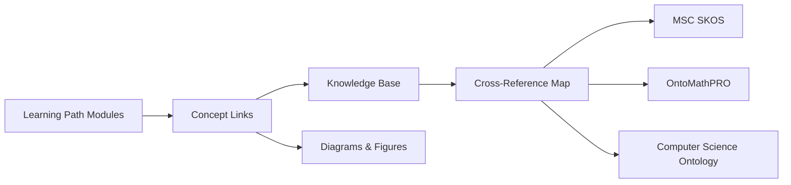

---

title: Learning Path Navigation Framework Implementation

type: framework

status: stable

created: 2024-03-15

modified: 2024-03-15

version: 3.0.0

processing_priority: 1

authors:

  - name: Cognitive Systems Team

    role: Research & Development

---

# Learning Path Navigation Framework Implementation

## Educational Curriculum Design Principles

### Core Philosophy: Education-First Approach

All learning paths must prioritize **educational value** over technical implementation details. Each path should guide learners through conceptual understanding, practical application, and skill development using Active Inference principles.

### Curriculum Structure Standards

#### 1. Educational Content Distribution

```yaml

content_distribution:

  theoretical_foundation: 40%

    - conceptual_understanding

    - mathematical_principles

    - domain_knowledge

    - interdisciplinary_connections

  practical_application: 35%

    - guided_exercises

    - case_studies

    - project_work

    - real_world_examples

  assessment_reflection: 15%

    - knowledge_checkpoints

    - skill_demonstrations

    - portfolio_development

    - peer_review

  implementation_reference: 10%

    - minimal_code_examples

    - tool_introductions

    - technical_specifications

    - resource_links

```

#### 2. Learning Progression Framework

```yaml

learning_progression:

  foundation_stage:

    focus: "Conceptual Understanding"

    activities:

      - concept_mapping

      - guided_reading

      - discussion_forums

      - reflection_exercises

    duration: "30% of path"

  application_stage:

    focus: "Practical Skill Development"

    activities:

      - case_study_analysis

      - guided_projects

      - peer_collaboration

      - mentor_sessions

    duration: "50% of path"

  mastery_stage:

    focus: "Independent Application"

    activities:

      - capstone_projects

      - research_contributions

      - teaching_others

      - innovation_challenges

    duration: "20% of path"

```

### Content Organization Standards

#### Learning Module Structure

Each learning module should follow this educational template:

```markdown

## Module X: [Topic Name]

### Learning Objectives

- Specific, measurable learning outcomes

- Skills to be developed

- Knowledge to be acquired

### Conceptual Foundation

- Core concepts explained in accessible language

- Visual diagrams and mental models

- Real-world analogies and examples

- Connection to Active Inference principles

### Guided Exploration

- Step-by-step learning activities

- Interactive exercises

- Thought experiments

- Discussion prompts

### Practical Application

- Hands-on projects (described conceptually)

- Case studies for analysis

- Problem-solving scenarios

- Collaborative activities

### Knowledge Integration

- Synthesis exercises

- Cross-domain connections

- Reflection questions

- Peer teaching opportunities

### Assessment Methods

- Formative assessments throughout

- Summative evaluation criteria

- Portfolio development guidelines

- Self-reflection frameworks

### Resources and Tools

- Required readings

- Recommended tools (with learning rationale)

- Additional resources for deeper exploration

- Community connections

```

#### Technical Implementation Guidelines

**When to Include Code:**

- As **illustrative examples** only (not primary content)

- To demonstrate **concepts**, not implementation details

- As **starting points** for exploration, not complete solutions

- With **educational annotations** explaining the learning purpose

**Code Example Format:**

```python

# Educational Purpose: Demonstrates concept X in Active Inference

# Learning Focus: Understanding how Y relates to Z

# Next Steps: Learners will explore this concept through...

class ConceptualExample:

    """

    This example illustrates [specific concept].

    Focus on understanding [key principle] rather than implementation.

    """

    def __init__(self):

        # Key concept: [explanation]

        pass

    def demonstrate_concept(self):

        """

        Learning objective: Show how [concept] works

        Educational value: Understanding [principle]

        """

        # Simplified demonstration focusing on concept

        pass

# Reflection Questions:

# 1. How does this relate to Active Inference principles?

# 2. What real-world applications can you envision?

# 3. How would you explain this concept to a peer?

```

### Assessment and Evaluation Framework

#### Competency-Based Assessment

```yaml

assessment_dimensions:

  conceptual_understanding:

    weight: 40%

    methods:

      - concept_mapping

      - explanatory_essays

      - peer_teaching

      - case_analysis

  practical_application:

    weight: 35%

    methods:

      - project_portfolios

      - problem_solving

      - design_challenges

      - collaborative_work

  critical_thinking:

    weight: 15%

    methods:

      - research_critique

      - synthesis_projects

      - innovation_proposals

      - ethical_analysis

  communication_collaboration:

    weight: 10%

    methods:

      - presentation_skills

      - peer_feedback

      - community_contribution

      - mentoring_others

```

#### Learning Analytics Framework

```yaml

learning_analytics:

  engagement_metrics:

    - time_spent_learning

    - module_completion_rates

    - discussion_participation

    - resource_utilization

  comprehension_indicators:

    - assessment_scores

    - concept_application_quality

    - peer_evaluation_feedback

    - self_reflection_depth

  skill_development_tracking:

    - portfolio_progression

    - project_complexity_growth

    - interdisciplinary_connections

    - innovation_demonstrations

  outcome_measurement:

    - career_advancement

    - research_contributions

    - community_impact

    - knowledge_transfer

```

### Cross-Path Integration

#### Knowledge Base Integration

Each learning path should link to relevant knowledge base articles while maintaining educational focus:

```yaml

knowledge_integration:

  concept_links:

    format: "[[knowledge_base/domain/concept|Concept Name]]"

    purpose: "Deepen understanding through curated resources"

    usage: "Reference for further exploration, not replacement for learning"

  cross_path_connections:

    format: "Related learning: [[path_name|Path Title]]"

    purpose: "Show interdisciplinary connections"

    usage: "Suggest complementary learning paths"

  project_integration:

    format: "Cross-path project: [Description]"

    purpose: "Encourage interdisciplinary application"

    usage: "Collaborative learning across domains"

```

#### Interdisciplinary Learning Bridges

```yaml

learning_bridges:

  concept_bridges:

    - mathematical_foundations → domain_applications

    - theoretical_principles → practical_implementations

    - individual_learning → collaborative_projects

    - academic_knowledge → industry_applications

  skill_bridges:

    - analytical_thinking → creative_problem_solving

    - domain_expertise → communication_skills

    - technical_skills → ethical_reasoning

    - local_application → global_perspective

```

### Semantic Linking and Ontology Integration



- KB anchors: `knowledge_base/mathematics/cross_reference_map.md`, `knowledge_base/ontology/computer_science_ontology.md`, `knowledge_base/mathematics/msc_skos.md`, `knowledge_base/mathematics/ontomathpro_ontology.md`

- Bidirectional links required: from modules → KB and KB → modules where appropriate

### Quality Assurance Standards

#### Educational Effectiveness Criteria

```yaml

quality_standards:

  learning_clarity:

    - clear_learning_objectives

    - logical_progression

    - accessible_language

    - visual_aids_support

  engagement_design:

    - interactive_elements

    - varied_activity_types

    - real_world_relevance

    - collaborative_opportunities

  assessment_alignment:

    - objectives_assessment_match

    - multiple_assessment_types

    - formative_feedback_loops

    - growth_tracking_systems

  inclusivity_accessibility:

    - diverse_learning_styles

    - cultural_sensitivity

    - accessibility_compliance

    - multilingual_considerations

```

#### Content Review Process

```yaml

review_process:

  educational_review:

    reviewers: ["education_specialists", "domain_experts"]

    criteria: ["pedagogical_soundness", "content_accuracy"]

    frequency: "quarterly"

  learner_feedback:

    methods: ["surveys", "focus_groups", "analytics_review"]

    frequency: "continuous"

    integration: "iterative_improvement"

  industry_alignment:

    reviewers: ["industry_practitioners", "career_counselors"]

    criteria: ["market_relevance", "skill_alignment"]

    frequency: "biannual"

  peer_review:

    reviewers: ["other_path_creators", "academic_partners"]

    criteria: ["innovation", "best_practices", "integration"]

    frequency: "annual"

```

### Implementation Guidelines for Existing Paths

#### Restructuring Process

1. **Content Audit**: Identify code-heavy sections that need educational restructuring

1. **Learning Objective Alignment**: Ensure all content serves clear educational purposes

1. **Activity Design**: Transform technical examples into learning activities

1. **Assessment Integration**: Add meaningful assessment throughout each module

1. **Resource Curation**: Provide appropriate resources without overwhelming learners

#### Migration Strategy

```yaml

migration_phases:

  phase_1_foundation:

    duration: "2_weeks"

    activities:

      - content_audit

      - learning_objectives_definition

      - basic_restructuring

  phase_2_enhancement:

    duration: "3_weeks"

    activities:

      - activity_design

      - assessment_integration

      - resource_curation

  phase_3_integration:

    duration: "2_weeks"

    activities:

      - cross_path_linking

      - quality_assurance

      - stakeholder_review

  phase_4_launch:

    duration: "1_week"

    activities:

      - final_testing

      - documentation_completion

      - community_announcement

```

### Technology Integration

#### Learning Management Integration

```yaml

lms_integration:

  content_delivery:

    - modular_content_structure

    - progressive_disclosure

    - adaptive_pacing

    - multimedia_support

  learner_tracking:

    - progress_monitoring

    - competency_mapping

    - personalized_recommendations

    - achievement_recognition

  collaboration_tools:

    - discussion_forums

    - peer_review_systems

    - project_collaboration_spaces

    - mentorship_platforms

  assessment_systems:

    - automated_feedback

    - rubric_based_evaluation

    - portfolio_management

    - certification_tracking

```

### Continuous Improvement Framework

#### Feedback Integration

```yaml

improvement_cycle:

  data_collection:

    - learner_performance_analytics

    - engagement_metrics

    - completion_rates

    - satisfaction_surveys

  analysis_process:

    - statistical_analysis

    - qualitative_feedback_review

    - comparative_benchmarking

    - trend_identification

  improvement_planning:

    - priority_identification

    - resource_allocation

    - timeline_development

    - stakeholder_communication

  implementation_monitoring:

    - change_impact_assessment

    - continuous_monitoring

    - adjustment_protocols

    - success_measurement

```

This framework ensures all learning paths maintain their educational integrity while providing practical, applicable knowledge in Active Inference across all domains.

