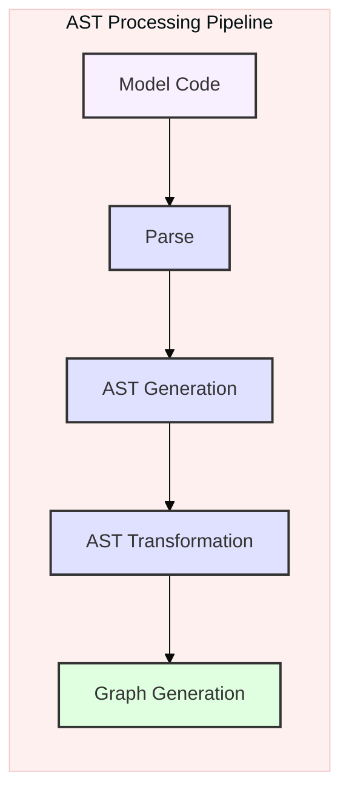
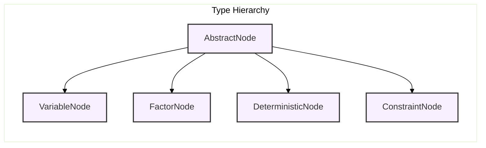
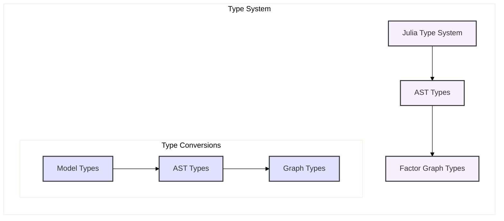
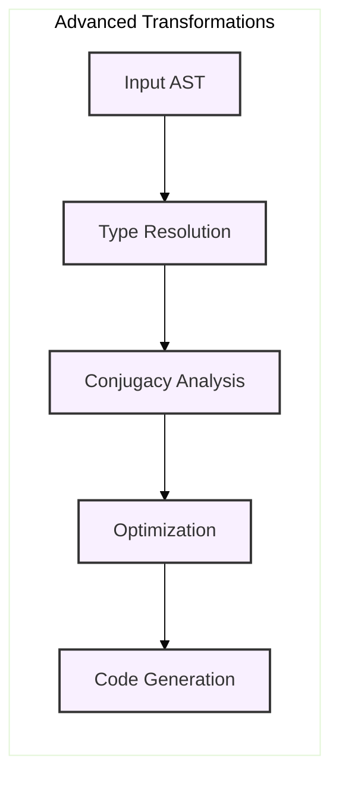
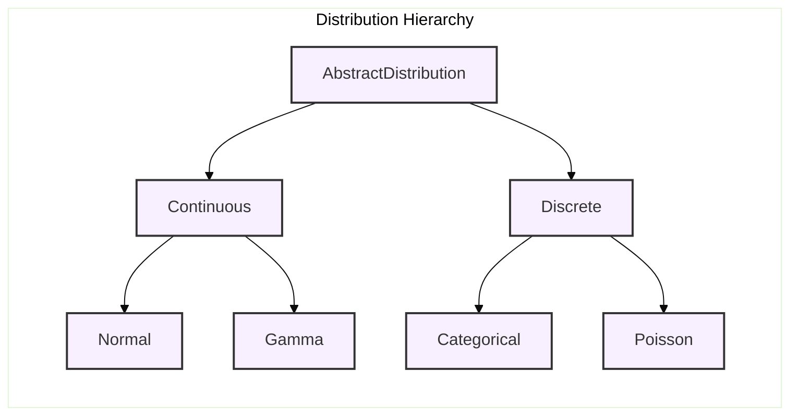
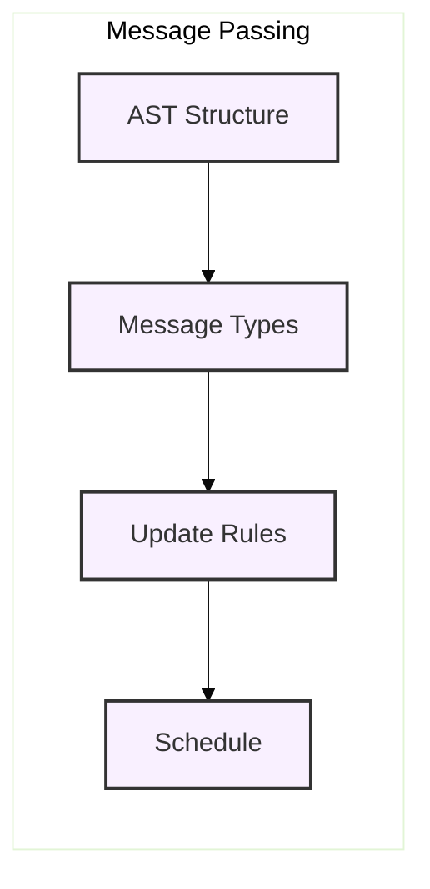

---

title: Abstract Syntax Trees in RxInfer

type: documentation

status: stable

created: 2024-03-20

tags:

  - rxinfer

  - ast

  - model-compilation

  - julia

semantic_relations:

  - type: implements

    links:

      - [[model_specification]]

      - [[compiler_infrastructure]]

      - [[type_system]]

  - type: related

    links:

      - [[factor_graphs]]

      - [[model_macro]]

      - [[graph_construction]]

      - [[probabilistic_inference]]

      - [[code_generation]]

---

# Abstract Syntax Trees in RxInfer

## Overview

Abstract Syntax Trees (ASTs) play a crucial role in [[model_specification|model specification]] within RxInfer. The [[model_macro|@model macro]] transforms Julia code into an AST, which is then processed to generate [[factor_graphs|factor graphs]] for probabilistic inference.



## Mathematical Foundations

### 1. Type Theory

The AST type system is based on [[type_theory|type theory]] principles:



### 2. Category Theory

AST transformations follow [[category_theory|category theory]] principles:

\[

\begin{align*}

F &: \text{AST} \rightarrow \text{FactorGraph} \\

G &: \text{Model} \rightarrow \text{AST} \\

H &= F \circ G : \text{Model} \rightarrow \text{FactorGraph}

\end{align*}

\]

## Extended AST Structure

### 1. Node Types

```julia

# Extended AST node types

abstract type ASTNode end

struct VariableNode <: ASTNode

    name::Symbol

    distribution::Expression

    metadata::Dict{Symbol, Any}

    constraints::Vector{Constraint}

end

struct FactorNode <: ASTNode

    variables::Vector{Symbol}

    factor::Expression

    properties::FactorProperties

    conjugacy::ConjugacyInfo

end

struct DeterministicNode <: ASTNode

    output::Symbol

    expression::Expression

    gradient::Union{Expression, Nothing}

    jacobian::Union{Matrix, Nothing}

end

struct ConstraintNode <: ASTNode

    variables::Vector{Symbol}

    constraint::Constraint

    lagrange_multiplier::Symbol

end

```

### 2. Type System Integration



## Advanced AST Processing

### 1. Semantic Analysis

```julia

struct SemanticAnalyzer

    type_context::Dict{Symbol, Type}

    scope_stack::Vector{Scope}

    conjugacy_table::ConjugacyTable

end

function analyze_semantics(ast::Vector{ASTNode})

    analyzer = SemanticAnalyzer()

    for node in ast

        # Type inference

        infer_types!(analyzer, node)

        # Conjugacy analysis

        check_conjugacy!(analyzer, node)

        # Scope resolution

        resolve_scope!(analyzer, node)

    end

end

```

### 2. Advanced Transformations



### 3. Pattern Matching

Advanced pattern matching for AST transformation:

```julia

struct ASTPattern

    pattern::Expression

    constraints::Vector{Constraint}

    transformation::Function

end

function apply_patterns(ast::ASTNode, patterns::Vector{ASTPattern})

    for pattern in patterns

        if matches(ast, pattern.pattern) && 

           satisfies_constraints(ast, pattern.constraints)

            return pattern.transformation(ast)

        end

    end

    return ast

end

```

## Probabilistic Model Integration

### 1. Distribution Representation



### 2. Conjugacy Analysis

Automatic conjugacy detection and optimization:

```julia

struct ConjugacyAnalyzer

    conjugate_pairs::Dict{Tuple{Type, Type}, ConjugacyInfo}

    message_rules::Dict{Tuple{Type, Type}, MessageRule}

end

function analyze_conjugacy(prior::Distribution, likelihood::Distribution)

    # Check for conjugate relationships

    if is_conjugate(prior, likelihood)

        return derive_posterior(prior, likelihood)

    end

    # Fall back to approximate inference

    return approximate_posterior(prior, likelihood)

end

```

## Advanced Graph Generation

### 1. Message Passing Structure



### 2. Optimization Framework

```julia

struct OptimizationContext

    cost_model::CostModel

    constraints::Vector{Constraint}

    schedule::Schedule

end

function optimize_graph(ast::Vector{ASTNode}, context::OptimizationContext)

    # Phase 1: Structure optimization

    ast = optimize_structure(ast, context)

    # Phase 2: Message passing optimization

    ast = optimize_messages(ast, context)

    # Phase 3: Schedule optimization

    ast = optimize_schedule(ast, context)

    return ast

end

```

## Advanced Features

### 1. Symbolic Computation

Integration with symbolic computation systems:

```julia

struct SymbolicProcessor

    engine::SymbolicEngine

    rules::Vector{RewriteRule}

end

function process_symbolic(node::ASTNode, processor::SymbolicProcessor)

    # Convert to symbolic form

    sym_expr = to_symbolic(node.expression)

    # Apply symbolic transformations

    transformed = apply_rules(sym_expr, processor.rules)

    # Convert back to AST

    return from_symbolic(transformed)

end

```

### 2. Type-Level Programming

Advanced type-level operations:

```julia

@generated function transform_node(node::T) where T <: ASTNode

    # Extract type information

    field_types = fieldtypes(T)

    # Generate specialized transformation code

    quote

        # Type-specific transformations

        transformed_fields = transform_fields(node, $(field_types...))

        # Construct new node

        return reconstruct_node(T, transformed_fields...)

    end

end

```

## Performance Optimization

### 1. Memory Management

```mermaid

mindmap

  root((Memory Management))

    Allocation

      Node Pooling

      Field Reuse

      Buffer Management

    Deallocation

      Reference Counting

      Garbage Collection

      Manual Control

    Caching

      Expression Cache

      Type Cache

      Transform Cache

```

### 2. Parallel Processing

```julia

struct ParallelContext

    workers::Vector{Worker}

    task_queue::Queue

    result_cache::Cache

end

function process_parallel(ast::Vector{ASTNode}, context::ParallelContext)

    # Partition AST

    partitions = partition_ast(ast)

    # Process partitions in parallel

    @sync begin

        for partition in partitions

            @async process_partition(partition, context)

        end

    end

end

```

## Debugging and Analysis

### 1. Advanced Visualization

Enhanced AST visualization:

```julia

function visualize_ast_advanced(ast::Vector{ASTNode})

    # Generate interactive visualization

    viz = InteractiveViz(ast)

    # Add analysis layers

    add_type_layer!(viz)

    add_dependency_layer!(viz)

    add_performance_layer!(viz)

    return viz

end

```

### 2. Static Analysis

```julia

struct StaticAnalyzer

    checkers::Vector{Checker}

    metrics::Vector{Metric}

end

function analyze_static(ast::Vector{ASTNode}, analyzer::StaticAnalyzer)

    # Run static checks

    issues = run_checks(ast, analyzer.checkers)

    # Compute metrics

    metrics = compute_metrics(ast, analyzer.metrics)

    return AnalysisReport(issues, metrics)

end

```

## References

- [[model_specification|Model Specification]]

- [[factor_graphs|Factor Graphs]]

- [[model_macro|Model Macro]]

- [[graph_construction|Graph Construction]]

- [[compiler_infrastructure|Compiler Infrastructure]]

- [[type_theory|Type Theory]]

- [[category_theory|Category Theory]]

- [[symbolic_computation|Symbolic Computation]]

- [[parallel_processing|Parallel Processing]]

- [[static_analysis|Static Analysis]]

