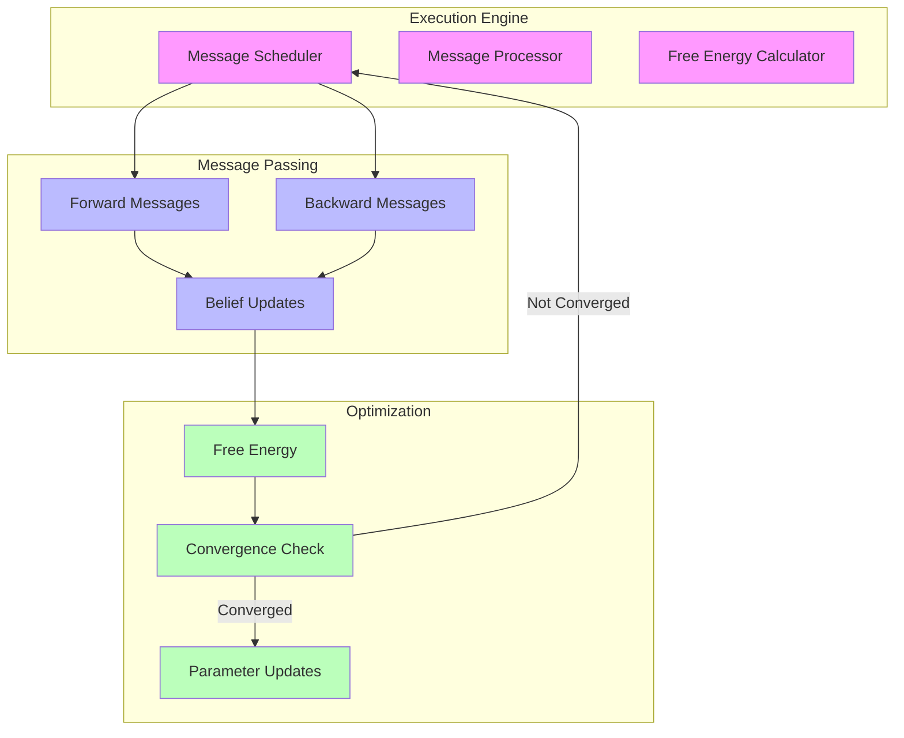
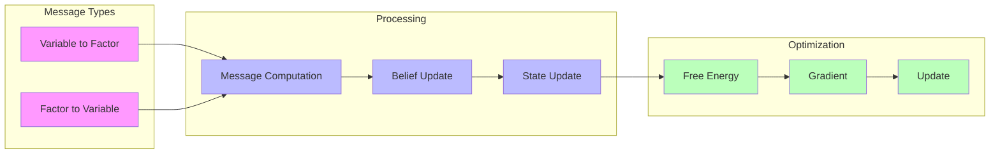
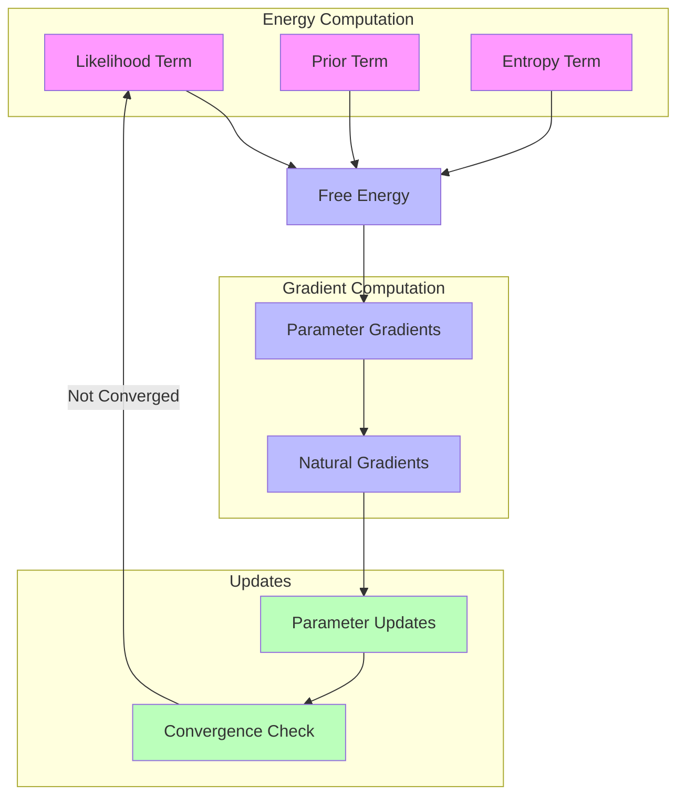

# RxInfer Execution Engine

## Overview

The RxInfer Execution Engine is the core runtime system responsible for performing inference through message passing and free energy minimization. It orchestrates the computation, scheduling, and optimization of messages across factor graphs.



## Core Components

### 1. Engine Architecture

```julia
# Main execution engine
struct ExecutionEngine
    graph::FactorGraph
    scheduler::MessageScheduler
    processor::MessageProcessor
    optimizer::FreeEnergyOptimizer
    memory_manager::MemoryManager
end

# Engine configuration
struct EngineConfig
    max_iterations::Int
    convergence_threshold::Float64
    message_passing_strategy::MessagePassingStrategy
    optimization_method::OptimizationMethod
end
```

### 2. Message Processing

```julia
# Message processor implementation
struct MessageProcessor
    # Message computation rules
    forward_rules::Dict{Symbol, Function}
    backward_rules::Dict{Symbol, Function}
    
    # Message buffers
    message_buffers::MessageBuffers
    
    # Processing state
    current_state::ProcessingState
end

function process_messages!(processor::MessageProcessor, schedule::MessageSchedule)
    for step in schedule
        # Compute and update messages
        forward_messages = compute_forward_messages(processor, step)
        backward_messages = compute_backward_messages(processor, step)
        
        # Update beliefs
        update_beliefs!(processor, forward_messages, backward_messages)
    end
end
```

### Message Flow Architecture



## Free Energy Minimization

### 1. Free Energy Computation

```julia
# Free energy calculator
struct FreeEnergyCalculator
    energy_terms::Vector{EnergyTerm}
    gradient_computer::GradientComputer
end

function compute_free_energy(calculator::FreeEnergyCalculator, state::ModelState)
    # Compute individual terms
    likelihood_term = compute_likelihood_energy(calculator, state)
    prior_term = compute_prior_energy(calculator, state)
    entropy_term = compute_entropy_energy(calculator, state)
    
    # Combine terms
    free_energy = likelihood_term + prior_term - entropy_term
    
    return free_energy
end
```

### 2. Optimization Process

```julia
# Free energy optimizer
struct FreeEnergyOptimizer
    method::OptimizationMethod
    parameters::OptimizationParameters
    convergence_checker::ConvergenceChecker
end

function optimize_free_energy!(optimizer::FreeEnergyOptimizer, engine::ExecutionEngine)
    while !is_converged(optimizer)
        # Compute gradients
        gradients = compute_free_energy_gradients(optimizer, engine)
        
        # Update parameters
        update_parameters!(optimizer, gradients)
        
        # Check convergence
        check_convergence!(optimizer)
    end
end
```

### Optimization Flow



## Message Passing Integration

### 1. Message Scheduling

```julia
# Message scheduler
struct MessageScheduler
    schedule::Vector{MessageStep}
    priorities::Dict{Symbol, Float64}
    dependencies::Dict{Symbol, Vector{Symbol}}
end

function create_schedule(scheduler::MessageScheduler, graph::FactorGraph)
    # Analyze dependencies
    deps = analyze_dependencies(graph)
    
    # Create optimal schedule
    schedule = optimize_schedule(deps, scheduler.priorities)
    
    return schedule
end
```

### 2. Belief Propagation

```julia
# Belief propagation system
struct BeliefPropagation
    message_computer::MessageComputer
    belief_updater::BeliefUpdater
    convergence_checker::ConvergenceChecker
end

function propagate_beliefs!(bp::BeliefPropagation, schedule::MessageSchedule)
    while !is_converged(bp)
        # Execute message passing steps
        for step in schedule
            # Compute messages
            messages = compute_messages(bp.message_computer, step)
            
            # Update beliefs
            update_beliefs!(bp.belief_updater, messages)
            
            # Check local convergence
            check_local_convergence!(bp.convergence_checker, step)
        end
        
        # Check global convergence
        check_global_convergence!(bp.convergence_checker)
    end
end
```

## Advanced Features

### 1. Parallel Execution

```julia
# Parallel message processor
struct ParallelMessageProcessor
    num_threads::Int
    thread_pools::Vector{ThreadPool}
    message_queues::Vector{MessageQueue}
end

function process_messages_parallel!(processor::ParallelMessageProcessor, schedule::MessageSchedule)
    # Partition schedule
    partitioned_schedule = partition_schedule(schedule, processor.num_threads)
    
    # Process in parallel
    @threads for i in 1:processor.num_threads
        process_partition!(processor.thread_pools[i], partitioned_schedule[i])
    end
end
```

### 2. Adaptive Scheduling

```julia
# Adaptive scheduler
struct AdaptiveScheduler
    base_schedule::MessageSchedule
    importance_estimator::ImportanceEstimator
    schedule_optimizer::ScheduleOptimizer
end

function adapt_schedule!(scheduler::AdaptiveScheduler, state::ModelState)
    # Estimate message importance
    importance = estimate_importance(scheduler.importance_estimator, state)
    
    # Optimize schedule
    new_schedule = optimize_schedule(scheduler.schedule_optimizer, importance)
    
    return new_schedule
end
```

## Performance Optimization

### 1. Memory Management

```julia
# Memory manager
struct MemoryManager
    buffer_pool::BufferPool
    allocation_strategy::AllocationStrategy
    garbage_collector::GarbageCollector
end

function manage_memory!(manager::MemoryManager)
    # Allocate buffers
    allocate_message_buffers!(manager.buffer_pool)
    
    # Implement allocation strategy
    optimize_allocations!(manager.allocation_strategy)
    
    # Clean up unused resources
    collect_garbage!(manager.garbage_collector)
end
```

### 2. Computation Optimization

```julia
# Computation optimizer
struct ComputationOptimizer
    vectorization::VectorizationStrategy
    caching::CachingStrategy
    precision::PrecisionStrategy
end

function optimize_computation!(optimizer::ComputationOptimizer)
    # Implement vectorization
    vectorize_operations!(optimizer.vectorization)
    
    # Optimize caching
    optimize_cache!(optimizer.caching)
    
    # Adjust numerical precision
    adjust_precision!(optimizer.precision)
end
```

## Debugging and Monitoring

### 1. Performance Monitoring

```julia
# Performance monitor
struct PerformanceMonitor
    metrics::Dict{Symbol, Metric}
    trackers::Vector{MetricTracker}
    logger::Logger
end

function monitor_performance!(monitor::PerformanceMonitor, engine::ExecutionEngine)
    # Track message passing performance
    track_message_passing!(monitor, engine)
    
    # Monitor free energy convergence
    track_convergence!(monitor, engine)
    
    # Log performance metrics
    log_metrics!(monitor.logger, monitor.metrics)
end
```

### 2. Debugging Tools

```julia
# Debugging utilities
struct DebugTools
    message_inspector::MessageInspector
    state_tracker::StateTracker
    error_detector::ErrorDetector
end

function debug_execution!(tools::DebugTools, engine::ExecutionEngine)
    # Inspect messages
    inspect_messages!(tools.message_inspector, engine)
    
    # Track state changes
    track_state!(tools.state_tracker, engine)
    
    # Detect numerical errors
    detect_errors!(tools.error_detector, engine)
end
```

## References

- [[message_passing|Message Passing]]
- [[variational_inference|Variational Inference]]
- [[factor_graphs|Factor Graphs]]
- [[free_energy|Free Energy Minimization]]
- [[performance_optimization|Performance Optimization]] 