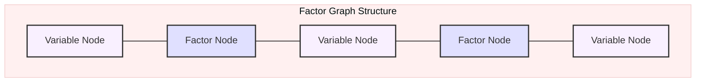
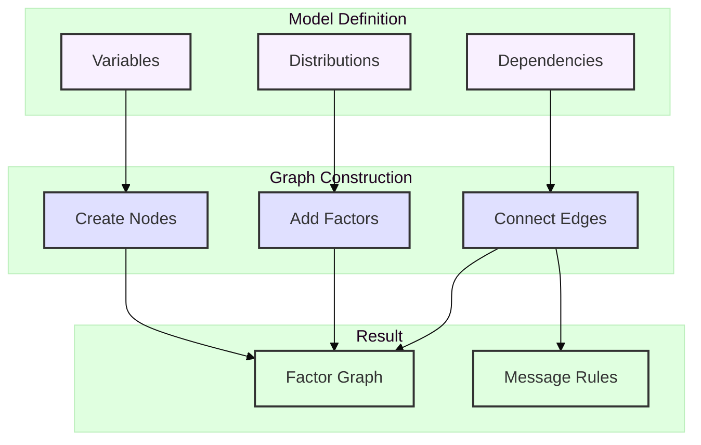
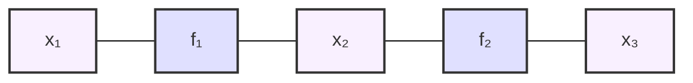
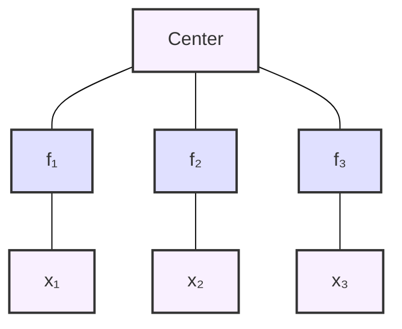
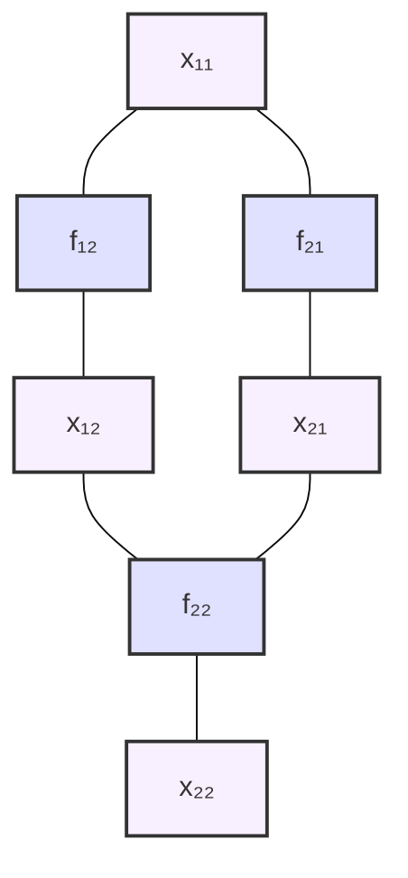

---

title: Factor Graphs in RxInfer

type: documentation

status: stable

created: 2024-03-20

tags:

  - rxinfer

  - factor-graphs

  - probabilistic-models

semantic_relations:

  - type: implements

    links:

      - [[probabilistic_models]]

      - [[graphical_models]]

  - type: related

    links:

      - [[message_passing]]

      - [[model_specification]]

      - [[variational_inference]]

      - [[belief_propagation]]

---

# Factor Graphs in RxInfer

## Overview

Factor graphs in RxInfer provide a powerful graphical representation of [[probabilistic_models|probabilistic models]]. They decompose complex probability distributions into simpler factors, enabling efficient inference through [[message_passing|message passing]] algorithms like [[belief_propagation|Belief Propagation]] and [[variational_inference|Variational Message Passing]].



## Core Components

### 1. Variable Nodes

Variable nodes represent [[random_variables|random variables]] in your model:

```julia

@model function example_model()

    # Variable nodes are created for:

    x ~ Normal(0, 1)     # Latent variable

    y ~ Normal(x, 1)     # Observable variable

end

```

### 2. Factor Nodes

Factor nodes represent [[probabilistic_relationships|probabilistic relationships]] or constraints:

```mermaid

%%{init: {"theme": "base", "themeVariables": { "primaryColor": "#f9f0ff", "secondaryColor": "#e0e0ff"}}}%%

graph LR

    subgraph "Factor Types"

        direction TB

        F1[Prior Factors]

        F2[Likelihood Factors]

        F3[Constraint Factors]

        classDef factorType fill:#f9f0ff,stroke:#333,stroke-width:2px;

        class F1,F2,F3 factorType;

    end

    subgraph "Examples"

        direction TB

        E1[Normal(0,1)]

        E2["y|x ~ Normal(x,1)"]

        E3["x > 0"]

        classDef example fill:#e0e0ff,stroke:#333,stroke-width:2px;

        class E1,E2,E3 example;

    end

    F1 --> E1

    F2 --> E2

    F3 --> E3

```

### 3. Message Types

Messages flow between nodes during inference:

```mermaid

%%{init: {"theme": "base", "themeVariables": { "primaryColor": "#f9f0ff", "secondaryColor": "#e0e0ff", "tertiaryColor": "#e0ffe0"}}}%%

graph LR

    subgraph "Message Flow"

        direction LR

        V1[x] -->|"μ_forward"| F1[p(x)]

        F1 -->|"μ_backward"| V1

        F1 -->|"μ_forward"| V2[y]

        V2 -->|"μ_backward"| F1

        classDef varNode fill:#f9f0ff,stroke:#333,stroke-width:2px;

        classDef factorNode fill:#e0e0ff,stroke:#333,stroke-width:2px;

        classDef messageFlow fill:#e0ffe0,stroke:#333,stroke-width:2px;

        class V1,V2 varNode;

        class F1 factorNode;

    end

```

## Graph Construction

### 1. Automatic Construction

RxInfer automatically constructs factor graphs from [[model_specification|model definitions]]:

```julia

@model function linear_model(x, y)

    # Prior on parameters

    α ~ Normal(0, 10)    # Creates variable node α

    β ~ Normal(0, 10)    # Creates variable node β

    # Likelihood factor

    y .~ Normal(α .+ β .* x, 1)  # Creates factor connecting α, β, and y

end

```

### 2. Graph Construction Process



## Graph Patterns

### 1. Chain Structure



```julia

@model function chain_model()

    x₁ ~ Normal(0, 1)

    x₂ ~ Normal(x₁, 1)

    x₃ ~ Normal(x₂, 1)

end

```

### 2. Star Structure



```julia

@model function star_model()

    center ~ Normal(0, 1)

    x₁ ~ Normal(center, 1)

    x₂ ~ Normal(center, 1)

    x₃ ~ Normal(center, 1)

end

```

### 3. Grid Structure



## Advanced Topics

### 1. Graph Optimization

Techniques for efficient graph structure:

- [[node_elimination|Node elimination ordering]]

- [[factor_grouping|Factor grouping]]

- [[edge_reduction|Edge reduction]]

- [[message_scheduling|Message scheduling]]

### 2. Custom Factor Types

Creating [[custom_factors|custom factors]]:

```julia

struct CustomFactor <: AbstractFactor

    variables::Vector{Variable}

    parameters::Vector{Float64}

end

# Define message computation rules

function compute_message(f::CustomFactor, msg_in)

    # Custom message computation logic

end

```

### 3. Graph Visualization

Visualizing factor graphs with [[graphviz|GraphViz]]:

```julia

using GraphViz

# Visualize factor graph

function visualize_graph(model)

    graph = to_graphviz(model)

    draw(PNG("factor_graph.png"), graph)

end

```

## Best Practices

### 1. Graph Design

- Keep graph structure [[sparse_graphs|sparse]] when possible

- Group related factors for efficiency

- Consider [[message_passing_efficiency|message passing efficiency]]

### 2. Performance Optimization

```mermaid

mindmap

  root((Optimization))

    Graph Structure

      Sparsity

      Node Ordering

      Factor Grouping

    Computation

      Message Scheduling

      Parallel Updates

      Caching

    Memory

      Variable Elimination

      Message Storage

      Graph Pruning

```

### 3. Debugging

- [[graph_visualization|Visualize graph structure]]

- [[factor_connections|Check factor connections]]

- [[message_convergence|Monitor message convergence]]

- Use [[logging|logging]] for debugging

## References

- [[graphical_models|Graphical Models]]

- [[message_passing|Message Passing]]

- [[variational_inference|Variational Inference]]

- [[model_specification|Model Specification]]

- [[belief_propagation|Belief Propagation]]

