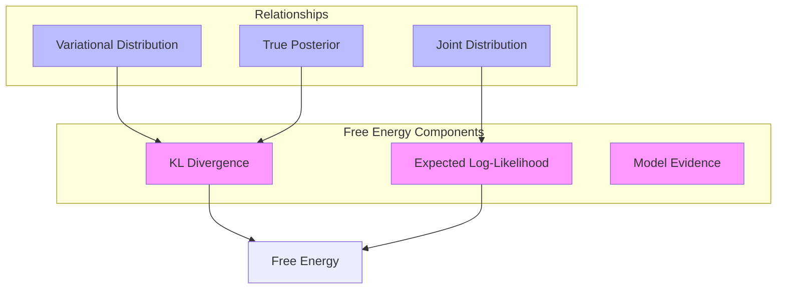
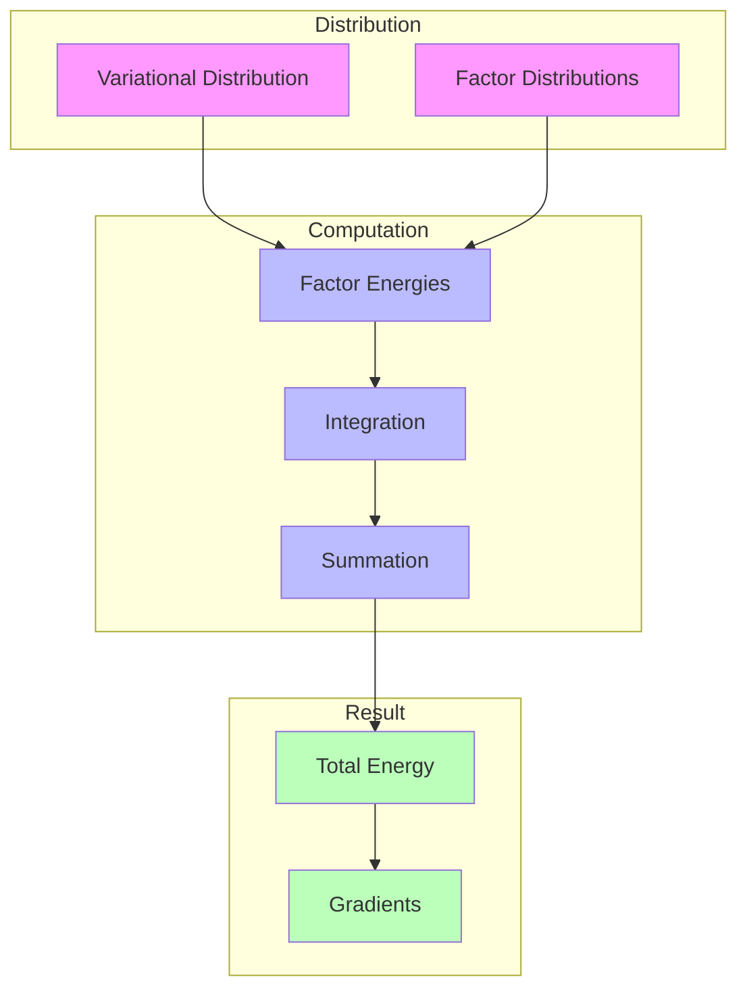
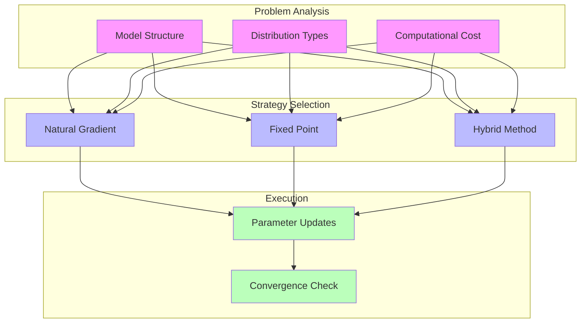

---

title: Free Energy in RxInfer

type: documentation

status: stable

created: 2024-03-20

tags:

  - rxinfer

  - free-energy

  - variational-inference

semantic_relations:

  - type: implements

    links:

      - [[variational_inference]]

      - [[optimization_theory]]

  - type: related

    links:

      - [[message_passing]]

      - [[factor_graphs]]

---

# Free Energy in RxInfer

## Theoretical Foundation

### 1. Variational Free Energy

The variational free energy \(F[q]\) is a fundamental quantity in RxInfer that measures the quality of approximate inference:

\[

F[q] = \mathbb{E}_{q(x)}[\log q(x) - \log p(x,y)]

\]

where:

- \(q(x)\) is the variational distribution

- \(p(x,y)\) is the joint distribution of latent variables and observations

- \(\mathbb{E}_{q(x)}[\cdot]\) denotes expectation with respect to \(q(x)\)



### 2. Decomposition

The free energy can be decomposed into:

1. **Energy Term**:

\[

U[q] = -\mathbb{E}_{q(x)}[\log p(x,y)]

\]

1. **Entropy Term**:

\[

H[q] = -\mathbb{E}_{q(x)}[\log q(x)]

\]

```julia

# Free energy components

struct FreeEnergyComponents

    energy::EnergyTerm

    entropy::EntropyTerm

    cross_entropy::CrossEntropyTerm

end

function compute_components(fe::FreeEnergyComponents, q::VariationalDistribution)

    # Compute energy term

    energy = compute_energy(fe.energy, q)

    # Compute entropy

    entropy = compute_entropy(fe.entropy, q)

    # Compute cross-entropy if needed

    cross_entropy = compute_cross_entropy(fe.cross_entropy, q)

    return energy, entropy, cross_entropy

end

```

## Implementation Details

### 1. Free Energy Calculator

```julia

# Core free energy calculator

struct FreeEnergyCalculator

    # Component calculators

    energy_calculator::EnergyCalculator

    entropy_calculator::EntropyCalculator

    # Computation settings

    precision::Float64

    use_natural_gradients::Bool

    # Caching system

    computation_cache::ComputationCache

end

function calculate_free_energy(calc::FreeEnergyCalculator, model_state::ModelState)

    # Get current variational distribution

    q = get_variational_distribution(model_state)

    # Calculate components

    energy = calculate_energy(calc.energy_calculator, q)

    entropy = calculate_entropy(calc.entropy_calculator, q)

    # Combine with caching

    free_energy = combine_components(

        energy, 

        entropy,

        calc.computation_cache

    )

    return free_energy

end

```

### 2. Energy Term Computation

```julia

# Energy calculator implementation

struct EnergyCalculator

    # Factor-specific energy computers

    factor_computers::Dict{Symbol, FactorEnergyComputer}

    # Integration methods

    integrator::NumericalIntegrator

    # Computation settings

    quadrature_points::Int

    tolerance::Float64

end

function calculate_energy(calc::EnergyCalculator, q::VariationalDistribution)

    total_energy = 0.0

    # Compute for each factor

    for (factor_type, computer) in calc.factor_computers

        # Get factor-specific energy

        factor_energy = compute_factor_energy(

            computer,

            q,

            calc.integrator,

            calc.quadrature_points

        )

        total_energy += factor_energy

    end

    return total_energy

end

```

### Energy Computation Flow



### 3. Entropy Computation

```julia

# Entropy calculator for different distribution types

struct EntropyCalculator

    # Distribution-specific entropy computers

    computers::Dict{DataType, EntropyComputer}

    # Analytical solutions when available

    analytical_solutions::Dict{DataType, Function}

    # Numerical methods for general cases

    numerical_methods::NumericalMethods

end

function calculate_entropy(calc::EntropyCalculator, q::VariationalDistribution)

    # Try analytical solution first

    if haskey(calc.analytical_solutions, typeof(q))

        return calc.analytical_solutions[typeof(q)](q)

    end

    # Fall back to numerical computation

    return compute_numerical_entropy(

        calc.numerical_methods,

        q

    )

end

```

## Optimization Methods

### 1. Natural Gradient Descent

```julia

# Natural gradient optimizer

struct NaturalGradientOptimizer

    # Gradient computation

    metric::FisherInformationMetric

    preconditioner::NaturalGradientPreconditioner

    # Optimization parameters

    learning_rate::Float64

    momentum::Float64

    decay::Float64

end

function optimize_natural_gradient!(opt::NaturalGradientOptimizer, free_energy::FreeEnergy)

    # Compute natural gradient

    gradient = compute_natural_gradient(

        opt.metric,

        free_energy

    )

    # Apply preconditioner

    preconditioned_gradient = apply_preconditioner(

        opt.preconditioner,

        gradient

    )

    # Update parameters

    update_parameters!(

        free_energy,

        preconditioned_gradient,

        opt.learning_rate

    )

end

```

### 2. Fixed-Point Updates

```julia

# Fixed-point iteration system

struct FixedPointOptimizer

    # Update rules

    update_rules::Dict{Symbol, UpdateRule}

    # Convergence settings

    max_iterations::Int

    tolerance::Float64

    # Damping parameters

    damping::Float64

end

function optimize_fixed_point!(opt::FixedPointOptimizer, free_energy::FreeEnergy)

    iteration = 0

    converged = false

    while !converged && iteration < opt.max_iterations

        # Perform fixed-point update

        delta = update_step!(opt, free_energy)

        # Check convergence

        converged = check_convergence(delta, opt.tolerance)

        iteration += 1

    end

    return converged

end

```

### Optimization Strategy Selection



## Practical Considerations

### 1. Numerical Stability

```julia

# Numerical stability handler

struct NumericalStabilityHandler

    # Stability checks

    checks::Vector{StabilityCheck}

    # Mitigation strategies

    mitigations::Dict{Symbol, MitigationStrategy}

    # Logging and monitoring

    logger::StabilityLogger

end

function ensure_stability!(handler::NumericalStabilityHandler, computation::Computation)

    # Perform stability checks

    issues = run_stability_checks(handler.checks, computation)

    # Apply mitigations if needed

    for issue in issues

        apply_mitigation!(

            handler.mitigations[issue.type],

            computation

        )

    end

    # Log stability information

    log_stability_info!(handler.logger, issues)

end

```

### 2. Convergence Monitoring

```julia

# Convergence monitor

struct ConvergenceMonitor

    # Convergence criteria

    criteria::Vector{ConvergenceCriterion}

    # Historical data

    history::ConvergenceHistory

    # Monitoring settings

    check_frequency::Int

    window_size::Int

end

function monitor_convergence!(monitor::ConvergenceMonitor, free_energy::FreeEnergy)

    # Update history

    update_history!(monitor.history, free_energy)

    # Check convergence criteria

    converged = all(criterion -> 

        check_criterion(criterion, monitor.history),

        monitor.criteria

    )

    return converged

end

```

### 3. Performance Optimization

```julia

# Performance optimizer

struct FreeEnergyOptimizer

    # Computation strategies

    strategies::Vector{ComputationStrategy}

    # Resource management

    resource_manager::ResourceManager

    # Performance metrics

    metrics::PerformanceMetrics

end

function optimize_performance!(opt::FreeEnergyOptimizer, computation::FreeEnergyComputation)

    # Select best strategy

    strategy = select_strategy(opt.strategies, computation)

    # Allocate resources

    allocate_resources!(opt.resource_manager, strategy)

    # Apply optimization

    apply_strategy!(strategy, computation)

    # Track performance

    update_metrics!(opt.metrics, computation)

end

```

## Advanced Topics

### 1. Custom Energy Terms

```julia

# Custom energy term definition

struct CustomEnergyTerm <: EnergyTerm

    # Term-specific parameters

    parameters::Dict{Symbol, Any}

    # Computation method

    compute_method::Function

    # Gradient information

    gradient_method::Union{Nothing, Function}

end

function register_custom_term!(calculator::FreeEnergyCalculator, term::CustomEnergyTerm)

    # Validate term

    validate_energy_term(term)

    # Register computation method

    register_computation!(calculator, term)

    # Register gradient if available

    if !isnothing(term.gradient_method)

        register_gradient!(calculator, term)

    end

end

```

### 2. Distribution-Specific Optimizations

```julia

# Distribution-specific optimizer

struct DistributionOptimizer

    # Distribution type

    distribution_type::DataType

    # Specialized computations

    energy_computer::SpecializedEnergyComputer

    entropy_computer::SpecializedEntropyComputer

    # Optimization methods

    update_method::SpecializedUpdateMethod

end

function optimize_distribution!(opt::DistributionOptimizer, dist::VariationalDistribution)

    # Compute specialized updates

    updates = compute_specialized_updates(

        opt.update_method,

        dist

    )

    # Apply updates efficiently

    apply_specialized_updates!(dist, updates)

end

```

## References

- [[variational_inference|Variational Inference]]

- [[optimization_theory|Optimization Theory]]

- [[numerical_methods|Numerical Methods]]

- [[message_passing|Message Passing]]

- [[factor_graphs|Factor Graphs]]

