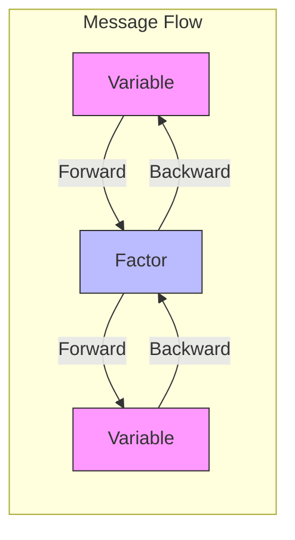
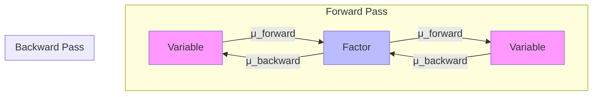
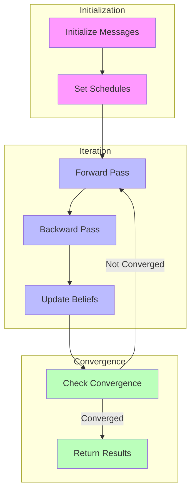
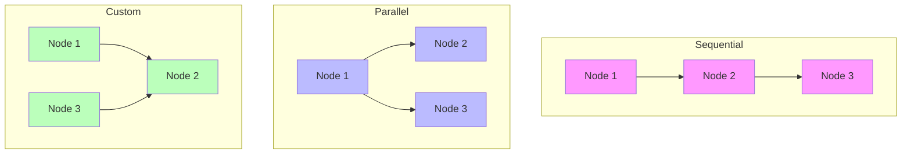

---

title: Message Passing in RxInfer

type: documentation

status: stable

created: 2024-03-20

tags:

  - rxinfer

  - message-passing

  - inference

semantic_relations:

  - type: implements

    links:

      - [[variational_inference]]

      - [[factor_graphs]]

  - type: related

    links:

      - [[inference_algorithms]]

      - [[model_specification]]

---

# Message Passing in RxInfer

## Overview

Message passing is the core inference mechanism in RxInfer, enabling efficient Bayesian inference through local computations on [[factor_graphs|factor graphs]]. This guide explains how messages are computed, passed, and used for inference.



## Core Concepts

### 1. Message Types

Messages represent beliefs about variables:

```julia

# Message from variable to factor

struct VariableToFactorMessage

    distribution::Distribution

    parameters::NamedTuple

end

# Message from factor to variable

struct FactorToVariableMessage

    distribution::Distribution

    parameters::NamedTuple

end

```

### 2. Message Flow



### 3. Message Computation

Basic message computation rules:

```julia

# Variable to factor message

function compute_variable_message(variable, incoming_messages)

    # Product of incoming messages

    return prod(incoming_messages)

end

# Factor to variable message

function compute_factor_message(factor, incoming_messages, target_variable)

    # Integration/Summation over other variables

    return marginalize(factor * prod(incoming_messages), target_variable)

end

```

## Message Passing Algorithms

### 1. Sum-Product Algorithm

For marginal inference:

```julia

@model function sum_product_example()

    x ~ Normal(0, 1)

    y ~ Normal(x, 1)

    # Messages automatically use sum-product rules

    return y

end

```

### Algorithm Flow



### 2. Max-Product Algorithm

For MAP inference:

```julia

# Configure inference for MAP estimation

result = infer(

    model = my_model(),

    data = my_data,

    algorithm = MaxProduct()

)

```

### 3. Structured Mean-Field

For factorized approximations:

```julia

@constraints function structured_meanfield()

    # Define factorization

    q(x, y, z) = q(x)q(y, z)

    # Specify distributions

    q(x) :: NormalMeanPrecision

    q(y, z) :: MultivariateNormal

end

```

## Message Scheduling

### 1. Basic Scheduling

```julia

# Default sequential scheduling

result = infer(

    model = my_model(),

    data = my_data,

    message_passing_iterations = 10

)

```

### 2. Custom Scheduling

```julia

# Define custom message schedule

schedule = MessageSchedule([

    (source = :x, target = :f1),

    (source = :f1, target = :y),

    (source = :y, target = :f2)

])

# Use custom schedule

result = infer(

    model = my_model(),

    data = my_data,

    schedule = schedule

)

```

### Scheduling Patterns



## Advanced Features

### 1. Message Operators

Custom message operations:

```julia

# Define custom message operator

struct CustomMessageOperator <: AbstractMessageOperator

    parameters::Dict{Symbol, Any}

end

# Implement message computation

function compute_message(op::CustomMessageOperator, incoming::Message)

    # Custom message transformation logic

end

```

### 2. Convergence Criteria

```julia

# Custom convergence check

function check_convergence(messages, threshold)

    diff = maximum(abs.(messages.new - messages.old))

    return diff < threshold

end

# Use in inference

result = infer(

    model = my_model(),

    data = my_data,

    convergence_check = check_convergence

)

```

### 3. Message Caching

```julia

# Enable message caching

result = infer(

    model = my_model(),

    data = my_data,

    cache_messages = true

)

```

## Performance Optimization

### 1. Message Computation

```mermaid

mindmap

  root((Optimization))

    Message Structure

      Sparsity

      Parameterization

      Caching

    Computation

      Vectorization

      Parallelization

      Approximation

    Memory

      Message Storage

      Belief Updates

      Cache Management

```

### 2. Parallel Processing

```julia

# Enable parallel message passing

result = infer(

    model = my_model(),

    data = my_data,

    parallel = true,

    num_threads = 4

)

```

## Debugging and Monitoring

### 1. Message Inspection

```julia

# Monitor message values

subscribe!(result.messages[:x]) do msg

    println("Message for x: ", mean(msg))

end

```

### 2. Convergence Monitoring

```julia

# Track convergence

subscribe!(result.free_energy) do fe

    println("Free Energy: ", fe)

end

```

### 3. Visualization

```julia

using Plots

# Plot message evolution

function plot_message_evolution(messages)

    plot(

        1:length(messages),

        map(mean, messages),

        label = "Message Mean"

    )

end

```

## Best Practices

### 1. Message Design

- Use appropriate message parameterizations

- Consider numerical stability

- Implement efficient computations

### 2. Scheduling

- Balance computation and communication

- Consider graph structure

- Use appropriate iteration counts

### 3. Monitoring

- Track message convergence

- Monitor numerical stability

- Debug message flow

## References

- [[variational_inference|Variational Inference]]

- [[factor_graphs|Factor Graphs]]

- [[inference_algorithms|Inference Algorithms]]

- [[model_specification|Model Specification]]

