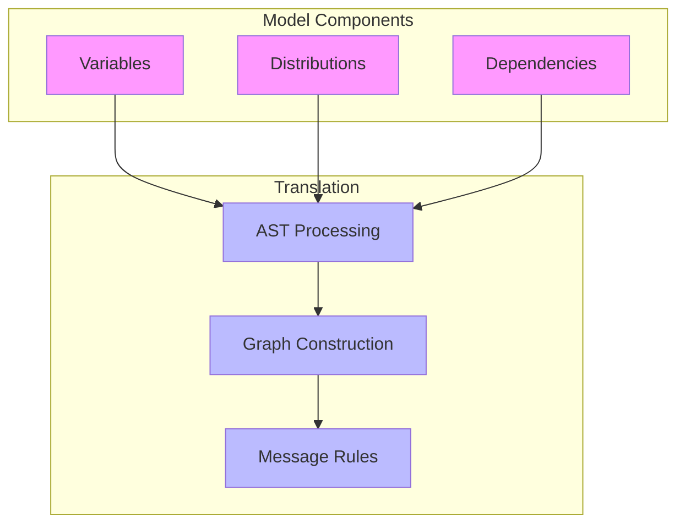
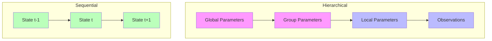
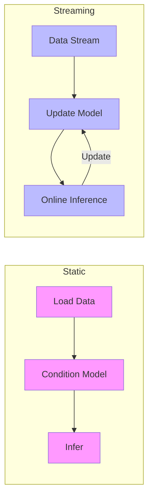

---

title: Model Specification in RxInfer

type: documentation

status: stable

created: 2024-03-20

tags:

  - rxinfer

  - model-specification

  - probabilistic-programming

semantic_relations:

  - type: implements

    links:

      - [[probabilistic_models]]

      - [[domain_specific_languages]]

  - type: related

    links:

      - [[factor_graphs]]

      - [[variational_inference]]

---

# Model Specification in RxInfer

## Overview

Model specification in RxInfer uses a powerful domain-specific language through the `@model` macro, enabling intuitive and flexible definition of probabilistic models. This guide explains how to define models, specify distributions, and handle data.



## Core Concepts

### 1. Model Definition

Basic model structure:

```julia

@model function simple_model()

    # Prior

    θ ~ Beta(1, 1)

    # Likelihood

    x ~ Bernoulli(θ)

    return θ  # Optional return value

end

```

### 2. Variable Types

```mermaid

graph TD

    subgraph Variable Types

        V1[Random Variables]

        V2[Deterministic Variables]

        V3[Data Variables]

    end

    subgraph Examples

        E1[θ ~ Beta(1, 1)]

        E2[y = 2 * x]

        E3[data ~ Normal(μ, σ)]

    end

    V1 --> E1

    V2 --> E2

    V3 --> E3

    style V1 fill:#f9f

    style V2 fill:#f9f

    style V3 fill:#f9f

    style E1 fill:#bbf

    style E2 fill:#bbf

    style E3 fill:#bbf

```

### 3. Distribution Specification

Available distributions and their usage:

```julia

@model function distribution_examples()

    # Continuous distributions

    x₁ ~ Normal(0, 1)              # Normal distribution

    x₂ ~ Gamma(2, 0.5)            # Gamma distribution

    x₃ ~ Beta(2, 2)               # Beta distribution

    # Discrete distributions

    y₁ ~ Bernoulli(0.7)           # Bernoulli distribution

    y₂ ~ Categorical([0.3, 0.7])  # Categorical distribution

    y₃ ~ Poisson(1.0)             # Poisson distribution

    # Multivariate distributions

    z₁ ~ MultivariateNormal(μ, Σ)  # Multivariate normal

    z₂ ~ Dirichlet([1.0, 1.0])    # Dirichlet distribution

end

```

## Model Patterns

### 1. Linear Models

```julia

@model function linear_regression(x, y)

    # Priors

    α ~ Normal(0, 10)    # Intercept

    β ~ Normal(0, 10)    # Slope

    σ ~ Gamma(1, 1)      # Noise

    # Likelihood

    y .~ Normal(α .+ β .* x, σ)

end

```

### 2. Hierarchical Models

```julia

@model function hierarchical_model(y)

    # Hyperpriors

    μ_global ~ Normal(0, 10)

    σ_global ~ Gamma(1, 1)

    # Group-level parameters

    μ_group ~ Normal(μ_global, σ_global)

    σ_group ~ Gamma(1, 1)

    # Individual observations

    y .~ Normal(μ_group, σ_group)

end

```

### Model Structure Patterns



## Advanced Features

### 1. Model Composition

Combining models:

```julia

# Submodel definition

@model function submodel(x)

    y ~ Normal(x, 1)

    return y

end

# Main model using submodel

@model function composite_model()

    x ~ Normal(0, 1)

    y = submodel(x)  # Model composition

    z ~ Normal(y, 1)

end

```

### 2. Conditional Logic

Using control flow:

```julia

@model function conditional_model(x, flag)

    if flag

        y ~ Normal(x, 1)

    else

        y ~ Gamma(x, 1)

    end

    return y

end

```

### 3. Broadcasting

Vectorized operations:

```julia

@model function vectorized_model(X)

    # Parameters

    w ~ MvNormal(zeros(10), I)

    # Vectorized likelihood

    y .~ Normal.(X * w, 1.0)

end

```

## Data Handling

### 1. Static Data

```julia

# Define model with data parameters

@model function static_model(x, y)

    θ ~ Normal(0, 1)

    y .~ Normal(θ .* x, 1)

end

# Condition on data

model = static_model() | (

    x = randn(100),

    y = randn(100)

)

```

### 2. Streaming Data

```julia

@model function streaming_model()

    # State variable

    x ~ Normal(0, 1)

    # Streaming observations

    y ~ Normal(x, 1)

end

# Setup streaming

stream = Subject(Float64)

model = streaming_model() | (y = stream,)

```

### Data Flow Patterns



## Best Practices

### 1. Model Organization

```julia

# Separate model components

@model function likelihood(x, θ)

    x ~ Normal(θ, 1)

    return x

end

@model function prior()

    θ ~ Normal(0, 1)

    return θ

end

@model function full_model(x)

    θ = prior()

    x = likelihood(x, θ)

end

```

### 2. Documentation

```julia

"""

    gaussian_mixture(y, K)

A Gaussian mixture model with K components.

# Arguments

- `y`: Observations

- `K`: Number of components

# Returns

- Component assignments and parameters

"""

@model function gaussian_mixture(y, K)

    # Model implementation

end

```

### 3. Testing

```julia

using Test

@testset "Model Tests" begin

    # Test model with synthetic data

    x = randn(100)

    model = my_model() | (x = x,)

    result = infer(model)

    # Check results

    @test mean(result.posteriors[:θ]) ≈ true_value atol=0.1

end

```

## Debugging and Development

### 1. Model Inspection

```julia

# Print model structure

function inspect_model(model)

    println("Variables:")

    for var in get_variables(model)

        println("  - $var")

    end

    println("\nFactors:")

    for factor in get_factors(model)

        println("  - $factor")

    end

end

```

### 2. Validation

```julia

# Validate model inputs

function validate_model_inputs(x, y)

    @assert size(x, 1) == length(y) "Input dimensions mismatch"

    @assert all(!isnan, y) "Contains missing values"

end

# Use in model

@model function validated_model(x, y)

    validate_model_inputs(x, y)

    # Model implementation

end

```

### 3. Performance Profiling

```julia

using Profile

# Profile model execution

@profile begin

    result = infer(model)

end

# View results

Profile.print()

```

## References

- [[probabilistic_models|Probabilistic Models]]

- [[factor_graphs|Factor Graphs]]

- [[variational_inference|Variational Inference]]

- [[domain_specific_languages|Domain-Specific Languages]]

- [[model_patterns|Model Patterns]]

