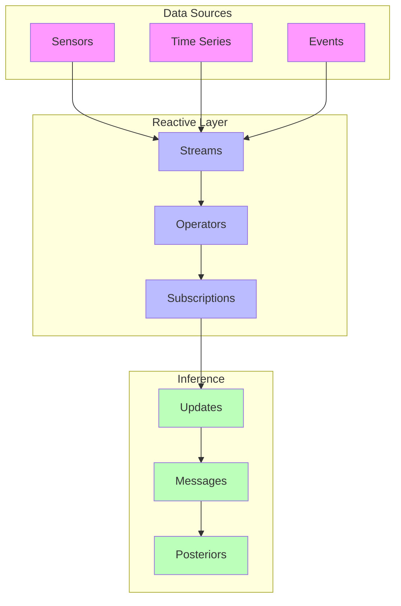
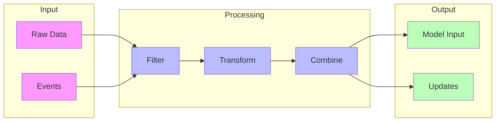
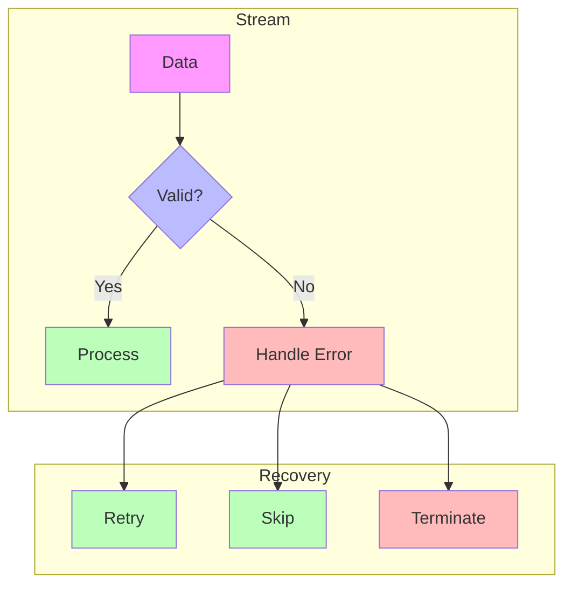
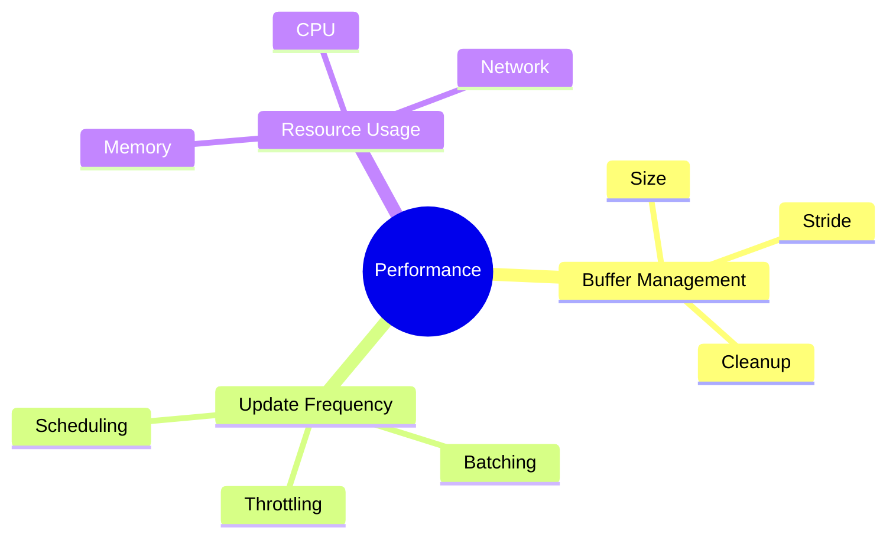

# Reactive Programming in RxInfer

## Overview

[[reactive_programming|Reactive Programming]] in RxInfer enables dynamic, streaming-based probabilistic inference through the integration with [[rocket_jl|Rocket.jl]]. This paradigm allows models to automatically update as new data arrives.



## Core Concepts

### 1. Streams

Data streams are the fundamental building blocks:

```julia
using RxInfer, Rocket

# Create a basic stream
stream = Subject(Float64)

# Create a labeled stream for RxInfer
observations = labeled(Val((:y,)), stream)
```

### 2. Operators

Transform and combine streams:

```julia
# Filter and map operations
filtered = observations |>
    filter(x -> !isnan(x)) |>
    map(x -> (y = float(x),))

# Windowing operations
windowed = observations |>
    buffer(size = 10, stride = 5) |>
    map(window -> (ys = collect(window),))
```

### Stream Processing Patterns



## Integration with Models

### 1. Reactive Models

Create models that respond to streaming data:

```julia
@model function reactive_model(y)
    # State variables
    x ~ Normal(0, 1)
    
    # Streaming observations
    y ~ Normal(x, 1)
end

# Auto-updates for online learning
updates = @autoupdates begin
    x_mean, x_prec = params(q(x))
end
```

### 2. Stream Handling

```julia
# Run streaming inference
result = infer(
    model = reactive_model(),
    datastream = observations,
    autoupdates = updates
)

# Subscribe to posterior updates
subscribe!(result.posteriors[:x]) do posterior
    println("Updated state: ", mean(posterior))
end
```

## Advanced Features

### 1. Backpressure Management

Handle fast data streams:

```julia
# Add rate limiting
controlled_stream = observations |>
    throttle(0.1) |>  # Limit to 10 updates per second
    buffer(size = 100, stride = 50)
```

### 2. Error Handling

Robust stream processing:

```julia
subscription = subscribe!(stream,
    # OnNext handler
    data -> try_update(model, data),
    # OnError handler
    err -> handle_error(err),
    # OnCompleted handler
    () -> cleanup_resources()
)
```

### Error Handling Flow



## Best Practices

### 1. Resource Management

```julia
# Proper cleanup
function setup_stream()
    stream = Subject(Float64)
    subscription = subscribe!(stream, handler)
    return stream, subscription
end

function cleanup(subscription)
    unsubscribe!(subscription)
end
```

### 2. Performance Optimization

- Buffer sizes for memory efficiency
- Appropriate update frequencies
- Resource cleanup

### Performance Considerations



## Common Patterns

### 1. Event-Based Updates

```julia
# Create event stream
events = Subject(Symbol)

# Handle different event types
processed = events |>
    filter(evt -> evt in [:update, :reset]) |>
    map(evt -> handle_event(evt))
```

### 2. Time-Based Processing

```julia
# Time-windowed processing
windowed_data = observations |>
    buffer_time(1.0) |>  # 1-second windows
    filter(window -> !isempty(window)) |>
    map(process_window)
```

### 3. State Management

```julia
# Stateful stream processing
function create_stateful_stream()
    state = Ref(initial_state())
    return stream |>
        map(data -> update_state!(state, data)) |>
        filter(valid_state)
end
```

## Debugging and Testing

### 1. Stream Debugging

```julia
# Add debug points
debugged_stream = stream |>
    tap(x -> println("Raw: ", x)) |>
    map(process_data) |>
    tap(x -> println("Processed: ", x))
```

### 2. Testing Streams

```julia
# Test stream processing
function test_stream()
    test_data = [1.0, 2.0, 3.0]
    results = []
    
    stream = from(test_data) |>
        your_processing_pipeline() |>
        subscribe!(x -> push!(results, x))
        
    @test results == expected_results
end
```

## References

- [[rocket_jl|Rocket.jl Documentation]]
- [[reactive_programming_concepts|Reactive Programming Concepts]]
- [[streaming_inference|Streaming Inference Guide]]
- [[message_passing|Message Passing in RxInfer]] 