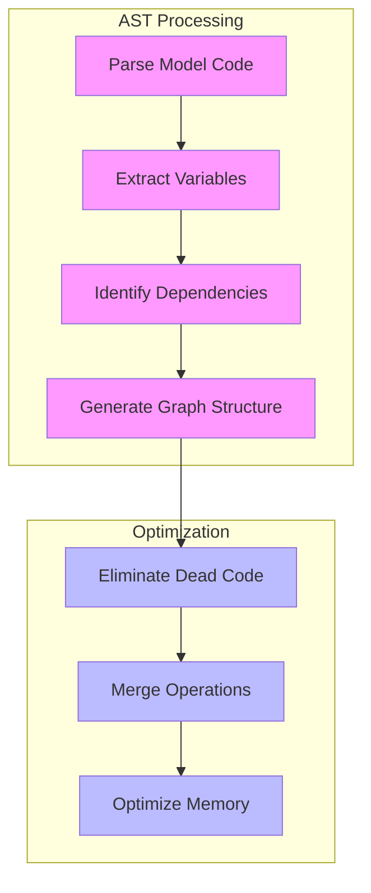
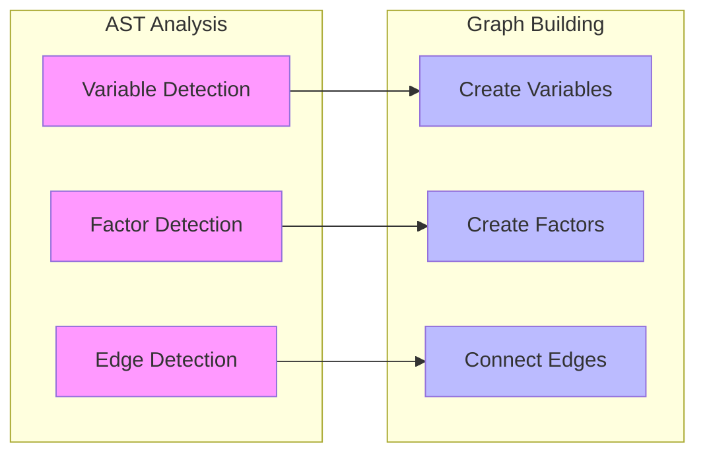
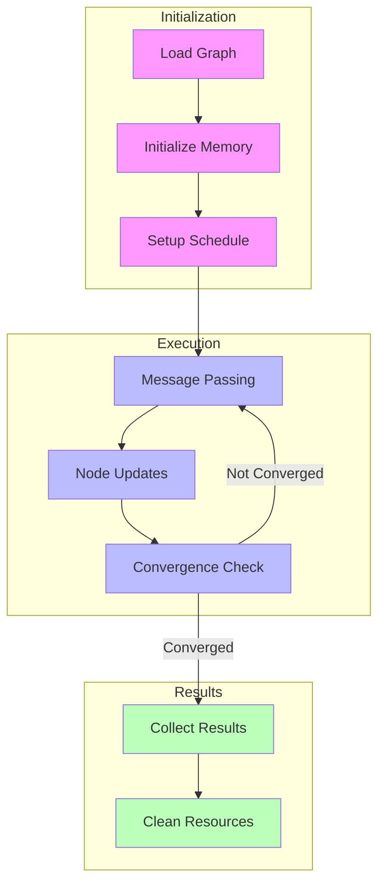

---

title: The RxInfer Technical Stack

type: documentation

status: stable

created: 2024-03-20

tags:

  - rxinfer

  - architecture

  - implementation

semantic_relations:

  - type: implements

    links:

      - [[model_specification]]

      - [[runtime_system]]

  - type: related

    links:

      - [[compiler_pipeline]]

      - [[execution_engine]]

---

# The RxInfer Technical Stack

## Architecture Overview

The RxInfer stack consists of multiple layers that transform a high-level model specification into efficient runtime inference:

```mermaid

graph TD

    subgraph Model Layer

        M1[Model Specification]

        M2[@model Macro]

        M3[AST Transformation]

    end

    subgraph Compilation Layer

        C1[Factor Graph Generation]

        C2[Message Rules Compilation]

        C3[Optimization Passes]

    end

    subgraph Runtime Layer

        R1[Execution Engine]

        R2[Message Passing]

        R3[Memory Management]

    end

    M1 --> M2 --> M3

    M3 --> C1 --> C2 --> C3

    C3 --> R1 --> R2 --> R3

    style M1 fill:#f9f

    style M2 fill:#f9f

    style M3 fill:#f9f

    style C1 fill:#bbf

    style C2 fill:#bbf

    style C3 fill:#bbf

    style R1 fill:#bfb

    style R2 fill:#bfb

    style R3 fill:#bfb

```

## Model Specification Layer

### 1. @model Macro Processing

The transformation of model code into executable inference:

```julia

# Original model code

@model function linear_regression(x, y)

    α ~ Normal(0, 1)

    β ~ Normal(0, 1)

    y .~ Normal(α .+ β .* x, 1)

end

# Macro expansion (simplified)

function linear_regression_expanded(x, y)

    # Variable node creation

    α_node = create_variable_node(:α, Normal, 0, 1)

    β_node = create_variable_node(:β, Normal, 0, 1)

    # Factor node creation

    likelihood = create_factor_node(:likelihood, Normal)

    # Edge connections

    connect!(α_node, likelihood)

    connect!(β_node, likelihood)

end

```

### 2. AST Transformation



### 3. Distribution Mapping

Translation of statistical distributions to computational nodes:

```julia

# Distribution specification

struct NormalNode <: DistributionNode

    mean::Union{Float64, Node}

    precision::Union{Float64, Node}

end

# Distribution to factor mapping

function create_distribution_factor(dist::Normal, params...)

    return NormalFactor(

        mean = params[1],

        precision = params[2]

    )

end

```

## Compilation Layer

### 1. Factor Graph Generation

Converting model structure to factor graph:

```julia

# Factor graph construction

function build_factor_graph(model_ast)

    graph = FactorGraph()

    # Create variable nodes

    for var in extract_variables(model_ast)

        add_variable_node!(graph, var)

    end

    # Create factor nodes and edges

    for factor in extract_factors(model_ast)

        add_factor_node!(graph, factor)

        connect_nodes!(graph, factor)

    end

    return graph

end

```

### Graph Construction Process



### 2. Message Rules Compilation

Generation of message computation rules:

```julia

# Message rule compilation

function compile_message_rules(factor::NormalFactor)

    # Forward message rule

    forward_rule = quote

        μ_forward = compute_forward_message(

            factor.mean,

            factor.precision,

            incoming_messages

        )

    end

    # Backward message rule

    backward_rule = quote

        μ_backward = compute_backward_message(

            factor.mean,

            factor.precision,

            incoming_messages

        )

    end

    return MessageRules(forward_rule, backward_rule)

end

```

### 3. Optimization Passes

```julia

# Optimization passes

function optimize_graph!(graph)

    # Eliminate redundant nodes

    eliminate_redundant_nodes!(graph)

    # Optimize message passing schedule

    optimize_schedule!(graph)

    # Memory layout optimization

    optimize_memory_layout!(graph)

end

```

## Runtime Layer

### 1. Execution Engine

Core execution system:

```julia

# Execution engine

struct ExecutionEngine

    graph::FactorGraph

    schedule::MessageSchedule

    memory_manager::MemoryManager

end

function run_inference!(engine::ExecutionEngine)

    while !converged(engine)

        # Execute one iteration

        for step in engine.schedule

            execute_message_passing!(engine, step)

        end

        # Update convergence status

        update_convergence!(engine)

    end

end

```

### 2. Message Passing Implementation

```julia

# Message passing execution

function execute_message_passing!(engine, step)

    # Get source and target nodes

    source = get_node(engine.graph, step.source)

    target = get_node(engine.graph, step.target)

    # Compute message

    message = compute_message(

        source,

        target,

        get_incoming_messages(engine, source)

    )

    # Update target node

    update_node!(target, message)

end

```

### Execution Flow



### 3. Memory Management

```julia

# Memory management system

struct MemoryManager

    buffers::Dict{Symbol, Vector{Float64}}

    allocator::MemoryAllocator

end

function allocate_message_buffer!(manager, size)

    # Allocate or reuse buffer

    buffer = get_available_buffer(manager.allocator, size)

    return buffer

end

function release_buffer!(manager, buffer)

    # Return buffer to pool

    return_to_pool!(manager.allocator, buffer)

end

```

## Performance Considerations

### 1. Memory Layout

```mermaid

mindmap

  root((Memory Layout))

    Buffer Management

      Pool Allocation

      Buffer Reuse

      Cache Alignment

    Message Storage

      Contiguous Arrays

      Memory Mapping

      Vectorization

    Resource Management

      Reference Counting

      Garbage Collection

      Memory Pools

```

### 2. Parallelization

```julia

# Parallel message passing

function parallel_message_passing!(engine)

    @threads for step in engine.schedule

        if is_independent(step)

            execute_message_passing!(engine, step)

        end

    end

end

```

### 3. Optimization Strategies

- Graph structure optimization

- Message computation vectorization

- Memory access patterns

- Schedule optimization

## Debugging and Profiling

### 1. Graph Inspection

```julia

function inspect_graph_state(engine)

    for node in get_nodes(engine.graph)

        println("Node: ", node.id)

        println("  Messages: ", get_messages(node))

        println("  State: ", get_state(node))

    end

end

```

### 2. Performance Monitoring

```julia

function monitor_performance(engine)

    # Message passing statistics

    stats = MessagePassingStats()

    # Monitor execution

    @monitor engine.execution_time begin

        run_inference!(engine)

    end

    return stats

end

```

## References

- [[compiler_pipeline|Compiler Pipeline]]

- [[execution_engine|Execution Engine]]

- [[memory_management|Memory Management]]

- [[performance_optimization|Performance Optimization]]

- [[debugging_tools|Debugging Tools]]

