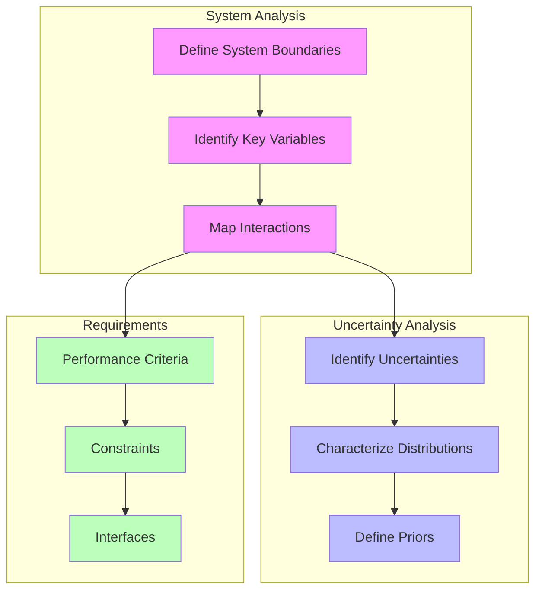
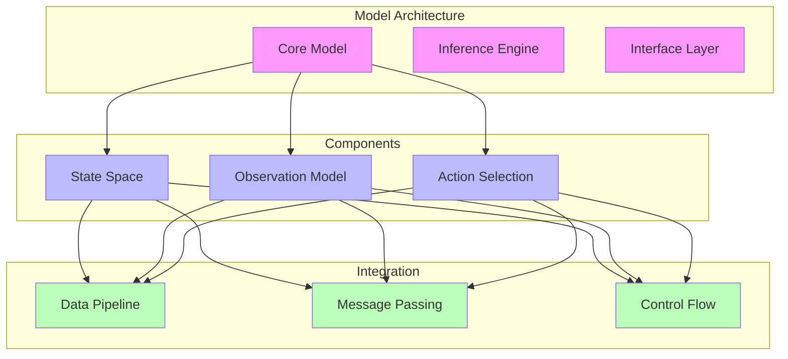

---

title: Systems Engineering Guidebook for RxInfer

type: documentation

status: stable

created: 2024-03-20

tags:

  - rxinfer

  - systems-engineering

  - implementation-guide

semantic_relations:

  - type: implements

    links:

      - [[systems_engineering]]

      - [[model_macro_paradigm]]

  - type: related

    links:

      - [[active_inference]]

      - [[free_energy]]

---

# Systems Engineering Guidebook for RxInfer

## 1. System Assessment Phase

### 1.1 System Characterization



#### System Definition Template

```julia

struct SystemDefinition

    # System boundaries

    state_variables::Vector{Symbol}

    observations::Vector{Symbol}

    actions::Vector{Symbol}

    # Uncertainty characterization

    prior_distributions::Dict{Symbol, Distribution}

    noise_models::Dict{Symbol, Distribution}

    # Requirements

    performance_metrics::Vector{Metric}

    constraints::Vector{Constraint}

end

```

### 1.2 Probabilistic Requirements Analysis

```julia

# Requirements specification

struct SystemRequirements

    # Performance requirements

    accuracy::Float64

    response_time::Float64

    convergence_rate::Float64

    # Resource constraints

    memory_limit::Int

    computation_budget::Float64

    # Interface requirements

    input_format::DataFormat

    output_format::DataFormat

end

function validate_requirements(system::SystemDefinition, reqs::SystemRequirements)

    # Check feasibility

    check_computational_feasibility(system, reqs)

    check_memory_constraints(system, reqs)

    check_interface_compatibility(system, reqs)

end

```

## 2. Model Design Phase

### 2.1 Architecture Design



#### Architecture Template

```julia

# Model architecture specification

struct ModelArchitecture

    # Core components

    state_space::StateSpaceSpec

    observation_model::ObservationSpec

    transition_model::TransitionSpec

    # Inference configuration

    message_passing::MessagePassingConfig

    free_energy::FreeEnergyConfig

    # Interface specification

    data_handlers::DataHandlerSpec

    control_interface::ControlSpec

end

```

### 2.2 Model Implementation

```julia

# Basic model template

@model function system_model(observations)

    # Prior specifications

    θ ~ define_priors(model_architecture)

    # State space model

    x = Vector{Random}(undef, T)

    x[1] ~ initial_state_distribution(θ)

    # Dynamic evolution

    for t in 2:T

        x[t] ~ transition_model(x[t-1], θ)

    end

    # Observation model

    observations .~ observation_model(x, θ)

    return x, θ

end

# Constraints specification

@constraints function system_constraints()

    # Define factorization

    q(x, θ) = q(x)q(θ)

    # Specify distributions

    q(x) :: StateDistribution

    q(θ) :: ParameterDistribution

end

```

## 3. Implementation Phase

### 3.1 Data Pipeline Setup

```julia

# Data pipeline configuration

struct DataPipeline

    # Input processing

    input_processor::DataProcessor

    validator::DataValidator

    transformer::DataTransformer

    # Stream handling

    buffer::DataBuffer

    scheduler::DataScheduler

    # Output processing

    output_formatter::OutputFormatter

    export_handler::ExportHandler

end

function setup_pipeline(config::DataPipeline, model::SystemModel)

    # Configure data flow

    configure_input_processing(config.input_processor, model)

    setup_streaming(config.buffer, config.scheduler)

    configure_output_handling(config.output_formatter, model)

end

```

### 3.2 Inference Engine Configuration

```julia

# Inference configuration

struct InferenceConfig

    # Message passing settings

    message_passing::MessagePassingConfig

    scheduler::SchedulerConfig

    # Free energy settings

    free_energy::FreeEnergyConfig

    optimizer::OptimizerConfig

    # Runtime settings

    parallel::ParallelConfig

    memory::MemoryConfig

end

function configure_inference(config::InferenceConfig, model::SystemModel)

    # Setup inference engine

    setup_message_passing(config.message_passing, model)

    configure_scheduler(config.scheduler, model)

    setup_optimization(config.optimizer, model)

end

```

## 4. Verification and Validation

### 4.1 Testing Framework

```julia

# Test specification

struct TestSpec

    # Unit tests

    model_tests::Vector{Test}

    inference_tests::Vector{Test}

    # Integration tests

    pipeline_tests::Vector{Test}

    performance_tests::Vector{Test}

    # Validation tests

    accuracy_tests::Vector{Test}

    convergence_tests::Vector{Test}

end

function run_test_suite(spec::TestSpec, model::SystemModel)

    # Execute test suite

    run_unit_tests(spec.model_tests, model)

    run_integration_tests(spec.pipeline_tests, model)

    run_validation_tests(spec.accuracy_tests, model)

end

```

### 4.2 Performance Monitoring

```julia

# Performance monitoring system

struct PerformanceMonitor

    # Metrics tracking

    metrics_tracker::MetricsTracker

    performance_logger::PerformanceLogger

    # Analysis tools

    analyzer::PerformanceAnalyzer

    visualizer::PerformanceVisualizer

    # Alerting system

    alert_system::AlertSystem

end

function monitor_performance(monitor::PerformanceMonitor, model::SystemModel)

    # Setup monitoring

    configure_metrics(monitor.metrics_tracker, model)

    setup_logging(monitor.performance_logger)

    configure_alerts(monitor.alert_system)

end

```

## 5. Deployment and Operation

### 5.1 Deployment Configuration

```julia

# Deployment configuration

struct DeploymentConfig

    # Runtime environment

    environment::RuntimeEnvironment

    resources::ResourceAllocation

    # Integration settings

    interfaces::InterfaceConfig

    security::SecurityConfig

    # Monitoring setup

    monitors::MonitoringConfig

    loggers::LoggingConfig

end

function deploy_system(config::DeploymentConfig, model::SystemModel)

    # Configure deployment

    setup_environment(config.environment)

    allocate_resources(config.resources)

    configure_interfaces(config.interfaces)

end

```

### 5.2 Operational Procedures

```julia

# Operational procedures

struct OperationalProcedures

    # Startup procedures

    initialization::InitializationProcedure

    validation::ValidationProcedure

    # Runtime procedures

    monitoring::MonitoringProcedure

    maintenance::MaintenanceProcedure

    # Emergency procedures

    recovery::RecoveryProcedure

    shutdown::ShutdownProcedure

end

function execute_procedures(procedures::OperationalProcedures, model::SystemModel)

    # Execute operational procedures

    initialize_system(procedures.initialization)

    monitor_operation(procedures.monitoring)

    maintain_system(procedures.maintenance)

end

```

## Best Practices and Guidelines

### 1. Model Design Principles

- Start with simple models and incrementally add complexity

- Validate each component before integration

- Document assumptions and limitations

- Use consistent naming conventions

- Implement proper error handling

### 2. Performance Optimization

```mermaid

mindmap

  root((Optimization))

    Model Structure

      Component Factorization

      Dependency Management

      State Space Design

    Computation

      Message Passing

      Free Energy

      Parallel Processing

    Resources

      Memory Management

      Cache Utilization

      Load Balancing

```

### 3. Maintenance Guidelines

- Regular performance monitoring

- Systematic testing procedures

- Documentation updates

- Version control practices

- Backup procedures

## References

- [[systems_engineering|Systems Engineering Principles]]

- [[model_macro_paradigm|@model Macro Documentation]]

- [[active_inference|Active Inference]]

- [[free_energy|Free Energy]]

- [[message_passing|Message Passing]]

