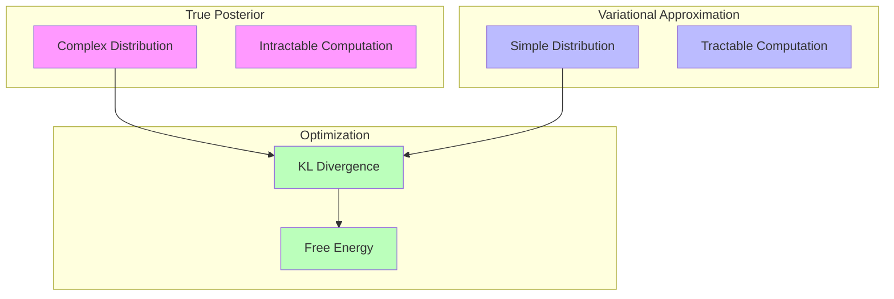
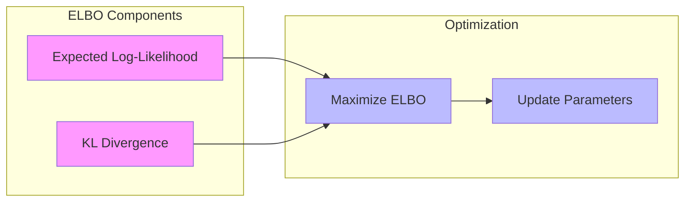
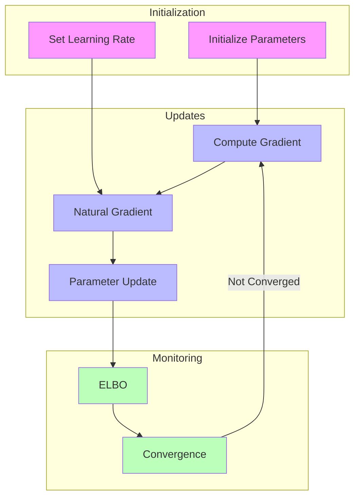

---

title: Variational Inference in RxInfer

type: documentation

status: stable

created: 2024-03-20

tags:

  - rxinfer

  - variational-inference

  - approximate-inference

semantic_relations:

  - type: implements

    links:

      - [[inference_algorithms]]

      - [[probabilistic_inference]]

  - type: related

    links:

      - [[message_passing]]

      - [[factor_graphs]]

      - [[model_specification]]

---

# Variational Inference in RxInfer

## Overview

Variational Inference (VI) in RxInfer provides a powerful framework for approximate Bayesian inference. It transforms the inference problem into an optimization problem by finding the best approximation to the true posterior distribution.



## Core Concepts

### 1. Variational Distribution

The approximating distribution \(q(z)\):

```julia

@model function variational_example()

    # Prior

    z ~ Normal(0, 1)

    # Likelihood

    x ~ Normal(z, 1)

    # Variational approximation specified in constraints

    return z

end

@constraints function model_constraints()

    # Specify variational family

    q(z) :: NormalMeanPrecision

end

```

### 2. Evidence Lower Bound (ELBO)



### 3. Factorization

Different factorization patterns:

```julia

# Mean-field factorization

@constraints function mean_field()

    q(x, y, z) = q(x)q(y)q(z)

end

# Structured factorization

@constraints function structured()

    q(x, y, z) = q(x)q(y, z)

end

```

## Inference Methods

### 1. Mean-Field VI

```julia

@model function mean_field_example()

    # Parameters

    μ ~ Normal(0, 1)

    σ ~ Gamma(1, 1)

    # Observations

    x ~ Normal(μ, σ)

end

@constraints function mean_field_constraints()

    # Mean-field factorization

    q(μ, σ) = q(μ)q(σ)

    # Distribution families

    q(μ) :: NormalMeanPrecision

    q(σ) :: GammaShapeRate

end

```

### 2. Structured VI

```julia

@model function structured_example()

    # State space model

    x = Vector{Random}(undef, T)

    x[1] ~ Normal(0, 1)

    for t in 2:T

        x[t] ~ Normal(x[t-1], 1)

    end

end

@constraints function structured_constraints()

    # Keep temporal structure

    q(x[1:T]) :: MultivariateNormal

end

```

### 3. Amortized VI

```julia

@model function amortized_example()

    # Encoder network

    ϕ = encoder_params()

    # Amortized variational distribution

    z ~ encoder_network(x, ϕ)

    # Decoder network

    θ = decoder_params()

    x ~ decoder_network(z, θ)

end

```

## Optimization Techniques

### 1. Natural Gradient Descent

```julia

# Configure natural gradient optimization

result = infer(

    model = my_model(),

    data = my_data,

    optimizer = NaturalGradient(

        learning_rate = 0.1,

        momentum = 0.9

    )

)

```

### Optimization Flow



### 2. Stochastic VI

```julia

# Stochastic optimization with mini-batches

result = infer(

    model = my_model(),

    data = my_data,

    batch_size = 32,

    optimizer = StochasticVI(

        learning_rate = 0.01

    )

)

```

### 3. Fixed-Point Updates

```julia

# Use fixed-point updates when available

result = infer(

    model = my_model(),

    data = my_data,

    update_method = FixedPoint()

)

```

## Advanced Features

### 1. Custom Variational Families

```julia

# Define custom variational distribution

struct CustomVariational <: VariationalDistribution

    parameters::NamedTuple

end

# Implement required methods

function compute_natural_params(d::CustomVariational)

    # Convert to natural parameters

end

function update_variational_params(d::CustomVariational, nat_params)

    # Update from natural parameters

end

```

### 2. Hybrid Inference

```julia

@model function hybrid_model()

    # VI for some variables

    z ~ Normal(0, 1)

    # Exact inference for others

    x ~ conjugate_prior()

end

@constraints function hybrid_constraints()

    # Mixed inference strategy

    q(z) :: NormalMeanPrecision  # VI

    q(x) :: ExactPosterior       # Exact

end

```

### 3. Convergence Monitoring

```julia

# Track ELBO and parameters

subscribe!(result.elbo) do elbo

    println("ELBO: ", elbo)

end

subscribe!(result.parameters) do params

    println("Parameters: ", params)

end

```

## Best Practices

### 1. Model Design

```mermaid

mindmap

  root((VI Design))

    Model Structure

      Factorization

      Dependencies

      Conjugacy

    Optimization

      Learning Rate

      Batch Size

      Momentum

    Monitoring

      ELBO

      Gradients

      Parameters

```

### 2. Distribution Selection

- Choose appropriate variational families

- Consider trade-offs between flexibility and tractability

- Use conjugate relationships when possible

### 3. Optimization Strategy

- Start with simpler factorizations

- Monitor convergence carefully

- Adjust optimization parameters based on performance

## Debugging and Diagnostics

### 1. ELBO Monitoring

```julia

using Plots

function plot_elbo(result)

    plot(

        result.elbo_history,

        label = "ELBO",

        xlabel = "Iteration",

        ylabel = "ELBO Value"

    )

end

```

### 2. Parameter Tracking

```julia

function monitor_parameters(result)

    for (param, value) in result.variational_params

        println("$param: mean = $(mean(value)), std = $(std(value))")

    end

end

```

### 3. Convergence Checks

```julia

function check_convergence(elbo_history; threshold = 1e-6)

    if length(elbo_history) < 2

        return false

    end

    return abs(elbo_history[end] - elbo_history[end-1]) < threshold

end

```

## References

- [[inference_algorithms|Inference Algorithms]]

- [[message_passing|Message Passing]]

- [[factor_graphs|Factor Graphs]]

- [[model_specification|Model Specification]]

- [[optimization_techniques|Optimization Techniques]]

