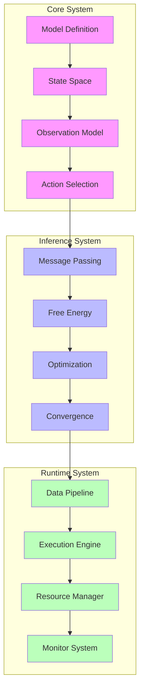
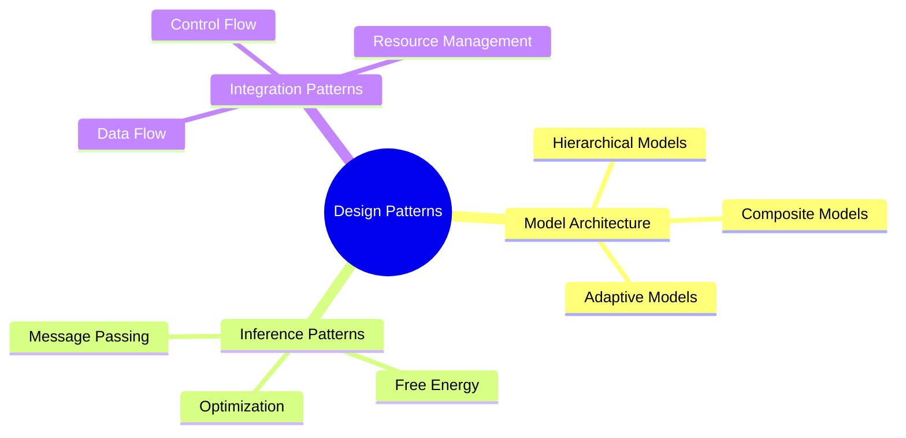

# Advanced Systems Engineering Guidebook for RxInfer

## Quick Start Guide

### Project Setup Checklist

```julia
# 1. Environment Setup
using Pkg
Pkg.add("RxInfer")
Pkg.add("Distributions")
Pkg.add("Rocket")

# 2. Basic Project Structure
project_structure = Dict(
    "src/" => ["models/", "inference/", "pipelines/", "utils/"],
    "test/" => ["unit/", "integration/", "system/"],
    "config/" => ["model_configs/", "inference_configs/", "deployment_configs/"],
    "docs/" => ["design/", "api/", "examples/"]
)

# 3. Initial Configuration
using RxInfer
using Distributions
using Rocket

# 4. Basic Model Template
@model function minimal_model()
    x ~ Normal(0, 1)
    y ~ Normal(x, 1)
    return x
end
```

### Quick Start Example

```julia
# Complete minimal working example
function quick_start_example()
    # 1. Define model
    @model function simple_model(observations)
        # Prior
        μ ~ Normal(0, 1)
        σ ~ Gamma(1, 1)
        
        # Likelihood
        observations .~ Normal(μ, σ)
    end
    
    # 2. Generate synthetic data
    true_μ = 2.0
    true_σ = 1.0
    data = randn(100) .* true_σ .+ true_μ
    
    # 3. Run inference
    result = infer(
        model = simple_model(),
        data = (observations = data,)
    )
    
    # 4. Access results
    posterior_μ = result.posteriors[:μ]
    posterior_σ = result.posteriors[:σ]
    
    return posterior_μ, posterior_σ
end
```

## 1. System Assessment Phase

### 1.1 Comprehensive System Analysis

#### System Boundary Definition

```julia
# System boundary specification
struct SystemBoundary
    # Core system elements
    internal_states::Vector{StateDefinition}
    external_interfaces::Vector{Interface}
    boundary_conditions::Vector{Condition}
    
    # Interaction specifications
    input_channels::Vector{Channel}
    output_channels::Vector{Channel}
    control_points::Vector{ControlPoint}
end

# State definition with metadata
struct StateDefinition
    name::Symbol
    dimension::Int
    domain::Domain
    constraints::Vector{Constraint}
    prior_knowledge::PriorKnowledge
end

# Example usage
function define_system_boundary()
    # Define states
    internal_states = [
        StateDefinition(
            :position,
            2,
            ContinuousDomain(-10.0, 10.0),
            [PositivityConstraint()],
            GaussianPrior(zeros(2), I(2))
        ),
        StateDefinition(
            :velocity,
            2,
            ContinuousDomain(-5.0, 5.0),
            [SpeedLimitConstraint(5.0)],
            GaussianPrior(zeros(2), 0.1*I(2))
        )
    ]
    
    # Define interfaces
    external_interfaces = [
        SensorInterface(:camera, UpdateRate(30.0)),
        ActuatorInterface(:motor, Latency(0.01))
    ]
    
    return SystemBoundary(internal_states, external_interfaces)
end
```

#### Uncertainty Characterization

```julia
# Uncertainty specification system
struct UncertaintyModel
    # Aleatory uncertainties (inherent randomness)
    measurement_noise::NoiseModel
    process_noise::NoiseModel
    environmental_noise::NoiseModel
    
    # Epistemic uncertainties (lack of knowledge)
    model_uncertainty::ModelUncertainty
    parameter_uncertainty::ParameterUncertainty
    
    # Computational uncertainties
    numerical_precision::PrecisionModel
    convergence_uncertainty::ConvergenceModel
end

# Detailed noise model
struct NoiseModel
    distribution::Distribution
    correlation_structure::CovarianceStructure
    temporal_properties::TemporalProperties
    calibration_data::CalibrationData
end

# Example implementation
function create_uncertainty_model()
    # Define measurement noise
    measurement_noise = NoiseModel(
        Normal(0, 0.1),
        DiagonalCovariance(),
        IIDTemporal(),
        calibrate_sensor_noise()
    )
    
    # Define model uncertainty
    model_uncertainty = ModelUncertainty(
        structural_errors = [:nonlinearity, :time_delay],
        confidence_levels = Dict(:parameters => 0.95)
    )
    
    return UncertaintyModel(measurement_noise, model_uncertainty)
end
```

### 1.2 Advanced Requirements Engineering

#### Performance Requirements Specification

```julia
# Comprehensive requirements system
struct SystemRequirements
    # Functional requirements
    accuracy::AccuracyRequirement
    response_time::TimeRequirement
    reliability::ReliabilityRequirement
    
    # Resource requirements
    computational::ComputationalRequirement
    memory::MemoryRequirement
    
    # Quality attributes
    scalability::ScalabilityRequirement
    maintainability::MaintainabilityRequirement
    
    # Domain-specific requirements
    domain_specific::Vector{DomainRequirement}
end

# Detailed accuracy requirement
struct AccuracyRequirement
    metric::Metric
    threshold::Float64
    confidence_level::Float64
    validation_method::ValidationMethod
    failure_handling::FailureHandler
end

# Example usage
function define_system_requirements()
    # Define accuracy requirements
    accuracy = AccuracyRequirement(
        RMSE(),
        0.1,
        0.95,
        CrossValidation(k=5),
        GracefulDegradation()
    )
    
    # Define computational requirements
    computational = ComputationalRequirement(
        max_time_per_step = 0.01,
        max_memory_usage = 1GB,
        parallelization_level = 4
    )
    
    return SystemRequirements(accuracy, computational)
end
```

## 2. Enhanced Model Design Phase

### 2.1 Advanced Architecture Design

#### Component Architecture



#### Advanced Architecture Implementation

```julia
# Comprehensive architecture system
struct SystemArchitecture
    # Core system architecture
    model_architecture::ModelArchitecture
    inference_architecture::InferenceArchitecture
    runtime_architecture::RuntimeArchitecture
    
    # Cross-cutting concerns
    security::SecurityArchitecture
    monitoring::MonitoringArchitecture
    deployment::DeploymentArchitecture
end

# Detailed model architecture
struct ModelArchitecture
    # State space specification
    state_space::StateSpaceSpec
    observation_model::ObservationSpec
    transition_model::TransitionSpec
    action_model::ActionSpec
    
    # Model components
    components::Vector{ModelComponent}
    interfaces::Vector{ComponentInterface}
    connectors::Vector{Connector}
end

# Example implementation
function create_system_architecture()
    # Create model architecture
    model_arch = ModelArchitecture(
        StateSpaceSpec(
            dimensions = [:position, :velocity],
            constraints = [PhysicalConstraints()],
            topology = ContinuousSpace()
        ),
        ObservationSpec(
            sensors = [:camera, :lidar],
            noise_models = Dict(
                :camera => GaussianNoise(0.1),
                :lidar => GaussianNoise(0.05)
            )
        )
    )
    
    # Create inference architecture
    inference_arch = InferenceArchitecture(
        message_passing = MessagePassingSpec(
            schedule = OptimalSchedule(),
            convergence = ELBOConvergence(1e-6)
        ),
        free_energy = FreeEnergySpec(
            components = [:likelihood, :prior, :entropy],
            optimization = NaturalGradient()
        )
    )
    
    return SystemArchitecture(model_arch, inference_arch)
end
```

### 2.2 Advanced Model Implementation

#### Hierarchical Model Template

```julia
# Hierarchical model implementation
@model function hierarchical_system_model(observations)
    # Global parameters
    global_params ~ define_global_parameters()
    
    # Hierarchical structure
    for level in 1:n_levels
        # Level-specific parameters
        θ[level] ~ level_parameters(level, global_params)
        
        # State evolution at this level
        x[level] = Vector{Random}(undef, T)
        x[level][1] ~ initial_state(level, θ[level])
        
        for t in 2:T
            # State transition with cross-level interaction
            x[level][t] ~ transition_model(
                x[level][t-1],
                level > 1 ? x[level-1][t] : nothing,
                θ[level]
            )
        end
        
        # Generate observations if leaf level
        if level == n_levels
            observations .~ observation_model(x[level], θ[level])
        end
    end
    
    return x, θ
end

# Advanced constraints specification
@constraints function hierarchical_constraints()
    # Level-specific factorization
    for level in 1:n_levels
        q(x[level], θ[level]) = q(x[level])q(θ[level])
    end
    
    # Distribution specifications
    q(x[level]) :: StateDistribution
    q(θ[level]) :: ParameterDistribution
    
    # Cross-level constraints
    for level in 2:n_levels
        constrain_levels(q(x[level]), q(x[level-1]))
    end
end
```

#### Advanced Model Components

```julia
# Reusable model components
module ModelComponents
    # State space components
    struct StateSpace
        dimension::Int
        topology::Topology
        constraints::Vector{Constraint}
        
        function StateSpace(dim::Int)
            topology = determine_topology(dim)
            constraints = generate_constraints(dim)
            new(dim, topology, constraints)
        end
    end
    
    # Observation components
    struct ObservationModel
        sensors::Vector{Sensor}
        noise_models::Dict{Symbol,NoiseModel}
        preprocessing::Vector{Preprocessor}
        
        function ObservationModel(sensors::Vector{Sensor})
            noise_models = calibrate_sensors(sensors)
            preprocessing = design_preprocessors(sensors)
            new(sensors, noise_models, preprocessing)
        end
    end
    
    # Transition components
    struct TransitionModel
        dynamics::DynamicsModel
        noise::ProcessNoise
        constraints::Vector{Constraint}
        
        function TransitionModel(dynamics::DynamicsModel)
            noise = estimate_process_noise(dynamics)
            constraints = generate_physics_constraints(dynamics)
            new(dynamics, noise, constraints)
        end
    end
end
```

## 3. Advanced Implementation Phase

### 3.1 Enhanced Data Pipeline

#### Advanced Data Processing

```julia
# Comprehensive data pipeline
struct AdvancedDataPipeline
    # Input processing
    input_processors::Dict{Symbol,DataProcessor}
    validators::Vector{DataValidator}
    transformers::Vector{DataTransformer}
    
    # Stream processing
    stream_processor::StreamProcessor
    buffer_manager::BufferManager
    scheduler::StreamScheduler
    
    # Quality control
    quality_checker::QualityChecker
    anomaly_detector::AnomalyDetector
    
    # Output processing
    formatters::Dict{Symbol,DataFormatter}
    exporters::Vector{DataExporter}
    
    # Monitoring
    performance_monitor::PipelineMonitor
    health_checker::HealthChecker
end

# Example implementation
function create_advanced_pipeline()
    # Create input processors
    input_processors = Dict(
        :sensor_data => SensorDataProcessor(
            preprocessing = [Normalization(), Filtering()],
            validation = DataValidation()
        ),
        :control_data => ControlDataProcessor(
            preprocessing = [Smoothing(), Resampling()],
            validation = ControlValidation()
        )
    )
    
    # Create stream processor
    stream_processor = StreamProcessor(
        buffer_size = 1000,
        processing_rate = 100,
        batch_size = 32
    )
    
    # Create quality control
    quality_checker = QualityChecker(
        checks = [
            DataCompleteness(),
            ValueRangeCheck(),
            TemporalConsistency()
        ],
        thresholds = Dict(
            :completeness => 0.99,
            :range_violation => 0.01
        )
    )
    
    return AdvancedDataPipeline(
        input_processors,
        stream_processor,
        quality_checker
    )
end
```

#### Real-time Processing Integration

```julia
# Real-time processing system
struct RealTimeProcessor
    # Processing components
    scheduler::RealTimeScheduler
    executor::TaskExecutor
    monitor::LatencyMonitor
    
    # Resource management
    resource_manager::ResourceManager
    load_balancer::LoadBalancer
    
    # Quality of Service
    qos_manager::QoSManager
    priority_handler::PriorityHandler
end

# Implementation example
function setup_realtime_processing()
    # Configure scheduler
    scheduler = RealTimeScheduler(
        scheduling_policy = EarliestDeadlineFirst(),
        time_quantum = 0.001
    )
    
    # Configure executor
    executor = TaskExecutor(
        max_threads = 4,
        priority_levels = 3,
        timeout = 0.1
    )
    
    # Configure QoS
    qos = QoSManager(
        latency_threshold = 0.01,
        throughput_minimum = 1000,
        reliability_target = 0.999
    )
    
    return RealTimeProcessor(scheduler, executor, qos)
end
```

### 3.2 Advanced Inference Engine

#### Enhanced Message Passing

```julia
# Advanced message passing system
struct AdvancedMessagePassing
    # Core components
    scheduler::MessageScheduler
    processor::MessageProcessor
    optimizer::MessageOptimizer
    
    # Performance components
    cache_manager::CacheManager
    memory_manager::MemoryManager
    
    # Monitoring components
    convergence_monitor::ConvergenceMonitor
    performance_tracker::PerformanceTracker
end

# Implementation example
function create_message_passing_system()
    # Create scheduler
    scheduler = MessageScheduler(
        strategy = AdaptiveScheduling(),
        priority_rules = [
            HighUncertaintyFirst(),
            StrongCouplingPriority()
        ]
    )
    
    # Create processor
    processor = MessageProcessor(
        computation_method = ParallelComputation(),
        precision = Float64,
        vectorization = true
    )
    
    # Create optimizer
    optimizer = MessageOptimizer(
        method = NaturalGradient(),
        learning_rate = AdaptiveLearningRate(),
        momentum = 0.9
    )
    
    return AdvancedMessagePassing(
        scheduler,
        processor,
        optimizer
    )
end
```

#### Free Energy Optimization

```julia
# Advanced free energy optimization
struct FreeEnergyOptimizer
    # Optimization components
    gradient_computer::GradientComputer
    parameter_updater::ParameterUpdater
    
    # Monitoring components
    convergence_checker::ConvergenceChecker
    stability_monitor::StabilityMonitor
    
    # Adaptation components
    learning_rate_adapter::LearningRateAdapter
    momentum_adapter::MomentumAdapter
end

# Implementation example
function create_free_energy_optimizer()
    # Create gradient computer
    gradient_computer = GradientComputer(
        method = NaturalGradient(),
        preconditioner = RMSProp(),
        clipping = GradientClipping(1.0)
    )
    
    # Create parameter updater
    parameter_updater = ParameterUpdater(
        update_rule = Adam(),
        constraint_handler = ProjectedGradient(),
        regularization = L2Regularization(0.01)
    )
    
    # Create convergence checker
    convergence_checker = ConvergenceChecker(
        metrics = [
            ELBOConvergence(1e-6),
            ParameterConvergence(1e-4),
            GradientNormConvergence(1e-5)
        ],
        window_size = 100
    )
    
    return FreeEnergyOptimizer(
        gradient_computer,
        parameter_updater,
        convergence_checker
    )
end
```

## 4. Advanced Verification and Validation

### 4.1 Comprehensive Testing Framework

#### Test Suite Organization

```julia
# Advanced test framework
struct AdvancedTestFramework
    # Test categories
    unit_tests::UnitTestSuite
    integration_tests::IntegrationTestSuite
    system_tests::SystemTestSuite
    
    # Specialized tests
    performance_tests::PerformanceTestSuite
    stress_tests::StressTestSuite
    reliability_tests::ReliabilityTestSuite
    
    # Test management
    test_scheduler::TestScheduler
    resource_manager::TestResourceManager
    result_collector::TestResultCollector
end

# Implementation example
function create_test_framework()
    # Create unit tests
    unit_tests = UnitTestSuite(
        model_tests = [
            StateSpaceTest(),
            ObservationModelTest(),
            TransitionModelTest()
        ],
        inference_tests = [
            MessagePassingTest(),
            FreeEnergyTest(),
            ConvergenceTest()
        ]
    )
    
    # Create performance tests
    performance_tests = PerformanceTestSuite(
        benchmarks = [
            ThroughputBenchmark(),
            LatencyBenchmark(),
            ScalabilityBenchmark()
        ],
        profiles = [
            MemoryProfile(),
            CPUProfile(),
            NetworkProfile()
        ]
    )
    
    return AdvancedTestFramework(
        unit_tests,
        performance_tests
    )
end
```

#### Automated Validation System

```julia
# Advanced validation system
struct ValidationSystem
    # Validation components
    model_validator::ModelValidator
    data_validator::DataValidator
    result_validator::ResultValidator
    
    # Analysis components
    statistical_analyzer::StatisticalAnalyzer
    performance_analyzer::PerformanceAnalyzer
    
    # Reporting components
    report_generator::ReportGenerator
    visualization_engine::VisualizationEngine
end

# Implementation example
function create_validation_system()
    # Create model validator
    model_validator = ModelValidator(
        checks = [
            StructuralValidation(),
            ParameterValidation(),
            ConsistencyValidation()
        ],
        metrics = [
            PredictiveAccuracy(),
            ModelComplexity(),
            GeneralizationError()
        ]
    )
    
    # Create statistical analyzer
    statistical_analyzer = StatisticalAnalyzer(
        tests = [
            HypothesisTests(),
            ConfidenceIntervals(),
            EffectSizeAnalysis()
        ],
        visualizations = [
            DistributionPlots(),
            ResidualAnalysis(),
            ConvergenceDiagnostics()
        ]
    )
    
    return ValidationSystem(
        model_validator,
        statistical_analyzer
    )
end
```

### 4.2 Advanced Performance Monitoring

#### Real-time Monitoring System

```julia
# Advanced monitoring system
struct MonitoringSystem
    # Core monitoring
    metric_collector::MetricCollector
    performance_tracker::PerformanceTracker
    resource_monitor::ResourceMonitor
    
    # Analysis components
    analyzer::RealTimeAnalyzer
    predictor::PerformancePredictor
    
    # Visualization components
    dashboard::LiveDashboard
    alert_system::AlertSystem
end

# Implementation example
function create_monitoring_system()
    # Create metric collector
    metric_collector = MetricCollector(
        metrics = [
            ThroughputMetric(),
            LatencyMetric(),
            AccuracyMetric(),
            ResourceMetric()
        ],
        sampling_rate = 10.0  # Hz
    )
    
    # Create analyzer
    analyzer = RealTimeAnalyzer(
        analysis_window = 1000,
        update_rate = 1.0,
        algorithms = [
            TrendAnalysis(),
            AnomalyDetection(),
            PerformancePrediction()
        ]
    )
    
    # Create dashboard
    dashboard = LiveDashboard(
        plots = [
            MetricTimeSeries(),
            ResourceUtilization(),
            AlertHistory()
        ],
        update_interval = 1.0
    )
    
    return MonitoringSystem(
        metric_collector,
        analyzer,
        dashboard
    )
end
```

## 5. Advanced Deployment and Operation

### 5.1 Deployment System

#### Deployment Manager

```julia
# Advanced deployment system
struct DeploymentSystem
    # Environment management
    environment_manager::EnvironmentManager
    resource_allocator::ResourceAllocator
    config_manager::ConfigurationManager
    
    # Deployment components
    deployer::SystemDeployer
    validator::DeploymentValidator
    rollback_manager::RollbackManager
    
    # Monitoring components
    health_monitor::HealthMonitor
    performance_monitor::PerformanceMonitor
    alert_manager::AlertManager
end

# Implementation example
function create_deployment_system()
    # Create environment manager
    env_manager = EnvironmentManager(
        environments = [
            Development(),
            Staging(),
            Production()
        ],
        config_templates = [
            BaseConfig(),
            EnvironmentSpecificConfig(),
            SecurityConfig()
        ]
    )
    
    # Create deployer
    deployer = SystemDeployer(
        strategies = [
            RollingDeploy(),
            BlueGreenDeploy(),
            CanaryDeploy()
        ],
        validators = [
            ConfigValidation(),
            ResourceValidation(),
            HealthCheck()
        ]
    )
    
    return DeploymentSystem(
        env_manager,
        deployer
    )
end
```

### 5.2 Operational Management

#### Operations Manager

```julia
# Advanced operations management
struct OperationsManager
    # Core operations
    scheduler::OperationScheduler
    executor::OperationExecutor
    monitor::OperationMonitor
    
    # Maintenance components
    maintenance_planner::MaintenancePlanner
    update_manager::UpdateManager
    backup_manager::BackupManager
    
    # Emergency components
    incident_handler::IncidentHandler
    recovery_manager::RecoveryManager
    failover_system::FailoverSystem
end

# Implementation example
function create_operations_manager()
    # Create scheduler
    scheduler = OperationScheduler(
        policies = [
            MaintenancePolicy(),
            BackupPolicy(),
            UpdatePolicy()
        ],
        constraints = [
            TimeConstraints(),
            ResourceConstraints(),
            DependencyConstraints()
        ]
    )
    
    # Create incident handler
    incident_handler = IncidentHandler(
        detectors = [
            ErrorDetector(),
            AnomalyDetector(),
            PerformanceDetector()
        ],
        responders = [
            AutomaticResponder(),
            EscalationManager(),
            NotificationSystem()
        ]
    )
    
    return OperationsManager(
        scheduler,
        incident_handler
    )
end
```

## Best Practices and Guidelines

### 1. Advanced Model Design Principles

#### Architecture Patterns



#### Implementation Guidelines

1. **Model Structure**
   - Use hierarchical decomposition for complex systems
   - Implement clear interfaces between components
   - Design for testability and maintainability

2. **Performance Optimization**
   - Profile before optimizing
   - Use appropriate data structures
   - Implement caching strategies
   - Optimize critical paths

3. **Reliability Practices**
   - Implement comprehensive error handling
   - Use defensive programming
   - Design for graceful degradation
   - Implement proper logging

### 2. Advanced Operational Guidelines

#### Monitoring Strategy

```julia
# Monitoring strategy implementation
struct MonitoringStrategy
    # Core monitoring
    metrics::Vector{Metric}
    thresholds::Dict{Symbol,Threshold}
    alerts::Vector{Alert}
    
    # Analysis
    analyzers::Vector{Analyzer}
    predictors::Vector{Predictor}
    
    # Response
    responders::Vector{Responder}
    escalation::EscalationPolicy
end

# Example usage
function create_monitoring_strategy()
    strategy = MonitoringStrategy(
        metrics = [
            PerformanceMetric(),
            ResourceMetric(),
            HealthMetric()
        ],
        thresholds = Dict(
            :latency => Threshold(0.1, :critical),
            :memory => Threshold(0.9, :warning)
        ),
        alerts = [
            EmailAlert(),
            SlackAlert(),
            PagerDutyAlert()
        ]
    )
    
    return strategy
end
```

#### Maintenance Procedures

```julia
# Maintenance procedure implementation
struct MaintenanceProcedure
    # Scheduled maintenance
    routines::Vector{MaintenanceRoutine}
    schedule::MaintenanceSchedule
    
    # Health checks
    checks::Vector{HealthCheck}
    validators::Vector{SystemValidator}
    
    # Updates
    update_manager::UpdateManager
    rollback_manager::RollbackManager
end

# Example usage
function create_maintenance_procedure()
    procedure = MaintenanceProcedure(
        routines = [
            DataCleanup(),
            ModelUpdate(),
            SystemCheck()
        ],
        schedule = MaintenanceSchedule(
            daily = [LogRotation()],
            weekly = [FullBackup()],
            monthly = [PerformanceAudit()]
        )
    )
    
    return procedure
end
```

## References

- [[systems_engineering|Systems Engineering Principles]]
- [[model_macro_paradigm|@model Macro Documentation]]
- [[active_inference|Active Inference]]
- [[free_energy|Free Energy]]
- [[message_passing|Message Passing]]
- [[deployment_strategies|Deployment Strategies]]
- [[monitoring_systems|Monitoring Systems]] 