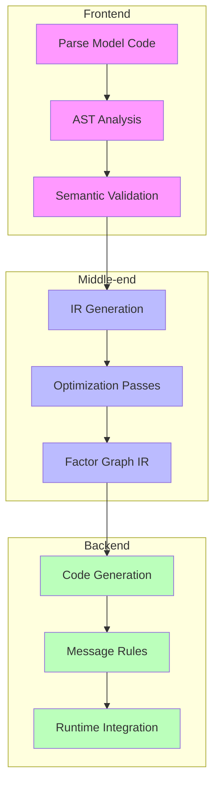
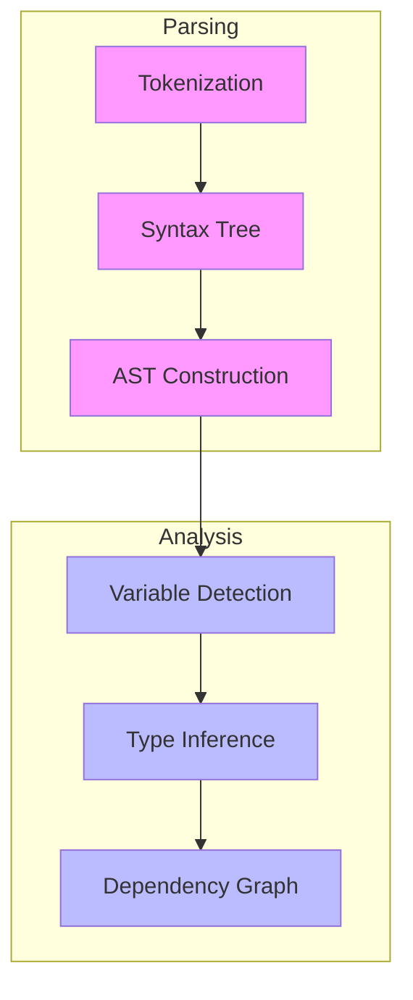
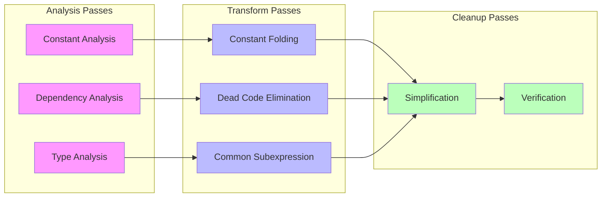
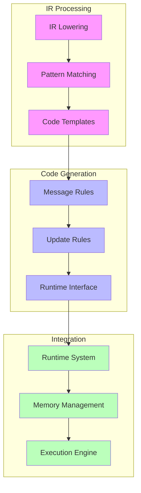

# RxInfer Compiler Pipeline

## Overview

The RxInfer compiler pipeline transforms probabilistic model specifications into optimized executable code for inference. This document details the compilation stages and transformations.



## Frontend Processing

### 1. Model Parsing

```julia
# Model parsing and initial AST creation
function parse_model(expr)
    # Extract model components
    model_name = get_model_name(expr)
    model_args = get_model_args(expr)
    model_body = get_model_body(expr)
    
    # Create initial AST
    ModelAST(
        name = model_name,
        arguments = model_args,
        body = model_body
    )
end
```

### 2. AST Analysis

```julia
# AST analysis for model components
function analyze_ast(ast)
    # Variable analysis
    variables = find_random_variables(ast)
    deterministic = find_deterministic_variables(ast)
    
    # Distribution analysis
    distributions = find_distributions(ast)
    
    # Dependency analysis
    dependencies = analyze_dependencies(ast)
    
    ModelAnalysis(
        variables = variables,
        deterministic = deterministic,
        distributions = distributions,
        dependencies = dependencies
    )
end
```

### AST Processing Flow



## Middle-end Processing

### 1. Intermediate Representation

```julia
# IR node types
abstract type IRNode end

struct VariableNode <: IRNode
    name::Symbol
    distribution::Distribution
    dependencies::Vector{Symbol}
end

struct FactorNode <: IRNode
    variables::Vector{Symbol}
    factor_type::Symbol
    parameters::Dict{Symbol, Any}
end

# IR generation
function generate_ir(analysis)
    ir = ModelIR()
    
    # Create variable nodes
    for var in analysis.variables
        add_variable_node!(ir, var)
    end
    
    # Create factor nodes
    for dist in analysis.distributions
        add_factor_node!(ir, dist)
    end
    
    return ir
end
```

### 2. Optimization Passes

```julia
# Optimization pass manager
struct OptimizationPass
    name::String
    transform::Function
    dependencies::Vector{String}
end

# Example optimization passes
function constant_folding!(ir)
    for node in ir.nodes
        if is_constant_computable(node)
            fold_constant!(ir, node)
        end
    end
end

function dead_code_elimination!(ir)
    for node in ir.nodes
        if !has_dependencies(ir, node)
            remove_node!(ir, node)
        end
    end
end
```

### Optimization Pipeline



## Backend Processing

### 1. Code Generation

```julia
# Code generation for factor nodes
function generate_factor_code(node::FactorNode)
    # Generate message computation code
    forward_code = generate_forward_messages(node)
    backward_code = generate_backward_messages(node)
    
    # Generate update rules
    update_code = generate_update_rules(node)
    
    FactorCode(
        forward = forward_code,
        backward = backward_code,
        update = update_code
    )
end

# Message rule generation
function generate_message_rules(factor::FactorNode)
    quote
        function compute_message($(factor.variables...))
            # Generated message computation code
            $(factor.computation_rules)
        end
    end
end
```

### 2. Runtime Integration

```julia
# Runtime system integration
function generate_runtime_interface(ir)
    # Generate initialization code
    init_code = generate_initialization(ir)
    
    # Generate execution code
    exec_code = generate_execution(ir)
    
    # Generate cleanup code
    cleanup_code = generate_cleanup(ir)
    
    RuntimeCode(
        initialization = init_code,
        execution = exec_code,
        cleanup = cleanup_code
    )
end
```

### Code Generation Flow



## Debugging and Development

### 1. IR Inspection

```julia
# IR visualization
function visualize_ir(ir)
    println("IR Structure:")
    for node in ir.nodes
        println("Node: ", node.name)
        println("  Type: ", typeof(node))
        println("  Dependencies: ", node.dependencies)
    end
end
```

### 2. Code Generation Debugging

```julia
# Debug code generation
function debug_code_generation(node)
    # Show generated code
    println("Generated Code:")
    @show generate_factor_code(node)
    
    # Show optimization passes
    println("\nOptimization Passes:")
    for pass in get_optimization_passes(node)
        println("  - ", pass.name)
    end
end
```

### 3. Performance Analysis

```julia
# Analyze generated code performance
function analyze_code_performance(code)
    # Static analysis
    complexity = analyze_complexity(code)
    memory_usage = analyze_memory_usage(code)
    
    # Runtime analysis
    runtime_stats = @benchmark run_code($code)
    
    CodePerformance(
        complexity = complexity,
        memory = memory_usage,
        runtime = runtime_stats
    )
end
```

## References

- [[ast_transformation|AST Transformation]]
- [[code_generation|Code Generation]]
- [[optimization_passes|Optimization Passes]]
- [[runtime_system|Runtime System]]
- [[debugging_tools|Debugging Tools]] 