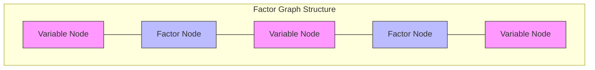
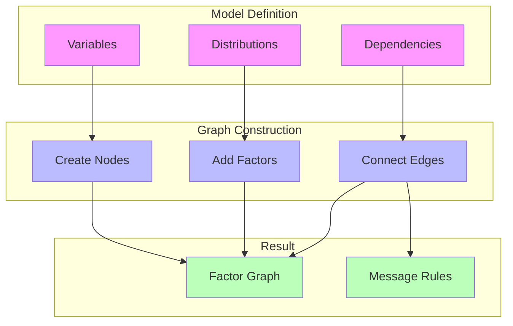
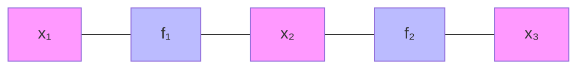
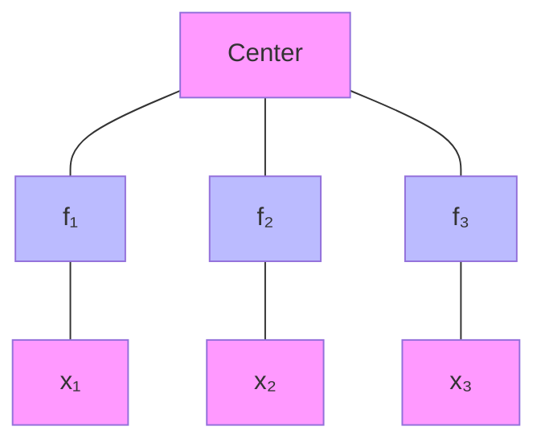
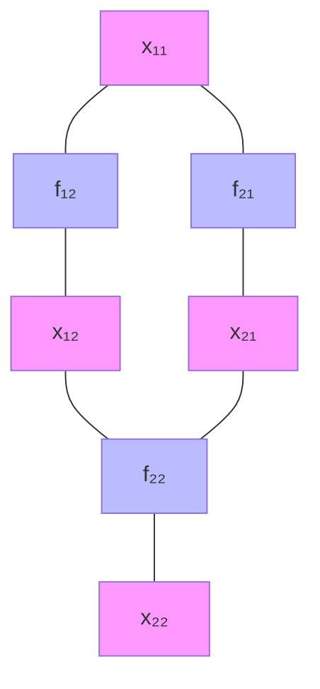
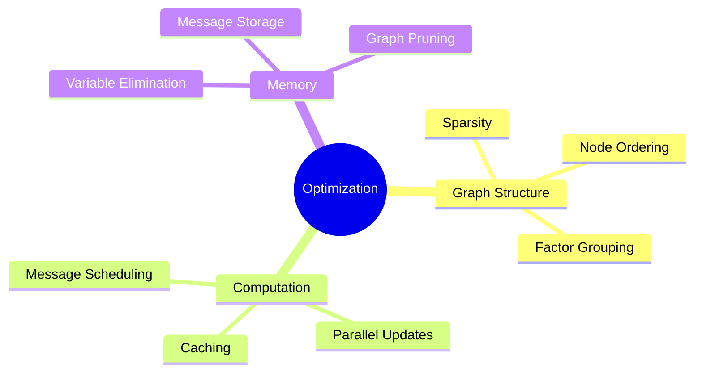

# Factor Graphs in RxInfer

## Overview

Factor graphs in RxInfer provide a powerful graphical representation of probabilistic models. They decompose complex probability distributions into simpler factors, enabling efficient inference through [[message_passing|message passing]].



## Core Components

### 1. Variable Nodes

Represent random variables in your model:

```julia
@model function example_model()
    # Variable nodes are created for:
    x ~ Normal(0, 1)     # Latent variable
    y ~ Normal(x, 1)     # Observable variable
end
```

### 2. Factor Nodes

Represent probability distributions or constraints:

```mermaid
graph LR
    subgraph Factor Types
        F1[Prior Factors]
        F2[Likelihood Factors]
        F3[Constraint Factors]
    end
    subgraph Examples
        E1[Normal(0,1)]
        E2[y|x ~ Normal(x,1)]
        E3[x > 0]
    end
    F1 --> E1
    F2 --> E2
    F3 --> E3
    style F1 fill:#f9f
    style F2 fill:#f9f
    style F3 fill:#f9f
    style E1 fill:#bbf
    style E2 fill:#bbf
    style E3 fill:#bbf
```

### 3. Edges

Connect variables and factors:

```mermaid
graph LR
    subgraph Edge Types
        E1[Variable-Factor]
        E2[Message Forward]
        E3[Message Backward]
    end
    V1[x] --- F1[p(x)]
    F1 --- V2[y]
    style V1 fill:#f9f
    style V2 fill:#f9f
    style F1 fill:#bbf
    style E1 fill:#bfb
    style E2 fill:#bfb
    style E3 fill:#bfb
```

## Graph Construction

### 1. Automatic Construction

RxInfer automatically constructs factor graphs from model definitions:

```julia
@model function linear_model(x, y)
    # Prior on parameters
    α ~ Normal(0, 10)    # Creates variable node α
    β ~ Normal(0, 10)    # Creates variable node β
    
    # Likelihood factor
    y .~ Normal(α .+ β .* x, 1)  # Creates factor connecting α, β, and y
end
```

### Graph Construction Process



## Factor Types

### 1. Distribution Factors

Represent probability distributions:

```julia
# Prior factors
x ~ Normal(0, 1)
θ ~ Beta(1, 1)

# Likelihood factors
y ~ Normal(x, 1)
z ~ Bernoulli(θ)
```

### 2. Deterministic Factors

Represent deterministic relationships:

```julia
@model function deterministic_example()
    x ~ Normal(0, 1)
    y = 2 * x           # Deterministic factor
    z ~ Normal(y, 1)    # Uses the deterministic relationship
end
```

### 3. Constraint Factors

Impose constraints on variables:

```julia
@constraints function model_constraints()
    # Factorization constraints
    q(x, y) = q(x)q(y)
    
    # Distribution family constraints
    q(x) :: NormalMeanPrecision
end
```

## Graph Patterns

### 1. Chain Structure



```julia
@model function chain_model()
    x₁ ~ Normal(0, 1)
    x₂ ~ Normal(x₁, 1)
    x₃ ~ Normal(x₂, 1)
end
```

### 2. Star Structure



```julia
@model function star_model()
    center ~ Normal(0, 1)
    x₁ ~ Normal(center, 1)
    x₂ ~ Normal(center, 1)
    x₃ ~ Normal(center, 1)
end
```

### 3. Grid Structure



## Advanced Topics

### 1. Graph Optimization

Techniques for efficient graph structure:

- Node elimination ordering
- Factor grouping
- Edge reduction

### 2. Custom Factor Types

Creating custom factors:

```julia
struct CustomFactor <: AbstractFactor
    variables::Vector{Variable}
    parameters::Vector{Float64}
end

# Define message computation rules
function compute_message(f::CustomFactor, msg_in)
    # Custom message computation logic
end
```

### 3. Graph Visualization

Visualizing factor graphs:

```julia
using GraphViz

# Visualize factor graph
function visualize_graph(model)
    graph = to_graphviz(model)
    draw(PNG("factor_graph.png"), graph)
end
```

## Best Practices

### 1. Graph Design

- Keep graph structure sparse when possible
- Group related factors
- Consider message passing efficiency

### 2. Performance Optimization



### 3. Debugging

- Visualize graph structure
- Check factor connections
- Monitor message convergence

## References

- [[graphical_models|Graphical Models]]
- [[message_passing|Message Passing]]
- [[variational_inference|Variational Inference]]
- [[model_specification|Model Specification]] 