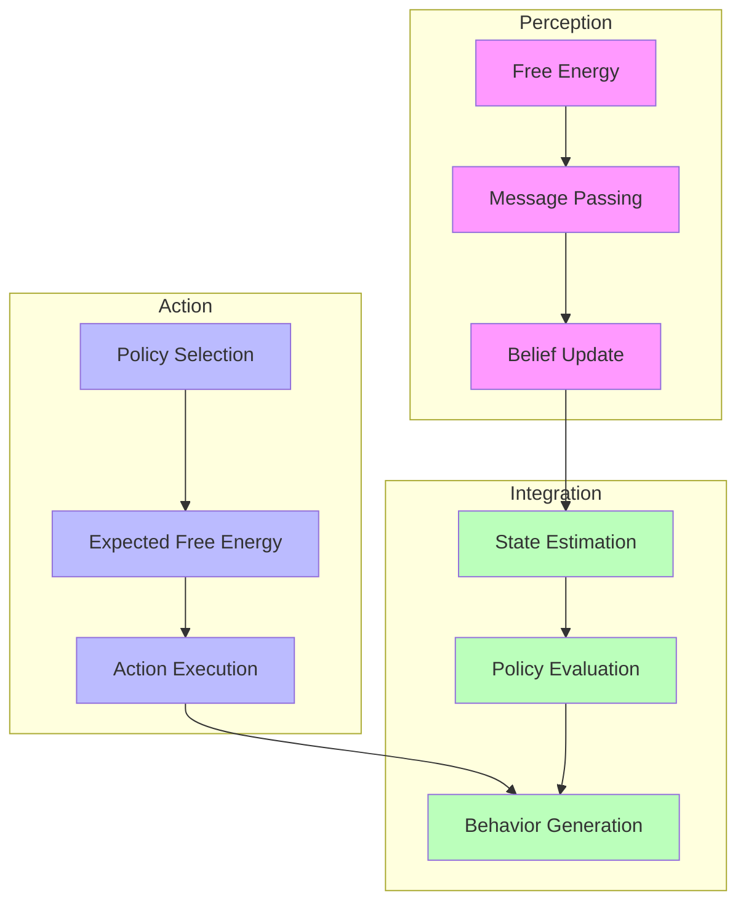
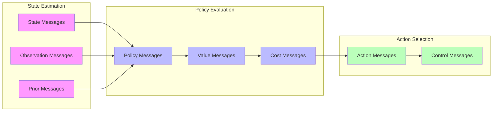

# Free Energy, Message Passing, and Active Inference in RxInfer

## Theoretical Integration

### 1. Unified Framework

The integration of Free Energy, Message Passing, and Active Inference forms a powerful framework for both perception and action:

\[
F[q] = \underbrace{\mathbb{E}_{q(x)}[\log q(x) - \log p(x,y)]}_{\text{Perception}} + \underbrace{\mathbb{E}_{q(\pi)}[\log q(\pi) - \log p(\pi|x)]}_{\text{Action}}
\]

where:
- \(q(x)\) is the variational distribution over hidden states
- \(q(\pi)\) is the policy distribution
- \(p(\pi|x)\) is the posterior policy distribution



## Message Passing for Active Inference

### 1. Active Inference Messages

```julia
# Active inference message types
struct ActiveInferenceMessage
    # State beliefs
    state_distribution::Distribution
    
    # Policy beliefs
    policy_distribution::Distribution
    
    # Expected free energy
    expected_free_energy::Float64
end

# Message computation for active inference
function compute_active_messages(node::ActiveInferenceNode, messages::Vector{Message})
    # Compute state beliefs
    state_belief = compute_state_belief(node, messages)
    
    # Compute policy beliefs
    policy_belief = compute_policy_belief(node, messages, state_belief)
    
    # Compute expected free energy
    expected_fe = compute_expected_free_energy(node, state_belief, policy_belief)
    
    return ActiveInferenceMessage(
        state_belief,
        policy_belief,
        expected_fe
    )
end
```

### 2. Expected Free Energy

```julia
# Expected free energy calculator
struct ExpectedFreeEnergyCalculator
    # Prediction components
    state_predictor::StatePredictor
    observation_predictor::ObservationPredictor
    
    # Value components
    preference_calculator::PreferenceCalculator
    ambiguity_calculator::AmbiguityCalculator
end

function calculate_expected_free_energy(
    calc::ExpectedFreeEnergyCalculator,
    state_belief::Distribution,
    policy::Policy
)
    # Compute predicted states and observations
    predicted_states = predict_states(calc.state_predictor, state_belief, policy)
    predicted_obs = predict_observations(calc.observation_predictor, predicted_states)
    
    # Calculate preference and ambiguity terms
    preference = calculate_preference(calc.preference_calculator, predicted_obs)
    ambiguity = calculate_ambiguity(calc.ambiguity_calculator, predicted_obs)
    
    return preference + ambiguity
end
```

### Message Flow in Active Inference



## Free Energy Minimization in Active Inference

### 1. Policy Optimization

```julia
# Policy optimizer for active inference
struct PolicyOptimizer
    # Free energy components
    state_fe_calculator::FreeEnergyCalculator
    expected_fe_calculator::ExpectedFreeEnergyCalculator
    
    # Policy search
    policy_search::PolicySearchMethod
    
    # Optimization parameters
    temperature::Float64
    horizon::Int
end

function optimize_policy!(opt::PolicyOptimizer, model::ActiveInferenceModel)
    # Compute current free energy
    current_fe = calculate_free_energy(opt.state_fe_calculator, model.state)
    
    # Evaluate policies
    policy_values = evaluate_policies(
        opt.expected_fe_calculator,
        model.state,
        opt.horizon
    )
    
    # Select optimal policy
    optimal_policy = select_policy(
        opt.policy_search,
        policy_values,
        opt.temperature
    )
    
    return optimal_policy
end
```

### 2. Action Selection

```julia
# Action selector
struct ActionSelector
    # Selection strategies
    deterministic::DeterministicSelector
    stochastic::StochasticSelector
    
    # Selection parameters
    exploration_rate::Float64
    decision_threshold::Float64
end

function select_action!(selector::ActionSelector, policy::Policy)
    if rand() < selector.exploration_rate
        # Explore: stochastic selection
        action = select_stochastic(selector.stochastic, policy)
    else
        # Exploit: deterministic selection
        action = select_deterministic(selector.deterministic, policy)
    end
    
    return action
end
```

## Integration Components

### 1. Active Inference Model

```julia
# Complete active inference model
struct ActiveInferenceModel
    # Model components
    state_space::StateSpace
    observation_model::ObservationModel
    transition_model::TransitionModel
    
    # Inference components
    message_passer::MessagePasser
    fe_calculator::FreeEnergyCalculator
    
    # Action components
    policy_optimizer::PolicyOptimizer
    action_selector::ActionSelector
end

function step!(model::ActiveInferenceModel, observation::Observation)
    # Update state beliefs through message passing
    update_beliefs!(model.message_passer, observation)
    
    # Optimize policy using free energy
    policy = optimize_policy!(model.policy_optimizer, model)
    
    # Select action
    action = select_action!(model.action_selector, policy)
    
    return action
end
```

### 2. Perception-Action Cycle

```julia
# Perception-action cycle implementation
struct PerceptionActionCycle
    # Cycle components
    perception::PerceptionModule
    action::ActionModule
    
    # Integration
    coordinator::CycleCoordinator
    
    # Monitoring
    monitor::CycleMonitor
end

function run_cycle!(cycle::PerceptionActionCycle, environment::Environment)
    while !is_terminal(environment)
        # Perception phase
        observation = observe(environment)
        update_perception!(cycle.perception, observation)
        
        # Action phase
        action = select_action!(cycle.action, cycle.perception.beliefs)
        execute_action!(environment, action)
        
        # Monitor and coordinate
        update_cycle!(cycle.coordinator, cycle.monitor)
    end
end
```

## Advanced Features

### 1. Hierarchical Active Inference

```julia
# Hierarchical model structure
struct HierarchicalActiveInference
    # Hierarchical levels
    levels::Vector{InferenceLevel}
    
    # Level connections
    connections::Dict{Int, Vector{Int}}
    
    # Message passing
    hierarchical_messenger::HierarchicalMessenger
end

function process_hierarchy!(model::HierarchicalActiveInference, observation::Observation)
    # Bottom-up message passing
    bottom_up_messages = compute_bottom_up(model.hierarchical_messenger, observation)
    
    # Top-down message passing
    top_down_messages = compute_top_down(model.hierarchical_messenger, bottom_up_messages)
    
    # Update all levels
    update_levels!(model.levels, bottom_up_messages, top_down_messages)
end
```

### 2. Adaptive Learning

```julia
# Adaptive learning system
struct AdaptiveLearner
    # Learning components
    parameter_learner::ParameterLearner
    structure_learner::StructureLearner
    
    # Adaptation criteria
    adaptation_monitor::AdaptationMonitor
    
    # Learning parameters
    learning_rate::Float64
    adaptation_threshold::Float64
end

function adapt_model!(learner::AdaptiveLearner, model::ActiveInferenceModel)
    # Monitor performance
    performance = evaluate_performance(learner.adaptation_monitor, model)
    
    if performance < learner.adaptation_threshold
        # Update parameters
        update_parameters!(learner.parameter_learner, model)
        
        # Update structure if needed
        update_structure!(learner.structure_learner, model)
    end
end
```

## Practical Applications

### 1. Decision Making

```julia
# Decision making system
struct DecisionMaker
    # Decision components
    belief_evaluator::BeliefEvaluator
    policy_evaluator::PolicyEvaluator
    
    # Decision criteria
    utility_calculator::UtilityCalculator
    risk_assessor::RiskAssessor
end

function make_decision!(dm::DecisionMaker, model::ActiveInferenceModel)
    # Evaluate current beliefs
    belief_value = evaluate_beliefs(dm.belief_evaluator, model.beliefs)
    
    # Evaluate policies
    policy_value = evaluate_policies(dm.policy_evaluator, model.policies)
    
    # Calculate utilities and risks
    utilities = calculate_utilities(dm.utility_calculator, belief_value, policy_value)
    risks = assess_risks(dm.risk_assessor, utilities)
    
    return select_best_option(utilities, risks)
end
```

### 2. Online Learning

```julia
# Online learning system
struct OnlineLearner
    # Learning components
    state_learner::StateLearner
    policy_learner::PolicyLearner
    
    # Memory system
    experience_buffer::ExperienceBuffer
    
    # Learning parameters
    update_frequency::Int
    batch_size::Int
end

function update_online!(learner::OnlineLearner, experience::Experience)
    # Store experience
    store_experience!(learner.experience_buffer, experience)
    
    if should_update(learner)
        # Sample batch
        batch = sample_batch(learner.experience_buffer, learner.batch_size)
        
        # Update state and policy learning
        update_state_learning!(learner.state_learner, batch)
        update_policy_learning!(learner.policy_learner, batch)
    end
end
```

## References

- [[active_inference|Active Inference]]
- [[free_energy|Free Energy Principle]]
- [[message_passing|Message Passing]]
- [[variational_inference|Variational Inference]]
- [[decision_making|Decision Making]] 