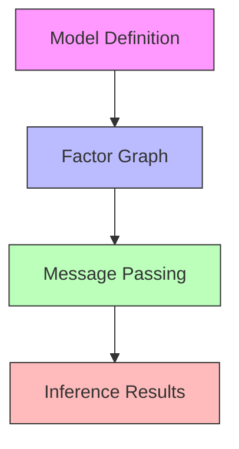
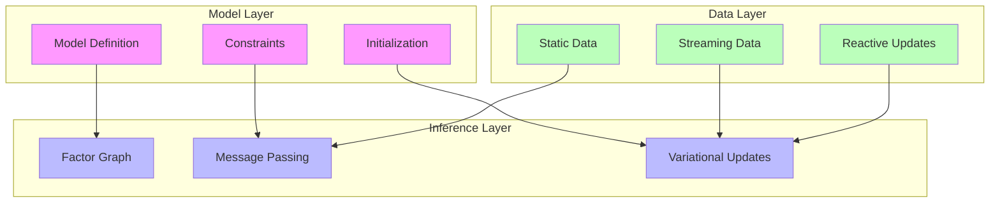
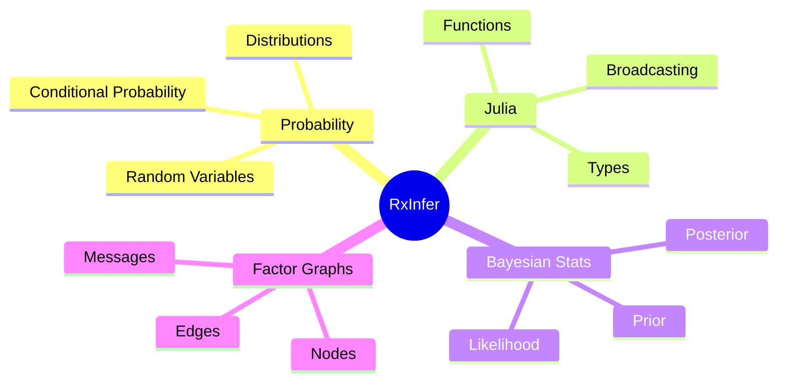
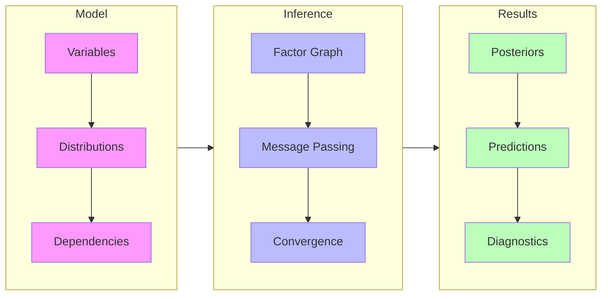
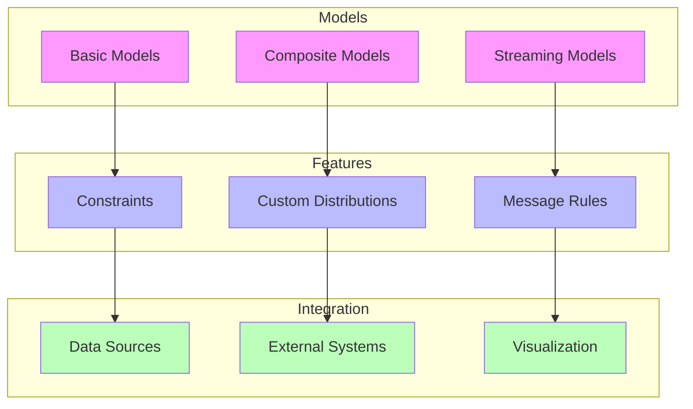
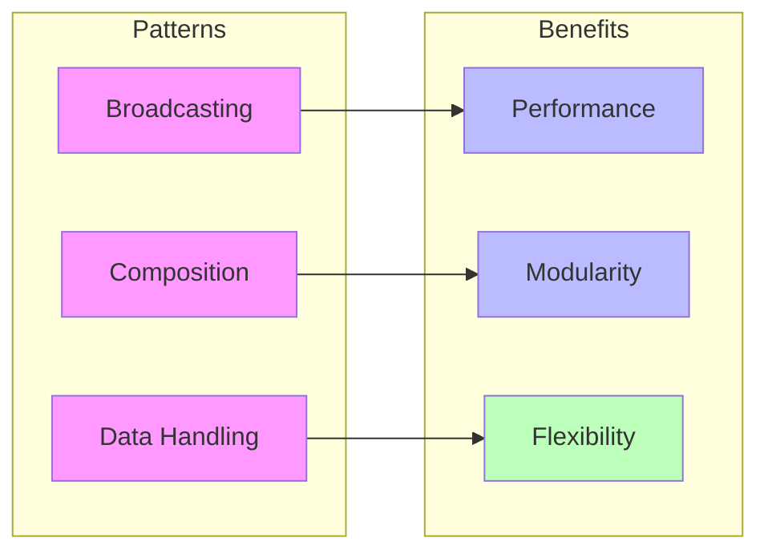
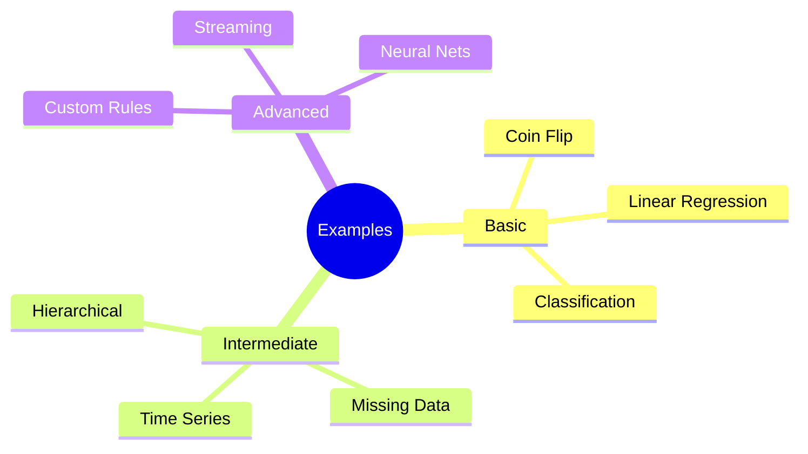
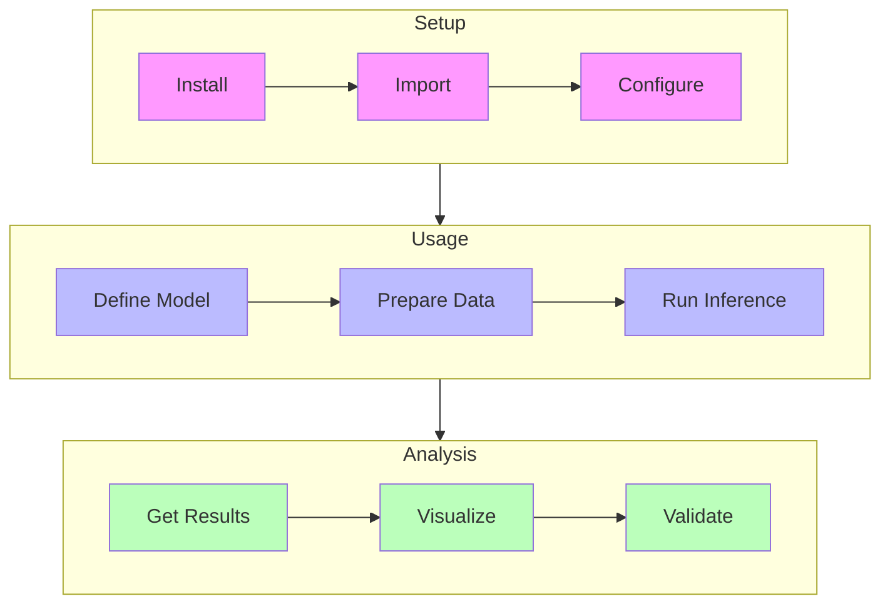

# Getting Started with RxInfer

## Overview

RxInfer is a Julia package for [[bayesian_inference|Bayesian Inference]] that combines the power of [[factor_graphs|factor graphs]] with [[reactive_programming|reactive programming]] principles. This guide will help you get started with RxInfer and understand its core concepts.



### Architecture Overview



## Prerequisites

Before diving into RxInfer, you should have:

1. [[julia_installation|Julia]] installed (version 1.6 or higher)
2. Basic understanding of:
   - [[probability_theory|Probability Theory]]
   - [[bayesian_statistics|Bayesian Statistics]]
   - [[julia_programming|Julia Programming]]

### Conceptual Prerequisites



## Installation

Install RxInfer through Julia's package manager:

```julia
using Pkg
Pkg.add("RxInfer")
```

Or in package mode (`]`):

```julia
] add RxInfer
```

## Basic Concepts

RxInfer is built around three main concepts:

1. **[[model_specification|Model Specification]]**: Using the `@model` macro to define probabilistic models
2. **[[inference_execution|Inference Execution]]**: Running inference on your models with static or streaming data
3. **[[results_analysis|Results Analysis]]**: Analyzing posterior distributions and predictions

### Core Components Interaction



## Your First Model

Let's create a simple coin flipping model to demonstrate RxInfer's basics:

```julia
using RxInfer, Distributions

# Define a model for coin flips
@model function coin_model(y)
    # Prior belief about coin fairness
    θ ~ Beta(1, 1)  # Uniform prior
    
    # Likelihood of observations
    y .~ Bernoulli(θ)
end

# Generate some synthetic data
true_bias = 0.7
data = rand(Bernoulli(true_bias), 100)

# Run inference
result = infer(
    model = coin_model(),
    data = (y = data,)
)

# Access the posterior distribution
posterior_θ = result.posteriors[:θ]
```

### Visualizing Results

```julia
using Plots

# Plot prior and posterior distributions
plot(x -> pdf(Beta(1, 1), x), 0, 1, label="Prior")
plot!(x -> pdf(posterior_θ, x), 0, 1, label="Posterior")
vline!([true_bias], label="True Value")
```

## Core Features

### 1. Model Specification

RxInfer uses a declarative syntax for model specification through the [[model_macro|@model]] macro:

```julia
@model function linear_regression(x, y)
    # Priors
    α ~ Normal(0, 10)    # Intercept
    β ~ Normal(0, 10)    # Slope
    σ ~ Gamma(1, 1)      # Noise
    
    # Likelihood
    y .~ Normal(α .+ β .* x, σ)
end
```

### 2. Data Conditioning

You can condition models on data in several ways:

```julia
# Using named tuple
model | (x = [1,2,3], y = [2,4,6])

# Using dictionary
model | Dict(:x => [1,2,3], :y => [2,4,6])

# Using deferred data for streaming
model | (x = RxInfer.DeferredDataHandler(),)
```

### 3. Inference Types

RxInfer supports multiple [[inference_paradigms|inference paradigms]]:

```julia
# Static inference
result = infer(
    model = my_model(),
    data = my_data
)

# Streaming inference
result = infer(
    model = my_model(),
    datastream = my_stream,
    autoupdates = my_updates
)
```

## Advanced Features

### Component Relationships



### 1. Working with Constraints

For more complex models, you might need to specify [[variational_constraints|variational constraints]]:

```julia
# Define constraints
@constraints function model_constraints()
    # Mean-field factorization
    q(x, y) = q(x)q(y)
    
    # Distribution families
    q(x) :: NormalMeanPrecision
    q(y) :: GammaShapeRate
end

# Use constraints in inference
result = infer(
    model = my_model(),
    data = my_data,
    constraints = model_constraints()
)
```

### 2. Model Initialization

Some models require initialization of [[messages_and_marginals|messages or marginals]]:

```julia
# Define initialization
@initialization begin
    # Initialize marginals
    q(x) = vague(NormalMeanPrecision)
    
    # Initialize messages
    μ(y) = vague(NormalMeanPrecision)
end

# Use initialization in inference
result = infer(
    model = my_model(),
    data = my_data,
    initialization = my_init
)
```

### 3. Custom Distributions

Create [[custom_distributions|custom distributions]] for specialized models:

```julia
struct MyDistribution <: Distribution
    params::Vector{Float64}
end

# Define required methods
Distributions.pdf(d::MyDistribution, x::Real) = # ...
Distributions.logpdf(d::MyDistribution, x::Real) = # ...
```

## Common Patterns and Best Practices

### Design Pattern Relationships



## Interactive Examples

### Example Categories



Visit our [[rxinfer_examples|interactive examples]] for hands-on tutorials:

1. [[basic_inference|Basic Inference Tutorial]]
2. [[streaming_data|Streaming Data Tutorial]]
3. [[custom_models|Custom Models Tutorial]]

## Troubleshooting

Common issues and their solutions:

1. **Installation Problems**
   - Check Julia version compatibility
   - Verify package dependencies
   - [[installation_guide|Installation Guide]]

2. **Runtime Errors**
   - [[type_errors|Type Errors]]
   - [[dimension_mismatch|Dimension Mismatch]]
   - [[convergence_issues|Convergence Issues]]

3. **Performance Issues**
   - [[performance_guide|Performance Guide]]
   - [[optimization_tips|Optimization Tips]]
   - [[profiling_guide|Profiling Guide]]

## Next Steps

1. Explore the [[model_macro_paradigm|@model Macro Paradigm]]
2. Learn about [[streaming_inference|Streaming Inference]]
3. Understand [[variational_inference|Variational Inference]]
4. Study [[factor_graphs|Factor Graphs]]
5. Practice with [[example_gallery|Example Gallery]]

## Community and Support

- [[github_repository|GitHub Repository]]
- [[documentation|Documentation]]
- [[discourse_forum|Discourse Forum]]
- [[slack_channel|Slack Channel]]
- [[stack_overflow|Stack Overflow Tag]]

## References

- [[rxinfer_documentation|RxInfer Documentation]]
- [[graphppl_documentation|GraphPPL Documentation]]
- [[message_passing_algorithms|Message Passing Algorithms]]
- [[variational_inference_theory|Variational Inference Theory]]
- [[reactive_programming_concepts|Reactive Programming Concepts]]
- [[julia_documentation|Julia Documentation]]

## Quick Reference

### Common Operations

