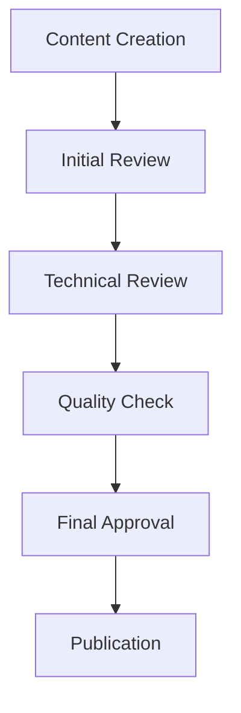

# Content Management Guide

---

title: Content Management Guide

type: guide

status: stable

created: 2024-02-06

tags:

  - content

  - management

  - maintenance

  - organization

semantic_relations:

  - type: implements

    links: [[documentation_standards]]

  - type: relates

    links:

      - [[knowledge_organization]]

      - [[version_control]]

---

## Overview

This guide establishes comprehensive content management practices for maintaining, updating, and evolving documentation in our cognitive modeling framework.

## Content Lifecycle

### 1. Content Creation

```python

# @content_creation

content_workflow = {

    "planning": {

        "needs_analysis": ["documentation_standards", "knowledge_organization"],

        "structure_design": ["ai_documentation_style", "linking_patterns"],

        "template_selection": ["ai_concept_template", "package_component"]

    },

    "development": {

        "content_writing": ["documentation_guide", "example_writing"],

        "review_process": ["validation_framework", "quality_metrics"],

        "integration": ["linking_completeness", "knowledge_organization"]

    },

    "publication": {

        "validation": ["validation_tools", "quality_metrics"],

        "deployment": ["git_workflow", "version_control"],

        "announcement": ["changelog", "release_management"]

    }

}

```

### 2. Content Maintenance

```python

# @maintenance_workflow

maintenance_process = {

    "regular_review": {

        "schedule": "Monthly",

        "tasks": [

            "Content accuracy check",

            "Link validation",

            "Quality assessment"

        ],

        "tools": ["validation_tools", "analysis_tools"]

    },

    "updates": {

        "schedule": "As needed",

        "triggers": [

            "New features",

            "Bug fixes",

            "User feedback"

        ],

        "process": ["version_control", "changelog"]

    },

    "archival": {

        "schedule": "Yearly",

        "tasks": [

            "Obsolete content review",

            "Version archiving",

            "Migration planning"

        ],

        "tools": ["archival_tools", "migration_guide"]

    }

}

```

## Content Organization

### 1. Repository Structure

See [[ai_folder_structure]] for detailed organization.

```python

# @repository_structure

content_structure = {

    "active_content": {

        "location": "docs/",

        "organization": "knowledge_organization",

        "management": "version_control"

    },

    "archived_content": {

        "location": "archive/",

        "organization": "archival_structure",

        "management": "archival_policy"

    },

    "temporary_content": {

        "location": "drafts/",

        "organization": "draft_management",

        "management": "review_process"

    }

}

```

### 2. Version Management

See [[version_control]] for implementation details.

```python

# @version_management

version_strategy = {

    "branching": {

        "main": "Stable documentation",

        "develop": "Work in progress",

        "feature": "New content development",

        "release": "Version preparation"

    },

    "tagging": {

        "pattern": "v{major}.{minor}.{patch}",

        "rules": "versioning_standards",

        "process": "release_management"

    }

}

```

## Content Processing

### 1. Content Pipeline


### 2. Quality Control Implementation


## Implementation Integration

### 1. Knowledge Graph Integration


### 2. Version Control Integration


## Review Process

### 1. Review Workflow



### 2. Review Criteria

```python

# @review_criteria

review_requirements = {

    "technical_accuracy": {

        "concept_correctness": True,

        "implementation_accuracy": True,

        "code_validity": True

    },

    "documentation_quality": {

        "clarity": 0.9,              # 90% clarity score

        "completeness": 0.95,        # 95% completeness

        "consistency": 1.0           # 100% consistency

    },

    "integration": {

        "link_validity": 1.0,        # All links valid

        "cross_references": True,    # Cross-refs present

        "knowledge_graph": True      # Graph integration

    }

}

```

## Maintenance Procedures

### 1. Regular Updates

```python

# @update_procedures

update_workflow = {

    "scheduled_review": {

        "frequency": "Monthly",

        "tasks": [

            "Content review",

            "Link validation",

            "Quality assessment"

        ]

    },

    "content_updates": {

        "triggers": [

            "New features",

            "Bug fixes",

            "User feedback"

        ],

        "process": "update_process"

    },

    "version_control": {

        "branching": "git_workflow",

        "releases": "release_management",

        "changelog": "changelog"

    }

}

```

### 2. Content Migration

```python

# @migration_procedures

migration_workflow = {

    "planning": {

        "impact_analysis": True,

        "timeline_planning": True,

        "communication_plan": True

    },

    "execution": {

        "content_update": True,

        "link_updates": True,

        "validation": True

    },

    "verification": {

        "quality_check": True,

        "integration_test": True,

        "user_acceptance": True

    }

}

```

## Archival Strategy

### 1. Content Archival

```python

# @archival_strategy

archival_rules = {

    "criteria": {

        "age": "> 2 years",

        "relevance": "Low",

        "usage": "< 10 views/month"

    },

    "process": {

        "review": "Manual review",

        "approval": "Team lead",

        "archival": "Automated"

    },

    "storage": {

        "location": "archive/",

        "format": "Markdown + metadata",

        "indexing": "Required"

    }

}

```

### 2. Version Archives

```python

# @version_archives

archive_management = {

    "major_versions": {

        "retention": "Permanent",

        "format": "Full snapshot",

        "accessibility": "Public"

    },

    "minor_versions": {

        "retention": "2 years",

        "format": "Differential",

        "accessibility": "Internal"

    },

    "patches": {

        "retention": "6 months",

        "format": "Changelog only",

        "accessibility": "Internal"

    }

}

```

## Best Practices

### 1. Content Creation

- Follow [[documentation_standards]]

- Use [[ai_documentation_style]]

- Implement [[linking_patterns]]

- Validate with [[quality_metrics]]

### 2. Content Maintenance

- Regular reviews

- Proactive updates

- Link validation

- Quality monitoring

### 3. Version Control

- Follow [[git_workflow]]

- Maintain [[changelog]]

- Use [[version_tags]]

- Document migrations

## Related Documentation

- [[documentation_standards]]

- [[knowledge_organization]]

- [[version_control]]

- [[quality_metrics]]

## References

- [[documentation_guide]]

- [[validation_framework]]

- [[archival_policy]]

- [[migration_guide]]

## Implementation Examples

### 1. Content Analysis Example


### 2. Content Processing Example


### 3. Content Validation Example

